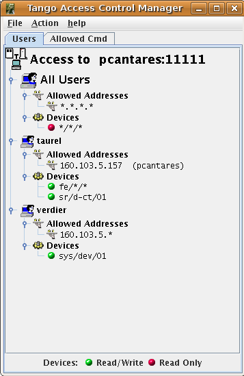

.. _access_control:

The Tango controlled access system
==================================

User rights definition
----------------------

Within the Tango controlled system, you give rights to a user. User is
the name of the user used to log-in the computer where the application
trying to access a device is running. Two kind of users are defined:

#. Users with defined rights

#. Users without any rights defined in the controlled system. These
   users will have the rights associated with the pseudo-user called All
   Users

The controlled system manages two kind of rights:

-  Write access meaning that all type of requests are allowed on the
   device

-  Read access meaning that only read-like access are allowed
   (write\_attribute, write\_read\_attribute and set\_attribute\_config
   network calls are forbidden). Executing a command is also forbidden
   except for commands defined as **Allowed commands**. Getting a device
   state or status using the command\_inout call is always allowed. The
   definition of the allowed commands is done at the device class level.
   Therefore, all devices belonging to the same class will have the
   allowed commands set.

The rights given to a user is the check result splitted in two levels:

#. At the host level: You define from which hosts the user may have
   write access to the control system by specifying the host name. If
   the request comes from a host which is not defined, the right will be
   Read access. If nothing is defined at this level for the user, the
   rights of the All Users user will be used. It is also possible to
   specify the host by its IP address. You can define a host family
   using wide-card in the IP address (eg. 160.103.11.\* meaning any host
   with IP address starting with 160.103.11). Only IP V4 is supported.

#. At the device level: You define on which device(s) request are
   allowed using device name. Device family can be used using widecard
   in device name like domin/family/\*

Therefore, the controlled system is doing the following checks when a
client try to access a device:

-  Get the user name

-  Get the host IP address

-  If rights defined at host level for this specific user and this IP
   address, gives user temporary write acccess to the control system

-  If nothing is specified for this specific user on this host, gives to
   the user a temporary access right equal to the host access rights of
   the All User user.

-  If the temporary right given to the user is write access to the
   control system

   -  If something defined at device level for this specific user

      -  If there is a right defined for the device to be accessed (or
         for the device family), give user the defined right

      -  Else

         -  If rights defined for the All Users user for this device,
            give this right to the user

         -  Else, give user the Read Access for this device

   -  Else

      -  If there is a right defined for the device to be accessed (or
         for the device family) for the All User user, give user this
         right

      -  Else, give user the Read Access right for this device

-  Else, access right will be Read Access

Then, when the client tries to access the device, the following
algorithm is used:

-  If right is Read Access

   -  If the call is a write type call, refuse the call

   -  If the call is a command execution

      -  If the command is one of the command defined in the Allowed
         commands for the device class, send the call

      -  Else, refuse the call

All these checks are done during the DeviceProxy instance constructor
except those related to the device class allowed commands which are
checked during the command\_inout call.

To simplify the rights management, give the All Users user host access
right to all hosts (.\*.\*.\*) and read access to all devices (/\*/\*).
With such a set-up for this user, each new user without any rights
defined in the controlled access will have only Read Access to all
devices on the control system but from any hosts. Then, on request,
gives Write Access to specific user on specific host (or family) and on
specific device (or family).

The rights managements are done using the Tango
Astor [ASTOR]_ tool which has some graphical windows
allowing to grant/revoke user rights and to define device class allowed
commands set. The following window dump shows this Astor window.

|image21|

In this example, the user taurel has Write Access to the device
sr/d-ct/1 and to all devices belonging to the domain fe but only from
the host pcantares He has read access to all other devices but always
only from the host pcantares. The user verdier has write access to the
device sys/dev/01 from any host on the network 160.103.5 and Read Access
to all the remaining devices from the same network. All the other users
has only Read Access but from any host.

Running a Tango control system with the controlled access
---------------------------------------------------------

All the users rights are stored in two tables of the Tango database. A
dedicated device server called **TangoAccessControl** access these
tables without using the classical Tango database server. This
TangoAccessControl device server must be configured with only one
device. The property **Services** belonging to the free object
**CtrlSystem** is used to run a Tango control system with its controlled
access. This property is an array of string with each string describing
the service(s) running in the control system. For controlled access, the
service name is AccessControl. The service instance name has to be
defined as tango. The device name associated with this service must be
the name of the TangoAccessControl server device. For instance, if the
TangoAccessControl device server device is named
*sys/access\_control/1*, one element of the Services property of the
CtrlSystem object has to be set to

AccessControl/tango:sys/access\_control/1

If the service is defined but without a valid device name corresponding
to the TangoAccessControl device server, all users from any host will
have write access (simulating a Tango control system without controlled
access). Note that this device server connects to the MySQL database and
therefore may need the MySQL connection related environment variables
MYSQL\_USER and MYSQL\_PASSWORD described in [sub:Db-Env-Variables]

Even if a controlled access system is running, it is possible to by-pass
it if, in the environment of the client application, the environment
variable SUPER\_TANGO is defined to true. If for one reason or another,
the controlled access server is defined but not accessible, the device
right checked at that time will be Read Access.
