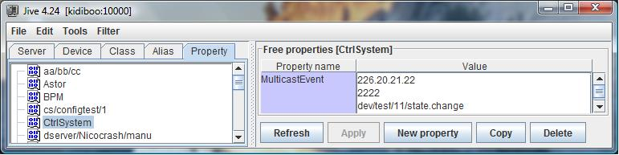

.. _services_events:

Event system
============

Using multicast protocol to transfer events
-------------------------------------------

This feature is available starting with Tango 8.1. Transferring events
using a multicast protocol means delivering the events to a group of
clients simultaneously in a single transmission from the event source.
Tango, through ZMQ, uses the OpenPGM multicating protocol. This is one
implementation of the PGM protocol defined by the RFC 3208 (Reliable
multicasting protocol). Nevertheless, the default event communication
mode is unicast and propagating events via multicasting requires some
specific configuration.

Configuring events to use multicast transport
~~~~~~~~~~~~~~~~~~~~~~~~~~~~~~~~~~~~~~~~~~~~~

Before using multicasting transport for event(s), you have to choose
which address and port have to be used. In a IP V4 network, only a
limited set of addresses are associated with multicasting. These are the
IP V4 addresses between

224.0.1.0 and 238.255.255.255

Once the address is selected, you have to choose a port number. Together
with the event name, these are the two minimum configuration
informations which have to be provided to Tango to get multicast
transport. This configuration is done using the **MulticastEvent** free
property associated to the **CtrlSystem** object.

|image19|

In the above window dump of the Jive tool, the *change* event on the
*state* attribute of the *dev/test/11* device has to be transferred
using multicasting with the address *226.20.21.22* and the port number
*2222*. The exact definition of this CtrlSystem/MulticastEvent property
for one event propagated using multicast is

.. code:: cpp
  :number-lines:

   CtrlSystem->MulticastEvent:   Multicast address,
                                 port number,
                                 [rate in Mbit/sec],
                                 [ivl in seconds],
                                 event name

Rate and Ivl are optional properties. In case several events have to be
transferred using multicasting, simply extend the MulicastEvent property
with the configuration parameters related to the other events. There is
only one MultiCastEvent property per Tango control system. The
underlying multicast protocol (PGM) is rate limited. This means that it
limits its network bandwidth usage to a user defined value. The optional
third configuration parameter is the maximum rate (in Mbit/sec) that the
protocol will use to transfert this event. Because PGM is a reliable
protocol, data has to be buffered for re-transmission in case a receiver
signal some lost data. The optional forth configuration parameter
specify the maximum amount of time (in seconds) that a receiver can be
absent for a multicast group before unrecoverable data loss will occur.
Exercise care when setting large recovery interval as the data needed
for recovery will be held in memory. For example, a 60 seconds (1
minute) recovery interval at a data rate of 1 Gbit/sec requires a 7
GBytes in-memory buffer. Whan any of these two optional parameters are
not set, the default value (defined in next sub-chapter) are used. Here
is another example of events using multicasting configuration

|image20|

In this example, there are 5 events which are transmitted using
multicasting:

#. Event *change* for attribute *state* on device *dev/test/11* which
   uses multicasting address *226.20.21.22* and port number *2222*

#. Event *periodic* for attribute *state* on device *dev/test/10* which
   uses multicasting address *226.20.21.22* and port number *3333*

#. Event *change* for attribute *ImaAttr* on device *et/ev/01* which
   uses multicasting address *226.30.31.32* and port number *4444*. Note
   that this event uses a rate set to *40 Mbit/sec* and a ivl set to *20
   seconds*.

#. Event *change* for attribute *event\_change\_tst* on device
   *dev/test/12* which uses multicasting address *226.20.21.22* and port
   number *2233*

#. Event *archive* for attribute *event\_change\_tst* on device
   *dev/tomasz/3* which uses multicasting address *226.20.21.22* and
   port number *2234*

Default multicast related properties
~~~~~~~~~~~~~~~~~~~~~~~~~~~~~~~~~~~~

On top of the MulticastEvent property previously described, Tango
supports three properties to defined default value for multicast
transport tuning. These properties are:

-  **MulticastRate** associated to the CtrlSystem object. This defines
   the maximum rate will will be used by the multicast protocol when
   transferring event. The unit is Mbit/sec. In case this property is
   not defined, the Tango library used a value of 80 Mbit/sec.

-  **MulticastIvl** associated to the CtrlSystem object. It specifies
   the maximusm time (in sec) during which data has to be buffered for
   re-transmision in case a receiver signals some lost data. The unit
   is seconds. In case this property is not defined, the Tango library
   takes a value of 20 seconds.

-  **MulticastHops** associated to the CtrlSystem object. This property
   defines the maximum number of element (router), the multicast packet
   is able to cross. Each time one element is crossed, the value is
   decremented. When it reaches 0, the packet is not transferred any
   more. In case this property is not defined, the Tango library uses a
   value of 5.

Events in Tango releases lower than 8
-------------------------------------

.. toctree::
   :maxdepth: 2

   notifd2db