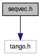

+----------+---------------------------------------+
| |Logo|   | Tango Core Classes Reference  9.2.5   |
+----------+---------------------------------------+

-  `Main Page <../../index.html>`__
-  `Related Pages <../../pages.html>`__
-  `Modules <../../modules.html>`__
-  `Namespaces <../../namespaces.html>`__
-  `Classes <../../annotated.html>`__
-  `Files <../../files.html>`__

-  `File List <../../files.html>`__
-  `File Members <../../globals.html>`__

`Namespaces <#namespaces>`__ \| `Functions <#func-members>`__

seqvec.h File Reference

| ``#include <tango.h>``

Include dependency graph for seqvec.h:

|image1|

`Go to the source code of this
file. <../../d0/df4/seqvec_8h_source.html>`__

Namespaces
----------

 

`Tango <../../de/ddf/namespaceTango.html>`__

 

| =============================================================================

 

Functions
---------

void 

`Tango::operator<< <../../dd/dd6/group__Ope.html#ga065f1fbeb02af4e92d4029235f2a186e>`__
(DevVarCharArray &lval, const vector< unsigned char > &rval)

 

| Init a DevVarCharArray from a C++ vector of char(s).
`More... <../../dd/dd6/group__Ope.html#ga065f1fbeb02af4e92d4029235f2a186e>`__

 

void 

`Tango::operator<< <../../dd/dd6/group__Ope.html#gae546232aa642350a7e19a4a5e4698289>`__
(vector< unsigned char > &lval, const DevVarCharArray &rval)

 

| Init a C++ vector of char from a DevVarCharArray.
`More... <../../dd/dd6/group__Ope.html#gae546232aa642350a7e19a4a5e4698289>`__

 

void 

`Tango::operator<< <../../dd/dd6/group__Ope.html#gaff6627037d30a75ace59447d67a0b0f1>`__
(DevVarShortArray &lval, const vector< short > &rval)

 

| Init a DevVarShortArray from a C++ vector of short(s).
`More... <../../dd/dd6/group__Ope.html#gaff6627037d30a75ace59447d67a0b0f1>`__

 

void 

`Tango::operator<< <../../dd/dd6/group__Ope.html#ga712cfcf813b0f2a0201ccf74343b05a5>`__
(vector< short > &lval, const DevVarShortArray &rval)

 

| Init a C++ vector of short from a DevVarShortArray.
`More... <../../dd/dd6/group__Ope.html#ga712cfcf813b0f2a0201ccf74343b05a5>`__

 

void 

`Tango::operator<< <../../dd/dd6/group__Ope.html#ga65fc9c8f67a267ecb0002c0169dbbf8e>`__
(DevVarLongArray &lval, const vector< DevLong > &rval)

 

| Init a DevVarLongArray from a C++ vector of DevLong(s).
`More... <../../dd/dd6/group__Ope.html#ga65fc9c8f67a267ecb0002c0169dbbf8e>`__

 

void 

`Tango::operator<< <../../dd/dd6/group__Ope.html#gaeb08b2bed8f7c2583e3457bc862dc6b0>`__
(vector< DevLong > &lval, const DevVarLongArray &rval)

 

| Init a C++ vector of DevLong from a DevVarLongArray.
`More... <../../dd/dd6/group__Ope.html#gaeb08b2bed8f7c2583e3457bc862dc6b0>`__

 

void 

`Tango::operator<< <../../dd/dd6/group__Ope.html#ga73604d8da674eeeb83248e3ec792cde2>`__
(DevVarLong64Array &lval, const vector< DevLong64 > &rval)

 

| Init a DevVarLongArray from a C++ vector of DevLong64(s).
`More... <../../dd/dd6/group__Ope.html#ga73604d8da674eeeb83248e3ec792cde2>`__

 

void 

`Tango::operator<< <../../dd/dd6/group__Ope.html#ga90a170909487d4e37dfcb485535e02cc>`__
(vector< DevLong64 > &lval, const DevVarLong64Array &rval)

 

| Init a C++ vector of long from a DevVarLong64Array.
`More... <../../dd/dd6/group__Ope.html#ga90a170909487d4e37dfcb485535e02cc>`__

 

void 

`Tango::operator<< <../../dd/dd6/group__Ope.html#gad4eb2b96584b07d3aaf2789c98c7eda6>`__
(DevVarFloatArray &lval, const vector< float > &rval)

 

| Init a DevVarFloatArray from a C++ vector of float(s).
`More... <../../dd/dd6/group__Ope.html#gad4eb2b96584b07d3aaf2789c98c7eda6>`__

 

void 

`Tango::operator<< <../../dd/dd6/group__Ope.html#ga94906cc22d983d10ddd78d24d176c6ae>`__
(vector< float > &lval, const DevVarFloatArray &rval)

 

| Init a C++ vector of long from a DevVarFloatArray.
`More... <../../dd/dd6/group__Ope.html#ga94906cc22d983d10ddd78d24d176c6ae>`__

 

void 

`Tango::operator<< <../../dd/dd6/group__Ope.html#gae27ef2508818f48fa4e04cdb4b36e072>`__
(DevVarDoubleArray &lval, const vector< double > &rval)

 

| Init a DevVarDoubleArray from a C++ vector of double(s).
`More... <../../dd/dd6/group__Ope.html#gae27ef2508818f48fa4e04cdb4b36e072>`__

 

void 

`Tango::operator<< <../../dd/dd6/group__Ope.html#gaba6e519930474d843b776205eebbe76f>`__
(vector< double > &lval, const DevVarDoubleArray &rval)

 

| Init a C++ vector of long from a DevVarDoubleArray.
`More... <../../dd/dd6/group__Ope.html#gaba6e519930474d843b776205eebbe76f>`__

 

void 

`Tango::operator<< <../../dd/dd6/group__Ope.html#ga8539aea7c8f1186903d21add572c80dd>`__
(DevVarBooleanArray &lval, const vector< bool > &rval)

 

| Init a DevVarBooleanArray from a C++ vector of bool(s).
`More... <../../dd/dd6/group__Ope.html#ga8539aea7c8f1186903d21add572c80dd>`__

 

void 

`Tango::operator<< <../../dd/dd6/group__Ope.html#ga42c9cb65c5ac6599ea46270175d4dbf0>`__
(vector< bool > &lval, const DevVarBooleanArray &rval)

 

| Init a C++ vector of long from a DevVarBooleanArray.
`More... <../../dd/dd6/group__Ope.html#ga42c9cb65c5ac6599ea46270175d4dbf0>`__

 

void 

`Tango::operator<< <../../dd/dd6/group__Ope.html#ga83003d5acb175dc5e2d0b9fbc170a3bc>`__
(DevVarUShortArray &lval, const vector< unsigned short > &rval)

 

| Init a DevVarUShortArray from a C++ vector of unsigned short(s).
`More... <../../dd/dd6/group__Ope.html#ga83003d5acb175dc5e2d0b9fbc170a3bc>`__

 

void 

`Tango::operator<< <../../dd/dd6/group__Ope.html#ga3edbea88319132f7a43f2500df0c0b90>`__
(vector< unsigned short > &lval, const DevVarUShortArray &rval)

 

| Init a C++ vector of long from a DevVarUShortArray.
`More... <../../dd/dd6/group__Ope.html#ga3edbea88319132f7a43f2500df0c0b90>`__

 

void 

`Tango::operator<< <../../dd/dd6/group__Ope.html#gab1bf84843fd0b81d282b17e29d209a2d>`__
(DevVarULongArray &lval, const vector< DevULong > &rval)

 

| Init a DevVarULongArray from a C++ vector of DevULong(s).
`More... <../../dd/dd6/group__Ope.html#gab1bf84843fd0b81d282b17e29d209a2d>`__

 

void 

`Tango::operator<< <../../dd/dd6/group__Ope.html#ga5f2f3b2eb5521d98b6e495ebaf038fca>`__
(vector< DevULong > &lval, const DevVarULongArray &rval)

 

| Init a C++ vector of long from a DevVarULongArray.
`More... <../../dd/dd6/group__Ope.html#ga5f2f3b2eb5521d98b6e495ebaf038fca>`__

 

void 

`Tango::operator<< <../../dd/dd6/group__Ope.html#ga4f134419f5595d6b2a8541e7077800f8>`__
(DevVarULong64Array &lval, const vector< DevULong64 > &rval)

 

| Init a DevVarULong64Array from a C++ vector of DevULong64(s).
`More... <../../dd/dd6/group__Ope.html#ga4f134419f5595d6b2a8541e7077800f8>`__

 

void 

`Tango::operator<< <../../dd/dd6/group__Ope.html#gaaa8f568d0165d5b64eb1aeec34a2919b>`__
(vector< DevULong64 > &lval, const DevVarULong64Array &rval)

 

| Init a C++ vector of long from a DevVarULong64Array.
`More... <../../dd/dd6/group__Ope.html#gaaa8f568d0165d5b64eb1aeec34a2919b>`__

 

void 

`Tango::operator<< <../../dd/dd6/group__Ope.html#gac29792db54cd10f9f2cc14c487012686>`__
(DevVarStringArray &lval, const vector< string > &rval)

 

| Init a DevVarStringArray from a C++ vector of string(s).
`More... <../../dd/dd6/group__Ope.html#gac29792db54cd10f9f2cc14c487012686>`__

 

void 

`Tango::operator<< <../../dd/dd6/group__Ope.html#gabfe49dc628f325d11dbbc592779bf53a>`__
(vector< string > &lval, const DevVarStringArray &rval)

 

| Init a C++ vector of long from a DevVarStringArray.
`More... <../../dd/dd6/group__Ope.html#gabfe49dc628f325d11dbbc592779bf53a>`__

 

void 

`Tango::operator<< <../../dd/dd6/group__Ope.html#ga8360391336ed746e606b04aa964cdb60>`__
(DevVarStateArray &lval, const vector< DevState > &rval)

 

| Init a DevVarStateArray from a C++ vector of state(s).
`More... <../../dd/dd6/group__Ope.html#ga8360391336ed746e606b04aa964cdb60>`__

 

void 

`Tango::operator<< <../../dd/dd6/group__Ope.html#ga646e70517216abcaaa2c6e47824a4bb7>`__
(vector< DevState > &lval, const DevVarStateArray &rval)

 

| Init a C++ vector of long from a DevVarStateArray.
`More... <../../dd/dd6/group__Ope.html#ga646e70517216abcaaa2c6e47824a4bb7>`__

 

ostream & 

`Tango::operator<< <../../d1/d56/group__Eas.html#ga213256d883d58b4b92b68ad4206aa7f7>`__
(ostream &lval, const DevVarCharArray &rval)

 

| Print a DevVarCharArray.
`More... <../../d1/d56/group__Eas.html#ga213256d883d58b4b92b68ad4206aa7f7>`__

 

ostream & 

`Tango::operator<< <../../d1/d56/group__Eas.html#ga0634c13c03f416bc6ed40eb9a0e3aa61>`__
(ostream &lval, const DevVarShortArray &rval)

 

| Print a DevVarShortArray.
`More... <../../d1/d56/group__Eas.html#ga0634c13c03f416bc6ed40eb9a0e3aa61>`__

 

ostream & 

`Tango::operator<< <../../d1/d56/group__Eas.html#ga526a3b02fee65f31055a344ae05c253f>`__
(ostream &lval, const DevVarLongArray &rval)

 

| Print a DevVarLongArray.
`More... <../../d1/d56/group__Eas.html#ga526a3b02fee65f31055a344ae05c253f>`__

 

ostream & 

`Tango::operator<< <../../d1/d56/group__Eas.html#ga2cb69bb8fa47ffeeea6faaa5e54573d7>`__
(ostream &lval, const DevVarLong64Array &rval)

 

| Print a DevVarLong64Array.
`More... <../../d1/d56/group__Eas.html#ga2cb69bb8fa47ffeeea6faaa5e54573d7>`__

 

ostream & 

`Tango::operator<< <../../d1/d56/group__Eas.html#gab83d969cc0c817f26f238606131fd148>`__
(ostream &lval, const DevVarFloatArray &rval)

 

| Print a DevVarFloatArray.
`More... <../../d1/d56/group__Eas.html#gab83d969cc0c817f26f238606131fd148>`__

 

ostream & 

`Tango::operator<< <../../d1/d56/group__Eas.html#ga631fd756fea5395eb31839fd6bb7f2da>`__
(ostream &lval, const DevVarDoubleArray &rval)

 

| Print a DevVarDoubleArray.
`More... <../../d1/d56/group__Eas.html#ga631fd756fea5395eb31839fd6bb7f2da>`__

 

ostream & 

`Tango::operator<< <../../d1/d56/group__Eas.html#ga27f592e1a0289f21e241c34a238f1520>`__
(ostream &lval, const DevVarBooleanArray &rval)

 

| Print a DevVarBooleanArray.
`More... <../../d1/d56/group__Eas.html#ga27f592e1a0289f21e241c34a238f1520>`__

 

ostream & 

`Tango::operator<< <../../d1/d56/group__Eas.html#ga3a28058540000f30efe42a7b6988b2cd>`__
(ostream &lval, const DevVarUShortArray &rval)

 

| Print a DevVarUShortArray.
`More... <../../d1/d56/group__Eas.html#ga3a28058540000f30efe42a7b6988b2cd>`__

 

ostream & 

`Tango::operator<< <../../d1/d56/group__Eas.html#gaaf5d2a8d0926a629c8ffe5d8814e933f>`__
(ostream &lval, const DevVarULongArray &rval)

 

| Print a DevVarULongArray.
`More... <../../d1/d56/group__Eas.html#gaaf5d2a8d0926a629c8ffe5d8814e933f>`__

 

ostream & 

`Tango::operator<< <../../d1/d56/group__Eas.html#ga2bf34aa1481440d055ec63beee55076c>`__
(ostream &lval, const DevVarULong64Array &rval)

 

| Print a DevVarULong64Array.
`More... <../../d1/d56/group__Eas.html#ga2bf34aa1481440d055ec63beee55076c>`__

 

ostream & 

`Tango::operator<< <../../d1/d56/group__Eas.html#ga0b8be84caf7997aeb9fbe51fc0a781f7>`__
(ostream &lval, const DevVarStringArray &rval)

 

| Print a DevVarStringArray.
`More... <../../d1/d56/group__Eas.html#ga0b8be84caf7997aeb9fbe51fc0a781f7>`__

 

ostream & 

`Tango::operator<< <../../d1/d56/group__Eas.html#gacf5f7184cbe21f4e68cd235343ed63a3>`__
(ostream &lval, const DevVarStateArray &rval)

 

| Print a DevVarStateArray.
`More... <../../d1/d56/group__Eas.html#gacf5f7184cbe21f4e68cd235343ed63a3>`__

 

ostream & 

`Tango::operator<< <../../d1/d56/group__Eas.html#gade367a22d3a0c1b38afbf2339dc6b5e6>`__
(ostream &lval, const DevVarEncodedArray &rval)

 

| Print a DevVarEncodedArray.
`More... <../../d1/d56/group__Eas.html#gade367a22d3a0c1b38afbf2339dc6b5e6>`__

 

-  `include <../../dir_93bc669b4520ad36068f344e109b7d17.html>`__
-  `tango <../../dir_8ff48e8f3ef80891a9957ae5e9583431.html>`__
-  `server <../../dir_53b28a22454594c5818f3f3f5a9fd698.html>`__
-  `seqvec.h <../../d0/df4/seqvec_8h.html>`__
-  Generated on Fri Oct 7 2016 11:11:15 for Tango Core Classes Reference
   by |doxygen| 1.8.8

.. |Logo| image:: ../../logo.jpg

.. |doxygen| image:: ../../doxygen.png
   :target: http://www.doxygen.org/index.html
