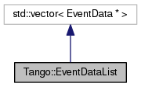

+----------+---------------------------------------+
| |Logo|   | Tango Core Classes Reference  9.2.5   |
+----------+---------------------------------------+

-  `Main Page <../../index.html>`__
-  `Related Pages <../../pages.html>`__
-  `Modules <../../modules.html>`__
-  `Namespaces <../../namespaces.html>`__
-  `Classes <../../annotated.html>`__
-  `Files <../../files.html>`__

-  `Class List <../../annotated.html>`__
-  `Class Hierarchy <../../inherits.html>`__
-  `Class Members <../../functions.html>`__

`Public Member Functions <#pub-methods>`__ \| `List of all
members <../../de/d5c/classTango_1_1EventDataList-members.html>`__

Tango::EventDataList Class Reference

``#include "event.h"``

Inheritance diagram for Tango::EventDataList:

|Inheritance graph|

[`legend <../../graph_legend.html>`__\ ]

Collaboration diagram for Tango::EventDataList:

|Collaboration graph|

[`legend <../../graph_legend.html>`__\ ]

Public Member Functions
-----------------------

 

`EventDataList <../../d3/d57/classTango_1_1EventDataList.html#ac1d92a0c7d7056b40d504f70ed3b13c5>`__
()

 

 

`~EventDataList <../../d3/d57/classTango_1_1EventDataList.html#a5fa9bd471834abf508f4dbf79de09d5e>`__
()

 

void 

`clear <../../d3/d57/classTango_1_1EventDataList.html#afc697e717c9f28a44a32fb7065f8589d>`__
()

 

Constructor & Destructor Documentation
--------------------------------------

+--------------------------------------+--------------------------------------+
| +----------------------------------- | inline                               |
| ----+-----+----+-----+----+          |                                      |
| | Tango::EventDataList::EventDataLis |                                      |
| t   | (   |    | )   |    |          |                                      |
| +----------------------------------- |                                      |
| ----+-----+----+-----+----+          |                                      |
                                                                             
+--------------------------------------+--------------------------------------+

+--------------------------------------+--------------------------------------+
| +----------------------------------- | inline                               |
| -----+-----+----+-----+----+         |                                      |
| | Tango::EventDataList::~EventDataLi |                                      |
| st   | (   |    | )   |    |         |                                      |
| +----------------------------------- |                                      |
| -----+-----+----+-----+----+         |                                      |
                                                                             
+--------------------------------------+--------------------------------------+

Member Function Documentation
-----------------------------

+--------------------------------------+--------------------------------------+
| +----------------------------------- | inline                               |
| -+-----+----+-----+----+             |                                      |
| | void Tango::EventDataList::clear   |                                      |
|  | (   |    | )   |    |             |                                      |
| +----------------------------------- |                                      |
| -+-----+----+-----+----+             |                                      |
                                                                             
+--------------------------------------+--------------------------------------+

--------------

The documentation for this class was generated from the following file:

-  `event.h <../../dd/d20/event_8h_source.html>`__

-  `Tango <../../de/ddf/namespaceTango.html>`__
-  `EventDataList <../../d3/d57/classTango_1_1EventDataList.html>`__
-  Generated on Fri Oct 7 2016 11:11:17 for Tango Core Classes Reference
   by |doxygen| 1.8.8

.. |Logo| image:: ../../logo.jpg

.. |Collaboration graph| image:: ../../d0/dc2/classTango_1_1EventDataList__coll__graph.png
.. |doxygen| image:: ../../doxygen.png
   :target: http://www.doxygen.org/index.html
