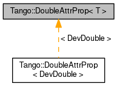

+----------+---------------------------------------+
| |Logo|   | Tango Core Classes Reference  9.2.5   |
+----------+---------------------------------------+

-  `Main Page <../../index.html>`__
-  `Related Pages <../../pages.html>`__
-  `Modules <../../modules.html>`__
-  `Namespaces <../../namespaces.html>`__
-  `Classes <../../annotated.html>`__
-  `Files <../../files.html>`__

-  `Class List <../../annotated.html>`__
-  `Class Hierarchy <../../inherits.html>`__
-  `Class Members <../../functions.html>`__

`Classes <#nested-classes>`__ \| `List of all
members <../../d1/dc7/classTango_1_1DoubleAttrProp-members.html>`__

Tango::DoubleAttrProp< T > Class Template Reference

`Server classes <../../da/d64/group__Server.html>`__

This class represents a `Tango <../../de/ddf/namespaceTango.html>`__
compound attribute property which consists of two values.
`More... <../../d5/da9/classTango_1_1DoubleAttrProp.html#details>`__

Inheritance diagram for Tango::DoubleAttrProp< T >:

|Inheritance graph|

[`legend <../../graph_legend.html>`__\ ]

Public Member Functions
-----------------------

Constructors

Miscellaneous constructors

 

`DoubleAttrProp <../../d5/da9/classTango_1_1DoubleAttrProp.html#a58dbe78d028188ea0dbee8a9a49be716>`__
()

 

| Default constructor. `More... <#a58dbe78d028188ea0dbee8a9a49be716>`__

 

 

`DoubleAttrProp <../../d5/da9/classTango_1_1DoubleAttrProp.html#a5d8275415ddccba96ff4131c0bf0d27d>`__
(const vector< T > &values)

 

| Create a new
`DoubleAttrProp <../../d5/da9/classTango_1_1DoubleAttrProp.html>`__
object. `More... <#a5d8275415ddccba96ff4131c0bf0d27d>`__

 

 

`DoubleAttrProp <../../d5/da9/classTango_1_1DoubleAttrProp.html#af5c16f185a3d4eb11fb8dcc21bf63531>`__
(const T &value)

 

| Create a new
`DoubleAttrProp <../../d5/da9/classTango_1_1DoubleAttrProp.html>`__
object. `More... <#af5c16f185a3d4eb11fb8dcc21bf63531>`__

 

 

`DoubleAttrProp <../../d5/da9/classTango_1_1DoubleAttrProp.html#a3a44186496c84b194a9f382e87aeb93e>`__
(const char \*value\_str)

 

| Create a new
`DoubleAttrProp <../../d5/da9/classTango_1_1DoubleAttrProp.html>`__
object. `More... <#a3a44186496c84b194a9f382e87aeb93e>`__

 

 

`DoubleAttrProp <../../d5/da9/classTango_1_1DoubleAttrProp.html#a84c375bcf6a1640bd4ba2499f158a887>`__
(const string &value\_str)

 

| Create a new
`DoubleAttrProp <../../d5/da9/classTango_1_1DoubleAttrProp.html>`__
object. `More... <#a84c375bcf6a1640bd4ba2499f158a887>`__

 

Assignment operators

These operators allow to assign the values of the compound attribute
property by providing the values or their string representations.

`DoubleAttrProp <../../d5/da9/classTango_1_1DoubleAttrProp.html>`__ & 

`operator= <../../d5/da9/classTango_1_1DoubleAttrProp.html#a8a6f518ac4cb3a3eef014d9633cf555b>`__
(const vector< T > &values)

 

| Assign the values of the compound attribute property.
`More... <#a8a6f518ac4cb3a3eef014d9633cf555b>`__

 

`DoubleAttrProp <../../d5/da9/classTango_1_1DoubleAttrProp.html>`__ & 

`operator= <../../d5/da9/classTango_1_1DoubleAttrProp.html#a0bdf79b7a455c4f1aa4521dd6955a347>`__
(const T &value)

 

| Assign the values of the compound attribute property.
`More... <#a0bdf79b7a455c4f1aa4521dd6955a347>`__

 

`DoubleAttrProp <../../d5/da9/classTango_1_1DoubleAttrProp.html>`__ & 

`operator= <../../d5/da9/classTango_1_1DoubleAttrProp.html#ad69387bb6bb54b0629c2bcc3ed0aca68>`__
(const char \*value\_str)

 

| Assign the values of the compound attribute property.
`More... <#ad69387bb6bb54b0629c2bcc3ed0aca68>`__

 

`DoubleAttrProp <../../d5/da9/classTango_1_1DoubleAttrProp.html>`__ & 

`operator= <../../d5/da9/classTango_1_1DoubleAttrProp.html#a3e3be7efdf813e9e831f7394d42c0003>`__
(const string &value\_str)

 

| Assign the values of the compound attribute property.
`More... <#a3e3be7efdf813e9e831f7394d42c0003>`__

 

Get/Set object members.

These methods allow the external world to get/set
`DoubleAttrProp <../../d5/da9/classTango_1_1DoubleAttrProp.html>`__
instance data members

vector< T > 

`get\_val <../../d5/da9/classTango_1_1DoubleAttrProp.html#a377133f8bb35b0c6609fd0fe024d84c6>`__
()

 

| Get the vector containing the compound attribute property values.
`More... <#a377133f8bb35b0c6609fd0fe024d84c6>`__

 

string & 

`get\_str <../../d5/da9/classTango_1_1DoubleAttrProp.html#a378c84beef01e53519bc1b0702335e59>`__
()

 

| Get string representation of the compound attribute property values.
`More... <#a378c84beef01e53519bc1b0702335e59>`__

 

void 

`set\_val <../../d5/da9/classTango_1_1DoubleAttrProp.html#a9b06476772a06ddcf045a5097bba15cb>`__
(const vector< T > &values)

 

| Set the compound attribute property values.
`More... <#a9b06476772a06ddcf045a5097bba15cb>`__

 

void 

`set\_val <../../d5/da9/classTango_1_1DoubleAttrProp.html#a18a9eb0323895a5011a97b8854d51678>`__
(const T &value)

 

| Set the compound attribute property values.
`More... <#a18a9eb0323895a5011a97b8854d51678>`__

 

void 

`set\_str <../../d5/da9/classTango_1_1DoubleAttrProp.html#a680efb91abb5de604a811ebac5dafb5a>`__
(const char \*value\_str)

 

| Set string representation of the compound attribute property values.
`More... <#a680efb91abb5de604a811ebac5dafb5a>`__

 

void 

`set\_str <../../d5/da9/classTango_1_1DoubleAttrProp.html#aed5483824956e3eb5fe40462331a5f91>`__
(const string &value\_str)

 

| Set string representation of the compound attribute property values.
`More... <#aed5483824956e3eb5fe40462331a5f91>`__

 

Check method

A method returning a boolean flag set to true if the compound attribute
property values have been assigned.

bool 

`is\_val <../../d5/da9/classTango_1_1DoubleAttrProp.html#a75cbfd41ce00381a7a89c10b259fda8d>`__
()

 

| Check if the compound attribute property values have been assigned.
`More... <#a75cbfd41ce00381a7a89c10b259fda8d>`__

 

Detailed Description
--------------------

template<typename T>
 class Tango::DoubleAttrProp< T >
~~~~~~~~~~~~~~~~~~~~~~~~~~~~~~~~~

This class represents a `Tango <../../de/ddf/namespaceTango.html>`__
compound attribute property which consists of two values.

Author
    trogucki

Revision
    19431

Constructor & Destructor Documentation
--------------------------------------

template<typename T>

+--------------------------------------+--------------------------------------+
| +----------------------------------- | inline                               |
| ------------------------------------ |                                      |
| ------------------------------------ |                                      |
| ------------------------------------ |                                      |
| -------------+-----+----+-----+----+ |                                      |
| | `Tango::DoubleAttrProp <../../d5/d |                                      |
| a9/classTango_1_1DoubleAttrProp.html |                                      |
| >`__\ < T >::\ `DoubleAttrProp <../. |                                      |
| ./d5/da9/classTango_1_1DoubleAttrPro |                                      |
| p.html>`__   | (   |    | )   |    | |                                      |
| +----------------------------------- |                                      |
| ------------------------------------ |                                      |
| ------------------------------------ |                                      |
| ------------------------------------ |                                      |
| -------------+-----+----+-----+----+ |                                      |
                                                                             
+--------------------------------------+--------------------------------------+

Default constructor.

template<typename T>

+--------------------------------------+--------------------------------------+
| +----------------------------------- | inline                               |
| ------------------------------------ |                                      |
| ------------------------------------ |                                      |
| ------------------------------------ |                                      |
| -------------+-----+---------------- |                                      |
| --------+------------+-----+----+    |                                      |
| | `Tango::DoubleAttrProp <../../d5/d |                                      |
| a9/classTango_1_1DoubleAttrProp.html |                                      |
| >`__\ < T >::\ `DoubleAttrProp <../. |                                      |
| ./d5/da9/classTango_1_1DoubleAttrPro |                                      |
| p.html>`__   | (   | const vector< T |                                      |
|  > &    | *values*   | )   |    |    |                                      |
| +----------------------------------- |                                      |
| ------------------------------------ |                                      |
| ------------------------------------ |                                      |
| ------------------------------------ |                                      |
| -------------+-----+---------------- |                                      |
| --------+------------+-----+----+    |                                      |
                                                                             
+--------------------------------------+--------------------------------------+

Create a new
`DoubleAttrProp <../../d5/da9/classTango_1_1DoubleAttrProp.html>`__
object.

Parameters
    +----------+----------------------------------------------------------------------+
    | values   | A vector containing two values of the compound attribute property.   |
    +----------+----------------------------------------------------------------------+

template<typename T>

+--------------------------------------+--------------------------------------+
| +----------------------------------- | inline                               |
| ------------------------------------ |                                      |
| ------------------------------------ |                                      |
| ------------------------------------ |                                      |
| -------------+-----+--------------+- |                                      |
| ----------+-----+----+               |                                      |
| | `Tango::DoubleAttrProp <../../d5/d |                                      |
| a9/classTango_1_1DoubleAttrProp.html |                                      |
| >`__\ < T >::\ `DoubleAttrProp <../. |                                      |
| ./d5/da9/classTango_1_1DoubleAttrPro |                                      |
| p.html>`__   | (   | const T &    |  |                                      |
| *value*   | )   |    |               |                                      |
| +----------------------------------- |                                      |
| ------------------------------------ |                                      |
| ------------------------------------ |                                      |
| ------------------------------------ |                                      |
| -------------+-----+--------------+- |                                      |
| ----------+-----+----+               |                                      |
                                                                             
+--------------------------------------+--------------------------------------+

Create a new
`DoubleAttrProp <../../d5/da9/classTango_1_1DoubleAttrProp.html>`__
object.

Parameters
    +---------+--------------------------------------------------------------------------+
    | value   | The figure assigned to both values of the compound attribute property.   |
    +---------+--------------------------------------------------------------------------+

template<typename T>

+--------------------------------------+--------------------------------------+
| +----------------------------------- | inline                               |
| ------------------------------------ |                                      |
| ------------------------------------ |                                      |
| ------------------------------------ |                                      |
| -------------+-----+---------------- |                                      |
| --+----------------+-----+----+      |                                      |
| | `Tango::DoubleAttrProp <../../d5/d |                                      |
| a9/classTango_1_1DoubleAttrProp.html |                                      |
| >`__\ < T >::\ `DoubleAttrProp <../. |                                      |
| ./d5/da9/classTango_1_1DoubleAttrPro |                                      |
| p.html>`__   | (   | const char \*   |                                      |
|   | *value\_str*   | )   |    |      |                                      |
| +----------------------------------- |                                      |
| ------------------------------------ |                                      |
| ------------------------------------ |                                      |
| ------------------------------------ |                                      |
| -------------+-----+---------------- |                                      |
| --+----------------+-----+----+      |                                      |
                                                                             
+--------------------------------------+--------------------------------------+

Create a new
`DoubleAttrProp <../../d5/da9/classTango_1_1DoubleAttrProp.html>`__
object.

Parameters
    +--------------+-------------------------------------------------------------------------------+
    | value\_str   | The 'C string' representation of values of the compound attribute property.   |
    +--------------+-------------------------------------------------------------------------------+

template<typename T>

+--------------------------------------+--------------------------------------+
| +----------------------------------- | inline                               |
| ------------------------------------ |                                      |
| ------------------------------------ |                                      |
| ------------------------------------ |                                      |
| -------------+-----+---------------- |                                      |
| ---+----------------+-----+----+     |                                      |
| | `Tango::DoubleAttrProp <../../d5/d |                                      |
| a9/classTango_1_1DoubleAttrProp.html |                                      |
| >`__\ < T >::\ `DoubleAttrProp <../. |                                      |
| ./d5/da9/classTango_1_1DoubleAttrPro |                                      |
| p.html>`__   | (   | const string &  |                                      |
|    | *value\_str*   | )   |    |     |                                      |
| +----------------------------------- |                                      |
| ------------------------------------ |                                      |
| ------------------------------------ |                                      |
| ------------------------------------ |                                      |
| -------------+-----+---------------- |                                      |
| ---+----------------+-----+----+     |                                      |
                                                                             
+--------------------------------------+--------------------------------------+

Create a new
`DoubleAttrProp <../../d5/da9/classTango_1_1DoubleAttrProp.html>`__
object.

Parameters
    +--------------+---------------------------------------------------------------------------+
    | value\_str   | The string representation of values of the compound attribute property.   |
    +--------------+---------------------------------------------------------------------------+

Member Function Documentation
-----------------------------

template<typename T>

+--------------------------------------+--------------------------------------+
| +----------------------------------- | inline                               |
| ------------------------------------ |                                      |
| --------------------------------+--- |                                      |
| --+----+-----+----+                  |                                      |
| | string& `Tango::DoubleAttrProp <.. |                                      |
| /../d5/da9/classTango_1_1DoubleAttrP |                                      |
| rop.html>`__\ < T >::get\_str   | (  |                                      |
|   |    | )   |    |                  |                                      |
| +----------------------------------- |                                      |
| ------------------------------------ |                                      |
| --------------------------------+--- |                                      |
| --+----+-----+----+                  |                                      |
                                                                             
+--------------------------------------+--------------------------------------+

Get string representation of the compound attribute property values.

Returns
    The string representation of the compound attribute property values.

template<typename T>

+--------------------------------------+--------------------------------------+
| +----------------------------------- | inline                               |
| ------------------------------------ |                                      |
| ----------------------------------+- |                                      |
| ----+----+-----+----+                |                                      |
| | vector<T> `Tango::DoubleAttrProp < |                                      |
| ../../d5/da9/classTango_1_1DoubleAtt |                                      |
| rProp.html>`__\ < T >::get\_val   |  |                                      |
| (   |    | )   |    |                |                                      |
| +----------------------------------- |                                      |
| ------------------------------------ |                                      |
| ----------------------------------+- |                                      |
| ----+----+-----+----+                |                                      |
                                                                             
+--------------------------------------+--------------------------------------+

Get the vector containing the compound attribute property values.

Returns
    The vector containing the compound attribute property values.

template<typename T>

+--------------------------------------+--------------------------------------+
| +----------------------------------- | inline                               |
| ------------------------------------ |                                      |
| ----------------------------+-----+- |                                      |
| ---+-----+----+                      |                                      |
| | bool `Tango::DoubleAttrProp <../.. |                                      |
| /d5/da9/classTango_1_1DoubleAttrProp |                                      |
| .html>`__\ < T >::is\_val   | (   |  |                                      |
|    | )   |    |                      |                                      |
| +----------------------------------- |                                      |
| ------------------------------------ |                                      |
| ----------------------------+-----+- |                                      |
| ---+-----+----+                      |                                      |
                                                                             
+--------------------------------------+--------------------------------------+

Check if the compound attribute property values have been assigned.

This method returns a boolean set to true if the compound attribute
property values have been assigned.

Returns
    A boolean set to true if the compound attribute property values have
    been assigned

template<typename T>

+--------------------------------------+--------------------------------------+
| +----------------------------------- | inline                               |
| ------------------------------------ |                                      |
| ------------------------------------ |                                      |
| ------------------------------------ |                                      |
| ------------------------+-----+----- |                                      |
| -------------------+------------+--- |                                      |
| --+----+                             |                                      |
| | `DoubleAttrProp <../../d5/da9/clas |                                      |
| sTango_1_1DoubleAttrProp.html>`__\ & |                                      |
|  `Tango::DoubleAttrProp <../../d5/da |                                      |
| 9/classTango_1_1DoubleAttrProp.html> |                                      |
| `__\ < T >::operator=   | (   | cons |                                      |
| t vector< T > &    | *values*   | )  |                                      |
|   |    |                             |                                      |
| +----------------------------------- |                                      |
| ------------------------------------ |                                      |
| ------------------------------------ |                                      |
| ------------------------------------ |                                      |
| ------------------------+-----+----- |                                      |
| -------------------+------------+--- |                                      |
| --+----+                             |                                      |
                                                                             
+--------------------------------------+--------------------------------------+

Assign the values of the compound attribute property.

Parameters
    +----------+-----------------------------------------------------------+
    | values   | A vector containing compound attribute property values.   |
    +----------+-----------------------------------------------------------+

Returns
    `DoubleAttrProp <../../d5/da9/classTango_1_1DoubleAttrProp.html>`__
    object with both values of the compound attribute property and their
    string representation set.

template<typename T>

+--------------------------------------+--------------------------------------+
| +----------------------------------- | inline                               |
| ------------------------------------ |                                      |
| ------------------------------------ |                                      |
| ------------------------------------ |                                      |
| ------------------------+-----+----- |                                      |
| ---------+-----------+-----+----+    |                                      |
| | `DoubleAttrProp <../../d5/da9/clas |                                      |
| sTango_1_1DoubleAttrProp.html>`__\ & |                                      |
|  `Tango::DoubleAttrProp <../../d5/da |                                      |
| 9/classTango_1_1DoubleAttrProp.html> |                                      |
| `__\ < T >::operator=   | (   | cons |                                      |
| t T &    | *value*   | )   |    |    |                                      |
| +----------------------------------- |                                      |
| ------------------------------------ |                                      |
| ------------------------------------ |                                      |
| ------------------------------------ |                                      |
| ------------------------+-----+----- |                                      |
| ---------+-----------+-----+----+    |                                      |
                                                                             
+--------------------------------------+--------------------------------------+

Assign the values of the compound attribute property.

Parameters
    +---------+-------------------------------------------------------------------------+
    | value   | A figure representing both values of the compound attribute property.   |
    +---------+-------------------------------------------------------------------------+

Returns
    `DoubleAttrProp <../../d5/da9/classTango_1_1DoubleAttrProp.html>`__
    object with both values of the compound attribute property and their
    string representation set.

template<typename T>

+--------------------------------------+--------------------------------------+
| +----------------------------------- | inline                               |
| ------------------------------------ |                                      |
| ------------------------------------ |                                      |
| ------------------------------------ |                                      |
| ------------------------+-----+----- |                                      |
| -------------+----------------+----- |                                      |
| +----+                               |                                      |
| | `DoubleAttrProp <../../d5/da9/clas |                                      |
| sTango_1_1DoubleAttrProp.html>`__\ & |                                      |
|  `Tango::DoubleAttrProp <../../d5/da |                                      |
| 9/classTango_1_1DoubleAttrProp.html> |                                      |
| `__\ < T >::operator=   | (   | cons |                                      |
| t char \*    | *value\_str*   | )    |                                      |
| |    |                               |                                      |
| +----------------------------------- |                                      |
| ------------------------------------ |                                      |
| ------------------------------------ |                                      |
| ------------------------------------ |                                      |
| ------------------------+-----+----- |                                      |
| -------------+----------------+----- |                                      |
| +----+                               |                                      |
                                                                             
+--------------------------------------+--------------------------------------+

Assign the values of the compound attribute property.

Parameters
    +--------------+-----------------------------------------------------------------------------+
    | value\_str   | A 'C string' representation of values of the compound attribute property.   |
    +--------------+-----------------------------------------------------------------------------+

Returns
    `DoubleAttrProp <../../d5/da9/classTango_1_1DoubleAttrProp.html>`__
    object with string representation of values of the compound
    attribute property set.

template<typename T>

+--------------------------------------+--------------------------------------+
| +----------------------------------- | inline                               |
| ------------------------------------ |                                      |
| ------------------------------------ |                                      |
| ------------------------------------ |                                      |
| ------------------------+-----+----- |                                      |
| --------------+----------------+---- |                                      |
| -+----+                              |                                      |
| | `DoubleAttrProp <../../d5/da9/clas |                                      |
| sTango_1_1DoubleAttrProp.html>`__\ & |                                      |
|  `Tango::DoubleAttrProp <../../d5/da |                                      |
| 9/classTango_1_1DoubleAttrProp.html> |                                      |
| `__\ < T >::operator=   | (   | cons |                                      |
| t string &    | *value\_str*   | )   |                                      |
|  |    |                              |                                      |
| +----------------------------------- |                                      |
| ------------------------------------ |                                      |
| ------------------------------------ |                                      |
| ------------------------------------ |                                      |
| ------------------------+-----+----- |                                      |
| --------------+----------------+---- |                                      |
| -+----+                              |                                      |
                                                                             
+--------------------------------------+--------------------------------------+

Assign the values of the compound attribute property.

Parameters
    +--------------+-------------------------------------------------------------------------+
    | value\_str   | A string representation of values of the compound attribute property.   |
    +--------------+-------------------------------------------------------------------------+

Returns
    `DoubleAttrProp <../../d5/da9/classTango_1_1DoubleAttrProp.html>`__
    object with string representation of values of the compound
    attribute property set.

template<typename T>

+--------------------------------------+--------------------------------------+
| +----------------------------------- | inline                               |
| ------------------------------------ |                                      |
| -----------------------------+-----+ |                                      |
| ------------------+----------------+ |                                      |
| -----+----+                          |                                      |
| | void `Tango::DoubleAttrProp <../.. |                                      |
| /d5/da9/classTango_1_1DoubleAttrProp |                                      |
| .html>`__\ < T >::set\_str   | (   | |                                      |
|  const char \*    | *value\_str*   | |                                      |
|  )   |    |                          |                                      |
| +----------------------------------- |                                      |
| ------------------------------------ |                                      |
| -----------------------------+-----+ |                                      |
| ------------------+----------------+ |                                      |
| -----+----+                          |                                      |
                                                                             
+--------------------------------------+--------------------------------------+

Set string representation of the compound attribute property values.

Parameters
    +--------------+----------------------------------------------------------------------------+
    | value\_str   | The 'C string' representation of the compound attribute property values.   |
    +--------------+----------------------------------------------------------------------------+

template<typename T>

+--------------------------------------+--------------------------------------+
| +----------------------------------- | inline                               |
| ------------------------------------ |                                      |
| -----------------------------+-----+ |                                      |
| -------------------+---------------- |                                      |
| +-----+----+                         |                                      |
| | void `Tango::DoubleAttrProp <../.. |                                      |
| /d5/da9/classTango_1_1DoubleAttrProp |                                      |
| .html>`__\ < T >::set\_str   | (   | |                                      |
|  const string &    | *value\_str*    |                                      |
| | )   |    |                         |                                      |
| +----------------------------------- |                                      |
| ------------------------------------ |                                      |
| -----------------------------+-----+ |                                      |
| -------------------+---------------- |                                      |
| +-----+----+                         |                                      |
                                                                             
+--------------------------------------+--------------------------------------+

Set string representation of the compound attribute property values.

Parameters
    +--------------+------------------------------------------------------------------------+
    | value\_str   | The string representation of the compound attribute property values.   |
    +--------------+------------------------------------------------------------------------+

template<typename T>

+--------------------------------------+--------------------------------------+
| +----------------------------------- | inline                               |
| ------------------------------------ |                                      |
| -----------------------------+-----+ |                                      |
| ------------------------+----------- |                                      |
| -+-----+----+                        |                                      |
| | void `Tango::DoubleAttrProp <../.. |                                      |
| /d5/da9/classTango_1_1DoubleAttrProp |                                      |
| .html>`__\ < T >::set\_val   | (   | |                                      |
|  const vector< T > &    | *values*   |                                      |
|  | )   |    |                        |                                      |
| +----------------------------------- |                                      |
| ------------------------------------ |                                      |
| -----------------------------+-----+ |                                      |
| ------------------------+----------- |                                      |
| -+-----+----+                        |                                      |
                                                                             
+--------------------------------------+--------------------------------------+

Set the compound attribute property values.

The values are automatically converted to their string representation.

Parameters
    +----------+-----------------------------------------------------------------+
    | values   | The vector containing the compound attribute property values.   |
    +----------+-----------------------------------------------------------------+

template<typename T>

+--------------------------------------+--------------------------------------+
| +----------------------------------- | inline                               |
| ------------------------------------ |                                      |
| -----------------------------+-----+ |                                      |
| --------------+-----------+-----+--- |                                      |
| -+                                   |                                      |
| | void `Tango::DoubleAttrProp <../.. |                                      |
| /d5/da9/classTango_1_1DoubleAttrProp |                                      |
| .html>`__\ < T >::set\_val   | (   | |                                      |
|  const T &    | *value*   | )   |    |                                      |
|  |                                   |                                      |
| +----------------------------------- |                                      |
| ------------------------------------ |                                      |
| -----------------------------+-----+ |                                      |
| --------------+-----------+-----+--- |                                      |
| -+                                   |                                      |
                                                                             
+--------------------------------------+--------------------------------------+

Set the compound attribute property values.

The figure provided is set for both values of the compound attribute
property and is automatically converted to its string representation.

Parameters
    +---------+---------------------------------------------------------------------------+
    | value   | The figure representing both values of the compound attribute property.   |
    +---------+---------------------------------------------------------------------------+

--------------

The documentation for this class was generated from the following file:

-  `attrprop.h <../../d2/d19/attrprop_8h_source.html>`__

-  `Tango <../../de/ddf/namespaceTango.html>`__
-  `DoubleAttrProp <../../d5/da9/classTango_1_1DoubleAttrProp.html>`__
-  Generated on Fri Oct 7 2016 11:11:17 for Tango Core Classes Reference
   by |doxygen| 1.8.8

.. |Logo| image:: ../../logo.jpg

.. |doxygen| image:: ../../doxygen.png
   :target: http://www.doxygen.org/index.html
