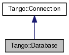

+----------+---------------------------------------+
| |Logo|   | Tango Core Classes Reference  9.2.5   |
+----------+---------------------------------------+

-  `Main Page <../../index.html>`__
-  `Related Pages <../../pages.html>`__
-  `Modules <../../modules.html>`__
-  `Namespaces <../../namespaces.html>`__
-  `Classes <../../annotated.html>`__
-  `Files <../../files.html>`__

-  `Class List <../../annotated.html>`__
-  `Class Hierarchy <../../inherits.html>`__
-  `Class Members <../../functions.html>`__

`Classes <#nested-classes>`__ \| `List of all
members <../../d6/d71/classTango_1_1Database-members.html>`__

Tango::Database Class Reference

`Client classes <../../d1/d45/group__Client.html>`__ » `Database Client
classes <../../d3/d48/group__DBase.html>`__

A high level object which contains the link to the database.
`More... <../../d6/dc5/classTango_1_1Database.html#details>`__

Inheritance diagram for Tango::Database:

|Inheritance graph|

[`legend <../../graph_legend.html>`__\ ]

Collaboration diagram for Tango::Database:

|Collaboration graph|

[`legend <../../graph_legend.html>`__\ ]

Public Member Functions
-----------------------

Constructors

 

`Database <../../d6/dc5/classTango_1_1Database.html#a14c64af15a2893a058e27327a22c1a1b>`__
(CORBA::ORB \*orb=NULL)

 

| Create a TANGO `Database <../../d6/dc5/classTango_1_1Database.html>`__
object. `More... <#a14c64af15a2893a058e27327a22c1a1b>`__

 

General methods

string 

`get\_info <../../d6/dc5/classTango_1_1Database.html#a5b31478458365cd161ee1c52b100287d>`__
()

 

| Get database info. `More... <#a5b31478458365cd161ee1c52b100287d>`__

 

Device oriented methods

void 

`add\_device <../../d6/dc5/classTango_1_1Database.html#a2102e69a1d899dea961f5d926e10b8ff>`__
(`DbDevInfo <../../dd/d01/classTango_1_1DbDevInfo.html>`__ &dev\_info)

 

| Add a device into the database.
`More... <#a2102e69a1d899dea961f5d926e10b8ff>`__

 

void 

`delete\_device <../../d6/dc5/classTango_1_1Database.html#a6ccf28029b49f49fec6c0a231436eeea>`__
(string dev\_name)

 

| Delete a device from the database.
`More... <#a6ccf28029b49f49fec6c0a231436eeea>`__

 

`DbDevImportInfo <../../d0/d4b/classTango_1_1DbDevImportInfo.html>`__ 

`import\_device <../../d6/dc5/classTango_1_1Database.html#a57ae0fa9649451c352608456fd94dbdf>`__
(string &dev\_name)

 

| Import a device from the database.
`More... <#a57ae0fa9649451c352608456fd94dbdf>`__

 

void 

`export\_device <../../d6/dc5/classTango_1_1Database.html#aa743e34e4db84aa7909c2ee359fbe372>`__
(`DbDevExportInfo <../../d6/d4b/classTango_1_1DbDevExportInfo.html>`__
&info)

 

| Export a device into the database.
`More... <#aa743e34e4db84aa7909c2ee359fbe372>`__

 

void 

`unexport\_device <../../d6/dc5/classTango_1_1Database.html#a2d38bc8853d22ac8ddfc4835882b95e8>`__
(string dev\_name)

 

| Unexport a device in the database.
`More... <#a2d38bc8853d22ac8ddfc4835882b95e8>`__

 

`DbDevFullInfo <../../d3/d6d/classTango_1_1DbDevFullInfo.html>`__ 

`get\_device\_info <../../d6/dc5/classTango_1_1Database.html#a5fbd1ebc30ba66067cd1270c3dbe13b1>`__
(string &dev\_name)

 

| Get device information.
`More... <#a5fbd1ebc30ba66067cd1270c3dbe13b1>`__

 

string 

`get\_class\_for\_device <../../d6/dc5/classTango_1_1Database.html#a0be16dffa2105d174d62d15fa4788cd6>`__
(string &dev\_name)

 

| Get class name for a device.
`More... <#a0be16dffa2105d174d62d15fa4788cd6>`__

 

`DbDatum <../../d3/d0f/classTango_1_1DbDatum.html>`__ 

`get\_class\_inheritance\_for\_device <../../d6/dc5/classTango_1_1Database.html#a3678cd2c420b9b1b39100c0a4946e974>`__
(string &dev\_name)

 

| Get device inheritance scheme.
`More... <#a3678cd2c420b9b1b39100c0a4946e974>`__

 

Server oriented methods

void 

`add\_server <../../d6/dc5/classTango_1_1Database.html#ab681d90e89a9de7bfdb9e58d7d813abc>`__
(string &ds\_name,
`DbDevInfos <../../de/ddf/namespaceTango.html#aaec13f55a8cc1c657fc9966bfba00b0c>`__
&devs)

 

| Create a device server process in database.
`More... <#ab681d90e89a9de7bfdb9e58d7d813abc>`__

 

void 

`delete\_server <../../d6/dc5/classTango_1_1Database.html#a1d8aa47ce6c7675e776d4e6a51a3e8b4>`__
(string &ds\_name)

 

| Delete a device server process from the database.
`More... <#a1d8aa47ce6c7675e776d4e6a51a3e8b4>`__

 

void 

`export\_server <../../d6/dc5/classTango_1_1Database.html#aa05506e6fbf4146c24522d3d4d5f5a36>`__
(`DbDevExportInfos <../../de/ddf/namespaceTango.html#a7823670207a406676f96c82f1b73bd28>`__
&devs)

 

| Delete a device server process from the database.
`More... <#aa05506e6fbf4146c24522d3d4d5f5a36>`__

 

void 

`unexport\_server <../../d6/dc5/classTango_1_1Database.html#ab4d3db3c78a0206d034552e7ba2e644d>`__
(string &ds\_name)

 

| Unexport all devices from a device server in the database.
`More... <#ab4d3db3c78a0206d034552e7ba2e644d>`__

 

void 

`rename\_server <../../d6/dc5/classTango_1_1Database.html#a3a503d9d28e7d560e939fa8d388a5063>`__
(const string &old\_ds\_name, const string &new\_ds\_name)

 

| Rename a device server in the database.
`More... <#a3a503d9d28e7d560e939fa8d388a5063>`__

 

Services oriented methods

`DbDatum <../../d3/d0f/classTango_1_1DbDatum.html>`__ 

`get\_services <../../d6/dc5/classTango_1_1Database.html#ac692cf1fe708ef3104e83deb5b644b3a>`__
(string &service\_name, string &inst\_name)

 

| Get services list from database.
`More... <#ac692cf1fe708ef3104e83deb5b644b3a>`__

 

`DbDatum <../../d3/d0f/classTango_1_1DbDatum.html>`__ 

`get\_device\_service\_list <../../d6/dc5/classTango_1_1Database.html#a88510aa39ba1d9b927ce494dd416b052>`__
(string &service\_name)

 

| Get services list from database.
`More... <#a88510aa39ba1d9b927ce494dd416b052>`__

 

void 

`register\_service <../../d6/dc5/classTango_1_1Database.html#ad3ef2f9b9db86c3bdd5f43c894083d81>`__
(string &service\_name, string &inst\_name, string &dev\_name)

 

| Register a service in the database.
`More... <#ad3ef2f9b9db86c3bdd5f43c894083d81>`__

 

void 

`unregister\_service <../../d6/dc5/classTango_1_1Database.html#ac884433c60f7d281ef005356e3df2d2a>`__
(string &service\_name, string &inst\_name)

 

| Unregister a service from the database.
`More... <#ac884433c60f7d281ef005356e3df2d2a>`__

 

Object property oriented methods

void 

`get\_property <../../d6/dc5/classTango_1_1Database.html#ad8c87ead9698e602c781301760299911>`__
(string obj\_name,
`DbData <../../de/ddf/namespaceTango.html#a99fa459235396b406532406b562984c0>`__
&db)

 

| Get object property value.
`More... <#ad8c87ead9698e602c781301760299911>`__

 

void 

`put\_property <../../d6/dc5/classTango_1_1Database.html#a99f6c55a2e210cab8e741ab84e3a9d97>`__
(string obj\_name,
`DbData <../../de/ddf/namespaceTango.html#a99fa459235396b406532406b562984c0>`__
&db)

 

| Put object property value in database.
`More... <#a99f6c55a2e210cab8e741ab84e3a9d97>`__

 

void 

`delete\_property <../../d6/dc5/classTango_1_1Database.html#a500bc3ba2fb3b24ea00e8aed0e477c97>`__
(string obj\_name,
`DbData <../../de/ddf/namespaceTango.html#a99fa459235396b406532406b562984c0>`__
&db)

 

| Delete object property from database.
`More... <#a500bc3ba2fb3b24ea00e8aed0e477c97>`__

 

vector< `DbHistory <../../d3/d55/classTango_1_1DbHistory.html>`__ > 

`get\_property\_history <../../d6/dc5/classTango_1_1Database.html#a1b3f3ff2a2d11097bbeec1b6577fdddc>`__
(string &obj\_name, string &prop\_name)

 

| Get object property history from database.
`More... <#a1b3f3ff2a2d11097bbeec1b6577fdddc>`__

 

Device property oriented methods

void 

`get\_device\_property <../../d6/dc5/classTango_1_1Database.html#afe55b0c9cce02fa790ff6ea148969fe3>`__
(string dev\_name,
`DbData <../../de/ddf/namespaceTango.html#a99fa459235396b406532406b562984c0>`__
&db)

 

| Get device property value.
`More... <#afe55b0c9cce02fa790ff6ea148969fe3>`__

 

void 

`put\_device\_property <../../d6/dc5/classTango_1_1Database.html#a9a484dbb0b894d44d36c50caf5f80f9b>`__
(string dev\_name,
`DbData <../../de/ddf/namespaceTango.html#a99fa459235396b406532406b562984c0>`__
&db)

 

| Put device property value in database.
`More... <#a9a484dbb0b894d44d36c50caf5f80f9b>`__

 

void 

`delete\_device\_property <../../d6/dc5/classTango_1_1Database.html#ad9c17d97dbe7cd5dd1d64147df47428c>`__
(string dev\_name,
`DbData <../../de/ddf/namespaceTango.html#a99fa459235396b406532406b562984c0>`__
&db)

 

| Delete device property from database.
`More... <#ad9c17d97dbe7cd5dd1d64147df47428c>`__

 

vector< `DbHistory <../../d3/d55/classTango_1_1DbHistory.html>`__ > 

`get\_device\_property\_history <../../d6/dc5/classTango_1_1Database.html#a45d45dc2be323b24b954c87fc97e2d67>`__
(string &dev\_name, string &prop\_name)

 

| Get device property history from database.
`More... <#a45d45dc2be323b24b954c87fc97e2d67>`__

 

Device attribute property oriented methods

void 

`get\_device\_attribute\_property <../../d6/dc5/classTango_1_1Database.html#a3618dd3ead7394eb65e245006c7c323b>`__
(string dev\_name,
`DbData <../../de/ddf/namespaceTango.html#a99fa459235396b406532406b562984c0>`__
&db)

 

| Get device attribute property value.
`More... <#a3618dd3ead7394eb65e245006c7c323b>`__

 

void 

`put\_device\_attribute\_property <../../d6/dc5/classTango_1_1Database.html#a41ce2ff3f79585ad424c7f366e77e2e1>`__
(string dev\_name,
`DbData <../../de/ddf/namespaceTango.html#a99fa459235396b406532406b562984c0>`__
&db)

 

| Put device attribute property value in database.
`More... <#a41ce2ff3f79585ad424c7f366e77e2e1>`__

 

void 

`delete\_device\_attribute\_property <../../d6/dc5/classTango_1_1Database.html#ae04f367b37ca2f8824cb8d406f61fee2>`__
(string dev\_name,
`DbData <../../de/ddf/namespaceTango.html#a99fa459235396b406532406b562984c0>`__
&db)

 

| Delete device attribute property from database.
`More... <#ae04f367b37ca2f8824cb8d406f61fee2>`__

 

vector< `DbHistory <../../d3/d55/classTango_1_1DbHistory.html>`__ > 

`get\_device\_attribute\_property\_history <../../d6/dc5/classTango_1_1Database.html#aaaee6456d4c164c4ed7cd3dbaf009ace>`__
(string &dev\_name, string &prop\_name, string &att\_name)

 

| Get device attribute property history from database.
`More... <#aaaee6456d4c164c4ed7cd3dbaf009ace>`__

 

void 

`get\_device\_attribute\_list <../../d6/dc5/classTango_1_1Database.html#a9f7d91c7b325d942f9b5676fdbe80ebd>`__
(string &dev\_name, vector< string > &att\_list)

 

| Get list of attribute with data in database for a specific device.
`More... <#a9f7d91c7b325d942f9b5676fdbe80ebd>`__

 

void 

`get\_device\_pipe\_list <../../d6/dc5/classTango_1_1Database.html#a074474c86323e75c3c1917eee5acc335>`__
(const string &dev\_name, vector< string > &pipe\_list)

 

| Get list of pipe with data in database for a specific device.
`More... <#a074474c86323e75c3c1917eee5acc335>`__

 

Device pipe property oriented methods

void 

`get\_device\_pipe\_property <../../d6/dc5/classTango_1_1Database.html#a3ee3a11271361471d966159be8755959>`__
(string dev\_name,
`DbData <../../de/ddf/namespaceTango.html#a99fa459235396b406532406b562984c0>`__
&db)

 

| Get device pipe property value.
`More... <#a3ee3a11271361471d966159be8755959>`__

 

void 

`put\_device\_pipe\_property <../../d6/dc5/classTango_1_1Database.html#ad2a34dd1aca69f773d6c81ff15d106a5>`__
(string dev\_name,
`DbData <../../de/ddf/namespaceTango.html#a99fa459235396b406532406b562984c0>`__
&db)

 

| Put device pipe property value in database.
`More... <#ad2a34dd1aca69f773d6c81ff15d106a5>`__

 

void 

`delete\_device\_pipe\_property <../../d6/dc5/classTango_1_1Database.html#a0e9f77d77c6f970661873941449a93f8>`__
(string dev\_name,
`DbData <../../de/ddf/namespaceTango.html#a99fa459235396b406532406b562984c0>`__
&db)

 

| Delete device pipe property from database.
`More... <#a0e9f77d77c6f970661873941449a93f8>`__

 

vector< `DbHistory <../../d3/d55/classTango_1_1DbHistory.html>`__ > 

`get\_device\_pipe\_property\_history <../../d6/dc5/classTango_1_1Database.html#a9cfa146c48fc6807c46cf4875055da3d>`__
(string &dev\_name, string &pipe\_name, string &prop\_name)

 

| Get device pipe property history from database.
`More... <#a9cfa146c48fc6807c46cf4875055da3d>`__

 

Class property oriented methods

void 

`get\_class\_property <../../d6/dc5/classTango_1_1Database.html#a8e46a86143d90e308342c5ac673afaf7>`__
(string class\_name,
`DbData <../../de/ddf/namespaceTango.html#a99fa459235396b406532406b562984c0>`__
&db)

 

| Get class property value.
`More... <#a8e46a86143d90e308342c5ac673afaf7>`__

 

void 

`put\_class\_property <../../d6/dc5/classTango_1_1Database.html#ac4bdb799dba9411084cad9fab25a8f66>`__
(string class\_name,
`DbData <../../de/ddf/namespaceTango.html#a99fa459235396b406532406b562984c0>`__
&db)

 

| Put class property value in database.
`More... <#ac4bdb799dba9411084cad9fab25a8f66>`__

 

void 

`delete\_class\_property <../../d6/dc5/classTango_1_1Database.html#af94459438cd499293e4d81d929b752b5>`__
(string class\_name,
`DbData <../../de/ddf/namespaceTango.html#a99fa459235396b406532406b562984c0>`__
&db)

 

| Delete class property from database.
`More... <#af94459438cd499293e4d81d929b752b5>`__

 

vector< `DbHistory <../../d3/d55/classTango_1_1DbHistory.html>`__ > 

`get\_class\_property\_history <../../d6/dc5/classTango_1_1Database.html#a008a5d52094c8951e195d6c47f55e3c4>`__
(string &class\_name, string &prop\_name)

 

| Get class property history from database.
`More... <#a008a5d52094c8951e195d6c47f55e3c4>`__

 

Class attribute property oriented methods

void 

`get\_class\_attribute\_property <../../d6/dc5/classTango_1_1Database.html#aca022f5e1ac4a4bad5068fd191d722be>`__
(string class\_name,
`DbData <../../de/ddf/namespaceTango.html#a99fa459235396b406532406b562984c0>`__
&db)

 

| Get class attribute property value.
`More... <#aca022f5e1ac4a4bad5068fd191d722be>`__

 

void 

`put\_class\_attribute\_property <../../d6/dc5/classTango_1_1Database.html#a23eace3b226c74f472926927240529cb>`__
(string class\_name,
`DbData <../../de/ddf/namespaceTango.html#a99fa459235396b406532406b562984c0>`__
&db)

 

| Put class attribute property value in database.
`More... <#a23eace3b226c74f472926927240529cb>`__

 

void 

`delete\_class\_attribute\_property <../../d6/dc5/classTango_1_1Database.html#ad174f83038e4d6c42813493b63ac2d6f>`__
(string class\_name,
`DbData <../../de/ddf/namespaceTango.html#a99fa459235396b406532406b562984c0>`__
&db)

 

| Delete class attribute property from database.
`More... <#ad174f83038e4d6c42813493b63ac2d6f>`__

 

vector< `DbHistory <../../d3/d55/classTango_1_1DbHistory.html>`__ > 

`get\_class\_attribute\_property\_history <../../d6/dc5/classTango_1_1Database.html#a34dccebd47074863611b8501a0f26d8d>`__
(string &class\_name, string &att\_name, string &prop\_name)

 

| Get class attribute property history from database.
`More... <#a34dccebd47074863611b8501a0f26d8d>`__

 

Class pipe property oriented methods

void 

`get\_class\_pipe\_property <../../d6/dc5/classTango_1_1Database.html#a0535d15f39ec906f3e8e615dd316ba4b>`__
(string class\_name,
`DbData <../../de/ddf/namespaceTango.html#a99fa459235396b406532406b562984c0>`__
&db)

 

| Get class pipe property value.
`More... <#a0535d15f39ec906f3e8e615dd316ba4b>`__

 

void 

`put\_class\_pipe\_property <../../d6/dc5/classTango_1_1Database.html#a47c3980644bfc0c7e300db8e001ff29e>`__
(string class\_name,
`DbData <../../de/ddf/namespaceTango.html#a99fa459235396b406532406b562984c0>`__
&db)

 

| Put class pipe property value in database.
`More... <#a47c3980644bfc0c7e300db8e001ff29e>`__

 

void 

`delete\_class\_pipe\_property <../../d6/dc5/classTango_1_1Database.html#ae7016c5e60b8b99e4354ec5d45d23e4a>`__
(string class\_name,
`DbData <../../de/ddf/namespaceTango.html#a99fa459235396b406532406b562984c0>`__
&db)

 

| Delete class pipe property from database.
`More... <#ae7016c5e60b8b99e4354ec5d45d23e4a>`__

 

vector< `DbHistory <../../d3/d55/classTango_1_1DbHistory.html>`__ > 

`get\_class\_pipe\_property\_history <../../d6/dc5/classTango_1_1Database.html#a10b4646503c28a8b860f2d0e8c772d94>`__
(string &class\_name, string &pipe\_name, string &prop\_name)

 

| Get class pipe property history from database.
`More... <#a10b4646503c28a8b860f2d0e8c772d94>`__

 

Alias oriented methods

void 

`get\_device\_from\_alias <../../d6/dc5/classTango_1_1Database.html#ad827d7a7e6ee8c26f3ffc2a124beaa34>`__
(string alias, string &dev\_name)

 

| Get device name from its alias.
`More... <#ad827d7a7e6ee8c26f3ffc2a124beaa34>`__

 

void 

`get\_alias\_from\_device <../../d6/dc5/classTango_1_1Database.html#ad4156b6e6a73be3d60d261241fedd317>`__
(string dev\_name, string &alias)

 

| Get device alias form its name.
`More... <#ad4156b6e6a73be3d60d261241fedd317>`__

 

void 

`get\_alias <../../d6/dc5/classTango_1_1Database.html#a900b16bb5fab3ca28435aa0a46b8e68c>`__
(string dev\_name, string &dev\_alias)

 

| Get device alias from its name.
`More... <#a900b16bb5fab3ca28435aa0a46b8e68c>`__

 

void 

`get\_device\_alias <../../d6/dc5/classTango_1_1Database.html#a69430f5a0b51293675caab2c97a28b63>`__
(string dev\_alias, string &dev\_name)

 

| Get device name from its alias.
`More... <#a69430f5a0b51293675caab2c97a28b63>`__

 

void 

`put\_device\_alias <../../d6/dc5/classTango_1_1Database.html#af7cc60c1802c265a4e06760624a9ad49>`__
(string &dev\_name, string &dev\_alias)

 

| Define device alias. `More... <#af7cc60c1802c265a4e06760624a9ad49>`__

 

void 

`delete\_device\_alias <../../d6/dc5/classTango_1_1Database.html#a07fd405947d9aeb7573cd2faba6dea2d>`__
(string &dev\_alias)

 

| Delete device alias. `More... <#a07fd405947d9aeb7573cd2faba6dea2d>`__

 

void 

`get\_attribute\_from\_alias <../../d6/dc5/classTango_1_1Database.html#acd2aa63b3f9f993451e612d98836e51e>`__
(string alias, string &att\_name)

 

| Get attribute name from its alias.
`More... <#acd2aa63b3f9f993451e612d98836e51e>`__

 

void 

`get\_alias\_from\_attribute <../../d6/dc5/classTango_1_1Database.html#a919ae488e3fbed3b5284c58f73664958>`__
(string att\_name, string &alias)

 

| Get attribute alias form its name.
`More... <#a919ae488e3fbed3b5284c58f73664958>`__

 

void 

`get\_attribute\_alias <../../d6/dc5/classTango_1_1Database.html#a097e5734c8b69438a06ef5a0b9197c90>`__
(string att\_alias, string &att\_name)

 

| Get attribute name from its alias.
`More... <#a097e5734c8b69438a06ef5a0b9197c90>`__

 

void 

`put\_attribute\_alias <../../d6/dc5/classTango_1_1Database.html#a285ff69046e381b9e8594a068d30f8a9>`__
(string &att\_name, string &att\_alias)

 

| Define attribute alias.
`More... <#a285ff69046e381b9e8594a068d30f8a9>`__

 

void 

`delete\_attribute\_alias <../../d6/dc5/classTango_1_1Database.html#ae7b4da54acf40b3660cd11cf73011114>`__
(string &att\_alias)

 

| Delete attribute alias.
`More... <#ae7b4da54acf40b3660cd11cf73011114>`__

 

Database browsing oriented methods

`DbDatum <../../d3/d0f/classTango_1_1DbDatum.html>`__ 

`get\_host\_list <../../d6/dc5/classTango_1_1Database.html#ae30103727e5c7fa0317eebc4ce261e85>`__
()

 

| Get host list. `More... <#ae30103727e5c7fa0317eebc4ce261e85>`__

 

`DbDatum <../../d3/d0f/classTango_1_1DbDatum.html>`__ 

`get\_host\_list <../../d6/dc5/classTango_1_1Database.html#a809c4109eda196c222a91350aefb0793>`__
(string &wildcard)

 

| Get host list with name matching a wildcard.
`More... <#a809c4109eda196c222a91350aefb0793>`__

 

`DbDatum <../../d3/d0f/classTango_1_1DbDatum.html>`__ 

`get\_server\_class\_list <../../d6/dc5/classTango_1_1Database.html#a3164818943931df7eca65320b708d965>`__
(string &ds\_name)

 

| Get list of `Tango <../../de/ddf/namespaceTango.html>`__ classes
embedded in a device server proess.
`More... <#a3164818943931df7eca65320b708d965>`__

 

`DbDatum <../../d3/d0f/classTango_1_1DbDatum.html>`__ 

`get\_server\_name\_list <../../d6/dc5/classTango_1_1Database.html#a5bfa8010f1248c4523ccd16aec5353b5>`__
()

 

| Get list of all `Tango <../../de/ddf/namespaceTango.html>`__ device
server process. `More... <#a5bfa8010f1248c4523ccd16aec5353b5>`__

 

`DbDatum <../../d3/d0f/classTango_1_1DbDatum.html>`__ 

`get\_instance\_name\_list <../../d6/dc5/classTango_1_1Database.html#a2d574a5ba2fec787615e60b778f30476>`__
(string &ds\_name)

 

| Get list of instances.
`More... <#a2d574a5ba2fec787615e60b778f30476>`__

 

`DbDatum <../../d3/d0f/classTango_1_1DbDatum.html>`__ 

`get\_server\_list <../../d6/dc5/classTango_1_1Database.html#a8aaee599e0c6962acd982944b730058b>`__
()

 

| Get list of device server processes.
`More... <#a8aaee599e0c6962acd982944b730058b>`__

 

`DbDatum <../../d3/d0f/classTango_1_1DbDatum.html>`__ 

`get\_server\_list <../../d6/dc5/classTango_1_1Database.html#a96be3273f6e8d61e97c3f96f1976a69b>`__
(string &wildcard)

 

| Get list of device server processes with a wildcard.
`More... <#a96be3273f6e8d61e97c3f96f1976a69b>`__

 

`DbDatum <../../d3/d0f/classTango_1_1DbDatum.html>`__ 

`get\_host\_server\_list <../../d6/dc5/classTango_1_1Database.html#ad56bced823bfe0f9272e1c89e26b9428>`__
(string &host\_name)

 

| Get list of device server processes running on a host.
`More... <#ad56bced823bfe0f9272e1c89e26b9428>`__

 

`DbDatum <../../d3/d0f/classTango_1_1DbDatum.html>`__ 

`get\_device\_name <../../d6/dc5/classTango_1_1Database.html#a230f12d4e0bb0069fba1125696b39dea>`__
(string &ds\_name, string &class\_name)

 

| Get list of devices served by a device server process.
`More... <#a230f12d4e0bb0069fba1125696b39dea>`__

 

`DbDatum <../../d3/d0f/classTango_1_1DbDatum.html>`__ 

`get\_device\_exported <../../d6/dc5/classTango_1_1Database.html#aeed1444a2c4494f6113fb120e474274f>`__
(string &filter)

 

| Get list of exported devices.
`More... <#aeed1444a2c4494f6113fb120e474274f>`__

 

`DbDatum <../../d3/d0f/classTango_1_1DbDatum.html>`__ 

`get\_device\_domain <../../d6/dc5/classTango_1_1Database.html#acffeebc9121c3db9cf9963da8386f2a9>`__
(string &wildcard)

 

| Get list of device domain names.
`More... <#acffeebc9121c3db9cf9963da8386f2a9>`__

 

`DbDatum <../../d3/d0f/classTango_1_1DbDatum.html>`__ 

`get\_device\_family <../../d6/dc5/classTango_1_1Database.html#a604270698ceea2414abe84b9a5c9f8ee>`__
(string &wildcard)

 

| Get list of device family name.
`More... <#a604270698ceea2414abe84b9a5c9f8ee>`__

 

`DbDatum <../../d3/d0f/classTango_1_1DbDatum.html>`__ 

`get\_device\_member <../../d6/dc5/classTango_1_1Database.html#abfd7fb8537a386b78def254aa201c945>`__
(string &wildcard)

 

| Get list of device member name.
`More... <#abfd7fb8537a386b78def254aa201c945>`__

 

`DbDatum <../../d3/d0f/classTango_1_1DbDatum.html>`__ 

`get\_device\_class\_list <../../d6/dc5/classTango_1_1Database.html#aa78c176cb506f16a829a3eedc40a6c13>`__
(string &ds\_name)

 

| Get list of devices/classes for a specified device server.
`More... <#aa78c176cb506f16a829a3eedc40a6c13>`__

 

`DbDatum <../../d3/d0f/classTango_1_1DbDatum.html>`__ 

`get\_device\_exported\_for\_class <../../d6/dc5/classTango_1_1Database.html#abc2f7faa37c91bba5fbe1f96ca28e06a>`__
(string &class\_name)

 

| Get list of exported device for a class.
`More... <#abc2f7faa37c91bba5fbe1f96ca28e06a>`__

 

`DbDatum <../../d3/d0f/classTango_1_1DbDatum.html>`__ 

`get\_object\_list <../../d6/dc5/classTango_1_1Database.html#a94e4b9811796319fc50adf3839d7a281>`__
(string &wildcard)

 

| Get object (free property) list.
`More... <#a94e4b9811796319fc50adf3839d7a281>`__

 

`DbDatum <../../d3/d0f/classTango_1_1DbDatum.html>`__ 

`get\_object\_property\_list <../../d6/dc5/classTango_1_1Database.html#a172b6cab7253bad2009975a86745faf9>`__
(string &obj\_name, string &wildcard)

 

| Get object property list.
`More... <#a172b6cab7253bad2009975a86745faf9>`__

 

`DbDatum <../../d3/d0f/classTango_1_1DbDatum.html>`__ 

`get\_class\_list <../../d6/dc5/classTango_1_1Database.html#a542f6103269d2f64b035b063a62e9925>`__
(string &wildcard)

 

| Get `Tango <../../de/ddf/namespaceTango.html>`__ class list.
`More... <#a542f6103269d2f64b035b063a62e9925>`__

 

`DbDatum <../../d3/d0f/classTango_1_1DbDatum.html>`__ 

`get\_class\_property\_list <../../d6/dc5/classTango_1_1Database.html#aee6bc683e3c64e74496cf6f72d60c016>`__
(string &class\_name)

 

| Get class property list.
`More... <#aee6bc683e3c64e74496cf6f72d60c016>`__

 

`DbDatum <../../d3/d0f/classTango_1_1DbDatum.html>`__ 

`get\_class\_attribute\_list <../../d6/dc5/classTango_1_1Database.html#a757766ca6e4db8c55cfc34684b7d74e8>`__
(string &class\_name, string &wildcard)

 

| Get class attribute list.
`More... <#a757766ca6e4db8c55cfc34684b7d74e8>`__

 

`DbDatum <../../d3/d0f/classTango_1_1DbDatum.html>`__ 

`get\_class\_pipe\_list <../../d6/dc5/classTango_1_1Database.html#a86a67a484a6527db7b47bbc102e4b239>`__
(const string &class\_name, const string &wildcard)

 

| Get class pipe list. `More... <#a86a67a484a6527db7b47bbc102e4b239>`__

 

`DbDatum <../../d3/d0f/classTango_1_1DbDatum.html>`__ 

`get\_device\_alias\_list <../../d6/dc5/classTango_1_1Database.html#a12bc6aa70679349c6ad7f9b3e0c810bd>`__
(string &filter)

 

| Get device alias list.
`More... <#a12bc6aa70679349c6ad7f9b3e0c810bd>`__

 

`DbDatum <../../d3/d0f/classTango_1_1DbDatum.html>`__ 

`get\_attribute\_alias\_list <../../d6/dc5/classTango_1_1Database.html#adf66beda65cda35ae764e40eb1beeb5f>`__
(string &filter)

 

| Get attribute alias list.
`More... <#adf66beda65cda35ae764e40eb1beeb5f>`__

 

|-| Public Member Functions inherited from
`Tango::Connection <../../d7/de8/classTango_1_1Connection.html>`__

virtual void 

`set\_timeout\_millis <../../d7/de8/classTango_1_1Connection.html#a0a05fa878281ae0665274d481ed1bfe4>`__
(int timeout)

 

| Set device timeout. `More... <#a0a05fa878281ae0665274d481ed1bfe4>`__

 

virtual int 

`get\_timeout\_millis <../../d7/de8/classTango_1_1Connection.html#af911bbab02b415ebd3dc8faeb7d687a7>`__
()

 

| Get device timeout. `More... <#af911bbab02b415ebd3dc8faeb7d687a7>`__

 

int 

`get\_idl\_version <../../d7/de8/classTango_1_1Connection.html#a5d1843ba0973d0845939a4f106dbad28>`__
()

 

| Get device IDL version.
`More... <#a5d1843ba0973d0845939a4f106dbad28>`__

 

virtual Tango::DevSource 

`get\_source <../../d7/de8/classTango_1_1Connection.html#afcaee3ed7d1a75a21749ad64fbee8700>`__
()

 

| Get device source. `More... <#afcaee3ed7d1a75a21749ad64fbee8700>`__

 

virtual void 

`set\_source <../../d7/de8/classTango_1_1Connection.html#adaeaaf890490018e714dc1a92516b76f>`__
(Tango::DevSource sou)

 

| Set device source. `More... <#adaeaaf890490018e714dc1a92516b76f>`__

 

virtual void 

`set\_transparency\_reconnection <../../d7/de8/classTango_1_1Connection.html#af1fa8c85c338781be7d16a99581cf383>`__
(bool val)

 

| Set device transparency (reconnection) mode.
`More... <#af1fa8c85c338781be7d16a99581cf383>`__

 

virtual bool 

`get\_transparency\_reconnection <../../d7/de8/classTango_1_1Connection.html#ab9dad67ef6e9ba3268ac9d5627f70ea0>`__
()

 

| Get device transparency (reconnection) mode.
`More... <#ab9dad67ef6e9ba3268ac9d5627f70ea0>`__

 

virtual `DeviceData <../../df/d22/classTango_1_1DeviceData.html>`__ 

`command\_inout <../../d7/de8/classTango_1_1Connection.html#ad878054e953c5288ac0bc137c6307347>`__
(string &cmd\_name)

 

| Execute a command (without input data)
`More... <#ad878054e953c5288ac0bc137c6307347>`__

 

virtual `DeviceData <../../df/d22/classTango_1_1DeviceData.html>`__ 

`command\_inout <../../d7/de8/classTango_1_1Connection.html#affa1c0fff97f714eddf69ebdb17c6665>`__
(const char \*cmd\_name)

 

| Execute a command (without input data)
`More... <#affa1c0fff97f714eddf69ebdb17c6665>`__

 

virtual `DeviceData <../../df/d22/classTango_1_1DeviceData.html>`__ 

`command\_inout <../../d7/de8/classTango_1_1Connection.html#af5d9faa2fff08068c579202d29404df5>`__
(string &cmd\_name,
`DeviceData <../../df/d22/classTango_1_1DeviceData.html>`__ &d\_in)

 

| Execute a command (with input data)
`More... <#af5d9faa2fff08068c579202d29404df5>`__

 

virtual `DeviceData <../../df/d22/classTango_1_1DeviceData.html>`__ 

`command\_inout <../../d7/de8/classTango_1_1Connection.html#a484969b4553471d1f15d873cc638cc1d>`__
(const char \*cmd\_name,
`DeviceData <../../df/d22/classTango_1_1DeviceData.html>`__ &d\_in)

 

| Execute a command (with input data)
`More... <#a484969b4553471d1f15d873cc638cc1d>`__

 

virtual long 

`command\_inout\_asynch <../../d7/de8/classTango_1_1Connection.html#a253afbec47129a1f235e5642648fb9ae>`__
(const char \*cmd\_name,
`DeviceData <../../df/d22/classTango_1_1DeviceData.html>`__ &argin, bool
forget=false)

 

| Execute a command asynchronously (with input argument)
`More... <#a253afbec47129a1f235e5642648fb9ae>`__

 

virtual long 

`command\_inout\_asynch <../../d7/de8/classTango_1_1Connection.html#a05d55e0b38d0af49f77cbf1ccb3fbe56>`__
(string &cmd\_name,
`DeviceData <../../df/d22/classTango_1_1DeviceData.html>`__ &argin, bool
forget=false)

 

| Execute a command asynchronously (with input argument)
`More... <#a05d55e0b38d0af49f77cbf1ccb3fbe56>`__

 

virtual long 

`command\_inout\_asynch <../../d7/de8/classTango_1_1Connection.html#a13709d9e18276ce038e358e9ef7e54e0>`__
(const char \*cmd\_name, bool forget=false)

 

| Execute a command asynchronously.
`More... <#a13709d9e18276ce038e358e9ef7e54e0>`__

 

virtual long 

`command\_inout\_asynch <../../d7/de8/classTango_1_1Connection.html#a3ac6eaa4960de354249d9d9fa6c09b32>`__
(string &cmd\_name, bool forget=false)

 

| Execute a command asynchronously.
`More... <#a3ac6eaa4960de354249d9d9fa6c09b32>`__

 

virtual `DeviceData <../../df/d22/classTango_1_1DeviceData.html>`__ 

`command\_inout\_reply <../../d7/de8/classTango_1_1Connection.html#afae0ebefc88ab77671fc717f30b53c8f>`__
(long id)

 

| Check an asynchronous command\_inout answer is arrived.
`More... <#afae0ebefc88ab77671fc717f30b53c8f>`__

 

virtual `DeviceData <../../df/d22/classTango_1_1DeviceData.html>`__ 

`command\_inout\_reply <../../d7/de8/classTango_1_1Connection.html#a02eedd172fbcb947d0a93f10d4f8def1>`__
(long id, long timeout)

 

| Check an asynchronous command\_inout answer is arrived with timeout.
`More... <#a02eedd172fbcb947d0a93f10d4f8def1>`__

 

virtual void 

`command\_inout\_asynch <../../d7/de8/classTango_1_1Connection.html#ab15806ba65762f244739c66e6a978fcc>`__
(string &cmd\_name,
`CallBack <../../d4/ded/classTango_1_1CallBack.html>`__ &cb)

 

| Execute a command asynchronously with callback.
`More... <#ab15806ba65762f244739c66e6a978fcc>`__

 

virtual void 

`command\_inout\_asynch <../../d7/de8/classTango_1_1Connection.html#a1b7ee02774b5ce6263539bbc62c20966>`__
(const char \*cmd\_name,
`CallBack <../../d4/ded/classTango_1_1CallBack.html>`__ &cb)

 

| Execute a command asynchronously with callback.
`More... <#a1b7ee02774b5ce6263539bbc62c20966>`__

 

virtual void 

`command\_inout\_asynch <../../d7/de8/classTango_1_1Connection.html#af29ba99c37cb252ab1d386d192f2721f>`__
(string &cmd\_name,
`DeviceData <../../df/d22/classTango_1_1DeviceData.html>`__ &argin,
`CallBack <../../d4/ded/classTango_1_1CallBack.html>`__ &cb)

 

| Execute a command asynchronously with input value and callback.
`More... <#af29ba99c37cb252ab1d386d192f2721f>`__

 

virtual void 

`command\_inout\_asynch <../../d7/de8/classTango_1_1Connection.html#a0bb2ab58c99eb35b86f069a2a41c111c>`__
(const char \*cmd\_name,
`DeviceData <../../df/d22/classTango_1_1DeviceData.html>`__ &argin,
`CallBack <../../d4/ded/classTango_1_1CallBack.html>`__ &cb)

 

| Execute a command asynchronously with input value and callback.
`More... <#a0bb2ab58c99eb35b86f069a2a41c111c>`__

 

virtual void 

`get\_asynch\_replies <../../d7/de8/classTango_1_1Connection.html#aab2655c9b8626777ab54dc795a4f0738>`__
()

 

| Fire callback methods.
`More... <#aab2655c9b8626777ab54dc795a4f0738>`__

 

virtual void 

`get\_asynch\_replies <../../d7/de8/classTango_1_1Connection.html#a860bae40f4ad7866c78d4408bb76fa74>`__
(long timeout)

 

| Fire callback methds with timeout.
`More... <#a860bae40f4ad7866c78d4408bb76fa74>`__

 

virtual void 

`cancel\_asynch\_request <../../d7/de8/classTango_1_1Connection.html#aa340cda55c9be5ba4c87b92b6213f6f1>`__
(long id)

 

| Cancel a pending asynchronous request.
`More... <#aa340cda55c9be5ba4c87b92b6213f6f1>`__

 

virtual void 

`cancel\_all\_polling\_asynch\_request <../../d7/de8/classTango_1_1Connection.html#a7e596bb67ca070748f501ab990d5f880>`__
()

 

| Cancel all pending asynchronous request.
`More... <#a7e596bb67ca070748f501ab990d5f880>`__

 

Detailed Description
--------------------

A high level object which contains the link to the database.

This class has methods for all database commands e.g.
`get\_device\_property() <../../d6/dc5/classTango_1_1Database.html#afe55b0c9cce02fa790ff6ea148969fe3>`__,
device\_list(), info(), etc.

Author
    taurel

Revision
    1

Constructor & Destructor Documentation
--------------------------------------

+-----------------------------+-----+------------------+--------------------+-----+----+
| Tango::Database::Database   | (   | CORBA::ORB \*    | *orb* = ``NULL``   | )   |    |
+-----------------------------+-----+------------------+--------------------+-----+----+

Create a TANGO `Database <../../d6/dc5/classTango_1_1Database.html>`__
object.

The constructor uses the environment variable “TANGO\_HOST” to determine
which instance of the TANGO database to connect to. Example :

using namespace `Tango <../../de/ddf/namespaceTango.html>`__;

`Database <../../d6/dc5/classTango_1_1Database.html>`__ \*db = new
`Database <../../d6/dc5/classTango_1_1Database.html#a14c64af15a2893a058e27327a22c1a1b>`__\ ();

Parameters
    +--------+-------+------------------------------------------------------------------+
    | [in]   | orb   | The CORBA ORB pointer. Default value is fine for 99 % of cases   |
    +--------+-------+------------------------------------------------------------------+

Member Function Documentation
-----------------------------

+-------------------------------------+-----+----------------------------------------------------------------+---------------+-----+----+
| void Tango::Database::add\_device   | (   | `DbDevInfo <../../dd/d01/classTango_1_1DbDevInfo.html>`__ &    | *dev\_info*   | )   |    |
+-------------------------------------+-----+----------------------------------------------------------------+---------------+-----+----+

Add a device into the database.

Add a device to the database. The device name, server and class are
specified in the
`DbDevInfo <../../dd/d01/classTango_1_1DbDevInfo.html>`__ structure.
Example :

DbDevInfo my\_device\_info;

my\_device\_info.name = “my/own/device”;

my\_device\_info.\_class = “MyDevice”;

my\_device\_info.server = “MyServer/test”;

db->\ `add\_device <../../d6/dc5/classTango_1_1Database.html#a2102e69a1d899dea961f5d926e10b8ff>`__\ (my\_device\_info);

Parameters
    +--------+-------------+-------------------------------------------------------------------------------------------------------------+
    | [in]   | dev\_info   | A reference to a `DbDevInfo <../../dd/d01/classTango_1_1DbDevInfo.html>`__ instance with all device info.   |
    +--------+-------------+-------------------------------------------------------------------------------------------------------------+

Exceptions
    +---------------------------------------------------+----+
    | ConnectionFailed,CommunnicationFailed,DevFailed   |    |
    +---------------------------------------------------+----+

+-------------------------------------+-----+------------------------------------------------------------------------------------------+---------------+
| void Tango::Database::add\_server   | (   | string &                                                                                 | *ds\_name*,   |
+-------------------------------------+-----+------------------------------------------------------------------------------------------+---------------+
|                                     |     | `DbDevInfos <../../de/ddf/namespaceTango.html#aaec13f55a8cc1c657fc9966bfba00b0c>`__ &    | *devs*        |
+-------------------------------------+-----+------------------------------------------------------------------------------------------+---------------+
|                                     | )   |                                                                                          |               |
+-------------------------------------+-----+------------------------------------------------------------------------------------------+---------------+

Create a device server process in database.

Add a group of devices to the database. The device names, server names
and classes are specified in a vector of
`DbDevInfo <../../dd/d01/classTango_1_1DbDevInfo.html>`__ structures.

Parameters
    +--------+------------+---------------------------------------------------------------------------------+
    | [in]   | ds\_name   | The full device server process name                                             |
    +--------+------------+---------------------------------------------------------------------------------+
    | [in]   | devs       | Vector of `DbDevInfo <../../dd/d01/classTango_1_1DbDevInfo.html>`__ instances   |
    +--------+------------+---------------------------------------------------------------------------------+

Exceptions
    +--------------------------------------------------+------------------------------+
    | ConnectionFailed,CommunicationFailed,DevFailed   | from device (DB\_SQLError)   |
    +--------------------------------------------------+------------------------------+

+--------------------------------------------------+-----+-------------+----------------+-----+----+
| void Tango::Database::delete\_attribute\_alias   | (   | string &    | *att\_alias*   | )   |    |
+--------------------------------------------------+-----+-------------+----------------+-----+----+

Delete attribute alias.

Remove the alias associated to an attribute name.

Parameters
    +--------+--------------+-----------------------+
    | [in]   | att\_alias   | The attribute alias   |
    +--------+--------------+-----------------------+

Exceptions
    +--------------------------------------------------+---------------+
    | ConnectionFailed,CommunicationFailed,DevFailed   | from device   |
    +--------------------------------------------------+---------------+

+------------------------------------------------------------+-----+--------------------------------------------------------------------------------------+------------------+
| void Tango::Database::delete\_class\_attribute\_property   | (   | string                                                                               | *class\_name*,   |
+------------------------------------------------------------+-----+--------------------------------------------------------------------------------------+------------------+
|                                                            |     | `DbData <../../de/ddf/namespaceTango.html#a99fa459235396b406532406b562984c0>`__ &    | *db*             |
+------------------------------------------------------------+-----+--------------------------------------------------------------------------------------+------------------+
|                                                            | )   |                                                                                      |                  |
+------------------------------------------------------------+-----+--------------------------------------------------------------------------------------+------------------+

Delete class attribute property from database.

Delete a list of attribute properties for the specified class. The
attribute names are specified by the vector of
`DbDatum <../../d3/d0f/classTango_1_1DbDatum.html>`__ structures. All
properties belonging to the listed attributes are deleted. Here is an
example of how to delete the unit property of the velocity attribute of
the StepperMotor class from the database using this method :

`DbData <../../de/ddf/namespaceTango.html#a99fa459235396b406532406b562984c0>`__
db\_data;

db\_data.push\_back(DbDatum("velocity"));

db\_data.push\_back(DbDatum("unit"));

db->\ `delete\_class\_attribute\_property <../../d6/dc5/classTango_1_1Database.html#ad174f83038e4d6c42813493b63ac2d6f>`__\ ("StepperMotor",
db\_data);

Parameters
    +--------+---------------+----------------------+
    | [in]   | class\_name   | The class name       |
    +--------+---------------+----------------------+
    | [in]   | db            | The property names   |
    +--------+---------------+----------------------+

Exceptions
    +--------------------------------------------------+---------------+
    | ConnectionFailed,CommunicationFailed,DevFailed   | from device   |
    +--------------------------------------------------+---------------+

+-------------------------------------------------------+-----+--------------------------------------------------------------------------------------+------------------+
| void Tango::Database::delete\_class\_pipe\_property   | (   | string                                                                               | *class\_name*,   |
+-------------------------------------------------------+-----+--------------------------------------------------------------------------------------+------------------+
|                                                       |     | `DbData <../../de/ddf/namespaceTango.html#a99fa459235396b406532406b562984c0>`__ &    | *db*             |
+-------------------------------------------------------+-----+--------------------------------------------------------------------------------------+------------------+
|                                                       | )   |                                                                                      |                  |
+-------------------------------------------------------+-----+--------------------------------------------------------------------------------------+------------------+

Delete class pipe property from database.

Delete a list of pipe properties for the specified class. The pipe names
are specified by the vector of
`DbDatum <../../d3/d0f/classTango_1_1DbDatum.html>`__ structures. All
properties belonging to the listed pipes are deleted. Here is an example
of how to delete the unit property of the velocity pipe of the
StepperMotor class from the database using this method :

`DbData <../../de/ddf/namespaceTango.html#a99fa459235396b406532406b562984c0>`__
db\_data;

db\_data.push\_back(DbDatum("velocity"));

db\_data.push\_back(DbDatum("unit"));

db->\ `delete\_class\_pipe\_property <../../d6/dc5/classTango_1_1Database.html#ae7016c5e60b8b99e4354ec5d45d23e4a>`__\ ("StepperMotor",
db\_data);

Parameters
    +--------+---------------+---------------------------+
    | [in]   | class\_name   | The class name            |
    +--------+---------------+---------------------------+
    | [in]   | db            | The pipe/property names   |
    +--------+---------------+---------------------------+

Exceptions
    +--------------------------------------------------+---------------+
    | ConnectionFailed,CommunicationFailed,DevFailed   | from device   |
    +--------------------------------------------------+---------------+

+-------------------------------------------------+-----+--------------------------------------------------------------------------------------+------------------+
| void Tango::Database::delete\_class\_property   | (   | string                                                                               | *class\_name*,   |
+-------------------------------------------------+-----+--------------------------------------------------------------------------------------+------------------+
|                                                 |     | `DbData <../../de/ddf/namespaceTango.html#a99fa459235396b406532406b562984c0>`__ &    | *db*             |
+-------------------------------------------------+-----+--------------------------------------------------------------------------------------+------------------+
|                                                 | )   |                                                                                      |                  |
+-------------------------------------------------+-----+--------------------------------------------------------------------------------------+------------------+

Delete class property from database.

Delete a list of properties for the specified class. The property names
are specified by the vector of Db- Datum structures. Here is an example
of how to delete properties from the database using this method

`DbData <../../de/ddf/namespaceTango.html#a99fa459235396b406532406b562984c0>`__
db\_data;

db\_data.push\_back(DbDatum("velocity"));

db\_data.push\_back(DbDatum("acceleration"));

db->\ `delete\_class\_property <../../d6/dc5/classTango_1_1Database.html#af94459438cd499293e4d81d929b752b5>`__\ ("StepperMotor",
db\_data);

Parameters
    +--------+---------------+----------------------+
    | [in]   | class\_name   | The class name       |
    +--------+---------------+----------------------+
    | [in]   | db            | The property names   |
    +--------+---------------+----------------------+

Exceptions
    +--------------------------------------------------+---------------+
    | ConnectionFailed,CommunicationFailed,DevFailed   | from device   |
    +--------------------------------------------------+---------------+

+----------------------------------------+-----+-----------+---------------+-----+----+
| void Tango::Database::delete\_device   | (   | string    | *dev\_name*   | )   |    |
+----------------------------------------+-----+-----------+---------------+-----+----+

Delete a device from the database.

Delete the device of the specified name from the database. Example

db->\ `delete\_device <../../d6/dc5/classTango_1_1Database.html#a6ccf28029b49f49fec6c0a231436eeea>`__\ (“my/own/device”);

Parameters
    +--------+-------------+-------------------+
    | [in]   | dev\_name   | The device name   |
    +--------+-------------+-------------------+

Exceptions
    +--------------------------------------------------+----------------------------------------------------+
    | ConnectionFailed,CommunicationFailed,DevFailed   | from device (DB\_SQLError, DB\_DeviceNotDefined)   |
    +--------------------------------------------------+----------------------------------------------------+

+-----------------------------------------------+-----+-------------+----------------+-----+----+
| void Tango::Database::delete\_device\_alias   | (   | string &    | *dev\_alias*   | )   |    |
+-----------------------------------------------+-----+-------------+----------------+-----+----+

Delete device alias.

Delete a device alias.

Parameters
    +--------+--------------+--------------------+
    | [in]   | dev\_alias   | The device alias   |
    +--------+--------------+--------------------+

Exceptions
    +--------------------------------------------------+---------------+
    | ConnectionFailed,CommunicationFailed,DevFailed   | from device   |
    +--------------------------------------------------+---------------+

+-------------------------------------------------------------+-----+--------------------------------------------------------------------------------------+----------------+
| void Tango::Database::delete\_device\_attribute\_property   | (   | string                                                                               | *dev\_name*,   |
+-------------------------------------------------------------+-----+--------------------------------------------------------------------------------------+----------------+
|                                                             |     | `DbData <../../de/ddf/namespaceTango.html#a99fa459235396b406532406b562984c0>`__ &    | *db*           |
+-------------------------------------------------------------+-----+--------------------------------------------------------------------------------------+----------------+
|                                                             | )   |                                                                                      |                |
+-------------------------------------------------------------+-----+--------------------------------------------------------------------------------------+----------------+

Delete device attribute property from database.

Delete a list of attribute properties for the specified device. The
attribute names are specified by the vector of
`DbDatum <../../d3/d0f/classTango_1_1DbDatum.html>`__ structures. Here
is an example of how to delete the unit property of the velocity
attribute of the id11/motor/1 device using this method :

`DbData <../../de/ddf/namespaceTango.html#a99fa459235396b406532406b562984c0>`__
db\_data;

db\_data.push\_back(DbDatum("velocity"));

db\_data.push\_back(DbDatum("unit"));

db->\ `delete\_device\_attribute\_property <../../d6/dc5/classTango_1_1Database.html#ae04f367b37ca2f8824cb8d406f61fee2>`__\ ("id11/motor/1",
db\_data);

Parameters
    +--------+-------------+----------------------+
    | [in]   | dev\_name   | The device name      |
    +--------+-------------+----------------------+
    | [in]   | db          | The property names   |
    +--------+-------------+----------------------+

Exceptions
    +--------------------------------------------------+---------------+
    | ConnectionFailed,CommunicationFailed,DevFailed   | from device   |
    +--------------------------------------------------+---------------+

+--------------------------------------------------------+-----+--------------------------------------------------------------------------------------+----------------+
| void Tango::Database::delete\_device\_pipe\_property   | (   | string                                                                               | *dev\_name*,   |
+--------------------------------------------------------+-----+--------------------------------------------------------------------------------------+----------------+
|                                                        |     | `DbData <../../de/ddf/namespaceTango.html#a99fa459235396b406532406b562984c0>`__ &    | *db*           |
+--------------------------------------------------------+-----+--------------------------------------------------------------------------------------+----------------+
|                                                        | )   |                                                                                      |                |
+--------------------------------------------------------+-----+--------------------------------------------------------------------------------------+----------------+

Delete device pipe property from database.

Delete a list of pipe properties for the specified device. The pipe
names are specified by the vector of
`DbDatum <../../d3/d0f/classTango_1_1DbDatum.html>`__ structures. Here
is an example of how to delete the unit property of the velocity pipe of
the id11/motor/1 device using this method :

`DbData <../../de/ddf/namespaceTango.html#a99fa459235396b406532406b562984c0>`__
db\_data;

db\_data.push\_back(DbDatum("velocity"));

db\_data.push\_back(DbDatum("unit"));

db->\ `delete\_device\_attribute\_property <../../d6/dc5/classTango_1_1Database.html#ae04f367b37ca2f8824cb8d406f61fee2>`__\ ("id11/motor/1",
db\_data);

Parameters
    +--------+-------------+---------------------------+
    | [in]   | dev\_name   | The device name           |
    +--------+-------------+---------------------------+
    | [in]   | db          | The pipe/property names   |
    +--------+-------------+---------------------------+

Exceptions
    +--------------------------------------------------+---------------+
    | ConnectionFailed,CommunicationFailed,DevFailed   | from device   |
    +--------------------------------------------------+---------------+

+--------------------------------------------------+-----+--------------------------------------------------------------------------------------+----------------+
| void Tango::Database::delete\_device\_property   | (   | string                                                                               | *dev\_name*,   |
+--------------------------------------------------+-----+--------------------------------------------------------------------------------------+----------------+
|                                                  |     | `DbData <../../de/ddf/namespaceTango.html#a99fa459235396b406532406b562984c0>`__ &    | *db*           |
+--------------------------------------------------+-----+--------------------------------------------------------------------------------------+----------------+
|                                                  | )   |                                                                                      |                |
+--------------------------------------------------+-----+--------------------------------------------------------------------------------------+----------------+

Delete device property from database.

Delete a list of properties for the specified device. The property names
are specified by the vector of
`DbDatum <../../d3/d0f/classTango_1_1DbDatum.html>`__ structures. Here
is an example of how to delete properties from the database using this
method :

`DbData <../../de/ddf/namespaceTango.html#a99fa459235396b406532406b562984c0>`__
db\_data;

db\_data.push\_back(DbDatum(“velocity”));

db\_data.push\_back(DbDatum(“acceleration”));

db->\ `delete\_device\_property <../../d6/dc5/classTango_1_1Database.html#ad9c17d97dbe7cd5dd1d64147df47428c>`__\ (“id11/motor/1”,
db\_data);

Parameters
    +--------+-------------+----------------------+
    | [in]   | dev\_name   | The device name      |
    +--------+-------------+----------------------+
    | [in]   | db          | The property names   |
    +--------+-------------+----------------------+

Exceptions
    +--------------------------------------------------+---------------+
    | ConnectionFailed,CommunicationFailed,DevFailed   | from device   |
    +--------------------------------------------------+---------------+

+------------------------------------------+-----+--------------------------------------------------------------------------------------+----------------+
| void Tango::Database::delete\_property   | (   | string                                                                               | *obj\_name*,   |
+------------------------------------------+-----+--------------------------------------------------------------------------------------+----------------+
|                                          |     | `DbData <../../de/ddf/namespaceTango.html#a99fa459235396b406532406b562984c0>`__ &    | *db*           |
+------------------------------------------+-----+--------------------------------------------------------------------------------------+----------------+
|                                          | )   |                                                                                      |                |
+------------------------------------------+-----+--------------------------------------------------------------------------------------+----------------+

Delete object property from database.

Delete a list of properties for the specified object. The property names
are specified by the vector of
`DbDatum <../../d3/d0f/classTango_1_1DbDatum.html>`__ structures. Here
is an example of how to delete properties from the database using this
method :

`DbData <../../de/ddf/namespaceTango.html#a99fa459235396b406532406b562984c0>`__
db\_data;

db\_data.push\_back(DbDatum(“velocity”));

db\_data.push\_back(DbDatum(“acceleration”));

db->\ `delete\_property <../../d6/dc5/classTango_1_1Database.html#a500bc3ba2fb3b24ea00e8aed0e477c97>`__\ (“mymotor”,
db\_data);

Parameters
    +--------+-------------+-----------------------------------+
    | [in]   | obj\_name   | The object (free property) name   |
    +--------+-------------+-----------------------------------+
    | [in]   | db          | The property names                |
    +--------+-------------+-----------------------------------+

Exceptions
    +--------------------------------------------------+---------------+
    | ConnectionFailed,CommunicationFailed,DevFailed   | from device   |
    +--------------------------------------------------+---------------+

+----------------------------------------+-----+-------------+--------------+-----+----+
| void Tango::Database::delete\_server   | (   | string &    | *ds\_name*   | )   |    |
+----------------------------------------+-----+-------------+--------------+-----+----+

Delete a device server process from the database.

Delete the device server and its associated devices from the database.

Parameters
    +--------+------------+---------------------------------------+
    | [in]   | ds\_name   | The full device server process name   |
    +--------+------------+---------------------------------------+

Exceptions
    +--------------------------------------------------+------------------------------+
    | ConnectionFailed,CommunicationFailed,DevFailed   | from device (DB\_SQLError)   |
    +--------------------------------------------------+------------------------------+

+----------------------------------------+-----+----------------------------------------------------------------------------+----------+-----+----+
| void Tango::Database::export\_device   | (   | `DbDevExportInfo <../../d6/d4b/classTango_1_1DbDevExportInfo.html>`__ &    | *info*   | )   |    |
+----------------------------------------+-----+----------------------------------------------------------------------------+----------+-----+----+

Export a device into the database.

Update the export info for this device in the database. Device name,
server, class, pid and version are specified in the
`DbDevExportInfo <../../d6/d4b/classTango_1_1DbDevExportInfo.html>`__
structure. Example :

DbDevExportInfo my\_device\_export;

my\_device\_export.name = “my/own/device”;

my\_device\_export.ior = “the real ior”;

my\_device\_export.host = “dumela”;

my\_device\_export.version = “1.0”;

my\_device\_export.pid = get\_pid();

db->\ `export\_device <../../d6/dc5/classTango_1_1Database.html#aa743e34e4db84aa7909c2ee359fbe372>`__\ (my\_device\_export);

Parameters
    +--------+--------+---------------------------------+
    | [in]   | info   | The device export information   |
    +--------+--------+---------------------------------+

Exceptions
    +--------------------------------------------------+----------------------------------------------------+
    | ConnectionFailed,CommunicationFailed,DevFailed   | from device (DB\_SQLError, DB\_DeviceNotDefined)   |
    +--------------------------------------------------+----------------------------------------------------+

+----------------------------------------+-----+------------------------------------------------------------------------------------------------+----------+-----+----+
| void Tango::Database::export\_server   | (   | `DbDevExportInfos <../../de/ddf/namespaceTango.html#a7823670207a406676f96c82f1b73bd28>`__ &    | *devs*   | )   |    |
+----------------------------------------+-----+------------------------------------------------------------------------------------------------+----------+-----+----+

Delete a device server process from the database.

Export a group of devices to the database. The device names, IOR, class,
server name, pid etc. are specified in the vector of
`DbDevExportInfo <../../d6/d4b/classTango_1_1DbDevExportInfo.html>`__
structures.

Parameters
    +--------+--------+------------------------------------------------------------------------------------------------------------+
    | [in]   | devs   | Devices information in a vector of `DbDevExportInfo <../../d6/d4b/classTango_1_1DbDevExportInfo.html>`__   |
    +--------+--------+------------------------------------------------------------------------------------------------------------+

Exceptions
    +--------------------------------------------------+------------------------------+
    | ConnectionFailed,CommunicationFailed,DevFailed   | from device (DB\_SQLError)   |
    +--------------------------------------------------+------------------------------+

+------------------------------------+-----+-------------+-----------------+
| void Tango::Database::get\_alias   | (   | string      | *dev\_name*,    |
+------------------------------------+-----+-------------+-----------------+
|                                    |     | string &    | *dev\_alias*    |
+------------------------------------+-----+-------------+-----------------+
|                                    | )   |             |                 |
+------------------------------------+-----+-------------+-----------------+

Get device alias from its name.

**`Deprecated: <../../da/d58/deprecated.html#_deprecated000001>`__**
    use
    `get\_alias\_from\_device() <../../d6/dc5/classTango_1_1Database.html#ad4156b6e6a73be3d60d261241fedd317>`__

Get the device alias name from its name. The device name is specified by
dev\_name and the device alias name is returned in dev\_alias. If there
is no alias defined for the device, a DevFailed exception is thrown.

Parameters
    +---------+--------------+--------------------+
    | [in]    | dev\_name    | The device name    |
    +---------+--------------+--------------------+
    | [out]   | dev\_alias   | The device alias   |
    +---------+--------------+--------------------+

Exceptions
    +--------------------------------------------------+---------------+
    | ConnectionFailed,CommunicationFailed,DevFailed   | from device   |
    +--------------------------------------------------+---------------+

+-----------------------------------------------------+-----+-------------+----------------+
| void Tango::Database::get\_alias\_from\_attribute   | (   | string      | *att\_name*,   |
+-----------------------------------------------------+-----+-------------+----------------+
|                                                     |     | string &    | *alias*        |
+-----------------------------------------------------+-----+-------------+----------------+
|                                                     | )   |             |                |
+-----------------------------------------------------+-----+-------------+----------------+

Get attribute alias form its name.

Get the attribute alias from its name. The attribute name is specified
by att\_name and the attribute alias is returned in alias. If there is
no alias defined for the attribute, a DevFailed exception is thrown.

Parameters
    +---------+-------------+-----------------------+
    | [in]    | att\_name   | The attribute name    |
    +---------+-------------+-----------------------+
    | [out]   | alias       | The attribute alias   |
    +---------+-------------+-----------------------+

Exceptions
    +--------------------------------------------------+---------------+
    | ConnectionFailed,CommunicationFailed,DevFailed   | from device   |
    +--------------------------------------------------+---------------+

+--------------------------------------------------+-----+-------------+----------------+
| void Tango::Database::get\_alias\_from\_device   | (   | string      | *dev\_name*,   |
+--------------------------------------------------+-----+-------------+----------------+
|                                                  |     | string &    | *alias*        |
+--------------------------------------------------+-----+-------------+----------------+
|                                                  | )   |             |                |
+--------------------------------------------------+-----+-------------+----------------+

Get device alias form its name.

Get the device alias from its name. The device name is specified by
dev\_name and the device alias is returned in alias. If there is no
alias defined for the device, a DevFailed exception is thrown.

Parameters
    +---------+-------------+--------------------+
    | [in]    | dev\_name   | The device name    |
    +---------+-------------+--------------------+
    | [out]   | alias       | The device alias   |
    +---------+-------------+--------------------+

Exceptions
    +--------------------------------------------------+---------------+
    | ConnectionFailed,CommunicationFailed,DevFailed   | from device   |
    +--------------------------------------------------+---------------+

+-----------------------------------------------+-----+-------------+-----------------+
| void Tango::Database::get\_attribute\_alias   | (   | string      | *att\_alias*,   |
+-----------------------------------------------+-----+-------------+-----------------+
|                                               |     | string &    | *att\_name*     |
+-----------------------------------------------+-----+-------------+-----------------+
|                                               | )   |             |                 |
+-----------------------------------------------+-----+-------------+-----------------+

Get attribute name from its alias.

Get the full attribute name from an alias. The attribute alias is
specified by att\_alias and the full attribute name is returned in
att\_name. If there is no attribute with the given alias, a DevFailed
exception is thrown.

Parameters
    +---------+--------------+-----------------------+
    | [in]    | att\_alias   | The attribute alias   |
    +---------+--------------+-----------------------+
    | [out]   | att\_name    | The attribute name    |
    +---------+--------------+-----------------------+

Exceptions
    +--------------------------------------------------+---------------+
    | ConnectionFailed,CommunicationFailed,DevFailed   | from device   |
    +--------------------------------------------------+---------------+

+------------------------------------------------------------------------------------------------------+-----+-------------+------------+-----+----+
| `DbDatum <../../d3/d0f/classTango_1_1DbDatum.html>`__ Tango::Database::get\_attribute\_alias\_list   | (   | string &    | *filter*   | )   |    |
+------------------------------------------------------------------------------------------------------+-----+-------------+------------+-----+----+

Get attribute alias list.

Get attribute alias list. The parameter is a string to filter the alias
list returned. Wildcard (\*) is supported. For instance, if the string
passed as the method parameter is initialised with only the

-  character, all the defined attribute alias will be returned. The
   `DbDatum <../../d3/d0f/classTango_1_1DbDatum.html>`__ returned by
   this method is initialised with an array of strings and must be
   extracted into a vector<string>. If there is no alias with the given
   filter, the returned array will have a 0 size.

Parameters
    +--------+----------+--------------+
    | [in]   | filter   | The filter   |
    +--------+----------+--------------+

Returns
    The attribute alias list

Exceptions
    +--------------------------------------------------+---------------+
    | ConnectionFailed,CommunicationFailed,DevFailed   | from device   |
    +--------------------------------------------------+---------------+

+-----------------------------------------------------+-----+-------------+----------------+
| void Tango::Database::get\_attribute\_from\_alias   | (   | string      | *alias*,       |
+-----------------------------------------------------+-----+-------------+----------------+
|                                                     |     | string &    | *att\_name*    |
+-----------------------------------------------------+-----+-------------+----------------+
|                                                     | )   |             |                |
+-----------------------------------------------------+-----+-------------+----------------+

Get attribute name from its alias.

Get the attribute name from its alias. The attribute alias is specified
by alias and the attribute name is returned in att\_name. If there is no
attribute defined with the given alias, a DevFailed exception is thrown.

Parameters
    +---------+-------------+-----------------------+
    | [in]    | alias       | The attribute alias   |
    +---------+-------------+-----------------------+
    | [out]   | att\_name   | The attribute name    |
    +---------+-------------+-----------------------+

Exceptions
    +--------------------------------------------------+---------------+
    | ConnectionFailed,CommunicationFailed,DevFailed   | from device   |
    +--------------------------------------------------+---------------+

+------------------------------------------------------------------------------------------------------+-----+-------------+------------------+
| `DbDatum <../../d3/d0f/classTango_1_1DbDatum.html>`__ Tango::Database::get\_class\_attribute\_list   | (   | string &    | *class\_name*,   |
+------------------------------------------------------------------------------------------------------+-----+-------------+------------------+
|                                                                                                      |     | string &    | *wildcard*       |
+------------------------------------------------------------------------------------------------------+-----+-------------+------------------+
|                                                                                                      | )   |             |                  |
+------------------------------------------------------------------------------------------------------+-----+-------------+------------------+

Get class attribute list.

Query the database for a list of attributes defined for the specified
class which match the specified wildcard.

string classname("MyClass");

string wildcard("\*");

DbDatum db\_datum =
db->\ `get\_class\_attribute\_list <../../d6/dc5/classTango_1_1Database.html#a757766ca6e4db8c55cfc34684b7d74e8>`__\ (classname,wildcard);

vector<string> att\_list;

db\_datum >> att\_list;

Parameters
    +--------+---------------+------------------+
    | [in]   | class\_name   | The class name   |
    +--------+---------------+------------------+
    | [in]   | wildcard      | The wildcard     |
    +--------+---------------+------------------+

Returns
    The class property list

Exceptions
    +--------------------------------------------------+---------------+
    | ConnectionFailed,CommunicationFailed,DevFailed   | from device   |
    +--------------------------------------------------+---------------+

+--------------------------------------+--------------------------------------+
| +----------------------------------- | inline                               |
| ----------------------+-----+------- |                                      |
| ------------------------------------ |                                      |
| ------------------------------------ |                                      |
| -------+------------------+          |                                      |
| | void Tango::Database::get\_class\_ |                                      |
| attribute\_property   | (   | string |                                      |
|                                      |                                      |
|                                      |                                      |
|        | *class\_name*,   |          |                                      |
| +----------------------------------- |                                      |
| ----------------------+-----+------- |                                      |
| ------------------------------------ |                                      |
| ------------------------------------ |                                      |
| -------+------------------+          |                                      |
| |                                    |                                      |
|                       |     | `DbDat |                                      |
| a <../../de/ddf/namespaceTango.html# |                                      |
| a99fa459235396b406532406b562984c0>`_ |                                      |
| _ &    | *db*             |          |                                      |
| +----------------------------------- |                                      |
| ----------------------+-----+------- |                                      |
| ------------------------------------ |                                      |
| ------------------------------------ |                                      |
| -------+------------------+          |                                      |
| |                                    |                                      |
|                       | )   |        |                                      |
|                                      |                                      |
|                                      |                                      |
|        |                  |          |                                      |
| +----------------------------------- |                                      |
| ----------------------+-----+------- |                                      |
| ------------------------------------ |                                      |
| ------------------------------------ |                                      |
| -------+------------------+          |                                      |
                                                                             
+--------------------------------------+--------------------------------------+

Get class attribute property value.

Query the database for a list of class attribute properties for the
specified object. The attribute names are specified by the vector of
`DbDatum <../../d3/d0f/classTango_1_1DbDatum.html>`__ structures. The
method returns all the properties for the specified attributes. The
attribute names are returned with the number of properties specified as
their value. The first
`DbDatum <../../d3/d0f/classTango_1_1DbDatum.html>`__ element of the
returned DbData vector contains the first attribute name and the first
attribute property number. The following
`DbDatum <../../d3/d0f/classTango_1_1DbDatum.html>`__ element contains
the first attribute property name and property values. To retrieve the
properties use the extract operator >>. Here is an example of how to use
the DbData type to specify and extract attribute properties :

`DbData <../../de/ddf/namespaceTango.html#a99fa459235396b406532406b562984c0>`__
db\_data;

db\_data.push\_back(DbDatum("velocity"));

db\_data.push\_back(DbDatum("acceleration"));

db->\ `get\_class\_attribute\_property <../../d6/dc5/classTango_1_1Database.html#aca022f5e1ac4a4bad5068fd191d722be>`__\ ("StepperMotor",
db\_data);

float vel\_max, vel\_min, acc\_max, acc\_min;

for (int i=0; i< db\_data.size(); i++)

{

long nb\_prop;

string &att\_name = db\_data[i].name;

db\_data[i] >> nb\_prop;

i++;

for (int k=0;k < nb\_prop;k++)

{

string &prop\_name = db\_data[i].name;

if (att\_name == "velocity")

{

if (prop\_name == "min")

db\_data[i] >> vel\_min;

else if (att\_name == "max")

db\_data[i] >> vel\_max;

}

else

{

if (prop\_name == "min")

db\_data[i] >> acc\_min;

else

db\_data[i] >> acc\_max;

}

i++;

}

}

Parameters
    +------------+---------------+---------------------------------+
    | [in]       | class\_name   | The class name                  |
    +------------+---------------+---------------------------------+
    | [in,out]   | db            | The property names and values   |
    +------------+---------------+---------------------------------+

Exceptions
    +--------------------------------------------------+---------------+
    | ConnectionFailed,CommunicationFailed,DevFailed   | from device   |
    +--------------------------------------------------+---------------+

+---------------------------------------------------------------------------------------------------------------------------------+-----+-------------+------------------+
| vector<`DbHistory <../../d3/d55/classTango_1_1DbHistory.html>`__\ > Tango::Database::get\_class\_attribute\_property\_history   | (   | string &    | *class\_name*,   |
+---------------------------------------------------------------------------------------------------------------------------------+-----+-------------+------------------+
|                                                                                                                                 |     | string &    | *att\_name*,     |
+---------------------------------------------------------------------------------------------------------------------------------+-----+-------------+------------------+
|                                                                                                                                 |     | string &    | *prop\_name*     |
+---------------------------------------------------------------------------------------------------------------------------------+-----+-------------+------------------+
|                                                                                                                                 | )   |             |                  |
+---------------------------------------------------------------------------------------------------------------------------------+-----+-------------+------------------+

Get class attribute property history from database.

Get the list of the last 10 modifications of the specifed class
attribute property. Note that prop\_name and att\_name can contain a
wildcard character (eg: "prop\*"). An example of usage of a similar
function can be found in the documentation of the
`get\_property\_history() <../../d6/dc5/classTango_1_1Database.html#a1b3f3ff2a2d11097bbeec1b6577fdddc>`__
function.

Parameters
    +--------+---------------+----------------------+
    | [in]   | class\_name   | The class name       |
    +--------+---------------+----------------------+
    | [in]   | att\_name     | The attribute name   |
    +--------+---------------+----------------------+
    | [in]   | prop\_name    | The property name    |
    +--------+---------------+----------------------+

Returns
    A vector of
    `DbHistory <../../d3/d55/classTango_1_1DbHistory.html>`__ instances

Exceptions
    +--------------------------------------------------+---------------+
    | ConnectionFailed,CommunicationFailed,DevFailed   | from device   |
    +--------------------------------------------------+---------------+

+---------------------------------------------------+-----+-------------+---------------+-----+----+
| string Tango::Database::get\_class\_for\_device   | (   | string &    | *dev\_name*   | )   |    |
+---------------------------------------------------+-----+-------------+---------------+-----+----+

Get class name for a device.

Return the class of the specified device.

string devname("sr/rf-cavity/1");

string classname =
db->\ `get\_class\_for\_device <../../d6/dc5/classTango_1_1Database.html#a0be16dffa2105d174d62d15fa4788cd6>`__\ (devname);

Parameters
    +--------+-------------+-------------------+
    | [in]   | dev\_name   | The device name   |
    +--------+-------------+-------------------+

Returns
    The device class name

Exceptions
    +--------------------------------------------------+---------------+
    | ConnectionFailed,CommunicationFailed,DevFailed   | from device   |
    +--------------------------------------------------+---------------+

+---------------------------------------------------------------------------------------------------------------+-----+-------------+---------------+-----+----+
| `DbDatum <../../d3/d0f/classTango_1_1DbDatum.html>`__ Tango::Database::get\_class\_inheritance\_for\_device   | (   | string &    | *dev\_name*   | )   |    |
+---------------------------------------------------------------------------------------------------------------+-----+-------------+---------------+-----+----+

Get device inheritance scheme.

Return the class inheritance scheme of the specified device

string devname("sr/rf-cavity/1");

DbDatum db\_datum =
db->\ `get\_class\_inheritance\_for\_device <../../d6/dc5/classTango_1_1Database.html#a3678cd2c420b9b1b39100c0a4946e974>`__\ (devname);

vector<string> class\_list;

db\_datum >> class\_list;

Parameters
    +--------+-------------+-------------------+
    | [in]   | dev\_name   | The device name   |
    +--------+-------------+-------------------+

Returns
    The device inheritance

Exceptions
    +--------------------------------------------------+---------------+
    | ConnectionFailed,CommunicationFailed,DevFailed   | from device   |
    +--------------------------------------------------+---------------+

+-------------------------------------------------------------------------------------------+-----+-------------+--------------+-----+----+
| `DbDatum <../../d3/d0f/classTango_1_1DbDatum.html>`__ Tango::Database::get\_class\_list   | (   | string &    | *wildcard*   | )   |    |
+-------------------------------------------------------------------------------------------+-----+-------------+--------------+-----+----+

Get `Tango <../../de/ddf/namespaceTango.html>`__ class list.

Query the database for a list of classes which match the specified
wildcard.

string wildcard("Motor\*");

DbDatum db\_datum =
db->\ `get\_class\_list <../../d6/dc5/classTango_1_1Database.html#a542f6103269d2f64b035b063a62e9925>`__\ (wildcard);

vector<string> class\_list;

db\_datum >> class\_list;

Parameters
    +--------+------------+----------------+
    | [in]   | wildcard   | The wildcard   |
    +--------+------------+----------------+

Returns
    The class list

Exceptions
    +--------------------------------------------------+---------------+
    | ConnectionFailed,CommunicationFailed,DevFailed   | from device   |
    +--------------------------------------------------+---------------+

+-------------------------------------------------------------------------------------------------+-----+-------------------+------------------+
| `DbDatum <../../d3/d0f/classTango_1_1DbDatum.html>`__ Tango::Database::get\_class\_pipe\_list   | (   | const string &    | *class\_name*,   |
+-------------------------------------------------------------------------------------------------+-----+-------------------+------------------+
|                                                                                                 |     | const string &    | *wildcard*       |
+-------------------------------------------------------------------------------------------------+-----+-------------------+------------------+
|                                                                                                 | )   |                   |                  |
+-------------------------------------------------------------------------------------------------+-----+-------------------+------------------+

Get class pipe list.

Query the database for a list of pipes defined for the specified class
which match the specified wildcard.

string classname("MyClass");

string wildcard("\*");

DbDatum db\_datum =
db->\ `get\_class\_pipe\_list <../../d6/dc5/classTango_1_1Database.html#a86a67a484a6527db7b47bbc102e4b239>`__\ (classname,wildcard);

vector<string> pipe\_list;

db\_datum >> pipe\_list;

Parameters
    +--------+---------------+------------------+
    | [in]   | class\_name   | The class name   |
    +--------+---------------+------------------+
    | [in]   | wildcard      | The wildcard     |
    +--------+---------------+------------------+

Returns
    The class pipe list

Exceptions
    +--------------------------------------------------+---------------+
    | ConnectionFailed,CommunicationFailed,DevFailed   | from device   |
    +--------------------------------------------------+---------------+

+--------------------------------------+--------------------------------------+
| +----------------------------------- | inline                               |
| -----------------+-----+------------ |                                      |
| ------------------------------------ |                                      |
| ------------------------------------ |                                      |
| --+------------------+               |                                      |
| | void Tango::Database::get\_class\_ |                                      |
| pipe\_property   | (   | string      |                                      |
|                                      |                                      |
|                                      |                                      |
|   | *class\_name*,   |               |                                      |
| +----------------------------------- |                                      |
| -----------------+-----+------------ |                                      |
| ------------------------------------ |                                      |
| ------------------------------------ |                                      |
| --+------------------+               |                                      |
| |                                    |                                      |
|                  |     | `DbData <.. |                                      |
| /../de/ddf/namespaceTango.html#a99fa |                                      |
| 459235396b406532406b562984c0>`__ &   |                                      |
|   | *db*             |               |                                      |
| +----------------------------------- |                                      |
| -----------------+-----+------------ |                                      |
| ------------------------------------ |                                      |
| ------------------------------------ |                                      |
| --+------------------+               |                                      |
| |                                    |                                      |
|                  | )   |             |                                      |
|                                      |                                      |
|                                      |                                      |
|   |                  |               |                                      |
| +----------------------------------- |                                      |
| -----------------+-----+------------ |                                      |
| ------------------------------------ |                                      |
| ------------------------------------ |                                      |
| --+------------------+               |                                      |
                                                                             
+--------------------------------------+--------------------------------------+

Get class pipe property value.

Query the database for a list of class pipe properties for the specified
object. The pipe names are specified by the vector of
`DbDatum <../../d3/d0f/classTango_1_1DbDatum.html>`__ structures. The
method returns all the properties for the specified pipes. The pipe
names are returned with the number of properties specified as their
value. The first `DbDatum <../../d3/d0f/classTango_1_1DbDatum.html>`__
element of the returned DbData vector contains the first pipe name and
the first pipe property number. The following
`DbDatum <../../d3/d0f/classTango_1_1DbDatum.html>`__ element contains
the first pipe property name and property values. To retrieve the
properties use the extract operator >>. Here is an example of how to use
the DbData type to specify and extract pipe properties :

`DbData <../../de/ddf/namespaceTango.html#a99fa459235396b406532406b562984c0>`__
db\_data;

db\_data.push\_back(DbDatum("pipe\_image"));

db\_data.push\_back(DbDatum("pipe\_misc"));

db->\ `get\_class\_pipe\_property <../../d6/dc5/classTango_1_1Database.html#a0535d15f39ec906f3e8e615dd316ba4b>`__\ ("MyDetector",
db\_data);

int max\_x, min\_x, size;

for (int i=0; i< db\_data.size(); i++)

{

long nb\_prop;

string &pipe\_name = db\_data[i].name;

db\_data[i] >> nb\_prop;

i++;

for (int k=0;k < nb\_prop;k++)

{

string &prop\_name = db\_data[i].name;

if (pipe\_name == "pipe\_image")

{

if (prop\_name == "min\_x")

db\_data[i] >> min\_x;

else if (att\_name == "max\_x")

db\_data[i] >> max\_x;

}

else

{

if (prop\_name == "size")

db\_data[i] >> size;

}

i++;

}

}

Parameters
    +------------+---------------+--------------------------------------+
    | [in]       | class\_name   | The class name                       |
    +------------+---------------+--------------------------------------+
    | [in,out]   | db            | The pipe/property names and values   |
    +------------+---------------+--------------------------------------+

Exceptions
    +--------------------------------------------------+---------------+
    | ConnectionFailed,CommunicationFailed,DevFailed   | from device   |
    +--------------------------------------------------+---------------+

+----------------------------------------------------------------------------------------------------------------------------+-----+-------------+------------------+
| vector<`DbHistory <../../d3/d55/classTango_1_1DbHistory.html>`__\ > Tango::Database::get\_class\_pipe\_property\_history   | (   | string &    | *class\_name*,   |
+----------------------------------------------------------------------------------------------------------------------------+-----+-------------+------------------+
|                                                                                                                            |     | string &    | *pipe\_name*,    |
+----------------------------------------------------------------------------------------------------------------------------+-----+-------------+------------------+
|                                                                                                                            |     | string &    | *prop\_name*     |
+----------------------------------------------------------------------------------------------------------------------------+-----+-------------+------------------+
|                                                                                                                            | )   |             |                  |
+----------------------------------------------------------------------------------------------------------------------------+-----+-------------+------------------+

Get class pipe property history from database.

Get the list of the last 10 modifications of the specifed class pipe
property. Note that prop\_name and pipe\_name can contain a wildcard
character (eg: "prop\*"). An example of usage of a similar function can
be found in the documentation of the
`get\_property\_history() <../../d6/dc5/classTango_1_1Database.html#a1b3f3ff2a2d11097bbeec1b6577fdddc>`__
function.

Parameters
    +--------+---------------+---------------------+
    | [in]   | class\_name   | The class name      |
    +--------+---------------+---------------------+
    | [in]   | pipe\_name    | The pipe name       |
    +--------+---------------+---------------------+
    | [in]   | prop\_name    | The property name   |
    +--------+---------------+---------------------+

Returns
    A vector of
    `DbHistory <../../d3/d55/classTango_1_1DbHistory.html>`__ instances

Exceptions
    +--------------------------------------------------+---------------+
    | ConnectionFailed,CommunicationFailed,DevFailed   | from device   |
    +--------------------------------------------------+---------------+

+--------------------------------------+--------------------------------------+
| +----------------------------------- | inline                               |
| -----------+-----+------------------ |                                      |
| ------------------------------------ |                                      |
| --------------------------------+--- |                                      |
| ---------------+                     |                                      |
| | void Tango::Database::get\_class\_ |                                      |
| property   | (   | string            |                                      |
|                                      |                                      |
|                                 | *c |                                      |
| lass\_name*,   |                     |                                      |
| +----------------------------------- |                                      |
| -----------+-----+------------------ |                                      |
| ------------------------------------ |                                      |
| --------------------------------+--- |                                      |
| ---------------+                     |                                      |
| |                                    |                                      |
|            |     | `DbData <../../de |                                      |
| /ddf/namespaceTango.html#a99fa459235 |                                      |
| 396b406532406b562984c0>`__ &    | *d |                                      |
| b*             |                     |                                      |
| +----------------------------------- |                                      |
| -----------+-----+------------------ |                                      |
| ------------------------------------ |                                      |
| --------------------------------+--- |                                      |
| ---------------+                     |                                      |
| |                                    |                                      |
|            | )   |                   |                                      |
|                                      |                                      |
|                                 |    |                                      |
|                |                     |                                      |
| +----------------------------------- |                                      |
| -----------+-----+------------------ |                                      |
| ------------------------------------ |                                      |
| --------------------------------+--- |                                      |
| ---------------+                     |                                      |
                                                                             
+--------------------------------------+--------------------------------------+

Get class property value.

Query the database for a list of class properties. The property names
are specified by the vector of
`DbDatum <../../d3/d0f/classTango_1_1DbDatum.html>`__ structures. The
method returns the properties in the same
`DbDatum <../../d3/d0f/classTango_1_1DbDatum.html>`__ structures. To
retrieve the properties use the extract operator >>. Here is an example
of how to use the DbData type to specify and extract properties :

`DbData <../../de/ddf/namespaceTango.html#a99fa459235396b406532406b562984c0>`__
db\_data;

db\_data.push\_back(DbDatum("velocity"));

db\_data.push\_back(DbDatum("acceleration"));

db->\ `get\_class\_property <../../d6/dc5/classTango_1_1Database.html#a8e46a86143d90e308342c5ac673afaf7>`__\ ("StepperMotor",
db\_data);

float velocity, acceleration;

db\_data[0] >> velocity;

db\_data[1] >> acceleration;

Parameters
    +------------+---------------+---------------------------------+
    | [in]       | class\_name   | The class name                  |
    +------------+---------------+---------------------------------+
    | [in,out]   | db            | The property names and values   |
    +------------+---------------+---------------------------------+

Exceptions
    +--------------------------------------------------+---------------+
    | ConnectionFailed,CommunicationFailed,DevFailed   | from device   |
    +--------------------------------------------------+---------------+

+----------------------------------------------------------------------------------------------------------------------+-----+-------------+------------------+
| vector<`DbHistory <../../d3/d55/classTango_1_1DbHistory.html>`__\ > Tango::Database::get\_class\_property\_history   | (   | string &    | *class\_name*,   |
+----------------------------------------------------------------------------------------------------------------------+-----+-------------+------------------+
|                                                                                                                      |     | string &    | *prop\_name*     |
+----------------------------------------------------------------------------------------------------------------------+-----+-------------+------------------+
|                                                                                                                      | )   |             |                  |
+----------------------------------------------------------------------------------------------------------------------+-----+-------------+------------------+

Get class property history from database.

Get the list of the last 10 modifications of the specifed class
property. Note that prop\_name can contain a wildcard character (eg:
"prop\*"). An example of usage of a similar function can be found in the
documentation of the
`get\_property\_history() <../../d6/dc5/classTango_1_1Database.html#a1b3f3ff2a2d11097bbeec1b6577fdddc>`__
function.

Parameters
    +--------+---------------+---------------------+
    | [in]   | class\_name   | The class name      |
    +--------+---------------+---------------------+
    | [in]   | prop\_name    | The property name   |
    +--------+---------------+---------------------+

Returns
    A vector of
    `DbHistory <../../d3/d55/classTango_1_1DbHistory.html>`__ instances

Exceptions
    +--------------------------------------------------+---------------+
    | ConnectionFailed,CommunicationFailed,DevFailed   | from device   |
    +--------------------------------------------------+---------------+

+-----------------------------------------------------------------------------------------------------+-----+-------------+-----------------+-----+----+
| `DbDatum <../../d3/d0f/classTango_1_1DbDatum.html>`__ Tango::Database::get\_class\_property\_list   | (   | string &    | *class\_name*   | )   |    |
+-----------------------------------------------------------------------------------------------------+-----+-------------+-----------------+-----+----+

Get class property list.

Query the database for a list of properties defined for the specified
class.

string classname("MyClass");

DbDatum db\_datum =
db->\ `get\_object\_property\_list <../../d6/dc5/classTango_1_1Database.html#a172b6cab7253bad2009975a86745faf9>`__\ (classname);

vector<string> prop\_list;

db\_datum >> prop\_list;

Parameters
    +--------+---------------+------------------+
    | [in]   | class\_name   | The class name   |
    +--------+---------------+------------------+

Returns
    The class property list

Exceptions
    +--------------------------------------------------+---------------+
    | ConnectionFailed,CommunicationFailed,DevFailed   | from device   |
    +--------------------------------------------------+---------------+

+--------------------------------------------+-----+-------------+-----------------+
| void Tango::Database::get\_device\_alias   | (   | string      | *dev\_alias*,   |
+--------------------------------------------+-----+-------------+-----------------+
|                                            |     | string &    | *dev\_name*     |
+--------------------------------------------+-----+-------------+-----------------+
|                                            | )   |             |                 |
+--------------------------------------------+-----+-------------+-----------------+

Get device name from its alias.

**`Deprecated: <../../da/d58/deprecated.html#_deprecated000002>`__**
    use
    `get\_device\_from\_alias() <../../d6/dc5/classTango_1_1Database.html#ad827d7a7e6ee8c26f3ffc2a124beaa34>`__

Get the device name from an alias. The device alias is specified by
dev\_alias and the device name is returned in dev\_name. If there is no
device with the given alias, a DevFailed exception is thrown.

Parameters
    +---------+--------------+--------------------+
    | [in]    | dev\_alias   | The device alias   |
    +---------+--------------+--------------------+
    | [out]   | dev\_name    | The device name    |
    +---------+--------------+--------------------+

Exceptions
    +--------------------------------------------------+---------------+
    | ConnectionFailed,CommunicationFailed,DevFailed   | from device   |
    +--------------------------------------------------+---------------+

+---------------------------------------------------------------------------------------------------+-----+-------------+------------+-----+----+
| `DbDatum <../../d3/d0f/classTango_1_1DbDatum.html>`__ Tango::Database::get\_device\_alias\_list   | (   | string &    | *filter*   | )   |    |
+---------------------------------------------------------------------------------------------------+-----+-------------+------------+-----+----+

Get device alias list.

Get device alias list. The parameter is a string to filter the alias
list returned. Wildcard (\*) is supported. For instance, if the string
passed as the method parameter is initialised with only the \*
character, all the defined device alias will be returned. The
`DbDatum <../../d3/d0f/classTango_1_1DbDatum.html>`__ returned by this
method is initialised with an array of strings and must be extracted
into a vector<string>. If there is no alias with the given filter, the
returned array will have a 0 size.

`DbData <../../de/ddf/namespaceTango.html#a99fa459235396b406532406b562984c0>`__
db\_data;

string filter("\*");

db\_data =
db->\ `get\_device\_alias\_list <../../d6/dc5/classTango_1_1Database.html#a12bc6aa70679349c6ad7f9b3e0c810bd>`__\ (filter);

vector<string> al\_list;

db\_data >> al\_list;

cout << al\_list.size() << " device alias defined in db" <<
`endl <../../d8/dcc/namespacestd.html#a4639029cd5db5428c743a52d095356b9>`__;

for (int i=0;i < al\_list.size();i++)

cout << "alias = " << al\_list[i] << endl;

Parameters
    +--------+----------+--------------+
    | [in]   | filter   | The filter   |
    +--------+----------+--------------+

Returns
    The device alias list

Exceptions
    +--------------------------------------------------+---------------+
    | ConnectionFailed,CommunicationFailed,DevFailed   | from device   |
    +--------------------------------------------------+---------------+

+------------------------------------------------------+-----+-----------------------+----------------+
| void Tango::Database::get\_device\_attribute\_list   | (   | string &              | *dev\_name*,   |
+------------------------------------------------------+-----+-----------------------+----------------+
|                                                      |     | vector< string > &    | *att\_list*    |
+------------------------------------------------------+-----+-----------------------+----------------+
|                                                      | )   |                       |                |
+------------------------------------------------------+-----+-----------------------+----------------+

Get list of attribute with data in database for a specific device.

Get the list of attribute(s) with some data defined in database for a
specified device. Note that this is not the list of all device
attributes because not all attribute(s) have some data in database

Parameters
    +--------+-------------+---------------------------+
    | [in]   | dev\_name   | The device name           |
    +--------+-------------+---------------------------+
    | [in]   | att\_list   | The attribute name list   |
    +--------+-------------+---------------------------+

Exceptions
    +--------------------------------------------------+---------------+
    | ConnectionFailed,CommunicationFailed,DevFailed   | from device   |
    +--------------------------------------------------+---------------+

+--------------------------------------+--------------------------------------+
| +----------------------------------- | inline                               |
| -----------------------+-----+------ |                                      |
| ------------------------------------ |                                      |
| ------------------------------------ |                                      |
| --------+----------------+           |                                      |
| | void Tango::Database::get\_device\ |                                      |
| _attribute\_property   | (   | strin |                                      |
| g                                    |                                      |
|                                      |                                      |
|         | *dev\_name*,   |           |                                      |
| +----------------------------------- |                                      |
| -----------------------+-----+------ |                                      |
| ------------------------------------ |                                      |
| ------------------------------------ |                                      |
| --------+----------------+           |                                      |
| |                                    |                                      |
|                        |     | `DbDa |                                      |
| ta <../../de/ddf/namespaceTango.html |                                      |
| #a99fa459235396b406532406b562984c0>` |                                      |
| __ &    | *db*           |           |                                      |
| +----------------------------------- |                                      |
| -----------------------+-----+------ |                                      |
| ------------------------------------ |                                      |
| ------------------------------------ |                                      |
| --------+----------------+           |                                      |
| |                                    |                                      |
|                        | )   |       |                                      |
|                                      |                                      |
|                                      |                                      |
|         |                |           |                                      |
| +----------------------------------- |                                      |
| -----------------------+-----+------ |                                      |
| ------------------------------------ |                                      |
| ------------------------------------ |                                      |
| --------+----------------+           |                                      |
                                                                             
+--------------------------------------+--------------------------------------+

Get device attribute property value.

Query the database for a list of device attribute properties for the
specified object. The attribute names are specified by the vector of
`DbDatum <../../d3/d0f/classTango_1_1DbDatum.html>`__ structures. The
method returns all the properties for the specified attributes. The
attribute names are returned with the number of properties specified as
their value. The first
`DbDatum <../../d3/d0f/classTango_1_1DbDatum.html>`__ element of the
returned DbData vector contains the first attribute name and the first
attribute property number. The following
`DbDatum <../../d3/d0f/classTango_1_1DbDatum.html>`__ element contains
the first attribute property name and property values. To retrieve the
properties use the extract operator >>. Here is an example of how to use
the DbData type to specify and extract attribute properties :

`DbData <../../de/ddf/namespaceTango.html#a99fa459235396b406532406b562984c0>`__
db\_data;

db\_data.push\_back(DbDatum("velocity"));

db\_data.push\_back(DbDatum("acceleration"));

db->\ `get\_device\_attribute\_property <../../d6/dc5/classTango_1_1Database.html#a3618dd3ead7394eb65e245006c7c323b>`__\ ("id11/motor/1",
db\_data);

float vel\_max, vel\_min, acc\_max, acc\_min;

for (int i=0;i < db\_data.size();i++)

{

long nb\_prop;

string &att\_name = db\_data[i].name;

db\_data[i] >> nb\_prop;

i++;

for (int k=0;k < nb\_prop;k++)

{

string &prop\_name = db\_data[i].name;

if (att\_name == "velocity")

{

if (prop\_name == "min")

db\_data[i] >> vel\_min;

else if (att\_name == "max")

db\_data[i] >> vel\_max;

}

else

{

if (prop\_name == "min")

db\_data[i] >> acc\_min;

else

db\_data[i] >> acc\_max;

}

i++;

}

}

Parameters
    +------------+-------------+---------------------------------+
    | [in]       | dev\_name   | The device name                 |
    +------------+-------------+---------------------------------+
    | [in,out]   | db          | The property names and values   |
    +------------+-------------+---------------------------------+

Exceptions
    +--------------------------------------------------+---------------+
    | ConnectionFailed,CommunicationFailed,DevFailed   | from device   |
    +--------------------------------------------------+---------------+

+----------------------------------------------------------------------------------------------------------------------------------+-----+-------------+-----------------+
| vector<`DbHistory <../../d3/d55/classTango_1_1DbHistory.html>`__\ > Tango::Database::get\_device\_attribute\_property\_history   | (   | string &    | *dev\_name*,    |
+----------------------------------------------------------------------------------------------------------------------------------+-----+-------------+-----------------+
|                                                                                                                                  |     | string &    | *prop\_name*,   |
+----------------------------------------------------------------------------------------------------------------------------------+-----+-------------+-----------------+
|                                                                                                                                  |     | string &    | *att\_name*     |
+----------------------------------------------------------------------------------------------------------------------------------+-----+-------------+-----------------+
|                                                                                                                                  | )   |             |                 |
+----------------------------------------------------------------------------------------------------------------------------------+-----+-------------+-----------------+

Get device attribute property history from database.

Get the list of the last 10 modifications of the specifed device
attribute property. Note that prop\_name and att\_name can contain a
wildcard character (eg: "prop\*"). An example of usage of a similar
function can be found in the documentation of the
`get\_property\_history() <../../d6/dc5/classTango_1_1Database.html#a1b3f3ff2a2d11097bbeec1b6577fdddc>`__
function.

Parameters
    +--------+--------------+---------------------+
    | [in]   | dev\_name    | The device name     |
    +--------+--------------+---------------------+
    | [in]   | prop\_name   | The property name   |
    +--------+--------------+---------------------+
    | [in]   | att\_name    | The property name   |
    +--------+--------------+---------------------+

Returns
    A vector of
    `DbHistory <../../d3/d55/classTango_1_1DbHistory.html>`__ instances

Exceptions
    +--------------------------------------------------+---------------+
    | ConnectionFailed,CommunicationFailed,DevFailed   | from device   |
    +--------------------------------------------------+---------------+

+---------------------------------------------------------------------------------------------------+-----+-------------+--------------+-----+----+
| `DbDatum <../../d3/d0f/classTango_1_1DbDatum.html>`__ Tango::Database::get\_device\_class\_list   | (   | string &    | *ds\_name*   | )   |    |
+---------------------------------------------------------------------------------------------------+-----+-------------+--------------+-----+----+

Get list of devices/classes for a specified device server.

Query the database for a list of devices and classes served by the
specified server. Return a list with the following structure: {device
name,class name,device name,class name,...}

string server("Serial/1");

DbDatum db\_datum =
db->\ `get\_device\_class\_list <../../d6/dc5/classTango_1_1Database.html#aa78c176cb506f16a829a3eedc40a6c13>`__\ (server);

vector<string> dev\_list;

db\_datum >> dev\_list;

Parameters
    +--------+------------+---------------------------------------+
    | [in]   | ds\_name   | The full device server process name   |
    +--------+------------+---------------------------------------+

Returns
    The device / class list

Exceptions
    +--------------------------------------------------+---------------+
    | ConnectionFailed,CommunicationFailed,DevFailed   | from device   |
    +--------------------------------------------------+---------------+

+----------------------------------------------------------------------------------------------+-----+-------------+--------------+-----+----+
| `DbDatum <../../d3/d0f/classTango_1_1DbDatum.html>`__ Tango::Database::get\_device\_domain   | (   | string &    | *wildcard*   | )   |    |
+----------------------------------------------------------------------------------------------+-----+-------------+--------------+-----+----+

Get list of device domain names.

Query the database for a list of device domain names which match the
wildcard provided. Wildcard character \* matches any number of
characters. Domain names are case insensitive.

Parameters
    +--------+------------+----------------+
    | [in]   | wildcard   | The wildcard   |
    +--------+------------+----------------+

Returns
    The device domain names list

Exceptions
    +--------------------------------------------------+---------------+
    | ConnectionFailed,CommunicationFailed,DevFailed   | from device   |
    +--------------------------------------------------+---------------+

+------------------------------------------------------------------------------------------------+-----+-------------+------------+-----+----+
| `DbDatum <../../d3/d0f/classTango_1_1DbDatum.html>`__ Tango::Database::get\_device\_exported   | (   | string &    | *filter*   | )   |    |
+------------------------------------------------------------------------------------------------+-----+-------------+------------+-----+----+

Get list of exported devices.

Query the database for a list of exported devices whose names satisfy
the supplied filter (\* is wildcard for any character(s)).

Parameters
    +--------+----------+--------------+
    | [in]   | filter   | The filter   |
    +--------+----------+--------------+

Returns
    The list of exported devices

Exceptions
    +--------------------------------------------------+---------------+
    | ConnectionFailed,CommunicationFailed,DevFailed   | from device   |
    +--------------------------------------------------+---------------+

+------------------------------------------------------------------------------------------------------------+-----+-------------+-----------------+-----+----+
| `DbDatum <../../d3/d0f/classTango_1_1DbDatum.html>`__ Tango::Database::get\_device\_exported\_for\_class   | (   | string &    | *class\_name*   | )   |    |
+------------------------------------------------------------------------------------------------------------+-----+-------------+-----------------+-----+----+

Get list of exported device for a class.

Query database for list of exported devices for the specified class.

string classname("MyClass");

DbDatum db\_datum =
db->\ `get\_device\_exported\_for\_class <../../d6/dc5/classTango_1_1Database.html#abc2f7faa37c91bba5fbe1f96ca28e06a>`__\ (classname);

vector<string> dev\_list;

db\_datum >> dev\_list;

Parameters
    +--------+---------------+----------------------------------------------------------------------+
    | [in]   | class\_name   | The `Tango <../../de/ddf/namespaceTango.html>`__ device class name   |
    +--------+---------------+----------------------------------------------------------------------+

Returns
    The exported device list

Exceptions
    +--------------------------------------------------+---------------+
    | ConnectionFailed,CommunicationFailed,DevFailed   | from device   |
    +--------------------------------------------------+---------------+

+----------------------------------------------------------------------------------------------+-----+-------------+--------------+-----+----+
| `DbDatum <../../d3/d0f/classTango_1_1DbDatum.html>`__ Tango::Database::get\_device\_family   | (   | string &    | *wildcard*   | )   |    |
+----------------------------------------------------------------------------------------------+-----+-------------+--------------+-----+----+

Get list of device family name.

Query the database for a list of device family names which match the
wildcard provided. Wildcard character \* matches any number of
characters. Family names are case insensitive.

Parameters
    +--------+------------+----------------+
    | [in]   | wildcard   | The wildcard   |
    +--------+------------+----------------+

Returns
    The device family names list

Exceptions
    +--------------------------------------------------+---------------+
    | ConnectionFailed,CommunicationFailed,DevFailed   | from device   |
    +--------------------------------------------------+---------------+

+--------------------------------------------------+-----+-------------+----------------+
| void Tango::Database::get\_device\_from\_alias   | (   | string      | *alias*,       |
+--------------------------------------------------+-----+-------------+----------------+
|                                                  |     | string &    | *dev\_name*    |
+--------------------------------------------------+-----+-------------+----------------+
|                                                  | )   |             |                |
+--------------------------------------------------+-----+-------------+----------------+

Get device name from its alias.

Get the device name from its alias. The device alias is specified by
alias and the device name is returned in dev\_name. If there is no
device defined with the given alias, a DevFailed exception is thrown.

Parameters
    +---------+-------------+--------------------+
    | [in]    | alias       | The device alias   |
    +---------+-------------+--------------------+
    | [out]   | dev\_name   | The device name    |
    +---------+-------------+--------------------+

Exceptions
    +--------------------------------------------------+---------------+
    | ConnectionFailed,CommunicationFailed,DevFailed   | from device   |
    +--------------------------------------------------+---------------+

+--------------------------------------------------------------------------------------------------------+-----+-------------+---------------+-----+----+
| `DbDevFullInfo <../../d3/d6d/classTango_1_1DbDevFullInfo.html>`__ Tango::Database::get\_device\_info   | (   | string &    | *dev\_name*   | )   |    |
+--------------------------------------------------------------------------------------------------------+-----+-------------+---------------+-----+----+

Get device information.

Return miscellaneous device information from the database (not from the
device itself)

Parameters
    +--------+-------------+-------------------+
    | [in]   | dev\_name   | The device name   |
    +--------+-------------+-------------------+

Returns
    The device information class instance

Exceptions
    +--------------------------------------------------+---------------+
    | ConnectionFailed,CommunicationFailed,DevFailed   | from device   |
    +--------------------------------------------------+---------------+

+----------------------------------------------------------------------------------------------+-----+-------------+--------------+-----+----+
| `DbDatum <../../d3/d0f/classTango_1_1DbDatum.html>`__ Tango::Database::get\_device\_member   | (   | string &    | *wildcard*   | )   |    |
+----------------------------------------------------------------------------------------------+-----+-------------+--------------+-----+----+

Get list of device member name.

Query the database for a list of device member names which match the
wildcard provided. Wildcard character \* matches any number of
characters. Member names are case insensitive.

Parameters
    +--------+------------+----------------+
    | [in]   | wildcard   | The wildcard   |
    +--------+------------+----------------+

Returns
    The device member names list

Exceptions
    +--------------------------------------------------+---------------+
    | ConnectionFailed,CommunicationFailed,DevFailed   | from device   |
    +--------------------------------------------------+---------------+

+--------------------------------------------------------------------------------------------+-----+-------------+------------------+
| `DbDatum <../../d3/d0f/classTango_1_1DbDatum.html>`__ Tango::Database::get\_device\_name   | (   | string &    | *ds\_name*,      |
+--------------------------------------------------------------------------------------------+-----+-------------+------------------+
|                                                                                            |     | string &    | *class\_name*    |
+--------------------------------------------------------------------------------------------+-----+-------------+------------------+
|                                                                                            | )   |             |                  |
+--------------------------------------------------------------------------------------------+-----+-------------+------------------+

Get list of devices served by a device server process.

Query the database for a list of devices served by the specified server
(1st parameter) and of the specified class (2nd parameter).

Parameters
    +--------+---------------+------------------------------------------------+
    | [in]   | ds\_name      | The device server name (executable/instance)   |
    +--------+---------------+------------------------------------------------+
    | [in]   | class\_name   | The class name                                 |
    +--------+---------------+------------------------------------------------+

Returns
    The list of devices

Exceptions
    +--------------------------------------------------+---------------+
    | ConnectionFailed,CommunicationFailed,DevFailed   | from device   |
    +--------------------------------------------------+---------------+

+-------------------------------------------------+-----+-----------------------+-----------------+
| void Tango::Database::get\_device\_pipe\_list   | (   | const string &        | *dev\_name*,    |
+-------------------------------------------------+-----+-----------------------+-----------------+
|                                                 |     | vector< string > &    | *pipe\_list*    |
+-------------------------------------------------+-----+-----------------------+-----------------+
|                                                 | )   |                       |                 |
+-------------------------------------------------+-----+-----------------------+-----------------+

Get list of pipe with data in database for a specific device.

Get the list of pipe(s) with some data defined in database for a
specified device. Note that this is not the list of all device pipes
because not all pipe(s) have some data in database

Parameters
    +--------+--------------+----------------------+
    | [in]   | dev\_name    | The device name      |
    +--------+--------------+----------------------+
    | [in]   | pipe\_list   | The pipe name list   |
    +--------+--------------+----------------------+

Exceptions
    +--------------------------------------------------+---------------+
    | ConnectionFailed,CommunicationFailed,DevFailed   | from device   |
    +--------------------------------------------------+---------------+

+--------------------------------------+--------------------------------------+
| +----------------------------------- | inline                               |
| ------------------+-----+----------- |                                      |
| ------------------------------------ |                                      |
| ------------------------------------ |                                      |
| ---+----------------+                |                                      |
| | void Tango::Database::get\_device\ |                                      |
| _pipe\_property   | (   | string     |                                      |
|                                      |                                      |
|                                      |                                      |
|    | *dev\_name*,   |                |                                      |
| +----------------------------------- |                                      |
| ------------------+-----+----------- |                                      |
| ------------------------------------ |                                      |
| ------------------------------------ |                                      |
| ---+----------------+                |                                      |
| |                                    |                                      |
|                   |     | `DbData <. |                                      |
| ./../de/ddf/namespaceTango.html#a99f |                                      |
| a459235396b406532406b562984c0>`__ &  |                                      |
|    | *db*           |                |                                      |
| +----------------------------------- |                                      |
| ------------------+-----+----------- |                                      |
| ------------------------------------ |                                      |
| ------------------------------------ |                                      |
| ---+----------------+                |                                      |
| |                                    |                                      |
|                   | )   |            |                                      |
|                                      |                                      |
|                                      |                                      |
|    |                |                |                                      |
| +----------------------------------- |                                      |
| ------------------+-----+----------- |                                      |
| ------------------------------------ |                                      |
| ------------------------------------ |                                      |
| ---+----------------+                |                                      |
                                                                             
+--------------------------------------+--------------------------------------+

Get device pipe property value.

Query the database for a list of device pipe properties for the
specified object. The pipe names are specified by the vector of
`DbDatum <../../d3/d0f/classTango_1_1DbDatum.html>`__ structures. The
method returns all the properties for the specified pipes. The pipe
names are returned with the number of properties specified as their
value. The first `DbDatum <../../d3/d0f/classTango_1_1DbDatum.html>`__
element of the returned DbData vector contains the first pipe name and
the first pipe property number. The following
`DbDatum <../../d3/d0f/classTango_1_1DbDatum.html>`__ element contains
the first pipe property name and property values. To retrieve the
properties use the extract operator >>. Here is an example of how to use
the DbData type to specify and extract pipe properties :

`DbData <../../de/ddf/namespaceTango.html#a99fa459235396b406532406b562984c0>`__
db\_data;

db\_data.push\_back(DbDatum("velocity"));

db\_data.push\_back(DbDatum("acceleration"));

db->\ `get\_device\_pipe\_property <../../d6/dc5/classTango_1_1Database.html#a3ee3a11271361471d966159be8755959>`__\ ("id11/motor/1",
db\_data);

float vel\_max, vel\_min, acc\_max, acc\_min;

for (int i=0;i < db\_data.size();i++)

{

long nb\_prop;

string &pipe\_name = db\_data[i].name;

db\_data[i] >> nb\_prop;

i++;

for (int k=0;k < nb\_prop;k++)

{

string &prop\_name = db\_data[i].name;

if (pipe\_name == "velocity")

{

if (prop\_name == "min")

db\_data[i] >> vel\_min;

else if (att\_name == "max")

db\_data[i] >> vel\_max;

}

else

{

if (prop\_name == "min")

db\_data[i] >> acc\_min;

else

db\_data[i] >> acc\_max;

}

i++;

}

}

Parameters
    +------------+-------------+--------------------------------------+
    | [in]       | dev\_name   | The device name                      |
    +------------+-------------+--------------------------------------+
    | [in,out]   | db          | The pipe/property names and values   |
    +------------+-------------+--------------------------------------+

Exceptions
    +--------------------------------------------------+---------------+
    | ConnectionFailed,CommunicationFailed,DevFailed   | from device   |
    +--------------------------------------------------+---------------+

+-----------------------------------------------------------------------------------------------------------------------------+-----+-------------+-----------------+
| vector<`DbHistory <../../d3/d55/classTango_1_1DbHistory.html>`__\ > Tango::Database::get\_device\_pipe\_property\_history   | (   | string &    | *dev\_name*,    |
+-----------------------------------------------------------------------------------------------------------------------------+-----+-------------+-----------------+
|                                                                                                                             |     | string &    | *pipe\_name*,   |
+-----------------------------------------------------------------------------------------------------------------------------+-----+-------------+-----------------+
|                                                                                                                             |     | string &    | *prop\_name*    |
+-----------------------------------------------------------------------------------------------------------------------------+-----+-------------+-----------------+
|                                                                                                                             | )   |             |                 |
+-----------------------------------------------------------------------------------------------------------------------------+-----+-------------+-----------------+

Get device pipe property history from database.

Get the list of the last 10 modifications of the specifed device pipe
property. Note that prop\_name and pipe\_name can contain a wildcard
character (eg: "prop\*"). An example of usage of a similar function can
be found in the documentation of the
`get\_property\_history() <../../d6/dc5/classTango_1_1Database.html#a1b3f3ff2a2d11097bbeec1b6577fdddc>`__
function.

Parameters
    +--------+--------------+---------------------+
    | [in]   | dev\_name    | The device name     |
    +--------+--------------+---------------------+
    | [in]   | pipe\_name   | The property name   |
    +--------+--------------+---------------------+
    | [in]   | prop\_name   | The pipe name       |
    +--------+--------------+---------------------+

Returns
    A vector of
    `DbHistory <../../d3/d55/classTango_1_1DbHistory.html>`__ instances

Exceptions
    +--------------------------------------------------+---------------+
    | ConnectionFailed,CommunicationFailed,DevFailed   | from device   |
    +--------------------------------------------------+---------------+

+--------------------------------------+--------------------------------------+
| +----------------------------------- | inline                               |
| ------------+-----+----------------- |                                      |
| ------------------------------------ |                                      |
| ---------------------------------+-- |                                      |
| --------------+                      |                                      |
| | void Tango::Database::get\_device\ |                                      |
| _property   | (   | string           |                                      |
|                                      |                                      |
|                                  | * |                                      |
| dev\_name*,   |                      |                                      |
| +----------------------------------- |                                      |
| ------------+-----+----------------- |                                      |
| ------------------------------------ |                                      |
| ---------------------------------+-- |                                      |
| --------------+                      |                                      |
| |                                    |                                      |
|             |     | `DbData <../../d |                                      |
| e/ddf/namespaceTango.html#a99fa45923 |                                      |
| 5396b406532406b562984c0>`__ &    | * |                                      |
| db*           |                      |                                      |
| +----------------------------------- |                                      |
| ------------+-----+----------------- |                                      |
| ------------------------------------ |                                      |
| ---------------------------------+-- |                                      |
| --------------+                      |                                      |
| |                                    |                                      |
|             | )   |                  |                                      |
|                                      |                                      |
|                                  |   |                                      |
|               |                      |                                      |
| +----------------------------------- |                                      |
| ------------+-----+----------------- |                                      |
| ------------------------------------ |                                      |
| ---------------------------------+-- |                                      |
| --------------+                      |                                      |
                                                                             
+--------------------------------------+--------------------------------------+

Get device property value.

Query the database for a list of device properties for the specified
object. The property names are specified by the vector of
`DbDatum <../../d3/d0f/classTango_1_1DbDatum.html>`__ structures. The
method returns the properties in the same
`DbDatum <../../d3/d0f/classTango_1_1DbDatum.html>`__ structures. To
retrieve the properties use the extract operator >>. Here is an example
of how to use the DbData type to specify and extract properties :

`DbData <../../de/ddf/namespaceTango.html#a99fa459235396b406532406b562984c0>`__
db\_data;

db\_data.push\_back(DbDatum(“velocity”));

db\_data.push\_back(DbDatum(“acceleration”));

db->\ `get\_device\_property <../../d6/dc5/classTango_1_1Database.html#afe55b0c9cce02fa790ff6ea148969fe3>`__\ (“id11/motor/1”,
db\_data);

float velocity, acceleration;

db\_data[0] >> velocity;

db\_data[1] >> acceleration;

Parameters
    +------------+-------------+---------------------------------+
    | [in]       | dev\_name   | The device name                 |
    +------------+-------------+---------------------------------+
    | [in,out]   | db          | The property names and values   |
    +------------+-------------+---------------------------------+

Exceptions
    +--------------------------------------------------+---------------+
    | ConnectionFailed,CommunicationFailed,DevFailed   | from device   |
    +--------------------------------------------------+---------------+

+-----------------------------------------------------------------------------------------------------------------------+-----+-------------+-----------------+
| vector<`DbHistory <../../d3/d55/classTango_1_1DbHistory.html>`__\ > Tango::Database::get\_device\_property\_history   | (   | string &    | *dev\_name*,    |
+-----------------------------------------------------------------------------------------------------------------------+-----+-------------+-----------------+
|                                                                                                                       |     | string &    | *prop\_name*    |
+-----------------------------------------------------------------------------------------------------------------------+-----+-------------+-----------------+
|                                                                                                                       | )   |             |                 |
+-----------------------------------------------------------------------------------------------------------------------+-----+-------------+-----------------+

Get device property history from database.

Get the list of the last 10 modifications of the specifed device
property. Note that prop\_name can contain a wildcard character (eg:
"prop\*"). An example of usage of a similar function can be found in the
documentation of the
`get\_property\_history() <../../d6/dc5/classTango_1_1Database.html#a1b3f3ff2a2d11097bbeec1b6577fdddc>`__
function.

Parameters
    +--------+--------------+---------------------+
    | [in]   | dev\_name    | The device name     |
    +--------+--------------+---------------------+
    | [in]   | prop\_name   | The property name   |
    +--------+--------------+---------------------+

Returns
    A vector of
    `DbHistory <../../d3/d55/classTango_1_1DbHistory.html>`__ instances

Exceptions
    +--------------------------------------------------+---------------+
    | ConnectionFailed,CommunicationFailed,DevFailed   | from device   |
    +--------------------------------------------------+---------------+

+-----------------------------------------------------------------------------------------------------+-----+-------------+-------------------+-----+----+
| `DbDatum <../../d3/d0f/classTango_1_1DbDatum.html>`__ Tango::Database::get\_device\_service\_list   | (   | string &    | *service\_name*   | )   |    |
+-----------------------------------------------------------------------------------------------------+-----+-------------+-------------------+-----+----+

Get services list from database.

Query database for specified services. The vector of strings returned in
the `DbDatum <../../d3/d0f/classTango_1_1DbDatum.html>`__ object
contains pair of strings <instance\_name> followed by<device name>

string servicename("HdbManager");

DbDatum db\_datum =
db->\ `get\_services <../../d6/dc5/classTango_1_1Database.html#ac692cf1fe708ef3104e83deb5b644b3a>`__\ (servicename);

vector<string> service\_device\_list;

db\_datum >> service\_device\_list;

Parameters
    +--------+-----------------+--------------------+
    | [in]   | service\_name   | The service name   |
    +--------+-----------------+--------------------+

Returns
    A service/device list matching the input parameter

Exceptions
    +--------------------------------------------------+---------------+
    | ConnectionFailed,CommunicationFailed,DevFailed   | from device   |
    +--------------------------------------------------+---------------+

+------------------------------------------------------------------------------------------+-----+----+-----+----+
| `DbDatum <../../d3/d0f/classTango_1_1DbDatum.html>`__ Tango::Database::get\_host\_list   | (   |    | )   |    |
+------------------------------------------------------------------------------------------+-----+----+-----+----+

Get host list.

Returns the list of all host names registered in the database.

DbDatum db\_datum =
db->\ `get\_host\_list <../../d6/dc5/classTango_1_1Database.html#ae30103727e5c7fa0317eebc4ce261e85>`__\ ();

vector<string> host\_list;

db\_datum >> host\_list;

Returns
    A host name list

Exceptions
    +--------------------------------------------------+---------------+
    | ConnectionFailed,CommunicationFailed,DevFailed   | from device   |
    +--------------------------------------------------+---------------+

+------------------------------------------------------------------------------------------+-----+-------------+--------------+-----+----+
| `DbDatum <../../d3/d0f/classTango_1_1DbDatum.html>`__ Tango::Database::get\_host\_list   | (   | string &    | *wildcard*   | )   |    |
+------------------------------------------------------------------------------------------+-----+-------------+--------------+-----+----+

Get host list with name matching a wildcard.

Returns the list of all host names registered in the database which
match the specified wildcard (eg: "lc0\*")

string wildcard("l-c0\*");

DbDatum db\_datum =
db->\ `get\_host\_list <../../d6/dc5/classTango_1_1Database.html#ae30103727e5c7fa0317eebc4ce261e85>`__\ (wildcard);

vector<string> host\_list;

db\_datum >> host\_list;

Parameters
    +--------+------------+----------------+
    | [in]   | wildcard   | The wildcard   |
    +--------+------------+----------------+

Returns
    A host name list matching the input

Exceptions
    +--------------------------------------------------+---------------+
    | ConnectionFailed,CommunicationFailed,DevFailed   | from device   |
    +--------------------------------------------------+---------------+

+--------------------------------------------------------------------------------------------------+-----+-------------+----------------+-----+----+
| `DbDatum <../../d3/d0f/classTango_1_1DbDatum.html>`__ Tango::Database::get\_host\_server\_list   | (   | string &    | *host\_name*   | )   |    |
+--------------------------------------------------------------------------------------------------+-----+-------------+----------------+-----+----+

Get list of device server processes running on a host.

Query the database for a list of servers registred on the specified
host.

string host("kidiboo");

DbDatum db\_datum =
db->\ `get\_host\_server\_list <../../d6/dc5/classTango_1_1Database.html#ad56bced823bfe0f9272e1c89e26b9428>`__\ (wildcard);

vector<string> server\_list;

db\_datum >> server\_list;

Parameters
    +--------+--------------+-----------------+
    | [in]   | host\_name   | The host name   |
    +--------+--------------+-----------------+

Returns
    The list of device server processes

Exceptions
    +--------------------------------------------------+---------------+
    | ConnectionFailed,CommunicationFailed,DevFailed   | from device   |
    +--------------------------------------------------+---------------+

+-------------------------------------+-----+----+-----+----+
| string Tango::Database::get\_info   | (   |    | )   |    |
+-------------------------------------+-----+----+-----+----+

Get database info.

Query the database for some general info about the tables in the
database. Result is returned as a string. Example :

cout <<
db->\ `get\_info <../../d6/dc5/classTango_1_1Database.html#a5b31478458365cd161ee1c52b100287d>`__\ ()
<<
`endl <../../d8/dcc/namespacestd.html#a4639029cd5db5428c743a52d095356b9>`__;

will return information like this:

Running since 2000-11-06 14:10:46

Devices defined = 115

Devices exported = 41

Device servers defined = 47

Device servers exported = 17

Class properties defined = 5

Device properties defined = 130

Class attribute properties defined = 20

Device attribute properties defined = 92

Returns
    The string giving database info

Exceptions
    +---------------------------------------------------+---------------+
    | ConnectionFailed,CommunnicationFailed,DevFailed   | from device   |
    +---------------------------------------------------+---------------+

+----------------------------------------------------------------------------------------------------+-----+-------------+--------------+-----+----+
| `DbDatum <../../d3/d0f/classTango_1_1DbDatum.html>`__ Tango::Database::get\_instance\_name\_list   | (   | string &    | *ds\_name*   | )   |    |
+----------------------------------------------------------------------------------------------------+-----+-------------+--------------+-----+----+

Get list of instances.

Return the list of all instance names existing in the database for the
specifed server.

string servername("Serial");

DbDatum db\_datum =
db->\ `get\_instance\_name\_list <../../d6/dc5/classTango_1_1Database.html#a2d574a5ba2fec787615e60b778f30476>`__\ (servername);

vector<string> instance\_list;

db\_datum >> instance\_list;

Parameters
    +--------+------------+---------------------------------------------+
    | [in]   | ds\_name   | The device server process executable name   |
    +--------+------------+---------------------------------------------+

Returns
    The list of all instances for the specified device server process

Exceptions
    +--------------------------------------------------+---------------+
    | ConnectionFailed,CommunicationFailed,DevFailed   | from device   |
    +--------------------------------------------------+---------------+

+--------------------------------------------------------------------------------------------+-----+-------------+--------------+-----+----+
| `DbDatum <../../d3/d0f/classTango_1_1DbDatum.html>`__ Tango::Database::get\_object\_list   | (   | string &    | *wildcard*   | )   |    |
+--------------------------------------------------------------------------------------------+-----+-------------+--------------+-----+----+

Get object (free property) list.

Query the database for a list of object (free properties) for which
properties are defined and which match the specified wildcard.

string wildcard("Optic\*");

DbDatum db\_datum =
db->\ `get\_object\_list <../../d6/dc5/classTango_1_1Database.html#a94e4b9811796319fc50adf3839d7a281>`__\ (wildcard);

vector<string> obj\_list;

db\_datum >> obj\_list;

Parameters
    +--------+------------+----------------+
    | [in]   | wildcard   | The wildcard   |
    +--------+------------+----------------+

Returns
    The object (free property) list

Exceptions
    +--------------------------------------------------+---------------+
    | ConnectionFailed,CommunicationFailed,DevFailed   | from device   |
    +--------------------------------------------------+---------------+

+------------------------------------------------------------------------------------------------------+-----+-------------+----------------+
| `DbDatum <../../d3/d0f/classTango_1_1DbDatum.html>`__ Tango::Database::get\_object\_property\_list   | (   | string &    | *obj\_name*,   |
+------------------------------------------------------------------------------------------------------+-----+-------------+----------------+
|                                                                                                      |     | string &    | *wildcard*     |
+------------------------------------------------------------------------------------------------------+-----+-------------+----------------+
|                                                                                                      | )   |             |                |
+------------------------------------------------------------------------------------------------------+-----+-------------+----------------+

Get object property list.

Query the database for a list of properties defined for the specified
object and which match the specified wildcard.

string objname("OpticID9");

string wildcard("Delta\*");

DbDatum db\_datum =
db->\ `get\_object\_property\_list <../../d6/dc5/classTango_1_1Database.html#a172b6cab7253bad2009975a86745faf9>`__\ (objname,wildcard);

vector<string> prop\_list;

db\_datum >> prop\_list;

Parameters
    +--------+-------------+-----------------------------------+
    | [in]   | obj\_name   | The object (free property) name   |
    +--------+-------------+-----------------------------------+
    | [in]   | wildcard    | The wildcard                      |
    +--------+-------------+-----------------------------------+

Returns
    The object (free property) property list

Exceptions
    +--------------------------------------------------+---------------+
    | ConnectionFailed,CommunicationFailed,DevFailed   | from device   |
    +--------------------------------------------------+---------------+

+--------------------------------------+--------------------------------------+
| +----------------------------------- | inline                               |
| ----+-----+------------------------- |                                      |
| ------------------------------------ |                                      |
| -------------------------+---------- |                                      |
| ------+                              |                                      |
| | void Tango::Database::get\_propert |                                      |
| y   | (   | string                   |                                      |
|                                      |                                      |
|                          | *obj\_nam |                                      |
| e*,   |                              |                                      |
| +----------------------------------- |                                      |
| ----+-----+------------------------- |                                      |
| ------------------------------------ |                                      |
| -------------------------+---------- |                                      |
| ------+                              |                                      |
| |                                    |                                      |
|     |     | `DbData <../../de/ddf/na |                                      |
| mespaceTango.html#a99fa459235396b406 |                                      |
| 532406b562984c0>`__ &    | *db*      |                                      |
|       |                              |                                      |
| +----------------------------------- |                                      |
| ----+-----+------------------------- |                                      |
| ------------------------------------ |                                      |
| -------------------------+---------- |                                      |
| ------+                              |                                      |
| |                                    |                                      |
|     | )   |                          |                                      |
|                                      |                                      |
|                          |           |                                      |
|       |                              |                                      |
| +----------------------------------- |                                      |
| ----+-----+------------------------- |                                      |
| ------------------------------------ |                                      |
| -------------------------+---------- |                                      |
| ------+                              |                                      |
                                                                             
+--------------------------------------+--------------------------------------+

Get object property value.

Query the database for a list of object (i.e. non-device) properties for
the specified object. The property names are specified by the vector of
`DbDatum <../../d3/d0f/classTango_1_1DbDatum.html>`__ structures. The
method returns the properties in the same
`DbDatum <../../d3/d0f/classTango_1_1DbDatum.html>`__ structures. To
retrieve the properties use the extract operator >>. Here is an example
of how to use the DbData type to specify and extract properties :

`DbData <../../de/ddf/namespaceTango.html#a99fa459235396b406532406b562984c0>`__
db\_data;

db\_data.push\_back(DbDatum(“velocity”));

db\_data.push\_back(DbDatum(“acceleration”));

db->\ `get\_property <../../d6/dc5/classTango_1_1Database.html#ad8c87ead9698e602c781301760299911>`__\ (“mymotor”,
db\_data);

float velocity, acceleration;

db\_data[0] >> velocity;

db\_data[1] >> acceleration;

Parameters
    +------------+-------------+-----------------------------------+
    | [in]       | obj\_name   | The object (free property) name   |
    +------------+-------------+-----------------------------------+
    | [in,out]   | db          | The property names and values     |
    +------------+-------------+-----------------------------------+

Exceptions
    +--------------------------------------------------+---------------+
    | ConnectionFailed,CommunicationFailed,DevFailed   | from device   |
    +--------------------------------------------------+---------------+

+---------------------------------------------------------------------------------------------------------------+-----+-------------+-----------------+
| vector<`DbHistory <../../d3/d55/classTango_1_1DbHistory.html>`__\ > Tango::Database::get\_property\_history   | (   | string &    | *obj\_name*,    |
+---------------------------------------------------------------------------------------------------------------+-----+-------------+-----------------+
|                                                                                                               |     | string &    | *prop\_name*    |
+---------------------------------------------------------------------------------------------------------------+-----+-------------+-----------------+
|                                                                                                               | )   |             |                 |
+---------------------------------------------------------------------------------------------------------------+-----+-------------+-----------------+

Get object property history from database.

Get the list of the last 10 modifications of the specifed object
property. Note that propname can contain a wildcard character (eg:
"prop\*").

vector<DbHistory> hist;

DbDatum result;

string objname("jlptest");

string propname("test\_prop");

hist =
db->\ `get\_property\_history <../../d6/dc5/classTango_1_1Database.html#a1b3f3ff2a2d11097bbeec1b6577fdddc>`__\ (objname,propname);

// Print the modification history of the specified property

for(int i=0;i<hist.size();i++)

{

cout << "Name:" << hist[i].get\_name() <<
`endl <../../d8/dcc/namespacestd.html#a4639029cd5db5428c743a52d095356b9>`__;

cout << "Date:" << hist[i].get\_date() <<
`endl <../../d8/dcc/namespacestd.html#a4639029cd5db5428c743a52d095356b9>`__;

if( hist[i].is\_deleted() )

{

cout << "Deleted !" <<
`endl <../../d8/dcc/namespacestd.html#a4639029cd5db5428c743a52d095356b9>`__;

}

else

{

hist[i].get\_value() >> result;

for (int j=0; j<result.size(); j++)

cout << "Value:" << result[j] << endl;

}

}

Parameters
    +--------+--------------+-----------------------------------+
    | [in]   | obj\_name    | The object (free property) name   |
    +--------+--------------+-----------------------------------+
    | [in]   | prop\_name   | The property name                 |
    +--------+--------------+-----------------------------------+

Returns
    A vector of
    `DbHistory <../../d3/d55/classTango_1_1DbHistory.html>`__ instances

Exceptions
    +--------------------------------------------------+---------------+
    | ConnectionFailed,CommunicationFailed,DevFailed   | from device   |
    +--------------------------------------------------+---------------+

+---------------------------------------------------------------------------------------------------+-----+-------------+--------------+-----+----+
| `DbDatum <../../d3/d0f/classTango_1_1DbDatum.html>`__ Tango::Database::get\_server\_class\_list   | (   | string &    | *ds\_name*   | )   |    |
+---------------------------------------------------------------------------------------------------+-----+-------------+--------------+-----+----+

Get list of `Tango <../../de/ddf/namespaceTango.html>`__ classes
embedded in a device server proess.

Query the database for a list of classes instancied by the specified
server. The DServer class exists in all TANGO servers and for this
reason this class is removed from the returned list.

string server("Serial/1");

DbDatum db\_datum =
db->\ `get\_server\_class\_list <../../d6/dc5/classTango_1_1Database.html#a3164818943931df7eca65320b708d965>`__\ (server);

vector<string> class\_list;

db\_datum >> class\_list;

Parameters
    +--------+------------+---------------------------------------+
    | [in]   | ds\_name   | The full device server process name   |
    +--------+------------+---------------------------------------+

Returns
    The list of `Tango <../../de/ddf/namespaceTango.html>`__ classes
    embedded in the specified server process

Exceptions
    +--------------------------------------------------+---------------+
    | ConnectionFailed,CommunicationFailed,DevFailed   | from device   |
    +--------------------------------------------------+---------------+

+--------------------------------------------------------------------------------------------+-----+----+-----+----+
| `DbDatum <../../d3/d0f/classTango_1_1DbDatum.html>`__ Tango::Database::get\_server\_list   | (   |    | )   |    |
+--------------------------------------------------------------------------------------------+-----+----+-----+----+

Get list of device server processes.

Return the list of all servers registered in the database.

DbDatum db\_datum =
db->\ `get\_server\_list <../../d6/dc5/classTango_1_1Database.html#a8aaee599e0c6962acd982944b730058b>`__\ ();

vector<string> server\_list;

db\_datum >> server\_list;

Returns
    The list of all device server processes defined in database

Exceptions
    +--------------------------------------------------+---------------+
    | ConnectionFailed,CommunicationFailed,DevFailed   | from device   |
    +--------------------------------------------------+---------------+

+--------------------------------------------------------------------------------------------+-----+-------------+--------------+-----+----+
| `DbDatum <../../d3/d0f/classTango_1_1DbDatum.html>`__ Tango::Database::get\_server\_list   | (   | string &    | *wildcard*   | )   |    |
+--------------------------------------------------------------------------------------------+-----+-------------+--------------+-----+----+

Get list of device server processes with a wildcard.

Return the list of all servers registered in the database which match
the specified wildcard (eg: "Serial/l\*").

string wildcard("Serial/l\*");

DbDatum db\_datum =
db->\ `get\_server\_list <../../d6/dc5/classTango_1_1Database.html#a8aaee599e0c6962acd982944b730058b>`__\ (wildcard);

vector<string> server\_list;

db\_datum >> server\_list;

Parameters
    +--------+------------+----------------+
    | [in]   | wildcard   | The wildcard   |
    +--------+------------+----------------+

Returns
    The list of device server processes defined in database matching the
    specified wildcard

Exceptions
    +--------------------------------------------------+---------------+
    | ConnectionFailed,CommunicationFailed,DevFailed   | from device   |
    +--------------------------------------------------+---------------+

+--------------------------------------------------------------------------------------------------+-----+----+-----+----+
| `DbDatum <../../d3/d0f/classTango_1_1DbDatum.html>`__ Tango::Database::get\_server\_name\_list   | (   |    | )   |    |
+--------------------------------------------------------------------------------------------------+-----+----+-----+----+

Get list of all `Tango <../../de/ddf/namespaceTango.html>`__ device
server process.

Return the list of all server names registered in the database.

DbDatum db\_datum =
db->\ `get\_server\_name\_list <../../d6/dc5/classTango_1_1Database.html#a5bfa8010f1248c4523ccd16aec5353b5>`__\ ();

vector<string> server\_list;

db\_datum >> server\_list;

Returns
    The list of all server names

Exceptions
    +--------------------------------------------------+---------------+
    | ConnectionFailed,CommunicationFailed,DevFailed   | from device   |
    +--------------------------------------------------+---------------+

+----------------------------------------------------------------------------------------+-----+-------------+--------------------+
| `DbDatum <../../d3/d0f/classTango_1_1DbDatum.html>`__ Tango::Database::get\_services   | (   | string &    | *service\_name*,   |
+----------------------------------------------------------------------------------------+-----+-------------+--------------------+
|                                                                                        |     | string &    | *inst\_name*       |
+----------------------------------------------------------------------------------------+-----+-------------+--------------------+
|                                                                                        | )   |             |                    |
+----------------------------------------------------------------------------------------+-----+-------------+--------------------+

Get services list from database.

Query database for specified services. The instname parameter can be a
wildcard character ("\*").

string servicename("HdbManager");

string instname("ctrm");

DbDatum db\_datum =
db->\ `get\_services <../../d6/dc5/classTango_1_1Database.html#ac692cf1fe708ef3104e83deb5b644b3a>`__\ (servicename,instname);

vector<string> service\_list;

db\_datum >> service\_list;

Parameters
    +--------+-----------------+---------------------+
    | [in]   | service\_name   | The service name    |
    +--------+-----------------+---------------------+
    | [in]   | inst\_name      | The instance name   |
    +--------+-----------------+---------------------+

Returns
    A service list matching the input parameters

Exceptions
    +--------------------------------------------------+---------------+
    | ConnectionFailed,CommunicationFailed,DevFailed   | from device   |
    +--------------------------------------------------+---------------+

+---------------------------------------------------------------------------------------------------------+-----+-------------+---------------+-----+----+
| `DbDevImportInfo <../../d0/d4b/classTango_1_1DbDevImportInfo.html>`__ Tango::Database::import\_device   | (   | string &    | *dev\_name*   | )   |    |
+---------------------------------------------------------------------------------------------------------+-----+-------------+---------------+-----+----+

Import a device from the database.

Query the database for the export info of the specified device. The
command returns the information in a
`DbDevImportInfo <../../d0/d4b/classTango_1_1DbDevImportInfo.html>`__
structure. Example :

DbDevImportInfo my\_device\_import;

my\_device\_import =
db->\ `import\_device <../../d6/dc5/classTango_1_1Database.html#a57ae0fa9649451c352608456fd94dbdf>`__\ (“my/own/device”);

cout << “ device ” <<
my\_device\_import.\ `name <../../d0/d4b/classTango_1_1DbDevImportInfo.html#a885165239e268932e47bfd5a8cfdaaef>`__;

cout << “exported ” << my\_device\_import.exported;

cout << “ior ” << my\_device\_import.ior;

cout << “version ” << my\_device\_import.version;

cout <<
`endl <../../d8/dcc/namespacestd.html#a4639029cd5db5428c743a52d095356b9>`__;

Parameters
    +--------+-------------+-------------------+
    | [in]   | dev\_name   | The device name   |
    +--------+-------------+-------------------+

Returns
    One instance of a
    `DbDevImportInfo <../../d0/d4b/classTango_1_1DbDevImportInfo.html>`__
    class

Exceptions
    +--------------------------------------------------+----+
    | ConnectionFailed,CommunicationFailed,DevFailed   |    |
    +--------------------------------------------------+----+

+-----------------------------------------------+-----+-------------+-----------------+
| void Tango::Database::put\_attribute\_alias   | (   | string &    | *att\_name*,    |
+-----------------------------------------------+-----+-------------+-----------------+
|                                               |     | string &    | *att\_alias*    |
+-----------------------------------------------+-----+-------------+-----------------+
|                                               | )   |             |                 |
+-----------------------------------------------+-----+-------------+-----------------+

Define attribute alias.

Set an alias for an attribute name. The attribute alias is specified by
att\_alias and the attribute name is specifed by att\_name. If the given
alias already exists, a DevFailed exception is thrown.

Parameters
    +--------+--------------+-----------------------+
    | [in]   | att\_name    | The attribute name    |
    +--------+--------------+-----------------------+
    | [in]   | att\_alias   | The attribute alias   |
    +--------+--------------+-----------------------+

Exceptions
    +--------------------------------------------------+---------------+
    | ConnectionFailed,CommunicationFailed,DevFailed   | from device   |
    +--------------------------------------------------+---------------+

+---------------------------------------------------------+-----+--------------------------------------------------------------------------------------+------------------+
| void Tango::Database::put\_class\_attribute\_property   | (   | string                                                                               | *class\_name*,   |
+---------------------------------------------------------+-----+--------------------------------------------------------------------------------------+------------------+
|                                                         |     | `DbData <../../de/ddf/namespaceTango.html#a99fa459235396b406532406b562984c0>`__ &    | *db*             |
+---------------------------------------------------------+-----+--------------------------------------------------------------------------------------+------------------+
|                                                         | )   |                                                                                      |                  |
+---------------------------------------------------------+-----+--------------------------------------------------------------------------------------+------------------+

Put class attribute property value in database.

Insert or update a list of attribute properties for the specified class.
The attribute property names and their values are specified by the
vector of `DbDatum <../../d3/d0f/classTango_1_1DbDatum.html>`__
structures. Use the insert operator >> to insert the properties into the
`DbDatum <../../d3/d0f/classTango_1_1DbDatum.html>`__ structures. Here
is an example of how to insert/update min, max properties for attribute
velocity and min, max properties for attribute acceleration properties
belonging to class StepperMotor into the database using this method :

DbDatum velocity("velocity"), vel\_min("min"), vel\_max("max");

DbDatum acceleration("acceleration"), acc\_min("min"), acc\_max("max");

`DbData <../../de/ddf/namespaceTango.html#a99fa459235396b406532406b562984c0>`__
db\_data;

velocity << 2;

vel\_min << 0.0;

vel\_max << 1000000.0;

db\_data.push\_back(velocity);

db\_data.push\_back(vel\_min);

db\_data.push\_back(vel\_max);

acceleration << 2;

acc\_min << 0.0;

acc\_max << 8000000;

db\_data.push\_back(acceleration);

db\_data.push\_back(acc\_min);

db\_data.push\_back(acc\_max);

db->\ `put\_class\_attribute\_property <../../d6/dc5/classTango_1_1Database.html#a23eace3b226c74f472926927240529cb>`__\ ("StepperMotor",
db\_data);

Parameters
    +--------+---------------+---------------------------------+
    | [in]   | class\_name   | The class name                  |
    +--------+---------------+---------------------------------+
    | [in]   | db            | The property names and values   |
    +--------+---------------+---------------------------------+

Exceptions
    +--------------------------------------------------+---------------+
    | ConnectionFailed,CommunicationFailed,DevFailed   | from device   |
    +--------------------------------------------------+---------------+

+----------------------------------------------------+-----+--------------------------------------------------------------------------------------+------------------+
| void Tango::Database::put\_class\_pipe\_property   | (   | string                                                                               | *class\_name*,   |
+----------------------------------------------------+-----+--------------------------------------------------------------------------------------+------------------+
|                                                    |     | `DbData <../../de/ddf/namespaceTango.html#a99fa459235396b406532406b562984c0>`__ &    | *db*             |
+----------------------------------------------------+-----+--------------------------------------------------------------------------------------+------------------+
|                                                    | )   |                                                                                      |                  |
+----------------------------------------------------+-----+--------------------------------------------------------------------------------------+------------------+

Put class pipe property value in database.

Insert or update a list of pipe properties for the specified class. The
pipe property names and their values are specified by the vector of
`DbDatum <../../d3/d0f/classTango_1_1DbDatum.html>`__ structures. Use
the insert operator >> to insert the properties into the
`DbDatum <../../d3/d0f/classTango_1_1DbDatum.html>`__ structures. Here
is an example of how to insert/update min, max properties for pipe
velocity and min, max properties for pipe acceleration properties
belonging to class StepperMotor into the database using this method :

DbDatum velocity("velocity"), vel\_min("min"), vel\_max("max");

DbDatum acceleration("acceleration"), acc\_min("min"), acc\_max("max");

`DbData <../../de/ddf/namespaceTango.html#a99fa459235396b406532406b562984c0>`__
db\_data;

velocity << 2;

vel\_min << 0.0;

vel\_max << 1000000.0;

db\_data.push\_back(velocity);

db\_data.push\_back(vel\_min);

db\_data.push\_back(vel\_max);

acceleration << 2;

acc\_min << 0.0;

acc\_max << 8000000;

db\_data.push\_back(acceleration);

db\_data.push\_back(acc\_min);

db\_data.push\_back(acc\_max);

db->\ `put\_class\_pipe\_property <../../d6/dc5/classTango_1_1Database.html#a47c3980644bfc0c7e300db8e001ff29e>`__\ ("StepperMotor",
db\_data);

Parameters
    +--------+---------------+--------------------------------------+
    | [in]   | class\_name   | The class name                       |
    +--------+---------------+--------------------------------------+
    | [in]   | db            | The pipe/property names and values   |
    +--------+---------------+--------------------------------------+

Exceptions
    +--------------------------------------------------+---------------+
    | ConnectionFailed,CommunicationFailed,DevFailed   | from device   |
    +--------------------------------------------------+---------------+

+----------------------------------------------+-----+--------------------------------------------------------------------------------------+------------------+
| void Tango::Database::put\_class\_property   | (   | string                                                                               | *class\_name*,   |
+----------------------------------------------+-----+--------------------------------------------------------------------------------------+------------------+
|                                              |     | `DbData <../../de/ddf/namespaceTango.html#a99fa459235396b406532406b562984c0>`__ &    | *db*             |
+----------------------------------------------+-----+--------------------------------------------------------------------------------------+------------------+
|                                              | )   |                                                                                      |                  |
+----------------------------------------------+-----+--------------------------------------------------------------------------------------+------------------+

Put class property value in database.

Insert or update a list of properties for the specified class. The
property names and their values are specified by the vector of
`DbDatum <../../d3/d0f/classTango_1_1DbDatum.html>`__ structures. Use
the insert operator >> to insert the properties into the
`DbDatum <../../d3/d0f/classTango_1_1DbDatum.html>`__ structures. Here
is an example of how to insert properties into the database using this
method :

DbDatum velocity("velocity"), acceleration("acceleration");

`DbData <../../de/ddf/namespaceTango.html#a99fa459235396b406532406b562984c0>`__
db\_data;

velocity << 100000.0;

acceleration << 500000.0;

db\_data.push\_back(velocity);

db\_data.push\_back(acceleration);

db->\ `put\_class\_property <../../d6/dc5/classTango_1_1Database.html#ac4bdb799dba9411084cad9fab25a8f66>`__\ ("StepperMotor",
db\_data);

Parameters
    +--------+---------------+---------------------------------+
    | [in]   | class\_name   | The class name                  |
    +--------+---------------+---------------------------------+
    | [in]   | db            | The property names and values   |
    +--------+---------------+---------------------------------+

Exceptions
    +--------------------------------------------------+---------------+
    | ConnectionFailed,CommunicationFailed,DevFailed   | from device   |
    +--------------------------------------------------+---------------+

+--------------------------------------------+-----+-------------+-----------------+
| void Tango::Database::put\_device\_alias   | (   | string &    | *dev\_name*,    |
+--------------------------------------------+-----+-------------+-----------------+
|                                            |     | string &    | *dev\_alias*    |
+--------------------------------------------+-----+-------------+-----------------+
|                                            | )   |             |                 |
+--------------------------------------------+-----+-------------+-----------------+

Define device alias.

Create a device alias. Alias name has to be uniq within a
`Tango <../../de/ddf/namespaceTango.html>`__ control system and you will
receive an exception if the alias is already defined.

Parameters
    +--------+--------------+--------------------+
    | [in]   | dev\_name    | The device name    |
    +--------+--------------+--------------------+
    | [in]   | dev\_alias   | The device alias   |
    +--------+--------------+--------------------+

Exceptions
    +--------------------------------------------------+---------------+
    | ConnectionFailed,CommunicationFailed,DevFailed   | from device   |
    +--------------------------------------------------+---------------+

+----------------------------------------------------------+-----+--------------------------------------------------------------------------------------+----------------+
| void Tango::Database::put\_device\_attribute\_property   | (   | string                                                                               | *dev\_name*,   |
+----------------------------------------------------------+-----+--------------------------------------------------------------------------------------+----------------+
|                                                          |     | `DbData <../../de/ddf/namespaceTango.html#a99fa459235396b406532406b562984c0>`__ &    | *db*           |
+----------------------------------------------------------+-----+--------------------------------------------------------------------------------------+----------------+
|                                                          | )   |                                                                                      |                |
+----------------------------------------------------------+-----+--------------------------------------------------------------------------------------+----------------+

Put device attribute property value in database.

Insert or update a list of attribute properties for the specified
device. The attribute property names and their values are specified by
the vector of `DbDatum <../../d3/d0f/classTango_1_1DbDatum.html>`__
structures. Use the insert operator >> to insert the properties into the
`DbDatum <../../d3/d0f/classTango_1_1DbDatum.html>`__ structures. Here
is an example of how to insert/update properties min, max for attribute
velocity and properties min, max for attribute acceleration of device
id11/motor/1 into the database using this method :

DbDatum vel("velocity"); // We want to put properties for attribute
"velocity"

DbDatum vel\_min("min"), vel\_max("max");

DbDatum acc("acceleration") // We want to put properties for attribute
"acceleration"

DbDatum acc\_min("min"), acc\_max("max");

`DbData <../../de/ddf/namespaceTango.html#a99fa459235396b406532406b562984c0>`__
db\_data;

vel << 2; // Two properties for attribute "velocity"

vel\_min << 0.0; // Value for property min

vel\_max << 1000000.0; // Value for property max

db\_data.push\_back(vel);

db\_data.push\_back(vel\_min);

db\_data.push\_back(vel\_max);

acc << 2; // Two properties for attribute "acceleration"

acc\_min << 0.0; // Value for property min

acc\_max << 8000000; // Value for property max

db\_data.push\_back(acc);

db\_data.push\_back(acc\_min);

db\_data.push\_back(acc\_max);

db->\ `put\_device\_attribute\_property <../../d6/dc5/classTango_1_1Database.html#a41ce2ff3f79585ad424c7f366e77e2e1>`__\ (“id11/motor/1”,
db\_data);

Parameters
    +--------+-------------+---------------------------------+
    | [in]   | dev\_name   | The device name                 |
    +--------+-------------+---------------------------------+
    | [in]   | db          | The property names and values   |
    +--------+-------------+---------------------------------+

Exceptions
    +--------------------------------------------------+---------------+
    | ConnectionFailed,CommunicationFailed,DevFailed   | from device   |
    +--------------------------------------------------+---------------+

+-----------------------------------------------------+-----+--------------------------------------------------------------------------------------+----------------+
| void Tango::Database::put\_device\_pipe\_property   | (   | string                                                                               | *dev\_name*,   |
+-----------------------------------------------------+-----+--------------------------------------------------------------------------------------+----------------+
|                                                     |     | `DbData <../../de/ddf/namespaceTango.html#a99fa459235396b406532406b562984c0>`__ &    | *db*           |
+-----------------------------------------------------+-----+--------------------------------------------------------------------------------------+----------------+
|                                                     | )   |                                                                                      |                |
+-----------------------------------------------------+-----+--------------------------------------------------------------------------------------+----------------+

Put device pipe property value in database.

Insert or update a list of pipe properties for the specified device. The
pipe property names and their values are specified by the vector of
`DbDatum <../../d3/d0f/classTango_1_1DbDatum.html>`__ structures. Use
the insert operator >> to insert the properties into the
`DbDatum <../../d3/d0f/classTango_1_1DbDatum.html>`__ structures. Here
is an example of how to insert/update properties min, max for pipe
velocity and properties min, max for pipe acceleration of device
id11/motor/1 into the database using this method :

DbDatum vel("velocity"); // We want to put properties for pipe
"velocity"

DbDatum vel\_min("min"), vel\_max("max");

DbDatum acc("acceleration") // We want to put properties for pipe
"acceleration"

DbDatum acc\_min("min"), acc\_max("max");

`DbData <../../de/ddf/namespaceTango.html#a99fa459235396b406532406b562984c0>`__
db\_data;

vel << 2; // Two properties for pipe "velocity"

vel\_min << 0.0; // Value for property min

vel\_max << 1000000.0; // Value for property max

db\_data.push\_back(vel);

db\_data.push\_back(vel\_min);

db\_data.push\_back(vel\_max);

acc << 2; // Two properties for pipe "acceleration"

acc\_min << 0.0; // Value for property min

acc\_max << 8000000; // Value for property max

db\_data.push\_back(acc);

db\_data.push\_back(acc\_min);

db\_data.push\_back(acc\_max);

db->\ `put\_device\_pipe\_property <../../d6/dc5/classTango_1_1Database.html#ad2a34dd1aca69f773d6c81ff15d106a5>`__\ (“id11/motor/1”,
db\_data);

Parameters
    +--------+-------------+--------------------------------------+
    | [in]   | dev\_name   | The device name                      |
    +--------+-------------+--------------------------------------+
    | [in]   | db          | The pipe/property names and values   |
    +--------+-------------+--------------------------------------+

Exceptions
    +--------------------------------------------------+---------------+
    | ConnectionFailed,CommunicationFailed,DevFailed   | from device   |
    +--------------------------------------------------+---------------+

+-----------------------------------------------+-----+--------------------------------------------------------------------------------------+----------------+
| void Tango::Database::put\_device\_property   | (   | string                                                                               | *dev\_name*,   |
+-----------------------------------------------+-----+--------------------------------------------------------------------------------------+----------------+
|                                               |     | `DbData <../../de/ddf/namespaceTango.html#a99fa459235396b406532406b562984c0>`__ &    | *db*           |
+-----------------------------------------------+-----+--------------------------------------------------------------------------------------+----------------+
|                                               | )   |                                                                                      |                |
+-----------------------------------------------+-----+--------------------------------------------------------------------------------------+----------------+

Put device property value in database.

Insert or update a list of properties for the specified device. The
property names and their values are specified by the vector of
`DbDatum <../../d3/d0f/classTango_1_1DbDatum.html>`__ structures. Use
the insert operator >> to insert the properties into the
`DbDatum <../../d3/d0f/classTango_1_1DbDatum.html>`__ structures. Here
is an example of how to insert properties into the database using this
method :

DbDatum velocity(“velocity”), acceleration(“acceleration”);

`DbData <../../de/ddf/namespaceTango.html#a99fa459235396b406532406b562984c0>`__
db\_data;

velocity << 100000.0;

acceleration << 500000.0;

db\_data.push\_back(velocity);

db\_data.push\_back(acceleration);

db->\ `put\_device\_property <../../d6/dc5/classTango_1_1Database.html#a9a484dbb0b894d44d36c50caf5f80f9b>`__\ (“id11/motor/1”,
db\_data);

Parameters
    +--------+-------------+---------------------------------+
    | [in]   | dev\_name   | The device name                 |
    +--------+-------------+---------------------------------+
    | [in]   | db          | The property names and values   |
    +--------+-------------+---------------------------------+

Exceptions
    +--------------------------------------------------+---------------+
    | ConnectionFailed,CommunicationFailed,DevFailed   | from device   |
    +--------------------------------------------------+---------------+

+---------------------------------------+-----+--------------------------------------------------------------------------------------+----------------+
| void Tango::Database::put\_property   | (   | string                                                                               | *obj\_name*,   |
+---------------------------------------+-----+--------------------------------------------------------------------------------------+----------------+
|                                       |     | `DbData <../../de/ddf/namespaceTango.html#a99fa459235396b406532406b562984c0>`__ &    | *db*           |
+---------------------------------------+-----+--------------------------------------------------------------------------------------+----------------+
|                                       | )   |                                                                                      |                |
+---------------------------------------+-----+--------------------------------------------------------------------------------------+----------------+

Put object property value in database.

Insert or update a list of properties for the specified object. The
property names and their values are specified by the vector of
`DbDatum <../../d3/d0f/classTango_1_1DbDatum.html>`__ structures. Use
the insert operator >> to insert the properties into the
`DbDatum <../../d3/d0f/classTango_1_1DbDatum.html>`__ structures. Here
is an example of how to insert properties into the database using this
method :

DbDatum velocity(“velocity”), acceleration(“acceleration”);

`DbData <../../de/ddf/namespaceTango.html#a99fa459235396b406532406b562984c0>`__
db\_data;

velocity << 100000.0;

acceleration << 500000.0;

db\_data.push\_back(velocity);

db\_data.push\_back(acceleration);

db->\ `put\_property <../../d6/dc5/classTango_1_1Database.html#a99f6c55a2e210cab8e741ab84e3a9d97>`__\ (“mymotor”,
db\_data);

Parameters
    +--------+-------------+-----------------------------------+
    | [in]   | obj\_name   | The object (free property) name   |
    +--------+-------------+-----------------------------------+
    | [in]   | db          | The property names and values     |
    +--------+-------------+-----------------------------------+

Exceptions
    +--------------------------------------------------+---------------+
    | ConnectionFailed,CommunicationFailed,DevFailed   | from device   |
    +--------------------------------------------------+---------------+

+-------------------------------------------+-----+-------------+--------------------+
| void Tango::Database::register\_service   | (   | string &    | *service\_name*,   |
+-------------------------------------------+-----+-------------+--------------------+
|                                           |     | string &    | *inst\_name*,      |
+-------------------------------------------+-----+-------------+--------------------+
|                                           |     | string &    | *dev\_name*        |
+-------------------------------------------+-----+-------------+--------------------+
|                                           | )   |             |                    |
+-------------------------------------------+-----+-------------+--------------------+

Register a service in the database.

Register the specified service wihtin the database.

string servicename("HdbManager");

string instname("ctrm");

string devname("sys/hdb/1");

db->\ `register\_service <../../d6/dc5/classTango_1_1Database.html#ad3ef2f9b9db86c3bdd5f43c894083d81>`__\ (servicename,instname,devname);

Parameters
    +--------+-----------------+--------------------------------------------+
    | [in]   | service\_name   | The service name                           |
    +--------+-----------------+--------------------------------------------+
    | [in]   | inst\_name      | The instance name                          |
    +--------+-----------------+--------------------------------------------+
    | [in]   | dev\_name       | The device name implementing the service   |
    +--------+-----------------+--------------------------------------------+

Exceptions
    +--------------------------------------------------+---------------+
    | ConnectionFailed,CommunicationFailed,DevFailed   | from device   |
    +--------------------------------------------------+---------------+

+----------------------------------------+-----+-------------------+--------------------+
| void Tango::Database::rename\_server   | (   | const string &    | *old\_ds\_name*,   |
+----------------------------------------+-----+-------------------+--------------------+
|                                        |     | const string &    | *new\_ds\_name*    |
+----------------------------------------+-----+-------------------+--------------------+
|                                        | )   |                   |                    |
+----------------------------------------+-----+-------------------+--------------------+

Rename a device server in the database.

Rename a device server process in the database.

Parameters
    +--------+-----------------+--------------------------------------+
    | [in]   | old\_ds\_name   | The old device server process name   |
    +--------+-----------------+--------------------------------------+
    | [in]   | new\_ds\_name   | The new device server process name   |
    +--------+-----------------+--------------------------------------+

Exceptions
    +--------------------------------------------------+------------------------------+
    | ConnectionFailed,CommunicationFailed,DevFailed   | from device (DB\_SQLError)   |
    +--------------------------------------------------+------------------------------+

+------------------------------------------+-----+-----------+---------------+-----+----+
| void Tango::Database::unexport\_device   | (   | string    | *dev\_name*   | )   |    |
+------------------------------------------+-----+-----------+---------------+-----+----+

Unexport a device in the database.

Mark the specified device as un-exported in the database. Example :

db->\ `unexport\_device <../../d6/dc5/classTango_1_1Database.html#a2d38bc8853d22ac8ddfc4835882b95e8>`__\ (“my/own/device”);

Parameters
    +--------+-------------+-------------------+
    | [in]   | dev\_name   | The device name   |
    +--------+-------------+-------------------+

Exceptions
    +--------------------------------------------------+------------------------------+
    | ConnectionFailed,CommunicationFailed,DevFailed   | from device (DB\_SQLError)   |
    +--------------------------------------------------+------------------------------+

+------------------------------------------+-----+-------------+--------------+-----+----+
| void Tango::Database::unexport\_server   | (   | string &    | *ds\_name*   | )   |    |
+------------------------------------------+-----+-------------+--------------+-----+----+

Unexport all devices from a device server in the database.

Mark all devices exported for this device server process as unexported.

Parameters
    +--------+------------+---------------------------------------+
    | [in]   | ds\_name   | The full device server process name   |
    +--------+------------+---------------------------------------+

Exceptions
    +--------------------------------------------------+------------------------------+
    | ConnectionFailed,CommunicationFailed,DevFailed   | from device (DB\_SQLError)   |
    +--------------------------------------------------+------------------------------+

+---------------------------------------------+-----+-------------+--------------------+
| void Tango::Database::unregister\_service   | (   | string &    | *service\_name*,   |
+---------------------------------------------+-----+-------------+--------------------+
|                                             |     | string &    | *inst\_name*       |
+---------------------------------------------+-----+-------------+--------------------+
|                                             | )   |             |                    |
+---------------------------------------------+-----+-------------+--------------------+

Unregister a service from the database.

Unregister the specified service from the database.

string servicename("HdbManager");

string instname("ctrm");

db->\ `unregister\_service <../../d6/dc5/classTango_1_1Database.html#ac884433c60f7d281ef005356e3df2d2a>`__\ (servicename,instname);

Parameters
    +--------+-----------------+---------------------+
    | [in]   | service\_name   | The service name    |
    +--------+-----------------+---------------------+
    | [in]   | inst\_name      | The instance name   |
    +--------+-----------------+---------------------+

Exceptions
    +--------------------------------------------------+---------------+
    | ConnectionFailed,CommunicationFailed,DevFailed   | from device   |
    +--------------------------------------------------+---------------+

--------------

The documentation for this class was generated from the following file:

-  `dbapi.h <../../dc/df8/dbapi_8h_source.html>`__

-  `Tango <../../de/ddf/namespaceTango.html>`__
-  `Database <../../d6/dc5/classTango_1_1Database.html>`__
-  Generated on Fri Oct 7 2016 11:11:16 for Tango Core Classes Reference
   by |doxygen| 1.8.8

.. |Logo| image:: ../../logo.jpg

.. |Collaboration graph| image:: ../../dd/d1d/classTango_1_1Database__coll__graph.png
.. |-| image:: ../../closed.png
.. |doxygen| image:: ../../doxygen.png
   :target: http://www.doxygen.org/index.html
