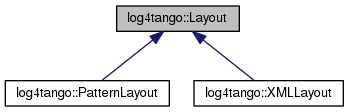

+----------+---------------------------------------+
| |Logo|   | Tango Core Classes Reference  9.2.5   |
+----------+---------------------------------------+

-  `Main Page <../../index.html>`__
-  `Related Pages <../../pages.html>`__
-  `Modules <../../modules.html>`__
-  `Namespaces <../../namespaces.html>`__
-  `Classes <../../annotated.html>`__
-  `Files <../../files.html>`__

-  `Class List <../../annotated.html>`__
-  `Class Hierarchy <../../inherits.html>`__
-  `Class Members <../../functions.html>`__

`Public Member Functions <#pub-methods>`__ \| `List of all
members <../../d9/d5c/classlog4tango_1_1Layout-members.html>`__

log4tango::Layout Class Reference

``#include "Layout.hh"``

Inheritance diagram for log4tango::Layout:

|Inheritance graph|

[`legend <../../graph_legend.html>`__\ ]

Public Member Functions
-----------------------

 

`Layout <../../d7/da6/classlog4tango_1_1Layout.html#a053084d0c22a45a3304a75f7b0c5de39>`__
()

 

| Constructor for
`Layout <../../d7/da6/classlog4tango_1_1Layout.html>`__.
`More... <#a053084d0c22a45a3304a75f7b0c5de39>`__

 

virtual 

`~Layout <../../d7/da6/classlog4tango_1_1Layout.html#ae3298877b40a255b5723a6cfa58e00ea>`__
()

 

| Destructor for
`Layout <../../d7/da6/classlog4tango_1_1Layout.html>`__.
`More... <#ae3298877b40a255b5723a6cfa58e00ea>`__

 

virtual std::string 

`format <../../d7/da6/classlog4tango_1_1Layout.html#a0ade719b2ab1ce512aca5699f136eb8b>`__
(const
`LoggingEvent <../../d8/df2/structlog4tango_1_1LoggingEvent.html>`__
&event)

 

| Formats the
`LoggingEvent <../../d8/df2/structlog4tango_1_1LoggingEvent.html>`__
data to a string that appenders can log.
`More... <#a0ade719b2ab1ce512aca5699f136eb8b>`__

 

Constructor & Destructor Documentation
--------------------------------------

+--------------------------------------+--------------------------------------+
| +-----------------------------+----- | inline                               |
| +----+-----+----+                    |                                      |
| | log4tango::Layout::Layout   | (    |                                      |
| |    | )   |    |                    |                                      |
| +-----------------------------+----- |                                      |
| +----+-----+----+                    |                                      |
                                                                             
+--------------------------------------+--------------------------------------+

Constructor for `Layout <../../d7/da6/classlog4tango_1_1Layout.html>`__.

+--------------------------------------+--------------------------------------+
| +----------------------------------- | inlinevirtual                        |
| ---+-----+----+-----+----+           |                                      |
| | virtual log4tango::Layout::~Layout |                                      |
|    | (   |    | )   |    |           |                                      |
| +----------------------------------- |                                      |
| ---+-----+----+-----+----+           |                                      |
                                                                             
+--------------------------------------+--------------------------------------+

Destructor for `Layout <../../d7/da6/classlog4tango_1_1Layout.html>`__.

Member Function Documentation
-----------------------------

+--------------------------------------+--------------------------------------+
| +----------------------------------- | virtual                              |
| ------+-----+----------------------- |                                      |
| ------------------------------------ |                                      |
| ----------------------+-----------+- |                                      |
| ----+----+                           |                                      |
| | std::string log4tango::Layout::for |                                      |
| mat   | (   | const `LoggingEvent <. |                                      |
| ./../d8/df2/structlog4tango_1_1Loggi |                                      |
| ngEvent.html>`__ &    | *event*   |  |                                      |
| )   |    |                           |                                      |
| +----------------------------------- |                                      |
| ------+-----+----------------------- |                                      |
| ------------------------------------ |                                      |
| ----------------------+-----------+- |                                      |
| ----+----+                           |                                      |
                                                                             
+--------------------------------------+--------------------------------------+

Formats the
`LoggingEvent <../../d8/df2/structlog4tango_1_1LoggingEvent.html>`__
data to a string that appenders can log.

Overload this method to create your own layout format.

Parameters
    +---------+-----------------------------------------------------------------------------+
    | event   | The `LoggingEvent <../../d8/df2/structlog4tango_1_1LoggingEvent.html>`__.   |
    +---------+-----------------------------------------------------------------------------+

Returns
    an appendable string.

Reimplemented in
`log4tango::PatternLayout <../../db/d60/classlog4tango_1_1PatternLayout.html#a127f7708ad24a3290d3c6cbe29257020>`__,
and
`log4tango::XMLLayout <../../d2/d7c/classlog4tango_1_1XMLLayout.html#a0f455c8af4768383dc989923eddc72f3>`__.

References
`log4tango::Level::get\_name() <../../d8/d0e/classlog4tango_1_1Level.html#a613426ab63e991eed00912c0dfd870c0>`__,
`log4tango::LoggingEvent::level <../../d8/df2/structlog4tango_1_1LoggingEvent.html#a669d5dbcaf34dff9ad9ec7578856a550>`__,
and
`std::ostringstream::str() <../../d7/d24/classstd_1_1ostringstream.html#a8acec234b9393fb5ee0d9c8f7bbb6cb4>`__.

Referenced by
`log4tango::OstreamAppender::\_append() <../../df/d37/classlog4tango_1_1OstreamAppender.html#a90001f5d7e7ef88b5492e6154d90aa86>`__.

--------------

The documentation for this class was generated from the following files:

-  `Layout.hh <../../db/da8/Layout_8hh_source.html>`__
-  `Layout.cpp <../../d5/d08/Layout_8cpp.html>`__

-  `log4tango <../../d4/db0/namespacelog4tango.html>`__
-  `Layout <../../d7/da6/classlog4tango_1_1Layout.html>`__
-  Generated on Fri Oct 7 2016 11:11:15 for Tango Core Classes Reference
   by |doxygen| 1.8.8

.. |Logo| image:: ../../logo.jpg

.. |doxygen| image:: ../../doxygen.png
   :target: http://www.doxygen.org/index.html
