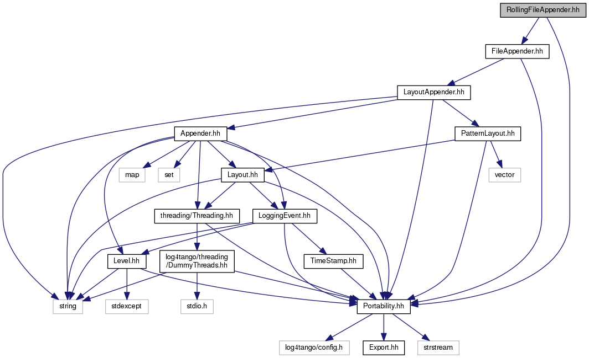

+----------+---------------------------------------+
| |Logo|   | Tango Core Classes Reference  9.2.5   |
+----------+---------------------------------------+

-  `Main Page <../../index.html>`__
-  `Related Pages <../../pages.html>`__
-  `Modules <../../modules.html>`__
-  `Namespaces <../../namespaces.html>`__
-  `Classes <../../annotated.html>`__
-  `Files <../../files.html>`__

-  `File List <../../files.html>`__
-  `File Members <../../globals.html>`__

`Classes <#nested-classes>`__ \| `Namespaces <#namespaces>`__

RollingFileAppender.hh File Reference

| ``#include "Portability.hh"``
|  ``#include "FileAppender.hh"``

Include dependency graph for RollingFileAppender.hh:

|image1|

This graph shows which files directly or indirectly include this file:

|image2|

`Go to the source code of this
file. <../../d7/dd5/RollingFileAppender_8hh_source.html>`__

Classes
-------

class  

`log4tango::RollingFileAppender <../../d9/db4/classlog4tango_1_1RollingFileAppender.html>`__

 

Namespaces
----------

 

`log4tango <../../d4/db0/namespacelog4tango.html>`__

 

-  `include <../../dir_93bc669b4520ad36068f344e109b7d17.html>`__
-  `log4tango <../../dir_5a849e394260fc4e91409ef0349c0857.html>`__
-  `RollingFileAppender.hh <../../d7/dd5/RollingFileAppender_8hh.html>`__
-  Generated on Fri Oct 7 2016 11:11:15 for Tango Core Classes Reference
   by |doxygen| 1.8.8

.. |Logo| image:: ../../logo.jpg

.. |image2| image:: ../../da/d71/RollingFileAppender_8hh__dep__incl.png
.. |doxygen| image:: ../../doxygen.png
   :target: http://www.doxygen.org/index.html
