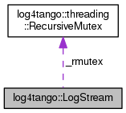

+----------+---------------------------------------+
| |Logo|   | Tango Core Classes Reference  9.2.5   |
+----------+---------------------------------------+

-  `Main Page <../../index.html>`__
-  `Related Pages <../../pages.html>`__
-  `Modules <../../modules.html>`__
-  `Namespaces <../../namespaces.html>`__
-  `Classes <../../annotated.html>`__
-  `Files <../../files.html>`__

-  `Class List <../../annotated.html>`__
-  `Class Hierarchy <../../inherits.html>`__
-  `Class Members <../../functions.html>`__

`Public Member Functions <#pub-methods>`__ \| `Protected
Attributes <#pro-attribs>`__ \| `List of all
members <../../d5/d89/classlog4tango_1_1LogStream-members.html>`__

log4tango::LogStream Class Reference

``#include "LogStream.hh"``

Collaboration diagram for log4tango::LogStream:

|Collaboration graph|

[`legend <../../graph_legend.html>`__\ ]

Public Member Functions
-----------------------

 

`LogStream <../../d7/dff/classlog4tango_1_1LogStream.html#a4bc7ffb9c5829c5db8ed1af5bcf94bb0>`__
(`LogStreamBuf <../../db/d3a/classlog4tango_1_1LogStreamBuf.html>`__
\*stream\_buf)

 

virtual 

`~LogStream <../../d7/dff/classlog4tango_1_1LogStream.html#a2f4d7a4910bece964dd45dec4f874369>`__
()

 

`LogStream <../../d7/dff/classlog4tango_1_1LogStream.html>`__ & 

`operator<< <../../d7/dff/classlog4tango_1_1LogStream.html#a183f7f962965a0330300f5a1b6a58d2d>`__
(const
`LogInitiator <../../d3/dfe/classlog4tango_1_1LogInitiator.html>`__ &)

 

template<typename T >

`LogStream <../../d7/dff/classlog4tango_1_1LogStream.html>`__ & 

`operator<< <../../d7/dff/classlog4tango_1_1LogStream.html#a63227c36b86838d90f78b6afeacff5a1>`__
(const T &t)

 

`LogStream <../../d7/dff/classlog4tango_1_1LogStream.html>`__ & 

`operator<< <../../d7/dff/classlog4tango_1_1LogStream.html#ab46b78902a2d887f039c79239a4d4e43>`__
(`LogSeparator <../../d0/d2f/classlog4tango_1_1LogSeparator.html>`__ &)

 

Protected Attributes
--------------------

std::ostream 

`\_ostream <../../d7/dff/classlog4tango_1_1LogStream.html#a56e910c1670fcc56dc3ccf665fb7d686>`__

 

`threading::RecursiveMutex <../../df/d2c/classlog4tango_1_1threading_1_1RecursiveMutex.html>`__ 

`\_rmutex <../../d7/dff/classlog4tango_1_1LogStream.html#a809fbebb6eac303284d9348eee8c25e3>`__

 

Constructor & Destructor Documentation
--------------------------------------

+-----------------------------------+-----+---------------------------------------------------------------------------+-----------------+-----+----+
| log4tango::LogStream::LogStream   | (   | `LogStreamBuf <../../db/d3a/classlog4tango_1_1LogStreamBuf.html>`__ \*    | *stream\_buf*   | )   |    |
+-----------------------------------+-----+---------------------------------------------------------------------------+-----------------+-----+----+

+--------------------------------------+--------------------------------------+
| +----------------------------------- | virtual                              |
| ---------+-----+----+-----+----+     |                                      |
| | virtual log4tango::LogStream::~Log |                                      |
| Stream   | (   |    | )   |    |     |                                      |
| +----------------------------------- |                                      |
| ---------+-----+----+-----+----+     |                                      |
                                                                             
+--------------------------------------+--------------------------------------+

Member Function Documentation
-----------------------------

+--------------------------------------+--------------------------------------+
| +----------------------------------- | inline                               |
| ------------------------------------ |                                      |
| ------------------------------+----- |                                      |
| +----------------------------------- |                                      |
| ------------------------------------ |                                      |
| ---------+----+-----+----+           |                                      |
| | `LogStream <../../d7/dff/classlog4 |                                      |
| tango_1_1LogStream.html>`__\ & log4t |                                      |
| ango::LogStream::operator<<   | (    |                                      |
| | const `LogInitiator <../../d3/dfe/ |                                      |
| classlog4tango_1_1LogInitiator.html> |                                      |
| `__ &    |    | )   |    |           |                                      |
| +----------------------------------- |                                      |
| ------------------------------------ |                                      |
| ------------------------------+----- |                                      |
| +----------------------------------- |                                      |
| ------------------------------------ |                                      |
| ---------+----+-----+----+           |                                      |
                                                                             
+--------------------------------------+--------------------------------------+

template<typename T >

+--------------------------------------+--------------------------------------+
| +----------------------------------- | inline                               |
| ------------------------------------ |                                      |
| ------------------------------+----- |                                      |
| +--------------+-------+-----+----+  |                                      |
| | `LogStream <../../d7/dff/classlog4 |                                      |
| tango_1_1LogStream.html>`__\ & log4t |                                      |
| ango::LogStream::operator<<   | (    |                                      |
| | const T &    | *t*   | )   |    |  |                                      |
| +----------------------------------- |                                      |
| ------------------------------------ |                                      |
| ------------------------------+----- |                                      |
| +--------------+-------+-----+----+  |                                      |
                                                                             
+--------------------------------------+--------------------------------------+

References
`log4tango::threading::RecursiveMutex::lock() <../../df/d2c/classlog4tango_1_1threading_1_1RecursiveMutex.html#ab25b75795eeed61c179ba00d3b9cd4e0>`__.

+--------------------------------------+--------------------------------------+
| +----------------------------------- | inline                               |
| ------------------------------------ |                                      |
| ------------------------------+----- |                                      |
| +----------------------------------- |                                      |
| ------------------------------------ |                                      |
| ---+----+-----+----+                 |                                      |
| | `LogStream <../../d7/dff/classlog4 |                                      |
| tango_1_1LogStream.html>`__\ & log4t |                                      |
| ango::LogStream::operator<<   | (    |                                      |
| | `LogSeparator <../../d0/d2f/classl |                                      |
| og4tango_1_1LogSeparator.html>`__ &  |                                      |
|    |    | )   |    |                 |                                      |
| +----------------------------------- |                                      |
| ------------------------------------ |                                      |
| ------------------------------+----- |                                      |
| +----------------------------------- |                                      |
| ------------------------------------ |                                      |
| ---+----+-----+----+                 |                                      |
                                                                             
+--------------------------------------+--------------------------------------+

References
`log4tango::threading::RecursiveMutex::lock() <../../df/d2c/classlog4tango_1_1threading_1_1RecursiveMutex.html#ab25b75795eeed61c179ba00d3b9cd4e0>`__,
and
`log4tango::threading::RecursiveMutex::unlockn() <../../df/d2c/classlog4tango_1_1threading_1_1RecursiveMutex.html#ae8ca497191c6f8ac476f50fe5172f777>`__.

Member Data Documentation
-------------------------

+--------------------------------------+--------------------------------------+
| +----------------------------------- | protected                            |
| -------------+                       |                                      |
| | std::ostream log4tango::LogStream: |                                      |
| :\_ostream   |                       |                                      |
| +----------------------------------- |                                      |
| -------------+                       |                                      |
                                                                             
+--------------------------------------+--------------------------------------+

+--------------------------------------+--------------------------------------+
| +----------------------------------- | protected                            |
| ------------------------------------ |                                      |
| ------------------------------------ |                                      |
| -----------------------+             |                                      |
| | `threading::RecursiveMutex <../../ |                                      |
| df/d2c/classlog4tango_1_1threading_1 |                                      |
| _1RecursiveMutex.html>`__ log4tango: |                                      |
| :LogStream::\_rmutex   |             |                                      |
| +----------------------------------- |                                      |
| ------------------------------------ |                                      |
| ------------------------------------ |                                      |
| -----------------------+             |                                      |
                                                                             
+--------------------------------------+--------------------------------------+

--------------

The documentation for this class was generated from the following file:

-  `LogStream.hh <../../d6/d89/LogStream_8hh_source.html>`__

-  `log4tango <../../d4/db0/namespacelog4tango.html>`__
-  `LogStream <../../d7/dff/classlog4tango_1_1LogStream.html>`__
-  Generated on Fri Oct 7 2016 11:11:16 for Tango Core Classes Reference
   by |doxygen| 1.8.8

.. |Logo| image:: ../../logo.jpg

.. |doxygen| image:: ../../doxygen.png
   :target: http://www.doxygen.org/index.html
