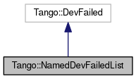

+----------+---------------------------------------+
| |Logo|   | Tango Core Classes Reference  9.2.5   |
+----------+---------------------------------------+

-  `Main Page <../../index.html>`__
-  `Related Pages <../../pages.html>`__
-  `Modules <../../modules.html>`__
-  `Namespaces <../../namespaces.html>`__
-  `Classes <../../annotated.html>`__
-  `Files <../../files.html>`__

-  `Class List <../../annotated.html>`__
-  `Class Hierarchy <../../inherits.html>`__
-  `Class Members <../../functions.html>`__

`Public Member Functions <#pub-methods>`__ \| `Public
Attributes <#pub-attribs>`__ \| `List of all
members <../../de/def/classTango_1_1NamedDevFailedList-members.html>`__

Tango::NamedDevFailedList Class Reference

`Client classes <../../d1/d45/group__Client.html>`__

An exception class.
`More... <../../d8/d55/classTango_1_1NamedDevFailedList.html#details>`__

Inheritance diagram for Tango::NamedDevFailedList:

|Inheritance graph|

[`legend <../../graph_legend.html>`__\ ]

Collaboration diagram for Tango::NamedDevFailedList:

|Collaboration graph|

[`legend <../../graph_legend.html>`__\ ]

Public Member Functions
-----------------------

bool 

`call\_failed <../../d8/d55/classTango_1_1NamedDevFailedList.html#a3956dbf7ffa91df81efda72c4a1f6ab2>`__
()

 

| Check if the call failed.
`More... <#a3956dbf7ffa91df81efda72c4a1f6ab2>`__

 

size\_t 

`get\_faulty\_attr\_nb <../../d8/d55/classTango_1_1NamedDevFailedList.html#ab158860b2498a2ac2c2c0b019d04108f>`__
()

 

| Get faulty attribute number.
`More... <#ab158860b2498a2ac2c2c0b019d04108f>`__

 

Public Attributes
-----------------

vector<
`NamedDevFailed <../../dc/d08/classTango_1_1NamedDevFailed.html>`__ > 

`err\_list <../../d8/d55/classTango_1_1NamedDevFailedList.html#a6223048f31f50ac1f6eaa9b6eb625236>`__

 

| There is one element in this vector for each attribute which failed
during its writing. `More... <#a6223048f31f50ac1f6eaa9b6eb625236>`__

 

Detailed Description
--------------------

An exception class.

This class is used as exception for the DeviceProxy::write\_attribute
call()

$Author$ $Revision$

Member Function Documentation
-----------------------------

+--------------------------------------+--------------------------------------+
| +----------------------------------- | inline                               |
| -------------+-----+----+-----+----+ |                                      |
| | bool Tango::NamedDevFailedList::ca |                                      |
| ll\_failed   | (   |    | )   |    | |                                      |
| +----------------------------------- |                                      |
| -------------+-----+----+-----+----+ |                                      |
                                                                             
+--------------------------------------+--------------------------------------+

Check if the call failed.

This method returns true if at least one attribute failed during the
call

Returns
    A boolean set to true if the call failed for at least one attribute

+--------------------------------------+--------------------------------------+
| +----------------------------------- | inline                               |
| -------------------------+-----+---- |                                      |
| +-----+----+                         |                                      |
| | size\_t Tango::NamedDevFailedList: |                                      |
| :get\_faulty\_attr\_nb   | (   |     |                                      |
| | )   |    |                         |                                      |
| +----------------------------------- |                                      |
| -------------------------+-----+---- |                                      |
| +-----+----+                         |                                      |
                                                                             
+--------------------------------------+--------------------------------------+

Get faulty attribute number.

Returns the number of attributes which failed during the
write\_attribute call.

Returns
    The number of attribute(s) which fail during the write\_attribute
    call

Member Data Documentation
-------------------------

+----------------------------------------------------------------------------------------------------------------------+
| vector<`NamedDevFailed <../../dc/d08/classTango_1_1NamedDevFailed.html>`__\ > Tango::NamedDevFailedList::err\_list   |
+----------------------------------------------------------------------------------------------------------------------+

There is one element in this vector for each attribute which failed
during its writing.

--------------

The documentation for this class was generated from the following file:

-  `apiexcept.h <../../d3/d7a/apiexcept_8h_source.html>`__

-  `Tango <../../de/ddf/namespaceTango.html>`__
-  `NamedDevFailedList <../../d8/d55/classTango_1_1NamedDevFailedList.html>`__
-  Generated on Fri Oct 7 2016 11:11:17 for Tango Core Classes Reference
   by |doxygen| 1.8.8

.. |Logo| image:: ../../logo.jpg

.. |Collaboration graph| image:: ../../d2/d33/classTango_1_1NamedDevFailedList__coll__graph.png
.. |doxygen| image:: ../../doxygen.png
   :target: http://www.doxygen.org/index.html
