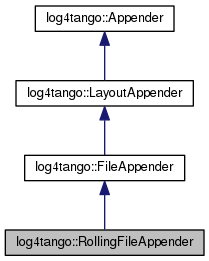

+----------+---------------------------------------+
| |Logo|   | Tango Core Classes Reference  9.2.5   |
+----------+---------------------------------------+

-  `Main Page <../../index.html>`__
-  `Related Pages <../../pages.html>`__
-  `Modules <../../modules.html>`__
-  `Namespaces <../../namespaces.html>`__
-  `Classes <../../annotated.html>`__
-  `Files <../../files.html>`__

-  `Class List <../../annotated.html>`__
-  `Class Hierarchy <../../inherits.html>`__
-  `Class Members <../../functions.html>`__

`Public Member Functions <#pub-methods>`__ \| `Protected Member
Functions <#pro-methods>`__ \| `Protected Attributes <#pro-attribs>`__
\| `List of all
members <../../db/d00/classlog4tango_1_1RollingFileAppender-members.html>`__

log4tango::RollingFileAppender Class Reference

``#include "RollingFileAppender.hh"``

Inheritance diagram for log4tango::RollingFileAppender:

|Inheritance graph|

[`legend <../../graph_legend.html>`__\ ]

Collaboration diagram for log4tango::RollingFileAppender:

|Collaboration graph|

[`legend <../../graph_legend.html>`__\ ]

Public Member Functions
-----------------------

 

`RollingFileAppender <../../d9/db4/classlog4tango_1_1RollingFileAppender.html#aa2f3a64b66ee5935b865643ef4bb5ad9>`__
(const std::string &name, const std::string &file\_name, size\_t
max\_fs=10 \*1024 \*1024, unsigned int max\_bi=1, bool
`append <../../d7/dc4/classlog4tango_1_1Appender.html#acfb6f50c20043bd740b198dfbb4231ea>`__\ =true,
`mode\_t <../../d4/db0/namespacelog4tango.html#af02411cb691986e819f7fbf75872b81a>`__
mode=00644)

 

virtual unsigned int 

`get\_max\_backup\_index <../../d9/db4/classlog4tango_1_1RollingFileAppender.html#a82aa45ae95ec94e239586009ed95ce02>`__
() const

 

virtual size\_t 

`get\_max\_file\_size <../../d9/db4/classlog4tango_1_1RollingFileAppender.html#af75ea193158cf261795b93ae4088b13a>`__
() const

 

virtual void 

`roll\_over <../../d9/db4/classlog4tango_1_1RollingFileAppender.html#a137e08d9ff85d0b78c06be2323bd66c2>`__
()

 

virtual void 

`set\_max\_backup\_index <../../d9/db4/classlog4tango_1_1RollingFileAppender.html#a6e2fd2ba4d4e1e06a26d6509f6e774f3>`__
(unsigned int maxBackups)

 

virtual void 

`set\_maximum\_file\_size <../../d9/db4/classlog4tango_1_1RollingFileAppender.html#a4c6fbe879f1dcd5ac0e30946e43b10a0>`__
(size\_t max\_fs)

 

|-| Public Member Functions inherited from
`log4tango::FileAppender <../../dd/d62/classlog4tango_1_1FileAppender.html>`__

 

`FileAppender <../../dd/d62/classlog4tango_1_1FileAppender.html#a43e09e7221ba060eb95252ee5461da95>`__
(const std::string &name, const std::string &fileName, bool
`append <../../d7/dc4/classlog4tango_1_1Appender.html#acfb6f50c20043bd740b198dfbb4231ea>`__\ =true,
`mode\_t <../../d4/db0/namespacelog4tango.html#af02411cb691986e819f7fbf75872b81a>`__
mode=00644)

 

| Constructs a
`FileAppender <../../dd/d62/classlog4tango_1_1FileAppender.html>`__.
`More... <#a43e09e7221ba060eb95252ee5461da95>`__

 

 

`FileAppender <../../dd/d62/classlog4tango_1_1FileAppender.html#ab4cba01161e7a5db14ab19b07d1397f9>`__
(const std::string &name, int fd)

 

| Constructs a
`FileAppender <../../dd/d62/classlog4tango_1_1FileAppender.html>`__ to
an already open file descriptor.
`More... <#ab4cba01161e7a5db14ab19b07d1397f9>`__

 

virtual 

`~FileAppender <../../dd/d62/classlog4tango_1_1FileAppender.html#a051e5c4850313d9fb3b4240c73d9f61c>`__
()

 

| Destructor. `More... <#a051e5c4850313d9fb3b4240c73d9f61c>`__

 

virtual void 

`close <../../dd/d62/classlog4tango_1_1FileAppender.html#aa354da43ca498a14bdd83b8f8065589d>`__
(void)

 

| Closes the logfile. `More... <#aa354da43ca498a14bdd83b8f8065589d>`__

 

virtual bool 

`get\_append <../../dd/d62/classlog4tango_1_1FileAppender.html#a1958ac2f7755b5415abe40dc00104d6f>`__
(void) const

 

| Gets the value of the 'append' option.
`More... <#a1958ac2f7755b5415abe40dc00104d6f>`__

 

virtual
`mode\_t <../../d4/db0/namespacelog4tango.html#af02411cb691986e819f7fbf75872b81a>`__ 

`get\_mode <../../dd/d62/classlog4tango_1_1FileAppender.html#ab7ebf728457c73d43b16725e048f1597>`__
() const

 

| Gets the file open mode.
`More... <#ab7ebf728457c73d43b16725e048f1597>`__

 

virtual bool 

`is\_valid <../../dd/d62/classlog4tango_1_1FileAppender.html#a418db9eff584e38bd167dcd4e50df6c1>`__
(void) const

 

| Check if the appender is valid.
`More... <#a418db9eff584e38bd167dcd4e50df6c1>`__

 

virtual bool 

`reopen <../../dd/d62/classlog4tango_1_1FileAppender.html#a17989960f7118b8628a93c69b10755ca>`__
(void)

 

| Reopens the logfile. `More... <#a17989960f7118b8628a93c69b10755ca>`__

 

virtual void 

`set\_append <../../dd/d62/classlog4tango_1_1FileAppender.html#a2b73b4da440d31a0b2a4ee7a0016b87c>`__
(bool
`append <../../d7/dc4/classlog4tango_1_1Appender.html#acfb6f50c20043bd740b198dfbb4231ea>`__)

 

| Sets the append vs truncate flag.
`More... <#a2b73b4da440d31a0b2a4ee7a0016b87c>`__

 

virtual void 

`set\_mode <../../dd/d62/classlog4tango_1_1FileAppender.html#abf1747af681b0fa4ac760c364a5da1c6>`__
(`mode\_t <../../d4/db0/namespacelog4tango.html#af02411cb691986e819f7fbf75872b81a>`__
mode)

 

| Sets the file open mode.
`More... <#abf1747af681b0fa4ac760c364a5da1c6>`__

 

|-| Public Member Functions inherited from
`log4tango::LayoutAppender <../../d3/db6/classlog4tango_1_1LayoutAppender.html>`__

 

`LayoutAppender <../../d3/db6/classlog4tango_1_1LayoutAppender.html#aae15fc6ce336d263386c6866ad569782>`__
(const std::string &name)

 

virtual 

`~LayoutAppender <../../d3/db6/classlog4tango_1_1LayoutAppender.html#a2822f627fd98e29db0a9a7c96377e81e>`__
()

 

virtual bool 

`requires\_layout <../../d3/db6/classlog4tango_1_1LayoutAppender.html#aed53ada140e2b10a63d4d836b0e22ba9>`__
() const

 

| Check if the appender uses a layout.
`More... <#aed53ada140e2b10a63d4d836b0e22ba9>`__

 

virtual void 

`set\_layout <../../d3/db6/classlog4tango_1_1LayoutAppender.html#ac3d2b08e933399a5dfc78dab2c208055>`__
(`Layout <../../d7/da6/classlog4tango_1_1Layout.html>`__ \*layout=0)

 

| Change the layout. `More... <#ac3d2b08e933399a5dfc78dab2c208055>`__

 

|-| Public Member Functions inherited from
`log4tango::Appender <../../d7/dc4/classlog4tango_1_1Appender.html>`__

virtual 

`~Appender <../../d7/dc4/classlog4tango_1_1Appender.html#a3951b12a37424e9418963680662388b1>`__
()

 

| Destructor for
`Appender <../../d7/dc4/classlog4tango_1_1Appender.html>`__.
`More... <#a3951b12a37424e9418963680662388b1>`__

 

int 

`append <../../d7/dc4/classlog4tango_1_1Appender.html#acfb6f50c20043bd740b198dfbb4231ea>`__
(const
`LoggingEvent <../../d8/df2/structlog4tango_1_1LoggingEvent.html>`__
&event)

 

| Log in `Appender <../../d7/dc4/classlog4tango_1_1Appender.html>`__
specific way. `More... <#acfb6f50c20043bd740b198dfbb4231ea>`__

 

const std::string & 

`get\_name <../../d7/dc4/classlog4tango_1_1Appender.html#ac02d43ef46297bcc9eb3e1442d00b58c>`__
(void) const

 

| Returns this appender name.
`More... <#ac02d43ef46297bcc9eb3e1442d00b58c>`__

 

Protected Member Functions
--------------------------

virtual int 

`\_append <../../d9/db4/classlog4tango_1_1RollingFileAppender.html#ad25a1bd45e1dffc755821acca3b958f2>`__
(const
`LoggingEvent <../../d8/df2/structlog4tango_1_1LoggingEvent.html>`__
&event)

 

| Log in `Appender <../../d7/dc4/classlog4tango_1_1Appender.html>`__
specific way. `More... <#ad25a1bd45e1dffc755821acca3b958f2>`__

 

|-| Protected Member Functions inherited from
`log4tango::LayoutAppender <../../d3/db6/classlog4tango_1_1LayoutAppender.html>`__

`Layout <../../d7/da6/classlog4tango_1_1Layout.html>`__ & 

`get\_layout <../../d3/db6/classlog4tango_1_1LayoutAppender.html#a5b0903233dd0bb8ea2d6fc33a5b85cb0>`__
()

 

|-| Protected Member Functions inherited from
`log4tango::Appender <../../d7/dc4/classlog4tango_1_1Appender.html>`__

 

`Appender <../../d7/dc4/classlog4tango_1_1Appender.html#a16f9d0456a87ff10d57b02f7d5c2cc01>`__
(const std::string &name)

 

| Constructor for
`Appender <../../d7/dc4/classlog4tango_1_1Appender.html>`__.
`More... <#a16f9d0456a87ff10d57b02f7d5c2cc01>`__

 

virtual void 

`level\_changed <../../d7/dc4/classlog4tango_1_1Appender.html#a3ee7b310ce4681a93e1f53bdcc02a15c>`__
(`Level::Value <../../d8/d0e/classlog4tango_1_1Level.html#aa708c09b6a19a8cc8a3b19631561ca99>`__
new\_level)

 

| Inform an appender that its
`Logger <../../d4/d1c/classlog4tango_1_1Logger.html>`__'s logging level
has changed. `More... <#a3ee7b310ce4681a93e1f53bdcc02a15c>`__

 

Protected Attributes
--------------------

unsigned int 

`\_max\_backup\_index <../../d9/db4/classlog4tango_1_1RollingFileAppender.html#a5ceb9ceff2058cc7726986cf54e2efa9>`__

 

size\_t 

`\_max\_file\_size <../../d9/db4/classlog4tango_1_1RollingFileAppender.html#aa796609c18d8522c2d6898d4f12ffba4>`__

 

|-| Protected Attributes inherited from
`log4tango::FileAppender <../../dd/d62/classlog4tango_1_1FileAppender.html>`__

int 

`\_fd <../../dd/d62/classlog4tango_1_1FileAppender.html#a04f8a77d3ad3aa7cdcaa8f6be93c5ab0>`__

 

const std::string 

`\_file\_name <../../dd/d62/classlog4tango_1_1FileAppender.html#a7a21e40ff4eb363cc20678a4be99c93d>`__

 

int 

`\_flags <../../dd/d62/classlog4tango_1_1FileAppender.html#a6d4608df941bbaef01e82396bfc85cb2>`__

 

`mode\_t <../../d4/db0/namespacelog4tango.html#af02411cb691986e819f7fbf75872b81a>`__ 

`\_mode <../../dd/d62/classlog4tango_1_1FileAppender.html#a158481e2d508ad2615d78615a86e5206>`__

 

Additional Inherited Members
----------------------------

|-| Public Types inherited from
`log4tango::LayoutAppender <../../d3/db6/classlog4tango_1_1LayoutAppender.html>`__

typedef `Layout <../../d7/da6/classlog4tango_1_1Layout.html>`__ 

`DefaultLayoutType <../../d3/db6/classlog4tango_1_1LayoutAppender.html#afff8b793c258c86701cbd1fe72925b49>`__

 

Constructor & Destructor Documentation
--------------------------------------

+-------------------------------------------------------+-----+-----------------------------------------------------------------------------------------+---------------------------------+
| log4tango::RollingFileAppender::RollingFileAppender   | (   | const std::string &                                                                     | *name*,                         |
+-------------------------------------------------------+-----+-----------------------------------------------------------------------------------------+---------------------------------+
|                                                       |     | const std::string &                                                                     | *file\_name*,                   |
+-------------------------------------------------------+-----+-----------------------------------------------------------------------------------------+---------------------------------+
|                                                       |     | size\_t                                                                                 | *max\_fs* = ``10*1024*1024``,   |
+-------------------------------------------------------+-----+-----------------------------------------------------------------------------------------+---------------------------------+
|                                                       |     | unsigned int                                                                            | *max\_bi* = ``1``,              |
+-------------------------------------------------------+-----+-----------------------------------------------------------------------------------------+---------------------------------+
|                                                       |     | bool                                                                                    | *append* = ``true``,            |
+-------------------------------------------------------+-----+-----------------------------------------------------------------------------------------+---------------------------------+
|                                                       |     | `mode\_t <../../d4/db0/namespacelog4tango.html#af02411cb691986e819f7fbf75872b81a>`__    | *mode* = ``00644``              |
+-------------------------------------------------------+-----+-----------------------------------------------------------------------------------------+---------------------------------+
|                                                       | )   |                                                                                         |                                 |
+-------------------------------------------------------+-----+-----------------------------------------------------------------------------------------+---------------------------------+

Member Function Documentation
-----------------------------

+--------------------------------------+--------------------------------------+
| +----------------------------------- | protectedvirtual                     |
| -------------+-----+---------------- |                                      |
| ------------------------------------ |                                      |
| -----------------------------+------ |                                      |
| -----+-----+----+                    |                                      |
| | int log4tango::RollingFileAppender |                                      |
| ::\_append   | (   | const `LoggingE |                                      |
| vent <../../d8/df2/structlog4tango_1 |                                      |
| _1LoggingEvent.html>`__ &    | *even |                                      |
| t*   | )   |    |                    |                                      |
| +----------------------------------- |                                      |
| -------------+-----+---------------- |                                      |
| ------------------------------------ |                                      |
| -----------------------------+------ |                                      |
| -----+-----+----+                    |                                      |
                                                                             
+--------------------------------------+--------------------------------------+

Log in `Appender <../../d7/dc4/classlog4tango_1_1Appender.html>`__
specific way.

Subclasses of
`Appender <../../d7/dc4/classlog4tango_1_1Appender.html>`__ should
implement this method to perform actual logging.

Parameters
    +---------+------------------------------------------------------------------------------------+
    | event   | The `LoggingEvent <../../d8/df2/structlog4tango_1_1LoggingEvent.html>`__ to log.   |
    +---------+------------------------------------------------------------------------------------+

Reimplemented from
`log4tango::FileAppender <../../dd/d62/classlog4tango_1_1FileAppender.html#acc1e885ec09a9f206383284656a0079e>`__.

References
`log4tango::FileAppender::\_append() <../../dd/d62/classlog4tango_1_1FileAppender.html#acc1e885ec09a9f206383284656a0079e>`__,
`log4tango::FileAppender::\_fd <../../dd/d62/classlog4tango_1_1FileAppender.html#a04f8a77d3ad3aa7cdcaa8f6be93c5ab0>`__,
`\_max\_file\_size <../../d9/db4/classlog4tango_1_1RollingFileAppender.html#aa796609c18d8522c2d6898d4f12ffba4>`__,
and
`roll\_over() <../../d9/db4/classlog4tango_1_1RollingFileAppender.html#a137e08d9ff85d0b78c06be2323bd66c2>`__.

+--------------------------------------+--------------------------------------+
| +----------------------------------- | virtual                              |
| ------------------------------------ |                                      |
| -+-----+----+-----+---------+        |                                      |
| | unsigned int log4tango::RollingFil |                                      |
| eAppender::get\_max\_backup\_index   |                                      |
|  | (   |    | )   | const   |        |                                      |
| +----------------------------------- |                                      |
| ------------------------------------ |                                      |
| -+-----+----+-----+---------+        |                                      |
                                                                             
+--------------------------------------+--------------------------------------+

References
`\_max\_backup\_index <../../d9/db4/classlog4tango_1_1RollingFileAppender.html#a5ceb9ceff2058cc7726986cf54e2efa9>`__.

+--------------------------------------+--------------------------------------+
| +----------------------------------- | virtual                              |
| -----------------------------+-----+ |                                      |
| ----+-----+---------+                |                                      |
| | size\_t log4tango::RollingFileAppe |                                      |
| nder::get\_max\_file\_size   | (   | |                                      |
|     | )   | const   |                |                                      |
| +----------------------------------- |                                      |
| -----------------------------+-----+ |                                      |
| ----+-----+---------+                |                                      |
                                                                             
+--------------------------------------+--------------------------------------+

References
`\_max\_file\_size <../../d9/db4/classlog4tango_1_1RollingFileAppender.html#aa796609c18d8522c2d6898d4f12ffba4>`__.

+--------------------------------------+--------------------------------------+
| +----------------------------------- | virtual                              |
| ----------------+-----+----+-----+-- |                                      |
| --+                                  |                                      |
| | void log4tango::RollingFileAppende |                                      |
| r::roll\_over   | (   |    | )   |   |                                      |
|   |                                  |                                      |
| +----------------------------------- |                                      |
| ----------------+-----+----+-----+-- |                                      |
| --+                                  |                                      |
                                                                             
+--------------------------------------+--------------------------------------+

References
`log4tango::FileAppender::\_fd <../../dd/d62/classlog4tango_1_1FileAppender.html#a04f8a77d3ad3aa7cdcaa8f6be93c5ab0>`__,
`log4tango::FileAppender::\_file\_name <../../dd/d62/classlog4tango_1_1FileAppender.html#a7a21e40ff4eb363cc20678a4be99c93d>`__,
`log4tango::FileAppender::\_flags <../../dd/d62/classlog4tango_1_1FileAppender.html#a6d4608df941bbaef01e82396bfc85cb2>`__,
`\_max\_backup\_index <../../d9/db4/classlog4tango_1_1RollingFileAppender.html#a5ceb9ceff2058cc7726986cf54e2efa9>`__,
`log4tango::FileAppender::\_mode <../../dd/d62/classlog4tango_1_1FileAppender.html#a158481e2d508ad2615d78615a86e5206>`__,
`log4tango::FileAppender::close() <../../dd/d62/classlog4tango_1_1FileAppender.html#aa354da43ca498a14bdd83b8f8065589d>`__,
and
`std::ostringstream::str() <../../d7/d24/classstd_1_1ostringstream.html#a8acec234b9393fb5ee0d9c8f7bbb6cb4>`__.

Referenced by
`\_append() <../../d9/db4/classlog4tango_1_1RollingFileAppender.html#ad25a1bd45e1dffc755821acca3b958f2>`__.

+--------------------------------------+--------------------------------------+
| +----------------------------------- | virtual                              |
| -----------------------------+-----+ |                                      |
| -----------------+----------------+- |                                      |
| ----+----+                           |                                      |
| | void log4tango::RollingFileAppende |                                      |
| r::set\_max\_backup\_index   | (   | |                                      |
|  unsigned int    | *maxBackups*   |  |                                      |
| )   |    |                           |                                      |
| +----------------------------------- |                                      |
| -----------------------------+-----+ |                                      |
| -----------------+----------------+- |                                      |
| ----+----+                           |                                      |
                                                                             
+--------------------------------------+--------------------------------------+

References
`\_max\_backup\_index <../../d9/db4/classlog4tango_1_1RollingFileAppender.html#a5ceb9ceff2058cc7726986cf54e2efa9>`__.

+--------------------------------------+--------------------------------------+
| +----------------------------------- | virtual                              |
| ------------------------------+----- |                                      |
| +------------+-------------+-----+-- |                                      |
| --+                                  |                                      |
| | void log4tango::RollingFileAppende |                                      |
| r::set\_maximum\_file\_size   | (    |                                      |
| | size\_t    | *max\_fs*   | )   |   |                                      |
|   |                                  |                                      |
| +----------------------------------- |                                      |
| ------------------------------+----- |                                      |
| +------------+-------------+-----+-- |                                      |
| --+                                  |                                      |
                                                                             
+--------------------------------------+--------------------------------------+

References
`\_max\_file\_size <../../d9/db4/classlog4tango_1_1RollingFileAppender.html#aa796609c18d8522c2d6898d4f12ffba4>`__.

Member Data Documentation
-------------------------

+--------------------------------------+--------------------------------------+
| +----------------------------------- | protected                            |
| ----------------------------------+  |                                      |
| | unsigned int log4tango::RollingFil |                                      |
| eAppender::\_max\_backup\_index   |  |                                      |
| +----------------------------------- |                                      |
| ----------------------------------+  |                                      |
                                                                             
+--------------------------------------+--------------------------------------+

Referenced by
`get\_max\_backup\_index() <../../d9/db4/classlog4tango_1_1RollingFileAppender.html#a82aa45ae95ec94e239586009ed95ce02>`__,
`roll\_over() <../../d9/db4/classlog4tango_1_1RollingFileAppender.html#a137e08d9ff85d0b78c06be2323bd66c2>`__,
and
`set\_max\_backup\_index() <../../d9/db4/classlog4tango_1_1RollingFileAppender.html#a6e2fd2ba4d4e1e06a26d6509f6e774f3>`__.

+--------------------------------------+--------------------------------------+
| +----------------------------------- | protected                            |
| --------------------------+          |                                      |
| | size\_t log4tango::RollingFileAppe |                                      |
| nder::\_max\_file\_size   |          |                                      |
| +----------------------------------- |                                      |
| --------------------------+          |                                      |
                                                                             
+--------------------------------------+--------------------------------------+

Referenced by
`\_append() <../../d9/db4/classlog4tango_1_1RollingFileAppender.html#ad25a1bd45e1dffc755821acca3b958f2>`__,
`get\_max\_file\_size() <../../d9/db4/classlog4tango_1_1RollingFileAppender.html#af75ea193158cf261795b93ae4088b13a>`__,
and
`set\_maximum\_file\_size() <../../d9/db4/classlog4tango_1_1RollingFileAppender.html#a4c6fbe879f1dcd5ac0e30946e43b10a0>`__.

--------------

The documentation for this class was generated from the following files:

-  `RollingFileAppender.hh <../../d7/dd5/RollingFileAppender_8hh_source.html>`__
-  `RollingFileAppender.cpp <../../d6/d1b/RollingFileAppender_8cpp.html>`__

-  `log4tango <../../d4/db0/namespacelog4tango.html>`__
-  `RollingFileAppender <../../d9/db4/classlog4tango_1_1RollingFileAppender.html>`__
-  Generated on Fri Oct 7 2016 11:11:16 for Tango Core Classes Reference
   by |doxygen| 1.8.8

.. |Logo| image:: ../../logo.jpg

.. |Collaboration graph| image:: ../../db/d0a/classlog4tango_1_1RollingFileAppender__coll__graph.png
.. |-| image:: ../../closed.png
.. |doxygen| image:: ../../doxygen.png
   :target: http://www.doxygen.org/index.html
