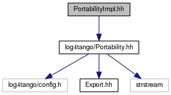

+----------+---------------------------------------+
| |Logo|   | Tango Core Classes Reference  9.2.5   |
+----------+---------------------------------------+

-  `Main Page <../../index.html>`__
-  `Related Pages <../../pages.html>`__
-  `Modules <../../modules.html>`__
-  `Namespaces <../../namespaces.html>`__
-  `Classes <../../annotated.html>`__
-  `Files <../../files.html>`__

-  `File List <../../files.html>`__
-  `File Members <../../globals.html>`__

PortabilityImpl.hh File Reference

| ``#include <log4tango/Portability.hh>``

Include dependency graph for PortabilityImpl.hh:

|image1|

This graph shows which files directly or indirectly include this file:

|image2|

`Go to the source code of this
file. <../../da/dc7/PortabilityImpl_8hh_source.html>`__

-  `src <../../dir_dce6f6254c1e480719f507d4d11781da.html>`__
-  `log4tango <../../dir_c2bf562858037ce0c46f648f9a619349.html>`__
-  `PortabilityImpl.hh <../../da/dc7/PortabilityImpl_8hh.html>`__
-  Generated on Fri Oct 7 2016 11:11:15 for Tango Core Classes Reference
   by |doxygen| 1.8.8

.. |Logo| image:: ../../logo.jpg

.. |doxygen| image:: ../../doxygen.png
   :target: http://www.doxygen.org/index.html
