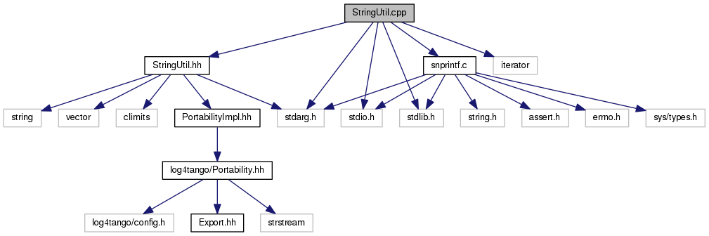

+----------+---------------------------------------+
| |Logo|   | Tango Core Classes Reference  9.2.5   |
+----------+---------------------------------------+

-  `Main Page <../../index.html>`__
-  `Related Pages <../../pages.html>`__
-  `Modules <../../modules.html>`__
-  `Namespaces <../../namespaces.html>`__
-  `Classes <../../annotated.html>`__
-  `Files <../../files.html>`__

-  `File List <../../files.html>`__
-  `File Members <../../globals.html>`__

`Namespaces <#namespaces>`__ \| `Macros <#define-members>`__

StringUtil.cpp File Reference

| ``#include "StringUtil.hh"``
|  ``#include <iterator>``
|  ``#include <stdio.h>``
|  ``#include <stdlib.h>``
|  ``#include <stdarg.h>``
|  ``#include "snprintf.c"``

Include dependency graph for StringUtil.cpp:

|image1|

Namespaces
----------

 

`log4tango <../../d4/db0/namespacelog4tango.html>`__

 

Macros
------

#define 

`HAVE\_SNPRINTF <../../da/dfc/StringUtil_8cpp.html#a040bd9182ad5ba7261448993c38565ea>`__

 

#define 

`PREFER\_PORTABLE\_SNPRINTF <../../da/dfc/StringUtil_8cpp.html#ac65bf61f913c390a09d4f2fef24463d2>`__

 

#define 

`VSNPRINTF <../../da/dfc/StringUtil_8cpp.html#ac2e4f48c3da557e8b268aee96009e135>`__   `portable\_vsnprintf <../../d2/d7f/snprintf_8c.html#aa73a3dcaf1ccfeaecc146df5ebeb8b0a>`__

 

Macro Definition Documentation
------------------------------

+--------------------------+
| #define HAVE\_SNPRINTF   |
+--------------------------+

+--------------------------------------+
| #define PREFER\_PORTABLE\_SNPRINTF   |
+--------------------------------------+

+-------------------------------------------------------------------------------------------------------------------+
| #define VSNPRINTF   \ `portable\_vsnprintf <../../d2/d7f/snprintf_8c.html#aa73a3dcaf1ccfeaecc146df5ebeb8b0a>`__   |
+-------------------------------------------------------------------------------------------------------------------+

Referenced by
`log4tango::StringUtil::vform() <../../d4/d04/classlog4tango_1_1StringUtil.html#a1588cfe00d2951f175025f949793f866>`__.

-  `src <../../dir_dce6f6254c1e480719f507d4d11781da.html>`__
-  `log4tango <../../dir_c2bf562858037ce0c46f648f9a619349.html>`__
-  `StringUtil.cpp <../../da/dfc/StringUtil_8cpp.html>`__
-  Generated on Fri Oct 7 2016 11:11:15 for Tango Core Classes Reference
   by |doxygen| 1.8.8

.. |Logo| image:: ../../logo.jpg

.. |doxygen| image:: ../../doxygen.png
   :target: http://www.doxygen.org/index.html
