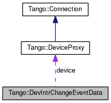

+----------+---------------------------------------+
| |Logo|   | Tango Core Classes Reference  9.2.5   |
+----------+---------------------------------------+

-  `Main Page <../../index.html>`__
-  `Related Pages <../../pages.html>`__
-  `Modules <../../modules.html>`__
-  `Namespaces <../../namespaces.html>`__
-  `Classes <../../annotated.html>`__
-  `Files <../../files.html>`__

-  `Class List <../../annotated.html>`__
-  `Class Hierarchy <../../inherits.html>`__
-  `Class Members <../../functions.html>`__

`Public Attributes <#pub-attribs>`__ \| `List of all
members <../../da/d42/classTango_1_1DevIntrChangeEventData-members.html>`__

Tango::DevIntrChangeEventData Class Reference

`Client classes <../../d1/d45/group__Client.html>`__

Device interface change event callback execution data.
`More... <../../db/d47/classTango_1_1DevIntrChangeEventData.html#details>`__

Collaboration diagram for Tango::DevIntrChangeEventData:

|Collaboration graph|

[`legend <../../graph_legend.html>`__\ ]

Public Attributes
-----------------

`AttributeInfoListEx <../../d1/d45/group__Client.html#ga7175e05437edf640b8e555d1a601335c>`__ 

`att\_list <../../db/d47/classTango_1_1DevIntrChangeEventData.html#a89db4537a1e2634d03b6f3836469a5e0>`__

 

| Device attribute list info.
`More... <#a89db4537a1e2634d03b6f3836469a5e0>`__

 

`CommandInfoList <../../d1/d45/group__Client.html#ga702913bccb1c2d427d7a6f046602d657>`__ 

`cmd\_list <../../db/d47/classTango_1_1DevIntrChangeEventData.html#ab75f7e002dd7df09755b26e513231dc2>`__

 

| Device command list info.
`More... <#ab75f7e002dd7df09755b26e513231dc2>`__

 

bool 

`dev\_started <../../db/d47/classTango_1_1DevIntrChangeEventData.html#adbf8cb3b33018c236a5fa1440edb3588>`__

 

| Device started flag (true when event sent due to device being
(re)started and with only a possible but not sure interface change)
`More... <#adbf8cb3b33018c236a5fa1440edb3588>`__

 

`DeviceProxy <../../d9/d83/classTango_1_1DeviceProxy.html>`__ \* 

`device <../../db/d47/classTango_1_1DevIntrChangeEventData.html#aa23d2843deae51a30852fb1d49d51c91>`__

 

| The `DeviceProxy <../../d9/d83/classTango_1_1DeviceProxy.html>`__
object on which the call was executed.
`More... <#aa23d2843deae51a30852fb1d49d51c91>`__

 

string 

`device\_name <../../db/d47/classTango_1_1DevIntrChangeEventData.html#acc8d3960c808ddbcd750224ba1d9f417>`__

 

| The device name. `More... <#acc8d3960c808ddbcd750224ba1d9f417>`__

 

bool 

`err <../../db/d47/classTango_1_1DevIntrChangeEventData.html#a52384944b2b92cbd9ecf66b21c4a9fdc>`__

 

| A boolean flag set to true if the request failed. False otherwise.
`More... <#a52384944b2b92cbd9ecf66b21c4a9fdc>`__

 

DevErrorList 

`errors <../../db/d47/classTango_1_1DevIntrChangeEventData.html#a33be40ed8e49d251e5ba18e87a6468ef>`__

 

| The error stack. `More... <#a33be40ed8e49d251e5ba18e87a6468ef>`__

 

string 

`event <../../db/d47/classTango_1_1DevIntrChangeEventData.html#a9d4af2556b9cda47da2210546419f3ca>`__

 

| The event name. `More... <#a9d4af2556b9cda47da2210546419f3ca>`__

 

Detailed Description
--------------------

Device interface change event callback execution data.

This class is used to pass data to the callback method when a device
interface change event is sent to the client.

$Author$ $Revision$

Member Data Documentation
-------------------------

+-----------------------------------------------------------------------------------------------------------------------------------------+
| `AttributeInfoListEx <../../d1/d45/group__Client.html#ga7175e05437edf640b8e555d1a601335c>`__ Tango::DevIntrChangeEventData::att\_list   |
+-----------------------------------------------------------------------------------------------------------------------------------------+

Device attribute list info.

+-------------------------------------------------------------------------------------------------------------------------------------+
| `CommandInfoList <../../d1/d45/group__Client.html#ga702913bccb1c2d427d7a6f046602d657>`__ Tango::DevIntrChangeEventData::cmd\_list   |
+-------------------------------------------------------------------------------------------------------------------------------------+

Device command list info.

+----------------------------------------------------+
| bool Tango::DevIntrChangeEventData::dev\_started   |
+----------------------------------------------------+

Device started flag (true when event sent due to device being
(re)started and with only a possible but not sure interface change)

+-----------------------------------------------------------------------------------------------------------+
| `DeviceProxy <../../d9/d83/classTango_1_1DeviceProxy.html>`__\ \* Tango::DevIntrChangeEventData::device   |
+-----------------------------------------------------------------------------------------------------------+

The `DeviceProxy <../../d9/d83/classTango_1_1DeviceProxy.html>`__ object
on which the call was executed.

+------------------------------------------------------+
| string Tango::DevIntrChangeEventData::device\_name   |
+------------------------------------------------------+

The device name.

+-------------------------------------------+
| bool Tango::DevIntrChangeEventData::err   |
+-------------------------------------------+

A boolean flag set to true if the request failed. False otherwise.

+------------------------------------------------------+
| DevErrorList Tango::DevIntrChangeEventData::errors   |
+------------------------------------------------------+

The error stack.

+-----------------------------------------------+
| string Tango::DevIntrChangeEventData::event   |
+-----------------------------------------------+

The event name.

--------------

The documentation for this class was generated from the following file:

-  `event.h <../../dd/d20/event_8h_source.html>`__

-  `Tango <../../de/ddf/namespaceTango.html>`__
-  `DevIntrChangeEventData <../../db/d47/classTango_1_1DevIntrChangeEventData.html>`__
-  Generated on Fri Oct 7 2016 11:11:17 for Tango Core Classes Reference
   by |doxygen| 1.8.8

.. |Logo| image:: ../../logo.jpg

.. |doxygen| image:: ../../doxygen.png
   :target: http://www.doxygen.org/index.html
