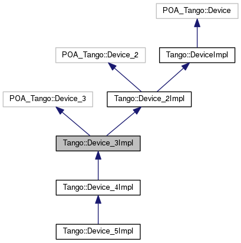
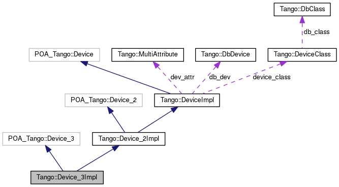

+----------+---------------------------------------+
| |Logo|   | Tango Core Classes Reference  9.2.5   |
+----------+---------------------------------------+

-  `Main Page <../../index.html>`__
-  `Related Pages <../../pages.html>`__
-  `Modules <../../modules.html>`__
-  `Namespaces <../../namespaces.html>`__
-  `Classes <../../annotated.html>`__
-  `Files <../../files.html>`__

-  `Class List <../../annotated.html>`__
-  `Class Hierarchy <../../inherits.html>`__
-  `Class Members <../../functions.html>`__

`Classes <#nested-classes>`__ \| `List of all
members <../../df/d69/classTango_1_1Device__3Impl-members.html>`__

Tango::Device\_3Impl Class Reference

`Server classes <../../da/d64/group__Server.html>`__

Base class for all TANGO device since version 3.
`More... <../../db/d65/classTango_1_1Device__3Impl.html#details>`__

Inheritance diagram for Tango::Device\_3Impl:

|Inheritance graph|

[`legend <../../graph_legend.html>`__\ ]

Collaboration diagram for Tango::Device\_3Impl:

|Collaboration graph|

[`legend <../../graph_legend.html>`__\ ]

Public Member Functions
-----------------------

Constructors

Miscellaneous constructors

 

`Device\_3Impl <../../db/d65/classTango_1_1Device__3Impl.html#ac9db8606c8ea7044642865d104ad74af>`__
(`DeviceClass <../../d4/dcd/classTango_1_1DeviceClass.html>`__
\*\ `device\_class <../../d3/d62/classTango_1_1DeviceImpl.html#a103c3527a529f7a40ecadf227a8a7990>`__,
string &dev\_name)

 

| Constructs a newly allocated
`Device\_3Impl <../../db/d65/classTango_1_1Device__3Impl.html>`__ object
from its name. `More... <#ac9db8606c8ea7044642865d104ad74af>`__

 

 

`Device\_3Impl <../../db/d65/classTango_1_1Device__3Impl.html#a96a52877d50b929178e5660901bd9e3e>`__
(`DeviceClass <../../d4/dcd/classTango_1_1DeviceClass.html>`__
\*\ `device\_class <../../d3/d62/classTango_1_1DeviceImpl.html#a103c3527a529f7a40ecadf227a8a7990>`__,
string &dev\_name, string
&\ `desc <../../d3/d62/classTango_1_1DeviceImpl.html#a480f48ff00c9d1aa8bd406323967df7d>`__)

 

| Constructs a newly allocated
`Device\_3Impl <../../db/d65/classTango_1_1Device__3Impl.html>`__ object
from its name and its description.
`More... <#a96a52877d50b929178e5660901bd9e3e>`__

 

 

`Device\_3Impl <../../db/d65/classTango_1_1Device__3Impl.html#a4188f383ad8efb4624b9b12d7af6bd75>`__
(`DeviceClass <../../d4/dcd/classTango_1_1DeviceClass.html>`__
\*\ `device\_class <../../d3/d62/classTango_1_1DeviceImpl.html#a103c3527a529f7a40ecadf227a8a7990>`__,
string &dev\_name, string
&\ `desc <../../d3/d62/classTango_1_1DeviceImpl.html#a480f48ff00c9d1aa8bd406323967df7d>`__,
Tango::DevState
`dev\_state <../../d3/d62/classTango_1_1DeviceImpl.html#a1b5f98bd245bd7e94403eaebc2913283>`__,
string
&\ `dev\_status <../../d3/d62/classTango_1_1DeviceImpl.html#afcea586ff5d465e6f752fd256a66aeea>`__)

 

| Constructs a newly allocated
`Device\_3Impl <../../db/d65/classTango_1_1Device__3Impl.html>`__ object
from all its creation parameters.
`More... <#a4188f383ad8efb4624b9b12d7af6bd75>`__

 

 

`Device\_3Impl <../../db/d65/classTango_1_1Device__3Impl.html#a6d5f7b8f5aac1f9ea056d461f3ee94ce>`__
(`DeviceClass <../../d4/dcd/classTango_1_1DeviceClass.html>`__
\*\ `device\_class <../../d3/d62/classTango_1_1DeviceImpl.html#a103c3527a529f7a40ecadf227a8a7990>`__,
const char \*dev\_name, const char
\*\ `desc <../../d3/d62/classTango_1_1DeviceImpl.html#a480f48ff00c9d1aa8bd406323967df7d>`__\ ="A
TANGO device", Tango::DevState
`dev\_state <../../d3/d62/classTango_1_1DeviceImpl.html#a1b5f98bd245bd7e94403eaebc2913283>`__\ =Tango::UNKNOWN,
const char
\*\ `dev\_status <../../d3/d62/classTango_1_1DeviceImpl.html#afcea586ff5d465e6f752fd256a66aeea>`__\ =\ `StatusNotSet <../../de/ddf/namespaceTango.html#ae1851ebaa91cbf1df9317e3f47f6190a>`__)

 

| Constructs a newly allocated
`Device\_3Impl <../../db/d65/classTango_1_1Device__3Impl.html>`__ object
from all its creation parameters with some default values.
`More... <#a6d5f7b8f5aac1f9ea056d461f3ee94ce>`__

 

Destructor

Only one desctructor is defined for this class

virtual 

`~Device\_3Impl <../../db/d65/classTango_1_1Device__3Impl.html#a364061576e373d8bec46b5bba70f2817>`__
()

 

| The device desctructor.
`More... <#a364061576e373d8bec46b5bba70f2817>`__

 

CORBA operation methods

Method defined to implement TANGO device CORBA operation

| virtual
|  Tango::AttributeValueList\_3 \* 

`read\_attributes\_3 <../../db/d65/classTango_1_1Device__3Impl.html#a870e349674aca9b3ebee55157a31b5d3>`__
(const Tango::DevVarStringArray &names, Tango::DevSource source)

 

| Read attribute(s) value.
`More... <#a870e349674aca9b3ebee55157a31b5d3>`__

 

virtual void 

`write\_attributes\_3 <../../db/d65/classTango_1_1Device__3Impl.html#af1a705a748bf08290150c3e50bdb29ff>`__
(const Tango::AttributeValueList &values)

 

| Write attribute(s) value.
`More... <#af1a705a748bf08290150c3e50bdb29ff>`__

 

| virtual
|  Tango::DevAttrHistoryList\_3 \* 

`read\_attribute\_history\_3 <../../db/d65/classTango_1_1Device__3Impl.html#a87abb35e56c7b00c542e949ef43ba1b0>`__
(const char \*name, CORBA::Long n)

 

| Read attribute value history.
`More... <#a87abb35e56c7b00c542e949ef43ba1b0>`__

 

virtual Tango::DevInfo\_3 \* 

`info\_3 <../../db/d65/classTango_1_1Device__3Impl.html#a28dab632521e2fb0e52827d155af673c>`__
()

 

| Get device info. `More... <#a28dab632521e2fb0e52827d155af673c>`__

 

| virtual
|  Tango::AttributeConfigList\_3 \* 

`get\_attribute\_config\_3 <../../db/d65/classTango_1_1Device__3Impl.html#a651489039cc5222dc1197b3368aa8cdd>`__
(const Tango::DevVarStringArray &names)

 

| Get attribute(s) configuration.
`More... <#a651489039cc5222dc1197b3368aa8cdd>`__

 

virtual void 

`set\_attribute\_config\_3 <../../db/d65/classTango_1_1Device__3Impl.html#a6eaac6785a84422132e654916fc2cf7e>`__
(const Tango::AttributeConfigList\_3 &new\_conf)

 

| Set attribute(s) configuration.
`More... <#a6eaac6785a84422132e654916fc2cf7e>`__

 

|-| Public Member Functions inherited from
`Tango::Device\_2Impl <../../d8/dbf/classTango_1_1Device__2Impl.html>`__

 

`Device\_2Impl <../../d8/dbf/classTango_1_1Device__2Impl.html#a6d7f50b5fec343f584298c5263822854>`__
(`DeviceClass <../../d4/dcd/classTango_1_1DeviceClass.html>`__
\*\ `device\_class <../../d3/d62/classTango_1_1DeviceImpl.html#a103c3527a529f7a40ecadf227a8a7990>`__,
string &dev\_name)

 

| Constructs a newly allocated
`Device\_2Impl <../../d8/dbf/classTango_1_1Device__2Impl.html>`__ object
from its name. `More... <#a6d7f50b5fec343f584298c5263822854>`__

 

 

`Device\_2Impl <../../d8/dbf/classTango_1_1Device__2Impl.html#ad90287b9ce6a16a656aad0d0f3ce10b8>`__
(`DeviceClass <../../d4/dcd/classTango_1_1DeviceClass.html>`__
\*\ `device\_class <../../d3/d62/classTango_1_1DeviceImpl.html#a103c3527a529f7a40ecadf227a8a7990>`__,
string &dev\_name, string
&\ `desc <../../d3/d62/classTango_1_1DeviceImpl.html#a480f48ff00c9d1aa8bd406323967df7d>`__)

 

| Constructs a newly allocated
`Device\_2Impl <../../d8/dbf/classTango_1_1Device__2Impl.html>`__ object
from its name and its description.
`More... <#ad90287b9ce6a16a656aad0d0f3ce10b8>`__

 

 

`Device\_2Impl <../../d8/dbf/classTango_1_1Device__2Impl.html#ad0e74e2158f49e61d5d5db908f5aec69>`__
(`DeviceClass <../../d4/dcd/classTango_1_1DeviceClass.html>`__
\*\ `device\_class <../../d3/d62/classTango_1_1DeviceImpl.html#a103c3527a529f7a40ecadf227a8a7990>`__,
string &dev\_name, string
&\ `desc <../../d3/d62/classTango_1_1DeviceImpl.html#a480f48ff00c9d1aa8bd406323967df7d>`__,
Tango::DevState
`dev\_state <../../d3/d62/classTango_1_1DeviceImpl.html#a1b5f98bd245bd7e94403eaebc2913283>`__,
string
&\ `dev\_status <../../d3/d62/classTango_1_1DeviceImpl.html#afcea586ff5d465e6f752fd256a66aeea>`__)

 

| Constructs a newly allocated
`Device\_2Impl <../../d8/dbf/classTango_1_1Device__2Impl.html>`__ object
from all its creation parameters.
`More... <#ad0e74e2158f49e61d5d5db908f5aec69>`__

 

 

`Device\_2Impl <../../d8/dbf/classTango_1_1Device__2Impl.html#a0093f572273fc5464e562665b454e9db>`__
(`DeviceClass <../../d4/dcd/classTango_1_1DeviceClass.html>`__
\*\ `device\_class <../../d3/d62/classTango_1_1DeviceImpl.html#a103c3527a529f7a40ecadf227a8a7990>`__,
const char \*dev\_name, const char
\*\ `desc <../../d3/d62/classTango_1_1DeviceImpl.html#a480f48ff00c9d1aa8bd406323967df7d>`__\ ="A
TANGO device", Tango::DevState
`dev\_state <../../d3/d62/classTango_1_1DeviceImpl.html#a1b5f98bd245bd7e94403eaebc2913283>`__\ =Tango::UNKNOWN,
const char
\*\ `dev\_status <../../d3/d62/classTango_1_1DeviceImpl.html#afcea586ff5d465e6f752fd256a66aeea>`__\ =\ `StatusNotSet <../../de/ddf/namespaceTango.html#ae1851ebaa91cbf1df9317e3f47f6190a>`__)

 

| Constructs a newly allocated
`Device\_2Impl <../../d8/dbf/classTango_1_1Device__2Impl.html>`__ object
from all its creation parameters with some default values.
`More... <#a0093f572273fc5464e562665b454e9db>`__

 

virtual 

`~Device\_2Impl <../../d8/dbf/classTango_1_1Device__2Impl.html#afaefae8635cff0da56608f4bc38aa6da>`__
()

 

| The device desctructor.
`More... <#afaefae8635cff0da56608f4bc38aa6da>`__

 

virtual CORBA::Any \* 

`command\_inout\_2 <../../d8/dbf/classTango_1_1Device__2Impl.html#a4348a6f642052b9eeaca07b34877f3e7>`__
(const char \*in\_cmd, const CORBA::Any &in\_data, Tango::DevSource
source)

 

| Execute a command. `More... <#a4348a6f642052b9eeaca07b34877f3e7>`__

 

virtual Tango::DevCmdInfoList\_2 \* 

`command\_list\_query\_2 <../../d8/dbf/classTango_1_1Device__2Impl.html#ac71c8dc3ed7116437c00370abc992968>`__
()

 

| Get device command list.
`More... <#ac71c8dc3ed7116437c00370abc992968>`__

 

virtual Tango::DevCmdInfo\_2 \* 

`command\_query\_2 <../../d8/dbf/classTango_1_1Device__2Impl.html#afa99e1bb14a0decaa40ab43b46f3fea1>`__
(const char \*command)

 

| Get command info. `More... <#afa99e1bb14a0decaa40ab43b46f3fea1>`__

 

virtual Tango::AttributeValueList \* 

`read\_attributes\_2 <../../d8/dbf/classTango_1_1Device__2Impl.html#ae4a337540c05d540b69b1332aeae7444>`__
(const Tango::DevVarStringArray &names, Tango::DevSource source)

 

| Read attribute(s) value.
`More... <#ae4a337540c05d540b69b1332aeae7444>`__

 

| virtual
|  Tango::AttributeConfigList\_2 \* 

`get\_attribute\_config\_2 <../../d8/dbf/classTango_1_1Device__2Impl.html#a80ba13a4e11a42c6aba434389cf8812b>`__
(const Tango::DevVarStringArray &names) throw (Tango::DevFailed,
CORBA::SystemException)

 

| Get attribute(s) configuration.
`More... <#a80ba13a4e11a42c6aba434389cf8812b>`__

 

virtual Tango::DevAttrHistoryList \* 

`read\_attribute\_history\_2 <../../d8/dbf/classTango_1_1Device__2Impl.html#aca1f417dbfe7704a799db031e0165eff>`__
(const char \*name, CORBA::Long n) throw (Tango::DevFailed,
CORBA::SystemException)

 

| Read attribute value history.
`More... <#aca1f417dbfe7704a799db031e0165eff>`__

 

virtual Tango::DevCmdHistoryList \* 

`command\_inout\_history\_2 <../../d8/dbf/classTango_1_1Device__2Impl.html#a3a79a5f31f2b988c67a36e2c9977da06>`__
(const char \*command, CORBA::Long n) throw (Tango::DevFailed,
CORBA::SystemException)

 

| Read command value history.
`More... <#a3a79a5f31f2b988c67a36e2c9977da06>`__

 

|-| Public Member Functions inherited from
`Tango::DeviceImpl <../../d3/d62/classTango_1_1DeviceImpl.html>`__

 

`DeviceImpl <../../d3/d62/classTango_1_1DeviceImpl.html#a5cd151bc1016a1e0aaee47df1949fc03>`__
(`DeviceClass <../../d4/dcd/classTango_1_1DeviceClass.html>`__
\*\ `device\_class <../../d3/d62/classTango_1_1DeviceImpl.html#a103c3527a529f7a40ecadf227a8a7990>`__,
string &dev\_name)

 

| Constructs a newly allocated
`DeviceImpl <../../d3/d62/classTango_1_1DeviceImpl.html>`__ object from
its name. `More... <#a5cd151bc1016a1e0aaee47df1949fc03>`__

 

 

`DeviceImpl <../../d3/d62/classTango_1_1DeviceImpl.html#a2b7b74d29766be8582b66bd70b18e670>`__
(`DeviceClass <../../d4/dcd/classTango_1_1DeviceClass.html>`__
\*\ `device\_class <../../d3/d62/classTango_1_1DeviceImpl.html#a103c3527a529f7a40ecadf227a8a7990>`__,
string &dev\_name, string
&\ `desc <../../d3/d62/classTango_1_1DeviceImpl.html#a480f48ff00c9d1aa8bd406323967df7d>`__)

 

| Constructs a newly allocated
`DeviceImpl <../../d3/d62/classTango_1_1DeviceImpl.html>`__ object from
its name and its description.
`More... <#a2b7b74d29766be8582b66bd70b18e670>`__

 

 

`DeviceImpl <../../d3/d62/classTango_1_1DeviceImpl.html#a8159577740dda7690d6a9b416ee51721>`__
(`DeviceClass <../../d4/dcd/classTango_1_1DeviceClass.html>`__
\*\ `device\_class <../../d3/d62/classTango_1_1DeviceImpl.html#a103c3527a529f7a40ecadf227a8a7990>`__,
string &dev\_name, string
&\ `desc <../../d3/d62/classTango_1_1DeviceImpl.html#a480f48ff00c9d1aa8bd406323967df7d>`__,
Tango::DevState
`dev\_state <../../d3/d62/classTango_1_1DeviceImpl.html#a1b5f98bd245bd7e94403eaebc2913283>`__,
string
&\ `dev\_status <../../d3/d62/classTango_1_1DeviceImpl.html#afcea586ff5d465e6f752fd256a66aeea>`__)

 

| Constructs a newly allocated
`DeviceImpl <../../d3/d62/classTango_1_1DeviceImpl.html>`__ object from
all its creation parameters.
`More... <#a8159577740dda7690d6a9b416ee51721>`__

 

 

`DeviceImpl <../../d3/d62/classTango_1_1DeviceImpl.html#a44ad2f0801d241cf16d84b629cb85b1a>`__
(`DeviceClass <../../d4/dcd/classTango_1_1DeviceClass.html>`__
\*\ `device\_class <../../d3/d62/classTango_1_1DeviceImpl.html#a103c3527a529f7a40ecadf227a8a7990>`__,
const char \*dev\_name, const char
\*\ `desc <../../d3/d62/classTango_1_1DeviceImpl.html#a480f48ff00c9d1aa8bd406323967df7d>`__\ ="A
TANGO device", Tango::DevState
`dev\_state <../../d3/d62/classTango_1_1DeviceImpl.html#a1b5f98bd245bd7e94403eaebc2913283>`__\ =Tango::UNKNOWN,
const char
\*\ `dev\_status <../../d3/d62/classTango_1_1DeviceImpl.html#afcea586ff5d465e6f752fd256a66aeea>`__\ =\ `StatusNotSet <../../de/ddf/namespaceTango.html#ae1851ebaa91cbf1df9317e3f47f6190a>`__)

 

| Constructs a newly allocated
`DeviceImpl <../../d3/d62/classTango_1_1DeviceImpl.html>`__ object from
all its creation parameters with some default values.
`More... <#a44ad2f0801d241cf16d84b629cb85b1a>`__

 

virtual 

`~DeviceImpl <../../d3/d62/classTango_1_1DeviceImpl.html#a9a5ffdab6150008e52d87ea4c38ee9ff>`__
()

 

| The device desctructor.
`More... <#a9a5ffdab6150008e52d87ea4c38ee9ff>`__

 

string & 

`get\_status <../../d3/d62/classTango_1_1DeviceImpl.html#adc92cdf3a75da5ebc139b7bf7d9c7377>`__
()

 

| Get device status. `More... <#adc92cdf3a75da5ebc139b7bf7d9c7377>`__

 

void 

`set\_status <../../d3/d62/classTango_1_1DeviceImpl.html#a54f9d94ef1072a6cb19ee472ccf044d7>`__
(const string &new\_status)

 

| Set device status. `More... <#a54f9d94ef1072a6cb19ee472ccf044d7>`__

 

void 

`append\_status <../../d3/d62/classTango_1_1DeviceImpl.html#ab1c6dfb1ea310030cd464f9091a2b8b0>`__
(const string &stat, bool new\_line=false)

 

| Appends a string to the device status.
`More... <#ab1c6dfb1ea310030cd464f9091a2b8b0>`__

 

Tango::DevState & 

`get\_state <../../d3/d62/classTango_1_1DeviceImpl.html#a5b53b4435a1ea8087849a9e505d70f2a>`__
()

 

| Get device state. `More... <#a5b53b4435a1ea8087849a9e505d70f2a>`__

 

Tango::DevState & 

`get\_prev\_state <../../d3/d62/classTango_1_1DeviceImpl.html#a051cb13d94de8492f37a9b5f48e38e56>`__
()

 

| Get device's previous state.
`More... <#a051cb13d94de8492f37a9b5f48e38e56>`__

 

void 

`set\_state <../../d3/d62/classTango_1_1DeviceImpl.html#a2123f00afdfa638c31399eb10efefd66>`__
(const Tango::DevState &new\_state)

 

| Set device state. `More... <#a2123f00afdfa638c31399eb10efefd66>`__

 

string & 

`get\_name <../../d3/d62/classTango_1_1DeviceImpl.html#ac337fcab0f8fa8647e817a9aedc87f0c>`__
()

 

| Get device name. `More... <#ac337fcab0f8fa8647e817a9aedc87f0c>`__

 

`DeviceClass <../../d4/dcd/classTango_1_1DeviceClass.html>`__ \* 

`get\_device\_class <../../d3/d62/classTango_1_1DeviceImpl.html#a61fa9524c2eba31eba7ba9ff3b48ef0a>`__
()

 

| Get device class singleton.
`More... <#a61fa9524c2eba31eba7ba9ff3b48ef0a>`__

 

`MultiAttribute <../../dc/d3b/classTango_1_1MultiAttribute.html>`__ \* 

`get\_device\_attr <../../d3/d62/classTango_1_1DeviceImpl.html#a339ebeff825166048358919948782be8>`__
()

 

| Get device multi attribute object.
`More... <#a339ebeff825166048358919948782be8>`__

 

void 

`set\_device\_attr <../../d3/d62/classTango_1_1DeviceImpl.html#abfe5f92400f24bcfed94bc7a0d731233>`__
(`MultiAttribute <../../dc/d3b/classTango_1_1MultiAttribute.html>`__
\*ptr)

 

| Set device multi attribute object.
`More... <#abfe5f92400f24bcfed94bc7a0d731233>`__

 

`DbDevice <../../da/dbb/classTango_1_1DbDevice.html>`__ \* 

`get\_db\_device <../../d3/d62/classTango_1_1DeviceImpl.html#a6a5e05c240b76db97a357703bdd30552>`__
()

 

| Get a pointer to the associated
`DbDevice <../../da/dbb/classTango_1_1DbDevice.html>`__ object.
`More... <#a6a5e05c240b76db97a357703bdd30552>`__

 

void 

`set\_d\_var <../../d3/d62/classTango_1_1DeviceImpl.html#ae4071b4df6b9398e890d8dea51365383>`__
(Tango::Device\_ptr d)

 

| Set the associated CORBA object reference.
`More... <#ae4071b4df6b9398e890d8dea51365383>`__

 

Tango::Device\_var 

`get\_d\_var <../../d3/d62/classTango_1_1DeviceImpl.html#af57cb03749073660df2f1515204d17aa>`__
()

 

| Get the associated CORBA object reference.
`More... <#af57cb03749073660df2f1515204d17aa>`__

 

void 

`set\_obj\_id <../../d3/d62/classTango_1_1DeviceImpl.html#a99aba4af5cd29838f50956a75427d5f7>`__
(PortableServer::ObjectId\_var o)

 

| Set the associated CORBA object identifier.
`More... <#a99aba4af5cd29838f50956a75427d5f7>`__

 

PortableServer::ObjectId\_var & 

`get\_obj\_id <../../d3/d62/classTango_1_1DeviceImpl.html#a59b8a8053b36fe6eb5058342f77829ab>`__
()

 

| Get the associated CORBA object identifier.
`More... <#a59b8a8053b36fe6eb5058342f77829ab>`__

 

virtual PortableServer::POA\_ptr 

`\_default\_POA <../../d3/d62/classTango_1_1DeviceImpl.html#a0895eb0df1a110eba046df7200d86f48>`__
()

 

| Return device POA. `More... <#a0895eb0df1a110eba046df7200d86f48>`__

 

virtual void 

`init\_device <../../d3/d62/classTango_1_1DeviceImpl.html#afaa3632ea04076bb5614a98ff944ef8c>`__
()=0

 

| Intialise a device. `More... <#afaa3632ea04076bb5614a98ff944ef8c>`__

 

virtual void 

`delete\_device <../../d3/d62/classTango_1_1DeviceImpl.html#ac2cf9bd6e0a5da8c121c65b068d36463>`__
()

 

| Delete a device. `More... <#ac2cf9bd6e0a5da8c121c65b068d36463>`__

 

virtual void 

`always\_executed\_hook <../../d3/d62/classTango_1_1DeviceImpl.html#a086fe46c88aed6e2aff70a9cb6c26e84>`__
(void)

 

| Hook method. `More... <#a086fe46c88aed6e2aff70a9cb6c26e84>`__

 

virtual void 

`read\_attr\_hardware <../../d3/d62/classTango_1_1DeviceImpl.html#a934daa7bef5a3f01c50ba304006fdda4>`__
(vector< long > &attr\_list)

 

| Read the hardware to return attribute value(s).
`More... <#a934daa7bef5a3f01c50ba304006fdda4>`__

 

virtual void 

`read\_attr <../../d3/d62/classTango_1_1DeviceImpl.html#a7c6302cff47fca241560187e1c178701>`__
(`Attribute <../../d6/dad/classTango_1_1Attribute.html>`__ &attr)

 

| Set the attribute read value.
`More... <#a7c6302cff47fca241560187e1c178701>`__

 

virtual void 

`write\_attr\_hardware <../../d3/d62/classTango_1_1DeviceImpl.html#a7aee6ee9fee2feb7f358972ec1677328>`__
(vector< long > &attr\_list)

 

| Write the hardware for attributes.
`More... <#a7aee6ee9fee2feb7f358972ec1677328>`__

 

virtual Tango::DevState 

`dev\_state <../../d3/d62/classTango_1_1DeviceImpl.html#a1b5f98bd245bd7e94403eaebc2913283>`__
()

 

| Get device state. `More... <#a1b5f98bd245bd7e94403eaebc2913283>`__

 

virtual
`Tango::ConstDevString <../../de/ddf/namespaceTango.html#a31a504495ecab5fd862cb6e60d40360c>`__ 

`dev\_status <../../d3/d62/classTango_1_1DeviceImpl.html#afcea586ff5d465e6f752fd256a66aeea>`__
()

 

| Get device status. `More... <#afcea586ff5d465e6f752fd256a66aeea>`__

 

void 

`add\_attribute <../../d3/d62/classTango_1_1DeviceImpl.html#a9f130650c3a9da5190001adfbc2dc50c>`__
(`Attr <../../d5/dcd/classTango_1_1Attr.html>`__ \*new\_attr)

 

| Add a new attribute to the device attribute list.
`More... <#a9f130650c3a9da5190001adfbc2dc50c>`__

 

void 

`remove\_attribute <../../d3/d62/classTango_1_1DeviceImpl.html#aa88509d4d6bba29d28a6c124cf0349a6>`__
(`Attr <../../d5/dcd/classTango_1_1Attr.html>`__ \*rem\_attr, bool
free\_it=false, bool clean\_db=true)

 

| Remove one attribute from the device attribute list.
`More... <#aa88509d4d6bba29d28a6c124cf0349a6>`__

 

void 

`remove\_attribute <../../d3/d62/classTango_1_1DeviceImpl.html#a5fe45df27c5a6a2d9ff951f9f0861d5e>`__
(string &rem\_attr\_name, bool free\_it=false, bool clean\_db=true)

 

| Remove one attribute from the device attribute list.
`More... <#a5fe45df27c5a6a2d9ff951f9f0861d5e>`__

 

void 

`add\_command <../../d3/d62/classTango_1_1DeviceImpl.html#a64f3aafd381cd25bb562cdb4074932d9>`__
(`Command <../../d2/d1d/classTango_1_1Command.html>`__ \*new\_cmd, bool
device=false)

 

| Add a new command to the device command list.
`More... <#a64f3aafd381cd25bb562cdb4074932d9>`__

 

void 

`remove\_command <../../d3/d62/classTango_1_1DeviceImpl.html#ae57fcb9d357314f6e4f159a62de3fb8d>`__
(`Command <../../d2/d1d/classTango_1_1Command.html>`__ \*rem\_cmd, bool
free\_it=false, bool clean\_db=true)

 

| Remove one command from the device command list.
`More... <#ae57fcb9d357314f6e4f159a62de3fb8d>`__

 

void 

`remove\_command <../../d3/d62/classTango_1_1DeviceImpl.html#a3ae8333e1349c4691bf46712afd6f221>`__
(const string &rem\_cmd\_name, bool free\_it=false, bool clean\_db=true)

 

| Remove one command from the device command list.
`More... <#a3ae8333e1349c4691bf46712afd6f221>`__

 

vector< PollObj \* >::iterator 

`get\_polled\_obj\_by\_type\_name <../../d3/d62/classTango_1_1DeviceImpl.html#ac47d75934efad28b5668ee8b90df0999>`__
(`Tango::PollObjType <../../de/ddf/namespaceTango.html#ac5ffdb26e95e0c322c8ed79524ad9b6e>`__
obj\_type, const string &obj\_name)

 

| Retrieve a polled object from the polled object list.
`More... <#ac47d75934efad28b5668ee8b90df0999>`__

 

bool 

`is\_there\_subscriber <../../d3/d62/classTango_1_1DeviceImpl.html#ab7ccad84e75ab8e91ada91bb49a028ba>`__
(const string &att\_name,
`EventType <../../d1/d45/group__Client.html#ga5366e2a8cedf5aab5be8835974f787c6>`__
event\_type)

 

| Check if there is subscriber(s) listening for the event.
`More... <#ab7ccad84e75ab8e91ada91bb49a028ba>`__

 

Tango::DevVarCharArray \* 

`create\_DevVarCharArray <../../d3/d62/classTango_1_1DeviceImpl.html#ab4b7bdcca9c83603da302783c86553bc>`__
(unsigned char \*ptr, long length)

 

| Create a DevVarCharArray type.
`More... <#ab4b7bdcca9c83603da302783c86553bc>`__

 

Tango::DevVarShortArray \* 

`create\_DevVarShortArray <../../d3/d62/classTango_1_1DeviceImpl.html#aa4c9e98e8b3fa64328eca74a4d1e07d3>`__
(short \*ptr, long length)

 

| Create a DevVarShortArray type.
`More... <#aa4c9e98e8b3fa64328eca74a4d1e07d3>`__

 

Tango::DevVarLongArray \* 

`create\_DevVarLongArray <../../d3/d62/classTango_1_1DeviceImpl.html#ac094cb1f6aaf9f8672e7a508ac561e6b>`__
(DevLong \*ptr, long length)

 

| Create a DevVarLongArray type.
`More... <#ac094cb1f6aaf9f8672e7a508ac561e6b>`__

 

Tango::DevVarLong64Array \* 

`create\_DevVarLong64Array <../../d3/d62/classTango_1_1DeviceImpl.html#a78a091f645e75c006f856adde52c1c50>`__
(DevLong64 \*ptr, long length)

 

| Create a DevVarLong64Array type.
`More... <#a78a091f645e75c006f856adde52c1c50>`__

 

Tango::DevVarFloatArray \* 

`create\_DevVarFloatArray <../../d3/d62/classTango_1_1DeviceImpl.html#ab0cee831dc51482a9b16f49406a796c4>`__
(float \*ptr, long length)

 

| Create a DevVarFloatArray type.
`More... <#ab0cee831dc51482a9b16f49406a796c4>`__

 

Tango::DevVarDoubleArray \* 

`create\_DevVarDoubleArray <../../d3/d62/classTango_1_1DeviceImpl.html#a11715eb4830c827fed3b0e5592cfd1a0>`__
(double \*ptr, long length)

 

| Create a DevVarDoubleArray type.
`More... <#a11715eb4830c827fed3b0e5592cfd1a0>`__

 

Tango::DevVarUShortArray \* 

`create\_DevVarUShortArray <../../d3/d62/classTango_1_1DeviceImpl.html#ad08bf54e4603f07b21a522047626ffef>`__
(unsigned short \*ptr, long length)

 

| Create a DevVarUShortArray type.
`More... <#ad08bf54e4603f07b21a522047626ffef>`__

 

Tango::DevVarULongArray \* 

`create\_DevVarULongArray <../../d3/d62/classTango_1_1DeviceImpl.html#a408b4dd2c4b27caf1ffdefdc5fdde784>`__
(DevULong \*ptr, long length)

 

| Create a DevVarULongArray type.
`More... <#a408b4dd2c4b27caf1ffdefdc5fdde784>`__

 

Tango::DevVarULong64Array \* 

`create\_DevVarULong64Array <../../d3/d62/classTango_1_1DeviceImpl.html#aa00f880d45531edc57cf3f070ce9e757>`__
(DevULong64 \*ptr, long length)

 

| Create a DevVarULong64Array type.
`More... <#aa00f880d45531edc57cf3f070ce9e757>`__

 

Tango::DevVarStringArray \* 

`create\_DevVarStringArray <../../d3/d62/classTango_1_1DeviceImpl.html#abe7b41d84597f3e9327c2a8fdc2eff2b>`__
(char \*\*ptr, long length)

 

| Create a DevVarStringArray type.
`More... <#abe7b41d84597f3e9327c2a8fdc2eff2b>`__

 

void 

`set\_change\_event <../../d3/d62/classTango_1_1DeviceImpl.html#acc288d1cf858125abe0e6e4e154e9f43>`__
(string attr\_name, bool implemented, bool detect=true)

 

| Set an implemented flag for the attribute to indicate that the server
fires change events manually, without the polling to be started.
`More... <#acc288d1cf858125abe0e6e4e154e9f43>`__

 

void 

`push\_change\_event <../../d3/d62/classTango_1_1DeviceImpl.html#a6c789211496cd65dd417ea4fe633c85a>`__
(string attr\_name, DevFailed \*except=NULL)

 

| Push a change event for a state or status attribute or return an
exception as change event for any attribute.
`More... <#a6c789211496cd65dd417ea4fe633c85a>`__

 

void 

`push\_change\_event <../../d3/d62/classTango_1_1DeviceImpl.html#a25b61671395cd833817d073449d2a240>`__
(string attr\_name, Tango::DevShort \*p\_data, long x=1, long y=0, bool
release=false)

 

| Push a change event for an attribute with Tango::DevShort attribute
data type. `More... <#a25b61671395cd833817d073449d2a240>`__

 

void 

`push\_change\_event <../../d3/d62/classTango_1_1DeviceImpl.html#a188894e6cce3c43e0ee2dc6197cf6b8d>`__
(string attr\_name, Tango::DevLong \*p\_data, long x=1, long y=0, bool
release=false)

 

| Push a change event for an attribute with Tango::DevLong attribute
data type. `More... <#a188894e6cce3c43e0ee2dc6197cf6b8d>`__

 

void 

`push\_change\_event <../../d3/d62/classTango_1_1DeviceImpl.html#a09d665b63b701372e4f2ea71750db462>`__
(string attr\_name, Tango::DevLong64 \*p\_data, long x=1, long y=0, bool
release=false)

 

| Push a change event for an attribute with Tango::DevLong64 attribute
data type. `More... <#a09d665b63b701372e4f2ea71750db462>`__

 

void 

`push\_change\_event <../../d3/d62/classTango_1_1DeviceImpl.html#a11d1533d2eb6d80ec41100b71605284a>`__
(string attr\_name, Tango::DevFloat \*p\_data, long x=1, long y=0, bool
release=false)

 

| Push a change event for an attribute with Tango::DevFloat attribute
data type. `More... <#a11d1533d2eb6d80ec41100b71605284a>`__

 

void 

`push\_change\_event <../../d3/d62/classTango_1_1DeviceImpl.html#af12b9042dffbceb6462b151eeb01f6f8>`__
(string attr\_name, Tango::DevDouble \*p\_data, long x=1, long y=0, bool
release=false)

 

| Push a change event for an attribute with Tango::DevDouble attribute
data type. `More... <#af12b9042dffbceb6462b151eeb01f6f8>`__

 

void 

`push\_change\_event <../../d3/d62/classTango_1_1DeviceImpl.html#a65aaa57d7ae064487cebf48eee239401>`__
(string attr\_name, Tango::DevString \*p\_data, long x=1, long y=0, bool
release=false)

 

| Push a change event for an attribute with Tango::DevString attribute
data type. `More... <#a65aaa57d7ae064487cebf48eee239401>`__

 

void 

`push\_change\_event <../../d3/d62/classTango_1_1DeviceImpl.html#ad46f18d53f1d78430bf0113ba4b0d8d2>`__
(string attr\_name, Tango::DevBoolean \*p\_data, long x=1, long y=0,
bool release=false)

 

| Push a change event for an attribute with Tango::DevBoolean attribute
data type. `More... <#ad46f18d53f1d78430bf0113ba4b0d8d2>`__

 

void 

`push\_change\_event <../../d3/d62/classTango_1_1DeviceImpl.html#a3c0f829c573f5da1674d3e02aff2fce3>`__
(string attr\_name, Tango::DevUShort \*p\_data, long x=1, long y=0, bool
release=false)

 

| void push\_change\_event (string attr\_name, Tango::DevBoolea Push a
change event for an attribute with Tango::DevUShort attribute data type.
`More... <#a3c0f829c573f5da1674d3e02aff2fce3>`__

 

void 

`push\_change\_event <../../d3/d62/classTango_1_1DeviceImpl.html#a54443f0082d8903d300677f587589d4d>`__
(string attr\_name, Tango::DevUChar \*p\_data, long x=1, long y=0, bool
release=false)

 

| Push a change event for an attribute with Tango::DevUChar attribute
data type. `More... <#a54443f0082d8903d300677f587589d4d>`__

 

void 

`push\_change\_event <../../d3/d62/classTango_1_1DeviceImpl.html#aa915d01687a0fd1739a1dadcac78ef31>`__
(string attr\_name, Tango::DevULong \*p\_data, long x=1, long y=0, bool
release=false)

 

| Push a change event for an attribute with Tango::DevULong attribute
data type. `More... <#aa915d01687a0fd1739a1dadcac78ef31>`__

 

void 

`push\_change\_event <../../d3/d62/classTango_1_1DeviceImpl.html#adf7a4e85571cd258a27a2dc8ea25fd49>`__
(string attr\_name, Tango::DevULong64 \*p\_data, long x=1, long y=0,
bool release=false)

 

| Push a change event for an attribute with Tango::DevULong64 attribute
data type. `More... <#adf7a4e85571cd258a27a2dc8ea25fd49>`__

 

void 

`push\_change\_event <../../d3/d62/classTango_1_1DeviceImpl.html#a74931b906e58ca078cb93746ee620016>`__
(string attr\_name, Tango::DevState \*p\_data, long x=1, long y=0, bool
release=false)

 

| Push a change event for an attribute with Tango::DevState attribute
data type. `More... <#a74931b906e58ca078cb93746ee620016>`__

 

void 

`push\_change\_event <../../d3/d62/classTango_1_1DeviceImpl.html#a8aca443b2753cd3258bafa05ad534d4b>`__
(string attr\_name, Tango::DevEncoded \*p\_data, long x=1, long y=0,
bool release=false)

 

| Push a change event for an attribute with Tango::DevEncoded attribute
data type. `More... <#a8aca443b2753cd3258bafa05ad534d4b>`__

 

void 

`push\_change\_event <../../d3/d62/classTango_1_1DeviceImpl.html#af08f98bd4d9f40b3359b1a54ddfeae30>`__
(string attr\_name, Tango::DevString \*p\_str\_data, Tango::DevUChar
\*p\_data, long size, bool release=false)

 

| Push a change event for an attribute with Tango::DevEncoded attribute
data type when the DevEncoded data are specified by two pointers.
`More... <#af08f98bd4d9f40b3359b1a54ddfeae30>`__

 

void 

`push\_change\_event <../../d3/d62/classTango_1_1DeviceImpl.html#a036f0e21df2369343321838be2368e79>`__
(string attr\_name, Tango::DevShort \*p\_data, struct timeval &t,
Tango::AttrQuality qual, long x=1, long y=0, bool release=false)

 

| Push a change event for an attribute with Tango::DevShort attribute
data type. `More... <#a036f0e21df2369343321838be2368e79>`__

 

void 

`push\_change\_event <../../d3/d62/classTango_1_1DeviceImpl.html#a5f4b6031c439b9a6ff7e6e933bc60e82>`__
(string attr\_name, Tango::DevLong \*p\_data, struct timeval &t,
Tango::AttrQuality qual, long x=1, long y=0, bool release=false)

 

| Push a change event for an attribute with Tango::DevLong attribute
data type. `More... <#a5f4b6031c439b9a6ff7e6e933bc60e82>`__

 

void 

`push\_change\_event <../../d3/d62/classTango_1_1DeviceImpl.html#a1a78d899253dc8be6c44866dc8dd055f>`__
(string attr\_name, Tango::DevLong64 \*p\_data, struct timeval &t,
Tango::AttrQuality qual, long x=1, long y=0, bool release=false)

 

| Push a change event for an attribute with Tango::DevLong64 attribute
data type. `More... <#a1a78d899253dc8be6c44866dc8dd055f>`__

 

void 

`push\_change\_event <../../d3/d62/classTango_1_1DeviceImpl.html#a3a57944f25d7478ac59f8d3861c5696a>`__
(string attr\_name, Tango::DevFloat \*p\_data, struct timeval &t,
Tango::AttrQuality qual, long x=1, long y=0, bool release=false)

 

| Push a change event for an attribute with Tango::DevFloat attribute
data type. `More... <#a3a57944f25d7478ac59f8d3861c5696a>`__

 

void 

`push\_change\_event <../../d3/d62/classTango_1_1DeviceImpl.html#ab2eb1193f346084132ec037add29c55f>`__
(string attr\_name, Tango::DevDouble \*p\_data, struct timeval &t,
Tango::AttrQuality qual, long x=1, long y=0, bool release=false)

 

| Push a change event for an attribute with Tango::DevDouble attribute
data type. `More... <#ab2eb1193f346084132ec037add29c55f>`__

 

void 

`push\_change\_event <../../d3/d62/classTango_1_1DeviceImpl.html#a7e5d6d6a6e2f15baad7a76465b93b1a6>`__
(string attr\_name, Tango::DevString \*p\_data, struct timeval &t,
Tango::AttrQuality qual, long x=1, long y=0, bool release=false)

 

| Push a change event for an attribute with Tango::DevString attribute
data type. `More... <#a7e5d6d6a6e2f15baad7a76465b93b1a6>`__

 

void 

`push\_change\_event <../../d3/d62/classTango_1_1DeviceImpl.html#a94e5ed83c55f047f2871f5e1bee985fa>`__
(string attr\_name, Tango::DevBoolean \*p\_data, struct timeval &t,
Tango::AttrQuality qual, long x=1, long y=0, bool release=false)

 

| Push a change event for an attribute with Tango::DevBoolean attribute
data type. `More... <#a94e5ed83c55f047f2871f5e1bee985fa>`__

 

void 

`push\_change\_event <../../d3/d62/classTango_1_1DeviceImpl.html#abb808eb7ddf3444c8cc411dc74f15c01>`__
(string attr\_name, Tango::DevUShort \*p\_data, struct timeval &t,
Tango::AttrQuality qual, long x=1, long y=0, bool release=false)

 

| Push a change event for an attribute with Tango::DevUShort attribute
data type. `More... <#abb808eb7ddf3444c8cc411dc74f15c01>`__

 

void 

`push\_change\_event <../../d3/d62/classTango_1_1DeviceImpl.html#a4da73eb21138da11e156c018ceff3810>`__
(string attr\_name, Tango::DevUChar \*p\_data, struct timeval &t,
Tango::AttrQuality qual, long x=1, long y=0, bool release=false)

 

| Push a change event for an attribute with Tango::DevUChar attribute
data type. `More... <#a4da73eb21138da11e156c018ceff3810>`__

 

void 

`push\_change\_event <../../d3/d62/classTango_1_1DeviceImpl.html#ae747f15a580daaa2977402598b2e5550>`__
(string attr\_name, Tango::DevULong \*p\_data, struct timeval &t,
Tango::AttrQuality qual, long x=1, long y=0, bool release=false)

 

| Push a change event for an attribute with Tango::DevULong attribute
data type. `More... <#ae747f15a580daaa2977402598b2e5550>`__

 

void 

`push\_change\_event <../../d3/d62/classTango_1_1DeviceImpl.html#a23bfcd091ac32924cb96d5a64e4dbd95>`__
(string attr\_name, Tango::DevULong64 \*p\_data, struct timeval &t,
Tango::AttrQuality qual, long x=1, long y=0, bool release=false)

 

| Push a change event for an attribute with Tango::DevULong64 attribute
data type. `More... <#a23bfcd091ac32924cb96d5a64e4dbd95>`__

 

void 

`push\_change\_event <../../d3/d62/classTango_1_1DeviceImpl.html#a111da256603495d6eb8e2ec2c35ae639>`__
(string attr\_name, Tango::DevState \*p\_data, struct timeval &t,
Tango::AttrQuality qual, long x=1, long y=0, bool release=false)

 

| Push a change event for an attribute with Tango::DevState attribute
data type. `More... <#a111da256603495d6eb8e2ec2c35ae639>`__

 

void 

`push\_change\_event <../../d3/d62/classTango_1_1DeviceImpl.html#a37eb1710cf8c1f44d8990ebfbec5c6b5>`__
(string attr\_name, Tango::DevEncoded \*p\_data, struct timeval &t,
Tango::AttrQuality qual, long x=1, long y=0, bool release=false)

 

| Push a change event for an attribute with Tango::DevEncoded attribute
data type. `More... <#a37eb1710cf8c1f44d8990ebfbec5c6b5>`__

 

void 

`push\_change\_event <../../d3/d62/classTango_1_1DeviceImpl.html#a00fa2ee4c3603f919c7aef49b107b053>`__
(string attr\_name, Tango::DevString \*p\_str\_data, Tango::DevUChar
\*p\_data, long size, struct timeval &t, Tango::AttrQuality qual, bool
release=false)

 

| Push a change event for an attribute with Tango::DevEncoded attribute
data type when the data rea specified with two pointers.
`More... <#a00fa2ee4c3603f919c7aef49b107b053>`__

 

void 

`set\_archive\_event <../../d3/d62/classTango_1_1DeviceImpl.html#ad90289326211e05632a245a87bab11bb>`__
(string attr\_name, bool implemented, bool detect=true)

 

| Set an implemented flag for the attribute to indicate that the server
fires archive events manually, without the polling to be started.
`More... <#ad90289326211e05632a245a87bab11bb>`__

 

void 

`push\_archive\_event <../../d3/d62/classTango_1_1DeviceImpl.html#a5db64e22096acbd28c24e4c0eb91ae8f>`__
(string attr\_name, DevFailed \*except=NULL)

 

| Push an archive event for state or status attribute or push an
exception as archive event for any attribute.
`More... <#a5db64e22096acbd28c24e4c0eb91ae8f>`__

 

void 

`push\_archive\_event <../../d3/d62/classTango_1_1DeviceImpl.html#a2178a2b731db74bcbee66e774dff4d9a>`__
(string attr\_name, Tango::DevShort \*p\_data, long x=1, long y=0, bool
release=false)

 

| Push an archive event for an attribute with Tango::DevShort attribute
data type. `More... <#a2178a2b731db74bcbee66e774dff4d9a>`__

 

void 

`push\_archive\_event <../../d3/d62/classTango_1_1DeviceImpl.html#a8fa59e2bc965e66a9ca4611b7632bfd5>`__
(string attr\_name, Tango::DevLong \*p\_data, long x=1, long y=0, bool
release=false)

 

| Push an archive event for an attribute with Tango::DevLong attribute
data type. `More... <#a8fa59e2bc965e66a9ca4611b7632bfd5>`__

 

void 

`push\_archive\_event <../../d3/d62/classTango_1_1DeviceImpl.html#ac05ed03092d65731a1089c46f4b2fda9>`__
(string attr\_name, Tango::DevLong64 \*p\_data, long x=1, long y=0, bool
release=false)

 

| Push an archive event for an attribute with Tango::DevLong64 attribute
data type. `More... <#ac05ed03092d65731a1089c46f4b2fda9>`__

 

void 

`push\_archive\_event <../../d3/d62/classTango_1_1DeviceImpl.html#a635750d8940f09287bf50883a26bc021>`__
(string attr\_name, Tango::DevFloat \*p\_data, long x=1, long y=0, bool
release=false)

 

| Push an archive event for an attribute with Tango::DevFloat attribute
data type. `More... <#a635750d8940f09287bf50883a26bc021>`__

 

void 

`push\_archive\_event <../../d3/d62/classTango_1_1DeviceImpl.html#a8b2f401ee83720c7d51887617258b8a1>`__
(string attr\_name, Tango::DevDouble \*p\_data, long x=1, long y=0, bool
release=false)

 

| Push an archive event for an attribute with Tango::DevDouble attribute
data type. `More... <#a8b2f401ee83720c7d51887617258b8a1>`__

 

void 

`push\_archive\_event <../../d3/d62/classTango_1_1DeviceImpl.html#aa23b3a45fbff170bb26e7d7ac601184c>`__
(string attr\_name, Tango::DevString \*p\_data, long x=1, long y=0, bool
release=false)

 

| Push an archive event for an attribute with Tango::DevString attribute
data type. `More... <#aa23b3a45fbff170bb26e7d7ac601184c>`__

 

void 

`push\_archive\_event <../../d3/d62/classTango_1_1DeviceImpl.html#a49d509f24520272f94c3b62f05f0f2f4>`__
(string attr\_name, Tango::DevBoolean \*p\_data, long x=1, long y=0,
bool release=false)

 

| Push an archive event for an attribute with Tango::DevBoolean
attribute data type. `More... <#a49d509f24520272f94c3b62f05f0f2f4>`__

 

void 

`push\_archive\_event <../../d3/d62/classTango_1_1DeviceImpl.html#a07bc41aaf4b0c07c6ed0eab8c619d83f>`__
(string attr\_name, Tango::DevUShort \*p\_data, long x=1, long y=0, bool
release=false)

 

| Push an archive event for an attribute with Tango::DevUShort attribute
data type. `More... <#a07bc41aaf4b0c07c6ed0eab8c619d83f>`__

 

void 

`push\_archive\_event <../../d3/d62/classTango_1_1DeviceImpl.html#a6ccc427017496027aa8f050e002e065e>`__
(string attr\_name, Tango::DevUChar \*p\_data, long x=1, long y=0, bool
release=false)

 

| Push an archive event for an attribute with Tango::DevUChar attribute
data type. `More... <#a6ccc427017496027aa8f050e002e065e>`__

 

void 

`push\_archive\_event <../../d3/d62/classTango_1_1DeviceImpl.html#a7091e910df2b9b91311f009b3911c915>`__
(string attr\_name, Tango::DevULong \*p\_data, long x=1, long y=0, bool
release=false)

 

| Push an archive event for an attribute with Tango::DevULong attribute
data type. `More... <#a7091e910df2b9b91311f009b3911c915>`__

 

void 

`push\_archive\_event <../../d3/d62/classTango_1_1DeviceImpl.html#abba65795f545e527852cdb9c0629a641>`__
(string attr\_name, Tango::DevULong64 \*p\_data, long x=1, long y=0,
bool release=false)

 

| Push an archive event for an attribute with Tango::DevLong64 attribute
data type. `More... <#abba65795f545e527852cdb9c0629a641>`__

 

void 

`push\_archive\_event <../../d3/d62/classTango_1_1DeviceImpl.html#a5bd5bb3ec090a5313ee8489b7c7567d2>`__
(string attr\_name, Tango::DevState \*p\_data, long x=1, long y=0, bool
release=false)

 

| Push an archive event for an attribute with Tango::DevState attribute
data type. `More... <#a5bd5bb3ec090a5313ee8489b7c7567d2>`__

 

void 

`push\_archive\_event <../../d3/d62/classTango_1_1DeviceImpl.html#a46a4961a1752697ae17e35ad90722c13>`__
(string attr\_name, Tango::DevEncoded \*p\_data, long x=1, long y=0,
bool release=false)

 

| Push an archive event for an attribute with Tango::DevEncoded
attribute data type. `More... <#a46a4961a1752697ae17e35ad90722c13>`__

 

void 

`push\_archive\_event <../../d3/d62/classTango_1_1DeviceImpl.html#af9784d0a0460bd5c2c6fa3ef9817ed27>`__
(string attr\_name, Tango::DevString \*p\_str\_data, Tango::DevUChar
\*p\_data, long size, bool release=false)

 

| Push an archive event for an attribute with Tango::DevEncoded
attribute data type when the data are specified using two pointers.
`More... <#af9784d0a0460bd5c2c6fa3ef9817ed27>`__

 

void 

`push\_archive\_event <../../d3/d62/classTango_1_1DeviceImpl.html#ab569d4dbbb2005a7073fc331035bea88>`__
(string attr\_name, Tango::DevShort \*p\_data, struct timeval &t,
Tango::AttrQuality qual, long x=1, long y=0, bool release=false)

 

| Push an archive event for an attribute with Tango::DevShort attribute
data type. `More... <#ab569d4dbbb2005a7073fc331035bea88>`__

 

void 

`push\_archive\_event <../../d3/d62/classTango_1_1DeviceImpl.html#a0a405f3f33a489bd943795cdca916506>`__
(string attr\_name, Tango::DevLong \*p\_data, struct timeval &t,
Tango::AttrQuality qual, long x=1, long y=0, bool release=false)

 

| Push an archive event for an attribute with Tango::DevLong attribute
data type. `More... <#a0a405f3f33a489bd943795cdca916506>`__

 

void 

`push\_archive\_event <../../d3/d62/classTango_1_1DeviceImpl.html#a9d97a4c743bd5d7df0418f19ab31c68b>`__
(string attr\_name, Tango::DevLong64 \*p\_data, struct timeval &t,
Tango::AttrQuality qual, long x=1, long y=0, bool release=false)

 

| Push an archive event for an attribute with Tango::DevLong64 attribute
data type. `More... <#a9d97a4c743bd5d7df0418f19ab31c68b>`__

 

void 

`push\_archive\_event <../../d3/d62/classTango_1_1DeviceImpl.html#ac077d834876215e373c5904ae438ac03>`__
(string attr\_name, Tango::DevFloat \*p\_data, struct timeval &t,
Tango::AttrQuality qual, long x=1, long y=0, bool release=false)

 

| Push an archive event for an attribute with Tango::DevFloat attribute
data type. `More... <#ac077d834876215e373c5904ae438ac03>`__

 

void 

`push\_archive\_event <../../d3/d62/classTango_1_1DeviceImpl.html#af12a4fcc2686eafc5766a92471318c90>`__
(string attr\_name, Tango::DevDouble \*p\_data, struct timeval &t,
Tango::AttrQuality qual, long x=1, long y=0, bool release=false)

 

| Push an archive event for an attribute with Tango::DevDouble attribute
data type. `More... <#af12a4fcc2686eafc5766a92471318c90>`__

 

void 

`push\_archive\_event <../../d3/d62/classTango_1_1DeviceImpl.html#a5a14133c408b27f7bb1ea58ade98eb9f>`__
(string attr\_name, Tango::DevString \*p\_data, struct timeval &t,
Tango::AttrQuality qual, long x=1, long y=0, bool release=false)

 

| Push an archive event for an attribute with Tango::DevString attribute
data type. `More... <#a5a14133c408b27f7bb1ea58ade98eb9f>`__

 

void 

`push\_archive\_event <../../d3/d62/classTango_1_1DeviceImpl.html#a98a556bc3f307877add6dfb511174d06>`__
(string attr\_name, Tango::DevBoolean \*p\_data, struct timeval &t,
Tango::AttrQuality qual, long x=1, long y=0, bool release=false)

 

| Push an archive event for an attribute with Tango::DevBoolean
attribute data type. `More... <#a98a556bc3f307877add6dfb511174d06>`__

 

void 

`push\_archive\_event <../../d3/d62/classTango_1_1DeviceImpl.html#a82ae5e5698a922ad745ec885d3be5d60>`__
(string attr\_name, Tango::DevUShort \*p\_data, struct timeval &t,
Tango::AttrQuality qual, long x=1, long y=0, bool release=false)

 

| Push an archive event for an attribute with Tango::DevUShort attribute
data type. `More... <#a82ae5e5698a922ad745ec885d3be5d60>`__

 

void 

`push\_archive\_event <../../d3/d62/classTango_1_1DeviceImpl.html#a0548aefd3fec998fcd006dd5b3f21909>`__
(string attr\_name, Tango::DevUChar \*p\_data, struct timeval &t,
Tango::AttrQuality qual, long x=1, long y=0, bool release=false)

 

| Push an archive event for an attribute with Tango::DevUChar attribute
data type. `More... <#a0548aefd3fec998fcd006dd5b3f21909>`__

 

void 

`push\_archive\_event <../../d3/d62/classTango_1_1DeviceImpl.html#a4e2c6e3b95067910f1e3fd091985ba68>`__
(string attr\_name, Tango::DevULong \*p\_data, struct timeval &t,
Tango::AttrQuality qual, long x=1, long y=0, bool release=false)

 

| Push an archive event for an attribute with Tango::DevULong attribute
data type. `More... <#a4e2c6e3b95067910f1e3fd091985ba68>`__

 

void 

`push\_archive\_event <../../d3/d62/classTango_1_1DeviceImpl.html#a0270cdbc600f7f614708175e7f2c674b>`__
(string attr\_name, Tango::DevULong64 \*p\_data, struct timeval &t,
Tango::AttrQuality qual, long x=1, long y=0, bool release=false)

 

| Push an archive event for an attribute with Tango::DevULong64
attribute data type. `More... <#a0270cdbc600f7f614708175e7f2c674b>`__

 

void 

`push\_archive\_event <../../d3/d62/classTango_1_1DeviceImpl.html#ae9eed5a3b6fd5dd301c1bbf37a12172a>`__
(string attr\_name, Tango::DevState \*p\_data, struct timeval &t,
Tango::AttrQuality qual, long x=1, long y=0, bool release=false)

 

| Push an archive event for an attribute with Tango::DevState attribute
data type. `More... <#ae9eed5a3b6fd5dd301c1bbf37a12172a>`__

 

void 

`push\_archive\_event <../../d3/d62/classTango_1_1DeviceImpl.html#a489ed63de4130e0e9ba98d9a08b2b9b8>`__
(string attr\_name, Tango::DevEncoded \*p\_data, struct timeval &t,
Tango::AttrQuality qual, long x=1, long y=0, bool release=false)

 

| Push an archive event for an attribute with Tango::DevEncoded
attribute data type. `More... <#a489ed63de4130e0e9ba98d9a08b2b9b8>`__

 

void 

`push\_archive\_event <../../d3/d62/classTango_1_1DeviceImpl.html#a0fd048e5cfeab65ae3c29eaea1f22ab9>`__
(string attr\_name, Tango::DevString \*p\_str\_data, Tango::DevUChar
\*p\_data, long size, struct timeval &t, Tango::AttrQuality qual, bool
release=false)

 

| Push an archive event for an attribute with Tango::DevEncoded
attribute data type when it is specified using two pointers.
`More... <#a0fd048e5cfeab65ae3c29eaea1f22ab9>`__

 

void 

`push\_event <../../d3/d62/classTango_1_1DeviceImpl.html#a002bc27747f35517048b5b87169c52c8>`__
(string attr\_name, vector< string > &filt\_names, vector< double >
&filt\_vals, DevFailed \*except=NULL)

 

| Push a user event for a state or status attribute or return an
exception as user event for any attribute.
`More... <#a002bc27747f35517048b5b87169c52c8>`__

 

void 

`push\_event <../../d3/d62/classTango_1_1DeviceImpl.html#abea2bef4a09d8c32e00d52b42dcb1519>`__
(string attr\_name, vector< string > &filt\_names, vector< double >
&filt\_vals, Tango::DevShort \*p\_data, long x=1, long y=0, bool
release=false)

 

| Push a user event for an attribute with Tango::DevShort attribute data
type. `More... <#abea2bef4a09d8c32e00d52b42dcb1519>`__

 

void 

`push\_event <../../d3/d62/classTango_1_1DeviceImpl.html#a57e7b6629cb3b1b6a025f290b3950747>`__
(string attr\_name, vector< string > &filt\_names, vector< double >
&filt\_vals, Tango::DevLong \*p\_data, long x=1, long y=0, bool
release=false)

 

| Push a user event for an attribute with Tango::DevLong attribute data
type. `More... <#a57e7b6629cb3b1b6a025f290b3950747>`__

 

void 

`push\_event <../../d3/d62/classTango_1_1DeviceImpl.html#a67ca044f6c93e871d8964b4b60f741cf>`__
(string attr\_name, vector< string > &filt\_names, vector< double >
&filt\_vals, Tango::DevLong64 \*p\_data, long x=1, long y=0, bool
release=false)

 

| Push a user event for an attribute with Tango::DevLong64 attribute
data type. `More... <#a67ca044f6c93e871d8964b4b60f741cf>`__

 

void 

`push\_event <../../d3/d62/classTango_1_1DeviceImpl.html#abe5a15e693deaa18fe61a0445c463635>`__
(string attr\_name, vector< string > &filt\_names, vector< double >
&filt\_vals, Tango::DevFloat \*p\_data, long x=1, long y=0, bool
release=false)

 

| Push a user event for an attribute with Tango::DevFloat attribute data
type. `More... <#abe5a15e693deaa18fe61a0445c463635>`__

 

void 

`push\_event <../../d3/d62/classTango_1_1DeviceImpl.html#ae33711bbb1c5fa7ac69d7b569d85153e>`__
(string attr\_name, vector< string > &filt\_names, vector< double >
&filt\_vals, Tango::DevDouble \*p\_data, long x=1, long y=0, bool
release=false)

 

| Push a user event for an attribute with Tango::DevDouble attribute
data type. `More... <#ae33711bbb1c5fa7ac69d7b569d85153e>`__

 

void 

`push\_event <../../d3/d62/classTango_1_1DeviceImpl.html#a4da3dedd55a7f7208543db0fda31e741>`__
(string attr\_name, vector< string > &filt\_names, vector< double >
&filt\_vals, Tango::DevString \*p\_data, long x=1, long y=0, bool
release=false)

 

| Push a user event for an attribute with Tango::DevString attribute
data type. `More... <#a4da3dedd55a7f7208543db0fda31e741>`__

 

void 

`push\_event <../../d3/d62/classTango_1_1DeviceImpl.html#aa50f68d34b10b33c56588040a16d9767>`__
(string attr\_name, vector< string > &filt\_names, vector< double >
&filt\_vals, Tango::DevBoolean \*p\_data, long x=1, long y=0, bool
release=false)

 

| Push a user event for an attribute with Tango::DevBoolean attribute
data type. `More... <#aa50f68d34b10b33c56588040a16d9767>`__

 

void 

`push\_event <../../d3/d62/classTango_1_1DeviceImpl.html#a277a59839649739fc734cf797e7b494f>`__
(string attr\_name, vector< string > &filt\_names, vector< double >
&filt\_vals, Tango::DevUShort \*p\_data, long x=1, long y=0, bool
release=false)

 

| Push a user event for an attribute with Tango::DevUShort attribute
data type. `More... <#a277a59839649739fc734cf797e7b494f>`__

 

void 

`push\_event <../../d3/d62/classTango_1_1DeviceImpl.html#a36c9c565106b8730986e1ce889bed8ac>`__
(string attr\_name, vector< string > &filt\_names, vector< double >
&filt\_vals, Tango::DevUChar \*p\_data, long x=1, long y=0, bool
release=false)

 

| Push a user event for an attribute with Tango::DevUChar attribute data
type. `More... <#a36c9c565106b8730986e1ce889bed8ac>`__

 

void 

`push\_event <../../d3/d62/classTango_1_1DeviceImpl.html#a4f81154a4b42d6b7ae853af50fa9b1a9>`__
(string attr\_name, vector< string > &filt\_names, vector< double >
&filt\_vals, Tango::DevULong \*p\_data, long x=1, long y=0, bool
release=false)

 

| Push a user event for an attribute with Tango::DevULong attribute data
type. `More... <#a4f81154a4b42d6b7ae853af50fa9b1a9>`__

 

void 

`push\_event <../../d3/d62/classTango_1_1DeviceImpl.html#a286e1bc0c636bcac6b75a42caacb31c6>`__
(string attr\_name, vector< string > &filt\_names, vector< double >
&filt\_vals, Tango::DevULong64 \*p\_data, long x=1, long y=0, bool
release=false)

 

| Push a user event for an attribute with Tango::DevULong64 attribute
data type. `More... <#a286e1bc0c636bcac6b75a42caacb31c6>`__

 

void 

`push\_event <../../d3/d62/classTango_1_1DeviceImpl.html#aba816f038f5fb56bed646118c86b5528>`__
(string attr\_name, vector< string > &filt\_names, vector< double >
&filt\_vals, Tango::DevState \*p\_data, long x=1, long y=0, bool
release=false)

 

| Push a user event for an attribute with Tango::DevState attribute data
type. `More... <#aba816f038f5fb56bed646118c86b5528>`__

 

void 

`push\_event <../../d3/d62/classTango_1_1DeviceImpl.html#a80d07794e70f84930fc1125237659a5d>`__
(string attr\_name, vector< string > &filt\_names, vector< double >
&filt\_vals, Tango::DevEncoded \*p\_data, long x=1, long y=0, bool
release=false)

 

| Push a user event for an attribute with Tango::DevEncoded attribute
data type. `More... <#a80d07794e70f84930fc1125237659a5d>`__

 

void 

`push\_event <../../d3/d62/classTango_1_1DeviceImpl.html#a349cda6696deb45ea5ac82f9d0f16efe>`__
(string attr\_name, vector< string > &filt\_names, vector< double >
&filt\_vals, Tango::DevString \*p\_str\_data, Tango::DevUChar \*p\_data,
long size, bool release=false)

 

| Push a user event for an attribute with Tango::DevEncoded attribute
data type when the attribute data are specified with 2 pointers.
`More... <#a349cda6696deb45ea5ac82f9d0f16efe>`__

 

void 

`push\_event <../../d3/d62/classTango_1_1DeviceImpl.html#a8be4ec9b7b5c9d085a47da0679cbc7fb>`__
(string attr\_name, vector< string > &filt\_names, vector< double >
&filt\_vals, Tango::DevShort \*p\_data, struct timeval &t,
Tango::AttrQuality qual, long x=1, long y=0, bool release=false)

 

| Push a user event for an attribute with Tango::DevShort attribute data
type. `More... <#a8be4ec9b7b5c9d085a47da0679cbc7fb>`__

 

void 

`push\_event <../../d3/d62/classTango_1_1DeviceImpl.html#a79d790e27316aca2aaa355c11f46a97c>`__
(string attr\_name, vector< string > &filt\_names, vector< double >
&filt\_vals, Tango::DevLong \*p\_data, struct timeval &t,
Tango::AttrQuality qual, long x=1, long y=0, bool release=false)

 

| Push a user event for an attribute with Tango::DevLong attribute data
type. `More... <#a79d790e27316aca2aaa355c11f46a97c>`__

 

void 

`push\_event <../../d3/d62/classTango_1_1DeviceImpl.html#a8a7c19733896179f5282f9009468263f>`__
(string attr\_name, vector< string > &filt\_names, vector< double >
&filt\_vals, Tango::DevLong64 \*p\_data, struct timeval &t,
Tango::AttrQuality qual, long x=1, long y=0, bool release=false)

 

| Push a user event for an attribute with Tango::DevLong64 attribute
data type. `More... <#a8a7c19733896179f5282f9009468263f>`__

 

void 

`push\_event <../../d3/d62/classTango_1_1DeviceImpl.html#a5907485e9673b050add68908f868305a>`__
(string attr\_name, vector< string > &filt\_names, vector< double >
&filt\_vals, Tango::DevFloat \*p\_data, struct timeval &t,
Tango::AttrQuality qual, long x=1, long y=0, bool release=false)

 

| Push a user event for an attribute with Tango::DevFloat attribute data
type. `More... <#a5907485e9673b050add68908f868305a>`__

 

void 

`push\_event <../../d3/d62/classTango_1_1DeviceImpl.html#a8b6ea9ea8ffb0e688010e7b3804db3e2>`__
(string attr\_name, vector< string > &filt\_names, vector< double >
&filt\_vals, Tango::DevDouble \*p\_data, struct timeval &t,
Tango::AttrQuality qual, long x=1, long y=0, bool release=false)

 

| Push a user event for an attribute with Tango::DevDouble attribute
data type. `More... <#a8b6ea9ea8ffb0e688010e7b3804db3e2>`__

 

void 

`push\_event <../../d3/d62/classTango_1_1DeviceImpl.html#a4999198b1a726c85867eadac47d14494>`__
(string attr\_name, vector< string > &filt\_names, vector< double >
&filt\_vals, Tango::DevString \*p\_data, struct timeval &t,
Tango::AttrQuality qual, long x=1, long y=0, bool release=false)

 

| Push a user event for an attribute with Tango::DevString attribute
data type. `More... <#a4999198b1a726c85867eadac47d14494>`__

 

void 

`push\_event <../../d3/d62/classTango_1_1DeviceImpl.html#a75a48ed53e504fc4a72de34053203c0e>`__
(string attr\_name, vector< string > &filt\_names, vector< double >
&filt\_vals, Tango::DevBoolean \*p\_data, struct timeval &t,
Tango::AttrQuality qual, long x=1, long y=0, bool release=false)

 

| Push a user event for an attribute with Tango::DevBoolean attribute
data type. `More... <#a75a48ed53e504fc4a72de34053203c0e>`__

 

void 

`push\_event <../../d3/d62/classTango_1_1DeviceImpl.html#ab5a7d7c3b8e890a814505aafdad79734>`__
(string attr\_name, vector< string > &filt\_names, vector< double >
&filt\_vals, Tango::DevUShort \*p\_data, struct timeval &t,
Tango::AttrQuality qual, long x=1, long y=0, bool release=false)

 

| Push a user event for an attribute with Tango::DevUShort attribute
data type. `More... <#ab5a7d7c3b8e890a814505aafdad79734>`__

 

void 

`push\_event <../../d3/d62/classTango_1_1DeviceImpl.html#a6a551682fe5936c4364e33fd162da35b>`__
(string attr\_name, vector< string > &filt\_names, vector< double >
&filt\_vals, Tango::DevUChar \*p\_data, struct timeval &t,
Tango::AttrQuality qual, long x=1, long y=0, bool release=false)

 

| Push a user event for an attribute with Tango::DevUChar attribute data
type. `More... <#a6a551682fe5936c4364e33fd162da35b>`__

 

void 

`push\_event <../../d3/d62/classTango_1_1DeviceImpl.html#af852d77c72a39a73187f491c993d39b9>`__
(string attr\_name, vector< string > &filt\_names, vector< double >
&filt\_vals, Tango::DevULong \*p\_data, struct timeval &t,
Tango::AttrQuality qual, long x=1, long y=0, bool release=false)

 

| Push a user event for an attribute with Tango::DevULong attribute data
type. `More... <#af852d77c72a39a73187f491c993d39b9>`__

 

void 

`push\_event <../../d3/d62/classTango_1_1DeviceImpl.html#a14ac401d247b784b1bd06a485af4f094>`__
(string attr\_name, vector< string > &filt\_names, vector< double >
&filt\_vals, Tango::DevULong64 \*p\_data, struct timeval &t,
Tango::AttrQuality qual, long x=1, long y=0, bool release=false)

 

| Push a user event for an attribute with Tango::DevULong64 attribute
data type. `More... <#a14ac401d247b784b1bd06a485af4f094>`__

 

void 

`push\_event <../../d3/d62/classTango_1_1DeviceImpl.html#ac77151d73d38e817568ae535b1f0ddb8>`__
(string attr\_name, vector< string > &filt\_names, vector< double >
&filt\_vals, Tango::DevState \*p\_data, struct timeval &t,
Tango::AttrQuality qual, long x=1, long y=0, bool release=false)

 

| Push a user event for an attribute with Tango::DevState attribute data
type. `More... <#ac77151d73d38e817568ae535b1f0ddb8>`__

 

void 

`push\_event <../../d3/d62/classTango_1_1DeviceImpl.html#aee05a449a784d6d7c5fef37c573ef831>`__
(string attr\_name, vector< string > &filt\_names, vector< double >
&filt\_vals, Tango::DevEncoded \*p\_data, struct timeval &t,
Tango::AttrQuality qual, long x=1, long y=0, bool release=false)

 

| Push a user event for an attribute with Tango::DevEncoded attribute
data type. `More... <#aee05a449a784d6d7c5fef37c573ef831>`__

 

void 

`push\_event <../../d3/d62/classTango_1_1DeviceImpl.html#a0706ab09666f888c28803f0ffc3ac62d>`__
(string attr\_name, vector< string > &filt\_names, vector< double >
&filt\_vals, Tango::DevString \*p\_str\_data, Tango::DevUChar \*p\_data,
long size, struct timeval &t, Tango::AttrQuality qual, bool
release=false)

 

| Push a user event for an attribute with Tango::DevEncoded attribute
data type when the string part and the data part of the DevEncoded data
are specified separately.
`More... <#a0706ab09666f888c28803f0ffc3ac62d>`__

 

void 

`set\_data\_ready\_event <../../d3/d62/classTango_1_1DeviceImpl.html#ae1ac32627a6ec783de529ddb26e5d900>`__
(string attr\_name, bool implemented)

 

| Set an implemented flag for the attribute to indicate that the server
fires data ready event for this attribute.
`More... <#ae1ac32627a6ec783de529ddb26e5d900>`__

 

void 

`push\_data\_ready\_event <../../d3/d62/classTango_1_1DeviceImpl.html#a0de42a80d6d1fc464b142dae308671b4>`__
(const string &attr\_name, Tango::DevLong ctr=0)

 

| Push a data ready event for the attribute with name specified as the
first parameter. `More... <#a0de42a80d6d1fc464b142dae308671b4>`__

 

void 

`push\_pipe\_event <../../d3/d62/classTango_1_1DeviceImpl.html#aedd422cbede721279f2bbac705e34017>`__
(const string &pipe\_name, DevFailed \*except)

 

| Push a pipe event with exception data as value The method needs the
pipe name as input. `More... <#aedd422cbede721279f2bbac705e34017>`__

 

void 

`push\_pipe\_event <../../d3/d62/classTango_1_1DeviceImpl.html#abfe94a1987a8d5db4b69e9cc2c05c294>`__
(const string &pipe\_name,
`Tango::DevicePipeBlob <../../df/dd9/classTango_1_1DevicePipeBlob.html>`__
\*p\_data, bool reuse\_it=false)

 

| Push a pipe event. `More... <#abfe94a1987a8d5db4b69e9cc2c05c294>`__

 

void 

`push\_pipe\_event <../../d3/d62/classTango_1_1DeviceImpl.html#a058f5747705f5bda88f1357dc9b2865e>`__
(const string &pipe\_name,
`Tango::DevicePipeBlob <../../df/dd9/classTango_1_1DevicePipeBlob.html>`__
\*p\_data, struct timeval &t, bool reuse\_it=false)

 

| Push a pipe event with a specified timestamp.
`More... <#a058f5747705f5bda88f1357dc9b2865e>`__

 

void 

`register\_signal <../../d3/d62/classTango_1_1DeviceImpl.html#a1066d2fe5f4d45bf12a38c667d02bdb8>`__
(long signo, bool own\_handler=false)

 

| Register a signal to be executed in a signal handler.
`More... <#a1066d2fe5f4d45bf12a38c667d02bdb8>`__

 

void 

`unregister\_signal <../../d3/d62/classTango_1_1DeviceImpl.html#a9bbea9d3b6cf43f467a56d8866b343ca>`__
(long signo)

 

| Unregister a signal. `More... <#a9bbea9d3b6cf43f467a56d8866b343ca>`__

 

virtual void 

`signal\_handler <../../d3/d62/classTango_1_1DeviceImpl.html#a2f387fb75b3427fc661a4f9b829b1491>`__
(long signo)

 

| Signal handler. `More... <#a2f387fb75b3427fc661a4f9b829b1491>`__

 

Additional Inherited Members
----------------------------

|-| Protected Member Functions inherited from
`Tango::DeviceImpl <../../d3/d62/classTango_1_1DeviceImpl.html>`__

bool 

`is\_attribute\_polled <../../d3/d62/classTango_1_1DeviceImpl.html#ab6434f2fd256b10b21ba38ba80b7231c>`__
(const string &att\_name)

 

| Check if attribute is polled.
`More... <#ab6434f2fd256b10b21ba38ba80b7231c>`__

 

bool 

`is\_command\_polled <../../d3/d62/classTango_1_1DeviceImpl.html#ab3075b4e266562181c28d33be817ec0d>`__
(const string &cmd\_name)

 

| Check if command is polled.
`More... <#ab3075b4e266562181c28d33be817ec0d>`__

 

int 

`get\_attribute\_poll\_period <../../d3/d62/classTango_1_1DeviceImpl.html#ab4b52ce4ebdfb338399dc146cc629529>`__
(const string &att\_name)

 

| Get attribute polling period.
`More... <#ab4b52ce4ebdfb338399dc146cc629529>`__

 

int 

`get\_command\_poll\_period <../../d3/d62/classTango_1_1DeviceImpl.html#a00f3e7b568926d1e09b1dff8f574979f>`__
(const string &cmd\_name)

 

| Get command polling period.
`More... <#a00f3e7b568926d1e09b1dff8f574979f>`__

 

void 

`poll\_attribute <../../d3/d62/classTango_1_1DeviceImpl.html#a6a748b41d85396d38cd004a30a10bda1>`__
(const string &att\_name, int period)

 

| Start polling one attribute.
`More... <#a6a748b41d85396d38cd004a30a10bda1>`__

 

void 

`poll\_command <../../d3/d62/classTango_1_1DeviceImpl.html#a96a247ceb8f389dbb02e8e693847fcdf>`__
(const string &cmd\_name, int period)

 

| Start polling a command.
`More... <#a96a247ceb8f389dbb02e8e693847fcdf>`__

 

void 

`stop\_poll\_attribute <../../d3/d62/classTango_1_1DeviceImpl.html#a70d7f89e019fa63535ab7815a0cb4552>`__
(const string &att\_name)

 

| Stop polling one attribute.
`More... <#a70d7f89e019fa63535ab7815a0cb4552>`__

 

void 

`stop\_poll\_command <../../d3/d62/classTango_1_1DeviceImpl.html#acbf6090c2400d6c44a6474b458c58b36>`__
(const string &cmd\_name)

 

| Stop polling one command.
`More... <#acbf6090c2400d6c44a6474b458c58b36>`__

 

|-| Protected Attributes inherited from
`Tango::DeviceImpl <../../d3/d62/classTango_1_1DeviceImpl.html>`__

BlackBox \* 

`blackbox\_ptr <../../d3/d62/classTango_1_1DeviceImpl.html#afdc166bd02d4723a09861bfbbf285c77>`__

 

| The device black box pointer.
`More... <#afdc166bd02d4723a09861bfbbf285c77>`__

 

long 

`blackbox\_depth <../../d3/d62/classTango_1_1DeviceImpl.html#ac1b1c0e44d43f83e9b6a1633dbfe2967>`__

 

| The device black box depth.
`More... <#ac1b1c0e44d43f83e9b6a1633dbfe2967>`__

 

string 

`device\_name <../../d3/d62/classTango_1_1DeviceImpl.html#af2649629d515c38fc5a19c44f07e2f40>`__

 

| The device name. `More... <#af2649629d515c38fc5a19c44f07e2f40>`__

 

string 

`desc <../../d3/d62/classTango_1_1DeviceImpl.html#a480f48ff00c9d1aa8bd406323967df7d>`__

 

| The device description.
`More... <#a480f48ff00c9d1aa8bd406323967df7d>`__

 

string 

`device\_status <../../d3/d62/classTango_1_1DeviceImpl.html#aa66233801c127f96878d701259739383>`__

 

| The device status. `More... <#aa66233801c127f96878d701259739383>`__

 

Tango::DevState 

`device\_state <../../d3/d62/classTango_1_1DeviceImpl.html#a214ba0a5741c52165869ae11219d414a>`__

 

| The device state. `More... <#a214ba0a5741c52165869ae11219d414a>`__

 

long 

`version <../../d3/d62/classTango_1_1DeviceImpl.html#ab3bdf85a2faf1fe98ecd9253c1a51d77>`__

 

| The device version. `More... <#ab3bdf85a2faf1fe98ecd9253c1a51d77>`__

 

`DeviceClass <../../d4/dcd/classTango_1_1DeviceClass.html>`__ \* 

`device\_class <../../d3/d62/classTango_1_1DeviceImpl.html#a103c3527a529f7a40ecadf227a8a7990>`__

 

| Pointer to the device-class object associated with the device.
`More... <#a103c3527a529f7a40ecadf227a8a7990>`__

 

`MultiAttribute <../../dc/d3b/classTango_1_1MultiAttribute.html>`__ \* 

`dev\_attr <../../d3/d62/classTango_1_1DeviceImpl.html#aed3e20a35c92335be9ba742abdd9d60b>`__

 

| Pointer to the multi attribute object.
`More... <#aed3e20a35c92335be9ba742abdd9d60b>`__

 

`DbDevice <../../da/dbb/classTango_1_1DbDevice.html>`__ \* 

`db\_dev <../../d3/d62/classTango_1_1DeviceImpl.html#ae063e45a3778e7241d74f7270461cbb4>`__

 

| Pointer to the associated
`DbDevice <../../da/dbb/classTango_1_1DbDevice.html>`__ object.
`More... <#ae063e45a3778e7241d74f7270461cbb4>`__

 

string 

`adm\_device\_name <../../d3/d62/classTango_1_1DeviceImpl.html#a57b6296e483e01cb62ffdce4eca0261a>`__

 

| The administration device name.
`More... <#a57b6296e483e01cb62ffdce4eca0261a>`__

 

Detailed Description
--------------------

Base class for all TANGO device since version 3.

This class inherits from
`DeviceImpl <../../d3/d62/classTango_1_1DeviceImpl.html>`__ class which
itself inherits from CORBA classes where all the network layer is
implemented. This class has been created since release 3 of
`Tango <../../de/ddf/namespaceTango.html>`__ library where the IDL
`Tango <../../de/ddf/namespaceTango.html>`__ module has been modified in
order to create a Device\_3 interface which inherits from the original
Device interface

$Author$ $Revision$

Constructor & Destructor Documentation
--------------------------------------

+---------------------------------------+-----+---------------------------------------------------------------------+--------------------+
| Tango::Device\_3Impl::Device\_3Impl   | (   | `DeviceClass <../../d4/dcd/classTango_1_1DeviceClass.html>`__ \*    | *device\_class*,   |
+---------------------------------------+-----+---------------------------------------------------------------------+--------------------+
|                                       |     | string &                                                            | *dev\_name*        |
+---------------------------------------+-----+---------------------------------------------------------------------+--------------------+
|                                       | )   |                                                                     |                    |
+---------------------------------------+-----+---------------------------------------------------------------------+--------------------+

Constructs a newly allocated
`Device\_3Impl <../../db/d65/classTango_1_1Device__3Impl.html>`__ object
from its name.

The device description field is set to *A
`Tango <../../de/ddf/namespaceTango.html>`__ device*. The device state
is set to unknown and the device status is set to **Not Initialised**

Parameters
    +-----------------+--------------------------------------+
    | device\_class   | Pointer to the device class object   |
    +-----------------+--------------------------------------+
    | dev\_name       | The device name                      |
    +-----------------+--------------------------------------+

+---------------------------------------+-----+---------------------------------------------------------------------+--------------------+
| Tango::Device\_3Impl::Device\_3Impl   | (   | `DeviceClass <../../d4/dcd/classTango_1_1DeviceClass.html>`__ \*    | *device\_class*,   |
+---------------------------------------+-----+---------------------------------------------------------------------+--------------------+
|                                       |     | string &                                                            | *dev\_name*,       |
+---------------------------------------+-----+---------------------------------------------------------------------+--------------------+
|                                       |     | string &                                                            | *desc*             |
+---------------------------------------+-----+---------------------------------------------------------------------+--------------------+
|                                       | )   |                                                                     |                    |
+---------------------------------------+-----+---------------------------------------------------------------------+--------------------+

Constructs a newly allocated
`Device\_3Impl <../../db/d65/classTango_1_1Device__3Impl.html>`__ object
from its name and its description.

The device state is set to unknown and the device status is set to *Not
Initialised*

Parameters
    +-----------------+--------------------------------------+
    | device\_class   | Pointer to the device class object   |
    +-----------------+--------------------------------------+
    | dev\_name       | The device name                      |
    +-----------------+--------------------------------------+
    | desc            | The device description               |
    +-----------------+--------------------------------------+

+---------------------------------------+-----+---------------------------------------------------------------------+--------------------+
| Tango::Device\_3Impl::Device\_3Impl   | (   | `DeviceClass <../../d4/dcd/classTango_1_1DeviceClass.html>`__ \*    | *device\_class*,   |
+---------------------------------------+-----+---------------------------------------------------------------------+--------------------+
|                                       |     | string &                                                            | *dev\_name*,       |
+---------------------------------------+-----+---------------------------------------------------------------------+--------------------+
|                                       |     | string &                                                            | *desc*,            |
+---------------------------------------+-----+---------------------------------------------------------------------+--------------------+
|                                       |     | Tango::DevState                                                     | *dev\_state*,      |
+---------------------------------------+-----+---------------------------------------------------------------------+--------------------+
|                                       |     | string &                                                            | *dev\_status*      |
+---------------------------------------+-----+---------------------------------------------------------------------+--------------------+
|                                       | )   |                                                                     |                    |
+---------------------------------------+-----+---------------------------------------------------------------------+--------------------+

Constructs a newly allocated
`Device\_3Impl <../../db/d65/classTango_1_1Device__3Impl.html>`__ object
from all its creation parameters.

The device is constructed from its name, its description, an original
state and status

Parameters
    +-----------------+--------------------------------------+
    | device\_class   | Pointer to the device class object   |
    +-----------------+--------------------------------------+
    | dev\_name       | The device name                      |
    +-----------------+--------------------------------------+
    | desc            | The device description               |
    +-----------------+--------------------------------------+
    | dev\_state      | The device initial state             |
    +-----------------+--------------------------------------+
    | dev\_status     | The device initial status            |
    +-----------------+--------------------------------------+

+---------------------------------------+-----+---------------------------------------------------------------------+--------------------------------------+
| Tango::Device\_3Impl::Device\_3Impl   | (   | `DeviceClass <../../d4/dcd/classTango_1_1DeviceClass.html>`__ \*    | *device\_class*,                     |
+---------------------------------------+-----+---------------------------------------------------------------------+--------------------------------------+
|                                       |     | const char \*                                                       | *dev\_name*,                         |
+---------------------------------------+-----+---------------------------------------------------------------------+--------------------------------------+
|                                       |     | const char \*                                                       | *desc* = ``"A TANGO device"``,       |
+---------------------------------------+-----+---------------------------------------------------------------------+--------------------------------------+
|                                       |     | Tango::DevState                                                     | *dev\_state* = ``Tango::UNKNOWN``,   |
+---------------------------------------+-----+---------------------------------------------------------------------+--------------------------------------+
|                                       |     | const char \*                                                       | *dev\_status* = ``StatusNotSet``     |
+---------------------------------------+-----+---------------------------------------------------------------------+--------------------------------------+
|                                       | )   |                                                                     |                                      |
+---------------------------------------+-----+---------------------------------------------------------------------+--------------------------------------+

Constructs a newly allocated
`Device\_3Impl <../../db/d65/classTango_1_1Device__3Impl.html>`__ object
from all its creation parameters with some default values.

The device is constructed from its name, its description, an original
state and status. This constructor defined default values for the
description, state and status parameters. The default device description
is *A TANGO device*. The default device state is *UNKNOWN* and the
default device status is *Not initialised*.

Parameters
    +-----------------+--------------------------------------+
    | device\_class   | Pointer to the device class object   |
    +-----------------+--------------------------------------+
    | dev\_name       | The device name                      |
    +-----------------+--------------------------------------+
    | desc            | The device desc                      |
    +-----------------+--------------------------------------+
    | dev\_state      | The device initial state             |
    +-----------------+--------------------------------------+
    | dev\_status     | The device initial status            |
    +-----------------+--------------------------------------+

+--------------------------------------+--------------------------------------+
| +----------------------------------- | inlinevirtual                        |
| -------------+-----+----+-----+----+ |                                      |
| | virtual Tango::Device\_3Impl::~Dev |                                      |
| ice\_3Impl   | (   |    | )   |    | |                                      |
| +----------------------------------- |                                      |
| -------------+-----+----+-----+----+ |                                      |
                                                                             
+--------------------------------------+--------------------------------------+

The device desctructor.

Member Function Documentation
-----------------------------

+--------------------------------------+--------------------------------------+
| +----------------------------------- | virtual                              |
| ------------------------------------ |                                      |
| --------------------+-----+--------- |                                      |
| ----------------------------+------- |                                      |
| ----+-----+----+                     |                                      |
| | virtual Tango::AttributeConfigList |                                      |
| \_3\* Tango::Device\_3Impl::get\_att |                                      |
| ribute\_config\_3   | (   | const Ta |                                      |
| ngo::DevVarStringArray &    | *names |                                      |
| *   | )   |    |                     |                                      |
| +----------------------------------- |                                      |
| ------------------------------------ |                                      |
| --------------------+-----+--------- |                                      |
| ----------------------------+------- |                                      |
| ----+-----+----+                     |                                      |
                                                                             
+--------------------------------------+--------------------------------------+

Get attribute(s) configuration.

Invoked when the client request the get\_attribute\_config\_3 CORBA
operation. It returns to the client one AttributeConfig\_3 structure for
each wanted attribute. All the attribute properties value are returned
in this AttributeConfig\_3 structure. Since
`Tango <../../de/ddf/namespaceTango.html>`__ release 3, the attribute
event related, the attribute warning alarm and attribute rds alarm
properties have been added to the returned structures.

Parameters
    +---------+------------------------------+
    | names   | The attribute(s) name list   |
    +---------+------------------------------+

Returns
    A sequence of AttributeConfig\_3 structure. One structure is
    initialised for each wanted attribute. Click
    `here <../../../../../tango_idl/idl_html/_Tango.html#AttributeConfig_3>`__
    to read **AttributeConfig\_3** structure specification.

Exceptions
    +-------------+------------------------------------------------------------------------------------------------------------------------------------------------------------------+
    | DevFailed   | Thrown if the attribute does not exist. Click `here <../../../../../tango_idl/idl_html/_Tango.html#DevFailed>`__ to read **DevFailed** exception specification   |
    +-------------+------------------------------------------------------------------------------------------------------------------------------------------------------------------+

+--------------------------------------+--------------------------------------+
| +----------------------------------- | virtual                              |
| --------------------------+-----+--- |                                      |
| -+-----+----+                        |                                      |
| | virtual Tango::DevInfo\_3\* Tango: |                                      |
| :Device\_3Impl::info\_3   | (   |    |                                      |
|  | )   |    |                        |                                      |
| +----------------------------------- |                                      |
| --------------------------+-----+--- |                                      |
| -+-----+----+                        |                                      |
                                                                             
+--------------------------------------+--------------------------------------+

Get device info.

Invoked when the client request the info CORBA operation. It updates the
black box and returns a DevInfo object with miscellaneous device info

Returns
    A DevInfo object

+--------------------------------------+--------------------------------------+
| +----------------------------------- | virtual                              |
| ------------------------------------ |                                      |
| ---------------------+-----+-------- |                                      |
| ----------+-----------+              |                                      |
| | virtual Tango::DevAttrHistoryList\ |                                      |
| _3\* Tango::Device\_3Impl::read\_att |                                      |
| ribute\_history\_3   | (   | const c |                                      |
| har \*    | *name*,   |              |                                      |
| +----------------------------------- |                                      |
| ------------------------------------ |                                      |
| ---------------------+-----+-------- |                                      |
| ----------+-----------+              |                                      |
| |                                    |                                      |
|                                      |                                      |
|                      |     | CORBA:: |                                      |
| Long      | *n*       |              |                                      |
| +----------------------------------- |                                      |
| ------------------------------------ |                                      |
| ---------------------+-----+-------- |                                      |
| ----------+-----------+              |                                      |
| |                                    |                                      |
|                                      |                                      |
|                      | )   |         |                                      |
|           |           |              |                                      |
| +----------------------------------- |                                      |
| ------------------------------------ |                                      |
| ---------------------+-----+-------- |                                      |
| ----------+-----------+              |                                      |
                                                                             
+--------------------------------------+--------------------------------------+

Read attribute value history.

Invoked when the client request the read\_attribute\_history\_3 CORBA
operation. This operation allows a client to retrieve attribute value
history for polled attribute. The depth of the history is limited to the
depth of the device server internal polling buffer. It returns to the
client one DevAttrHistory structure for each record.

Parameters
    +--------+----------------------+
    | name   | The attribute name   |
    +--------+----------------------+
    | n      | The record number.   |
    +--------+----------------------+

Returns
    A sequence of DevAttrHistory structure. One structure is initialised
    for each record with the attribute value, the date and in case of
    the attribute returns an error when it was read, the DevErrors data.
    Click
    `here <../../../../../tango_idl/idl_html/_Tango.html#DevAttrHistory_3>`__
    to read **DevAttrHistory\_3** structure definition.

Exceptions
    +-------------+-----------------------------------------------------------------------------------------------------------------------------------------------------------------------------------+
    | DevFailed   | Thrown if the attribute does not exist or is not polled. Click `here <../../../../../tango_idl/idl_html/_Tango.html#DevFailed>`__ to read **DevFailed** exception specification   |
    +-------------+-----------------------------------------------------------------------------------------------------------------------------------------------------------------------------------+

+--------------------------------------+--------------------------------------+
| +----------------------------------- | virtual                              |
| ------------------------------------ |                                      |
| -------------+-----+---------------- |                                      |
| ---------------------+-------------+ |                                      |
| | virtual Tango::AttributeValueList\ |                                      |
| _3\* Tango::Device\_3Impl::read\_att |                                      |
| ributes\_3   | (   | const Tango::De |                                      |
| vVarStringArray &    | *names*,    | |                                      |
| +----------------------------------- |                                      |
| ------------------------------------ |                                      |
| -------------+-----+---------------- |                                      |
| ---------------------+-------------+ |                                      |
| |                                    |                                      |
|                                      |                                      |
|              |     | Tango::DevSourc |                                      |
| e                    | *source*    | |                                      |
| +----------------------------------- |                                      |
| ------------------------------------ |                                      |
| -------------+-----+---------------- |                                      |
| ---------------------+-------------+ |                                      |
| |                                    |                                      |
|                                      |                                      |
|              | )   |                 |                                      |
|                      |             | |                                      |
| +----------------------------------- |                                      |
| ------------------------------------ |                                      |
| -------------+-----+---------------- |                                      |
| ---------------------+-------------+ |                                      |
                                                                             
+--------------------------------------+--------------------------------------+

Read attribute(s) value.

Invoked when the client request the read\_attributes\_2 CORBA operation.
It returns to the client one AttributeValue structure for each wanted
attribute.

Parameters
    +----------+--------------------------------------------------------------------------------------------------------------------------------------------------------------------------------------------------------------------+
    | names    | The attribute(s) name list                                                                                                                                                                                         |
    +----------+--------------------------------------------------------------------------------------------------------------------------------------------------------------------------------------------------------------------+
    | source   | The data source. This parameter is new in `Tango <../../de/ddf/namespaceTango.html>`__ release 2. It allows a client to choose the data source between the device itself or the data cache for polled attribute.   |
    +----------+--------------------------------------------------------------------------------------------------------------------------------------------------------------------------------------------------------------------+

Returns
    A sequence of AttributeValue structure. One structure is initialised
    for each wanted attribute with the attribute value, the date and the
    attribute value quality. Click
    `here <../../../../../tango_idl/idl_html/_Tango.html#AttributeValue_3>`__
    to read **AttributeValue\_3** structure definition.

Exceptions
    +-------------+------------------------------------------------------------------------------------------------------------------------------------------------------------------+
    | DevFailed   | Thrown if the attribute does not exist. Click `here <../../../../../tango_idl/idl_html/_Tango.html#DevFailed>`__ to read **DevFailed** exception specification   |
    +-------------+------------------------------------------------------------------------------------------------------------------------------------------------------------------+

+--------------------------------------+--------------------------------------+
| +----------------------------------- | virtual                              |
| -----------------------------+-----+ |                                      |
| ------------------------------------ |                                      |
| ------+---------------+-----+----+   |                                      |
| | virtual void Tango::Device\_3Impl: |                                      |
| :set\_attribute\_config\_3   | (   | |                                      |
|  const Tango::AttributeConfigList\_3 |                                      |
|  &    | *new\_conf*   | )   |    |   |                                      |
| +----------------------------------- |                                      |
| -----------------------------+-----+ |                                      |
| ------------------------------------ |                                      |
| ------+---------------+-----+----+   |                                      |
                                                                             
+--------------------------------------+--------------------------------------+

Set attribute(s) configuration.

Invoked when the client request the set\_attribute\_config\_3 CORBA
operation. It updates the device attribute configuration actually used
by the device but this method also updates the
`Tango <../../de/ddf/namespaceTango.html>`__ database. One structure of
the AttributeConfig\_3 type is needed for each attribute to update
configuration. Click
`here <../../../../../tango_idl/idl_html/_Tango.html#AttributeConfig_3>`__
to read **AttributeConfig\_3** structure specification.

Parameters
    +-------------+---------------------------------------------------------+
    | new\_conf   | The attribute(s) new configuration structure sequence   |
    +-------------+---------------------------------------------------------+

Exceptions
    +-------------+----------------------------------------------------------------------------------------------------------------------------------------------------------------+
    | DevFailed   | Thrown if the command does not exist. Click `here <../../../../../tango_idl/idl_html/_Tango.html#DevFailed>`__ to read **DevFailed** exception specification   |
    +-------------+----------------------------------------------------------------------------------------------------------------------------------------------------------------+

+--------------------------------------+--------------------------------------+
| +----------------------------------- | virtual                              |
| ------------------------+-----+----- |                                      |
| ---------------------------------+-- |                                      |
| ----------+-----+----+               |                                      |
| | virtual void Tango::Device\_3Impl: |                                      |
| :write\_attributes\_3   | (   | cons |                                      |
| t Tango::AttributeValueList &    | * |                                      |
| values*   | )   |    |               |                                      |
| +----------------------------------- |                                      |
| ------------------------+-----+----- |                                      |
| ---------------------------------+-- |                                      |
| ----------+-----+----+               |                                      |
                                                                             
+--------------------------------------+--------------------------------------+

Write attribute(s) value.

Invoked when the client request the write\_attributes CORBA operation.
It sets the attribute(s) with the new value(s) passed as parameter.

Parameters
    +----------+--------------------------------------------------------------------------------------------------------------------------------------------------------------------------------------------------------------------------------------------------------------------------------------------------------------+
    | values   | The attribute(s) new value(s). One structure is initialised for each wanted attribute with the attribute value. The attribute quality and date are not used by this method. Click `here <../../../../../tango_idl/idl_html/_Tango.html#AttributeValue>`__ to read **AttributeValue** structure definition.   |
    +----------+--------------------------------------------------------------------------------------------------------------------------------------------------------------------------------------------------------------------------------------------------------------------------------------------------------------+

Exceptions
    +-------------+----------------------------------------------------------------------------------------------------------------------------------------------------------------+
    | DevFailed   | Thrown if the command does not exist. Click `here <../../../../../tango_idl/idl_html/_Tango.html#DevFailed>`__ to read **DevFailed** exception specification   |
    +-------------+----------------------------------------------------------------------------------------------------------------------------------------------------------------+

--------------

The documentation for this class was generated from the following file:

-  `device\_3.h <../../dc/db9/device__3_8h_source.html>`__

-  `Tango <../../de/ddf/namespaceTango.html>`__
-  `Device\_3Impl <../../db/d65/classTango_1_1Device__3Impl.html>`__
-  Generated on Fri Oct 7 2016 11:11:16 for Tango Core Classes Reference
   by |doxygen| 1.8.8

.. |Logo| image:: ../../logo.jpg

.. |-| image:: ../../closed.png
.. |doxygen| image:: ../../doxygen.png
   :target: http://www.doxygen.org/index.html
