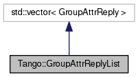

+----------+---------------------------------------+
| |Logo|   | Tango Core Classes Reference  9.2.5   |
+----------+---------------------------------------+

-  `Main Page <../../index.html>`__
-  `Related Pages <../../pages.html>`__
-  `Modules <../../modules.html>`__
-  `Namespaces <../../namespaces.html>`__
-  `Classes <../../annotated.html>`__
-  `Files <../../files.html>`__

-  `Class List <../../annotated.html>`__
-  `Class Hierarchy <../../inherits.html>`__
-  `Class Members <../../functions.html>`__

`Public Member Functions <#pub-methods>`__ \| `Friends <#friends>`__ \|
`List of all
members <../../d7/d2e/classTango_1_1GroupAttrReplyList-members.html>`__

Tango::GroupAttrReplyList Class Reference

`Client classes <../../d1/d45/group__Client.html>`__ » `Group Client
classes <../../db/dc1/group__Grp.html>`__

`Group <../../d4/d6d/classTango_1_1Group.html>`__ reply for a
read\_attribute execution.
`More... <../../db/daa/classTango_1_1GroupAttrReplyList.html#details>`__

Inheritance diagram for Tango::GroupAttrReplyList:

|Inheritance graph|

[`legend <../../graph_legend.html>`__\ ]

Collaboration diagram for Tango::GroupAttrReplyList:

|Collaboration graph|

[`legend <../../graph_legend.html>`__\ ]

Public Member Functions
-----------------------

bool 

`has\_failed <../../db/daa/classTango_1_1GroupAttrReplyList.html#a1737797b7a4585b948752ef80c915fb2>`__
() const

 

| Check if an error has occured.
`More... <#a1737797b7a4585b948752ef80c915fb2>`__

 

void 

`reset <../../db/daa/classTango_1_1GroupAttrReplyList.html#a27620a4010723a1649c0dd810b4e1367>`__
()

 

| Reset the object. `More... <#a27620a4010723a1649c0dd810b4e1367>`__

 

Friends
-------

class 

`Group <../../db/daa/classTango_1_1GroupAttrReplyList.html#a2697825715974a353728f0d4d5658112>`__

 

Detailed Description
--------------------

`Group <../../d4/d6d/classTango_1_1Group.html>`__ reply for a
read\_attribute execution.

This class inherits from **vector<GroupAttrReply>** and therefore, each
device in the group heierarchy has his own
`GroupAttrReply <../../d5/dae/classTango_1_1GroupAttrReply.html>`__
object which can be retrieved with the classical vector [] operator

$Author$ $Revision$

Member Function Documentation
-----------------------------

+--------------------------------------+--------------------------------------+
| +----------------------------------- | inline                               |
| ------------+-----+----+-----+------ |                                      |
| ---+                                 |                                      |
| | bool Tango::GroupAttrReplyList::ha |                                      |
| s\_failed   | (   |    | )   | const |                                      |
|    |                                 |                                      |
| +----------------------------------- |                                      |
| ------------+-----+----+-----+------ |                                      |
| ---+                                 |                                      |
                                                                             
+--------------------------------------+--------------------------------------+

Check if an error has occured.

Returns a boolean set to true if the read\_attribute executed on the
group has failed for any device member of the hierarchy. Otherwise,
returns false

Returns
    The error flag

+--------------------------------------+--------------------------------------+
| +----------------------------------- | inline                               |
| ------+-----+----+-----+----+        |                                      |
| | void Tango::GroupAttrReplyList::re |                                      |
| set   | (   |    | )   |    |        |                                      |
| +----------------------------------- |                                      |
| ------+-----+----+-----+----+        |                                      |
                                                                             
+--------------------------------------+--------------------------------------+

Reset the object.

This methods empty the inherited vector and reset the error flag

Friends And Related Function Documentation
------------------------------------------

+--------------------------------------+--------------------------------------+
| +----------------------------------- | friend                               |
| -------------------------------+     |                                      |
| | friend class `Group <../../d4/d6d/ |                                      |
| classTango_1_1Group.html>`__   |     |                                      |
| +----------------------------------- |                                      |
| -------------------------------+     |                                      |
                                                                             
+--------------------------------------+--------------------------------------+

--------------

The documentation for this class was generated from the following file:

-  `group.h <../../d9/dd1/group_8h_source.html>`__

-  `Tango <../../de/ddf/namespaceTango.html>`__
-  `GroupAttrReplyList <../../db/daa/classTango_1_1GroupAttrReplyList.html>`__
-  Generated on Fri Oct 7 2016 11:11:17 for Tango Core Classes Reference
   by |doxygen| 1.8.8

.. |Logo| image:: ../../logo.jpg

.. |Collaboration graph| image:: ../../d8/d5f/classTango_1_1GroupAttrReplyList__coll__graph.png
.. |doxygen| image:: ../../doxygen.png
   :target: http://www.doxygen.org/index.html
