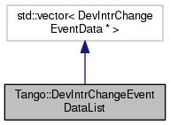

+----------+---------------------------------------+
| |Logo|   | Tango Core Classes Reference  9.2.5   |
+----------+---------------------------------------+

-  `Main Page <../../index.html>`__
-  `Related Pages <../../pages.html>`__
-  `Modules <../../modules.html>`__
-  `Namespaces <../../namespaces.html>`__
-  `Classes <../../annotated.html>`__
-  `Files <../../files.html>`__

-  `Class List <../../annotated.html>`__
-  `Class Hierarchy <../../inherits.html>`__
-  `Class Members <../../functions.html>`__

`Public Member Functions <#pub-methods>`__ \| `List of all
members <../../d5/d5f/classTango_1_1DevIntrChangeEventDataList-members.html>`__

Tango::DevIntrChangeEventDataList Class Reference

``#include "event.h"``

Inheritance diagram for Tango::DevIntrChangeEventDataList:

|Inheritance graph|

[`legend <../../graph_legend.html>`__\ ]

Collaboration diagram for Tango::DevIntrChangeEventDataList:

|Collaboration graph|

[`legend <../../graph_legend.html>`__\ ]

Public Member Functions
-----------------------

 

`DevIntrChangeEventDataList <../../dc/d3b/classTango_1_1DevIntrChangeEventDataList.html#a872f6e8647f117e686bc55632184d058>`__
()

 

 

`~DevIntrChangeEventDataList <../../dc/d3b/classTango_1_1DevIntrChangeEventDataList.html#adf7441209e03b2d0e3d3ff49eca9ca16>`__
()

 

void 

`clear <../../dc/d3b/classTango_1_1DevIntrChangeEventDataList.html#a9d5faf3b858a7f140599260aee1bb9fa>`__
()

 

Constructor & Destructor Documentation
--------------------------------------

+--------------------------------------+--------------------------------------+
| +----------------------------------- | inline                               |
| ------------------------------+----- |                                      |
| +----+-----+----+                    |                                      |
| | Tango::DevIntrChangeEventDataList: |                                      |
| :DevIntrChangeEventDataList   | (    |                                      |
| |    | )   |    |                    |                                      |
| +----------------------------------- |                                      |
| ------------------------------+----- |                                      |
| +----+-----+----+                    |                                      |
                                                                             
+--------------------------------------+--------------------------------------+

+--------------------------------------+--------------------------------------+
| +----------------------------------- | inline                               |
| -------------------------------+---- |                                      |
| -+----+-----+----+                   |                                      |
| | Tango::DevIntrChangeEventDataList: |                                      |
| :~DevIntrChangeEventDataList   | (   |                                      |
|  |    | )   |    |                   |                                      |
| +----------------------------------- |                                      |
| -------------------------------+---- |                                      |
| -+----+-----+----+                   |                                      |
                                                                             
+--------------------------------------+--------------------------------------+

Member Function Documentation
-----------------------------

+--------------------------------------+--------------------------------------+
| +----------------------------------- | inline                               |
| --------------+-----+----+-----+---- |                                      |
| +                                    |                                      |
| | void Tango::DevIntrChangeEventData |                                      |
| List::clear   | (   |    | )   |     |                                      |
| |                                    |                                      |
| +----------------------------------- |                                      |
| --------------+-----+----+-----+---- |                                      |
| +                                    |                                      |
                                                                             
+--------------------------------------+--------------------------------------+

--------------

The documentation for this class was generated from the following file:

-  `event.h <../../dd/d20/event_8h_source.html>`__

-  `Tango <../../de/ddf/namespaceTango.html>`__
-  `DevIntrChangeEventDataList <../../dc/d3b/classTango_1_1DevIntrChangeEventDataList.html>`__
-  Generated on Fri Oct 7 2016 11:11:17 for Tango Core Classes Reference
   by |doxygen| 1.8.8

.. |Logo| image:: ../../logo.jpg
.. |Inheritance graph| image:: ../../dc/d4c/classTango_1_1DevIntrChangeEventDataList__inherit__graph.png

.. |doxygen| image:: ../../doxygen.png
   :target: http://www.doxygen.org/index.html
