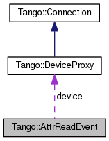

+----------+---------------------------------------+
| |Logo|   | Tango Core Classes Reference  9.2.5   |
+----------+---------------------------------------+

-  `Main Page <../../index.html>`__
-  `Related Pages <../../pages.html>`__
-  `Modules <../../modules.html>`__
-  `Namespaces <../../namespaces.html>`__
-  `Classes <../../annotated.html>`__
-  `Files <../../files.html>`__

-  `Class List <../../annotated.html>`__
-  `Class Hierarchy <../../inherits.html>`__
-  `Class Members <../../functions.html>`__

`Classes <#nested-classes>`__ \| `Public Attributes <#pub-attribs>`__ \|
`List of all
members <../../d1/d84/classTango_1_1AttrReadEvent-members.html>`__

Tango::AttrReadEvent Class Reference

`Client classes <../../d1/d45/group__Client.html>`__

Asynchronous read attribute execution callback data.
`More... <../../dc/d42/classTango_1_1AttrReadEvent.html#details>`__

Collaboration diagram for Tango::AttrReadEvent:

|Collaboration graph|

[`legend <../../graph_legend.html>`__\ ]

Public Attributes
-----------------

vector<
`DeviceAttribute <../../d7/dca/classTango_1_1DeviceAttribute.html>`__ >
\* 

`argout <../../dc/d42/classTango_1_1AttrReadEvent.html#afb3a4d42905139147b8f3badae37f509>`__

 

| The attribute data. `More... <#afb3a4d42905139147b8f3badae37f509>`__

 

vector< string > & 

`attr\_names <../../dc/d42/classTango_1_1AttrReadEvent.html#aba1abaa8dd0c0513945d73297d6f31e2>`__

 

| The attribute name list.
`More... <#aba1abaa8dd0c0513945d73297d6f31e2>`__

 

`Tango::DeviceProxy <../../d9/d83/classTango_1_1DeviceProxy.html>`__ \* 

`device <../../dc/d42/classTango_1_1AttrReadEvent.html#acf3b676448255116ba14ee7c7bc4e062>`__

 

| The `DeviceProxy <../../d9/d83/classTango_1_1DeviceProxy.html>`__
object on which the call was executed.
`More... <#acf3b676448255116ba14ee7c7bc4e062>`__

 

bool 

`err <../../dc/d42/classTango_1_1AttrReadEvent.html#a81fa0b8b572d1dd3328afb21c747b34a>`__

 

| A boolean flag set to true if the request failed. False otherwise.
`More... <#a81fa0b8b572d1dd3328afb21c747b34a>`__

 

DevErrorList & 

`errors <../../dc/d42/classTango_1_1AttrReadEvent.html#ac15cd8804bb7185316d718a7fca674ff>`__

 

| The error stack. `More... <#ac15cd8804bb7185316d718a7fca674ff>`__

 

Detailed Description
--------------------

Asynchronous read attribute execution callback data.

This class is used to pass data to the callback method in asynchronous
callback model for read\_attribute(s) execution

$Author$ $Revision$

Member Data Documentation
-------------------------

+------------------------------------------------------------------------------------------------------------------+
| vector<`DeviceAttribute <../../d7/dca/classTango_1_1DeviceAttribute.html>`__\ >\* Tango::AttrReadEvent::argout   |
+------------------------------------------------------------------------------------------------------------------+

The attribute data.

+-----------------------------------------------------+
| vector<string>& Tango::AttrReadEvent::attr\_names   |
+-----------------------------------------------------+

The attribute name list.

+---------------------------------------------------------------------------------------------------------+
| `Tango::DeviceProxy <../../d9/d83/classTango_1_1DeviceProxy.html>`__\ \* Tango::AttrReadEvent::device   |
+---------------------------------------------------------------------------------------------------------+

The `DeviceProxy <../../d9/d83/classTango_1_1DeviceProxy.html>`__ object
on which the call was executed.

+----------------------------------+
| bool Tango::AttrReadEvent::err   |
+----------------------------------+

A boolean flag set to true if the request failed. False otherwise.

+----------------------------------------------+
| DevErrorList& Tango::AttrReadEvent::errors   |
+----------------------------------------------+

The error stack.

--------------

The documentation for this class was generated from the following file:

-  `devasyn.h <../../db/d02/devasyn_8h_source.html>`__

-  `Tango <../../de/ddf/namespaceTango.html>`__
-  `AttrReadEvent <../../dc/d42/classTango_1_1AttrReadEvent.html>`__
-  Generated on Fri Oct 7 2016 11:11:16 for Tango Core Classes Reference
   by |doxygen| 1.8.8

.. |Logo| image:: ../../logo.jpg

.. |doxygen| image:: ../../doxygen.png
   :target: http://www.doxygen.org/index.html
