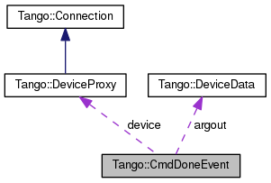

+----------+---------------------------------------+
| |Logo|   | Tango Core Classes Reference  9.2.5   |
+----------+---------------------------------------+

-  `Main Page <../../index.html>`__
-  `Related Pages <../../pages.html>`__
-  `Modules <../../modules.html>`__
-  `Namespaces <../../namespaces.html>`__
-  `Classes <../../annotated.html>`__
-  `Files <../../files.html>`__

-  `Class List <../../annotated.html>`__
-  `Class Hierarchy <../../inherits.html>`__
-  `Class Members <../../functions.html>`__

`Classes <#nested-classes>`__ \| `Public Attributes <#pub-attribs>`__ \|
`List of all
members <../../d4/dfd/classTango_1_1CmdDoneEvent-members.html>`__

Tango::CmdDoneEvent Class Reference

`Client classes <../../d1/d45/group__Client.html>`__

Asynchronous command execution callback data.
`More... <../../dc/d43/classTango_1_1CmdDoneEvent.html#details>`__

Collaboration diagram for Tango::CmdDoneEvent:

|Collaboration graph|

[`legend <../../graph_legend.html>`__\ ]

Public Attributes
-----------------

`DeviceData <../../df/d22/classTango_1_1DeviceData.html>`__ & 

`argout <../../dc/d43/classTango_1_1CmdDoneEvent.html#a5bfb13a2fa90db07a6bd6092188dd96b>`__

 

| The command argout. `More... <#a5bfb13a2fa90db07a6bd6092188dd96b>`__

 

string & 

`cmd\_name <../../dc/d43/classTango_1_1CmdDoneEvent.html#a9b3ff5a65147c469b19d5deafecf600a>`__

 

| The command name. `More... <#a9b3ff5a65147c469b19d5deafecf600a>`__

 

`Tango::DeviceProxy <../../d9/d83/classTango_1_1DeviceProxy.html>`__ \* 

`device <../../dc/d43/classTango_1_1CmdDoneEvent.html#a4815622ebc52bc227f481e2d488cc7c1>`__

 

| The `DeviceProxy <../../d9/d83/classTango_1_1DeviceProxy.html>`__
object on which the call was executed.
`More... <#a4815622ebc52bc227f481e2d488cc7c1>`__

 

bool 

`err <../../dc/d43/classTango_1_1CmdDoneEvent.html#aa65c091b8483025114f5825760cb994a>`__

 

| A boolean flag set to true if the command failed. False otherwise.
`More... <#aa65c091b8483025114f5825760cb994a>`__

 

DevErrorList & 

`errors <../../dc/d43/classTango_1_1CmdDoneEvent.html#ad6842cac8f28ad790a3a19bd4818390e>`__

 

| The error stack. `More... <#ad6842cac8f28ad790a3a19bd4818390e>`__

 

Detailed Description
--------------------

Asynchronous command execution callback data.

This class is used to pass data to the callback method in asynchronous
callback model for command execution.

$Author$ $Revision$

Member Data Documentation
-------------------------

+----------------------------------------------------------------------------------------------+
| `DeviceData <../../df/d22/classTango_1_1DeviceData.html>`__\ & Tango::CmdDoneEvent::argout   |
+----------------------------------------------------------------------------------------------+

The command argout.

+------------------------------------------+
| string& Tango::CmdDoneEvent::cmd\_name   |
+------------------------------------------+

The command name.

+--------------------------------------------------------------------------------------------------------+
| `Tango::DeviceProxy <../../d9/d83/classTango_1_1DeviceProxy.html>`__\ \* Tango::CmdDoneEvent::device   |
+--------------------------------------------------------------------------------------------------------+

The `DeviceProxy <../../d9/d83/classTango_1_1DeviceProxy.html>`__ object
on which the call was executed.

+---------------------------------+
| bool Tango::CmdDoneEvent::err   |
+---------------------------------+

A boolean flag set to true if the command failed. False otherwise.

+---------------------------------------------+
| DevErrorList& Tango::CmdDoneEvent::errors   |
+---------------------------------------------+

The error stack.

--------------

The documentation for this class was generated from the following file:

-  `devasyn.h <../../db/d02/devasyn_8h_source.html>`__

-  `Tango <../../de/ddf/namespaceTango.html>`__
-  `CmdDoneEvent <../../dc/d43/classTango_1_1CmdDoneEvent.html>`__
-  Generated on Fri Oct 7 2016 11:11:16 for Tango Core Classes Reference
   by |doxygen| 1.8.8

.. |Logo| image:: ../../logo.jpg

.. |doxygen| image:: ../../doxygen.png
   :target: http://www.doxygen.org/index.html
