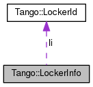

+----------+---------------------------------------+
| |Logo|   | Tango Core Classes Reference  9.2.5   |
+----------+---------------------------------------+

-  `Main Page <../../index.html>`__
-  `Related Pages <../../pages.html>`__
-  `Modules <../../modules.html>`__
-  `Namespaces <../../namespaces.html>`__
-  `Classes <../../annotated.html>`__
-  `Files <../../files.html>`__

-  `Class List <../../annotated.html>`__
-  `Class Hierarchy <../../inherits.html>`__
-  `Class Members <../../functions.html>`__

`Public Attributes <#pub-attribs>`__ \| `List of all
members <../../d9/dc1/structTango_1_1LockerInfo-members.html>`__

Tango::LockerInfo Struct Reference

``#include "devapi.h"``

Collaboration diagram for Tango::LockerInfo:

|Collaboration graph|

[`legend <../../graph_legend.html>`__\ ]

Public Attributes
-----------------

`LockerId <../../d8/d7f/unionTango_1_1LockerId.html>`__ 

`li <../../dd/d39/structTango_1_1LockerInfo.html#ac19a902ad6cc0fe15e74485cc09d3f5a>`__

 

LockerLanguage 

`ll <../../dd/d39/structTango_1_1LockerInfo.html#a7a15276bc7ce4c7dd2ff59f8aa67f185>`__

 

string 

`locker\_class <../../dd/d39/structTango_1_1LockerInfo.html#a024019267de036847a9f7e30b2c3fe1a>`__

 

string 

`locker\_host <../../dd/d39/structTango_1_1LockerInfo.html#ad357dac7c976f8336baeadcf8abafe81>`__

 

Member Data Documentation
-------------------------

+---------------------------------------------------------------------------------+
| `LockerId <../../d8/d7f/unionTango_1_1LockerId.html>`__ Tango::LockerInfo::li   |
+---------------------------------------------------------------------------------+

+----------------------------------------+
| LockerLanguage Tango::LockerInfo::ll   |
+----------------------------------------+

+-------------------------------------------+
| string Tango::LockerInfo::locker\_class   |
+-------------------------------------------+

+------------------------------------------+
| string Tango::LockerInfo::locker\_host   |
+------------------------------------------+

--------------

The documentation for this struct was generated from the following file:

-  `devapi.h <../../d9/ddc/devapi_8h_source.html>`__

-  `Tango <../../de/ddf/namespaceTango.html>`__
-  `LockerInfo <../../dd/d39/structTango_1_1LockerInfo.html>`__
-  Generated on Fri Oct 7 2016 11:11:17 for Tango Core Classes Reference
   by |doxygen| 1.8.8

.. |Logo| image:: ../../logo.jpg

.. |doxygen| image:: ../../doxygen.png
   :target: http://www.doxygen.org/index.html
