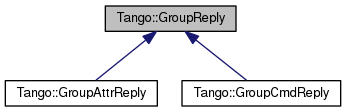

+----------+---------------------------------------+
| |Logo|   | Tango Core Classes Reference  9.2.5   |
+----------+---------------------------------------+

-  `Main Page <../../index.html>`__
-  `Related Pages <../../pages.html>`__
-  `Modules <../../modules.html>`__
-  `Namespaces <../../namespaces.html>`__
-  `Classes <../../annotated.html>`__
-  `Files <../../files.html>`__

-  `Class List <../../annotated.html>`__
-  `Class Hierarchy <../../inherits.html>`__
-  `Class Members <../../functions.html>`__

`Public Member Functions <#pub-methods>`__ \| `Static Public Member
Functions <#pub-static-methods>`__ \| `List of all
members <../../d5/d93/classTango_1_1GroupReply-members.html>`__

Tango::GroupReply Class Reference

`Client classes <../../d1/d45/group__Client.html>`__ » `Group Client
classes <../../db/dc1/group__Grp.html>`__

Base class for `Group <../../d4/d6d/classTango_1_1Group.html>`__ reply.
`More... <../../de/deb/classTango_1_1GroupReply.html#details>`__

Inheritance diagram for Tango::GroupReply:

|Inheritance graph|

[`legend <../../graph_legend.html>`__\ ]

Public Member Functions
-----------------------

const std::string & 

`dev\_name <../../de/deb/classTango_1_1GroupReply.html#a4fe578ba1fcd03239b7dc589ffc1af77>`__
() const

 

| Get device name. `More... <#a4fe578ba1fcd03239b7dc589ffc1af77>`__

 

const DevErrorList & 

`get\_err\_stack <../../de/deb/classTango_1_1GroupReply.html#a47419919cad3f689140757bd09eae457>`__
() const

 

| Get error stack. `More... <#a47419919cad3f689140757bd09eae457>`__

 

bool 

`has\_failed <../../de/deb/classTango_1_1GroupReply.html#aec0def5a9df786134dc9cb8c66c21cb8>`__
() const

 

| Check if an error has occured.
`More... <#aec0def5a9df786134dc9cb8c66c21cb8>`__

 

const std::string & 

`obj\_name <../../de/deb/classTango_1_1GroupReply.html#a13564b3e6df04a5257b2592b94a07d88>`__
() const

 

| Get object name. `More... <#a13564b3e6df04a5257b2592b94a07d88>`__

 

Static Public Member Functions
------------------------------

static bool 

`enable\_exception <../../de/deb/classTango_1_1GroupReply.html#a4250fb27cfce0de073029a1b778b06b8>`__
(bool exception\_mode=true)

 

| Enable/Disable exception.
`More... <#a4250fb27cfce0de073029a1b778b06b8>`__

 

Detailed Description
--------------------

Base class for `Group <../../d4/d6d/classTango_1_1Group.html>`__ reply.

$Author$ $Revision$

Member Function Documentation
-----------------------------

+--------------------------------------+--------------------------------------+
| +----------------------------------- | inline                               |
| ----------------+-----+----+-----+-- |                                      |
| -------+                             |                                      |
| | const std::string& Tango::GroupRep |                                      |
| ly::dev\_name   | (   |    | )   | c |                                      |
| onst   |                             |                                      |
| +----------------------------------- |                                      |
| ----------------+-----+----+-----+-- |                                      |
| -------+                             |                                      |
                                                                             
+--------------------------------------+--------------------------------------+

Get device name.

Returns the device name for the group element

Returns
    The device name

+--------------------------------------+--------------------------------------+
| +----------------------------------- | static                               |
| -----------------+-----+---------+-- |                                      |
| ------------------------------+----- |                                      |
| +----+                               |                                      |
| | static bool Tango::GroupReply::ena |                                      |
| ble\_exception   | (   | bool    | * |                                      |
| exception\_mode* = ``true``   | )    |                                      |
| |    |                               |                                      |
| +----------------------------------- |                                      |
| -----------------+-----+---------+-- |                                      |
| ------------------------------+----- |                                      |
| +----+                               |                                      |
                                                                             
+--------------------------------------+--------------------------------------+

Enable/Disable exception.

Set the group exception mode. If set to true, exception will be thrown
(when needed) by the library when the user get command execution result.
If set to false (the default), the user has to deal with the
`has\_failed() <../../de/deb/classTango_1_1GroupReply.html#aec0def5a9df786134dc9cb8c66c21cb8>`__
exception to manage cases of wrong execution command.

Parameters
    +--------+-------------------+--------------------------+
    | [in]   | exception\_mode   | The new exception mode   |
    +--------+-------------------+--------------------------+

Returns
    The previous exception mode

+--------------------------------------+--------------------------------------+
| +----------------------------------- | inline                               |
| -----------------------+-----+----+- |                                      |
| ----+---------+                      |                                      |
| | const DevErrorList& Tango::GroupRe |                                      |
| ply::get\_err\_stack   | (   |    |  |                                      |
| )   | const   |                      |                                      |
| +----------------------------------- |                                      |
| -----------------------+-----+----+- |                                      |
| ----+---------+                      |                                      |
                                                                             
+--------------------------------------+--------------------------------------+

Get error stack.

Returns the error stack for the group element

Returns
    The error stack

+--------------------------------------+--------------------------------------+
| +----------------------------------- | inline                               |
| ----+-----+----+-----+---------+     |                                      |
| | bool Tango::GroupReply::has\_faile |                                      |
| d   | (   |    | )   | const   |     |                                      |
| +----------------------------------- |                                      |
| ----+-----+----+-----+---------+     |                                      |
                                                                             
+--------------------------------------+--------------------------------------+

Check if an error has occured.

Returns a boolean set to true if the command executed on the group
element has failed. Otherwise, returns false

Returns
    The error flag

+--------------------------------------+--------------------------------------+
| +----------------------------------- | inline                               |
| ----------------+-----+----+-----+-- |                                      |
| -------+                             |                                      |
| | const std::string& Tango::GroupRep |                                      |
| ly::obj\_name   | (   |    | )   | c |                                      |
| onst   |                             |                                      |
| +----------------------------------- |                                      |
| ----------------+-----+----+-----+-- |                                      |
| -------+                             |                                      |
                                                                             
+--------------------------------------+--------------------------------------+

Get object name.

Returns the object name (i.e. command or attribute) for the group
element

Returns
    The object name

--------------

The documentation for this class was generated from the following file:

-  `group.h <../../d9/dd1/group_8h_source.html>`__

-  `Tango <../../de/ddf/namespaceTango.html>`__
-  `GroupReply <../../de/deb/classTango_1_1GroupReply.html>`__
-  Generated on Fri Oct 7 2016 11:11:17 for Tango Core Classes Reference
   by |doxygen| 1.8.8

.. |Logo| image:: ../../logo.jpg

.. |doxygen| image:: ../../doxygen.png
   :target: http://www.doxygen.org/index.html
