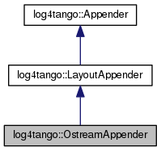

+----------+---------------------------------------+
| |Logo|   | Tango Core Classes Reference  9.2.5   |
+----------+---------------------------------------+

-  `Main Page <../../index.html>`__
-  `Related Pages <../../pages.html>`__
-  `Modules <../../modules.html>`__
-  `Namespaces <../../namespaces.html>`__
-  `Classes <../../annotated.html>`__
-  `Files <../../files.html>`__

-  `Class List <../../annotated.html>`__
-  `Class Hierarchy <../../inherits.html>`__
-  `Class Members <../../functions.html>`__

`Public Member Functions <#pub-methods>`__ \| `Protected Member
Functions <#pro-methods>`__ \| `Protected Attributes <#pro-attribs>`__
\| `List of all
members <../../dd/df5/classlog4tango_1_1OstreamAppender-members.html>`__

log4tango::OstreamAppender Class Reference

``#include "OstreamAppender.hh"``

Inheritance diagram for log4tango::OstreamAppender:

|Inheritance graph|

[`legend <../../graph_legend.html>`__\ ]

Collaboration diagram for log4tango::OstreamAppender:

|Collaboration graph|

[`legend <../../graph_legend.html>`__\ ]

Public Member Functions
-----------------------

 

`OstreamAppender <../../df/d37/classlog4tango_1_1OstreamAppender.html#a8a12ee99972317e420641f9cbc02974a>`__
(const std::string &name, std::ostream \*stream)

 

virtual 

`~OstreamAppender <../../df/d37/classlog4tango_1_1OstreamAppender.html#ade995645915820003be7b1e2461bb072>`__
()

 

virtual void 

`close <../../df/d37/classlog4tango_1_1OstreamAppender.html#a6a805af756881eb7ba69de21c60780a1>`__
()

 

| Release any resources allocated within the appender such as file
handles, network connections, etc.
`More... <#a6a805af756881eb7ba69de21c60780a1>`__

 

virtual bool 

`reopen <../../df/d37/classlog4tango_1_1OstreamAppender.html#ac07a12e667d34c7560a690cf35851ec8>`__
()

 

| Reopens the output destination of this
`Appender <../../d7/dc4/classlog4tango_1_1Appender.html>`__, e.g.
`More... <#ac07a12e667d34c7560a690cf35851ec8>`__

 

|-| Public Member Functions inherited from
`log4tango::LayoutAppender <../../d3/db6/classlog4tango_1_1LayoutAppender.html>`__

 

`LayoutAppender <../../d3/db6/classlog4tango_1_1LayoutAppender.html#aae15fc6ce336d263386c6866ad569782>`__
(const std::string &name)

 

virtual 

`~LayoutAppender <../../d3/db6/classlog4tango_1_1LayoutAppender.html#a2822f627fd98e29db0a9a7c96377e81e>`__
()

 

virtual bool 

`requires\_layout <../../d3/db6/classlog4tango_1_1LayoutAppender.html#aed53ada140e2b10a63d4d836b0e22ba9>`__
() const

 

| Check if the appender uses a layout.
`More... <#aed53ada140e2b10a63d4d836b0e22ba9>`__

 

virtual void 

`set\_layout <../../d3/db6/classlog4tango_1_1LayoutAppender.html#ac3d2b08e933399a5dfc78dab2c208055>`__
(`Layout <../../d7/da6/classlog4tango_1_1Layout.html>`__ \*layout=0)

 

| Change the layout. `More... <#ac3d2b08e933399a5dfc78dab2c208055>`__

 

|-| Public Member Functions inherited from
`log4tango::Appender <../../d7/dc4/classlog4tango_1_1Appender.html>`__

virtual 

`~Appender <../../d7/dc4/classlog4tango_1_1Appender.html#a3951b12a37424e9418963680662388b1>`__
()

 

| Destructor for
`Appender <../../d7/dc4/classlog4tango_1_1Appender.html>`__.
`More... <#a3951b12a37424e9418963680662388b1>`__

 

int 

`append <../../d7/dc4/classlog4tango_1_1Appender.html#acfb6f50c20043bd740b198dfbb4231ea>`__
(const
`LoggingEvent <../../d8/df2/structlog4tango_1_1LoggingEvent.html>`__
&event)

 

| Log in `Appender <../../d7/dc4/classlog4tango_1_1Appender.html>`__
specific way. `More... <#acfb6f50c20043bd740b198dfbb4231ea>`__

 

const std::string & 

`get\_name <../../d7/dc4/classlog4tango_1_1Appender.html#ac02d43ef46297bcc9eb3e1442d00b58c>`__
(void) const

 

| Returns this appender name.
`More... <#ac02d43ef46297bcc9eb3e1442d00b58c>`__

 

virtual bool 

`is\_valid <../../d7/dc4/classlog4tango_1_1Appender.html#af8d183b5fdfc4b4affda75d1846d9270>`__
(void) const

 

| Check if the appender is valid (for instance the underlying connection
is ok) This default implementation always return true.
`More... <#af8d183b5fdfc4b4affda75d1846d9270>`__

 

Protected Member Functions
--------------------------

virtual int 

`\_append <../../df/d37/classlog4tango_1_1OstreamAppender.html#a90001f5d7e7ef88b5492e6154d90aa86>`__
(const
`LoggingEvent <../../d8/df2/structlog4tango_1_1LoggingEvent.html>`__
&event)

 

| Log in `Appender <../../d7/dc4/classlog4tango_1_1Appender.html>`__
specific way. `More... <#a90001f5d7e7ef88b5492e6154d90aa86>`__

 

|-| Protected Member Functions inherited from
`log4tango::LayoutAppender <../../d3/db6/classlog4tango_1_1LayoutAppender.html>`__

`Layout <../../d7/da6/classlog4tango_1_1Layout.html>`__ & 

`get\_layout <../../d3/db6/classlog4tango_1_1LayoutAppender.html#a5b0903233dd0bb8ea2d6fc33a5b85cb0>`__
()

 

|-| Protected Member Functions inherited from
`log4tango::Appender <../../d7/dc4/classlog4tango_1_1Appender.html>`__

 

`Appender <../../d7/dc4/classlog4tango_1_1Appender.html#a16f9d0456a87ff10d57b02f7d5c2cc01>`__
(const std::string &name)

 

| Constructor for
`Appender <../../d7/dc4/classlog4tango_1_1Appender.html>`__.
`More... <#a16f9d0456a87ff10d57b02f7d5c2cc01>`__

 

virtual void 

`level\_changed <../../d7/dc4/classlog4tango_1_1Appender.html#a3ee7b310ce4681a93e1f53bdcc02a15c>`__
(`Level::Value <../../d8/d0e/classlog4tango_1_1Level.html#aa708c09b6a19a8cc8a3b19631561ca99>`__
new\_level)

 

| Inform an appender that its
`Logger <../../d4/d1c/classlog4tango_1_1Logger.html>`__'s logging level
has changed. `More... <#a3ee7b310ce4681a93e1f53bdcc02a15c>`__

 

Protected Attributes
--------------------

std::ostream \* 

`\_stream <../../df/d37/classlog4tango_1_1OstreamAppender.html#ac8b44c1711e080e46488853a6ed8967f>`__

 

Additional Inherited Members
----------------------------

|-| Public Types inherited from
`log4tango::LayoutAppender <../../d3/db6/classlog4tango_1_1LayoutAppender.html>`__

typedef `Layout <../../d7/da6/classlog4tango_1_1Layout.html>`__ 

`DefaultLayoutType <../../d3/db6/classlog4tango_1_1LayoutAppender.html#afff8b793c258c86701cbd1fe72925b49>`__

 

Constructor & Destructor Documentation
--------------------------------------

+-----------------------------------------------+-----+------------------------+-------------+
| log4tango::OstreamAppender::OstreamAppender   | (   | const std::string &    | *name*,     |
+-----------------------------------------------+-----+------------------------+-------------+
|                                               |     | std::ostream \*        | *stream*    |
+-----------------------------------------------+-----+------------------------+-------------+
|                                               | )   |                        |             |
+-----------------------------------------------+-----+------------------------+-------------+

+--------------------------------------+--------------------------------------+
| +----------------------------------- | virtual                              |
| -------------+-----+----+-----+----+ |                                      |
| | log4tango::OstreamAppender::~Ostre |                                      |
| amAppender   | (   |    | )   |    | |                                      |
| +----------------------------------- |                                      |
| -------------+-----+----+-----+----+ |                                      |
                                                                             
+--------------------------------------+--------------------------------------+

References
`close() <../../df/d37/classlog4tango_1_1OstreamAppender.html#a6a805af756881eb7ba69de21c60780a1>`__.

Member Function Documentation
-----------------------------

+--------------------------------------+--------------------------------------+
| +----------------------------------- | protectedvirtual                     |
| ---------+-----+-------------------- |                                      |
| ------------------------------------ |                                      |
| -------------------------+---------- |                                      |
| -+-----+----+                        |                                      |
| | int log4tango::OstreamAppender::\_ |                                      |
| append   | (   | const `LoggingEvent |                                      |
|  <../../d8/df2/structlog4tango_1_1Lo |                                      |
| ggingEvent.html>`__ &    | *event*   |                                      |
|  | )   |    |                        |                                      |
| +----------------------------------- |                                      |
| ---------+-----+-------------------- |                                      |
| ------------------------------------ |                                      |
| -------------------------+---------- |                                      |
| -+-----+----+                        |                                      |
                                                                             
+--------------------------------------+--------------------------------------+

Log in `Appender <../../d7/dc4/classlog4tango_1_1Appender.html>`__
specific way.

Subclasses of
`Appender <../../d7/dc4/classlog4tango_1_1Appender.html>`__ should
implement this method to perform actual logging.

Parameters
    +---------+------------------------------------------------------------------------------------+
    | event   | The `LoggingEvent <../../d8/df2/structlog4tango_1_1LoggingEvent.html>`__ to log.   |
    +---------+------------------------------------------------------------------------------------+

Implements
`log4tango::Appender <../../d7/dc4/classlog4tango_1_1Appender.html#a87739ce35cdc83e06dd4c55af28d3ac8>`__.

References
`\_stream <../../df/d37/classlog4tango_1_1OstreamAppender.html#ac8b44c1711e080e46488853a6ed8967f>`__,
`std::endl() <../../d8/dcc/namespacestd.html#a4639029cd5db5428c743a52d095356b9>`__,
`log4tango::Layout::format() <../../d7/da6/classlog4tango_1_1Layout.html#a0ade719b2ab1ce512aca5699f136eb8b>`__,
and
`log4tango::LayoutAppender::get\_layout() <../../d3/db6/classlog4tango_1_1LayoutAppender.html#a5b0903233dd0bb8ea2d6fc33a5b85cb0>`__.

+--------------------------------------+--------------------------------------+
| +----------------------------------- | virtual                              |
| -------+-----+----+-----+----+       |                                      |
| | void log4tango::OstreamAppender::c |                                      |
| lose   | (   |    | )   |    |       |                                      |
| +----------------------------------- |                                      |
| -------+-----+----+-----+----+       |                                      |
                                                                             
+--------------------------------------+--------------------------------------+

Release any resources allocated within the appender such as file
handles, network connections, etc.

Implements
`log4tango::Appender <../../d7/dc4/classlog4tango_1_1Appender.html#adafebe465072844506448a35570f9c59>`__.

Referenced by
`~OstreamAppender() <../../df/d37/classlog4tango_1_1OstreamAppender.html#ade995645915820003be7b1e2461bb072>`__.

+--------------------------------------+--------------------------------------+
| +----------------------------------- | virtual                              |
| --------+-----+---------+----+-----+ |                                      |
| ----+                                |                                      |
| | bool log4tango::OstreamAppender::r |                                      |
| eopen   | (   | void    |    | )   | |                                      |
|     |                                |                                      |
| +----------------------------------- |                                      |
| --------+-----+---------+----+-----+ |                                      |
| ----+                                |                                      |
                                                                             
+--------------------------------------+--------------------------------------+

Reopens the output destination of this
`Appender <../../d7/dc4/classlog4tango_1_1Appender.html>`__, e.g.

the logfile or TCP socket.

Returns
    false if an error occured during reopening, true otherwise.

Reimplemented from
`log4tango::Appender <../../d7/dc4/classlog4tango_1_1Appender.html#a1f853fae3eebe457698039e3aafb770a>`__.

Member Data Documentation
-------------------------

+--------------------------------------+--------------------------------------+
| +----------------------------------- | protected                            |
| --------------------+                |                                      |
| | std::ostream\* log4tango::OstreamA |                                      |
| ppender::\_stream   |                |                                      |
| +----------------------------------- |                                      |
| --------------------+                |                                      |
                                                                             
+--------------------------------------+--------------------------------------+

Referenced by
`\_append() <../../df/d37/classlog4tango_1_1OstreamAppender.html#a90001f5d7e7ef88b5492e6154d90aa86>`__.

--------------

The documentation for this class was generated from the following files:

-  `OstreamAppender.hh <../../d5/d17/OstreamAppender_8hh_source.html>`__
-  `OstreamAppender.cpp <../../da/dc0/OstreamAppender_8cpp.html>`__

-  `log4tango <../../d4/db0/namespacelog4tango.html>`__
-  `OstreamAppender <../../df/d37/classlog4tango_1_1OstreamAppender.html>`__
-  Generated on Fri Oct 7 2016 11:11:16 for Tango Core Classes Reference
   by |doxygen| 1.8.8

.. |Logo| image:: ../../logo.jpg

.. |Collaboration graph| image:: ../../d8/d80/classlog4tango_1_1OstreamAppender__coll__graph.png
.. |-| image:: ../../closed.png
.. |doxygen| image:: ../../doxygen.png
   :target: http://www.doxygen.org/index.html
