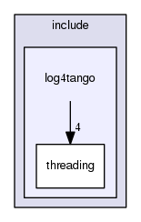

+----------+---------------------------------------+
| |Logo|   | Tango Core Classes Reference  9.2.5   |
+----------+---------------------------------------+

-  `Main Page <index.html>`__
-  `Related Pages <pages.html>`__
-  `Modules <modules.html>`__
-  `Namespaces <namespaces.html>`__
-  `Classes <annotated.html>`__
-  `Files <files.html>`__

log4tango Directory Reference

Directory dependency graph for log4tango:

|log4tango|

Directories
-----------

directory  

`threading <dir_58cd9cfc9a679a0ea9e384cd3ddfdc12.html>`__

 

Files
-----

file  

`Appender.hh <d2/d5c/Appender_8hh.html>`__
`[code] <d2/d5c/Appender_8hh_source.html>`__

 

file  

`AppenderAttachable.hh <d6/d73/AppenderAttachable_8hh.html>`__
`[code] <d6/d73/AppenderAttachable_8hh_source.html>`__

 

file  

`config-win32.h <dc/d5c/config-win32_8h.html>`__
`[code] <dc/d5c/config-win32_8h_source.html>`__

 

file  

`Export.hh <df/d5d/Export_8hh.html>`__
`[code] <df/d5d/Export_8hh_source.html>`__

 

file  

`FileAppender.hh <dd/de6/FileAppender_8hh.html>`__
`[code] <dd/de6/FileAppender_8hh_source.html>`__

 

file  

`Filter.hh <de/df0/Filter_8hh.html>`__
`[code] <de/df0/Filter_8hh_source.html>`__

 

file  

`Layout.hh <db/da8/Layout_8hh.html>`__
`[code] <db/da8/Layout_8hh_source.html>`__

 

file  

`LayoutAppender.hh <d3/da3/LayoutAppender_8hh.html>`__
`[code] <d3/da3/LayoutAppender_8hh_source.html>`__

 

file  

`Level.hh <d2/d33/Level_8hh.html>`__
`[code] <d2/d33/Level_8hh_source.html>`__

 

file  

`Logger.hh <d1/d13/Logger_8hh.html>`__
`[code] <d1/d13/Logger_8hh_source.html>`__

 

file  

`LoggerStream.hh <d2/de3/LoggerStream_8hh.html>`__
`[code] <d2/de3/LoggerStream_8hh_source.html>`__

 

file  

`LoggingEvent.hh <d2/d60/LoggingEvent_8hh.html>`__
`[code] <d2/d60/LoggingEvent_8hh_source.html>`__

 

file  

`LogSeparator.hh <d5/d64/LogSeparator_8hh.html>`__
`[code] <d5/d64/LogSeparator_8hh_source.html>`__

 

file  

`LogStream.hh <d6/d89/LogStream_8hh.html>`__
`[code] <d6/d89/LogStream_8hh_source.html>`__

 

file  

`LogStreambuf.hh <d7/dff/LogStreambuf_8hh.html>`__
`[code] <d7/dff/LogStreambuf_8hh_source.html>`__

 

file  

`NDC.hh <d1/d26/NDC_8hh.html>`__ `[code] <d1/d26/NDC_8hh_source.html>`__

 

file  

`OstreamAppender.hh <d5/d17/OstreamAppender_8hh.html>`__
`[code] <d5/d17/OstreamAppender_8hh_source.html>`__

 

file  

`PatternLayout.hh <df/d8c/PatternLayout_8hh.html>`__
`[code] <df/d8c/PatternLayout_8hh_source.html>`__

 

file  

`Portability.hh <da/dd8/Portability_8hh.html>`__
`[code] <da/dd8/Portability_8hh_source.html>`__

 

file  

`RollingFileAppender.hh <d7/dd5/RollingFileAppender_8hh.html>`__
`[code] <d7/dd5/RollingFileAppender_8hh_source.html>`__

 

file  

`TimeStamp.hh <db/d7c/TimeStamp_8hh.html>`__
`[code] <db/d7c/TimeStamp_8hh_source.html>`__

 

file  

`XmlLayout.hh <d3/d7f/XmlLayout_8hh.html>`__
`[code] <d3/d7f/XmlLayout_8hh_source.html>`__

 

-  `include <dir_93bc669b4520ad36068f344e109b7d17.html>`__
-  `log4tango <dir_5a849e394260fc4e91409ef0349c0857.html>`__
-  Generated on Fri Oct 7 2016 11:11:17 for Tango Core Classes Reference
   by |doxygen| 1.8.8

.. |Logo| image:: logo.jpg

.. |doxygen| image:: doxygen.png
   :target: http://www.doxygen.org/index.html
