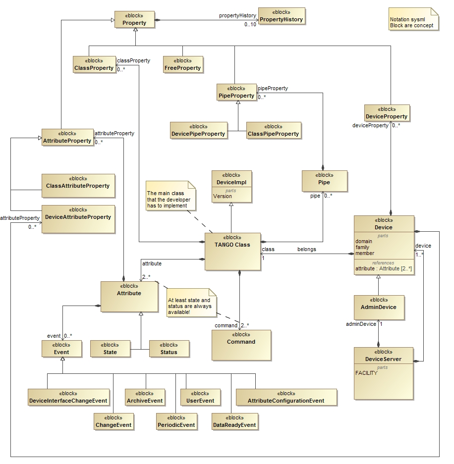
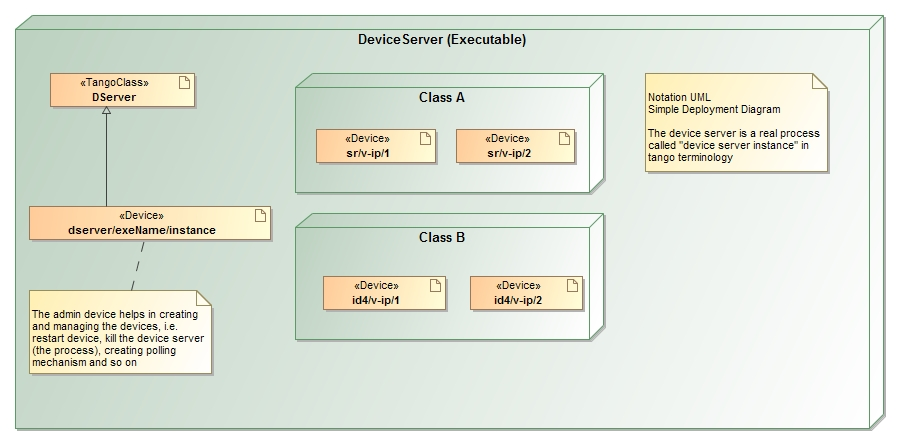

.. _tango_device_server_model:

Tango Device Server Model
=========================

Target
------

This document is directed to advanced developer.

Primary Presentation
--------------------

|image0|

Figure 1: Tango Device Server Model

|image1|

Figure 2: Runtime representation of a Device server

Elements
--------

+-------------------------------+--------------------------------------------------------------------------------------------------------------------------------------------------------------------------------------------------------------------------------------------------------------------------------------------------------------------------------------------------+
| **Block**                     | **Description**                                                                                                                                                                                                                                                                                                                                  |
+===============================+==================================================================================================================================================================================================================================================================================================================================================+
| Device                        | Abstract concept defined by the TANGO device server object model; it                                                                                                                                                                                                                                                                             |
|                               |                                                                                                                                                                                                                                                                                                                                                  |
|                               | can be a piece of hardware (an interlock bit) a collection of hardware (a screen attached to a stepper motor)                                                                                                                                                                                                                                    |
|                               |                                                                                                                                                                                                                                                                                                                                                  |
|                               | a logical device (a taper) or a combination of all these (an accelerator).                                                                                                                                                                                                                                                                       |
|                               |                                                                                                                                                                                                                                                                                                                                                  |
|                               | Please refer also to the :ref:`Glossary <glossary>`, :term:`Device`.                                                                                                                                                                                                                                                                             |
+-------------------------------+--------------------------------------------------------------------------------------------------------------------------------------------------------------------------------------------------------------------------------------------------------------------------------------------------------------------------------------------------+
| TANGO Class                   | From Object Oriented Programming concept, this is the main class that the developer has to implement                                                                                                                                                                                                                                             |
+-------------------------------+--------------------------------------------------------------------------------------------------------------------------------------------------------------------------------------------------------------------------------------------------------------------------------------------------------------------------------------------------+
| DeviceServer                  | The server (also referred as device server) is a process whose main task is to offer one or more services to one or more clients. To do this, the server has to spend most of its time in a wait loop waiting for clients to connect to it. The devices are hosted in the server process. A server is able to host several classes of devices.   |
|                               |                                                                                                                                                                                                                                                                                                                                                  |
|                               | In short, it is a process that export devices available to accept requests). Please refer also to the :ref:`Glossary <glossary>`, :term:`Device Server instance`.                                                                                                                                                                                |
+-------------------------------+--------------------------------------------------------------------------------------------------------------------------------------------------------------------------------------------------------------------------------------------------------------------------------------------------------------------------------------------------+
| Property                      | Store a generic configuration                                                                                                                                                                                                                                                                                                                    |
+-------------------------------+--------------------------------------------------------------------------------------------------------------------------------------------------------------------------------------------------------------------------------------------------------------------------------------------------------------------------------------------------+
| DeviceProperty                | Device specific configuration                                                                                                                                                                                                                                                                                                                    |
+-------------------------------+--------------------------------------------------------------------------------------------------------------------------------------------------------------------------------------------------------------------------------------------------------------------------------------------------------------------------------------------------+
| ClassProperty                 | Class specific configuration                                                                                                                                                                                                                                                                                                                     |
+-------------------------------+--------------------------------------------------------------------------------------------------------------------------------------------------------------------------------------------------------------------------------------------------------------------------------------------------------------------------------------------------+
| AttributeProperty             | Attribute specific configuration                                                                                                                                                                                                                                                                                                                 |
+-------------------------------+--------------------------------------------------------------------------------------------------------------------------------------------------------------------------------------------------------------------------------------------------------------------------------------------------------------------------------------------------+
| ClassAttributeProperty        | Attribute specific configuration at class level                                                                                                                                                                                                                                                                                                  |
+-------------------------------+--------------------------------------------------------------------------------------------------------------------------------------------------------------------------------------------------------------------------------------------------------------------------------------------------------------------------------------------------+
| DeviceAttributeProperty       | Specific configuration for a specific attribute of a specific device                                                                                                                                                                                                                                                                             |
+-------------------------------+--------------------------------------------------------------------------------------------------------------------------------------------------------------------------------------------------------------------------------------------------------------------------------------------------------------------------------------------------+
| FreeProperty                  | User-defined specific configuration (for instance GUI, generic system and so on)                                                                                                                                                                                                                                                                 |
+-------------------------------+--------------------------------------------------------------------------------------------------------------------------------------------------------------------------------------------------------------------------------------------------------------------------------------------------------------------------------------------------+
| PropertyHistory               | History of the values for a property (maximum 10 latest are stored for each property)                                                                                                                                                                                                                                                            |
+-------------------------------+--------------------------------------------------------------------------------------------------------------------------------------------------------------------------------------------------------------------------------------------------------------------------------------------------------------------------------------------------+
| Attribute                     | See :ref:`Glossary <glossary>`, :term:`Attribute`.                                                                                                                                                                                                                                                                                               |
+-------------------------------+--------------------------------------------------------------------------------------------------------------------------------------------------------------------------------------------------------------------------------------------------------------------------------------------------------------------------------------------------+
| AttributeAlias                | One word which can be used to identify a specific attribute. (shortcut)                                                                                                                                                                                                                                                                          |
+-------------------------------+--------------------------------------------------------------------------------------------------------------------------------------------------------------------------------------------------------------------------------------------------------------------------------------------------------------------------------------------------+
| Pipe                          | See :ref:`Glossary <glossary>`, :term:`Pipe`.                                                                                                                                                                                                                                                                                                    |
+-------------------------------+--------------------------------------------------------------------------------------------------------------------------------------------------------------------------------------------------------------------------------------------------------------------------------------------------------------------------------------------------+
| PipeProperty                  | Pipe specific configuration                                                                                                                                                                                                                                                                                                                      |
+-------------------------------+--------------------------------------------------------------------------------------------------------------------------------------------------------------------------------------------------------------------------------------------------------------------------------------------------------------------------------------------------+
| DevicePipeProperty            | Configuration of a specific pipe of a specific device                                                                                                                                                                                                                                                                                            |
+-------------------------------+--------------------------------------------------------------------------------------------------------------------------------------------------------------------------------------------------------------------------------------------------------------------------------------------------------------------------------------------------+
| ClassPipeProperty             | Configuration of a specific pipe for a specific class                                                                                                                                                                                                                                                                                            |
+-------------------------------+--------------------------------------------------------------------------------------------------------------------------------------------------------------------------------------------------------------------------------------------------------------------------------------------------------------------------------------------------+
| Event                         | Refer to :ref:`Events <events_tangoclient>`.                                                                                                                                                                                                                                                                                                     |
+-------------------------------+--------------------------------------------------------------------------------------------------------------------------------------------------------------------------------------------------------------------------------------------------------------------------------------------------------------------------------------------------+
| Command                       | See :ref:`Glossary <commands_deviceservermodel>`; A list of default command are available for the admin device at section :ref:`DServer <dserverclass_deviceserverwriting>`.                                                                                                                                                                     |
+-------------------------------+--------------------------------------------------------------------------------------------------------------------------------------------------------------------------------------------------------------------------------------------------------------------------------------------------------------------------------------------------+
| ChangeEvent                   | It is a type of event that gets fired when the associated attribute changes its value according to its configuration specified in system specific attribute properties (abs\_change and rel\_change);                                                                                                                                            |
|                               |                                                                                                                                                                                                                                                                                                                                                  |
|                               | Refer to :ref:`Events <events_tangoclient>`.                                                                                                                                                                                                                                                                                                     |
+-------------------------------+--------------------------------------------------------------------------------------------------------------------------------------------------------------------------------------------------------------------------------------------------------------------------------------------------------------------------------------------------+
| ArchiveEvent                  | It is a type of event that gets fired when the associated attribute should be archived according to its configuration specified in system specific attribute properties (archive\_abs\_change, archive\_rel\_change and archive\_period);                                                                                                        |
|                               |                                                                                                                                                                                                                                                                                                                                                  |
|                               | Refer to :ref:`Events <events_tangoclient>`.                                                                                                                                                                                                                                                                                                     |
+-------------------------------+--------------------------------------------------------------------------------------------------------------------------------------------------------------------------------------------------------------------------------------------------------------------------------------------------------------------------------------------------+
| UserEvent                     | It is a type of event that gets fired when the device server programmer wants to;                                                                                                                                                                                                                                                                |
|                               |                                                                                                                                                                                                                                                                                                                                                  |
|                               | Refer to :ref:`Events <events_tangoclient>`.                                                                                                                                                                                                                                                                                                     |
+-------------------------------+--------------------------------------------------------------------------------------------------------------------------------------------------------------------------------------------------------------------------------------------------------------------------------------------------------------------------------------------------+
| PeriodicEvent                 | It is a type of event that gets fired at a fixed periodic interval;                                                                                                                                                                                                                                                                              |
|                               |                                                                                                                                                                                                                                                                                                                                                  |
|                               | Refer to :ref:`Events <events_tangoclient>`.                                                                                                                                                                                                                                                                                                     |
+-------------------------------+--------------------------------------------------------------------------------------------------------------------------------------------------------------------------------------------------------------------------------------------------------------------------------------------------------------------------------------------------+
| DataReadyEvent                | It is a type of event that gets fired to inform a client that it is now possible to read an attribute;                                                                                                                                                                                                                                           |
|                               |                                                                                                                                                                                                                                                                                                                                                  |
|                               | Refer to :ref:`Events <events_tangoclient>`.                                                                                                                                                                                                                                                                                                     |
+-------------------------------+--------------------------------------------------------------------------------------------------------------------------------------------------------------------------------------------------------------------------------------------------------------------------------------------------------------------------------------------------+
| AttributeConfigurationEvent   | It is a type of event that gets fired if the attribute configuration is changed;                                                                                                                                                                                                                                                                 |
|                               |                                                                                                                                                                                                                                                                                                                                                  |
|                               | Refer to :ref:`Events <events_tangoclient>`.                                                                                                                                                                                                                                                                                                     |
+-------------------------------+--------------------------------------------------------------------------------------------------------------------------------------------------------------------------------------------------------------------------------------------------------------------------------------------------------------------------------------------------+
| DeviceInterfaceChangeEvent    | It is a type of event that gets fired when the device interface changes;                                                                                                                                                                                                                                                                         |
|                               |                                                                                                                                                                                                                                                                                                                                                  |
|                               | Refer to :ref:`Events <events_tangoclient>`.                                                                                                                                                                                                                                                                                                     |
+-------------------------------+--------------------------------------------------------------------------------------------------------------------------------------------------------------------------------------------------------------------------------------------------------------------------------------------------------------------------------------------------+
| DeviceImpl                    | Base implementation of every class that will become a device.                                                                                                                                                                                                                                                                                    |
+-------------------------------+--------------------------------------------------------------------------------------------------------------------------------------------------------------------------------------------------------------------------------------------------------------------------------------------------------------------------------------------------+
| State                         | The device state is a number which reflects the availability of the device.                                                                                                                                                                                                                                                                      |
|                               |                                                                                                                                                                                                                                                                                                                                                  |
|                               | Refer to :ref:`Events <choosingdevicestate_deviceserverwriting>`                                                                                                                                                                                                                                                                                 |
+-------------------------------+--------------------------------------------------------------------------------------------------------------------------------------------------------------------------------------------------------------------------------------------------------------------------------------------------------------------------------------------------+
| Status                        | The state of the device as a formatted ascii string                                                                                                                                                                                                                                                                                              |
+-------------------------------+--------------------------------------------------------------------------------------------------------------------------------------------------------------------------------------------------------------------------------------------------------------------------------------------------------------------------------------------------+
| AdminDevice                   | Special type of Device dedicated to creating and managing the devices, i.e. restart device, kill the device server (the process), creating polling mechanism and so on                                                                                                                                                                           |
+-------------------------------+--------------------------------------------------------------------------------------------------------------------------------------------------------------------------------------------------------------------------------------------------------------------------------------------------------------------------------------------------+

Attributes
----------

+----------------+-----------------+------------------------------------------------------------------------------------------------------------------------------------------------------------------------------------------+
| **Block**      | **Attribute**   | **Description**                                                                                                                                                                          |
+================+=================+==========================================================================================================================================================================================+
| Device         | name            | Correspond to “Domain/family/member”                                                                                                                                                     |
+----------------+-----------------+------------------------------------------------------------------------------------------------------------------------------------------------------------------------------------------+
|                | alias           | A word that you can use to access the device, like a shortcut. Device name alias(es) must also be unique within a control system. There is no predefined syntax for device name alias.   |
+----------------+-----------------+------------------------------------------------------------------------------------------------------------------------------------------------------------------------------------------+
|                | domain          | Each device has a unique name in the control system. Within Tango, a four field name space has been adopted consisting of                                                                |
|                |                 |                                                                                                                                                                                          |
|                |                 | [//FACILITY/]DOMAIN/CLASS/MEMBER                                                                                                                                                         |
|                |                 |                                                                                                                                                                                          |
|                |                 | Facility refers to the control system instance, domain refers to the sub-system, class the class and member the instance of the device.                                                  |
+----------------+-----------------+------------------------------------------------------------------------------------------------------------------------------------------------------------------------------------------+
|                | family          |                                                                                                                                                                                          |
+----------------+-----------------+------------------------------------------------------------------------------------------------------------------------------------------------------------------------------------------+
|                | member          |                                                                                                                                                                                          |
+----------------+-----------------+------------------------------------------------------------------------------------------------------------------------------------------------------------------------------------------+
|                | version         | It correspond to the version of base device implementation class (for backward compatibility). It is used to know how to communicate with this device and what features are supported.   |
+----------------+-----------------+------------------------------------------------------------------------------------------------------------------------------------------------------------------------------------------+
|                | class           | Name of the class corresponding to the Device                                                                                                                                            |
+----------------+-----------------+------------------------------------------------------------------------------------------------------------------------------------------------------------------------------------------+
|                | ior             | Orb Identifier used to connect with the device                                                                                                                                           |
+----------------+-----------------+------------------------------------------------------------------------------------------------------------------------------------------------------------------------------------------+
|                | host            | Where the device is running                                                                                                                                                              |
+----------------+-----------------+------------------------------------------------------------------------------------------------------------------------------------------------------------------------------------------+
|                | pid             | Id of the specific process                                                                                                                                                               |
+----------------+-----------------+------------------------------------------------------------------------------------------------------------------------------------------------------------------------------------------+
|                | exported        | Means that the device is available to accept request                                                                                                                                     |
+----------------+-----------------+------------------------------------------------------------------------------------------------------------------------------------------------------------------------------------------+
| DeviceServer   | Facility        | Represent the host where the device server instance (aka process) lives                                                                                                                  |
+----------------+-----------------+------------------------------------------------------------------------------------------------------------------------------------------------------------------------------------------+
| Attribute      | alias           | A shortcut that you can use to access the attribute (in the Database there is a specific table)                                                                                          |
+----------------+-----------------+------------------------------------------------------------------------------------------------------------------------------------------------------------------------------------------+

Relations
---------

+------------------+---------------------------+--------------------+---------------------------------------------------------------------------------------------------------------------------------+
| **Left Block**   | **Right Block**           | **Multiplicity**   | **Description**                                                                                                                 |
+==================+===========================+====================+=================================================================================================================================+
| Device           | TANGO Class               | 1                  | Every device belongs to a Tango class                                                                                           |
+------------------+---------------------------+--------------------+---------------------------------------------------------------------------------------------------------------------------------+
| Attribute        | ClassAttributeProperty    | 0..\*              | An attribute can have more than one class attribute property associated                                                         |
+------------------+---------------------------+--------------------+---------------------------------------------------------------------------------------------------------------------------------+
| Attribute        | Event                     | 0..\*              | An attribute can have more than one event associated                                                                            |
+------------------+---------------------------+--------------------+---------------------------------------------------------------------------------------------------------------------------------+
| Device           | DeviceAttributeProperty   | 0..\*              | A device can have more than one Device Attribute Property associated                                                            |
+------------------+---------------------------+--------------------+---------------------------------------------------------------------------------------------------------------------------------+
| Device           | DeviceProperty            | 0..\*              | A device can have more than one Device Property associated                                                                      |
+------------------+---------------------------+--------------------+---------------------------------------------------------------------------------------------------------------------------------+
| Device           | Attribute                 | 2..\*              | A Device can have more than one Attribute associated via reference                                                              |
+------------------+---------------------------+--------------------+---------------------------------------------------------------------------------------------------------------------------------+
| DeviceServer     | AdminDevice               | 1                  | Every device server is exporting one admin device                                                                               |
+------------------+---------------------------+--------------------+---------------------------------------------------------------------------------------------------------------------------------+
| DeviceServer     | Device                    | 1..\*              | Every Device server has many devices inside itself                                                                              |
+------------------+---------------------------+--------------------+---------------------------------------------------------------------------------------------------------------------------------+
| Pipe             | PipeProperty              | 0..\*              | A pipe can have more than one Pipe Property associated                                                                          |
+------------------+---------------------------+--------------------+---------------------------------------------------------------------------------------------------------------------------------+
| Property         | PropertyHistory           | 0..10              | A Property can have more than one Property history associated (this will maintain the history of the change for the property)   |
+------------------+---------------------------+--------------------+---------------------------------------------------------------------------------------------------------------------------------+
| TANGO Class      | Attribute                 | 2..\*              | A TANGO Class can have more than one Attribute associated                                                                       |
+------------------+---------------------------+--------------------+---------------------------------------------------------------------------------------------------------------------------------+
| TANGO Class      | ClassProperty             | 0..\*              | A TANGO Class can have more than one Class Property associated                                                                  |
+------------------+---------------------------+--------------------+---------------------------------------------------------------------------------------------------------------------------------+
| TANGO Class      | Command                   | 2..\*              | A TANGO Class can have more than one Command associated                                                                         |
+------------------+---------------------------+--------------------+---------------------------------------------------------------------------------------------------------------------------------+
| TANGO Class      | Pipe                      | 0..\*              | A TANGO Class can have more than one Pipe associated                                                                            |
+------------------+---------------------------+--------------------+---------------------------------------------------------------------------------------------------------------------------------+

Rationale
---------

Please refer to the :ref:`Tango Device Model <deviceservermodel>`.

