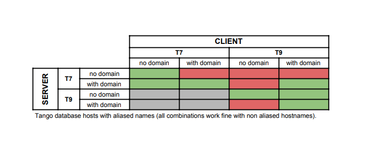

.. _known-issues:

Known issues
============
:audience:`developers`

..  contents:: List of known issues and workarounds
    :local:

Tango 9
-------

Some of these issues are solved using EnsureOmniThread context manager on Tango >=9.4

Unable to launch Jive/DatabaseDS on a linux laptop without network enabled
~~~~~~~~~~~~~~~~~~~~~~~~~~~~~~~~~~~~~~~~~~~~~~~~~~~~~~~~~~~~~~~~~~~~~~~~~~

- **known workaround:** Set TANGO_HOST=127.0.0.1:10000 (local loopback).

Creating/Destroying device proxies on event_received hooks may cause deadlock
~~~~~~~~~~~~~~~~~~~~~~~~~~~~~~~~~~~~~~~~~~~~~~~~~~~~~~~~~~~~~~~~~~~~~~~~~~~~~

- **known workaround:** Avoid creating/destroying proxies outside of the main thread.

Setting event properties for state/string/boolean attributes will crash device server init
~~~~~~~~~~~~~~~~~~~~~~~~~~~~~~~~~~~~~~~~~~~~~~~~~~~~~~~~~~~~~~~~~~~~~~~~~~~~~~~~~~~~~~~~~~

- **known workaround:** Cleanup tango database from event config properties for the device 
  before restart.

Pushing attributes outside of main device server thread may fail
~~~~~~~~~~~~~~~~~~~~~~~~~~~~~~~~~~~~~~~~~~~~~~~~~~~~~~~~~~~~~~~~

- **known workaround:**  Attribute pushing should be preferably done from `read_attribute`, 
  `always_executed_hook`, `read_attr_hardware` or any device command executed from the main 
  server thread.

Pushing attributes events on `read_$attribute` method after setting `attr_value` may crash the device
~~~~~~~~~~~~~~~~~~~~~~~~~~~~~~~~~~~~~~~~~~~~~~~~~~~~~~~~~~~~~~~~~~~~~~~~~~~~~~~~~~~~~~~~~~~~~~~~~~~~~

- **known workaround:** `attr.set_value()` must be called after `push_change_event`, otherwise device will crash.

Pushing attributes within other attributes `read_attribute` methods may cause deadlock
~~~~~~~~~~~~~~~~~~~~~~~~~~~~~~~~~~~~~~~~~~~~~~~~~~~~~~~~~~~~~~~~~~~~~~~~~~~~~~~~~~~~~~

- **known workaround**: Push events for commands or own `read_attribute` method only.

Using Network alias for TANGO_HOST and effect of FQDN names
~~~~~~~~~~~~~~~~~~~~~~~~~~~~~~~~~~~~~~~~~~~~~~~~~~~~~~~~~~~

This issues affect to Tango systems whenever a network alias is used for the
Tango Database together with fully qualified names (host.domain.suff).

T7 server with no domain and client with domain trigger memory leaks in notifd

In Tango 9 and server with domain, clients MUST use the FQDN; in opposite case you may loose events.

Cells in red means likely Event_Timeout issues:

  
Passing ZMQ events through firewalls, specific rules
~~~~~~~~~~~~~~~~~~~~~~~~~~~~~~~~~~~~~~~~~~~~~~~~~~~~

In ZMQ it is not possible to pass Tango events through an specific port, but
specific firewall rules can be setup if each device server uses a different IP.

- **known workaround**: it is possible to setup each device on a machine to use
an specific IP address (to run servers on different IP addresses he server host 
must have multiple interfaces, tipically virtual ones).

.. code:: 

  #To use an pecific IP launch the device server with arguments like:
  
  ./MyDeviceServer $InstanceName -ORBendPoint giop:tcp:$IPADDRESS:$PORT
  ./MyDeviceServer 1 -ORBendPoint giop:tcp:127.0.0.1:30001
  
  #Or set an environment variable in your python code
  os.environ["ORBendPoint"] = "giop:tcp:127.0.0.1:30001"

Tango 8
-------

Memory leaks on push state event
~~~~~~~~~~~~~~~~~~~~~~~~~~~~~~~~

The API of push change event for state/status attributes is different, it does 
not allow to pass the value like in other attributes.

.. code::

    Wrong way (memory leak):
        push_change_event('State', PyTango.DevState.RUNNING)
    Right way:
        set_state(PyTango.DevState.RUNNING)
        push_change_event('State')

Writing on Numpy arrays
~~~~~~~~~~~~~~~~~~~~~~~

    To write a position value of a motor group (numpy array) the Macroserver writes 
    two values and the Pool reads zeros. It happens at claess with the energy pseudomotor.

