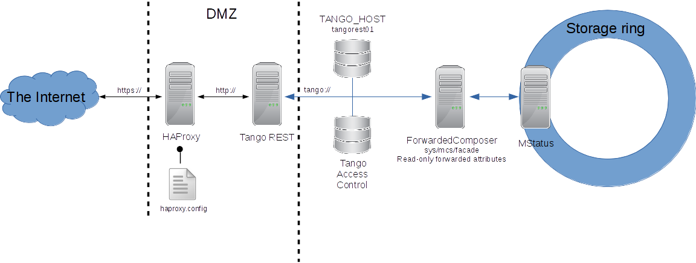

.. level: advanced
.. target: Tango client developer; DevOps

.. _tango_rest_api:

Tango REST API
==============

Tango provides REST API specification. This can be used to implement integrations of Tango with 3rd party products using http protocol instead of tango protocol.

Simple example of such 3rd product can be a mobile client application for monitoring Tango.

This section tries to answer the following questions:

* What is REST and why it is useful
* Getting started with simple example
* Example of a safe REST API deployment at ESRF
* Further steps

Tango REST API specification
----------------------------

Shortly speaking REST API in general exports resources. These resources are accessible using URL addressing. Client performs actions on the resources defined by http methods. Typically these are:

GET - request a resource

PUT - update a resource

POST - create a new resource

DELETE - remove a resource

Tango REST API exports Tango hosts; Tango devices; Tango device attributes, commands and pipes. So it follows :ref:`Tango Device Server Model <tango_device_server_model>`.

For example, one can request :term:`Tango Host` using Tango REST API:

:command:`GET tango/rest/rc4/hosts/tango_host/10000`

Here one uses Tango REST API implementation related to version RC4 [TODO link to the branch] this relates to
tango/rest/rc4 part of the exmaple URL. `hosts` exports all the :term:<Tango Hosts `Tango Host`> accessible through
this Tango REST API implementation. tango_host/10000 relates to TANGO_HOST=tango_host:10000.

In the following example client requests for a device attribute:

:command:`GET tango/rest/rc4/hosts/tango_host/10000/devices/sys/tg_test/1/attributes/double_scalar/value`

Again here `tango/rest/rc4` relates to Tango REST API version RC4 implementation; `hosts/tango_host/10000` relates to TANGO_HOST=tango_host:10000;  `devices/sys/tg_test/1` relates to the device `tango://tango_host:10000/sys/tg_test/1` exported through this Tango REST API; finally `attributes/double_scalar/value` relates to the value of the attribute.

The third example is how client executes a command of a device:

:command:`PUT tango/rest/rc4/hosts/tango_host/10000/devices/sys/tg_test/1/commands/DevDouble?v=3.14`

Here client executes tango://tango_host:10000/sys/tg_test/1/DevDouble with the input arg=3.14

The full reference can be found following this `link <http://tango-rest-api.readthedocs.io/en/latest>`_

Real life example of getting beam current value from ESRF:

https://mstatus.esrf.fr/tango/rest/rc4/hosts/tangorest01.esrf.fr/10000/devices/sys/mcs/facade/attributes/current/value

Use tango-cs/tango when prompted.

Tango REST API implementations
------------------------------

Since Tango REST API itself is only a specification one needs an actual implementation running some where.

Known implementations are:

`mtangorest.server <https://bitbucket.org/hzgwpn/mtangorest.server>`_

Please refer to the corresponding implementation documentation on how to install and use it.

In a nutshell download the latest fat jar distribution and start the server via :command:`java -DTANGO_HOST=localhost:10000 -jar mtangorest.server.jar -nodb -dlist sys/rest/0`

Basically one can test the installation trying to read an attribute value from a device. Typically there is a TangoTest server running on the tango host through browser:

:command:`http://localhost:10001/tango/rest/rc4/hosts/localhost/10000/devices/sys/tg_test/1/attributes/double_scalar/value`

.. code-block:: json

    {
        "name":"double_scalar",
        "value":179.04696279859678,
        "quality":"ATTR_VALID",
        "timestamp":1493918496122
    }

Deployment
----------

As Tango REST is supposed to export Tango via http to the Internet the usual question is how to protect Tango from the unwanted activity.

The deployment of the Tango REST API can be quite safe. Usually one wants to put Tango REST API server behind a reverse proxy and restrict its access to a single :term:`Tango Host`. Reverse proxy can also allow connections only via https.

As every request via REST API must be validated against Tango Access Control this adds an extra layer of security.

Below is a deployment scheme of REST API at ESRF:

https://mstatus.esrf.fr/tango/rest

Use tango-cs/tango when prompted.

In this installation REST API exports readonly forwarded attributes and is accessible via secured http connection.

Every request passes HAProxy configured to use https protocol for secure connection. On its backend HAproxy speaks with Tango REST server which in turn can access only one tango host where a device of class `ForwardComposer <https://github.com/tango-controls/ForwardedComposer>`_ is defined. This device provides read only access to MStatus Tango device with status information about the storage ring at ESRF.

In addition Tango REST API can be integrated with authentication and authorisation services like kerberos.

Finally Tango REST API implementation should use Tango Access Control to validate every request made from the Internet.

Further steps
-------------

Install Tango REST API server localy or using docker [reference].

Develop your REST client or use 3rd party frameworks (`mTangoSDK <http://bitbucket.org/hzgwpn/mtango>`_, `tangojs <https://tangojs.github.io/>`_).

Deploy everything in the local network or in the cloud [reference].

References
----------

[1] `Tango REST API specification <http://tango-rest-api.readthedocs.io/en/latest>`_
[2] `Tango REST API specification on GitHub <https://github.com/tango-controls/rest-api>`_
[3] `mtangorest.server -- Tango REST API implementation <https://bitbucket.org/hzgwpn/mtangorest.server>`_
