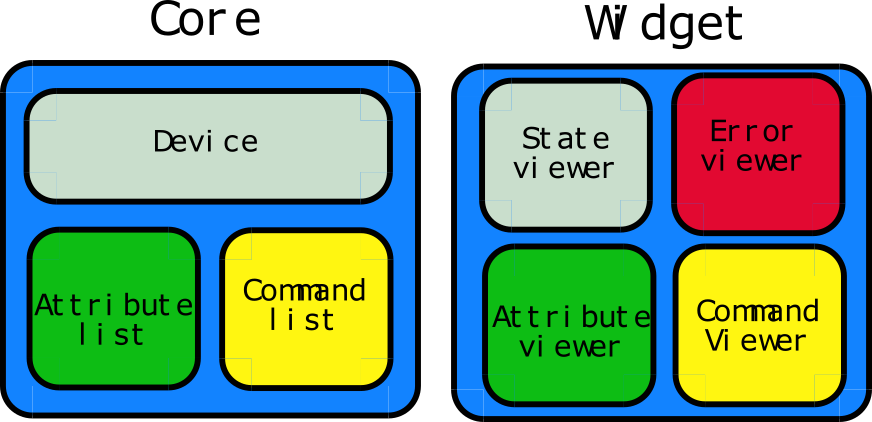
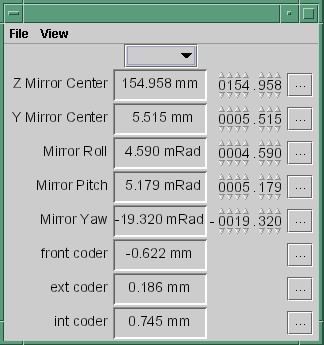
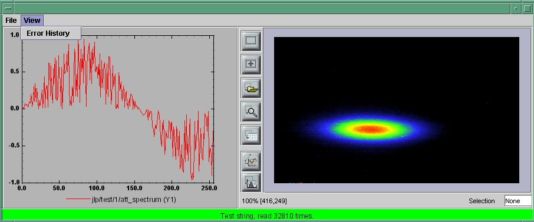
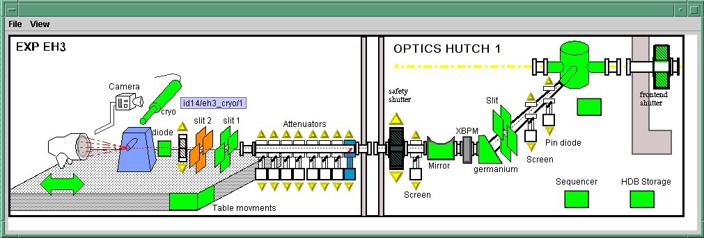

.. raw:: latex

    \clearpage

.. |image10| image:: atk/img/listpanel.png

.. _atk_programmers_guide:

TangoATK Programmer’s Guide
===========================

This chapter is only a brief Tango ATK (Application ToolKit)
programmer’s guide. You can find a reference guide with a full
description of TangoATK classes and methods in the ATK JavaDoc
(`Tango ATK reference on-line documentation`_).

A tutorial document `Tango ATK Tutorial`_ is also provided
and includes the detailed description of the ATK architecture and the
ATK components. In the `ATK Tutorial`_ you
can find some code examples and also Flash Demos which explain how to
start using Tango ATK.

Introduction
------------

This document describes how to develop applications using the Tango
Application Toolkit, TangoATK for short. It will start with a brief
description of the main concepts behind the toolkit, and then continue
with more practical, real-life examples to explain key parts.

Assumptions
~~~~~~~~~~~

The author assumes that the reader has a good knowledge of the Java
programming language, and a thorough understanding of object-oriented
programming. Also, it is expected that the reader is fluent in all
aspects regarding Tango devices, attributes, and commands.

The key concepts of TangoATK
----------------------------

TangoATK was developed with these goals in mind

-  TangoATK should help minimize development time

-  TangoATK should help minimize bugs in applications

-  TangoATK should support applications that contain attributes and
   commands from several different devices.

-  TangoATK should help avoid code duplication.

Since most Tango-applications were foreseen to be displayed on some sort
of graphic terminal, TangoATK needed to provide support for some sort of
graphic building blocks. To enable this, and since the toolkit was to be
written in Java, we looked to Swing to figure out how to do this.

Swing is developed using a variant over a design-pattern the
Model-View-Controller (MVC) pattern called *model-delegate*, where the
view and the controller of the MVC-pattern are merged into one object.

| |image09|

This pattern made the choice of labor division quite easy: all
non-graphic parts of TangoATK reside in the packages beneath
`fr.esrf.tangoatk.core`, and anything remotely graphic are located
beneath `fr.esrf.tangoatk.widge`\ t. More on the content and
organization of this will follow.

The communication between the non-graphic and graphic objects are done
by having the graphic object registering itself as a listener to the
non-graphic object, and the non-graphic object emmiting events telling
the listeners that its state has changed.

Minimize development time
~~~~~~~~~~~~~~~~~~~~~~~~~

For TangoATK to help minimize the development time of graphic
applications, the toolkit has been developed along two lines of thought

-  Things that are needed in most applications are included, eg
   ``Splash``, a splash window which gives a graphical way for the
   application to show the progress of a long operation. The splash
   window is moslty used in the startup phase of the application.

-  Building blocks provided by TangoATK should be easy to use and follow
   certain patterns, eg every graphic widget has a ``setModel`` method
   which is used to connect the widget with its non-graphic model.

In addition to this, TangoATK provides a framework for error handling,
something that is often a time consuming task.

Minimize bugs in applications
~~~~~~~~~~~~~~~~~~~~~~~~~~~~~

Together with the Tango API, TangoATK takes care of most of the hard
things related to programming with Tango. Using TangoATK the developer
can focus on developing her application, not on understanding Tango.

Attributes and commands from different devices
~~~~~~~~~~~~~~~~~~~~~~~~~~~~~~~~~~~~~~~~~~~~~~

To be able to create applications with attributes and commands from
different devices, it was decided that the central objects of TangoATK
were not to be the device, but rather the *attributes and the commands*.
This will certainly feel a bit awkward at first, but trust me, the
design holds.

For this design to be feasible, a structure was needed to keep track of
the commands and attributes, so the *command-list and the
attribute-list* was introduced. These two objects can hold commands and
attributes from any number of devices.

Avoid code duplication
~~~~~~~~~~~~~~~~~~~~~~

When writing applications for a control-system without a framework much
code is duplicated. Anything from simple widgets for showing numeric
values to error handling has to be implemented each time. TangoATK
supplies a number of frequently used widgets along with a framework for
connecting these widgets with their non-graphic counterparts. Because of
this, the developer only needs to write the *glue* - the code which
connects these objects in a manner that suits the specified application.

The real getting started
------------------------

Generally there are two kinds of end-user applications: Applications
that only know how to treat one device, and applications that treat many
devices.

Single device applications
~~~~~~~~~~~~~~~~~~~~~~~~~~

Single device applications are quite easy to write, even with a gui. The
following steps are required

#. Instantiate an AttributeList and fill it with the attributes you
   want.

#. Instantiate a CommandList and fill it with the commands you want.

#. Connect the whole `AttributeList` with a `list viewer` and / or each
   *individual attribute* with an *attribute viewer*.

#. Connect the whole `CommandList` to a *command list viewer* and / or
   connect each *individual command* in the command list with a *command
   viewer*.

|image10|

The following program (FirstApplication) shows an implementation of the
list mentioned above. It should be rather self-explanatory with the
comments.

.. code:: java
   :number-lines:

    package examples;

    import javax.swing.JFrame;
    import javax.swing.JMenuItem;
    import javax.swing.JMenuBar;
    import javax.swing.JMenu;

    import java.awt.event.ActionListener;
    import java.awt.event.ActionEvent;
    import java.awt.BorderLayout;

    import fr.esrf.tangoatk.core.AttributeList;
    import fr.esrf.tangoatk.core.ConnectionException;

    import fr.esrf.tangoatk.core.CommandList;
    import fr.esrf.tangoatk.widget.util.ErrorHistory;
    import fr.esrf.tangoatk.widget.util.ATKGraphicsUtils;
    import fr.esrf.tangoatk.widget.attribute.ScalarListViewer;
    import fr.esrf.tangoatk.widget.command.CommandComboViewer;

    public class FirstApplication extends JFrame
    {
    JMenuBar menu;                    // So that our application looks
                                      // halfway decent.
    AttributeList attributes;         // The list that will contain our
                                      // attributes
    CommandList commands;             // The list that will contain our
                                      // commands
    ErrorHistory errorHistory;        // A window that displays errors
    ScalarListViewer sListViewer;     // A viewer which knows how to
                                      // display a list of scalar attributes.
                                      // If you want to display other types
                                      // than scalars, you'll have to wait
                                      // for the next example.
    CommandComboViewer commandViewer; // A viewer which knows how to display
                                      // a combobox of commands and execute
                                      // them.
    String device;                    // The name of our device.

    public FirstApplication()
    {
       // The swing stuff to create the menu bar and its pulldown menus
       menu = new JMenuBar();
       JMenu fileMenu = new JMenu();
       fileMenu.setText("File");
       JMenu viewMenu = new JMenu();
       viewMenu.setText("View");

       JMenuItem quitItem = new JMenuItem();
       quitItem.setText("Quit");
       quitItem.addActionListener(new
          java.awt.event.ActionListener()
          {
           public void
           actionPerformed(ActionEvent evt)
           {quitItemActionPerformed(evt);}
          });
       fileMenu.add(quitItem);

       JMenuItem errorHistItem = new JMenuItem();
       errorHistItem.setText("Error History");
       errorHistItem.addActionListener(new
               java.awt.event.ActionListener()
               {
                public void
                actionPerformed(ActionEvent evt)
                {errHistItemActionPerformed(evt);}
               });
       viewMenu.add(errorHistItem);
       menu.add(fileMenu);
       menu.add(viewMenu);

       //
       // Here we create ATK objects to handle attributes, commands and errors.
       //
       attributes = new AttributeList();
       commands = new CommandList();
       errorHistory = new ErrorHistory();
       device = "id14/eh3_mirror/1";
       sListViewer = new ScalarListViewer();
       commandViewer = new CommandComboViewer();

    //
    // A feature of the command and attribute list is that if you
    // supply an errorlistener to these lists, they'll add that
    // errorlistener to all subsequently created attributes or
    // commands. So it is important to do this _before_ you
    // start adding attributes or commands.
    //

       attributes.addErrorListener(errorHistory);
       commands.addErrorListener(errorHistory);

    //
    // Sometimes we're out of luck and the device or the attributes
    // are not available. In that case a ConnectionException is thrown.
    // This is why we add the attributes in a try/catch
    //

       try
       {

    //
    // Another feature of the attribute and command list is that they
    // can add wildcard names, currently only `*' is supported.
    // When using a wildcard, the lists will add all commands or
    // attributes available on the device.
    //
       attributes.add(device + "/*");
       }
       catch (ConnectionException ce)
       {
          System.out.println("Error fetching " +
                             "attributes from " +
                             device + " " + ce);
       }

    //
    // See the comments for attributelist
    //

       try
       {
          commands.add(device + "/*");
       }
       catch (ConnectionException ce)
       {
          System.out.println("Error fetching " +
                             "commands from " +
                             device + " " + ce);
       }

    //
    // Here we tell the scalarViewer what it's to show. The
    // ScalarListViewer loops through the attribute-list and picks out
    // the ones which are scalars and show them.
    //

       sListViewer.setModel(attributes);

    //
    // This is where the CommandComboViewer is told what it's to
    // show. It knows how to show and execute most commands.
    //

       commandViewer.setModel(commands);

    //
    // add the menubar to the frame
    //

       setJMenuBar(menu);

    //
    // Make the layout nice.
    //

       getContentPane().setLayout(new BorderLayout());
       getContentPane().add(commandViewer, BorderLayout.NORTH);
       getContentPane().add(sListViewer, BorderLayout.SOUTH);

    //
    // A third feature of the attributelist is that it knows how
    // to refresh its attributes.
    //

       attributes.startRefresher();

    //
    // JFrame stuff to make the thing show.
    //

       pack();
       ATKGraphicsUtils.centerFrameOnScreen(this); //ATK utility to center window

       setVisible(true);
       }

       public static void main(String [] args)
       {
          new FirstApplication();
       }

       public void quitItemActionPerformed(ActionEvent evt)
       {
          System.exit(0);
       }

       public void errHistItemActionPerformed(ActionEvent evt)
       {
          errorHistory.setVisible(true);
       }
    }

The program should look something like this (depending on your platform
and your device)

|image11|

Multi device applications
~~~~~~~~~~~~~~~~~~~~~~~~~

| Multi device applications are quite similar to the single device
  applications, the only difference is that it does not suffice to add
  the attributes by wildcard, you need to add them explicitly, like
  this:

.. code:: java
  :number-lines:

    try
    {
        // a StringScalar attribute from the device one
       attributes.add("jlp/test/1/att_cinq");
       // a NumberSpectrum attribute from the device one
       attributes.add("jlp/test/1/att_spectrum");
       // a NumberImage attribute from the device two
       attributes.add("sr/d-ipc/id25-1n/Image");
    }
    catch (ConnectionException ce)
    {
       System.out.println("Error fetching " +
           "attributes" + ce);
    }

The same goes for commands.

More on displaying attributes
~~~~~~~~~~~~~~~~~~~~~~~~~~~~~

So far, we’ve only considered scalar attributes, and not only that,
we’ve also cheated quite a bit since we just passed the attribute list
to the ``fr.esrf.tangoatk.widget.attribute.ScalarListViewer`` and let it
do all the magic. The attribute list viewers are only available for
scalar attributes (NumberScalarListViewer and ScalarListViewer). If you
have one or several spectrum or image attributes you must connect each
spectrum or image attribute to it’s corresponding attribute viewer
individually. So let’s take a look at how you can connect individual
attributes (and not a whole attribute list) to an individual attribute
viewer (and not to an attribute list viewer).

Connecting an attribute to a viewer
^^^^^^^^^^^^^^^^^^^^^^^^^^^^^^^^^^^

Generally it is done in the following way:

#. You retrieve the attribute from the attribute list

#. You instantiate the viewer

#. Your call the ``setModel`` method on the viewer with the attribute as
   argument.

#. You add your viewer to some panel

The following example (SecondApplication), is a Multi-device
application. Since this application uses individual attribute viewers
and not an attribute list viewer, it shows an implementation of the list
mentioned above.

.. code:: java
  :number-lines:

    package examples;

    import javax.swing.JFrame;
    import javax.swing.JMenuItem;
    import javax.swing.JMenuBar;
    import javax.swing.JMenu;

    import java.awt.event.ActionListener;
    import java.awt.event.ActionEvent;
    import java.awt.BorderLayout;
    import java.awt.Color;

    import fr.esrf.tangoatk.core.AttributeList;
    import fr.esrf.tangoatk.core.ConnectionException;

    import fr.esrf.tangoatk.core.IStringScalar;
    import fr.esrf.tangoatk.core.INumberSpectrum;
    import fr.esrf.tangoatk.core.INumberImage;
    import fr.esrf.tangoatk.widget.util.ErrorHistory;
    import fr.esrf.tangoatk.widget.util.Gradient;
    import fr.esrf.tangoatk.widget.util.ATKGraphicsUtils;
    import fr.esrf.tangoatk.widget.attribute.NumberImageViewer;
    import fr.esrf.tangoatk.widget.attribute.NumberSpectrumViewer;
    import fr.esrf.tangoatk.widget.attribute.SimpleScalarViewer;

    public class SecondApplication extends JFrame
    {
         JMenuBar            menu;
         AttributeList       attributes;   // The list that will contain our attributes
         ErrorHistory        errorHistory; // A window that displays errors
         IStringScalar        ssAtt;
         INumberSpectrum      nsAtt;
         INumberImage         niAtt;
         public SecondApplication()
         {
            // Swing stuff to create the menu bar and its pulldown menus
            menu = new JMenuBar();
            JMenu fileMenu = new JMenu();
            fileMenu.setText("File");
            JMenu viewMenu = new JMenu();
            viewMenu.setText("View");
            JMenuItem quitItem = new JMenuItem();
            quitItem.setText("Quit");
            quitItem.addActionListener(new java.awt.event.ActionListener()
                                          {
                                           public void actionPerformed(ActionEvent evt)
                                           {quitItemActionPerformed(evt);}
                                          });

            fileMenu.add(quitItem);
            JMenuItem errorHistItem = new JMenuItem();
            errorHistItem.setText("Error History");
            errorHistItem.addActionListener(new java.awt.event.ActionListener()
                    {
                     public void actionPerformed(ActionEvent evt)
                     {errHistItemActionPerformed(evt);}
                    });
            viewMenu.add(errorHistItem);
            menu.add(fileMenu);
            menu.add(viewMenu);
          //
          // Here we create TangoATK objects to view attributes and errors.
          //
            attributes = new AttributeList();
            errorHistory = new ErrorHistory();
          //
          // We create a SimpleScalarViewer, a NumberSpectrumViewer and
          // a NumberImageViewer, since we already knew that we were
          // playing with a scalar attribute, a number spectrum attribute
          // and a number image attribute this time.
          //
          SimpleScalarViewer     ssViewer = new SimpleScalarViewer();
            NumberSpectrumViewer   nSpectViewer = new NumberSpectrumViewer();
            NumberImageViewer      nImageViewer = new NumberImageViewer();
            attributes.addErrorListener(errorHistory);
         //
         // The attribute (and command) list has the feature of returning the last
         // attribute that was added to it. Just remember that it is returned as an
         // IEntity object, so you need to cast it into a more specific object, like
         // IStringScalar, which is the interface which defines a string scalar
         //
           try
            {

               ssAtt = (IStringScalar) attributes.add("jlp/test/1/att_cinq");
               nsAtt = (INumberSpectrum) attributes.add("jlp/test/1/att_spectrum");
               niAtt = (INumberImage) attributes.add("sr/d-ipc/id25-1n/Image");
            }
            catch (ConnectionException ce)
            {
               System.out.println("Error fetching one of the attributes  "+" " + ce);
               System.out.println("Application Aborted.");
               System.exit(0);
            }
            //
            // Pay close attention to the following three lines!! This is how it's done!
            // This is how it's always done! The setModelsetModel method of any viewer takes care
           // of connecting the viewer to the attribute (model) it's in charge of displaying.
           // This is the way to tell each viewer what (which attribute) it has to show.
           // Note that we use a viewer adapted to each type of attribute
           //
            ssViewer.setModel(ssAtt);
            nSpectViewer.setModel(nsAtt);
            nImageViewer.setModel(niAtt);
         //
            nSpectViewer.setPreferredSize(new java.awt.Dimension(400, 300));
            nImageViewer.setPreferredSize(new java.awt.Dimension(500, 300));
            Gradient  g = new Gradient();
            g.buidColorGradient();
            g.setColorAt(0,Color.black);
            nImageViewer.setGradient(g);
            nImageViewer.setBestFit(true);

            //
            // Add the viewers into the frame to show them
            //
            getContentPane().setLayout(new BorderLayout());
            getContentPane().add(ssViewer, BorderLayout.SOUTH);
            getContentPane().add(nSpectViewer, BorderLayout.CENTER);
            getContentPane().add(nImageViewer, BorderLayout.EAST);
            //
            // To have the attributes values refreshed we should start the
            // attribute list's refresher.
            //
            attributes.startRefresher();
            //
            // add the menubar to the frame
            //
            setJMenuBar(menu);
            //
            // JFrame stuff to make the thing show.
            //
            pack();
            ATKGraphicsUtils.centerFrameOnScreen(this); //ATK utility to center window
            setVisible(true);
         }
         public static void main(String [] args)
         {
            new SecondApplication();
         }
         public void quitItemActionPerformed(ActionEvent evt)
         {
            System.exit(0);
         }
         public void errHistItemActionPerformed(ActionEvent evt)
         {
            errorHistory.setVisible(true);
         }
    }

| This program (SeondApplication) should look something like this
  (depending on your platform and your device attributes)
| |image12|

Synoptic viewer
^^^^^^^^^^^^^^^

TangoATK provides a generic class to view and to animate the synoptics.
The name of this class is
fr.esrf.tangoatk.widget.jdraw.SynopticFileViewer. This class is based on
a “home-made” graphical layer called jdraw. The jdraw package is also
included inside TangoATK distribution.

SynopticFileViewer is a sub-class of the class TangoSynopticHandler. All
the work for connection to tango devices and run time animation is done
inside the TangoSynopticHandler.

The recipe for using the TangoATK synoptic viewer is the following

#. You use Jdraw graphical editor to draw your synoptic

#. During drawing phase don’t forget to associate parts of the drawing
   to tango attributes or commands. Use the “name” in the property
   window to do this

#. During drawing phase you can also aasociate a class (frequently a
   “specific panel” class) which will be displayed when the user clicks
   on some part of the drawing. Use the “extension” tab in the property
   window to do this.

#. Test the run-time behaviour of your synoptic. Use “Tango Synoptic
   view” command in the “views” pulldown menu to do this.

#. Save the drawing file.

#. There is a simple synoptic application (SynopticAppli) which is
   provided ready to use. If this generic application is enough for you,
   you can forget about the step 7.

#. You can now develop a specific TangoATK based application which
   instantiates the SynopticFileViewer. To load the synoptic file in the
   SynopticFileViewer you have the choice : either you load it by giving
   the absolute path name of the synoptic file or you load the synoptic
   file using Java input streams. The second solution is used when the
   synoptic file is included inside the application jarfile.

The SynopticFilerViewer will browse the objects in the synoptic file at
run time. It discovers if some parts of the drawing is associated with
an attribute or a command. In this case it will automatically connect to
the corresponding attribute or command. Once the connection is
successful SynopticFileViewer will animate the synoptic according to
the default behaviour described below :

-  For *tango state attributes* : the colour of the drawing object
   reflects the value of the state. A mouse click on the drawing object
   associated with the tango state attribute will instantiate and
   display the class specified during the drawing phase. If no class is
   specified the atkpanel generic device panel is displayed.

-  For *tango attributes* : the current value of the attribute is
   displayed through the drawing object

-  For *tango commands* : the mouse click on the drawing object
   associated with the command will launch the device command.

-  If the tooltip property is set to “name” when the mouse enters *any
   tango object* ( attribute or command), inside the synoptic drawing
   the name of the tango object is displayed in a tooltip.

The following example (ThirdApplication), is a Synoptic application. We
assume that the synoptic has already been drawn using Jdraw graphical
editor.

.. code:: java
  :number-lines:

    package examples;
    import java.io.*;
    import java.util.*;
    import javax.swing.JFrame;
    import javax.swing.JMenuItem;
    import javax.swing.JMenuBar;
    import javax.swing.JMenu;
    import java.awt.event.ActionListener;
    import java.awt.event.ActionEvent;
    import java.awt.BorderLayout;
    import fr.esrf.tangoatk.widget.util.ErrorHistory;
    import fr.esrf.tangoatk.widget.util.ATKGraphicsUtils;
    import fr.esrf.tangoatk.widget.jdraw.SynopticFileViewer;
    import fr.esrf.tangoatk.widget.jdraw.TangoSynopticHandler;
    public class ThirdApplication extends JFrame
    {
         JMenuBar              menu;
         ErrorHistory          errorHistory;  // A window that displays errors
         SynopticFileViewer    sfv;           // TangoATK generic synoptic viewer

         public ThirdApplication()
         {
            // Swing stuff to create the menu bar and its pulldown menus
            menu = new JMenuBar();
            JMenu fileMenu = new JMenu();
            fileMenu.setText("File");
            JMenu viewMenu = new JMenu();
            viewMenu.setText("View");
            JMenuItem quitItem = new JMenuItem();
            quitItem.setText("Quit");
            quitItem.addActionListener(new java.awt.event.ActionListener()
                                          {
                                           public void actionPerformed(ActionEvent evt)
                                           {quitItemActionPerformed(evt);}
                                          });
            fileMenu.add(quitItem);
            JMenuItem errorHistItem = new JMenuItem();
            errorHistItem.setText("Error History");
            errorHistItem.addActionListener(new java.awt.event.ActionListener()
                    {
                     public void actionPerformed(ActionEvent evt)
                     {errHistItemActionPerformed(evt);}
                    });
            viewMenu.add(errorHistItem);
            menu.add(fileMenu);
            menu.add(viewMenu);
            //
            // Here we create TangoATK synoptic viewer and error window.
            //
            errorHistory = new ErrorHistory();
            sfv = new SynopticFileViewer();
            try
            {
                sfv.setErrorWindow(errorHistory);
            }
            catch (Exception setErrwExcept)
            {
                System.out.println("Cannot set Error History Window");
            }

            //
            // Here we define the name of the synoptic file to show and the tooltip mode to use
            //
            try
            {
              sfv.setJdrawFileName("/users/poncet/ATK_OLD/jdraw_files/id14.jdw");
              sfv.setToolTipMode (TangoSynopticHandler.TOOL_TIP_NAME);
            }
            catch (FileNotFoundException  fnfEx)
            {
               javax.swing.JOptionPane.showMessageDialog(
                  null, "Cannot find the synoptic file : id14.jdw.\n"
                       + "Check the file name you entered;"
                       + " Application will abort ...\n"
                       + fnfEx,
                       "No such file",
                       javax.swing.JOptionPane.ERROR_MESSAGE);
               System.exit(-1);
            }
            catch (IllegalArgumentException  illEx)
            {
               javax.swing.JOptionPane.showMessageDialog(
                  null, "Cannot parse the synoptic file : id14.jdw.\n"
                       + "Check if the file is a Jdraw file."
                       + " Application will abort ...\n"
                       + illEx,
                       "Cannot parse the file",
                       javax.swing.JOptionPane.ERROR_MESSAGE);
               System.exit(-1);
            }
            catch (MissingResourceException  mrEx)
            {
               javax.swing.JOptionPane.showMessageDialog(
                  null, "Cannot parse the synoptic file : id14.jdw.\n"
                       + " Application will abort ...\n"
                       + mrEx,
                       "Cannot parse the file",
                       javax.swing.JOptionPane.ERROR_MESSAGE);
               System.exit(-1);
            }
            //
            // Add the viewers into the frame to show them
            //
            getContentPane().setLayout(new BorderLayout());
            getContentPane().add(sfv, BorderLayout.CENTER);
            //
            // add the menubar to the frame
            //
            setJMenuBar(menu);
            //
            // JFrame stuff to make the thing show.
            //
            pack();
            ATKGraphicsUtils.centerFrameOnScreen(this); //TangoATK utility to center window
            setVisible(true);
         }
         public static void main(String [] args)
         {
            new ThirdApplication();
         }
         public void quitItemActionPerformed(ActionEvent evt)
         {
            System.exit(0);
         }
         public void errHistItemActionPerformed(ActionEvent evt)
         {
            errorHistory.setVisible(true);
         }
    }

| The synoptic application (ThirdApplication) should look something like
  this (depending on your synoptic drawing file)
| |image13|

A short note on the relationship between models and viewers
~~~~~~~~~~~~~~~~~~~~~~~~~~~~~~~~~~~~~~~~~~~~~~~~~~~~~~~~~~~

As seen in the examples above, the connection between a model and its
viewer is generally done by calling ``setModel(model)`` on the viewer,
it is never explained what happens behind the scenes when this is done.

Listeners
^^^^^^^^^

Most of the viewers implement some sort of *listener* interface, eg
INumberScalarListener. An object implementing such a listener interface
has the capability of receiving and treating *events* from a model which
emits events.

.. code:: java
  :number-lines:

    // this is the setModel of a SimpleScalarViewer
      public void setModelsetModel(INumberScalar scalar) {

        clearModel();

        if (scalar != null) {
          format = scalar.getProperty("format").getPresentation();
          numberModel = scalar;

       // this is where the viewer connects itself to the
       // model. After this the viewer will (hopefully) receive
       // events through its numberScalarChange() method

       numberModel.addNumberScalarListener(this);

            numberModel.getProperty("format").addPresentationListener(this);
          numberModel.getProperty("unit").addPresentationListener(this);
        }

      }

    // Each time the model of this viewer (the numberscalar attribute) decides it is time, it
    // calls the numberScalarChange method of all its registered listeners
    // with a NumberScalarEvent object which contains the
    // the new value of the numberscalar attribute.
    //

      public void numberScalarChange(NumberScalarEvent evt) {
        String val;
        val = getDisplayString(evt);
        if (unitVisible) {
          setText(val + " " + numberModel.getUnit());
        } else {
          setText(val);
        }
      }

All listeners in TangoATK implement the ``IErrorListener`` interface
which specifies the ``errorChange(ErrorEvent e)`` method. This means
that all listeners are forced to handle errors in some way or another.

The key objects of TangoATK
---------------------------

As seen from the examples above, the key objects of TangoATK are the
``CommandList`` and the ``AttributeList``. These two classes inherit
from the abstract class ``AEntityList`` which implements all of the
common functionality between the two lists. These lists use the
functionality of the ``CommandFactory``, the ``AttributeFactory``, which
both derive from ``AEntityFactory,`` and the ``DeviceFactory``.

In addition to these factories and lists there is one (for the time
being) other important functionality lurking around, the refreshers.

The Refreshers
~~~~~~~~~~~~~~

The refreshers, represented in TangoATK by the ``Refresher`` object, is
simply a subclass of ``java.lang.Thread`` which will sleep for a given
amount of time and then call a method refresh on whatever kind of
``IRefreshee`` it has been given as parameter, as shown below

.. code:: java
  :number-lines:

    // This is an example from DeviceFactory.
    // We create a new Refresher with the name "device"
    // We add ourself to it, and start the thread

    Refresher refresher = new Refresher("device");
    refresher.addRefreshee(this).start();

Both the ``AttributeList`` and the ``DeviceFactory`` implement the
``IRefreshee`` interface which specify only one method, ``refresh()``,
and can thus be refreshed by the ``Refresher``. Even if the new release
of TangoATK is based on the Tango Events, the refresher mecanisme will
not be removed. As a matter of fact, the method refresh() implemented in
AttributeList skips all attributes (members of the list) for which the
subscribe to the tango event has succeeded and calls the old refresh()
method for the others (for which subscribe to tango events has failed).

In a first stage this will allow the TangoATK applications to mix the
use of the old tango device servers (which do not implement tango
events) and the new ones in the same code. In other words, TangoATK
subscribes for tango events if possible otherwise TangoATK will refresh
the attributes through the old refresher mecanisme.

Another reason for keeping the refresher is that the subscribe event can
fail even for the attributes of the new Tango device servers. As soon as
the specified attribute is not polled the Tango events cannot be
generated for that attribute. Therefore the event subscription will
fail. In this case the attribute will be refreshed thanks to the ATK
attribute list refresher.

The ``AttributePolledList`` class allows the application programmer to
force explicitly the use of the refresher method for all attributes
added in an AttributePolledList even if the corresponding device servers
implement tango events. Some viewers
(fr.esrf.tangoatk.widget.attribute.Trend) need an AttributePolledList in
order to force the refresh of the attribute without using tango events.

What happens on a refresh
^^^^^^^^^^^^^^^^^^^^^^^^^

When ``refresh`` is called on the ``AttributeList`` and the
``DeviceFactory``, they loop through their objects, ``IAttributes`` and
``IDevices``, respectively, and ask them to refresh themselves if they
are not event driven.

When AttributeFactory, creates an ``IAttribute``, TangoATK tries to
subscribe for Tango Change event for that attribute. If the subscription
succeeds then the attribute is marked as event driven. If the
subscription for Tango Change event fails, TangoATK tries to subscribe
for Tango Periodic event. If the subscription succeeds then the
attribute is marked as event driven. If the subscription fails then the
attribute is marked as to be “ without events”.

In the refresh() method of the AttributeList during the loop through the
objects if the object is marked event driven then the object is simply
skipped. But if the object (attribute) is not marked as event driven,
the refresh() method of the AttributeList, asks the object to refresh
itself by calling the “refresh()” method of that object (attribute or
device). The refresh() method of an attribute will in turn call the
“readAttribute” on the Tango device.

The result of this is that the ``IAttributes`` fire off events to their
registered listeners containing snapshots of their state. The events are
fired either because the IAttribute has received a Tango Change event,
respectively a Tango Periodic event (event driven objects), or because
the refresh() method of the object has issued a readAttribute on the
Tango device.

The DeviceFactory
~~~~~~~~~~~~~~~~~

The device factory is responsible for two things

#. Creating new devices (Tango device proxies) when needed

#. Refreshing the state and status of these devices

Regarding the first point, new devices are created when they are asked
for and only if they have not already been created. If a programmer asks
for the same device twice, she is returned a reference to the same
device-object.

The ``DeviceFactory`` contains a Refresher as described above, which
makes sure that the all in the updates their state and status and fire
events to its listeners.

The AttributeFactory and the CommandFactory
~~~~~~~~~~~~~~~~~~~~~~~~~~~~~~~~~~~~~~~~~~~

These factories are responsible for taking a name of an attribute or
command and returning an object representing the attribute or command.
It is also responsible for making sure that the appropriate ``IDevice``
is already available. Normally the programmer does not want to use these
factory classes directly. They are used by TangoATK classes indirectly
when the application programmer calls the AttributeList’s (or
CommandList’s) add() method.

The AttributeList and the CommandList
~~~~~~~~~~~~~~~~~~~~~~~~~~~~~~~~~~~~~

These lists are containers for attributes and commands. They delegate
the construction-work to the factories mentioned above, and generally do
not do much more, apart from containing refreshers, and thus being able
to make the objects they contain refresh their listeners.

The Attributes
~~~~~~~~~~~~~~

The attributes come in several flavors. Tango supports the following
types:

-  Short

-  Long

-  Double

-  String

-  Unsigned Char

-  Boolean

-  Unsigned Short

-  Float

-  Unsigned Long

According to Tango specifications, all these types can be of the
following formats:

-  Scalar, a single value

-  Spectrum, a single array

-  Image, a two dimensional array

For the sake of simplicity, TangoATK has combined all the numeric types
into one, presenting all of them as doubles. So the TangoATK classes
which handle the numeric attributes are : NumberScalar, NumberSpectrum
and NumberImage (Number can be short, long, double, float, ...).

The hierarchy
^^^^^^^^^^^^^

The numeric attribute hierarchy is expressed in the following
interfaces:

``INumberScalar`` extends ``INumber``

``INumberSpectrum`` extends ``INumber``

``INumberImage`` extends ``INumber``

``INumber`` in turn extends ``IAttribute`` 

Each of these types emit their proper events and have their proper
listeners. Please consult the javadoc for further information.

The Commands
~~~~~~~~~~~~

The commands in Tango are rather ugly beasts. There exists the following
kinds of commands

-  Those which take input

-  Those which do not take input

-  Those which do output

-  Those which do not do output

Now, for both input and output we have the following types:

-  Double

-  Float

-  Unsigned Long

-  Long

-  Unsigned Short

-  Short

-  String

These types can appear in scalar or array formats. In addition to this,
there are also four other types of parameters:

#. Boolean

#. Unsigned Char Array

#. The StringLongArray

#. The StringDoubleArray

The last two types mentioned above are two-dimensional arrays containing
a string array in the first dimension and a long or double array in the
second dimension, respectively.

As for the attributes, all numeric types have been converted into
doubles, but there has been made little or no effort to create an
hierarchy of types for the commands.

Events and listeners
^^^^^^^^^^^^^^^^^^^^

The commands publish results to their ``IResultListener``\ s, by the
means of a ``ResultEvent``. The ``IResultListener`` extends
``IErrorListener``, any viewer of command-results should also know how
to handle errors. So a viewer of command-results implements
IResultListener interface and registers itself as a resultListener for
the command it has to show the results.

