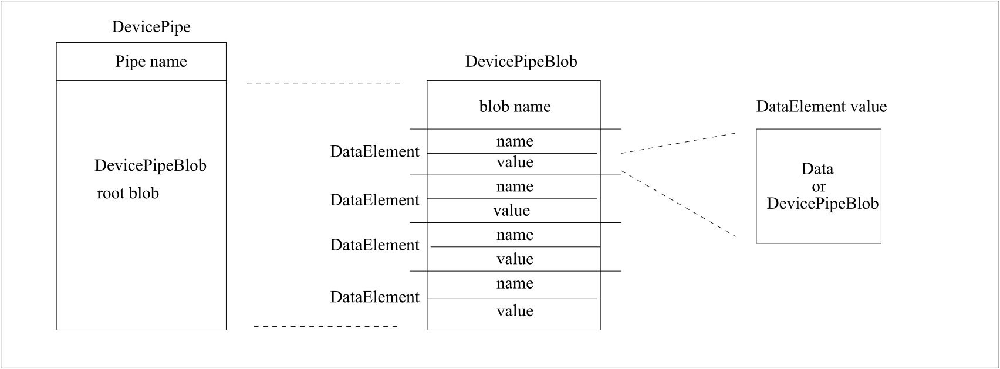

.. raw:: latex

    \clearpage

.. _cpp_client_programmers_guide:

Writing a TANGO client using TANGO C++ APIs
===========================================

Introduction
------------

TANGO devices and database are implemented using the TANGO device server
model. To access them the user has the CORBA interface e.g.
command\_inout(), write\_attributes() etc. defined by the idl file.
These methods are very low-level and assume a good working knowledge of
CORBA. In order to simplify this access, high-level api has been
implemented which hides all CORBA aspects of TANGO. In addition the api
hides details like how to connect to a device via the database, how to
reconnect after a device has been restarted, how to correctly pack and
unpack attributes and so on by implementing these in a manner
transparent to the user. The api provides a unified error handling for
all TANGO and CORBA errors. Unlike the CORBA C++ bindings the TANGO api
supports native C++ data types e.g. strings and vectors.

This chapter describes how to use these API’s. It is not a reference
guide. Reference documentation is available as Web pages in the `TANGO home page`_

.. TODO - reference to read the docs ?

Getting Started
---------------

Refer to the chapter Getting Started for an example on getting start
with the C++ or Java api.

Basic Philosophy
----------------

The basic philosophy is to have high level classes to deal with Tango
devices. To communicate with Tango device, uses the **DeviceProxy**
class. To send/receive data to/from Tango device, uses the **DeviceData,
DeviceAttribute** or **DevicePipe** classes. To communicate with a group
of devices, use the **Group** class. If you are interested only in some
attributes provided by a Tango device, uses the **AttributeProxy**
class. Even if the Tango database is implemented as any other devices
(and therefore accessible with one instance of a DeviceProxy class),
specific high level classes have been developped to query it. Uses the
**Database**, **DbDevice**, **DbClass**, **DbServer** or **DbData**
classes when interfacing the Tango database. Callback for asynchronous
requests or events are implemented via a **CallBack** class. An utility
class called **ApiUtil** is also available.

Data types
----------

The definition of the basic data type you can transfert using Tango is:

.. csv-table::
   :header-rows: 1

   "Tango type name", "C++ equivalent type"
   "DevBoolean", "``boolean``"
   "DevShort", "``short``"
   "DevEnum", "enumeration (only for attribute / See chapter on advanced
   features)"
   "DevLong", "``int`` (always 32 bits data)"
   "DevLong64", "``long long`` on 32 bits chip or ``long`` on 64 bits chip
   (always 64 bits data)"
   "DevFloat", "``float``"
   "DevDouble", "``double``"
   "DevString", "``char \*``"
   "DevEncoded", "``structure`` with 2 fields: a string and an array of unsigned char"
   "DevUChar", "``unsigned char``"
   "DevUShort", "``unsigned short``"
   "DevULong", "``unsigned int`` (always 32 bits data)"
   "DevULong64", "``unsigned long long`` on 32 bits chip or ``unsigned long`` on 64
   bits chip (always 64 bits data)"
   "DevState", "Tango specific data type"

Using commands, you are able to transfert all these data types, array of
these basic types and two other Tango specific data types called
DevVarLongStringArray and DevVarDoubleStringArray. See chapter [Data
exchange] to get details about them. You are also able to create
attributes using any of these basic data types to transfer data between
clients and servers.

Request model
-------------

For the most important API remote calls (command\_inout,
read\_attribute(s) and write\_attribute(s)), Tango supports two kind of
requests which are the synchronous model and the asynchronous model.
Synchronous model means that the client wait (and is blocked) for the
server to send an answer. Asynchronous model means that the client does
not wait for the server to send an answer. The client sends the request
and immediately returns allowing the CPU to do anything else (like
updating a graphical user interface). Device pipe supports only the
synchronous model. Within Tango, there are two ways to retrieve the
server answer when using asynchronous model. They are:

#. The polling mode

#. The callback mode

In polling mode, the client executes a specific call to check if the
answer is arrived. If this is not the case, an exception is thrown. If
the reply is there, it is returned to the caller and if the reply was an
exception, it is re-thrown. There are two calls to check if the reply is
arrived:

-  Call which does not wait before the server answer is returned to the
   caller.

-  Call which wait with timeout before returning the server answer to
   the caller (or throw the exception) if the answer is not arrived.

In callback model, the caller must supply a callback method which will
be executed when the command returns. They are two sub-modes:

#. The pull callback mode

#. The push callback mode

In the pull callback mode, the callback is triggered if the server
answer is arrived when the client decide it by calling a
*synchronization* method (The client pull-out the answer). In push mode,
the callback is executed as soon as the reply arrives in a separate
thread (The server pushes the answer to the client).

Synchronous model
~~~~~~~~~~~~~~~~~

Synchronous access to Tango device are provided using the *DeviceProxy*
or *AttributeProxy* class. For the *DeviceProxy* class, the main
synchronous call methods are :

-  *command\_inout()* to execute a Tango device command

-  *read\_attribute()* or *read\_attributes()* to read a Tango device
   attribute(s)

-  *write\_attribute()* or *write\_attributes()* to write a Tango device
   attribute(s)

-  *write\_read\_attribute()* or *write\_read\_attributes()* to write
   then read Tango device attribute(s)

-  *read\_pipe()* to read a Tango device pipe

-  *write\_pipe()* to write a Tango device pipe

-  *write\_read\_pipe()* to write then read Tango device pipe

For commands, data are send/received to/from device using the
*DeviceData* class. For attributes, data are send/received to/from
device attribute using the *DeviceAttribute* class. For pipes, data are
send/receive to/from device pipe using the *DevicePipe* and
*DevicePipeBlob* classes.

In some cases, only attributes provided by a Tango device are
interesting for the application. You can use the *AttributeProxy* class.
Its main synchronous methods are :

-  *read()* to read the attribute value

-  *write()* to write the attribute value

-  *write\_read()* to write then read the attribute value

Data are transmitted using the *DeviceAttribute* class.

Asynchronous model
~~~~~~~~~~~~~~~~~~

Asynchronous access to Tango device are provided using *DeviceProxy* or
*AttributeProxy, CallBack* and *ApiUtil* classes methods. The main
asynchronous call methods and used classes are :

-  To execute a command on a device

   -  *DeviceProxy::command\_inout\_asynch()* and
      *DeviceProxy::command\_inout\_reply()* in polling model.

   -  *DeviceProxy::command\_inout\_asynch()*,
      *DeviceProxy::get\_asynch\_replies()* and *CallBack* class in
      callback pull model

   -  *DeviceProxy::command\_inout\_asynch()*,
      *ApiUtil::set\_asynch\_cb\_sub\_model()* and *CallBack* class in
      callback push model

-  To read a device attribute

   -  *DeviceProxy::read\_attribute\_asynch()* and
      *DeviceProxy::read\_attribute\_reply()* in polling model

   -  *DeviceProxy::read\_attribute\_asynch()*,
      *DeviceProxy::get\_asynch\_replies()* and *CallBack* class in
      callback pull model.

   -  *DeviceProxy::read\_attribute\_asynch()*,
      *ApiUtil::set\_asynch\_cb\_sub\_model()* and *CallBack* class in
      callback push model

-  To write a device attribute

   -  *DeviceProxy::write\_attribute\_asynch()* in polling model

   -  *DeviceProxy::write\_attribute\_asynch()* and *CallBack* class in
      callback pull model

   -  *DeviceProxy::write\_attribute\_asynch()*,
      *ApiUtil::set\_asynch\_cb\_sub\_model()* and *CallBack* class in
      callback push model

For commands, data are send/received to/from device using the
*DeviceData* class. For attributes, data are send/received to/from
device attribute using the *DeviceAttribute* class. It is also possible
to generate asynchronous request(s) using the *AttributeProxy* class
following the same schema than above. Methods to use are :

-  *read\_asynch(*) and *read\_reply()* to asynchronously read the
   attribute value

-  *write\_asynch()* and *write\_reply()* to asynchronously write the
   attribute value

.. _events_tangoclient:

Events
------

Introduction
~~~~~~~~~~~~

Events are a critical part of any distributed control system. Their aim
is to provide a communication mechanism which is fast and efficient.

The standard CORBA communication paradigm is a synchronous or
asynchronous two-way call. In this paradigm the call is initiated by the
client who contacts the server. The server handles the client’s request
and sends the answer to the client or throws an exception which the
client catches. This paradigm involves two calls to receive a single
answer and requires the client to be active in initiating the request.
If the client has a permanent interest in a value he is obliged to poll
the server for an update in a value every time. This is not efficient in
terms of network bandwidth nor in terms of client programming.

For clients who are permanently interested in values the event-driven
communication paradigm is a more efficient and natural way of
programming. In this paradigm the client registers her interest once in
an event (value). After that the server informs the client every time
the event has occurred. This paradigm avoids the client polling, frees
it for doing other things, is fast and makes efficient use of the
network.

The rest of this chapter explains how the TANGO events are implemented
and the application programmer’s interface.

Event definition
~~~~~~~~~~~~~~~~

TANGO events represent an alternative channel for reading TANGO device
attributes. Device attributes values are sent to all subscribed clients
when an event occurs. Events can be an attribute value change, a change
in the data quality or a periodically send event. The clients continue
receiving events as long as they stay subscribed. Most of the time, the
device server polling thread detects the event and then pushes the
device attribute value to all clients. Nevertheless, in some cases, the
delay introduced by the polling thread in the event propagation is
detrimental. For such cases, some API calls directly push the event.
Until TANGO release 8, the omniNotify implementation of the CORBA
Notification service was used to dispatch events. Starting with TANGO 8,
this CORBA Notification service has been replaced by the ZMQ library
which implements a Publish/Subscribe communication model well adapted to
TANGO events communication.

Event types
~~~~~~~~~~~

The following eight event types have been implemented in TANGO :

#. **change** - an event is triggered and the attribute value is sent
   when the attribute value changes significantly. The exact meaning of
   significant is device attribute dependent. For analog and digital
   values this is a delta fixed per attribute, for string values this is
   any non-zero change i.e. if the new attribute value is not equal to
   the previous attribute value. The delta can either be specified as a
   relative or absolute change. The delta is the same for all clients
   unless a filter is specified (see below). To easily write
   applications using the change event, it is also triggered in the
   following case :

   #. When a spectrum or image attribute size changes.

   #. At event subscription time

   #. When the polling thread receives an exception during attribute
      reading

   #. When the polling thread detects that the attribute quality factor
      has changed.

   #. The first good reading of the attribute after the polling thread
      has received exception when trying to read the attribute

   #. The first time the polling thread detects that the attribute
      quality factor has changed from INVALID to something else

   #. When a change event is pushed manually from the device server
      code. (*DeviceImpl::push\_change\_event()*).

   #. By the methods Attribute::set\_quality() and
      Attribute::set\_value\_date\_quality() if a client has subscribed
      to the change event on the attribute. This has been implemented
      for cases where the delay introduced by the polling thread in the
      event propagation is not authorized.

#. **periodic** - an event is sent at a fixed periodic interval. The
   frequency of this event is determined by the *event\_period* property
   of the attribute and the polling frequency. The polling frequency
   determines the highest frequency at which the attribute is read. The
   event\_period determines the highest frequency at which the periodic
   event is sent. Note if the event\_period is not an integral number of
   the polling period there will be a beating of the two
   frequencies [1]_. Clients can reduce the frequency at which they
   receive periodic events by specifying a filter on the periodic event
   counter.

#. **archive** - an event is sent if one of the archiving conditions is
   satisfied. Archiving conditions are defined via properties in the
   database. These can be a mixture of delta\_change and periodic.
   Archive events can be send from the polling thread or can be manually
   pushed from the device server code
   (*DeviceImpl::push\_archive\_event()*).

#. **attribute configuration** - an event is sent if the attribute
   configuration is changed.

#. **data ready** - This event is sent when coded by the device server
   programmer who uses a specific method of one of the Tango device
   server class to fire the event
   (*DeviceImpl::push\_data\_ready\_event()*). The rule of this event is
   to inform a client that it is now possible to read an attribute. This
   could be useful in case of attribute with many data.

#. **user** - The criteria and configuration of these user events are
   managed by the device server programmer who uses a specific method of
   one of the Tango device server class to fire the event
   (*DeviceImpl::push\_event()*).

#. **device interface change** - This event is sent when the device
   interface changes. Using Tango, it is possible to dynamically
   add/remove attribute/command to a device. This event is the way to
   inform client(s) that attribute/command has been added/removed from a
   device. Note that this type of event is attached to a device and not
   to one attribute (like all other event types). This event is
   triggered in the following case :

   #. A dynamic attribute or command is added or removed. The event is
      sent after a small delay (50 mS) in order to eliminate the risk of
      events storm in case several attributes/commands are added/removed
      in a loop

   #. At the end of admin device RestartServer or DevRestart command

   #. After a re-connection due to a device server restart. Because the
      device interface is not memorized, the event is sent even if it is
      highly possible that the device interface has not changed. A flag
      in the data propagated with the event inform listening
      applications that the device interface change is not guaranteed.

   #. At event re-connection time. This case is similar to the previous
      one (device interface change not guaranteed)

#. **pipe** - This is the kind of event which has to be used when the
   user want to push data through a pipe. This kind of event is only
   sent by the user code by using a specific method
   (*DeviceImpl::push\_pipe\_event()*). There is no way to ask the Tango
   kernel to automatically push this kind of event.

The first three above events are automatically generated by the TANGO
library or fired by the user code. Events number 4 and 7 are only
automatically sent by the library and events 5, 6 and 8 are fired only
by the user code.

Event filtering (Removed in Tango release 8 and above)
~~~~~~~~~~~~~~~~~~~~~~~~~~~~~~~~~~~~~~~~~~~~~~~~~~~~~~

Please, note that this feature is available only for Tango releases
older than Tango 8. The CORBA Notification Service allows event
filtering. This means that a client can ask the Notification Service to
send the event only if some filter is evaluated to true. Within the
Tango control system, some pre-defined fields can be used as filter.
These fields depend on the event type.

+------------+-----------------------+-----------------------------------------+--------+
| Event type | Filterable field name | Filterable field value                  | type   |
+============+=======================+=========================================+========+
| change     | delta\_change\_rel    | Relative change (in %)                  | double |
|            |                       | since last even                         |        |
|            +-----------------------+-----------------------------------------+--------+
|            | delta\_change\_abs    | Absolute change since                   |        |
|            |                       | last event                              | double |
|            +-----------------------+-----------------------------------------+--------+
|            | quality               | Is set to 1 when the attribute quality  | double |
|            |                       | factor has changed, otherwise it is 0   |        |
|            +-----------------------+-----------------------------------------+--------+
|            | forced\_event         | Is set to 1 when the event was fired    | double |
|            |                       | on exception or a quality factor set    |        |
|            |                       | to invalid                              |        |
+------------+-----------------------+-----------------------------------------+--------+
| periodic   | counter               | Incremented each time the event is sent | long   |
+------------+-----------------------+-----------------------------------------+--------+
| archive    | delta\_change\_rel    | Relative change (in %) since last event | double |
|            +-----------------------+-----------------------------------------+--------+
|            | delta\_change\_abs    | Absolute change since last event        | double |
|            +-----------------------+-----------------------------------------+--------+
|            | quality               | Is set to 1 when the attribute quality  | double |
|            |                       |  factor has changed, otherwise it is 0  |        |
|            +-----------------------+-----------------------------------------+--------+
|            | counter               | Incremented each time the event is sent | long   |
|            |                       | for periodic reason. Set to -1 if event |        |
|            |                       | sent for change reason                  |        |
|            +-----------------------+-----------------------------------------+--------+
|            | forced\_event         | Is set to 1 when the event was fired on | double |
|            |                       | exception or a quality factor set to    |        |
|            |                       | invalid                                 |        |
|            +-----------------------+-----------------------------------------+--------+
|            | delta\_event          | Number of milli-seconds since previous  | double |
|            |                       | event                                   |        |
+------------+-----------------------+-----------------------------------------+--------+

Filter are defined as a string following a grammar defined by CORBA. It
is defined in [NotificationService]_. The following example shows
you the most common use of these filters in the Tango world :

-  To receive periodic event one out of every three, the filter must be

   $counter % 3 == 0

-  To receive change event only if the relative change is greater than
   % (positive and negative), the filter must be

   $delta\_change\_rel >= 20 or $delta\_change\_rel <= -20

-  To receive a change event only on quality change, the filter must be

   $quality == 1

For user events, the filter field name(s) and their value are defined by
the device server programmer.

Application Programmer’s Interface
~~~~~~~~~~~~~~~~~~~~~~~~~~~~~~~~~~

How to setup and use the TANGO events ? The interfaces described here
are intended as user friendly interfaces to the underlying CORBA calls.
The interface is modeled after the asynchronous *command\_inout()*
interface so as to maintain coherency. The event system supports **push
callback model** as well as the **pull callback model.**

The two event reception modes are:

-  **Push callback model** : On event reception a callbacks method gets
   immediately executed.

-  **Pull callback model** : The event will be buffered the client until
   the client is ready to receive the event data. The client triggers
   the execution of the callback method.

The event reception buffer in the **pull callback model**, is
implemented as a round robin buffer. The client can choose the size when
subscribing for the event. This way the client can set-up different ways
to receive events.

-  Event reception buffer size = 1 : The client is interested only in
   the value of the last event received. All other events that have been
   received since the last reading are discarded.

-  Event reception buffer size > 1 : The client has chosen to keep an
   event history of a given size. When more events arrive since the last
   reading, older events will be discarded.

-  Event reception buffer size = ALL\_EVENTS : The client buffers all
   received events. The buffer size is unlimited and only restricted by
   the available memory for the client.

Configuring events
^^^^^^^^^^^^^^^^^^

The attribute configuration set is used to configure under what
conditions events are generated. A set of standard attribute properties
(part of the standard attribute configuration) are read from the
database at device startup time and used to configure the event engine.
If there are no properties defined then default values specified in the
code are used.

change
''''''

The attribute properties and their default values for the change event
are :

#. **rel\_change** - a property of maximum 2 values. It specifies the
   positive and negative relative change of the attribute value w.r.t.
   the value of the previous change event which will trigger the event.
   If the attribute is a spectrum or an image then a change event is
   generated if any one of the attribute value’s satisfies the above
   criterium. If only one property is specified then it is used for the
   positive and negative change. If no property is specified, no events
   are generated.

#. **abs\_change** - a property of maximum 2 values.It specifies the
   positive and negative absolute change of the attribute value w.r.t
   the value of the previous change event which will trigger the event.
   If the attribute is a spectrum or an image then a change event is
   generated if any one of the attribute value’s satisfies the above
   criterium. If only one property is specified then it is used for the
   positive and negative change. If no properties are specified then the
   relative change is used.

periodic
''''''''

The attribute properties and their default values for the periodic event
are :

#. **event\_period** - the minimum time between events (in
   milliseconds). If no property is specified then a default value of 1
   second is used.

archive
'''''''

The attribute properties and their default values for the archive event
are :

#. **archive\_rel\_change** - a property of maximum 2 values which
   specifies the positive and negative relative change w.r.t. the
   previous attribute value which will trigger the event. If the
   attribute is a spectrum or an image then an archive event is
   generated if any one of the attribute value’s satisfies the above
   criterium. If only one property is specified then it is used for the
   positive and negative change. If no properties are specified then no
   events are generate.

#. **archive\_abs\_change** - a property of maximum 2 values which
   specifies the positive and negative absolute change w.r.t the
   previous attribute value which will trigger the event. If the
   attribute is a spectrum or an image then an archive event is
   generated if any one of the attribute value’s satisfies the above
   criterium. If only one property is specified then it is used for the
   positive and negative change. If no properties are specified then the
   relative change is used.

#. **archive\_period** - the minimum time between archive events (in
   milliseconds). If no property is specified, no periodic archiving
   events are send.

C++ Clients
^^^^^^^^^^^

This is the interface for clients who want to receive events. The main
action of the client is to subscribe and unsubscribe to events. Once the
client has subscribed to one or more events the events are received in a
separate thread by the client.

Two reception modes are possible:

-  On event reception a callbacks method gets immediately executed.

-  The event will be buffered until the client until the client is ready
   to receive the event data.

The mode to be used has to be chosen when subscribing for the event.

Subscribing to events
'''''''''''''''''''''

The client call to subscribe to an event is named
*DeviceProxy::subscribe\_event()* . During the event subscription the
client has to choose the event reception mode to use.

**Push model**:

.. code:: cpp
  :number-lines:

    int DeviceProxy::subscribe_event(
                 const string &attribute,
                 Tango::EventType event,
                 Tango::CallBack *callback,
                 bool stateless = false);

The client implements a callback method which is triggered when the
event is received. Note that this callback method will be executed by a
thread started by the underlying ORB. This thread is not the application
main thread. For Tango releases before 8, a similar call with one extra
parameter for event filtering is also available.

**Pull model**:

.. code:: cpp
  :number-lines:

    int DeviceProxy::subscribe_event(
                 const string &attribute,
                 Tango::EventType event,
                 int event_queue_size,
                 bool stateless = false);

The client chooses the size of the round robin event reception buffer.
Arriving events will be buffered until the client uses
*DeviceProxy::get\_events()* to extract the event data. For Tango
releases before 8, a similar call with one extra parameter for event
filtering is also available.

On top of the user filter defined by the *filters* parameter, basic
filtering is done based on the reason specified and the event type. For
example when reading the state and the reason specified is change the
event will be fired only when the state changes. Events consist of an
attribute name and the event reason. A standard set of reasons are
implemented by the system, additional device specific reasons can be
implemented by device servers programmers.

The stateless flag = false indicates that the event subscription will
only succeed when the given attribute is known and available in the
Tango system. Setting stateless = true will make the subscription
succeed, even if an attribute of this name was never known. The real
event subscription will happen when the given attribute will be
available in the Tango system.

Note that in this model, the callback method will be executed by the
thread doing the *DeviceProxy::get\_events()* call.

The CallBack class
''''''''''''''''''

In C++, the client has to implement a class inheriting from the Tango
CallBack class and pass this to the *DeviceProxy::subscribe\_event()*
method. The CallBack class is the same class as the one proposed for the
TANGO asynchronous call. This is as follows for events :

.. code:: cpp
  :number-lines:

    class MyCallback : public Tango::CallBack
    {
       .
       .
       .
       virtual push_event(Tango::EventData *);
       virtual push_event(Tango::AttrConfEventData *);
       virtual push_event(Tango::DataReadyEventData *);
       virtual push_event(Tango::DevIntrChangeEventData *);
       virtual push_event(Tango::PipeEventData *);
    }

where EventData is defined as follows :

.. code:: cpp
  :number-lines:

    class EventData
    {
       DeviceProxy       *device;
       string            attr_name;
       string            event;
       DeviceAttribute   *attr_value;
       bool              err;
       DevErrorList      errors;
    }

AttrConfEventData is defined as follows :

.. code:: cpp
  :number-lines:

    class AttrConfEventData
    {
       DeviceProxy       *device;
       string            attr_name;
       string            event;
       AttributeInfoEx   *attr_conf;
       bool              err;
       DevErrorList      errors;
    }

DataReadyEventData is defined as follows :

.. code:: cpp
  :number-lines:

    class DataReadyEventData
    {
       DeviceProxy       *device;
       string            attr_name;
       string            event;
       int               attr_data_type;
       int               ctr;
       bool              err;
       DevErrorList      errors;
    }

DevIntrChangeEventData is defined as follows :

.. code:: cpp
  :number-lines:

    class DevIntrChangeEventData
    {
       DeviceProxy            device;
       string                 event;
       string                 device_name;
       CommandInfoList        cmd_list;
       AttributeInfoListEx    att_list;
       bool                   dev_started;
       bool                   err;
       DevErrorList           errors;
    }

and PipeEventData is defined as follows :

.. code:: cpp
  :number-lines:

    class PipeEventData
    {
       DeviceProxy       *device;
       string            pipe_name;
       string            event;
       DevicePipe        *pipe_value;
       bool              err;
       DevErrorList      errors;
    }

In push model, there are some cases (same callback used for events
coming from different devices hosted in device server process running on
different hosts) where the callback method could be executed concurently
by different threads started by the ORB. The user has to code his
callback method in a **thread** **safe** manner.

Unsubscribing from an event
''''''''''''''''''''''''''''

Unsubscribe a client from receiving the event specified by *event\_id*
is done by calling the *DeviceProxy::unsubscribe\_event()* method :

.. code:: cpp
  :number-lines:

    void DeviceProxy::unsubscribe_event(int event_id);

Extract buffered event data
'''''''''''''''''''''''''''

When the pull model was chosen during the event subscription, the
received event data can be extracted with *DeviceProxy::get\_events().*
Two possibilities are available for data extraction. Either a callback
method can be executed for every event in the buffer when using

.. code:: cpp
  :number-lines:

    int DeviceProxy::get_events(
                 int event_id,
                 CallBack *cb);

Or all the event data can be directly extracted as EventDataList,
AttrConfEventDataList , DataReadyEventDataList,
DevIntrChangeEventDataList or PipeEventDataList when using

.. code:: cpp
  :number-lines:

    int DeviceProxy::get_events(
                 int event_id,
                 EventDataList &event_list);

    int DeviceProxy::get_events(
                 int event_id,
                 AttrConfEventDataList &event_list);

    int DeviceProxy::get_events(
                 int event_id,
                 DataReadyEventDataList &event_list);

    int DeviceProxy::get_events(
                 int event_id,
                 DevIntrChangeEventDataList &event_list);

    int DeviceProxy::get_events(
                 int event_id,
                 PipeEventDataList &event_list);

The event data lists are vectors of EventData, AttrConfEventData,
DataReadyEventData or PipeEventData pointers with special destructor and
clean-up methods to ease the memory handling.

.. code:: cpp
  :number-lines:

    class EventDataList:public vector<EventData *>
    class AttrConfEventDataList:public vector<AttrConfEventData *>
    class DataReadyEventDataList:public vector<DataReadyEventData *>
    class DevIntrChangeEventDataList:public vector<DevIntrChangeEventData *>
    class PipeEventDataList:public vector<PipeEventData *>

Example
'''''''

Here is a typical code example of a client to register and receive
events. First, you have to define a callback method as follows:

.. code:: cpp
  :number-lines:

    class DoubleEventCallBack : public Tango::CallBack
    {
       void push_event(Tango::EventData*);
    };

    void DoubleEventCallBack::push_event(Tango::EventData *myevent)
    {
        Tango::DevVarDoubleArray *double_value;
        try
        {
            cout << "DoubleEventCallBack::push_event(): called attribute "
                 << myevent->attr_name
                 << " event "
                 << myevent->event
                 << " (err="
                 << myevent->err
                 << ")" << endl;

             if (!myevent->err)
             {
                 *(myevent->attr_value) >> double_value;
                 cout << "double value "
                      << (*double_value)[0]
                      << endl;
                 delete double_value;
             }
        }
        catch (...)
        {
             cout << "DoubleEventCallBack::push_event(): could not extract data !\n";
        }
    }

Then the main code must subscribe to the event and choose the push or
the pull model for event reception.

**Push model**:

.. code:: cpp
  :number-lines:

    DoubleEventCallBack *double_callback = new DoubleEventCallBack;

    Tango::DeviceProxy *mydevice = new Tango::DeviceProxy("my/device/1");

    int event_id;
    const string attr_name("current");
    event_id = mydevice->subscribe_event(attr_name,
                             Tango::CHANGE_EVENT,
                             double_callback);
    cout << "event_client() id = " << event_id << endl;

    // The callback methods are executed by the Tango event reception thread.
    // The main thread is not concerned of event reception.
    // Whatch out with synchronisation and data access in a multi threaded environment!

    sleep(1000); // wait for events

    mydevice->unsubscribe_event(event_id);

**Pull model**:

.. code:: cpp
  :number-lines:

    DoubleEventCallBack *double_callback = new DoubleEventCallBack;
    int event_queue_size = 100; // keep the last 100 events

    Tango::DeviceProxy *mydevice = new Tango::DeviceProxy("my/device/1");

    int event_id;
    const string attr_name("current");
    event_id = mydevice->subscribe_event(attr_name,
                             Tango::CHANGE_EVENT,
                             event_queue_size);
    cout << "event_client() id = " << event_id << endl;

    // Check every 3 seconds whether new events have arrived and trigger the callback method
    // for the new events.

    for (int i=0; i < 100; i++)
    {
        sleep (3);

        // Read the stored event data from the queue and call the callback method for every event.
        mydevice->get_events(event_id, double_callback);
    }

    event_test->unsubscribe_event(event_id);

Group
-----

A Tango Group provides the user with a single point of control for a
collection of devices. By analogy, one could see a Tango Group as a
proxy for a collection of devices. For instance, the Tango Group API
supplies a *command\_inout()* method to execute the same command on all
the elements of a group.

A Tango Group is also a hierarchical object. In other words, it is
possible to build a group of both groups and individual devices. This
feature allows creating logical views of the control system - each view
representing a hierarchical family of devices or a sub-system.

In this chapter, we will use the term *hierarchy* to refer to a group
and its sub-groups. The term *Group* designates to the local set of
devices attached to a specific Group.

Getting started with Tango group
~~~~~~~~~~~~~~~~~~~~~~~~~~~~~~~~

The quickest way of getting started is to study an example…

Imagine we are vacuum engineers who need to monitor and control hundreds
of gauges distributed over the 16 cells of a large-scale instrument.
Each cell contains several penning and pirani gauges. It also contains
one strange gauge. Our main requirement is to be able to control the
whole set of gauges, a family of gauges located into a particular cell
(e.g. all the penning gauges of the 6th cell) or a single gauge (e.g.
the strange gauge of the 7th cell). Using a Tango Group, such features
are quite straightforward to obtain.

Reading the description of the problem, the device hierarchy becomes
obvious. Our gauges group will have the following structure:

.. code:: cpp
  :number-lines:

    -> gauges
      |  -> cell-01
      |     |-> inst-c01/vac-gauge/strange
      |     |-> penning
      |     |   |-> inst-c01/vac-gauge/penning-01
      |     |   |-> inst-c01/vac-gauge/penning-02
      |     |   |- ...
      |     |   |-> inst-c01/vac-gauge/penning-xx
      |     |-> pirani
      |         |-> inst-c01/vac-gauge/pirani-01
      |         |-> ...
      |         |-> inst-c01/vac-gauge/pirani-xx
      |  -> cell-02
      |     |-> inst-c02/vac-gauge/strange
      |     |-> penning
      |     |   |-> inst-c02/vac-gauge/penning-01
      |     |   |-> ...
      |     |
      |     |-> pirani
      |     |   |-> ...
      |  -> cell-03
      |     |-> ...
      |         | -> ...

In the C++, such a hierarchy can be build as follows (basic version):

.. code:: cpp
  :number-lines:

    //- step0: create the root group
    Tango::Group *gauges = new Tango::Group("gauges");

    //- step1: create a group for the n-th cell
    Tango::Group *cell = new Tango::Group("cell-01");

    //- step2: make the cell a sub-group of the root group
    gauges->add(cell);

    //- step3: create a "penning" group
    Tango::Group *gauge_family = new Tango::Group("penning");

    //- step4: add all penning gauges located into the cell (note the wildcard)
    gauge_family->add("inst-c01/vac-gauge/penning*");

    //- step5: add the penning gauges to the cell
    cell->add(gauge_family);

    //- step6: create a "pirani" group
    gauge_family = new Tango::Group("pirani");

    //- step7: add all pirani gauges located into the cell (note the wildcard)
    gauge_family->add("inst-c01/vac-gauge/pirani*");

    //- step8: add the pirani gauges to the cell
    cell->add(gauge_family);

    //- step9: add the "strange" gauge to the cell
    cell->add("inst-c01/vac-gauge/strange");

    //- repeat step 1 to 9 for the remaining cells
    cell = new Tango::Group("cell-02");
    ...

**Important note**: There is no particular order to create the
hierarchy. However, the insertion order of the devices is conserved
throughout the lifecycle of the Group and cannot be changed. That way,
the Group implementation can guarantee the order in which results are
returned (see below).

Keeping a reference to the root group is enough to manage the whole
hierarchy (i.e. there no need to keep trace of the sub-groups or
individual devices). The Group interface provides methods to retrieve a
sub-group or an individual device.

Be aware that a C++ group allways gets the ownership of its children and
deletes them when it is itself deleted. Therefore, never try to delete a
Group (respectively a DeviceProxy) returned by a call to
*Tango::Group::get\_group()* (respectively to
*Tango::Group::get\_device()*). Use the *Tango::Group::remove()* method
instead (see the Tango Group class API documentation for details).

We can now perform any action on any element of our gauges group. For
instance, let’s ping the whole hierarchy to be sure that all devices are
alive.

.. code:: cpp
  :number-lines:

    //- ping the whole hierarchy
    if (gauges->ping() == true)
    {
        std::cout << "all devices alive" << std::endl;
    }
    else
    {
        std::cout << "at least one dead/busy/locked/... device" << std::endl;
    }

Forward or not forward?
~~~~~~~~~~~~~~~~~~~~~~~

Since a Tango Group is a hierarchical object, any action performed on a
group can be forwarded to its sub-groups. Most of the methods in the
Group interface have a so-called *forward* option controlling this
propagation. When set to *false*, the action is only performed on the
local set of devices. Otherwise, the action is also forwarded to the
sub-groups, in other words, propagated along the hierarchy. In C++ , the
forward option defaults to true (thanks to the C++ default argument
value). There is no such mechanism in Java and the forward option must
be systematically specified.

Executing a command
~~~~~~~~~~~~~~~~~~~

As a proxy for a collection of devices, the Tango Group provides an
interface similar to the DeviceProxy’s. For the execution of a command,
the Group interface contains several implementations of the
*command\_inout* method. Both synchronous and asynchronous forms are
supported.

Obtaining command results
^^^^^^^^^^^^^^^^^^^^^^^^^

Command results are returned using a Tango::GroupCmdReplyList. This is
nothing but a vector containing a Tango::GroupCmdReply for each device
in the group. The Tango::GroupCmdReply contains the actual data (i.e.
the Tango::DeviceData). By inheritance, it may also contain any error
occurred during the execution of the command (in which case the data is
invalid).

We previously indicated that the Tango Group implementation guarantees
that the command results are returned in the order in which its elements
were attached to the group. For instance, if g1 is a group containing
three devices attached in the following order:

.. code:: cpp
  :number-lines:

    g1->add("my/device/01");
    g1->add("my/device/03");
    g1->add("my/device/02");

the results of

.. code:: cpp
  :number-lines:

    Tango::GroupCmdReplyList crl = g1->command_inout("Status");

will be organized as follows:

| *crl[0]* contains the status of my/device/01
| *crl[1]* contains the status of my/device/03
| *crl[2]* contains the status of my/device/02

Things get more complicated if sub-groups are added between devices.

.. code:: cpp
  :number-lines:

    g2->add("my/device/04");
    g2->add("my/device/05");

    g4->add("my/device/08");
    g4->add("my/device/09");

    g3->add("my/device/06");
    g3->add(g4);
    g3->add("my/device/07");

    g1->add("my/device/01");
    g1->add(g2);
    g1->add("my/device/03");
    g1->add(g3);
    g1->add("my/device/02");

The result order in the Tango::GroupCmdReplyList depends on the value of
the forward option. If set to *true*, the results will be organized as
follows:

.. code:: cpp
  :number-lines:

    Tango::GroupCmdReplyList crl = g1->command_inout("Status", true);

| *crl[0]* contains the status of my/device/01 which belongs to g1
| *crl[1]* contains the status of my/device/04 which belongs to g1.g2
| *crl[2]* contains the status of my/device/05 which belongs to g1.g2
| *crl[3]* contains the status of my/device/03 which belongs to g1
| *crl[4]* contains the status of my/device/06 which belongs to g1.g3
| *crl[5]* contains the status of my/device/08 which belongs to g1.g3.g4
| *crl[6]* contains the status of my/device/09 which belongs to g1.g3.g
| *crl[7]* contains the status of my/device/07 which belongs to g1.g3
| *crl[8]* contains the status of my/device/02 which belongs to g1

If the forward option is set to *false*, the results are:

.. code:: cpp
  :number-lines:

    Tango::GroupCmdReplyList crl = g1->command_inout("Status", false);

| *crl[0]* contains the status of my/device/01 which belongs to g
| *crl[1]* contains the status of my/device/03 which belongs to g1
| *crl[2]* contains the status of my/device/02 which belongs to g1

The Tango::GroupCmdReply contains some public members allowing the
identification of both the device (Tango::GroupCmdReply::dev\_name) and
the command (Tango::GroupCmdReply::obj\_name). It means that, depending
of your application, you can associate a response with its source using
its position in the response list or using the
Tango::GroupCmdReply::dev\_name member.

.. Case1:

Case 1: a command, no argument
^^^^^^^^^^^^^^^^^^^^^^^^^^^^^^

As an example, we execute the Status command on the whole hierarchy
synchronously.

.. code:: cpp
  :number-lines:

    Tango::GroupCmdReplyList crl = gauges->command_inout("Status");

As a first step in the results processing, it could be interesting to
check value returned by the *has\_failed()* method of the
GroupCmdReplyList. If it is set to true, it means that at least one
error occurred during the execution of the command (i.e. at least one
device gave error).

.. code:: cpp
  :number-lines:

    if (crl.has_failed())
    {
        cout << "at least one error occurred" << endl;
    }
    else
    {
        cout << "no error " << endl;
    }

Now, we have to process each individual response in the list.

A few words on error handling and data extraction
^^^^^^^^^^^^^^^^^^^^^^^^^^^^^^^^^^^^^^^^^^^^^^^^^

Depending of the application and/or the developer’s programming habits,
each individual error can be handle by the C++ (or Java) exception
mechanism or using the dedicated *has\_failed()* method. The GroupReply
class - which is the mother class of both GroupCmdReply and
GroupAttrReply - contains a static method to enable (or disable)
exceptions called *enable\_exception()*. By default, exceptions are
disabled. The following example is proposed with both exceptions enable
and disable.

In C++, data can be extracted directly from an individual reply. The
GroupCmdReply interface contains a template operator >> allowing the
extraction of any supported Tango type (in fact the actual data
extraction is delegated to DeviceData::operator >>). One dedicated
extract method is also provided in order to extract
DevVarLongStringArray and DevVarDoubleStringArray types to std::vectors.

Error and data handling C++ example:

.. code:: cpp
  :number-lines:

    //-------------------------------------------------------
    //- synch. group command example with exception enabled
    //-------------------------------------------------------
    //- enable exceptions and save current mode
    bool last_mode = GroupReply::enable_exception(true);
    //- process each response in the list ...
    for (int r = 0; r < crl.size(); r++)
    {
    //- enter a try/catch block
       try
       {
    //- try to extract the data from the r-th reply
    //- suppose data contains a double
           double ans;
           crl[r] >> ans;
           cout << crl[r].dev_name()
                << "::"
                << crl[r].obj_name()
                << " returned "
                << ans
                << endl;
        }
        catch (const DevFailed& df)
        {
    //- DevFailed caught while trying to extract the data from reply
          for (int err = 0; err < df.errors.length(); err++)
          {
               cout << "error: " << df.errors[err].desc.in() << endl;
          }
    //- alternatively, one can use crl[r].get_err_stack() see below
        }
        catch (...)
        {
           cout << "unknown exception caught";
        }
    }
    //- restore last exception mode (if needed)
    GroupReply::enable_exception(last_mode);
    //- Clear the response list (if reused later in the code)
    crl.reset();

    //-------------------------------------------------------
    //- synch. group command example with exception disabled
    //-------------------------------------------------------
    //- disable exceptions and save current mode bool
    last_mode = GroupReply::enable_exception(false);
    //- process each response in the list ...
    for (int r = 0; r < crl.size(); r++)
    {
    //- did the r-th device give error?
        if (crl[r].has_failed() == true)
        {
    //- printout error description
           cout << "an error occurred while executing "
                << crl[r].obj_name()
                << " on "
                << crl[r].dev_name() << endl;
    //- dump error stack
           const DevErrorList& el = crl[r].get_err_stack();
           for (int err = 0; err < el.size(); err++)
           {
               cout << el[err].desc.in();
           }
        }
        else
        {
    //- no error (suppose data contains a double)
           double ans;
           bool result = crl[r] >> ans;
           if (result == false)
           {
               cout << "could not extract double from "
                    << crl[r].dev_name()
                    << " reply"
                    << endl;
           }
           else
           {
               cout << crl[r].dev_name()
                    << "::"
                    << crl[r].obj_name()
                    << " returned "
                    << ans
                    << endl;
           }
        }
    }
    //- restore last exception mode (if needed)
    GroupReply::enable_exception(last_mode);
    //- Clear the response list (if reused later in the code)
    crl.reset();

Now execute the same command asynchronously. C++ example:

.. code:: cpp
  :number-lines:

    //-------------------------------------------------------
    //- asynch. group command example (C++ example)
    //-------------------------------------------------------
    long request_id = gauges->command_inout_asynch("Status");
    //- do some work
    do_some_work();

    //- get results
    crl = gauges->command_inout_reply(request_id);
    //- process responses as previously describe in the synch. implementation
    for (int r = 0; r < crl.size(); r++)
    {
    //- data processing and error handling goes here
    //- copy/paste code from previous example
    . . .
    }
    //- clear the response list (if reused later in the code)
    crl.reset();

.. Case2:

Case 2: a command, one argument
^^^^^^^^^^^^^^^^^^^^^^^^^^^^^^^

Here, we give an example in which the same input argument is applied to
all devices in the group (or its sub-groups).

In C++:

.. code:: cpp
  :number-lines:

    //- the argument value
    double d = 0.1;
    //- insert it into the TANGO generic container for command: DeviceData
    Tango::DeviceData dd;
    dd << d;
    //- execute the command: Dev_Void SetDummyFactor (Dev_Double)
    Tango::GroupCmdReplyList crl = gauges->command_inout("SetDummyFactor", dd);

Since the SetDummyFactor command does not return any value, the
individual replies (i.e. the GroupCmdReply) do not contain any data.
However, we have to check their *has\_failed()* method returned value to
be sure that the command completed successfully on each device
(acknowledgement). Note that in such a case, exceptions are useless
since we never try to extract data from the replies.

In C++ we should have something like:

.. code:: cpp
  :number-lines:

    //- no need to process the results if no error occurred (Dev_Void command)
    if (crl.has_failed())
    {
    //- at least one error occurred
        for (int r = 0; r < crl.size(); r++)
        {
    //- handle errors here (see previous C++ examples)
        }
    }
    //- clear the response list (if reused later in the code)
    crl.reset();

See case 1 for an example of asynchronous command.

Case 3: a command, several arguments
^^^^^^^^^^^^^^^^^^^^^^^^^^^^^^^^^^^^

Here, we give an example in which a **specific** input argument is
applied to each device in the hierarchy. In order to use this form of
command\_inout, the user must have an a priori and perfect knowledge of
the devices order in the hierarchy. In such a case, command arguments
are passed in an array (with one entry for each device in the
hierarchy).

The C++ implementation provides a template method which accepts a
std::vector of C++ type for command argument. This allows passing any
kind of data using a single method.

The size of this vector must equal the number of device in the hierarchy
(respectively the number of device in the group) if the forward option
is set to true (respectively set to false). Otherwise, an exception is
thrown.

The first item in the vector is applied to the first device in the
hierarchy, the second to the second device in the hierarchy, and so
on…That’s why the user must have a perfect knowledge of the devices
order in the hierarchy.

Assuming that gauges are ordered by name, the SetDummyFactor command can
be executed on group cell-01 (and its sub-groups) as follows:

Remember, cell-01 has the following internal structure:

.. code:: cpp
  :number-lines:

    -> gauges
       | -> cell-01
       |    |-> inst-c01/vac-gauge/strange
       |    |-> penning
       |    |   |-> inst-c01/vac-gauge/penning-01
       |    |   |-> inst-c01/vac-gauge/penning-02
       |    |   |-> ...
       |    |   |-> inst-c01/vac-gauge/penning-xx
       |    |-> pirani
       |        |-> inst-c01/vac-gauge/pirani-01
       |        |-> ...
       |        |-> inst-c01/vac-gauge/pirani-xx

Passing a specific argument to each device in C++:

.. code:: cpp
  :number-lines:

    //- get a reference to the target group
    Tango::Group *g = gauges->get_group("cell-01");
    //- get number of device in the hierarchy (starting at cell-01)
    long n_dev = g->get_size(true);
    //- Build argin list
    std::vector<double> argins(n_dev);
    //- argument for inst-c01/vac-gauge/strange
    argins[0] = 0.0;
    //- argument for inst-c01/vac-gauge/penning-01
    argins[1] = 0.1;
    //- argument for inst-c01/vac-gauge/penning-02
    argins[2] = 0.2;
    //- argument for remaining devices in cell-01.penning
    . . .
    //- argument for devices in cell-01.pirani
    . . .
    //- the reply list
    Tango::GroupCmdReplyList crl;
    //- enter a try/catch block (see below)
    try
    {
    //- execute the command
        crl = g->command_inout("SetDummyFactor", argins, true);
        if (crl.has_failed())
        {
    //- error handling goes here (see case 1)
        }
    }
    catch (const DevFailed& df)
    {
    //- see below
    }
    crl.reset();

If we want to execute the command locally on cell-01 (i.e. not on its
sub-groups), we should write the following C++ code:

.. code:: cpp
  :number-lines:

    //- get a reference to the target group
    Tango::Group *g = gauges->get_group("cell-01");
    //- get number of device in the group (starting at cell-01)
    long n_dev = g->get_size(false);
    //- Build argin list
    std::vector<double> argins(n_dev);
    //- argins for inst-c01/vac-gauge/penning-01
    argins[0] = 0.1;
    //- argins for inst-c01/vac-gauge/penning-02
    argins[1] = 0.2;
    //- argins for remaining devices in cell-01.penning
    . . .
    //- the reply list
    Tango::GroupCmdReplyList crl;
    //- enter a try/catch block (see below)
    try
    {
    //- execute the command
        crl = g->command_inout("SetDummyFactor", argins, false);
        if (crl.has_failed())
        {
    //- error handling goes here (see case 1)
        }
    }
    catch (const DevFailed& df)
    {
    //- see below
    }
    crl.reset();

Note: if we want to execute the command locally on cell-01 (i.e. not on
its sub-groups), we should write the following code:

.. code:: cpp
  :number-lines:

    //- get a reference to the target group
    Group g = gauges.get_group("cell-01");
    //- get pre-build arguments list for the group (starting@cell-01)
    DeviceData[] argins = g.get_command_specific_argument_list(false);
    //- argins for inst-c01/vac-gauge/penning-01
    argins[0].insert(0.1);
    //- argins for inst-c01/vac-gauge/penning-02
    argins[1].insert(0.2);
    //- argins for remaining devices in cell-01.penning
    . . .
    //- the reply list
    GroupCmdReplyList crl;
    //- enter a try/catch block (see below)
    try
    {
    //- execute the command
        crl = g.command_inout("SetDummyFactor", argins, false, false);
        if (crl.has_failed())
        {
    //- error handling goes here (see case 1)
        }
    }
    catch (DevFailed d)
    {
    //- see below
    }

This form of *command\_inout* (the one that accepts an array of value as
its input argument), may throw an exception **before** executing the
command if the number of elements in the input array does not match the
number of individual devices in the group or in the hierarchy (depending
on the forward option).

An asynchronous version of this method is also available. See case 1 for
an example of asynchronous command.

Reading attribute(s)
~~~~~~~~~~~~~~~~~~~~

In order to read attribute(s), the Group interface contains several
implementations of the *read\_attribute()* and *read\_attributes()*
methods. Both synchronous and asynchronous forms are supported. Reading
several attributes is very similar to reading a single attribute. Simply
replace the std::string used for attribute name by a vector of
std::string with one element for each attribute name. In case of
read\_attributes() call, the order of attribute value returned in the
GroupAttrReplyList is all attributes for first element in the group
followed by all attributes for the second group element and so on.

Obtaining attribute values
^^^^^^^^^^^^^^^^^^^^^^^^^^

Attribute values are returned using a GroupAttrReplyList. This is
nothing but an array containing a GroupAttrReply for each device in the
group. The GroupAttrReply contains the actual data (i.e. the
DeviceAttribute). By inheritance, it may also contain any error occurred
during the execution of the command (in which case the data is invalid).

Here again, the Tango Group implementation guarantees that the attribute
values are returned in the order in which its elements were attached to
the group. See Obtaining command results for details.

The GroupAttrReply contains some public methods allowing the
identification of both the device (GroupAttrReply::dev\_name) and the
attribute (GroupAttrReply::obj\_name). It means that, depending of your
application, you can associate a response with its source using its
position in the response list or using the
Tango::GroupAttrReply::dev\_name member.

A few words on error handling and data extraction
^^^^^^^^^^^^^^^^^^^^^^^^^^^^^^^^^^^^^^^^^^^^^^^^^

Here again, depending of the application and/or the developer’s
programming habits, each individual error can be handle by the C++
exception mechanism or using the dedicated *has\_failed()* method. The
GroupReply class - which is the mother class of both GroupCmdReply and
GroupAttrReply - contains a static method to enable (or disable)
exceptions called *enable\_exception()*. By default, exceptions are
disabled. The following example is proposed with both exceptions enable
and disable.

In C++, data can be extracted directly from an individual reply. The
GroupAttrReply interface contains a template operator>> allowing the
extraction of any supported Tango type (in fact the actual data
extraction is delegated to DeviceAttribute::operator>>).

Reading an attribute is very similar to executing a command.

Reading an attribute in C++:

.. code:: cpp
  :number-lines:

    //-----------------------------------------------------------------
    //- synch. read "vacuum" attribute on each device in the hierarchy
    //- with exceptions enabled - C++ example
    //-----------------------------------------------------------------
    //- enable exceptions and save current mode
    bool last_mode = GroupReply::enable_exception(true);
    //- read attribute
    Tango::GroupAttrReplyList arl = gauges->read_attribute("vacuum");
    //- for each response in the list ...
    for (int r = 0; r < arl.size(); r++)
    {
    //- enter a try/catch block
       try
       {
    //- try to extract the data from the r-th reply
    //- suppose data contains a double
          double ans;
          arl[r] >> ans;
          cout << arl[r].dev_name()
               << "::"
               << arl[r].obj_name()
               << " value is "
               << ans << endl;
       }
       catch (const DevFailed& df)
       {
    //- DevFailed caught while trying to extract the data from reply
          for (int err = 0; err < df.errors.length(); err++)
          {
             cout << "error: " << df.errors[err].desc.in() << endl;
          }
    //- alternatively, one can use arl[r].get_err_stack() see below
       }
       catch (...)
       {
          cout << "unknown exception caught";
       }
    }
    //- restore last exception mode (if needed)
    GroupReply::enable_exception(last_mode);
    //- clear the reply list (if reused later in the code)
    arl.reset();

In C++, an asynchronous version of the previous example could be:

.. code:: cpp
  :number-lines:

    //- read the attribute asynchronously
    long request_id = gauges->read_attribute_asynch("vacuum");
    //- do some work
    do_some_work();

    //- get results
    Tango::GroupAttrReplyList arl = gauges->read_attribute_reply(request_id);
    //- process replies as previously described in the synch. implementation
    for (int r = 0; r < arl.size(); r++)
    {
    //- data processing and/or error handling goes here
    ...
    }
    //- clear the reply list (if reused later in the code)
    arl.reset();

Writing an attribute
~~~~~~~~~~~~~~~~~~~~~

The Group interface contains several implementations of the
*write\_attribute()* method. Both synchronous and asynchronous forms are
supported. However, writing more than one attribute at a time is not
supported.

Obtaining acknowledgement
^^^^^^^^^^^^^^^^^^^^^^^^^

Acknowledgements are returned using a GroupReplyList. This is nothing
but an array containing a GroupReply for each device in the group. The
GroupReply may contain any error occurred during the execution of the
command. The return value of the *has\_failed()* method indicates
whether an error occurred or not. If this flag is set to true, the
*GroupReply::get\_err\_stack()* method gives error details.

Here again, the Tango Group implementation guarantees that the attribute
values are returned in the order in which its elements were attached to
the group. See Obtaining command results for details.

The GroupReply contains some public members allowing the identification
of both the device (GroupReply::dev\_name) and the attribute
(GroupReply::obj\_name). It means that, depending of your application,
you can associate a response with its source using its position in the
response list or using

.. Case2writing:

Case 1: one value for all devices
^^^^^^^^^^^^^^^^^^^^^^^^^^^^^^^^^

Here, we give an example in which the same attribute value is written on
all devices in the group (or its sub-groups). Exceptions are supposed to
be disabled.

Writing an attribute in C++:

.. code:: cpp
  :number-lines:

    //-----------------------------------------------------------------
    //- synch. write "dummy" attribute on each device in the hierarchy
    //-----------------------------------------------------------------
    //- assume each device support a "dummy" writable attribute
    //- insert the value to be written into a generic container
    Tango::DeviceAttribute value(std::string("dummy"), 3.14159);
    //- write the attribute
    Tango::GroupReplyList rl = gauges->write_attribute(value);
    //- any error?
    if (rl.has_failed() == false)
    {
        cout << "no error" << endl;
    }
    else
    {
        cout << "at least one error occurred" << endl;
    //- for each response in the list ...
        for (int r = 0; r < rl.size(); r++)
        {
    //- did the r-th device give error?
           if (rl[r].has_failed() == true)
           {
    //- printout error description
               cout << "an error occurred while reading "
                    << rl[r].obj_name()
                    << " on "
                    << rl[r].dev_name()
                    << endl;
    //- dump error stack
               const DevErrorList& el = rl[r].get_err_stack();
               for (int err = 0; err < el.size(); err++)
               {
                  cout << el[err].desc.in();
               }
            }
         }
    }
    //- clear the reply list (if reused later in the code)
    rl.reset();

Here is a C++ asynchronous version:

.. code:: cpp
  :number-lines:

    //- insert the value to be written into a generic container
    Tango::DeviceAttribute value(std::string("dummy"), 3.14159);
    //- write the attribute asynchronously
    long request_id = gauges.write_attribute_asynch(value);
    //- do some work
    do_some_work();

    //- get results
    Tango::GroupReplyList rl = gauges->write_attribute_reply(request_id);
    //- process replies as previously describe in the synch. implementation ...

Case 2: a specific value per device
^^^^^^^^^^^^^^^^^^^^^^^^^^^^^^^^^^^

Here, we give an example in which a **specific** attribute value is
applied to each device in the hierarchy. In order to use this form of
*write\_attribute()*, the user must have an a priori and perfect
knowledge of the devices order in the hierarchy.

The C++ implementation provides a template method which accepts a
std::vector of C++ type for command argument. This allows passing any
kind of data using a single method.

The size of this vector must equal the number of device in the hierarchy
(respectively the number of device in the group) if the forward option
is set to true (respectively set to false). Otherwise, an exception is
thrown.

The first item in the vector is applied to the first device in the
group, the second to the second device in the group, and so on…That’s
why the user must have a perfect knowledge of the devices order in the
group.

Assuming that gauges are ordered by name, the dummy attribute can be
written as follows on group cell-01 (and its sub-groups) as follows:

Remember, cell-01 has the following internal structure:

.. code:: cpp
  :number-lines:

    -> gauges
        | -> cell-01
        |     |-> inst-c01/vac-gauge/strange
        |     |-> penning
        |     |    |-> inst-c01/vac-gauge/penning-01
        |     |    |-> inst-c01/vac-gauge/penning-02
        |     |    |-> ...
        |     |    |-> inst-c01/vac-gauge/penning-xx
        |     |-> pirani
        |          |-> inst-c01/vac-gauge/pirani-01
        |          |-> ...
        |          |-> inst-c01/vac-gauge/pirani-xx

C++ version:

.. code:: cpp
  :number-lines:

    //- get a reference to the target group
    Tango::Group *g = gauges->get_group("cell-01");
    //- get number of device in the hierarchy (starting at cell-01)
    long n_dev = g->get_size(true);
    //- Build value list
    std::vector<double> values(n_dev);
    //- value for inst-c01/vac-gauge/strange
    values[0] = 3.14159;
    //- value for inst-c01/vac-gauge/penning-01
    values[1] = 2 * 3.14159;
    //- value for inst-c01/vac-gauge/penning-02
    values[2] = 3 * 3.14159;
    //- value for remaining devices in cell-01.penning
    . . .
    //- value for devices in cell-01.pirani
    . . .
    //- the reply list
    Tango::GroupReplyList rl;
    //- enter a try/catch block (see below)
    try
    {
    //- write the "dummy" attribute
        rl = g->write_attribute("dummy", values, true);
        if (rl.has_failed())
        {
    //- error handling (see previous cases)
        }
    }
    catch (const DevFailed& df)
    {
    //- see below
    }
    rl.reset();

Note: if we want to execute the command locally on cell-01 (i.e. not on
its sub-groups), we should write the following code

.. code:: cpp
  :number-lines:

    //- get a reference to the target group
    Tango::Group *g = gauges->get_group("cell-01");
    //- get number of device in the group
    long n_dev = g->get_size(false);
    //- Build value list
    std::vector<double> values(n_dev);
    //- value for inst-c01/vac-gauge/penning-01
    values[0] = 2 * 3.14159;
    //- value for inst-c01/vac-gauge/penning-02
    values[1] = 3 * 3.14159;
    //- value for remaining devices in cell-01.penning
    . . .
    //- the reply list
    Tango::GroupReplyList rl;
    //- enter a try/catch block (see below)
    try
    {
    //- write the "dummy" attribute
       rl = g->write_attribute("dummy", values, false);
       if (rl.has_failed())
       {
    //- error handling (see previous cases)
       }
    }
    catch (const DevFailed& df)
    {
    //- see below
    }
    rl.reset();

This form of *write\_attribute()* (the one that accepts an array of
value as its input argument), may throw an exception before executing
the command if the number of elements in the input array does not match
the number of individual devices in the group or in the hierarchy
(depending on the forward option).

An asynchronous version of this method is also available.

Reading/Writing device pipe
---------------------------

Reading or writing device pipe is made possible using DeviceProxy class
methods. To read a pipe, you have to use the method **read\_pipe()**. To
write a pipe, use the **write\_pipe()** method. A method
**write\_read\_pipe()** is also provided in case you need to write then
read a pipe in a non-interuptible way. All these calls generate
synchronous request and support only reading or writing a single pipe at
a time. Those pipe related DeviceProxy class methods (read\_pipe,
write\_pipe,...) use DevicePipe class instances. A DevicePipe instance
is nothing more than a string for the pipe name and a *DevicePipeBlob*
instance called the root blob. In a DevicePipeBlob instance, you have:

-  The blob name

-  One array of *DataElement.* Each instance of this DataElement class
   has:

   -  A name

   -  A value which can be either

      -  Scalar or array of any basic Tango type

      -  Another DevicePipeBlob

Therefore, this is a recursive data structure and you may have
DevicePipeBlob in DevicePipeBlob. There is no limit on the depth of this
recursivity even if it is not recommended to have a too large depth. The
following figure summarizes DevicePipe data structure

.. _`4.1`:

   Figure 4.1: DevicePipe data structure

Many methods to insert/extract data into/from a DevicePipe are
available. In the DevicePipe class, these methods simply forward their
action to the DevicePipe root blob. The same methods are available in
the DevicePipeBlob in case you need to use the recursivity provided by
this data structure.

Reading a pipe
~~~~~~~~~~~~~~

When you read a pipe, you have to extract data received from the pipe.
Because data transferred through a pipe can change at any moment, two
differents cases are possible:

#. The client has a prior knowledge of what should be transferred
   through the pipe

#. The client does not know at all what has been received through the
   pipe

Those two cases are detailed in the following sub-chapters.

Extracting data with pipe content prior knowledge
^^^^^^^^^^^^^^^^^^^^^^^^^^^^^^^^^^^^^^^^^^^^^^^^^

To extract data from a DevicePipe object (or from a DevicePipeBlob
object), you have to use its extraction operator >>. Let’s suppose that
we already know (prior knowledge) that the pipe contains 3 data elements
with a Tango long, an array of double and finally an array of unsigned
short. The code you need to extract these data is (Without error case
treatment detailed in a next sub-chapter)

.. code:: cpp
  :number-lines:

   DevicePipe dp = mydev.read_pipe("MyPipe");

   DevLong dl;
   vector<double> v_db;
   DevVarUShortArray *dvush = new DevVarUShortArray();

   dp >> dl >> v_db >> dvush;

   delete dvush;

The pipe is read at line 1. Pipe (or root blob) data extracttion is at
line 7. As you can see, it is just a matter of chaining extraction
operator (>>) into local data (declared line 3 to 5). In this example,
the transported array of double is extracted into a C++ vector while the
unsigned short array is extracted in a Tango sequence data type. When
you extract data into a vector, there is a unavoidable memory copy
between the DevicePipe object and the vector. When you extract data in a
Tango sequence data type, there is no memory copy but the extraction
method consumes the memory and it is therefore caller responsability to
delete the memory. This is the rule of line 9. If there is a
DevicePipeBlob inside the DevicePipe, simply extract it into one
instance of the DevicePipeBlob class.

You may notice that the pipe root blob data elements name are lost in
the previous example. The Tango API also has a DataElement class which
allows you to retrieve/set data element name. The following code is how
you can extract pipe data and retrieve data element name (same pipe then
previously)

.. code:: cpp
  :number-lines:

   DevicePipe dp = mydev.read_pipe("MyPipe");

   DataElement<DevLong> de_dl;
   DataElement<vector<double> > de_v_db;
   DataElement<DevVarUShortArray *> de_dvush(new DevVarUShortArray());

   dp >> de_dl >> de_v_db >> de_dvush;

   delete de_dvush.value;

The extraction line (number 7) is similar to the previous case but local
data are instances of DataElement class. This is template class and
instances are created at lines 4 to 6. Each DataElement instance has
only two elements which are:

#. The data element name (a C++ string): *name*

#. The data element value (One instance of the template parameter):
   *value*

Extracting data in a generic way (without prior knowledge)
^^^^^^^^^^^^^^^^^^^^^^^^^^^^^^^^^^^^^^^^^^^^^^^^^^^^^^^^^^

Due to the dynamicity of the data transferred through a pipe, the API
alows to extract data from a pipe without any prior knowledge of its
content. This is achived with methods *get\_data\_elt\_nb()*,
*get\_data\_elt\_type()*, *get\_data\_elt\_name()* and the extraction
operator >>. These methods belong to the DevicePipeBlob class but they
also exist on the DevicePipe class for its root blob. Here is one
example of how you use them:

.. code:: cpp
  :number-lines:

    DevicePipe dp = mydev.read_pipe("MyPipe");

    size_t nb_de = dp.get_data_elt_nb();
    for (size_t loop = 0;loop < nb_de;loop++)
    {
       int data_type = dp.get_data_elt_type(loop);
       string de_name = dp.get_data_elt_name(loop);
       switch(data_type)
       {
          case DEV_LONG:
          {
              DevLong lg;
              dp >> lg;
          }
          break;

          case DEVVAR_DOUBLEARRAY:
          {
              vector<double> v_db;
              dp >> v_db;
          }
          break;
          ....
      }
      ...
   }

The number of data element in the pipe root blob is retrieve at line 3.
Then a loop for each data element is coded. For each data element, its
value data type and its name are retrieved at lines 6 and 7. Then,
according to the data element value data type, the data are extracted
using the classical extraction operator (lines 13 or 20)

Error management
^^^^^^^^^^^^^^^^

By default, in case of error, the DevicePipe object throws different
kind of exceptions according to the error kind. It is possible to
disable exception throwing. If you do so, the code has to test the
DevicePipe state after extraction. The possible error cases are:

-  DevicePipe object is empty

-  Wrong data type for extraction (For instance extraction into a double
   data while the DataElement contains a string)

-  Wrong number of DataElement (Extraction code extract 5 data element
   while the pipe contains only four)

-  Mix of extraction (or insertion) method kind (classical operators <<
   or >>) and [] operator.

Methods *exceptions()* and *reset\_exceptions()* of the DevicePipe and
DevicePipeBlob classes allow the user to select which kind of error he
is interested in. For error treatment without exceptions, methods
*has\_failed()* and *state()* has to be used. See reference
documentation for details about these methods.

Writing a pipe
~~~~~~~~~~~~~~

Writing data into a DevicePipe or a DevicePipeBlob is similar to reading
data from a pipe. The main method is the insertion operator <<. Let’s
have a look at a first example if you want to write a pipe with a Tango
long, a vector of double and finally an array of unsigned short.

.. code:: cpp
  :number-lines:

    DevicePipe dp("MyPipe");

    vector<string> de_names {"FirstDE","SecondDE","ThirdDE"};
    db.set_data_elt_names(de_names);

    DevLong dl = 666;
    vector<double> v_db {1.11,2.22};
    unsigned short *array = new unsigned short [100];
    DevVarUShortArray *dvush = create_DevVarUShortArray(array,100);

   try
   {
      dp << dl << v_db << dvush;
      mydev.write_pipe(dp);
   }
   catch (DevFailed &e)
   {
      cout << "DevicePipeBlob insertion failed" << endl;
      ....
   }

Insertion into the DevicePipe is done at line 12 with the insert
operators. The main difference with extracting data from the pipe is at
line 3 and 4. When inserting data into a pipe, you need to FIRST define
its number od name of data elements. In our example, the device pipe is
initialized to carry three data element and the names of these data
elements is defined at line 4. This is a mandatory requirement. If you
don’t define data element number, exception will be thrown during the
use of insertion methods. The population of the array used for the third
pipe data element is not represented here.

It’s also possible to use DataElement class instances to set the pipe
data element. Here is the previous example modified to use DataElement
class.

.. code:: cpp
  :number-lines:

    DevicePipe dp("MyPipe");

    DataElement<DevLong> de_dl("FirstElt",666);
    vector<double>  v_db {1.11,2.22};
    DataElement<vector<double> > de_v_db("SecondElt,v_db);

    unsigned short *array = new unsigned short [100];
    DevVarUShortArray *dvush = create_DevVarUShortArray(array,100);
    DataElement<DevVarUShortArray *> de_dvush("ThirdDE",array);

   try
   {
      dp << de_dl << de_v_db << de_dvush;
      mydev.write_pipe(dp);
   }
   catch (DevFailed &e)
   {
      cout << "DevicePipeBlob insertion failed" << endl;
      ....
   }

The population of the array used for the third pipe data element is not
represented here. Finally, there is a third way to insert data into a
device pipe. You have to defined number and names of the data element
within the pipe (similar to first insertion method) but you are able to
insert data into the data element in any order using the operator
overwritten for the DevicePipe and DevicePipeBlob classes. Look at the
following example:

.. code:: cpp
  :number-lines:

    DevicePipe dp("MyPipe");

    vector<string> de_names {"FirstDE","SecondDE","ThirdDE"};
    db.set_data_elt_names(de_names);

    DevLong dl = 666;
    vector<double> v_db = {1.11,2.22};
    unsigned short *array = new unsigned short [100];
    DevVarUShortArray *dvush = create_DevVarUShortArray(array,100);

   dp["SecondDE"] << v_db;
   dp["FirstDE"] << dl;
   dp["ThirdDE"] << dvush;

Insertion into the device pipe is now done at lines 11 to 13. The
population of the array used for the third pipe data element is not
represented here. Note that the data element name is case insensitive.

Error management
^^^^^^^^^^^^^^^^

When inserting data into a DevicePipe or a DevicePipeBlob, error
management is very similar to reading data from from a DevicePipe or a
DevicePipeBlob. The difference is that there is one more case which
could trigger one exception during the insertion. This case is

-  Insertion into the DevicePipe (or DevicePipeBlob) if its data element
   number have not been set.

Device locking
--------------

Starting with Tango release 7 (and device inheriting from
Device\_4Impl), device locking is supported. For instance, this feature
could be used by an application doing a scan on a synchrotron beam line.
In such a case, you want to move an actuator then read a sensor, move
the actuator again, read the sensor...You don’t want the actuator to be
moved by another client while the application is doing the scan. If the
application doing the scan locks the actuator device, it will be sure
that this device is reserved for the application doing the scan and
other client will not be able to move it until the scan application
un-locks this actuator.

A locked device is protected against:

-  *command\_inout* call except for device state and status requested
   via command and for the set of commands defined as allowed following
   the definition of allowed command in the Tango control access schema.

-  *write\_attribute* and *write\_pipe* call

-  *write\_read\_attribute, write\_read\_attributes* and
   *write\_read\_pipe* call

-  *set\_attribute\_config* and *set\_pipe\_config* call

-  polling and logging commands related to the locked device

Other clients trying to do one of these calls on a locked device will
get a DevFailed exception. In case of application with locked device
crashed, the lock will be automatically release after a defined
interval. The API provides a set of methods for application code to
lock/unlock device. These methods are:

-  *DeviceProxy::lock()* and *DeviceProxy::unlock()* to lock/unlock
   device

-  *DeviceProxy::locking\_status()*, *DeviceProxy::is\_locked()*,
   *DeviceProxy::is\_locked\_by\_me()* and *DeviceProxy::get\_locker()*
   to get locking information

These methods are precisely described in the API reference chapters.

Reconnection and exception
--------------------------

The Tango API automatically manages re-connection between client and
server in case of communication error during a network access between a
client and a server. By default, when a communication error occurs, an
exception is returned to the caller and the connection is internally
marked as bad. On the next try to contact the device, the API will try
to re-build the network connection. With the
*set\_transparency\_reconnection()* method of the DeviceProxy class, it
is even possible not to have any exception thrown in case of
communication error. The API will try to re-build the network connection
as soon as it is detected as bad. This is the default mode. See
`Reconnection and exception`_ for more details on this subject.

Thread safety
-------------

Starting with Tango 7.2, some classes of the C++ API has been made
thread safe. These classes are:

-  DeviceProxy

-  Database

-  Group

-  ApiUtil

-  AttributeProxy

This means that it is possible to share between threads a pointer to a
DeviceProxy instance. It is safe to execute a call on this DeviceProxy
instance while another thread is also doing a call to the same
DeviceProxy instance. Obviously, this also means that it is possible to
create thread local DeviceProxy instances and to execute method calls on
these instances. Nevertheless, data local to a DeviceProxy instance like
its timeout are not managed on a per thread basis. For a DeviceProxy
instance shared between two threads, if thread 1 changes the instance
timeout, thread 2 will also see this change.

Compiling and linking a Tango client
------------------------------------

Compiling and linking a Tango client is similar to compiling and linking
a Tango device server. Please, refer to chapter
:ref:`Compiling and linking a C++ device server <compiling_device_server>`
to get all the details.

.. [1]
   note: the polling is not synchronized is currently not synchronized
   on the hour
