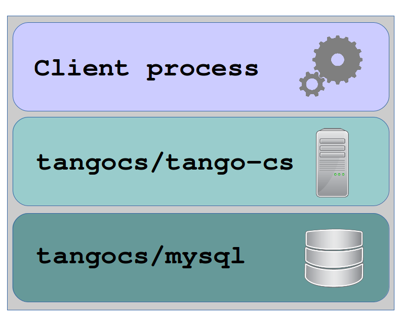

.. _tango_using_docker:
Using Tango docker containers
=============================

:audience:`advanced developers`, :lang:`all`

In this section we describe how one can test newly developed tango device server using `docker https://www.docker.com/`_ containers.

Tango docker containers provide a lightweight solution for deploying tango.

To get info on how to install docker on your machine please refer to the docker `documentation https://docs.docker.com/engine/installation/`_.

Once docker is installed one can pull docker images with pre-installed tango.

Tango docker containers
-----------------------

Tango provides two docker containers: mysql container with Tango scheme and tango-cs container with minimal set of Tango servers.

These containers can be found in the corresponding repositories:
https://github.com/tango-controls/docker-mysql

https://github.com/tango-controls/tango-cs-docker

Tango docker stack
~~~~~~~~~~~~~~~~~~

Typical tango stack looks like this:

The best way to setup the whole stack is to use `docker compose <https://docs.docker.com/compose/>`_

Here is an example of docker-compose.yml:

.. code-block:: yaml

    version: '2'
    services:
      tango-db:
        image: tangocs/mysql:9.2.2
        ports:
         - "9999:3306"
        environment:
         - MYSQL_ROOT_PASSWORD=root
      tango-cs:
        image: tangocs/tango-cs:9
        ports:
         - "10000:10000"
        environment:
         - TANGO_HOST=localhost:10000
         - MYSQL_HOST=tango-db:3306
         - MYSQL_USER=tango
         - MYSQL_PASSWORD=tango
         - MYSQL_DATABASE=tango
        depends_on:
    - tango-db

Now to start the whole stack execute :command:`docker-compose up`

Once docker containers are up and running one can access mysql on localhost:9999 and the tango host on localhost:10000

For instance, one can start jive [reference] (assuming it is installed on the system).

Tango docker stack for Tango REST API
~~~~~~~~~~~~~~~~~~~~~~~~~~~~~~~~~~~~~

One can setup Tango docker stack for Tango REST API [reference] as well. Currently only mtangorest.server [link] provides docker container that can be used together with Tango docker containers:
https://bitbucket.org/hzgwpn/mtangorest.docker

The following docker-compose.yml assembles the whole stack:

.. code-block:: yaml

    version: '2'
    services:
      tango-db:
        image: tangocs/mysql:9.2.2
        ports:
         - "9999:3306"
        environment:
         - MYSQL_ROOT_PASSWORD=root
      tango-cs:
        image: tangocs/tango-cs:9
        ports:
         - "10000:10000"
        environment:
         - TANGO_HOST=localhost:10000
         - MYSQL_HOST=tango-db:3306
         - MYSQL_USER=tango
         - MYSQL_PASSWORD=tango
         - MYSQL_DATABASE=tango
        links:
         - "tango-db:localhost"
        depends_on:
         - tango-db
      tango-rest:
         image: hzgde/mtangorest.docker:rc4
         ports:
          - "10001:10001"
         environment:
          - TANGO_HOST=tango-cs:10000
         links:
          - "tango-cs:localhost"
         depends_on:
    - tango-cs

Note this is almost the same as the previous, expect we have added tango-rest node. Once :command:`docker-compose up` executed one can access Tango REST API at http://localhost:10001/tango/rest

Extending existing containers
-----------------------------

Applying additional SQL script to tangocs/mysql.

Since every docker image can be used as a base for another docker image one can create his own image. In this new image new SQL scripts can be applied to extend the exiting scheme, for instance to add new devices or adjust configuration.

An example of such extension could look like this:

[TODO script]
