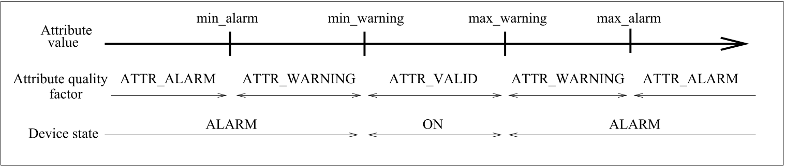

Attribute alarms
================

Each Tango attribute two several alarms. These alarms are :

-  A four thresholds level alarm

-  The read different than set (RDS) alarm

The level alarms
----------------

This alarm is defined for all Tango attribute read type and for
numerical data type. The action of this alarm depend on the attribute
value when it is read :

-  If the attribute value is below or equal the attribute configuration
   **min\_alarm** parameter, the attribute quality factor is switched to
   Tango::ATTR\_ALARM and if the device state is Tango::ON, it is
   switched to Tango::ALARM.

-  If the attribute value is below or equal the attribute configuration
   **min\_warning** parameter, the attribute quality factor is switched
   to Tango::ATTR\_WARNING and if the device state is Tango::ON, it is
   switched to Tango::ALARM.

-  If the attribute value is above or equal the attribute configuration
   **max\_warning** parameter, the attribute quality factor is switched
   to Tango::ATTR\_WARNING and if the device state is Tango::ON, it is
   switched to Tango::ALARM.

-  If the attribute value is above or equal the attribute configuration
   **max\_alarm** parameter, the attribute quality factor is switched to
   Tango::ATTR\_ALARM and if the device state is Tango::ON, it is
   switched to Tango::ALARM.

If the attribute is a spectrum or an image, then the alarm is set if any
one of the attribute value satisfies the above criterium. By default,
these four parameters are not defined and no check will be done.

The following figure is a drawing of attribute quality factor and device
state values function of the the attribute value.

.. _`7.1`:

   Figure 7.1: Level alarm

If the min\_warning and max\_warning parameters are not set, the
attribute quality factor will simply change between Tango::ATTR\_ALARM
and Tango::ATTR\_VALID function of the attribute value.

The Read Different than Set (RDS) alarm
---------------------------------------

This alarm is defined only for attribute of the Tango::READ\_WRITE and
Tango::READ\_WITH\_WRITE read/write type and for numerical data type.
When the attribute is read (or when the device state is requested), if
the difference between its read value and the last written value is
something more than or equal to an authorized delta and if at least a
certain amount of milli seconds occurs since the last write operation,
the attribute quality factor will be set to Tango::ATTR\_ALARM and if
the device state is Tango::ON, it is switched to Tango::ALARM. If the
attribute is a spectrum or an image, then the alarm is set if any one of
the attribute value’s satisfies the above criterium. This alarm
configuration is done with two attribute configuration parameters called
**delta\_val** and **delta\_t**. By default, these two parameters are
not defined and no check will be done.