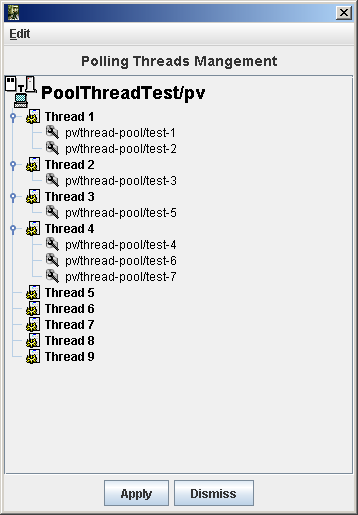

.. _device_polling:

Device polling
==============

Introduction
------------

Each tango device server automatically have a separate polling thread
pool. Polling a device means periodically executing command on a device
(or reading device attribute) and storing the results (or the thrown
exception) in a polling buffer. The aim of this polling is threefold :

-  Speed-up response time for slow device

-  Get a first-level history of device command output or attribute value

-  Be the data source for the Tango event system

Speeding-up response time is achieved because the command\_inout or
read\_attribute CORBA operation is able to get its data from the polling
buffer or from the a real access to the device. For “slow” device,
getting the data from the buffer is much faster than accessing the
device. Returning a first-level command output history (or attribute
value history) to a client is possible due to the polling buffer which
is managed as a circular buffer. The history is the contents of this
circular buffer. Obviously, the history depth is limited to the depth of
the circular buffer. The polling is also the data source for the event
system because detecting an event means being able to regularly read the
data, memorize it and declaring that it is an event after some
comparison with older values.

Starting with Tango 9, the default polling algorithm has been modifed.
However, it is still possible to use the polling as it was in Tango
releases prior to release 9. See chaper on polling configuration to get
details on this.

Configuring the polling system
------------------------------

Configuring what has to be polled and how
~~~~~~~~~~~~~~~~~~~~~~~~~~~~~~~~~~~~~~~~~

It is possible to configure the polling in order to poll :

-  Any command which does not need input parameter

-  Any attribute

Configuring the polling is done by sending command to the device server
administration device automatically implemented in every device server
process. Seven commands are dedicated to this feature. These commands
are

**AddObjPolling**
    It add a new object (command or attribute) to the list of object(s)
    to be polled. It is also with this command that the polling period
    is specified.

**RemObjPolling**
    To remove one object (command or attribute) from the polled
    object(s) list

**UpdObjPollingPeriod**
    Change one object polling period

**StartPolling**
    Starts polling for the whole process

**StopPolling**
    Stops polling for the whole process

**PolledDevice**
    Allow a client to know which device are polled

**DevPollStatus**
    Allow a client to precisely knows the polling status for a device

All the necessary parameters for the polling configuration are stored in
the Tango database. Therefore, the polling configuration is not lost
after a device server process stop and restart (or after a device server
process crash!!).

It is also possible to automatically poll a command (or an attribute)
without sending command to the device server administration device. This
request some coding (a method call) in the device server software during
the command or attribute creation. In this case, for every devices
supporting this command or this attribute, polling configuration will be
automatically updated in the database and the polling will start
automatically at each device server process startup. It is possible to
stop this behavior on a device basis by sending a RemObjPolling command
to the device server administration device. The following piece of code
shows how the source code should be written.

.. code:: cpp
  :number-lines:

    void DevTestClass::command_factory()
    {
    ...
        command_list.push_back(new IOStartPoll("IOStartPoll",
                                                Tango::DEV_VOID,
                                                Tango::DEV_LONG,
                                                "Void",
                                                "Constant number"));
        command_list.back()->set_polling_period(400);
    ...
    }

    void DevTestClass::attribute_factory(vector<Tango::Attr *> &att_list)
    {
    ...
        att_list.push_back(new Tango::Attr("String_attr",
                                            Tango::DEV_STRING,
                                            Tango::READ));
        att_list.back()->set_polling_period(250);
    ...
    }

A polling period of 400 mS is set for the command called “IOStartPoll”
at line 10 with the *set\_polling\_period* method of the Command class.
Therefore, for a device of this class, the polling thread will start
polling its IOStartPoll command at process start-up except if a
RemObjPolling indicating this device and the IOStartPoll command has
already been received by the device server administration device. This
is exactly the same behavior for attribute. The polling period for
attribute called “String\_attr” is defined at line 20.

Configuring the polling means defining device attribute/command polling
period. The polling period has to be chosen with care. If reading an
attribute needs 200 mS, there is no point to poll this attribute with a
polling period equal or even below 200 mS. You should also take into
account that some free time has to be foreseen for external request(s)
on the device. On average, for one attribute needing X mS as reading
time, define a polling period which is equal to 1.4 X (280 mS for our
example of one attribute needing 200 mS as reading time). In case the
polling tuning is given to external user, Tango provides a way to define
polling period minimun threshold. This is done using device properties.
These properties are named *min\_poll\_period*, *cmd\_min\_poll\_period*
and *attr\_min\_poll\_period*. The property min\_poll\_period (mS)
defined a minimun polling period for the device. The property
cmd\_min\_poll\_period allows the definition of a minimun polling period
for a specific device command. The property attr\_min\_poll\_period
allows the definition of a minimun polling period for one device
attribute. In case these properties are defined, it is not possible to
poll the device command/attribute with a polling period below those
defined by these properties. See Appendix A on device parameter to get a
precise syntax description for these properties.

The Jive (:ref:`jive_manual`) tool also allows a graphical device
polling configuration.

Configuring the polling threads pool
~~~~~~~~~~~~~~~~~~~~~~~~~~~~~~~~~~~~

Starting with Tango release 7, a Tango device server process may have
several polling threads managed as a pool. For instance, this could be
usefull in case of devices within the same device server process but
accessed by different hardware channel when one of the channel is not
responding (Thus generating long timeout and de-synchronising the
polling thread). By default, the polling threads pool size is set to 1
and all the polled object(s) are managed by the same thread (idem
polling system in Tango releases older than release 7) . The
configuration of the polling thread pool is done using two properties
associated to the device server administration device. These properties
are named:

-  *polling\_threads\_pool\_size* defining the maximun number of threads
   that you can have in the pool

-  *polling\_threads\_pool\_conf* defining which threads in the pool
   manages which device

The granularity of the polling threads pool tuning is the device. You
cannot ask the polling threads pool to have thread number 1 in charge of
attribute *att1* of device *dev1* and thread number 2 to be in charge of
*att2* of the same device *dev1*.

When you require a new object (command or attribute) to be polled, two
main cases may arrive:

#. Some polled object(s) belonging to the device are already polled by
   one of the polling threads in the pool: There is no new thread
   created. The object is simply added to the list of objects to be
   polled for the existing thread

#. There is no thread already created for the device. We have two
   sub-cases:

   #. The number of polling threads is less than the
      polling\_threads\_pool\_size: A new thread is created and started
      to poll the object (command or attribute)

   #. The number of polling threads is already equal to the
      polling\_threads\_pool\_size: The software search for the thread
      with the smallest number of polled objects and add the new polled
      object to this thread

Each time the polling threads pool configuration is changed, it is
written in the database using the polling\_threads\_pool\_conf property.
If the behaviour previously described does not fulfill your needs, it is
possible to update the polling\_threads\_pool\_conf property in a
graphical way using the Tango Astor (`ASTOR home page`_) tool
or manually using the Jive tool [Jive]_. These
changes will be taken into account at the next device server process
start-up. At start-up, the polling threads pool will allways be
configured as required by the polling\_threads\_pool\_conf property. The
syntax used for this property is described in the Reference part of the
`Appendix <A-reference.rst>`. The following window dump is the Astor
tool window which allows polling threads pool management.

|image18|

In this example, the polling threads pool size to set to 9 but only 4
polling threads are running. Thread 1 is in charge of all polled objects
related to device pv/thread-pool/test-1 and pv/thread-pool/test-2.
Thread 2 is in charge of all polled objects related to device
pv/thread-pool/test-3. Thread 3 is in charge of all polled objects
related to device pv/thread-pool/test-5 anf finally, thread 4 is in
charge of all polled objects for devices pv/thread-pool/test-4,
pv/thread-pool/test-6 and pv/thread-pool/test-7.

It’s also possible to define the polling threads pool size
programmatically in the main function of a device server process using
the *Util::set\_polling\_threads\_pool\_size()* method before the call
to the *Util::server\_init()* method

Choosing polling algorithm
~~~~~~~~~~~~~~~~~~~~~~~~~~

Starting with Tango 9, you can choose between two different polling
algorithm:

-  The polling as it was in Tango since it has been introduced. This
   means:

   -  For one device, always poll attribute one at a time even if the
      polling period is the same (use of read\_attribute instead of
      read\_attributes)

   -  Do not allow the polling thread to be late: If it is the case
      (because at the end of polling object 1, the time is greater than
      the polling date of object 2), discard polling object and inform
      event user by sending one event with error (Polling thread is late
      and discard....)

-  New polling algorithm introduced in Tango 9 as the default one. This
   means:

   -  For one device, poll all attributes with the same polling period
      using a single device call (read\_attributes)

   -  Allow the polling thread to be late but only if number of late
      objects decreases.

The advantages of new polling algorithm are

#. In case of several attributes polled on the same device at the same
   period a lower device occupation time by the polling thread (due to a
   single read\_attributes() call instead of several single
   read\_attribute() calls)

#. Less “Polling thread late” errors in the event system in case of
   device with non constant response time

The drawback is

#. The loss of attribute individual timing data reported in the polling
   thread status

It is still possible to return to pre-release 9 polling algorithm. To do
so, you can use the device server process administration device
*polling\_before\_9* property by setting it to true. It is also possible
to choose this pre-release 9 algorithm in device server process code in
the main function of the process using the
*Util::set\_polling\_before\_9()* method.

Reading data from the polling buffer
------------------------------------

For a polled command or a polled attribute, a client has three
possibilities to get command result or attribute value (or the thrown
exception) :

-  From the device itself

-  From the polling buffer

-  From the polling buffer first and from the device if data in the
   polling buffer are invalid or if the polling is badly configured.

The choice is done during the command\_inout CORBA operation by
positioning one of the operation parameter. When reading data from the
polling buffer, several error cases are possible

-  The data in the buffer are not valid any more. Every time data are
   requested from the polling buffer, a check is done between the client
   request date and the date when the data were stored in the buffer. An
   exception is thrown if the delta is greater than the polling period
   multiplied by a “too old” factor. This factor has a default value and
   is up-datable via a device property. This is detailed in the
   reference part of this manual.

-  The polling is correctly configured but there is no data yet in the
   polling buffer.

Retrieving command/attribute result history
-------------------------------------------

The polling thread stores the command result or attribute value in
circular buffers. It is possible to retrieve an history of the command
result (or attribute value) from these polling buffers. Obviously the
history is limited by the depth of the circular buffer. For commands, a
CORBA operation called *command\_inout\_history\_2* allows this
retrieval. The client specifies the command name and the record number
he want to retrieve. For each record, the call returns the date when the
command was executed, the command result or the exception stack in case
of the command failed when it was executed by the polling thread. In
such a case, the exception stack is sent as a structure member and not
as an exception. The same thing is available for attribute. The CORBA
operation name is *read\_attribute\_history\_2.* For these two calls,
there is no check done between the call date and the record date in
contrary of the call to retrieve the last command result (or attribute
value).

Externally triggered polling
----------------------------

Sometimes, rather than polling a command or an attribute regulary with a
fixed period, it is more interesting to manually decides when the
polling must occurs. The Tango polling system also supports this kind of
usage. This is called *externally triggered polling*. To define one
attribute (or command) as externally triggered, simply set its polling
period to 0. This can be done with the device server administration
device AddObjPolling or UpdObjPollingPeriod command. Once in this mode,
the attribute (or command) polling is triggered with the
*trigger\_cmd\_polling()* method (or *trigger\_attr\_polling()* method)
of the Util class. The following piece of code shows how this method
could be used for one externally triggered command.

.. code:: cpp
  :number-lines:

    .....

    string ext_polled_cmd("MyCmd");
    Tango::DeviceImpl *device = .....;

    Tango::Util *tg = Tango::Util::instance();

    tg->trigger_cmd_polling(device,ext_polled_cmd);

    .....

line 3 : The externally polled command name

line 4 : The device object

line 8 : Trigger polling of command MyCmd

Filling polling buffer
----------------------

Some hardware to be interfaced already returned an array of pair value,
timestamp. In order to be read with the *command\_inout\_history* or
*read\_attribute\_history* calls, this array has to be transferred in
the attribute or command polling buffer. This is possible only for
attribute or command configured in the externally triggered polling
mode. Once in externally triggered polling mode, the attribute (or
command) polling buffer is filled with the
*fill\_cmd\_polling\_buffer()* method (or
*fill\_attr\_polling\_buffer()* method) of the Util class. For command,
the user uses a template class called *TimedCmdData* for each element of
the command history. Each element is stored in a stack in one instance
of a template class called *CmdHistoryStack.* This object is one of the
argument of the fill\_cmd\_polling\_buffer() method. Obviously, the
stack depth cannot be larger than the polling buffer depth. See
[sub:The-device-polling-prop] to learn how the polling buffer depth is
defined. The same way is used for attribute with the *TimedAttrData* and
*AttrHistoryStack* template classes. These classes are documented in
[TangoRefMan]_ . The following piece of code fills the
polling buffer for a command called MyCmd which is already in externally
triggered mode. It returns a DevVarLongArray data type with three
elements. This example is not really something you will find in a real
hardware interface. It is only to demonstrate the
fill\_cmd\_polling\_buffer() method usage. Error management has also
been removed.

.. code:: cpp
  :number-lines:

    ....

    Tango::DevVarLongArray dvla_array[4];

    for(int i = 0;i < 4;i++)
    {
        dvla_array[i].length(3);
        dvla_array[i][0] = 10 + i;
        dvla_array[i][1] = 11 + i;
        dvla_array[i][2] = 12 + i;
    }

    Tango::CmdHistoryStack<DevVarLongArray> chs;
    chs.length(4);

    for (int k = 0;k < 4;k++)
    {
        time_t when = time(NULL);

        Tango::TimedCmdData<DevVarLongArray> tcd(&dvla_array[k],when);
        chs.push(tcd);
    }

    Tango::Util *tg = Tango::Util::instance();
    string cmd_name("MyCmd");
    DeviceImpl *dev = ....;

    tg->fill_cmd_polling_buffer(dev,cmd_name,chs);

    .....

Line 3-11 : Simulate data coming from hardware

Line 13-14 : Create one instance of the CmdHistoryStack class and
reserve space for one history of 4 elements

Line 16-17 : A loop on each history element

Line 18 : Get date (hardware simulation)

Line 20 : Create one instance of the TimedCmdData class with data and
date

Line 21 : Store this command history element in the history stack. The
element order will be the insertion order whatever the element date is.

Line 28 : Fill command polling buffer

After one execution of this code, a command\_inout\_history() call will
return one history with 4 elements. The first array element of the
oldest history record will have the value 10. The first array element of
the newest history record will have the value 13. A command\_inout()
call with the data source parameter set to CACHE will return the newest
history record (ie an array with values 13,14 and 15). A
command\_inout() call with the data source parameter set to DEVICE will
return what is coded is the command method. If you execute this code a
second time, a command\_inout\_history() call will return an history of
8 elements.

The next example fills the polling buffer for an attribute called MyAttr
which is already in externally triggered mode. It is a scalar attribute
of the DevString data type. This example is not really something you
will find in a real hardware interface. It is only to demonstrate the
fill\_attr\_polling\_buffer() method usage with memory management issue.
Error management has also been removed.

.. code:: cpp
  :number-lines:

    ....

    AttrHistoryStack<DevString> ahs;
    ahs.length(3);

    for (int k = 0;k < 3;k++)
    {
        time_t when = time(NULL);

        DevString *ptr = new DevString [1];
        ptr = CORBA::string_dup("Attr history data");

        TimedAttrData<DevString> tad(ptr,Tango::ATTR_VALID,true,when);
        ahs.push(tad);
    }

    Tango::Util *tg = Tango::Util::instance();
    string attr_name("MyAttr");
    DeviceImpl *dev = ....;

    tg->fill_attr_polling_buffer(dev,attr_name,ahs);

    .....

Line 3-4 : Create one instance of the AttrHistoryStack class and reserve
space for an history with 3 elements

Line 6-7 : A loop on each history element

Line 8 : Get date (hardware simulation)

Line 10-11 : Create a string. Note that the DevString object is created
on the heap

Line 13 : Create one instance of the TimedAttrData class with data and
date requesting the memory to be released.

Line 14 : Store this attribute history element in the history stack. The
element order will be the insertion order whatever the element date is.

Line 21 : Fill command polling buffer

It is not necessary to return the memory allocated at line 10. The
*fill\_attr\_polling\_buffer()* method will do it for you.

Setting and tuning the polling in a Tango class
-----------------------------------------------

Even if the polling is normally set and tuned with external tool like
Jive, it is possible to set it directly into the code of a Tango class.
A set of methods belonging to the *DeviceImpl* class allows the user to
deal with polling. These methods are:

-  *is\_attribute\_polled()* and *is\_command\_polled()* to check if one
   command/attribute is polled

-  *get\_attribute\_poll\_period()* and *get\_command\_poll\_period()*
   to get polled object polling period

-  *poll\_attribute()* and *poll\_command()* to poll command or
   attribute

-  *stop\_poll\_attribute()* and *stop\_poll\_command()* to stop polling
   a command or an attribute

The following code snippet is just an exmaple of how these methods could
be used. They are documented in [TangoRefMan]_.

.. code:: cpp
  :number-lines:

  	void MyClass::read_attr(Tango::Attribute &attr)
  	{
  	    ...
  	    ...

  	    string att_name("SomeAttribute");
  	    string another_att_name("AnotherAttribute");

  	    if (is_attribute_polled(att_name) == true)
  	        stop_poll_attribute(att_name);
  	    else
  	        poll_attribute(another_att_name,500);

  	    ....
  	    ....

  	}

    ]
