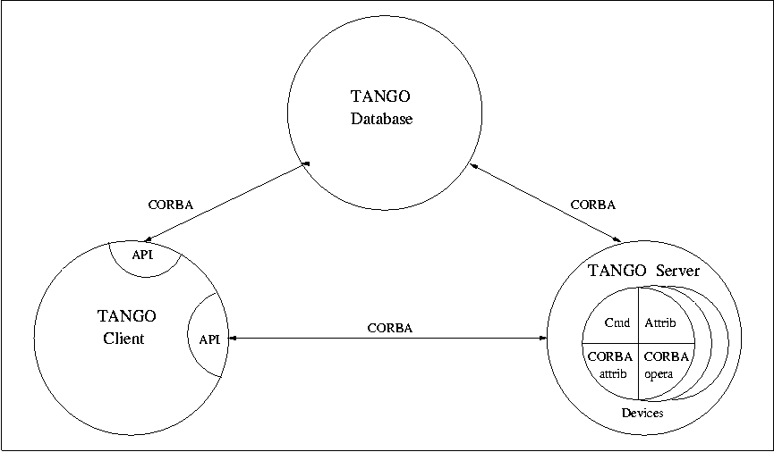
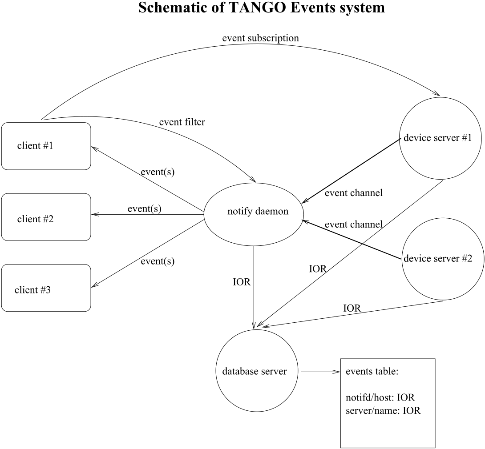
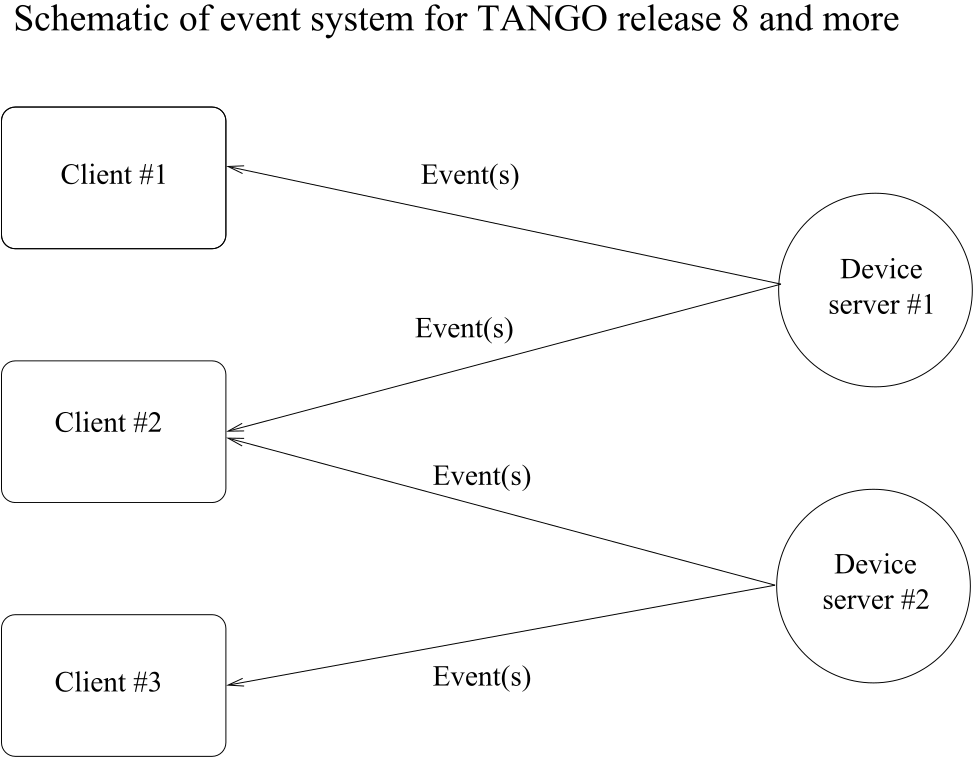

.. raw:: latex

    \clearpage

.. _deviceservermodel:

The TANGO device server model
=============================

This chapter will present the TANGO device server object model hereafter
referred as TDSOM. First, it will introduce CORBA. Then, it will
describe each of the basic features of the TDSOM and their function. The
TDSOM can be divided into the following basic elements - the *device*,
the *server*, the *database* and the *application programmers
interface*. This chapter will treat each of the above elements
separately.

Introduction to CORBA
---------------------

CORBA is a definition of how to write object request brokers (ORB). The
definition is managed by the Object Management Group (`OMG home page`_).
Various commercial and non-commercial
implementations exist for CORBA for all the mainstream operating
systems. CORBA uses a programming language independent definition
language (called IDL) to defined network object interfaces. Language
mappings are defined from IDL to the main programming languages e.g.
C++, Java, C, COBOL, Smalltalk and ADA. Within an interface, CORBA
defines two kinds of actions available to the outside world. These
actions are called **attributes** and **operations**.

Operations are all the actions offered by an interface. For instance,
within an interface for a Thermostat class, operations could be the
action to read the temperature or to set the nominal temperature. An
attribute defines a pair of operations a client can call to send or
receive a value. For instance, the position of a motor can be defined as
an attribute because it is a data that you only set or get. A read only
attribute defines a single operation the client can call to receives a
value. In case of error, an operation is able to throw an exception to
the client, attributes cannot raises exception except system exception
(du to network fault for instance).

Intuitively, IDL interface correspond to C++ classes and IDL operations
correspond to C++ member functions and attributes as a way to read/write
public member variable. Nevertheless, IDL defines only the interface to
an object and say nothing about the object implementation. IDL is only a
descriptive language. Once the interface is fully described in the IDL
language, a compiler (from IDL to C++, from IDL to Java...) generates
code to implement this interface. Obviously, you still have to write how
operations are implemented.

The act of invoking an operation on an interface causes the ORB to send
a message to the corresponding object implementation. If the target
object is in another address space, the ORB run time sends a remote
procedure call to the implementation. If the target object is in the
same address space as the caller, the invocation is accomplished as an
ordinary function call to avoid the overhead of using a networking
protocol.

For an excellent reference on CORBA with C++ refer to
[Henning]_. The complete TANGO IDL file can be found in
the `TANGO home page`_ or at the end of this
document in the appendix 2 chapter.

The model
---------

The basic idea of the TDSOM is to treat each device as an **object**.
Each device is a separate entity which has its own data and behavior.
Each device has a unique name which identifies it in network name space.
Devices are organized according to **classes**, each device belonging to
a class. All classes are derived from one root class thus allowing some
common behavior for all devices. Four kind of requests can be sent to a
device (locally i.e. in the same process, or remotely i.e. across the
network) :

-  Execute actions via **commands**

-  Read/Set data specific to each device belonging to a class via TANGO
   **attributes**

-  Read/Set data specific to each device belonging to a class via TANGO
   **pipes**

-  Read some basic device data available for all devices via CORBA
   attributes.

-  Execute a predefined set of actions available for every devices via
   CORBA operations

Each device is stored in a process called a **device server**. Devices
are configured at runtime via **properties** which are stored in a
**database**.

.. _devicesection_deviceservermodel:

The device
----------

The device is the heart of the TDSOM. A device is an abstract concept
defined by the TDSOM. In reality, it can be a piece of hardware (an
interlock bit) a collection of hardware (a screen attached to a stepper
motor) a logical device (a taper) or a combination of all these (an
accelerator). Each device has a unique name in the control system and
eventually one alias. Within Tango, a four field name space has been
adopted consisting of

[//FACILITY/]DOMAIN/CLASS/MEMBER

Facility refers to the control system instance, domain refers to the
sub-system, class the class and member the instance of the device.
Device name alias(es) must also be unique within a control system. There
is no predefined syntax for device name alias.

Each device belongs to a class. The device class contains a complete
description and implementation of the behavior of all members of that
class. New device classes can be constructed out of existing device
classes. This way a new hierarchy of classes can be built up in a short
time. Device classes can use existing devices as sub-classes or as
sub-objects. The practice of reusing existing classes is classical for
Object Oriented Programming and is one of its main advantages.

All device classes are derived from the same class (the device root
class) and implement **the same CORBA interface**. All devices
implementing the same CORBA interface ensures all control object support
the same set of CORBA operations and attributes. The device root class
contains part of the common device code. By inheriting from this class,
all devices shared a common behavior. This also makes maintenance and
improvements to the TDSOM easy to carry out.

All devices also support a **black box** where client requests for
attributes or operations are recorded. This feature allows easier
debugging session for device already installed in a running control
system.

.. _commands_deviceservermodel:

The commands
~~~~~~~~~~~~

Each device class implements a list of commands. Commands are very
important because they are the client’s major dials and knobs for
controlling a device. Commands have a fixed calling syntax - consisting
of one input argument and one output argument. Arguments type must be
chosen in a fixed set of data types: All simple types (boolean, short,
long (32 bits), long (64 bits), float, double, unsigned short, unsigned
long (32 bits), unsigned long (64 bits) and string) and arrays of simple
types plus array of strings and longs and array of strings and doubles).
Commands can execute any sequence of actions. Commands can be executed
synchronously (the requester is blocked until the command ended) or
asynchronously (the requester send the request and is called back when
the command ended).

Commands are executed using two CORBA operations named
**command\_inout** for synchronous commands and
**command\_inout\_async** for asynchronous commands. These two
operations called a special method implemented in the device root class
- the *command\_handler* method. The *command\_handler* calls an
*is\_allowed* method implemented in the device class before calling the
command itself. The *is\_allowed* method is specific to each
command [1]_. It checks to see whether the command to be executed is
compatible with the present device state. The command function is
executed only if the *is\_allowed* method allows it. Otherwise, an
exception is sent to the client.

The TANGO attributes
~~~~~~~~~~~~~~~~~~~~

In addition to commands, TANGO devices also support normalized data
types called attributes [2]_. Commands are device specific and the data
they transport are not normalized i.e. they can be any one of the TANGO
data types with no restriction on what each byte means. This means that
it is difficult to interpret the output of a command in terms of what
kind of value(s) it represents. Generic display programs need to know
what the data returned represents, in what units it is, plus additional
information like minimum, maximum, quality etc. Tango attributes solve
this problem.

TANGO attributes are zero, one or two dimensional data which have a fix
set of properties e.g. quality, minimum and maximum, alarm low and high.
They are transferred in a specialized TANGO type and can be read, write
or read-write. A device can support a list of attributes. Clients can
read one or more attributes from one or more devices. To read TANGO
attributes, the client uses the **read\_attributes** operation. To write
TANGO attributes, a client uses the **write\_attributes** operation. To
write then read TANGO attributes within the same network request, the
client uses the **write\_read\_attributes** operation. To query a device
for all the attributes it supports, a client uses the
**get\_attribute\_config** operation. A client is also able to modify
some of parameters defining an attribute with the
**set\_attribute\_config** operation. These five operations are defined
in the device CORBA interface.

TANGO support thirteen data types for attributes (and arrays of for one
or two dimensional data) which are: boolean, short, long (32 bits), long
(64 bits), float, double, unsigned char, unsigned short, unsigned long
(32 bits), unsigned long (64 bits), string, a specific data type for
Tango device state and finally another specific data type to transfer
data as an array of unsigned char with a string describing the coding of
these data.

The TANGO pipes
~~~~~~~~~~~~~~~

Since release 9, in addition to commands and attributes, TANGO devices
also support pipes.

In some cases, it is required to exchange data between client and device
of varrying data type. This is for instance the case of data gathered
during a scan on one experiment. Because the number of actuators and
sensors involved in the scan may change from one scan to another, it is
not possible to use a well defined data type. TANGO pipes have been
designed for such cases. A TANGO pipe is basically a pipe dedicated to
transfer data between client and device. A pipe has a set of two
properties which are the pipe label and its description. A pipe can be
read or read-write. A device can support a list of pipes. Clients can
read one or more pipes from one or more devices. To read a TANGO pipe,
the client uses the **read\_pipe** operation. To write a TANGO pipe, a
client uses the **write\_pipe** operation. To write then read a TANGO
pipe within the same network request, the client uses the
**write\_read\_pipe** operation. To query a device for all the pipes it
supports, a client uses the **get\_pipe\_config** operation. A client is
also able to modify some of parameters defining a pipe with the
**set\_pipe\_config** operation. These five operations are defined in
the device CORBA interface.

In contrary of commands or attributes, a TANGO pipe does not have a
pre-defined data type. Data transferred through pipes may be of any
basic Tango data type (or array of) and this may change every time a
pipe is read or written.

Command, attributes or pipes ?
~~~~~~~~~~~~~~~~~~~~~~~~~~~~~~

There are no strict rules concerning what should be returned as command
result and what should be implemented as an attribute or as a pipe.
Nevertheless, attributes are more adapted to return physical value which
have a kind of time consistency. Attribute also have more properties
which help the client to precisely know what it represents. For
instance, the state and the status of a power supply are not physical
values and are returned as command result. The current generated by the
power supply is a physical value and is implemented as an attribute. The
attribute properties allow a client to know its unit, its label and some
other informations which are related to a physical value. Command are
well adapted to send order to a device like switching from one mode of
operation to another mode of operation. For a power supply, the switch
from a STANDBY mode to a ON mode is typically done via a command.
Finally pipe is well adapted when the kind and number of data exchanged
between the client and the device change with time.

The CORBA attributes
~~~~~~~~~~~~~~~~~~~~

Some key data implemented for each device can be read without the need
to call a command or read an attribute. These data are :

-  The device state

-  The device status

-  The device name

-  The administration device name called adm\_name

-  The device description

The device state is a number representing its state. A set of predefined
states are defined in the TDSOM. The device status is a string
describing in plain text the device state and any additional useful
information of the device as a formatted ascii string. The device name
is its name as defined in [sec:dev]. For each set of devices grouped
within the same server, an administration device is automatically added.
This adm\_name is the name of the administration device. The device
description is also an ascii string describing the device rule.

These five CORBA attributes are implemented in the device root class and
therefore do not need any coding from the device class programmer. As
explained in [sec:corba], the CORBA attributes are not allowed to raise
exceptions whereas command (which are implemented using CORBA
operations) can.

The remaining CORBA operations
~~~~~~~~~~~~~~~~~~~~~~~~~~~~~~

The TDSOM also supports a list of actions defined as CORBA operations in
the device interface and implemented in the device root class.
Therefore, these actions are implemented automatically for every TANGO
device. These operations are :

.. csv-table::

   "ping", "to ping a device to check if the device is alive. Obviously, it checks
   only the connection from a client to the device and not all the device functionalities"

   "command_list_query", "request a list of all the commands supported by a device with their
   input and output types and description"

   "command_query", "request information about a specific command which are its input and
   output type and description"

   "info", "request general information on the device like its name, the host where
   the device server hosting the device is running..."

   "black_box", "read the device black-box as an array of strings"

The special case of the device state and status
~~~~~~~~~~~~~~~~~~~~~~~~~~~~~~~~~~~~~~~~~~~~~~~

Device state and status are the most important key device informations.
Nearly all client software dealing with Tango device needs device(s)
state and/or status. In order to simplify client software developper
work, it is possible to get these two piece of information in three
different manners :

#. Using the appropriate CORBA attribute (state or status)

#. Using command on the device. The command are called State or Status

#. Using attribute. Even if the state and status are not real attribute,
   it is possible to get their value using the read\_attributes
   operation. Nevertheless, it is not possible to set the attribute
   configuration for state and status. An error is reported by the
   server if a client try to do so.

The device polling
~~~~~~~~~~~~~~~~~~

Within the Tango framework, it is also possible to force executing
command(s) or reading attribute(s) at a fixed frequency. It is called
*device polling*. This is automatically handled by Tango core software
with a polling threads pool. The command result or attribute value are
stored in circular buffers. When a client want to read attribute value
(or command result) for a polled attribute (or a polled command), he has
the choice to get the attribute value (or command result) with a real
access to the device of from the last value stored in the device ring
buffer. This is a great advantage for “slow” devices. Getting data from
the buffer is much faster than accessing the device itself. The
technical disadvantage is the time shift between the data returned from
the polling buffer and the time of the request. Polling a command is
only possible for command without input arguments. It is not possible to
poll a device pipe.

Two other CORBA operations called *command\_inout\_history\_X* and
*read\_attribute \_history\_X* allow a client to retrieve the history of
polled command or attribute stored in the polling buffers. Obviously,
this history is limited to the depth of the polling buffer.

The whole polling system is available only since Tango release 2.x and
above in CPP and since TangORB release 3.7.x and above in Java.

The server
----------

Another integral part of the TDSOM is the server concept. The server
(also referred as device server) is a process whose main task is to
offer one or more services to one or more clients. To do this, the
server has to spend most of its time in a wait loop waiting for clients
to connect to it. The devices are hosted in the server process. A server
is able to host several classes of devices. In the TDSOM, a device of
the **DServer** class is automatically hosted by each device server.
This class of device supports commands which enable remote device server
process administration.

TANGO supports device server process on two families of operating system
: Linux and Windows.

The Tango Logging Service
-------------------------

During software life, it is always convenient to print miscellaneous
informations which help to:

-  Debug the software

-  Report on error

-  Give regular information to user

This is classically done using ``cout`` (or C ``printf``) in C++ or ``println``
method in Java language. In a highly distributed control system, it is
difficult to get all these informations coming from a high number of
different processes running on a large number of computers. Since its
release 3, Tango has incorporated a Logging Service called the Tango
Logging Service (TLS) which allows print messages to be:

-  Displayed on a console (the classical way)

-  Sent to a file

-  Sent to specific Tango device called log consumer. Tango package has
   an implementation of log consumer where every consumer device is
   associated to a graphical interface. This graphical interface display
   messages but could also be used to sort messages, to filter
   messages... Using this feature, it is possible to centralise display
   of these messages coming from different devices embedded within
   different processes. These log consumers can be:

   -  Statically configured meaning that it memorizes the list of Tango
      devices for which it will get and display messages.

   -  Dynamically configured. The user, with the help of the graphical
      interface, chooses devices from which he want to see messages.

The database
------------

To achieve complete device independence, it is necessary however to
supplement device classes with a possibility for configuring device
dependencies at runtime. The utility which does this in the TDSOM is the
**property database**. Properties [3]_ are identified by an ascii string
and the device name. TANGO attributes are also configured using
properties. This database is also used to store device network addresses
(CORBA IOR’s), list of classes hosted by a device server process and
list of devices for each class in a device server process. The database
ensure the uniqueness of device name and of alias. It also links device
name and it list of aliases.

TANGO uses MySQL (`MySQL home page`_) as its database. MySQL is a
relational database which implements the SQL language. However, this is
largely enough to implement all the functionalities needed by the TDSOM.
The database is accessed via a classical TANGO device hosted in a device
server. Therefore, client access the database via TANGO commands
requested on the database device. For a good reference on MySQL refer to
[MySQLbook]_.

The controlled access
---------------------

Tango also provides a controlled access system. It’s a simple controlled
access system. It does not provide encrypted communication or
sophisticated authentification. It simply defines which user (based on
computer loggin authentification) is allowed to do which command (or
write attribute) on which device and from which host. The information
used to configure this controlled access feature are stored in the Tango
database and accessed by a specific Tango device server which is not the
classsical Tango database device server described in the previous
section. Two access levels are defined:

-  Everything is allowed for this user from this host

-  The write-like calls on the device are forbidden and according to
   configuration, a command subset is also forbidden for this user from
   this host

This feature is precisely described in the chapter Advanced features

The Application Programmers Interfaces
--------------------------------------

Rules of the API
~~~~~~~~~~~~~~~~

While it is true TANGO clients can be programmed using only the CORBA
API, CORBA knows nothing about TANGO. This means client have to know all
the details of retrieving IORs from the TANGO database, additional
information to send on the wire, TANGO version control etc. These
details can and should be wrapped in TANGO Application Programmer
Interface (API). The API is implemented as a library in C++ and as a
package in Java. The API is what makes TANGO clients easy to write. The
API’s consists the following basic classes :

-  DeviceProxy which is a *proxy* to the real device

-  DeviceData to encapsulate data send/receive from/to device via
   commands

-  DeviceAttribute to encapsulate data send/receive from/to device via
   attributes

-  Group which is a *proxy* to a group of devices

In addition to these main classes, many other classes allows a full
interface to TANGO features. The following figure is a drawing of a
typical client/server application using TANGO.

|image04|

The database is used during server and client startup phase to establish
connection between client and server.

Communication between client and server using the API
~~~~~~~~~~~~~~~~~~~~~~~~~~~~~~~~~~~~~~~~~~~~~~~~~~~~~

With the API, it is possible to request command to be executed on a
device or to read/write device attribute(s) using one of the two
communication models implemented. These two models are:

#. The synchronous model where client waits (and is blocked) for the
   server to send the answer or until the timeout is reached

#. The asynchronous model. In this model, the clients send the request
   and immediately returns. It is not blocked. It is free to do whatever
   it has to do like updating a graphical user interface. The client has
   the choice to retrieve the server answer by checking if the reply is
   arrived by calling an API specific call or by requesting that a
   call-back method is executed when the client receives the server
   answer.

The asynchronous model is available with Tango release 3 and above.

Tango events
~~~~~~~~~~~~

On top of the two communication model previously described, TANGO offers
an event system. The standard TANGO communication paradigm is a
synchronou/asynchronous two-way call. In this paradigm the call is
initiated by the client who contacts the server. The server handles the
client’s request and sends the answer to the client or throws an
exception which the client catches. This paradigm involves two calls to
receive a single answer and requires the client to be active in
initiating the request. If the client has a permanent interest in a
value he is obliged to poll the server for an update in a value every
time. This is not efficient in terms of network bandwidth nor in terms
of client programming.

For clients who are permanently interested in values the event-driven
communication paradigm is a more efficient and natural way of
programming. In this paradigm the client registers his interest once in
an event (value). After that the server informs the client every time
the event has occurred. This paradigm avoids the client polling, frees
it for doing other things, is fast and makes efficient use of the
network.

Before TANGO release 8, TANGO used the CORBA OMG COS Notification
Service to generates events. TANGO uses the omniNotify implementation of
the Notification service. omniNotify was developed in conjunction with
the omniORB CORBA implementation also used by TANGO. The heart of the
Notification Service is the notification daemon. The omniNotify daemons
are the processes which receive events from device servers and
distribute them to all clients which are subscribed. In order to
distribute the load of the events there is one notification daemon per
host. Servers send their events to the daemon on the local host. Clients
and servers get the IOR for the host from the TANGO database.

The following figure is a schematic of the Tango event system for Tango
releases before Tango 8.

|image05|

Starting with Tango 8, a new design of the event system has been
implemented. This new design is based on the ZMQ library. ZMQ is a
library allowing users to create communicating system. It implements
several well known communication pattern including the Publish/Subscribe
pattern which is the basic of the new Tango event system. Using this
library, a separate notification service is not needed anymore and event
communiction is available with only client and server processes which
simplifies the overall design. Starting with Tango 8.1, the event
propagation between devices and clients could be done using a
multicasting protocol. The aim of this is to reduce both the network
bandwidth use and the CPU consumption on the device server side. See
chapter on Advanced Features to get all the details on this feature.

The following figure is a schematic of the Tango event system for Tango
releases starting with Tango release 8.

|image06|

.. [1]
   In contrary to the state\_handler method of the TACO device server
   model which is not specific to each command.

.. [2]
   TANGO attributes were known as signals in the TACO device server
   model

.. [3]
   Properties were known as resources in the TACO device server model
