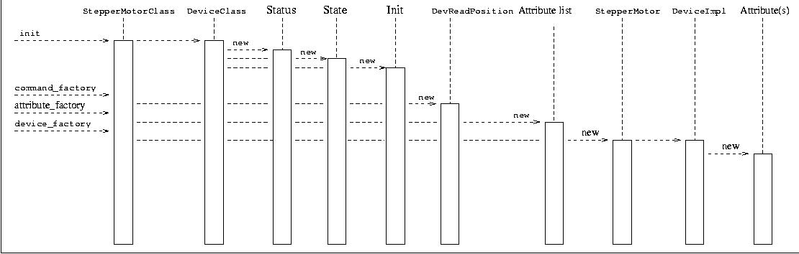
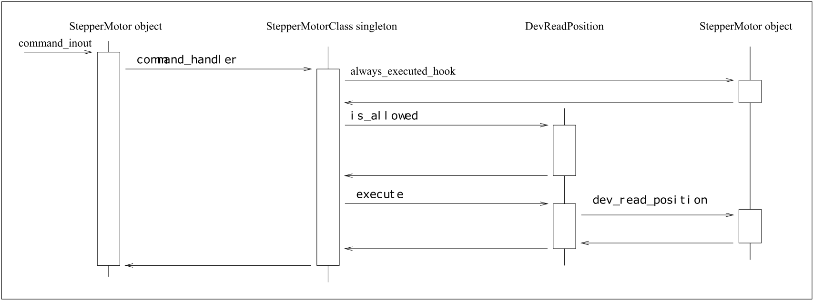
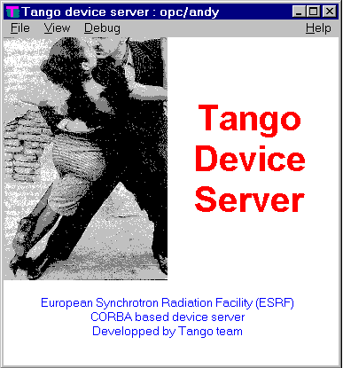

.. raw:: latex

    \clearpage

Writing a TANGO device server
=============================

The device server framework
---------------------------

This chapter will present the TANGO device server framework. It will
introduce what is the device server pattern and then it will describe a
complete device server framework. A definition of classes used by the
device server framework is given in this chapter. This manual is not
intended to give the complete and detailed description of classes data
member or methods, refer to [TangoRefMan]_ to get
this full description. But first, the naming convention used in this
project is detailed.

The aim of the class definition given in this chapter is only to help
the reader to understand how a TANGO device server works. For a detailed
description of these classes (and their methods), refer to chapter
[Writing\_chapter] or to [TangoRefMan]_.

Naming convention and programming language
~~~~~~~~~~~~~~~~~~~~~~~~~~~~~~~~~~~~~~~~~~

TANGO fully supports three different programming languages which are
**C++, Java** and **Python**. This documentation focuses on C++ Tango
class. For Java and Python Tango class, have a look at the [TangoRefMan]_
pages where similar chapter for Java and Python are available.

Every software project needs a naming convention. The naming convention
adopted for the TDSOM is very simple and only defines two guidelines
which are:

-  Class names start with uppercase and use capitalization for compound
   words (For instance MyClassName).

-  Method names are in lowercase and use underscores for compound words
   (For instance my\_method\_name).

The device pattern
~~~~~~~~~~~~~~~~~~

Device server are written using the Device pattern. The aim of this
pattern is to provide the control programmer with a framework in which
s/he can develop new control objects. The device pattern uses other
design patterns like the Singleton and Command patterns. These patterns
are fully described in [Patterns]_. The device pattern
class diagram for stepper motor device is drawn in figure `6.1`_

.. _`6.1`:

   Figure 6.1: Device pattern class diagram

. In this figure, only classes surrounded with a dash line square are
device specific. All the other classes are part of the TDSOM core and
are developed by the Tango system team. Different kind of classes are
used by the device pattern.

-  Three of them are root classes and it is only necessary to inherit
   from them. These classes are the **DeviceImpl**, **DeviceClass** and
   **Command** classes.

-  Classes necessary to implement commands. The TDSOM supports two ways
   to create command : Using inheritance or using the template command
   model. It is possible to mix model within the same device pattern

   #. Using **inheritance**. This model of creating command heavily used
      the polymorphism offered by each modern object oriented
      programming language. In this schema, each command supported by a
      device via the command\_inout or command\_inout\_async operation
      is implemented by a separate class. The Command class is the root
      class for each of these classes. It is an abstract class. A
      *execute* method must be defined in each sub-class. A
      *is\_allowed* method may also be re-defined in each class if the
      default one does not fulfill all the needs [1]_. In our stepper
      motor device server example, the DevReadPosition command follows
      this model.

   #. Using the **template command** model. Using this model, it is not
      necessary to write one class for each command. You create one
      instance of classes already defined in the TDSOM for each command.
      The link between command name and method which need to be executed
      is done through pointers to method. To support different kind of
      command, four classes are part of the TDSOM. These classes are :

      #. The **TemplCommand** class for command without input or output
         parameter

      #. The **TemplCommandIn** class for command with input parameter
         but without output parameter

      #. The **TemplCommandOu**\ t class for command with output
         parameter but without input parameter

      #. The **TemplCommandInOut** class for all the remaining commands

-  Classes necessary to implement TANGO device attributes. All these
   classes are part of the TANGO core classes. These classes are the
   **MultiAttribute**, **Attribute**, **WAttribute**, **Attr**,
   **SpectrumAttr** and **ImageAttr** classes. The last three are used
   to create user attribute. Each attribute supported by a device is
   implemented by a separate class. The Attr class is the root class for
   each of these classes. According to the attribute data format, the
   user class implementing the attribute must inherit from the Attr,
   SpectrumAttr or ImageAtttr class. SpectrumAttr class inherits from
   Attr class and Image Attr class inherits from the SpectrumAttr class.
   The Attr base class defined three methods called *is\_allowed*,
   *read* and *write*. These methods may be redefined in sub-classes in
   order to implement the attribute specific behaviour.

-  The other are device specific. For stepper motor device, they are
   named StepperMotor, StepperMotorClass and DevReadPosition.

The Tango base class (DeviceImpl class)
^^^^^^^^^^^^^^^^^^^^^^^^^^^^^^^^^^^^^^^

Description
'''''''''''

This class is the device root class and is the link between the Device
pattern and CORBA. It inherits from CORBA classes and implements all the
methods needed to execute CORBA operations and attributes. For instance,
its method *command\_inout* is executed when a client requests a
command\_inout operation. The method *name* of the DeviceImpl class is
executed when a client requests the name CORBA attribute. This class
also encapsulates some key device data like its name, its state, its
status, its black box.... This class is an abstract class and cannot be
instantiated as is.

Contents
''''''''

The contents of this class can be summarized as :

-  Different constructors and one destructor

-  Methods to access instance data members outside the class or its
   derivate classes. These methods are necessary because data members
   are declared as protected.

-  Methods triggered by CORBA attribute request

-  Methods triggered by CORBA operation request

-  The *init\_device()* method. This method makes the class abstract. It
   should be implemented by a sub-class. It is used by the inherited
   classes constructors.

-  Methods triggered by the automatically added State and Status
   commands. These methods are declared virtual and therefore can be
   redefined in sub-classes. These two commands are automatically added
   to the list of commands defined for a class of devices. They are
   discussed in chapter [Auto\_cmd]

-  A method called *always\_executed\_hook()* always executed for each
   command before the device state is tested for command execution. This
   method gives the programmer a hook where he(she) can program some
   mandatory action which must be done before any command execution. An
   example of the such action is an hardware access to the device to
   read its real hardware state.

-  A method called *read\_attr\_hardware()* triggered by the
   read\_attributes CORBA operation. This method is called once for each
   read\_attributes call. This method is virtual and may be redefined in
   sub-classes.

-  A method called *write\_attr\_hardware()* triggered by the
   write\_attributes CORBA operation. This method is called once for
   each write\_attributes call. This method is virtual and may be
   redefined in sub-classes.

-  Methods for signal management (C++ specific)

-  Data members like the device name, the device status, the device
   state

-  Some private methods and data members

The DbDevice class
^^^^^^^^^^^^^^^^^^

Each DeviceImpl instance is an aggregate with one instance of the
DbDevice class. This DbDevice class can be used to query or modify
device properties. It provides an easy to use interface for device
objects in the database. The description of this class can be found in
the Tango API reference documentation available on the Tango WEB pages.

The Command class
^^^^^^^^^^^^^^^^^

Description of the inheritance model
''''''''''''''''''''''''''''''''''''

Within the TDSOM, each command supported by a device and implemented
using the inheritance model is implemented by a separate class. The
Command class is the root class for each of these classes. It is an
abstract class. It stores the command name, the command argument types
and description and mainly defines two methods which are the *execute*
and *is\_allowed* methods. The *execute* method should be implemented in
each sub-class. A default *is\_allowed* method exists for command always
allowed. A command also stores a parameter which is the command display
type. It is also used to select if the command must be displayed
according to the application mode (every day operation or expert mode).

Description of the template model
'''''''''''''''''''''''''''''''''

Using this method, it is not necessary to create a separate class for
each device command. In this method, each command is represented by an
instance of one of the template command classes. They are four template
command classes. All these classes inherits from the Command class.
These four classes are :

#. The **TemplCommand** class. One object of this class must be created
   for each command without input nor output parameters

#. The **TemplCommandIn** class. One object of this class must be
   created for each command without output parameter but with input
   parameter

#. The **TemplCommandOut** class. One object of this class must be
   created for each command without input parameter but with output
   parameter

#. The **TemplCommandInOut** class. One object of this class must be
   created for each command with input and output parameters

These four classes redefine the *execute* and *is\_allowed* method of
the Command class. These classes provides constructors which allow the
user to :

-  specify which method must be executed by these classes *execute*
   method

-  optionally specify which method must be executed by these classes
   *is\_allowed* method.

The method specification is done via pointer to method.

Remember that it is possible to mix command implementation method within
the same device pattern.

Contents
''''''''

The content of this class can be summarizes as :

-  Class constructors and destructor

-  Declaration of the *execute* method

-  Declaration of the *is\_allowed* method

-  Methods to read/set class data members

-  Methods to extract data from the object used to transfer data on the
   network

-  Methods to insert data into the object used to transfer data on the
   network

-  Class data members like command name, command input data type,
   command input data description...

The DeviceClass class
^^^^^^^^^^^^^^^^^^^^^

Description
'''''''''''

This class implements all what is specific for a controlled object
class. For instance, every device of the same class supports the same
list of commands and therefore, this list of available commands is
stored in this DeviceClass. The structure returned by the info operation
contains a documentation URL [2]_. This documentation URL is the same
for every device of the same class. Therefore, the documentation URL is
a data member of this class. There should have only one instance of this
class per device pattern implementation. The device list is also stored
in this class. It is an abstract class because the two methods
*device\_factory()* and *command\_factory()* are declared as pure
virtual. The rule of the *device\_factory()* method is to create all the
devices belonging to the device class. The rule of the
*command\_factory()* method is to create one instance of all the classes
needed to support device commands. This class also stored the
*attribute\_factory* method. The rule of this method is to store in a
vector of strings, the name of all the device attributes. This method
has a default implementation which is an empty body for device without
attribute.

Contents
''''''''

The contents of this class can be summarize as :

-  The *command\_handler* method

-  Methods to access data members.

-  Signal related method (C++ specific)

-  Class constructor. It is protected to implements the Singleton
   pattern

-  Class data members like the class command list, the device list...

The DbClass class
^^^^^^^^^^^^^^^^^

Each DeviceClass instance is an aggregate with one instance of the
DbClass class. This DbClass class can be used to query or modify class
properties. It provides an easy to use interface for device objects in
the database. The description of this class can be found in the
reference Tango C++ API documentation available in the Tango WEB pages.

The MultiAttribute class
^^^^^^^^^^^^^^^^^^^^^^^^

Description
'''''''''''

This class is a container for all the TANGO attributes defined for the
device. There is one instance of this class for each device. This class
is mainly an aggregate of Attribute object(s). It has been developed to
ease TANGO attribute management.

Contents
''''''''

The class contents could be summarizes as :

-  Miscellaneous methods to retrieve one attribute object in the
   aggregate

-  Method to retrieve a list of attribute with an alarm level defined

-  Get attribute number method

-  Miscellaneous methods to check if an attribute value is outside the
   authorized limits

-  Method to add messages for all attribute with an alarm set

-  Data members with the attribute list

The Attribute class
^^^^^^^^^^^^^^^^^^^

Description
'''''''''''

There is one object of this class for each device attribute. This class
is used to store all the attribute properties, the attribute value and
all the alarm related data. Like commands, this class also stores th
attribute display type. It is foreseen to be used by future Tango
graphical application toolkit to select if the attribute must be
displayed according to the application mode (every day operation or
expert mode).

Contents
''''''''

-  Miscellaneous method to get boolean attribute information

-  Methods to access some data members

-  Methods to get/set attribute properties

-  Method to check if the attribute is in alarm condition

-  Methods related to attribute data

-  Friend function to print attribute properties

-  Data members (properties value and attribute data)

The WAttribute class
^^^^^^^^^^^^^^^^^^^^

Description
'''''''''''

This class inherits from the Attribute class. There is one instance of
this class for each writable device attribute. On top of all the data
already managed by the Attribute class, this class stores the attribute
set value.

Contents
''''''''

Within this class, you will mainly find methods related to attribute set
value storage and some data members.

The Attr class
^^^^^^^^^^^^^^

Within the TDSOM, each attribute supported by a device is implemented by
a separate class. The Attr class is the root class for each of these
classes. It is used in conjonction with the Attribute and Wattribute
classes to implement Tango attribute behaviour. It defines three methods
which are the *is\_allowed, read* and *write* methods. A default
*is\_allowed* method exists for attribute always allowed. Default *read*
and *write* empty methods are defined. For readable attribute, it is
necessary to overwrite the *read* method. For writable attribute, it is
necessary to overwrite the *write* method and for read and write
attribute, both methods must be overwritten.

The SpectrumAttr class
^^^^^^^^^^^^^^^^^^^^^^

This class inherits from the Attr class. It is the base class for user
spectrum attribute. It is used in conjonction with the Attribute and
WAttribute class to implement Tango spectrum attribute behaviour. From
the Attr class, it inherits the Attr *is\_allowed*, *read* and *write*
methods.

The ImageAttr class
^^^^^^^^^^^^^^^^^^^

This class inherits from the SpectrumAttr class. It is the base class
for user image attribute. It is used in conjonction with the Attribute
and WAttribute class to implement Tango image attribute behaviour. From
the Attr class, it inherits the Attr *is\_allowed*, *read* and *write*
methods.

The StepperMotor class
^^^^^^^^^^^^^^^^^^^^^^

Description
'''''''''''

This class inherits from the DeviceImpl class and is the class
implementing the controlled object behavior. Each command will trigger a
method in this class written by the device server programmer and
specific to the object to be controlled. This class also stores all the
device specific data.

Definition
''''''''''

.. code:: cpp
  :number-lines:

   class StepperMotor: public TANGO_BASE_CLASS
   {
   public :
      StepperMotor(Tango::DeviceClass *,string &);
      StepperMotor(Tango::DeviceClass *,const char *);
      StepperMotor(Tango::DeviceClass *,const char *,const char *);
      ~StepperMotor() {};

      DevLong dev_read_position(DevLong);
     DevLong dev_read_direction(DevLong);
     bool direct_cmd_allowed(const CORBA::Any &);

     virtual Tango::DevState dev_state();
     virtual Tango::ConstDevString dev_status();

     virtual void always_executed_hook();

     virtual void read_attr_hardware(vector<long> &attr_list);
     virtual void write_attr_hardware(vector<long> &attr_list);

     void read_position(Tango::Attribute &);
     bool is_Position_allowed(Tango::AttReqType req);
     void write_SetPosition(Tango::WAttribute &);
     void read_Direction(Tango::Attribute &);

     virtual void init_device();
     virtual void delete_device();

     void get_device_properties();

   protected :
     long axis[AGSM_MAX_MOTORS];
     DevLong position[AGSM_MAX_MOTORS];
     DevLong direction[AGSM_MAX_MOTORS];
     long state[AGSM_MAX_MOTORS];

     Tango::DevLong *attr_Position_read;
     Tango::DevLong *attr_Direction_read;
     Tango::DevLong attr_SetPosition_write;

     Tango::DevLong min;
     Tango::DevLong max;

     Tango::DevLong *ptr;
   };

   } /* End of StepperMotor namespace */

Line 1 : The StepperMotor class inherits from the DeviceImpl class

Line 4-7 : Class constructors and destructor

Line 9 : Method triggered by the DevReadPosition command

Line 10-11 : Methods triggered by the DevReadDirection command

Line 13 : Redefinition of the *dev\_state* method of the DeviceImpl
class. This method will be triggered by the State command

Line 14 : Redefinition of the *dev\_statu*\ s method of the DeviceImpl
class. This method will be triggered by the Status command

Line 16 : Redefinition of the *always\_executed\_hook* method.

Line 26 : Definition of the *init\_device* method (declared as pure
virtual by the DeviceImpl class)

Line 27 : Definition of the *delete\_device* method

Line 31-45 : Device data

The StepperMotorClass class
^^^^^^^^^^^^^^^^^^^^^^^^^^^

Description
'''''''''''

This class inherits from the DeviceClass class. Like the DeviceClass
class, there should be only one instance of the StepperMotorClass. This
is ensured because this class is written following the Singleton pattern
as defined in [Patterns]_. All controlled object class
data which should be defined only once per class must be stored in this
object.

Definition
'''''''''''

.. code:: cpp
   :number-lines:

    class StepperMotorClass : public DeviceClass
    {
      public:
        static StepperMotorClass \*init(const char \*);
        static StepperMotorClass \*instance();
        ~StepperMotorClass() {\_instance = NULL;}

      protected:
        StepperMotorClass(string &);
        static StepperMotorClass \*\_instance;
        void command\_factory();

      private:
        void device\_factory(Tango\_DevVarStringArray \*);
    };

Line 1 : This class is a sub-class of the DeviceClass class

Line 4-5 and 9-10: Methods and data member necessary for the Singleton
pattern

Line 6 : Class destructor

Line 11 : Definition of the *command\_factory* method declared as pure
virtual in the DeviceClass call

Line 13-14 : Definition of the *device\_factory* method declared as pure
virtual in the DeviceClass class

The DevReadPosition class
^^^^^^^^^^^^^^^^^^^^^^^^^

Description
'''''''''''

This is the class for the DevReadPosition command. This class implements
the *execute* and *is\_allowed* methods defined by the Command class.
This class is necessary because this command is implemented using the
inheritance model.

Definition
''''''''''

.. code:: cpp
  :number-lines:

    class DevReadPositionCmd : public Command
    {
    public:
        DevReadPositionCmd(const char *,Tango_CmdArgType, Tango_CmdArgType, const char *, const char*);
        ~DevReadPositionCmd() {};

        virtual bool is_allowed (DeviceImpl *, const CORBA::Any &);
        virtual CORBA::Any *execute (DeviceImpl *, const CORBA::Any &);
    };

Line 1 : The class is a sub class of the Command class

Line 4-5 : Class constructor and destructor

Line 7-8 : Definition of the *is\_allowed* and *execute* method declared
as pure virtual in the Command class.

The PositionAttr class
^^^^^^^^^^^^^^^^^^^^^^

Description
'''''''''''

This is the class for the Position attribute. This attribute is a scalar
attribute and therefore inherits from the Attr base class. This class
implements the *read* and *is\_allowed* methods defined by the Attr
class.

Definition
''''''''''

.. code:: cpp
  :number-lines:

    class PositionAttr: public Tango::Attr
    {
    public:
       PositionAttr():Attr("Position",Tango::DEV_LONG,Tango::READ);
       ~PositionAttr() {};

       virtual void read(Tango::DeviceImpl *dev,Tango::Attribute &att)
       {(static_cast<StepperMotor *>(dev))->read_Position(att);}
       virtual bool is_allowed(Tango::DeviceImpl *dev,Tango::AttReqType ty)
       {return (static_cast<StepperMotor *>(dev))->is_Position_allowed(ty);}
    };

Line 1 : The class is a sub class of the Attr class

Line 4-5 : Class constructor and destructor

Line 7 : Re-definition of the *read* method defined in the Attr class.
This is simply a forward to the *read\_Position* method of the
StepperMotor class

Line 9 : Re-definition of the *is\_allowed* method defined in the Attr
class. This is also a forward to the *is\_Position\_allowed* method of
the StepperMotor class

Startup of a device pattern
~~~~~~~~~~~~~~~~~~~~~~~~~~~

To start the device pattern implementation for stepper motor device,
four methods of the StepperMotorClass class must be executed. These
methods are :

#. The creation of the StepperMethodClass singleton via its *init*\ ()
   method

#. The *command\_factory*\ () method of the StepperMotorClass class

#. The *attribute\_factory*\ () method of the StepperMotorClass class.
   This method has a default empty body for device class without
   attributes.

#. The *device\_factory*\ () method of the StepperMotorClass class

This startup procedure is described in figure `6.2`_

.. _`6.2`:

   Figure 6.2: Device pattern startup sequence

. The creation of the StepperMotorClass will automatically create an
instance of the DeviceClass class. The constructor of the DeviceClass
class will create the Status, State and Init command objects and store
them in its command list.

The *command\_factory*\ () method will simply create all the user
defined commands and add them in the command list.

The *attribute\_factory*\ () method will simply build a list of device
attribute names.

The *device\_factory*\ () method will create each StepperMotor object
and store them in the StepperMotorClass instance device list. The list
of devices to be created and their names is passed to the
*device\_factory* method in its input argument. StepperMotor is a
sub-class of DeviceImpl class. Therefore, when a StepperMotor object is
created, a DeviceImpl object is also created. The DeviceImpl constructor
builds all the device attribute object(s) from the attribute list built
by the *attribute\_factory()* method.

Command execution sequence
~~~~~~~~~~~~~~~~~~~~~~~~~~
The figure `6.3`_

.. _`6.3`:

   Figure 6.3: Command execution timing

described how the method implementing a command is executed when a
command\_inout CORBA operation is requested by a client. The
*command\_inout* method of the StepperMotor object (inherited from the
DeviceImpl class) is triggered by an instance of a class generated by
the CORBA IDL compiler. This method calls the *command\_handler*\ ()
method of the StepperMotorClass object (inherited from the DeviceClass
class). The *command\_handler* method searches in its command list for
the wanted command (using its name). If the command is found, the
*always\_executed\_hook* method of the StepperMotor object is called.
Then, the *is\_allowed* method of the wanted command is executed. If the
*is\_allowed* method returns correctly, the *execute* method is
executed. The *execute* method extracts the incoming data from the CORBA
object use to transmit data over the network and calls the user written
method which implements the command.

The automatically added commands
~~~~~~~~~~~~~~~~~~~~~~~~~~~~~~~~

In order to increase the common behavior of every kind of devices in a
TANGO control system, three commands are automatically added to each
class of devices. These commands are :

-  State

-  Status

-  Init

The default behavior of the method called by the State command depends
on the device state. If the device state is ON or ALARM, the method will
:

-  read the attribute(s) with an alarm level defined

-  check if the read value is above/below the alarm level and eventually
   change the device state to ALARM.

-  returns the device state.

For all the other device state, the method simply returns the device
state stored in the DeviceImpl class. Nevertheless, the method used to
return this state (called *dev\_state*) is defined as virtual and can be
redefined in DeviceImpl sub-class. The difference between the default
State command and the state CORBA attribute is the ability of the State
command to signal an error to the caller by throwing an exception.

The default behavior of the method called by the Status command depends
on the device state. If the device state is ON or ALARM, the method
returns the device status stored in the DeviceImpl class plus additional
message(s) for all the attributes which are in alarm condition. For all
the other device state, the method simply returns the device status as
it is stored in the DeviceImpl class. Nevertheless, the method used to
return this status (called *dev\_status*) is defined as virtual and can
be redefined in DeviceImpl sub-class. The difference between the default
Status command and the status CORBA attribute is the ability of the
Status command to signal an error to the caller by throwing an
exception.

The Init command is used to re-initialize a device without changing its
network connection. This command calls the device *delete\_device*
method and the device *init\_device* method. The rule of the
*delete\_device* method is to free memory allocated in the
*init\_device* method in order to avoid memory leak.

Reading/Writing attributes
~~~~~~~~~~~~~~~~~~~~~~~~~~

Reading attributes
^^^^^^^^^^^^^^^^^^

A Tango client is able to read Tango attribute(s) with the CORBA
read\_attributes call. Inside the device server, this call will trigger
several methods of the device class (StepperMotor in our example) :

#. The *always\_executed\_hook()* method.

#. A method call *read\_attr\_hardware()*. This method is called one
   time per read\_attributes CORBA call. The aim of this method is to
   read the device hardware and to store the result in a device class
   data member.

#. For each attribute to be read

   #. A method called *is\_<att name>\_allowed()*. The rule of this
      method is to allow (or disallow) the next method to be executed.
      It is usefull for device with some attributes which can be read
      only in some precise conditions. It has one parameter which is the
      request type (read or write)

   #. A method called *read\_<att name>()*. The aim of this method is to
      extract the real attribute value from the hardware read-out and to
      store the attribute value into the attribute object. It has one
      parameter which is a reference to the Attribute object to be read.

The figure `6.4`_ is a drawing of these method
calls sequencing. For attribute always readable, a default *is\_allowed*
method is provided. This method always returns true.

.. _`6.4`:

   Figure 6.4: Read attribute sequencing

Writing attributes
^^^^^^^^^^^^^^^^^^

A Tango client is able to write Tango attribute(s) with the CORBA
write\_attributes call. Inside a device server, this call will trigger
several methods of the device class (StepperMotor in our example)

#. The *always\_executed\_hook()* method.

#. For each attribute to be written

   #. A method called *is\_<att name>\_allowed()*. The rule of this
      method is to allow (or disallow) the next method to be executed.
      It is usefull for device with some attributes which can be written
      only in some precise conditions. It has one parameter which is the
      request type (read or write)

   #. A method called *write\_<att name>()*. It has one parameter which
      is a reference to the WAttribute object to be written. The aim of
      this method is to get the data to be written from the WAttribute
      object and to write this value into the corresponding hardware. If
      the hardware support writing several data in one go, code the
      hardware access in the *write\_attr\_harware()* method.

#. The write\_attr\_hardware() method. The rule of this method is to
   effectively write the hardware in case it is able to support writing
   several data in one go. If this is not the case, don’t code this
   method (a default implementation is coded in the Tango base class)
   and code the real hardware access in each *write\_<att name>()*
   method.

The figure `6.5`_ is a drawing of these method
calls sequencing. For attribute always writeable, a default is\_allowed
method is provided. This method always allways returns true.

.. _`6.5`:

   Write attribute sequencing

The device server framework
~~~~~~~~~~~~~~~~~~~~~~~~~~~

Vocabulary
^^^^^^^^^^

A device server pattern implementation is embedded in a process called a
**device server**. Several instances of the same device server process
can be used in a TANGO control system. To identify instances, a device
server process is started with an **instance name** which is different
for each instance. The device server name is the couple device server
executable name/device server instance name. For instance, a device
server started with the following command

Perkin id11

starts a device server process with an instance name id11, an executable
name Perkin and a device server name Perkin/id11.

.. _dserverclass_deviceserverwriting:

The DServer class
^^^^^^^^^^^^^^^^^

In order to simplify device server process administration, a device of
the DServer class is automatically added to each device server process.
Thus, every device server process supports the same set of
administration commands. The implementation of this DServer class
follows the device pattern and therefore, its device behaves like any
other devices. The device name is

dserver/device server executable name/device server instance name

For instance, for the device server process described in chapter [Voc],
the dserver device name is dserver/perkin/id11. This name is returned by
the adm\_name CORBA attribute available for every device. On top of the
three automatically added commands, this device supports the following
commands :

-  DevRestart

-  RestartServer

-  QueryClass

-  QueryDevice

-  Kill

-  AddLoggingTarget (C++ server only)

-  RemoveLoggingTarget (C++ server only)

-  GetLoggingTarget (C++ server only)

-  GetLoggingLevel (C++ server only)

-  SetLoggingLevel (C++ server only)

-  StopLogging (C++ server only)

-  StartLogging (C++ server only)

-  PolledDevice

-  DevPollStatus

-  AddObjPolling

-  RemObjPolling

-  UpdObjPollingPeriod

-  StartPolling

-  StopPolling

-  EventSubscriptionChange

-  ZmqEventSubscriptionChange

-  LockDevice

-  UnLockDevice

-  ReLockDevices

-  DevLockStatus

These commands will be fully described later in this document.

Several controlled object classes can be embedded within the same device
server process and it is the rule of this device to create all these
device server patterns and to call their command and device factories as
described in `Startup of a device pattern`_. The name and number of all the classes
to be created is known to this device after the execution of a method
called *class\_factory*. It is the user responsibility to write this
method.

The Tango::Util class
^^^^^^^^^^^^^^^^^^^^^

Description
'''''''''''

This class merges a complete set of utilities in the same class. It is
implemented as a singleton and there is only one instance of this class
per device server process. It is mandatory to create this instance in
order to run a device server. The description of all the methods
implemented in this class can be found in [TangoRefMan]_.

Contents
''''''''

Within this class, you can find :

-  Static method to create/retrieve the singleton object

-  Miscellaneous utility methods like getting the server output trace
   level, getting the CORBA ORB pointer, retrieving device server
   instance name, getting the server PID and more. Please, refer to
   [TangoRefMan]_ to get a complete list of all these
   utility methods.

-  Method to create the device pattern implementing the DServer class
   (*server\_init()*)

-  Method to start the server (*server\_run()*)

-  TANGO database related methods

A complete device server
^^^^^^^^^^^^^^^^^^^^^^^^

Within a complete device server, at least two implementations of the
device server pattern are created (one for the dserver object and the
other for the class of devices to control). On top of that, one instance
of the Tango::Util class must also be created.

.. _`6.6`:

   Figure 6.6: A complete device server

A drawing of a complete device server is in figure `6.6`_

Device server startup sequence
^^^^^^^^^^^^^^^^^^^^^^^^^^^^^^

The device server startup sequence is the following :

#. Create an instance of the Tango::Util class. This will initialize the
   CORBA Object Request Broker

#. Called the *server\_init* method of the Tango::Util instance The call
   to this method will :

   #. Create the DServerClass object of the device pattern implementing
      the DServer class. This will create the dserver object which
      during its construction will :

      #. Called the *class\_factory* method of the DServer object. This
         method must create all the xxxClass instance for all the device
         pattern implementation embedded in the device server process.

      #. Call the *command\_factory* and *device\_factory* of all the
         classes previously created. The list of devices passed to each
         call to the *device\_factory* method is retrieved from the
         TANGO database.

#. Wait for incoming request with the *server\_run()* method of the
   Tango::Util class.

Exchanging data between client and server
-----------------------------------------

Exchanging data between clients and server means most of the time
passing data between processes running on different computer using the
network. Tango limits the type of data exchanged between client and
server and defines a way to exchange these data. This chapter details
these features. Memory allocation and error reporting are also
discussed.

**All the rules described in this chapter are valid only for data
exchanged between client and server. For device server internal data,
classical C++ types can be used.**

Command / Attribute data types
~~~~~~~~~~~~~~~~~~~~~~~~~~~~~~

Commands have a fixed calling syntax - consisting of one input argument
and one output argument. Arguments type must be chosen out of a fixed
set of 24 data types. Attributes support a sub-set of these data types
(those are the data type with the (1) note) plus the DevEnum data type.
The following table details type name, code and the corresponding CORBA
IDL types.

The type name used in the type name column of this table is the C++
name. In the IDL file, all the Tango definition are grouped in a IDL
module named Tango. The IDL module maps to C++ namespace. Therefore, all
the data type are parts of a namespace called Tango.

.. csv-table::
   :header-rows: 1

   "Type name", "IDL type"
   "Tango::DevBoolean (1)", "boolean"
   "Tango::DevShort (1)", "short"
   "Tango::DevEnum (2)", "short (See chapter on advanced features)"
   "Tango::DevLong (1)", "long"
   "Tango::DevLong64 (1)", "long long"
   "Tango::DevFloat (1)", "float"
   "Tango::DevDouble (1)", "double"
   "Tango::DevUShort (1)", "unsigned short"
   "Tango::DevULong (1)", "unsigned long"
   "Tango::DevULong64 (1)", "unsigned long long"
   "Tango::DevString (1)", "string"
   "Tango::DevVarCharArray", "sequence of unsigned char"
   "Tango::DevVarShortArray", "sequence of short"
   "Tango::DevVarLongArray", "sequence of long"
   "Tango::DevVarLong64Array", "sequence of long long"
   "Tango::DevVarFloatArray", "sequence of float"
   "Tango::DevVarDoubleArray", "sequence of double"
   "Tango::DevVarUShortArray", "sequence of unsigned short"
   "Tango::DevVarULongArray", "sequence of unsigned long"
   "Tango::DevVarULong64Array", "sequence of unsigned long long"
   "Tango::DevVarStringArray", "sequence of string"
   "Tango::DevVarLongStringArray", "structure with a sequence of long and a
   sequence of string"
   "Tango::DevVarDoubleStringArray", "structure with a sequence of double
   and a sequence of string"
   "Tango::DevState (1)", "enumeration"
   "Tango::DevEncoded (1)", "structure with a string and a sequence of char"

The CORBA Interface Definition Language uses a type called **sequence**
for variable length array. The Tango::DevUxxx types are used for
unsigned types. The Tango::DevVarxxxxArray must be used when the data to
be transferred are variable length array. The
Tango::DevVarLongStringArray and Tango::DevVarDoubleStringArray are
structures with two fields which are variable length array of Tango long
(32 bits) and variable length array of strings for the
Tango::DevVarLongStringArray and variable length array of double and
variable length array of string for the Tango::DevVarDoubleStringArray.
The Tango::State type is used by the State command to return the device
state.

Using data types with C++
^^^^^^^^^^^^^^^^^^^^^^^^^

Unfortunately, the mapping between IDL and C++ was defined before the
C++ class library had been standardized. This explains why the standard
C++ string class or vector classes are not used in the IDL to C++
mapping.

TANGO commands/attributes argument types can be grouped on five groups
depending on the IDL data type used. These groups are :

#. Data type using basic types (Tango::DevBoolean, Tango::DevShort,
   Tango::DevEnum, Tango::DevLong, Tango::DevFloat, Tango::DevDouble,
   Tango::DevUshort and Tango::DevULong)

#. Data type using strings (Tango::DevString type)

#. Data types using sequences (Tango::DevVarxxxArray types except
   Tango::DevVarLongStringArray and Tango::DevVarDoubleStringArray)

#. Data types using structures (Tango::DevVarLongStringArray and
   Tango::DevVarDoubleStringArray types)

#. Data type using IDL enumeration (Tango::DevState type)

In the following sub chapters, only summaries of the IDL to C++ mapping
are given. For a full description of the C++ mapping, please refer to
[Henning]_.

Basic types
'''''''''''

For these types, the mapping between IDL and C++ is obvious and defined
in the following table.

.. csv-table::
   :header-rows: 1

   "Tango type name", "IDL type", "C++", "typedef"
   "Tango::DevBoolean", "boolean", "CORBA::Boolean", "unsigned char"
   "Tango::DevShort", "short", "CORBA::Short", "short"
   "Tango::DevEnum", "short", "CORBA::Short", " "
   "Tango::DevLong", "long", "CORBA::Long", "int"
   "Tango::DevLong64", "long long", "CORBA::LongLong", "long long or long (64
   bits chip)"
   "Tango::DevFloat", "float", "CORBA::Float", "float"
   "Tango::DevDouble", "double", "CORBA::Double", "double"
   "Tango::DevUShort", "unsigned short", "CORBA::UShort", "unsigned short"
   "Tango::DevULong", "unsigned long", "CORBA::ULong", "unsigned long"
   "Tango::DevULong64", "unsigned long long", "CORBA:ULongLong", "unsigned
   long long or unsigned long (64 bits chip)"

The types defined in the column named C++ should be used for a better
portability. All these types are defined in the CORBA namespace and
therefore their qualified names is CORBA::xxx. The Tango data type
DevEnum is a special case described in detail in the chapter about
advanced features.

Strings
'''''''

Strings are mapped to **char \***. The use of *new* and *delete* for
dynamic allocation of strings is not portable. Instead, you must use
helper functions defined by CORBA (in the CORBA namespace). These
functions are :

.. code:: cpp
  :number-lines:

        char *CORBA::string_alloc(unsigned long len);
        char *CORBA::string_dup(const char *);
        void CORBA::string_free(char *);

These functions handle dynamic memory for strings. The *string\_alloc*
function allocates one more byte than requested by the len parameter
(for the trailing 0). The function *string\_dup* combines the allocation
and copy. Both *string\_alloc* and *string\_dup* return a null pointer
if allocation fails. The *string\_free* function must be used to free
memory allocated with *string\_alloc* and *string\_dup*. Calling
*string\_free* for a null pointer is safe and does nothing. The
following code fragment is an example of the Tango::DevString type usage

.. code:: cpp
  :number-lines:

       Tango::DevString str = CORBA::string_alloc(5);
       strcpy(str,"TANGO");

       Tango::DevString str1 = CORBA::string_dup("Do you want to danse TANGO?");

       CORBA::string_free(str);
       CORBA::string_free(str1);

Line 1-2 : TANGO is a five letters string. The CORBA::string\_alloc
function parameter is 5 but the function allocates 6 bytes

Line 4 : Example of the CORBA::string\_dup function

Line 6-7 : Memory deallocation

Sequences
'''''''''

IDL sequences are mapped to C++ classes that behave like vectors with a
variable number of elements. Each IDL sequence type results in a
separate C++ class. Within each class representing a IDL sequence types,
you find the following method (only the main methods are related here) :

#. Four constructors.

   #. A default constructor which creates an empty sequence.

   #. The maximum constructor which creates a sequence with memory
      allocated for at least the number of elements passed as argument.
      This does not limit the number of element in the sequence but only
      the way how memory is allocated to store element

   #. A sophisticated constructor where it is possible to assign the
      memory used by the sequence with a preallocated buffer.

   #. A copy constructor which does a deep copy

#. An assignment operator which does a deep copy

#. A *length* accessor which simply returns the current number of
   elements in the sequence

#. A *length* modifier which changes the length of the sequence (which
   is different than the number of elements in the sequence)

#. Overloading of the [] operator. The subscript operator [] provides
   access to the sequence element. For a sequence containing elements of
   type T, the [] operator is overloaded twice to return value of type T
   & and const T &. Insertion into a sequence using the [] operator for
   the const T & make a deep copy. Sequence are numbered between 0 and
   *length*\ () -1.

Note that using the maximum constructor will not prevent you from
setting the length of the sequence with a call to the length modifier.
The following code fragment is an example of how to use a
Tango::DevVarLongArray type

.. code:: cpp
  :number-lines:

       Tango::DevVarLongArray *mylongseq_ptr;
       mylongseq_ptr = new Tango::DevVarLongArray();
       mylongseq_ptr->length(4);

       (*mylongseq_ptr)[0] = 1;
       (*mylongseq_ptr)[1] = 2;
       (*mylongseq_ptr)[2] = 3;
       (*mylongseq_ptr)[3] = 4;

       // (*mylongseq_ptr)[4] = 5;

       CORBA::Long nb_elt = mylongseq_ptr->length();

       mylongseq_ptr->length(5);
       (*mylongseq_ptr)[4] = 5;

       for (int i = 0;i < mylongseq_ptr->length();i++)
            cout << "Sequence elt " << i + 1 << " = " << (*mylongseq_ptr)[i] << endl;

Line 1 : Declare a pointer to Tango::DevVarLongArray type which is a
sequence of long

Line 2 : Create an empty sequence

Line 3 : Change the length of the sequence to 4

Line 5 - 8 : Initialize sequence elements

Line 10 ; Oups !!! The length of the sequence is 4. The behavior of this
line is undefined and may be a core can be dumped at run time

Line 12 : Get the number of element actually stored in the sequence

Line 14-15 : Grow the sequence to five elements and initialize element
number 5

Line 17-18 : Print sequence element

Another example for the Tango::DevVarStringArray type is given

.. code:: cpp
  :number-lines:

       Tango::DevVarStringArray mystrseq(4);
       mystrseq.length(4);

       mystrseq[0] = CORBA::string_dup("Rock and Roll");
       mystrseq[1] = CORBA::string_dup("Bossa Nova");
       mystrseq[2] = CORBA::string_dup("Waltz");
       mystrseq[3] = CORBA::string_dup("Tango");

       CORBA::Long nb_elt = mystrseq.length();

       for (int i = 0;i < mystrseq.length();i++)
            cout << "Sequence elt " << i + 1 << " = " << mystrseq[i] << endl;

Line 1 : Create a sequence using the maximum constructor

Line 2 : Set the sequence length to 4. This is mandatory even if you
used the maximum constructor.

Line 4-7 : Populate the sequence

Line 9 : Get how many strings are stored into the sequence

Line 11-12 : Print sequence elements.

Structures
''''''''''

Only three TANGO types are defined as structures. These types are the
Tango::DevVarLongStringArray, the Tango::DevVarDoubleStringArray and the
Tango::DevEncoded data type. IDL structures map to C++ structures with
corresponding members. For the Tango::DevVarLongStringArray, the two
members are named *svalue* for the sequence of strings and *lvalue* for
the sequence of longs. For the Tango::DevVarDoubleStringArray, the two
structure members are called *svalue* for the sequence of strings and
*dvalue* for the sequence of double. For the Tango::DevEncoded, the two
structure members are called *encoded\_format* for a string describing
the data coding and *encoded\_data* for the data themselves. The
encoded\_data field type is a Tango::DevVarCharArray. An example of the
usage of the Tango::DevVarLongStringArray type is detailed below.

.. code:: cpp
  :number-lines:

       Tango::DevVarLongStringArray my_vl;

       myvl.svalue.length(2);
       myvl.svalue[0] = CORBA_string_dup("Samba");
       myvl.svalue[1] = CORBA_string_dup("Rumba");

       myvl.lvalue.length(1);
       myvl.lvalue[0] = 10;

Line 1 : Declaration of the structure

Line 3-5 : Initialization of two strings in the sequence of string
member

Line 7-8 : Initialization of one long in the sequence of long member

The DevState data type
''''''''''''''''''''''

The Tango::DevState data type is used to transfer device state between
client and server. It is a IDL enumeration. IDL enumerated types map to
C++ enumerations (amazing no!) with a trailing dummy enumerator to force
enumeration to be a 32 bit type. The first enumerator will have the
value 0, the next one will have the value 1 and so on.

.. code:: cpp
  :number-lines:

       Tango::DevState state;

       state = Tango::ON;
       state = Tango::FAULT;

Passing data between client and server
~~~~~~~~~~~~~~~~~~~~~~~~~~~~~~~~~~~~~~

In order to have one definition of the CORBA operation used to send a
command to a device whatever the command data type is, TANGO uses CORBA
IDL **any** object. The IDL type *any* provides a universal type that
can hold a value of arbitrary IDL types. Type *any* therefore allows you
to send and receive values whose types are not fixed at compile time.

Type *any* is often compared to a void \* in C. Like a pointer to void,
an *any* value can denote a datum of any type. However, there is an
important difference; whereas a void \* denotes a completely untyped
value that can be interpreted only with advance knowledge of its type,
values of type *any* maintain type safety. For example, if a sender
places a string value into an *any*, the receiver cannot extract the
string as a value of the wrong type. Attempt to read the contents of an
*any* as the wrong type cause a run-time error.

Internally, a value of type *any* consists of a pair of values. One
member of the pair is the actual value contained inside the *any* and
the other member of the pair is the type code. The type code is a
description of the value’s type. The type description is used to enforce
type safety when the receiver extracts the value. Extraction of the
value succeeds only if the receiver extracts the value as a type that
matches the information in the type code.

Within TANGO, the command input and output parameters are objects of the
IDL *any* type. Only insertion/extraction of all types defined as
command data types is possible into/from these *any* objects.

C++ mapping for IDL any type
^^^^^^^^^^^^^^^^^^^^^^^^^^^^

The IDL any maps to the C++ class **CORBA::Any**. This class contains a
large number of methods with mainly methods to insert/extract data
into/from the any. It provides a default constructor which builds an any
which contains no value and a type code that indicates “no value”. Such
an any must be used for command which does not need input or output
parameter. The operator **<<=** is overloaded many times to insert data
into an any object. The operator **>>=** is overloaded many times to
extract data from an any object.

Inserting/Extracting TANGO basic types
''''''''''''''''''''''''''''''''''''''

The insertion or extraction of TANGO basic types is straight forward
using the <<= or >>= operators. Nevertheless, the Tango::DevBoolean type
is mapped to a unsigned char and other IDL types are also mapped to char
C++ type (The unsigned is not taken into account in the C++ overloading
algorithm). Therefore, it is not possible to use operator overloading
for these IDL types which map to C++ char. For the Tango::DevBoolean
type, you must use the *CORBA::Any::from\_boolean* or
*CORBA::Any::to\_boolean* intermediate objects defined in the CORBA::Any
class.

Inserting/Extracting TANGO strings
''''''''''''''''''''''''''''''''''

The <<= operator is overloaded for const char \* and always makes a deep
copy. This deep copy is done using the CORBA::\ *string\_dup* function.
The extraction of strings uses the >>= overloaded operator. The main
point is that the Any object retains ownership of the string, so the
returned pointer points at memory inside the Any. This means that you
must not deallocate the extracted string and you must treat the
extracted string as read-only.

Inserting/Extracting TANGO sequences
''''''''''''''''''''''''''''''''''''

Insertion and extraction of sequences also uses the overloaded <<= and
>>= operators. The insertion operator is overloaded twice: once for
insertion by reference and once for insertion by pointer. If you insert
a value by reference, the insertion makes a deep copy. If you insert a
value by pointer, the Any assumes the ownership of the pointed-to
memory.

Extraction is always by pointer. As with strings, you must treat the
extracted pointer as read-only and must not deallocate it because the
pointer points at memory internal to the Any.

Inserting/Extracting TANGO structures
'''''''''''''''''''''''''''''''''''''

This is identical to inserting/extracting sequences.

Inserting/Extracting TANGO enumeration
''''''''''''''''''''''''''''''''''''''

This is identical to inserting/extracting basic types

.. code:: cpp
  :number-lines:

      CORBA::Any a;
      Tango::DevLong l1,l2;
      l1 = 2;
      a <<= l1;
      a >>= l2;

      CORBA::Any b;
      Tango::DevBoolean b1,b2;
      b1 = true;
      b <<= CORBA::Any::from_boolean(b1);
      b >>= CORBA::Any::to_boolean(b2);

      CORBA::Any s;
      Tango::DevString str1,str2;
      str1 = "I like dancing TANGO";
      s <<= str1;
      s >>= str2;

    //   CORBA::string_free(str2);
    //   a <<= CORBA::string_dup("Oups");

      CORBA::Any seq;
      Tango::DevVarFloatArray fl_arr1;
      fl_arr1.length(2);
      fl_arr1[0] = 1.0;
      fl_arr1[1] = 2.0;
      seq <<= fl_arr1;
      const Tango::DevVarFloatArray *fl_arr_ptr;
      seq >>= fl_arr_ptr;

    //   delete fl_arr_ptr;

Line 1-5 : Insertion and extraction of Tango::DevLong type

Line 7-11 Insertion and extraction of Tango::DevBoolean type using the
CORBA::Any::from\_boolean and CORBA::Any::to\_boolean intermediate
structure

Line 13-17 : Insertion and extraction of Tango::DevString type

Line 19 : Wrong ! You should not deallocate a string extracted from an
any

Line 20 : Wrong ! Memory leak because the <<= operator will do the copy.

Line 22-29 : Insertion and extraction of Tango::DevVarxxxArray types.
This is an insertion by reference and the use of the <<= operator makes
a deep copy of the sequence. Therefore, after line 27, it is possible to
deallocate the sequence

Line 31: Wrong.! You should not deallocate a sequence extracted from an
any

The insert and extract methods of the Command class
^^^^^^^^^^^^^^^^^^^^^^^^^^^^^^^^^^^^^^^^^^^^^^^^^^^

In order to simplify the insertion/extraction into/from Any objects,
small helper methods have been written in the Command class. The
signatures of these methods are :

.. code:: cpp
  :number-lines:

            void extractextract(const CORBA::Any &,<Tango type> &);
            CORBA::Any *insertinsert(<Tango type>);

An *extract* method has been written for all Tango types. These method
extract the data from the Any object passed as parameter and throw an
exception if the Any data type is incompatible with the awaiting type.
An *insert* method have been written for all Tango types. These method
create an Any object, insert the data into the Any and return a pointer
to the created Any. For Tango types mapped to sequences or structures,
two *insert* methods have been written: one for the insertion from
pointer and the other for the insertion from reference. For Tango
strings, two *insert* methods have been written: one for insertion from
a classical Tango::DevString type and the other from a const
Tango::DevString type. The first one deallocate the memory after the
insert into the Any object. The second one only inserts the string into
the Any object.

The previous example can be rewritten using the insert/extract helper
methods (We suppose that we can use the Command class insert/extract
methods)

.. code:: cpp
  :number-lines:

      Tango::DevLong l1,l2;
      l1 = 2;
      CORBA::Any *a_ptr = insert(l1);
      extract(*a_ptr,l2);

      Tango::DevBoolean b1,b2;
      b1 = true;
      CORBA::Any *b_ptr = insert(b1);
      extract(*b_ptr,b2);

      Tango::DevString str1,str2;
      str1 = "I like dancing TANGO";
      CORBA::Any *s_ptr = insert(str1);
      extract(*s_ptr,str2);

      Tango::DevVarFloatArray fl_arr1;
      fl_arr1.length(2);
      fl_arr1[0] = 1.0;
      fl_arr1[1] = 2.0;
      insert(fl_arr1);
      CORBA::Any *seq_ptr = insert(fl_arr1);
      Tango::DevVarFloatArray *fl_arr_ptr;
      extract(*seq_ptr,fl_arr_ptr);

Line 1-4 : Insertion and extraction of Tango::DevLong type

Line 6-9 : Insertion and extraction of Tango::DevBoolean type

Line 11-14 : Insertion and extraction of Tango::DevString type

Line 16-23 : Insertion and extraction of Tango::DevVarxxxArray types.
This is an insertion by reference which makes a deep copy of the
sequence. Therefore, after line 20, it is possible to deallocate the
sequence

C++ memory management
~~~~~~~~~~~~~~~~~~~~~

The rule described here are valid for variable length command data types
like Tango::DevString or all the Tango:: DevVarxxxxArray types.

The method executing the command must allocate the memory used to pass
data back to the client or use static memory (like buffer declares as
object data member. If necessary, the ORB will deallocate this memory
after the data have been sent to the caller. Fortunately, for incoming
data, the method have no memory management responsibilities. The details
about memory management given in this chapter assume that the
insert/extract methods of the Tango::Command class are used and only the
method in the device object is discussed.

For string
^^^^^^^^^^

Example of a method receiving a Tango::DevString and returning a
Tango::DevString is detailed just below

.. code:: cpp
  :number-lines:

    Tango::DevString MyDev::dev_string(Tango::DevString argin)
    {
        Tango::DevString        argout;

        cout << "the received string is " << argin << endl;

        string str("Am I a good Tango dancer ?");
        argout = new char[str.size() + 1];
        strcpy(argout,str.c_str());

        return argout;
    }

Note that there is no need to deallocate the memory used by the incoming
string. Memory for the outgoing string is allocated at line 8, then it
is initialized at the following line. The memory allocated at line 8
will be automatically freed by the usage of the *Command::insert()*
method. Using this schema, memory is allocated/freed each time the
command is executed. For constant string length, a statically allocated
buffer can be used.

.. code:: cpp
  :number-lines:

    Tango::ConstDevString MyDev::dev_string(Tango::DevString argin)
    {
        Tango::ConstDevString   argout;

        cout << "the received string is " << argin << endl;

        argout = "Hello world";
        return argout;
    }

A Tango::ConstDevString data type is used. It is not a new data Tango
data type. It has been introduced only to allows *Command::insert()*
method overloading. The argout pointer is initialized at line 7 with
memory statically allocated. In this case, no memory will be freed by
the *Command::insert()* method. There is also no memory copy in the
contrary of the previous example. A buffer defined as object data member
can also be used to set the argout pointer.

For array/sequence
^^^^^^^^^^^^^^^^^^

Example of a method returning a Tango::DevVarLongArray is detailed just
below

.. code:: cpp
  :number-lines:

    Tango::DevVarLongArray *MyDev::dev_array()
    {
        Tango::DevVarLongArray  *argout  = new Tango::DevVarLongArray();

        long output_array_length = ...;
        argout->length(output_array_length);
        for (int i = 0;i < output_array_length;i++)
            (*argout)[i] = i;

        return argout;
    }

In this case, memory is allocated at line 3 and 6. Then, the sequence is
populated. The sequence is created and returned using pointer. The
*Command::insert()* method will insert the sequence into the CORBA::Any
object using this pointer. Therefore, the CORBA::Any object will take
ownership of the allocated memory. It will free it when it will be
destroyed by the CORBA ORB after the data have been sent away. It is
also possible to use a statically allocated memory and to avoid copying
in the sequence used to returned the data. This is explained in the
following example assuming a buffer of long data is declared as device
data member and named buffer.

.. code:: cpp
  :number-lines:

    Tango::DevVarLongArray *MyDev::dev_array()
    {
        Tango::DevVarLongArray  *argout;

        long output_array_length = ...;
        argout = create_DevVarLongArray(buffer,output_array_length);
        return argout;
    }

At line 3 only a pointer to a DevVarLongArray is defined. This pointer
is set at line 6 using the *create\_DevVarLongArray()* method. This
method will create a sequence using this buffer without memory
allocation and with minimum copying. The *Command::insert()* method used
here is the same than the one used in the previous example. The sequence
is created in a way that the destruction of the CORBA::Any object in
which the sequence will be inserted will not destroy the buffer. The
following create\_xxx methods are defined in the DeviceImpl class :

.. csv-table::
   :header-rows: 1

   "Method name", "data type"
   "create\_DevVarCharArray()", "unsigned char"
   "create\_DevVarShortArray()", "short"
   "create\_DevVarLongArray()", "DevLong"
   "create\_DevVarLong64Array()", "DevLong64"
   "create\_DevVarFloatArray()", "float"
   "create\_DevVarDoubleArray()", "double"
   "create\_DevVarUShortArray()", "unsigned short"
   "create\_DevVarULongArray()", "DevULong"
   "create\_DevVarULong64Array()", "DevULong64"

For string array/sequence
^^^^^^^^^^^^^^^^^^^^^^^^^

Example of a method returning a Tango::DevVarStringArray is detailed
just below

.. code:: cpp
  :number-lines:

    Tango::DevVarStringArray *MyDev::dev_str_array()
    {
       Tango::DevVarStringArray *argout  = new Tango::DevVarStringArray();

       argout->length(3);
       (*argout)[0] = CORBA::string_dup("Rumba");
       (*argout)[1] = CORBA::string_dup("Waltz");
       string str("Jerck");
       (*argout)[2] = CORBA::string_dup(str.c_str());
       return argout;
    }

Memory is allocated at line 3 and 5. Then, the sequence is populated at
lines 6,7 and 9. The usage of the *CORBA::string\_dup* function also
allocates memory. The sequence is created and returned using pointer.
The *Command::insert()* method will insert the sequence into the
CORBA::Any object using this pointer. Therefore, the CORBA::Any object
will take ownership of the allocated memory. It will free it when it
will be destroyed by the CORBA ORB after the data have been sent away.
For portability reason, the ORB uses the *CORBA::string\_free* function
to free the memory allocated for each string. This is why the
corresponding *CORBA::string\_du*\ p or *CORBA::string\_alloc* function
must be used to reserve this memory.It is also possible to use a
statically allocated memory and to avoid copying in the sequence used to
returned the data. This is explained in the following example assuming a
buffer of pointer to char is declared as device data member and named
int\_buffer.

.. code:: cpp
  :number-lines:

    Tango::DevVarStringArray *DocDs::dev_str_array()
    {
       int_buffer[0] = "first";
       int_buffer[1] = "second";

       Tango::DevVarStringArray *argout;
       argout = create_DevVarStringArray(int_buffer,2);
       return argout;
    }

The intermediate buffer is initialized with statically allocated memory
at lines 3 and 4. The returned sequence is created at line 7 with the
*create\_DevVarStringArray()* method. Like for classical array, the
sequence is created in a way that the destruction of the CORBA::Any
object in which the sequence will be inserted will not destroy the
buffer.

For Tango composed types
^^^^^^^^^^^^^^^^^^^^^^^^

Tango supports only two composed types which are
Tango::DevVarLongStringArray and Tango::DevVarDoubleStringArray. These
types are translated to C++ structure with two sequences. It is not
possible to use memory statically allocated for these types. Each
structure element must be initialized as described in the previous
sub-chapters using the dynamically allocated memory case.

Reporting errors
~~~~~~~~~~~~~~~~

Tango uses the C++ try/catch plus exception mechanism to report errors.
Two kind of errors can be transmitted between client and server :

#. CORBA system error. These exceptions are raised by the ORB and
   indicates major failures (A communication failure, An invalid object
   reference...)

#. CORBA user exception. These kind of exceptions are defined in the IDL
   file. This allows an exception to contain an arbitrary amount of
   error information of arbitrary type.

TANGO defines one user exception called **DevFailed**. This exception is
a variable length array of **DevError** type (a sequence of DevError).
The DevError type is a four fields structure. These fields are :

#. A string describing the type of the error. This string replaces an
   error code and allows a more easy management of include files.

#. The error severity. It is an enumeration with the three values which
   are WARN, ERR or PANIC.

#. A string describing in plain text the reason of the error

#. A string describing the origin of the error

The Tango::DevFailed type is a sequence of DevError structures in order
to transmit to the client what is the primary error reason when several
classes are used within a command. The sequence element 0 must be the
DevError structure describing the primary error. A method called
*print\_exception*\ () defined in the Tango::Except class prints the
content of exception (CORBA system exception or Tango::DevFailed
exception). Some static methods of the Tango::Except class called
*throw\_exception*\ () can be used to throw Tango::DevFailed exception.
Some other static methods called *re\_throw\_exception()* may also be
used when the user want to add a new element in the exception sequence
and re-throw the exception. Details on these methods can be found in
[TangoRefMan]_.

Example of throwing exception
^^^^^^^^^^^^^^^^^^^^^^^^^^^^^

This example is a piece of code from the *command\_handler*\ () method
of the DeviceImpl class. An exception is thrown to the client to
indicate that the requested command is not defined in the command list.

.. code:: cpp
  :number-lines:

      TangoSys_OMemStream o;

      o << "Command " << command << " not found" << ends;
      Tango::Except::throw_exception("API_CommandNotFound",
                                  o.str(),
                                  "DeviceClass::command_handler");

      try
      {
          .....
      }
      catch (Tango::DevFailed &e)
      {
          TangoSys_OMemStream o;

          o << "Command " << command << " not found" << ends;
          Tango::Except::re_throw_exception(e,
                                    "API_CommandNotFound",
                                    o.str(),
                                    "DeviceClass::command_handler");
      }

Line 1 : Build a memory stream. Use the TangoSys\_MemStream because
memory streams are not managed the same way between Windows and Unix

Line 3 : Build the reason string in the memory stream

Line 4-5 : Throw the exception to client using one of the
*throw\_exception* static method of the Except class. This
throw\_exception method used here allows the definition of the error
type string, the reason string and the origin string of the DevError
structure. The remaining DevError field (the error severity) will be set
to its default value. Note that the first and third parameters are
casted to a *const char \**. Standard C++ defines that such a string is
already a *const char \** but the GNU C++ compiler (release 2.95) does
not use this type inside its function overloading but rather uses a
*char \** which leads to calling the wrong function.

Line 13-22 : Re-throw an already catched tango::DevFailed exception with
one more element in the exception sequence.

The Tango Logging Service
--------------------------

A first introduction about this logging service has been done in chapter
[sec:The-Tango-Logging]

The TANGO Logging Service (TLS) gives the user the control over how much
information is actually generated and to where it goes. In practice, the
TLS allows to select both the logging level and targets of any device
within the control system.

Logging Targets
~~~~~~~~~~~~~~~

The TLS implementation allows each device logging requests to print
simultaneously to multiple destinations. In the TANGO terminology, an
output destination is called a **logging target**. Currently, targets
exist for console, file and log consumer device.

CONSOLE: logs are printed to the console (i.e. the standard output),

FILE: logs are stored in a XML file. A rolling mechanism is used to
backup the log file when it reaches a certain size (see below),

DEVICE: logs are sent to a device implementing a well known TANGO
interface (see section [sec:Tango-log-consumer] for a definition of the
log consumer interface). One implementation of a log consumer associated
to a graphical user interface is available within the Tango package. It
is called the LogViewer.

The device’s logging behavior can be control by adding and/or removing
targets.

Note : When the size of a log file (for file logging target) reaches the
so-called rolling-file-threshold (rft), it is backuped as
current\_log\_file\_name + \_1 and a new current\_log\_file\_name is
opened. Obviously, there is only one backup file at a time (i.e. any
existing backup is destroyed before the current log file is backuped).
The default threshold is 20 Mb, the minimum is 500 Kb and the maximum is
1000 Mb.

Logging Levels
~~~~~~~~~~~~~~

Devices can be assigned a logging level. It acts as a filter to control
the kind of information sent to the targets. Since, there are (usually)
much more low level log statements than high level statements, the
logging level also control the amount of information produced by the
device. The TLS provides the following levels (semantic is just given to
be indicative of what could be log at each level):

OFF: Nothing is logged

FATAL: A fatal error occurred. The process is about to abort

ERROR: An (unrecoverable) error occurred but the process is still alive

WARN: An error occurred but could be recovered locally

INFO: Provides information on important actions performed

DEBUG: Generates detailed information describing the internal behavior
of a device

Levels are ordered the following way:

DEBUG < INFO < WARN < ERROR < FATAL < OFF

For a given device, a level is said to be enabled if it is greater or
equal to the logging level assigned to this device. In other words, any
logging request which level is lower than the device’s logging level is
ignored.

Note: The logging level can’t be controlled at target level. The
device’s targets shared the same device logging level.

Sending TANGO Logging Messages
~~~~~~~~~~~~~~~~~~~~~~~~~~~~~~

Logging macros in C++
^^^^^^^^^^^^^^^^^^^^^

The TLS provides the user with easy to use C++ macros with *printf* and
*stream* like syntax. For each logging level, a macro is defined in both
styles:

-  LOG\_{FATAL, ERROR, WARN, INFO or DEBUG}

-  {FATAL, ERROR, WARN, INFO or DEBUG}\_STREAM

These macros are supposed to be used within the device’s main
implementation class (i.e. the class that inherits (directly or
indirectly) from the Tango::DeviceImpl class). In this context, they
produce logging messages containing the device name. In other words,
they automatically identify the log source. Section [sub:C++-logging-in]
gives a trick to log in the name of device outside its main
implementation class. Printf like example:

LOG\_DEBUG((Msg#%d - Hello world, i++));

Stream like example:

DEBUG\_STREAM << Msg# << i++ << - Hello world << endl;

These two logging requests are equivalent. Note the double parenthesis
in the printf version.

C++ logging in the name of a device
^^^^^^^^^^^^^^^^^^^^^^^^^^^^^^^^^^^

A device implementation is sometimes spread over several classes. Since
all these classes implement the same device, their logging requests
should be associated with this device name. Unfortunately, the C++
logging macros can’t be used because they are outside the device’s main
implementation class. The Tango::LogAdapter class is a workaround for
this limitation.

Any method not member of the device’s main implementation class, which
send log messages associated to a device must be a member of a class
inheriting from the Tango::LogAdapter class. Here is an example:

.. code:: cpp
  :number-lines:

   class MyDeviceActualImpl: public Tango::LogAdapter
   {
   public :
      MyDeviceActualImpl(...,Tango::DeviceImpl *device,...)
      :Tango::LogAdpater(device)
      {
            ....
   //
   // The following log is associated to the device passed to the constructor
   //
           DEBUG_STREAM << "In MyDeviceActualImpl constructor" << endl;

           ....
      }
   };

Writing a device server process
-------------------------------

Writing a device server can be made easier by adopting the correct
approach. This chapter will describe how to write a device server
process. It is divided into the following parts : understanding the
device, defining device commands/attributes/pipes, choosing device state
and writing the necessary classes. All along this chapter, examples will
be given using the stepper motor device server. Writing a device server
for our stepper motor example device means writing :

-  The *main* function

-  The *class\_factory* method (only for C++ device server)

-  The *StepperMotorClass* class

-  The *DevReadPositionCmd* and *DevReadDirectionCmd* classes

-  The *PositionAttr*, *SetPositionAttr* and *DirectionAttr* classes

-  The *StepperMotor* class.

All these functions and classes will be detailed. The stepper motor
device server described in this chapter supports 2 commands and 3
attributes which are :

-  Command DevReadPosition implemented using the inheritance model

-  Command DevReadDirection implemented using the template command model

-  Attribute Position (position of the first motor). This attribute is
   readable and is linked with a writable attribute (called
   SetPosition). When the value of this attribute is requested by the
   client, the value of the associated writable attribute is also
   returned.

-  Attribute SetPosition (writable attribute linked with the Position
   attribute). This attribute has some properties with user defined
   default value.

-  Attribute Direction (direction of the first motor)

As the reader will understand during the reading of the following
sub-chapters, the command and attributes classes (*DevReadPositionCmd*,
*DevReadDirectionCmd*, *PositionAttr*, *SetPositionAttr* and
*DirectionAttr*) are very simple classes. A tool called **Pogo** has
been developped to automatically generate/maintain these classes and to
write part of the code needed in the remaining one. See xx to know more
on this Pogo tool.

In order to also gives an example of how the database objects part of
the Tango device pattern could be used, our device have two properties.
These properties are of the Tango long data types and are named “Max”
and “Min”.

Understanding the device
~~~~~~~~~~~~~~~~~~~~~~~~

The first step before writing a device server is to develop an
understanding of the hardware to be programmed. The Equipment
Responsible should have description of the hardware and its operating
modes (manuals, spec sheets etc.). The Equipment Responsible must also
provide specifications of what the device server should do. The Device
Server Programmer should demand an exact description of the registers,
alarms, interlocks and any timing constraints which have to be kept. It
is very important to have a good understanding of the device interfacing
before starting designing a new class.

Once the Device Server Programmer has understood the hardware the next
important step is to define what is a logical device i.e. what part of
the hardware will be abstracted out and treated as a logical device. In
doing so the following points of the TDSOM should be kept in mind

-  Each device is known and accessed by its ascii name.

-  The device is exported onto the network to be imported by
   applications.

-  Each device belongs to a class.

-  A list of commands exists per device.

-  Applications use the device server api to execute commands on a
   device.

The above points have to be taken into account when designing the level
of device abstraction. The definition of what is a device for a certain
hardware is primarily the job of the Device Server Programmer and the
Applications Programmer but can also involve the Equipment Responsible.
The Device Server Programmer should make sure that the Applications
Programmer agrees with her definition of what is a device.

Here are some guidelines to follow while defining the level of device
abstraction -

-  **efficiency**, make sure that not a too fine level of device
   abstraction has been chosen. If possible group as many attributes
   together to form a device. Discuss this with the Applications
   Programmer to find out what is efficient for her application.

-  **hardware independency**, one of the main reasons for writing device
   servers is to provide the Applications Programmer with a *software*
   interface as opposed to a *hardware* interface. Hide the hardware
   structure of the device. For example if the user is only interested
   in a single channel of a multichannel device then define each channel
   to be a logical device. The user should not be aware of hardware
   addresses or cabling details. The user is very often a scientist who
   has a physics-oriented world view and not a hardware-oriented world
   view. Hardware independency also has the advantage that applications
   are immune to hardware changes to the device

-  **object oriented world view**, another *raison d’etre* behind the
   device server model is to build up an object oriented view of the
   world. The device should resemble the user’s view of the object as
   closely as possible. In the case of the ESRF’s beam lines for
   example, the devices should resemble beam line scientist’s view of
   the machine.

-  **atomism**, each device can be considered like an atom - is a
   independent object. It should appear independent to the client even
   if behind the scenes it shares some hardware or software with other
   objects. This is often the case with multichannel devices where the
   user would like to see each channel as a device but it is obvious
   that the channels cannot be programmed completely independently. The
   logical device is there to hide or make transparent this fact. If it
   is impossible to send commands to one device without modifying
   another device then a single device should be made out the two
   devices.

-  **tailored** *vs* **general**, one of the philosophies of the TDSOM
   is to provide tailored solutions. For example instead of writing one
   *serial line* class which treats the general case of a serial line
   device and leaving the device protocol to be implemented in the
   client the TDSOM advocates implementing a device class which handles
   the protocol of the device. This way the client only has to know the
   commands of the class and not the details of the protocol. Nothing
   prevents the device class from using a general purpose serial line
   class if it exists of course.

Defining device commands
~~~~~~~~~~~~~~~~~~~~~~~~

Each device has a list of commands which can be executed by the
application across the network or locally. These commands are the
Application Programmer’s network knobs and dials for interacting with
the device.

The list of commands to be implemented depends on the capabilities of
the hardware, the list of sensible functions which can be executed at a
distance and of course the functionality required by the application.
This implies a close collaboration between the Equipment Responsible,
Device Server Programmer and the Application Programmer.

When drawing up the list of commands particular attention should be paid
to the following points

-  **performance**, no single command should monopolize the device
   server for a long time (a nominal value for long is one second).
   Commands should be implemented in such a way that it executes
   immediately returning with a response. At best try to keep command
   execution time down to less than the typical overhead of an rpc call
   i.e. som milliseconds. This of course is not always possible e.g. a
   serial line device could require 100 milliseconds of protocol
   exchange. The Device Server Programmer should find the best trade-off
   between the users requirements and the devices capabilities. If a
   command implies a sequence of events which could last for a long time
   then implement the sequence of events in another thread - don’t block
   the device server.

-  **robustness**, should be provided which allow the client to recover
   from error conditions and or do a warm startup.

Standard commands
^^^^^^^^^^^^^^^^^

A minimum set of three commands exist for all devices. These commands
are

-  State which returns the state of a device

-  Status which returns the status of the device as a formatted ascii
   string

-  Init which re-initialize a device without changing its network
   connection

These commands have already been discussed in [Auto\_cmd]

.. _choosingdevicestate_deviceserverwriting:

Choosing device state
~~~~~~~~~~~~~~~~~~~~~

The device state is a number which reflects the availability of the
device. To simplify the coding for generic application, a predefined set
of states are supported by TANGO. This list has 14 members which are

.. csv-table::
   :header-rows: 1

   "State name"
   ON
   OFF
   CLOSE
   OPEN
   INSERT
   EXTRACT
   MOVING
   STANDBY
   FAULT
   INIT
   RUNNING
   ALARM
   DISABLE
   UNKNOWN

The names used here have obvious meaning.

Device server utilities to ease coding/debugging
~~~~~~~~~~~~~~~~~~~~~~~~~~~~~~~~~~~~~~~~~~~~~~~~

The device server framework supports one set of utilities to ease the
process of coding and debugging device server code. This utility is :

#. The device server verbose option

Using this facility avoids the usage of the classical “#ifdef DEBUG”
style which makes code less readable.

The device server verbose option
^^^^^^^^^^^^^^^^^^^^^^^^^^^^^^^^

Each device server supports a verbose option called **-v**. Four verbose
levels are defined from 1 to 4. Level 4 is the most talkative one. If
you use the -v option without specifying level, level 4 will be assumed.

Since Tango release 3, a Tango Logging Service has been introduced
(detailed in chapter [The-Tango-Logging chapter]). This -v option set-up
the logging service. If it used, it will automatically add a *console*
target to all devices embedded within the device server process. Level 1
and 2 will set the logging level to all devices embedded within the
device server to INFO. Level 3 and 4 will set the logging level to all
devices embedded within the device server to DEBUG. All messages sent by
the API layer are associated to the administration device.

C++ utilities to ease device server coding
^^^^^^^^^^^^^^^^^^^^^^^^^^^^^^^^^^^^^^^^^^

Some utilities functions have been added in the C++ release to ease
Tango device server development. These utilities allow the user to

-  Init a C++ vector from a data of one of the Tango DevVarXXXArray data
   types

-  Init a data of one of the Tango::DevVarxxxArray data type from a C++
   vector

-  Print a data of one of Tango::DevVarxxxArray data type

They mainly used the “<<” operator overloading features. The following
code lines are an example of usage of these utilities.

.. code:: cpp
  :number-lines:

      vector<string> v1;
      v1.push_back("one");
      v1.push_back("two");
      v1.push_back("three");

      Tango::DevVarStringArray s;
      s << v1;
      cout << s << endl;

      vector<string> v2;
      v2 << s;

      for (int i = 0;i < v2.size();i++)
         cout << "vector element = " << v2[i] << endl;

Line 1-4 : Create and Init a C++ string vector

Line 7 : Init a Tango::DevVarStringArray data from the C++ vector

Line 8 : Print all the Tango::DevVarStringArray element in one line of
code.

Line 11 : Init a second empty C++ string vector with the content of the
Tango::DevVarStringArray

| Line 13-14 : Print vector element
| **Warning**: Note that due to a strange behavior of the Windows VC++
  compiler compared to other compilers, to use these utilities with the
  Windows VC++ compiler, you must add the line “using namespace tango”
  at the beginning of your source file.

Avoiding name conflicts
~~~~~~~~~~~~~~~~~~~~~~~

Namespace are used to avoid name conflicts. Each device pattern
implementation is defined within its own namespace. The name of the
namespace is the device pattern class name. In our example, the
namespace name is *StepperMotor.*

The device server main function
~~~~~~~~~~~~~~~~~~~~~~~~~~~~~~~

A device server main function (or method) always follows the same
framework. It exactly implements all the action described in chapter
[Server\_startup]. Even if it could be always the same, it has not been
included in the library because some linkers are perturbed by the
presence of two main functions.

.. code:: cpp
  :number-lines:

    #include <tango.h>

    int main(int argc,char *argv[])
    {

        Tango::Util *tg;

        try
        {

            tg = Tango::Util::init(argc,argv);

            tg->server_init();

            cout << "Ready to accept request" << endl;
            tg->server_run();
        }
        catch (bad_alloc)
        {
             cout << "Can't allocate memory!!!" << endl;
             cout << "Exiting" << endl;
        }
        catch (CORBA::Exception &e)
        {
             Tango::Except::print_exception(e);

             cout << "Received a CORBA::Exception" << endl;
             cout << "Exiting" << endl;
        }

        tg->server_cleanup();

        return(0);
    }

Line 1 : Include the **tango.h** file. This file is a master include
file. It includes several other files. The list of files included by
tango.h can be found in [TangoRefMan]_

Line 11 : Create the instance of the Tango::Util class (a singleton).
Passing argc,argv to this method is mandatory because the device server
command line is checked when the Tango::Util object is constructed.

Line 13 : Start all the device pattern creation and initialization with
the *server\_init()* method

Line 16 : Put the server in a endless waiting loop with the
*server\_run()* method. In normal case, the process should never returns
from this line.

Line 18-22 : Catch all exceptions due to memory allocation error,
display a message to the user and exit

Line 23 : Catch all standard TANGO exception which could occur during
device pattern creation and initialization

Line 25 : Print exception parameters

Line 27-28 : Print an additional message

Line 31 : Cleanup the server before exiting by calling the
*server\_cleanup()* method.

The DServer::class\_factory method
~~~~~~~~~~~~~~~~~~~~~~~~~~~~~~~~~~

As described in chapter [DServer\_class], C++ device server needs a
*class\_factory*\ () method. This method creates all the device pattern
implemented in the device server by calling their *init*\ () method. The
following is an example of a *class\_factory* method for a device server
with one implementation of the device server pattern for stepper motor
device.

.. code:: cpp
  :number-lines:

    #include <tango.h>
    #include <steppermotorclass.h>

    void Tango::DServer::class_factory()
    {

       add_class(StepperMotor::StepperMotorClass::init("StepperMotor"));

    }

Line 1 : Include the Tango master include file

Line 2 : Include the steppermotorclass class definition file

Line 7 : Create the StepperMotorClass singleton by calling its *init*
method and stores the returned pointer into the DServer object. Remember
that all classes for the device pattern implementation for the stepper
motor class is defined within a namespace called *StepperMotor*.

Writing the StepperMotorClass class
~~~~~~~~~~~~~~~~~~~~~~~~~~~~~~~~~~~

The class declaration file
^^^^^^^^^^^^^^^^^^^^^^^^^^

.. code:: cpp
  :number-lines:

    #include <tango.h>

    namespace StepperMotor
    {

    class StepperMotorClass : public Tango::DeviceClass
    {
    public:
        static StepperMotorClass *init(const char *);
        static StepperMotorClass *instance();
        ~StepperMotorClass() {_instance = NULL;}

    protected:
        StepperMotorClass(string &);
        static StepperMotorClass *_instance;
        void command_factory();
        void attribute_factory(vector<Tango::Attr *> &);

    public:
        void device_factory(const Tango::DevVarStringArray *);
    };

    } /* End of StepperMotor namespace */

Line 1 : Include the Tango master include file

Line 3 : This class is defined within the *StepperMotor* namespace

Line 6 : Class StepperMotorClass inherits from Tango::DeviceClass

Line 9-10 : Definition of the *init* and *instance* methods. These
methods are static and can be called even if the object is not already
constructed.

Line 11: The destructor

Line 14 : The class constructor. It is protected and can’t be called
from outside the class. Only the *init* method allows a user to create
an instance of this class. See [Patterns]_ to get
details about the singleton design pattern.

Line 15 : The instance pointer. It is static in order to set it to NULL
during process initialization phase

Line 16 : Definition of the *command\_factory* method

Line 17 : Definition of the *attribute\_factory* method

Line 20 : Definition of the *device\_factory* method

The singleton related methods
^^^^^^^^^^^^^^^^^^^^^^^^^^^^^

.. code:: cpp
  :number-lines:

    #include <tango.h>

    #include <steppermotor.h>
    #include <steppermotorclass.h>

    namespace StepperMotor
    {

    StepperMotorClass *StepperMotorClass::_instance = NULL;

    StepperMotorClass::StepperMotorClass(string &s):
    Tango::DeviceClass(s)
    {
        INFO_STREAM << "Entering StepperMotorClass constructor" << endl;

        INFO_STREAM << "Leaving StepperMotorClass constructor" << endl;
    }

    StepperMotorClass *StepperMotorClass::init(const char *name)
    {
        if (_instance == NULL)
        {
              try
              {
                   string s(name);
                   _instance = new StepperMotorClass(s);
              }
              catch (bad_alloc)
              {
                   throw;
              }
        }
        return _instance;
    }

    StepperMotorClass *StepperMotorClass::instance()
    {
        if (_instance == NULL)
        {
              cerr << "Class is not initialised !!" << endl;
              exit(-1);
        }
        return _instance;
    }

Line 1-4 : include files: the Tango master include file (tango.h), the
StepperMotorClass class definition file (steppermotorclass.h) and the
StepperMotor class definition file (steppermotor.h)

Line 6 : Open the *StepperMotor* namespace.

Line 9 : Initialize the static \_instance field of the StepperMotorClass
class to NULL

Line 11-18 : The class constructor. It takes an input parameter which is
the controlled device class name. This parameter is passed to the
constructor of the DeviceClass class. Otherwise, the constructor does
nothing except printing a message

Line 20-35 : The *init* method. This method needs an input parameter
which is the controlled device class name (StepperMotor in this case).
This method checks is the instance is already constructed by testing the
\_instance data member. If the instance is not constructed, it creates
one. If the instance is already constructed, the method simply returns a
pointer to it.

Line 37-45 : The *instance* method. This method is very similar to the
*init* method except that if the instance is not already constructed.
the method print a message and abort the process.

As you can understand, it is not possible to construct more than one
instance of the StepperMotorClass (it is a singleton) and the *init*
method must be called prior to any other method.

The command\_factory method
^^^^^^^^^^^^^^^^^^^^^^^^^^^

Within our example, the stepper motor device supports two commands which
are called DevReadPosition and DevReadDirection. These two command takes
a Tango::DevLong argument as input and output parameter. The first
command is created using the inheritance model and the second command is
created using the template command model.

.. code:: cpp
  :number-lines:

    void StepperMotorClass::command_factory()
    {
            command_list.push_back(new DevReadPositionCmd("DevReadPosition",
                                                          Tango::DEV_LONG,
                                                          Tango::DEV_LONG,
                                                          "Motor number (0-7)",
                                                          "Motor position"));

            command_list.push_back(
                new TemplCommandInOut<Tango::DevLong,Tango::DevLong>
                    ((const char *)"DevReadDirection",
                     static_cast<Tango::Lg_CmdMethPtr_Lg>
                            (&StepperMotor::dev_read_direction),
                     static_cast<Tango::StateMethPtr>
                            (&StepperMotor::direct_cmd_allowed))
                                  );
    }

Line 4 : Creation of one instance of the DevReadPositionCmd class. The
class is created with five arguments which are the command name, the
command type code for its input and output parameters and two strings
which are the command input and output parameters description. The
pointer returned by the new C++ keyword is added to the vector of
available command.

Line 10-14 : Creation of the object used for the DevReadDirection
command. This command has one input and output parameter. Therefore the
created object is an instance of the TemplCommandInOut class. This class
is a C++ template class. The first template parameter is the command
input parameter type, the second template parameter is the command
output parameter type. The second TemplCommandInOut class constructor
parameter (set at line 13) is a pointer to the method to be executed
when the command is requested. A casting is necessary to store this
pointer as a pointer to a method of the DeviceImpl class [3]_. The
third TemplCommandInOut class constructor parameter (set at line 15) is
a pointer to the method to be executed to check if the command is
allowed. This is necessary only if the default behavior (command always
allowed) does not fulfill the needs. A casting is necessary to store
this pointer as a pointer to a method of the DeviceImpl class. When a
command is created using the template command method, the input and
output parameters type are determined from the template C++ class
parameters.

The device\_factory method
^^^^^^^^^^^^^^^^^^^^^^^^^^

The *device\_factory* method has one input parameter. It is a pointer to
Tango::DevVarStringArray data which is the device name list for this
class and the instance of the device server process. This list is fetch
from the Tango database.

.. code:: cpp
  :number-lines:

    void StepperMotorClass::device_factory(const Tango::_DevVarStringArray *devlist_ptr)
    {

        for (long i = 0;i < devlist_ptr->length();i++)
        {
             DEBUG_STREAM << "Device name : " << (*devlist_ptr)[i] << endl;

             device_list.push_back(new StepperMotor(this,(*devlist_ptr)[i]));       9
             if (Tango::Util::_UseDb == true)
                  export_device(device_list.back());
             else
                  export_device(device_list.back(),(*devlist_ptr[i]));
        }
    }

Line 4 : A loop for each device

Line 8 : Create the device object using a StepperMotor class constructor
which needs two arguments. These two arguments are a pointer to the
StepperMotorClass instance and the device name. The pointer to the
constructed object is then added to the device list vector

Line 10-13 : Export device to the outside world using the
*export\_device* method of the DeviceClass class.

The attribute\_factory method
^^^^^^^^^^^^^^^^^^^^^^^^^^^^^

The rule of this method is to fulfill a vector of pointer to attributes.
A reference to this vector is passed as argument to this method.

.. code:: cpp
  :number-lines:

    void StepperMotorClass::attribute_factory(vector<Tango::Attr *> &att_list)
    {
        att_list.push_back(new PositionAttr());

        Tango::UserDefaultAttrProp def_prop;
        def_prop.set_label("Set the motor position");
        def_prop.set_format("scientific;setprecision(4)");
        Tango::Attr *at = new SetPositionAttr();
        at->set_default_properties(def_prop);
        att_list.push_back(at);

        att_list.push_back(new DirectcionAttr());
    }

Line 3 : Create the PositionAttr class and store the pointer to this
object into the attribute pointer vector.

Line 5-7 : Create a Tango::UserDefaultAttrProp instance and set the
label and format properties default values in this object

Line 8 : Create the SetPositionAttr attribute.

Line 9 : Set attribute user default value with the
*set\_default\_properties()* method of the Tango::Attr class.

Line 10 : Store the pointer to this object into the attribute pointer
vector.

Line 12 : Create the DirectionAttr class and store the pointer to this
object into the attribute pointer vector.

Please, note that in some rare case, it is necessary to add attribute to
this list during the device server life cycle. This
*attribute\_factory()* method is called once during device server
start-up. A method *add\_attribute()* of the DeviceImpl class allows the
user to add a new attribute to the attribute list outside of this
*attribute\_factory()* method. See [TangoRefMan]_ for
more information on this method.

The DevReadPositionCmd class
~~~~~~~~~~~~~~~~~~~~~~~~~~~~

The class declaration file
^^^^^^^^^^^^^^^^^^^^^^^^^^

.. code:: cpp
  :number-lines:

    #include <tango.h>

    namespace StepperMotor
    {

    class DevReadPositionCmd : public Tango::Command
    {
    public:
        DevReadPositionCmd(const char *,Tango::CmdArgType,
                               Tango::CmdArgType,
                               const char *,const char *);
        ~DevReadPositionCmd() {};

        virtual bool is_allowed (Tango::DeviceImpl *, const CORBA::Any &);
        virtual CORBA::Any *execute (Tango::DeviceImpl *, const CORBA::Any &);
    };

    } /* End of StepperMotor namespace */

Line 1 : Include the tango master include file

Line 3 : Open the *StepperMotor* namespace.

Line 6 : The DevReadPositionCmd class inherits from the Tango::Command
class

Line 9 : The constructor

Line 12 : The destructor

Line 14 : The definition of the *is\_allowed* method. This method is not
necessary if the default behavior implemented by the default
*is\_allowed* method fulfill the requirements. The default behavior is
to always allows the command execution (always return true).

Line 15: The definition of the *execute* method

The class constructor
^^^^^^^^^^^^^^^^^^^^^

The class constructor does nothing. It simply invoke the Command
constructor by passing it its five arguments which are:

#. The command name

#. The command input type code

#. The command output type code

#. The command input parameter description

#. The command output parameter description

With this 5 parameters command class constructor, the command display
level is not specified. Therefore it is set to its default value
(OPERATOR). If the command does not have input or output parameter, it
is not possible to use the Command class constructor defined with five
parameters. In this case, the command constructor execute the Command
class constructor with three elements (class name, input type, output
type) and set the input or output parameter description fields with the
*set\_in\_type\_desc* or *set\_out\_type\_desc* Command class methods.
To set the command display level, it is possible to use a 6 parameters
constructor or it is also possible to set it in the constructor code
with the *set\_disp\_level* method. Many Command class constructors are
defined. See [TangoRefMan]_ for a complete list.

The is\_allowed method
^^^^^^^^^^^^^^^^^^^^^^

In our example, the DevReadPosition command is allowed only if the
device is in the ON state. This method receives two argument which are a
pointer to the device object on which the command must be executed and a
reference to the command input Any object. This method returns a boolean
which must be set to true if the command is allowed. If this boolean is
set to false, the DeviceClass *command\_handle*\ r method will
automatically send an exception to the caller.

.. code:: cpp
  :number-lines:

    bool DevReadPositionCmd::is_allowed(Tango::DeviceImpl *device,
                                        const CORBA::Any &in_any)
    {
         if (device->get_state() == Tango::ON)
              return true;
         else
              return false;
    }

Line 4 : Call the *get\_state* method of the DeviceImpl class which
simply returns the device state

Line 5 : Authorize command if the device state is ON

Line 7 : Refuse command execution in all other cases.

The execute method
^^^^^^^^^^^^^^^^^^

This method receives two arguments which are a pointer to the device
object on which the command must be executed and a reference to the
command input Any object. This method returns a pointer to an any object
which must be initialized with the data to be returned to the caller.

.. code:: cpp
  :number-lines:

    CORBA::Any *DevReadPositionCmd::execute(
                            Tango::DeviceImpl *device,
                            const CORBA::Any &in_any)
    {
         INFO_STREAM << "DevReadPositionCmd::execute(): arrived" << endl;
         Tango::DevLong motor;

         extract(in_any,motor);
         return insert(
            (static_cast<StepperMotor *>(device))->dev_read_position(motor));
    }

Line 8 : Extract incoming data from the input any object using a Command
class *extract* helper method. If the type of the data in the Any object
is not a Tango::DevLong, the *extract* method will throw an exception to
the client.

Line 9 : Call the stepper motor object method which execute the
DevReadPosition command and insert the returned value into an allocated
Any object. The Any object allocation is done by the *insert* method
which return a pointer to this Any.

The PositionAttr class
~~~~~~~~~~~~~~~~~~~~~~

The class declaration file
^^^^^^^^^^^^^^^^^^^^^^^^^^

.. code:: cpp
  :number-lines:

    #include <tango.h>
    #include <steppermotor.h>

    namespace StepperMotor
    {

    class PositionAttr: public Tango::Attr
    {
    public:
        PositionAttr():Attr("Position",
                            Tango::DEV_LONG,
                            Tango::READ_WITH_WRITE,
                            "SetPosition") {};
        ~PositionAttr() {};

        virtual void read(Tango::DeviceImpl *dev,Tango::Attribute &att)
        {(static_cast<StepperMotor *>(dev))->read_Position(att);}
        virtual bool is_allowed(Tango::DeviceImpl *dev,Tango::AttReqType ty)
        {return (static_cast<StepperMotor *>(dev))->is_Position_allowed(ty);}
    };

    } /* End of StepperMotor namespace */

    #endif // _STEPPERMOTORCLASS_H

Line 1-2 : Include the tango master include file and the steppermotor
class definition include file

Line 4 : Open the *StepperMotor* namespace.

Line 8 : The PosiitionAttr class inherits from the Tango::Attr class

Line 11-14 : The constructor with 4 arguments

Line 15 : The destructor

Line 17 : The definition of the *read* method. This method forwards the
call to a StepperMotor class method called *read\_Position()*

Line 19 : The definition of the *is\_allowed* method. This method is not
necessary if the default behaviour implemented by the default
*is\_allowed* method fulfills the requirements. The default behaviour is
to always allows the attribute reading (always return true). This method
forwards the call to a StepperMotor class method called
*is\_Position\_allowed()*

The class constructor
^^^^^^^^^^^^^^^^^^^^^

The class constructor does nothing. It simply invoke the Attr
constructor by passing it its four arguments which are:

#. The attribute name

#. The attribute data type code

#. The attribute writable type code

#. The name of the associated write attribute

With this 4 parameters Attr class constructor, the attribute display
level is not specified. Therefore it is set to its default value
(OPERATOR). To set the attribute display level, it is possible to use in
the constructor code the *set\_disp\_level* method. Many Attr class
constructors are defined. See [TangoRefMan]_ for a
complete list.

This Position attribute is a scalar attribute. For spectrum attribute,
instead of inheriting from the Attr class, the class must inherits from
the SpectrumAttr class. Many SpectrumAttr class constructors are
defined. See [TangoRefMan]_ for a complete list.

For Image attribute, instead of inheriting from the Attr class, the
class must inherits from the ImageAttr class. Many ImageAttr class
constructors are defined. See [TangoRefMan]_ for a
complete list.

The is\_allowed method
^^^^^^^^^^^^^^^^^^^^^^

This method receives two argument which are a pointer to the device
object to which the attribute belongs to and the type of request (read
or write). In the PositionAttr class, this method simply forwards the
request to a method of the StepperMotor class called
*is\_Position\_allowed()* passing the request type to this method. This
method returns a boolean which must be set to true if the attribute is
allowed. If this boolean is set to false, the DeviceImpl read\_attribute
method will automatically send an exception to the caller.

The read method
^^^^^^^^^^^^^^^

This method receives two arguments which are a pointer to the device
object to which the attribute belongs to and a reference to the
corresponding attribute object. This method forwards the request to a
StepperMotor class called *read\_Position()* passing it the reference on
the attribute object.

The StepperMotor class
~~~~~~~~~~~~~~~~~~~~~~

The class declaration file
^^^^^^^^^^^^^^^^^^^^^^^^^^

.. code:: cpp
  :number-lines:

   #include <tango.h>

   #define AGSM_MAX_MOTORS 8 // maximum number of motors per device

   namespace StepperMotor
   {

   class StepperMotor: public TANGO_BASE_CLASS
   {
   public :
      StepperMotor(Tango::DeviceClass *,string &);
      StepperMotor(Tango::DeviceClass *,const char *);
      StepperMotor(Tango::DeviceClass *,const char *,const char *);
      ~StepperMotor() {};

      DevLong dev_read_position(DevLong);
      DevLong dev_read_direction(DevLong);
      bool direct_cmd_allowed(const CORBA::Any &);

      virtual Tango::DevState dev_state();
      virtual Tango::ConstDevString dev_status();

      virtual void always_executed_hook();

      virtual void read_attr_hardware(vector<long> &attr_list);
      virtual void write_attr_hardware(vector<long> &attr_list);

      void read_position(Tango::Attribute &);
      bool is_Position_allowed(Tango::AttReqType req);
      void write_SetPosition(Tango::WAttribute &);
      void read_Direction(Tango::Attribute &);

      virtual void init_device();
      virtual void delete_device();

      void get_device_properties();

   protected :
      long axis[AGSM_MAX_MOTORS];
      DevLong position[AGSM_MAX_MOTORS];
      DevLong direction[AGSM_MAX_MOTORS];
      long state[AGSM_MAX_MOTORS];

      Tango::DevLong *attr_Position_read;
      Tango::DevLong *attr_Direction_read;
      Tango::DevLong attr_SetPosition_write;

      Tango::DevLong min;
      Tango::DevLong max;

      Tango::DevLong *ptr;
   };

   } /* End of StepperMotor namespace */

Line 1 : Include the Tango master include file

Line 5 : Open the *StepperMotor* namespace.

Line 8 : The StepperMotor class inherits from a Tango base class

Line 11-13 : Three different object constructors

Line 14 : The destructor which calls the *delete\_device()* method

Line 16 : The method to be called for the execution of the
DevReadPosition command. This method must be declared as virtual if it
is needed to redefine it in a class inheriting from StepperMotor. See
chapter [Inheriting] for more details about inheriting.

Line 17 : The method to be called for the execution of the
DevReadDirection command

Line 18 : The method called to check if the execution of the
DevReadDirection command is allowed. This method is necessary because
the DevReadDirection command is created using the template command
method and the default behavior is not acceptable

Line 20 : Redefinition of the *dev\_state*. This method is used by the
State command

Line 21 : Redefinition of the *dev\_status*. This method is used by the
Status command

Line 23 : Redefinition of the *always\_executed\_hook* method. This
method is the place to code mandatory action which must be executed
prior to any command.

Line 25-31 : Attribute related methods

Line 32 : Definition of the *init\_device* method.

Line 33 : Definition of the *delete\_device* method

Line 35 : Definition of the *get\_device\_properties* method

Line 38-50 : Data members.

Line 43-44 : Pointers to data for readable attributes Position and
Direction

Line 45 : Data for the SetPosition attribute

Line 47-48 : Data members for the two device properties

The constructors
^^^^^^^^^^^^^^^^

Three constructors are defined here. It is not mandatory to defined
three constructors. But at least one is mandatory. The three
constructors take a pointer to the StepperMotorClass instance as first
parameter [4]_. The second parameter is the device name as a C++ string
or as a classical pointer to char array. The third parameter necessary
only for the third form of constructor is the device description string
passed as a classical pointer to a char array.

.. code:: cpp
  :number-lines:

    #include <tango.h>
    #include <steppermotor.h>

    namespace StepperMotor
    {

    StepperMotor::StepperMotor(Tango::DeviceClass *cl,string &s)
    :TANGO_BASE_CLASS(cl,s.c_str())
    {
      init_device();
   }

   StepperMotor::StepperMotor(Tango::DeviceClass *cl,const char *s)
   :TANGO_BASE_CLASS(cl,s)
   {
      init_device();
   }

   StepperMotor::StepperMotor(Tango::DeviceClass *cl,const char *s,const char *d)
   :TANGO_BASE_CLASS(cl,s,d)
   {
      init_device();
   }

   void StepperMotor::init_device()
   {
      cout << "StepperMotor::StepperMotor() create " << device_name << endl;

      long i;

      for (i=0; i< AGSM_MAX_MOTORS; i++)
      {
         axis[i] = 0;
         position[i] = 0;
         direction[i] = 0;
      }

      ptr = new Tango::DevLong[10];

      get_device_properties();
   }

   void StepperMotor::delete_device()
   {
      delete [] ptr;
   }

Line 1-2 : Include the Tango master include file (tango.h) and the
StepperMotor class definition file (steppermotor.h)

Line 4 : Open the *StepperMotor* namespace

Line 7-11 : The first form of the class constructor. It execute the
Tango base class constructor with the two parameters. Note that the
device name passed to this constructor as a C++ string is passed to the
Tango::DeviceImpl constructor as a classical C string. Then the
*init\_device* method is executed.

Line 13-17 : The second form of the class constructor. It execute the
Tango base class constructor with its two parameters. Then the
*init\_device* method is executed.

Line 19-23: The third form of constructor. Again, it execute the Tango
base class constructor with its three parameters. Then the
*init\_device* method is executed.

Line 25-41 : The *init\_device* method. All the device data
initialization is done in this method. The device properties are also
retrieved from database with a call to the *get\_device\_properties*
method at line 40. The device data member called *ptr* is initialized
with allocated memory at line 38. It is not needed to have this pointer,
it has been added only for educational purpose.

Line 43-46 : The *delete\_device* method. The rule of this method is to
free memory allocated in the *init\_device* method. In our case , only
the device data member *ptr* is allocated in the *init\_device* method.
Therefore, its memory is freed at line 45. This method is called by the
automatically added Init command before it calls the *init\_device*
method. It is also called by the device destructor.

The methods used for the DevReadDirection command
^^^^^^^^^^^^^^^^^^^^^^^^^^^^^^^^^^^^^^^^^^^^^^^^^

The DevReadDirection command is created using the template command
method. Therefore, there is no specific class needed for this command
but only one object of the TemplCommandInOut class. This command needs
two methods which are the *dev\_read\_direction* method and the
*direct\_cmd\_allowed* method. The *direct\_cmd\_allowed* method defines
here implements exactly the same behavior than the default one. This
method has been used only for pedagogic issue. The
*dev\_read\_direction* method will be executed by the *execute* method
of the TemplCommandInOut class. The *direct\_cmd\_allowed* method will
be executed by the *is\_allowed* method of the TemplCommandInOut class.

.. code:: cpp
  :number-lines:

    DevLong StepperMotor::dev_read_direction(DevLong axis)
    {
       if (axis < 0 || axis > AGSM_MAX_MOTORS)
       {
           WARNING_STREAM << "Steppermotor::dev_read_direction(): axis out of range !";
           WARNING_STREAM << endl;
           TangoSys_OMemStream o;

           o << "Axis number " << axis << " out of range" << ends;
           throw_exception("StepperMotor_OutOfRange",
                           o.str(),
                           "StepperMotor::dev_read_direction");
        }

        return direction[axis];
    }

    bool StepperMotor::direct_cmd_allowed(const CORBA::Any &in_data)
    {
        INFO_STREAM << "In direct_cmd_allowed() method" << endl;

        return true;
    }

Line 1-16 : The *dev\_read\_direction* method

Line 5-12 : Throw exception to client if the received axis number is out
of range

Line 7 : A TangoSys\_OMemStream is used as stream. The
TangoSys\_OMemStream has been defined in improve portability across
platform. For Unix like operating system, it is a ostrtream type. For
operating system with a full implementation of the standard library, it
is a ostringstream type.

Line 19-24 : The *direct\_cmd\_allowed* method. The command input data
is passed to this method in case of it is needed to take the decision.
This data is still packed into the CORBA Any object.

The methods used for the Position attribute
^^^^^^^^^^^^^^^^^^^^^^^^^^^^^^^^^^^^^^^^^^^

| To enable reading of attributes, the StepperMotor class must re-define
  two or three methods called *read\_attr\_hardware(),
  read\_<Attribute\_name>()* and if necessary a method called
| *is\_<Attribute\_name>\_allowed().* The aim of the first one is to
  read the hardware. It will be called only once at the beginning of
  each read\_attribute CORBA call. The second method aim is to build the
  exact data for the wanted attribute and to store this value into the
  Attribute object. Special care has been taken in order to minimize the
  number of data copy and allocation. The data passed to the Attribute
  object as attribute value is passed using pointers. It must be
  allocated by the method [5]_ and the Attribute object will not free
  this memory. Data members called attr\_<Attribute\_name>\_read are
  foreseen for this usage. The *read\_attr\_hardware()* method receives
  a vector of long which are indexes into the main attributes vector of
  the attributes to be read. The *read\_Position()* method receives a
  reference to the Attribute object. The third method
  (*is\_Position\_allowed()*) aim is to allow or dis-allow, the
  attribute reading. In some cases, some attributes can be read only if
  some conditions are met. If this method returns true, the
  *read\_<Attribute\_name>()* method will be called. Otherwise, an error
  will be generated for the attribute. This method receives one argument
  which is an emumeration describing the attribute request type (read or
  write). In our example, the reading of the Position attribute is
  allowed only if the device state is ON.

.. code:: cpp
  :number-lines:

    void StepperMotor::read_attr_hardware(vector<long> &attr_list)
    {
       INFO_STREAM << "In read_attr_hardware for " << attr_list.size();
       INFO_STREAM << " attribute(s)" << endl;

       for (long i = 0;i < attr_list.size();i++)
       {
          string attr_name;
          attr_name = dev_attr->get_attr_by_ind(attr_list[i]).get_name();

          if (attr_name == "Position")
          {
             attr_Position_read = &(position[0]);
          }
          else if (attr_name == "Direction")
          {
             attr_Direction_read = &(direction[0]);
          }
       }
    }

    void read_Position(Tango::Attribute &att)
    {
       att.set_value(attr_Position_read);
    }

    bool is_Position_allowed(Tango::AttReqType req)
    {
       if (req == Tango::WRITE_REQ)
          return false;
       else
       {
          if (get_state() == Tango::ON)
             return true;
          else
             return false;
       }
    }

Line 6 : A loop on each attribute to be read

Line 9 : Get attribute name

Line 11 : Test on attribute name

Line 13 : Read hardware (pretty simple in our case)

Line 24 : Set attribute value in Attribute object using the
*set\_value()* method. This method will also initializes the attribute
quality factor to Tango::ATTR\_VALID if no alarm level are defined and
will set the attribute returned date. It is also possible to use a
method called *set\_value\_date\_quality()* which allows the user to set
the attribute quality factor as well as the attribute date.

Line 33 : Test on device state

The methods used for the SetPosition attribute
^^^^^^^^^^^^^^^^^^^^^^^^^^^^^^^^^^^^^^^^^^^^^^

To enable writing of attributes, the StepperMotor class must re-define
one or two methods called *write\_<Attribute\_name>()* and if necessary
a method called *is\_<Attribute\_name>\_allowed().* The aim of the first
one is to write the hardware. The *write\_Position()* method receives a
reference to the WAttribute object. The value to write is in this
WAttribute object. The third method (*is\_Position\_allowed()*) aim is
to allow or dis-allow, the attribute writing. In some cases, some
attributes can be write only if some conditions are met. If this method
returns true, the *write\_<Attribute\_name>()* method will be called.
Otherwise, an error will be generated for the attribute. This method
receives one argument which is an emumeration describing the attribute
request type (read or write). For read/write attribute, this method is
the same for reading and writing. The input argument value makes the
difference.

For our example, it is always possible to write the SetPosition
attribute. Therefore, the StepperMotor class only defines a
*write\_SetPosition()* method.

.. code:: cpp
  :number-lines:

   void StepperMotor::write_SetPosition(Tango::WAttribute &att)
   {
      att.get_write_value(sttr_SetPosition_write);

      DEBUG_STREAM << "Attribute SetPosition value = ";
      DEBUG_STREAM << attr_SetPosition_write << endl;

      position[0] = attr_SetPosition_write;
   }

   void StepperMotor::write_attr_hardware(vector<long> &attr_list)
   {

   }

Line 3 : Retrieve new attribute value

Line 5-6 : Send some messages using Tango Logging system

Line 8 : Set the hardware (pretty simple in our case)

| Line 11 - 14: The write\_attr\_hardware() method.
| In our case, we don’t have to do anything in the
  *write\_attr\_hardware()* method. It is coded here just for
  educational purpose. When its not needed, this method has a default
  implementation in the Tango base class and it is not mandatory to
  declare and defin it in your own Tango class

Retrieving device properties
^^^^^^^^^^^^^^^^^^^^^^^^^^^^

Retrieving properties is fairly simple with the use of the database
object. Each Tango device is an aggregate with a DbDevice object (see
figure [Device pattern figure]). This has been grouped in a method called
*get\_device\_properties*\ (). The classes and methods of the Dbxxx
objects are described in the Tango API documentation.

.. code:: cpp
  :number-lines:

    void DocDs::get_device_property()
    {
       Tango::DbData   data;
       data.push_back(DbDatum("Max"));
       data.push_back(DbDatum("Min"));

       get_db_device()->get_property(data);

       if (data[0].is_empty()==false)
          data[0]  >>  max;
       if (data[1].is_empty()==false)
          data[1]  >>  min;
    }

Line 4-5 : Two DbDatum (one per property) are stored into a DbData
object

Line 7 : Call the database to retrieve properties value

Line 9-10 : If the Max property is defined in the database, extract its
value from the DbDatum object and store it in a device data member

Line 11-12 : If the Min property is defined in the database, extract its
value from the DbDatum object and store it in a device data member

The remaining methods
^^^^^^^^^^^^^^^^^^^^^

The remaining methods are the *dev\_state, dev\_status,
always\_executed\_hook*, *dev\_read\_position* and *read\_Direction()*
methods. The *dev\_state* method parameters are fixed. It does not
receive any input parameter and must return a Tango\_DevState data type.
The *dev\_status* parameters are also fixed. It does not receive any
input parameter and must return a Tango string. The
*always\_executed\_hook* receives nothing and return nothing. The
*dev\_read\_position* method input parameter is the motor number as a
long and the returned parameter is the motor position also as a long
data type. The *read\_Direction()* method is the method for reading the
Direction attribute.

.. code:: cpp
  :number-lines:

    DevLong StepperMotor::dev_read_position(DevLong axis)
    {

       if (axis < 0 || axis > AGSM_MAX_MOTORS)
       {
            WARNING_STREAM << "Steppermotor::dev_read_position(): axis out of range !";
            WARNING_STREAM << endl;

            TangoSys_OMemStream o;

            o << "Axis number " << axis << " out of range" << ends;
            throw_exception("StepperMotor_OutOfRange",
                            o.str(),
                            "StepperMotor::dev_read_position");
       }

       return position[axis];
    }

    void always_executed_hook()
    {
       INFO_STREAM << "In the always_executed_hook method << endl;
    }

    Tango_DevState StepperMotor::dev_state()
    {
       INFO_STREAM << "In StepperMotor state command" << endl;
       return DeviceImpl::dev_state();
    }

    Tango_DevString StepperMotor::dev_status()
    {
       INFO_STREAM << "In StepperMotor status command" << endl;
       return DeviceImpl::dev_status();
    }

    void read_Direction(Tango::Attribute att)
    {
       att.set_value(attr_Direction_read);
    }

Line 1-18 : The *dev\_read\_position* method

Line 6-14 : Throw exception to client if the received axis number is out
of range

Line 9 : A TangoSys\_OMemStream is used as stream. The
TangoSys\_OMemStream has been defined in improve portability across
platform. For Unix like operating system, it is a ostrtream type. For
operating system with a full implementation of the standard library, it
is a ostringstream type.

Line 20-23 : The *always\_executed\_hook* method. It does nothing. It
has been included here only as pedagogic usage.

Line 25-29 : The *dev\_state* method. It does exactly what the default
*dev\_state* does. It has been included here only as pedagogic usage

Line 31-35 : The *dev\_status* method. It does exactly what the default
*dev\_statu*\ s does. It has been included here only as pedagogic usage

Line 37-40 : The *read\_Direction* method. Simply set the Attribute
object internal value

Device server under Windows
---------------------------

Two kind of programs are available under Windows. These kinds of
programs are called console application or Windows application. A
console application is started from a MS-DOS window and is very similar
to classical UNIX program. A Windows application is most of the time not
started from a MS-DOS window and is generally a graphical application
without standard input/output. Writing a device server in a console
application is straight forward following the rules described in the
previous sub-chapters. Writing a device server in a Windows application
needs some changes detailed in the following sub-chapters.

The Tango device server graphical interface
~~~~~~~~~~~~~~~~~~~~~~~~~~~~~~~~~~~~~~~~~~~

Within the Windows operating system, most of the running application has
a window user interface. This is also true for the Windows Tango device
server. Using or not this interface is up to the device server
programmer. The choice is done with an argument to the *server\_init()*
method of the Tango::Util class. This interface is pretty simple and is
based on three windows which are :

-  The device server main window

-  The device server console window

-  The device server help window

The device server main window
^^^^^^^^^^^^^^^^^^^^^^^^^^^^^

This window looks like :

.. _`6.7`:

   Figure 6.7: Tango device server main window

Four menus are available in this window. The File menu allows the user
to exit the device server. The View menu allows you to display/hide the
device server console window. The Debug menu allows the user to change
the server output verbose level. All the outputs goes to the console
window even if it is hidden. The Help menu displays the help window. The
device server name is displayed in the window title. The text displayed
at the bottom of the window has a default value (the one displayed in
this window dump) but may be changed by the device server programmer
using the *set\_main\_window\_text()* method of the Tango::Util class.
If used, this method must be called prior to the call of the
*server\_init()* method. Refer to   [TangoRefMan]_  for
a complete description of this method.

The console window
^^^^^^^^^^^^^^^^^^

This window looks like :

|image15|

It simply displays all the logging\ ** message when a console target is
used in the device server.

The help window
^^^^^^^^^^^^^^^

This window looks like :

|image16|

This window displays

-  The device server name

-  The Tango library release

-  The Tango IDL definition release

-  The device server release. The device server programmer may set this
   release number using the *set\_server\_version()* method of the
   Tango::Util class. If used, this must be done prior to the call of
   the *server\_init()* method. If the *set\_server\_version()* method
   is not used, x.y is displays as version number. Refer to
   [TangoRefMan]_  for a complete description of this
   method.

MFC device server
~~~~~~~~~~~~~~~~~

There is no *main* function within a classical MFC program. Most of the
time, your application is represented by one instance of a C++ class
which inherits from the MFC CWinApp class. This CWinApp class has
several methods that you may overload in your application class. For a
device server to run correctly, you must overload two methods of the
CWinApp class. These methods are the *InitInstance()* and
*ExitInstance()* methods. The rule of these methods is obvious following
their names.

**Remember that if the Tango device server graphical user interface is
used, you must link your device server with the Tango windows resource
file**. This is done by adding the Tango resource file to the Project
Settings/Link/Input/Object, library modules window in VC++.

The InitInstance method
^^^^^^^^^^^^^^^^^^^^^^^

The code to be added here is the equivalent of the code written in a
classical *main()* function. Don’t forget to add the *tango.h* file in
the list of included files.

.. code:: cpp
  :number-lines:

   BOOL FluidsApp::InitInstance()
   {
      AfxEnableControlContainer();

   // Standard initialization
   // If you are not using these features and wish to reduce the size
   //  of your final executable, you should remove from the following
   //  the specific initialization routines you do not need.

    #ifdef _AFXDLL
      Enable3dControls();          // Call this when using MFC in a shared DLL
    #else
      Enable3dControlsStatic();    // Call this when linking to MFC statically
    #endif
      Tango::Util *tg;
      try
      {

          tg = Tango::Util::init(m_hInstance,m_nCmdShow);

          tg->server_init(true);

          tg->server_run();

      }
      catch (bad_alloc)
      {
          MessageBox((HWND)NULL,"Memory error","Command line",MB_ICONSTOP);
          return(FALSE);
      }
      catch (Tango::DevFailed &e)
      {
          MessageBox((HWND)NULL,,e.errors[0].desc.in(),"Command line",MB_ICONSTOP);
          return(FALSE);
      }
      catch (CORBA::Exception &)
      {
          MessageBox((HWND)NULL,"Exception CORBA","Command line",MB_ICONSTOP);
          return(FALSE);
      }

      m_pMainWnd = new CWnd;
      m_pMainWnd->Attach(tg->get_ds_main_window());

      return TRUE;
    }

Line 19 : Initialise Tango system. This method also analises the
argument used in command line.

Line 21 : Create Tango classes requesting the Tango Windows graphical
interface to be used

Line 23 : Start Network listener. Note that under NT, this call returns
in the contrary of UNIX like operating system.

Line 26-30 : Display a message box in case of memory allocation error
and leave method with a return value set to false in order to stop the
process

Line 31-35 : Display a message box in case of error during server
initialization phase.

Line 36-40 : Display a message box in case of error other than memory
allocation. Leave method with a return value set to false in order to
stop the process.

Line 37-38 : Create a MFC main window and attach the Tango graphical
interface main window to this MFC window.

The ExitInstance method
^^^^^^^^^^^^^^^^^^^^^^^

This method is called when the application is stopped. For Tango device
server, its rule is to destroy the Tango::Util singleton if this one has
been correctly constructed.

.. code:: cpp
  :number-lines:

    int FluidsApp::ExitInstance()
    {
       bool del = true;

       try
       {
           Tango::Util *tg = Tango::Util::instance();
       }
       catch(Tango::DevFailed)
       {
           del = false;
       }

       if (del == true)
           delete (Tango::Util::instance());

       return CWinApp::ExitInstance();
    }

Line 7 : Try to retrieve the Tango::Util singleton. If this one has not
been constructed correctly, this call will throw an exception.

Line 9-12 : Catch the exception in case of incomplete Tango::Util
singleton construction

Line 14-15 : Delete the Tango::Util singleton. This will unregister the
Tango device server from the Tango database.

Line 17 : Execute the *ExitInstance* method of the CWinApp class.

If you don’t want to use the Tango device server graphical interface, do
not pass any parameter to the *server\_init()* method and instead of the
code display in lines 37 and 38 in the previous example of the
*InitInstance()* method, use your own code to initialize your own
application.

Example of how to build a Windows device server MFC based
^^^^^^^^^^^^^^^^^^^^^^^^^^^^^^^^^^^^^^^^^^^^^^^^^^^^^^^^^

This sub-chapter gives an example of what it is needed to do to build a
MFC Windows device server. Rather than being a list of actions to
strictly follow, this is some general rules of how using VC++ to build a
Tango device server using MFC.

#. Create your device server using Pogo. For a class named MyMotor, the
   following files will be needed : *class\_factory.cpp*,
   *MyMotorClass.h*, *MyMotorClass.cpp*, *MyMotor.h* and *MyMotor.cpp.*

#. On a Windows computer running VC++, create a new project of type “MFC
   app Wizard (exe)” using static MFC libs. Ask for a dialog based
   project without ActiveX controls.

#. Copy the five files generated by Pogo to the Windows computer and add
   them to your project

#. Remove the dialog window files (xxxDlg.cpp and xxxDlg.h), the
   Resource include file and the resource script file from your project

#. Add #include <stdafx.h> as first line of the include files list in
   *class\_factory.cpp*, *MyMotorClass.cpp* and *MyMotor.cpp* file. Also
   add your own directory and the Tango include directory to the project
   pre-compiler include directories list.

#. Enable RTTI in your project settings (see chapter [Compiling NT])

#. Change your application class:

   #. Add the definition of an *ExitInstance* method in the declaration
      file. (xxx.h file)

   #. Remove the include of the dialog window file in the xxx.cpp file
      and add an include of the Tango master include files (tango.h)

   #. Replace the *InitInstance*\ () method as described in previous
      sub-chapter. (xx.cpp file)

   #. Add an *ExitInstance()* method as described in previous
      sub-chapter (xxx.cpp file)

#. Add all the libraries needed to compile a Tango device server (see
   chapter [Compiling NT]) and the Tango resource file to the linker
   Object/Libraries modules.

Win32 application
~~~~~~~~~~~~~~~~~

Even if it is more natural to use the C++ structure of the MFC class to
write a Tango device server, it is possible to write a device server as
a Win32 application. Instead of having a *main()* function as the
application entry point, the operating system, provides a *WinMain()*
function as the application entry point. Some code must be added to this
*WinMain* function in order to support Tango device server. Don’t forget
to add the *tango*.\ *h* file in the list of included files. If you are
using the project files generated by Pogo, don’t forget to change the
linker SUBSYSTEM option to Windows (Under Linker/System in the project
properties window).

.. code:: cpp
  :number-lines:

    int APIENTRY WinMain(HINSTANCE hInstance,
                         HINSTANCE hPrevInstance,
                         LPSTR     lpCmdLine,
                         int       nCmdShow)
    {
       MSG msg;
       Tango::Util *tg;

       try
       {
           tg = Tango::Util::init(hInstance,nCmdShow);

           string txt;
           txt = "Blabla first line\n";
           txt = txt + "Blabla second line\n";
           txt = txt + "Blabla third line\n";
           tg->set_main_window_text(txt);
           tg->set_server_version("2.2");

           tg->server_init(true);

           tg->server_run();

       }
       catch (bad_alloc)
       {
           MessageBox((HWND)NULL,"Memory error","Command line",MB_ICONSTOP);
           return (FALSE);
       }
       catch (Tango::DevFailed &e)
       {
           MessageBox((HWND)NULL,e.errors[0].desc.in(),"Command line",MB_ICONSTOP);
           return (FALSE);
       }
       catch (CORBA::Exception &)
       {
           MessageBox((HWND)NULL,"Exception CORBA","Command line",MB_ICONSTOP);
           return(FALSE);
       }

       while (GetMessage(&msg, NULL, 0, 0))
       {
           TranslateMessage(&msg);
           DispatchMessage(&msg);
       }

       delete tg;

       return msg.wParam;
    }

Line 11 : Create the Tango::Util singleton

Line 13-18 : Set parameters for the graphical interface

Line 20 : Initialize Tango device server requesting the display of the
graphical interface

Line 22 : Run the device server

Line 25-39 : Display a message box for all the kinds of error during
Tango device server initialization phase and exit WinMain function.

Line 41-45 : The Windows message loop

Line 47 : Delete the Tango::Util singleton. This class destructor
unregisters the device server from the Tango database.

**Remember that if the Tango device server graphical user interface is
used, you must add the Tango windows resource file** **to your
project**.

If you don’t want to use the tango device server graphical user
interface, do not use any parameter in the call of the *server\_init()*
method and do not link your device server with the Tango Windows
resource file.

Device server as service
~~~~~~~~~~~~~~~~~~~~~~~~

With Windows, if you want to have processes which survive to logoff
sequence and/or are automatically started during computer startup
sequence, you have to write them as service. It is possible to write
Tango device server as service. You need to

#. Write a class which inherits from a pre-written Tango class called
   NTService. This class must have a *start* method.

#. Write a main function following a predefined skeleton.

The service class
^^^^^^^^^^^^^^^^^

It must inherits from the *NTService* class and defines a *start*
method. The NTService class must be constructed with one argument which
is the device server executable name. The *start* method has three
arguments which are the number of arguments passed to the method, the
argument list and a reference to an object used to log info in the NT
event system. The first two args must be passed to the Tango::Util::init
method and the last one is used to log error or info messages. The class
definition file looks like

.. code:: cpp
  :number-lines:

    #include <tango.h>
    #include <ntservice.h>

    class MYService: public Tango::NTService
    {
    public:
       MYService(char *);

       void start(int,char **,Tango::NTEventLogger *);
    };

Line 1-2 : Some include files

Line 4 : The MYService class inherits from *Tango::NTService* class

Line 7 : Constructor with one parameter

| Line 9 : The *start()* method
| The class source code looks like

.. code:: cpp
  :number-lines:

    #include <myservice.h>
    #include <tango.h>

    using namespace std;

    MYService::MYService(char *exec_name):NTService(exec_name)
    {
    }

    void MYService::start(int argc,char **argv,Tango::NTEventLogger *logger)
    {
       Tango::Util *tg;
       try
       {
          Tango::Util::_service = true;

          tg = Tango::Util::init(argc,argv);

          tg->server_init();

          tg->server_run();
       }
       catch (bad_alloc)
       {
          logger->error("Can't allocate memory to store device object");
       }
       catch (Tango::DevFailed &e)
       {
          logger->error(e.errors[0].desc.in());
       }
       catch (CORBA::Exception &)
       {
          logger->error("CORBA Exception");
       }
    }

Line 6-8 : The MYService class constructor code.

Line 15 : Set to true the *\_service* static variable of the
*Tango::Util* class.

Line 17-21 : Classical Tango device server startup code

Line 23-34 : Exception management. Please, note that within a service.
it is not possible to print data on a console. This method receives a
reference to a logger object. This object sends all its output to the
Windows event system. It is used to send messages when an exception has
occurred.

The main function
^^^^^^^^^^^^^^^^^

The main function is used to create one instance of the class describing
the service, to check the service option and to run the service. The
code looks like :

.. code:: cpp
  :number-lines:

    #include <tango.h>
    #include <MYService.h>

    using namespace std;

    int main(int argc,char *argv[])
    {
       MYService service(argv[0]);

       int ret;
       if ((ret = service.options(argc,argv)) <= 0)
           return ret;

       service.run(argc,argv);

       return 0;
    }

Line 9 : Create one instance of the MYService class with the executable
name as parameter

Line 12 : Check service option with the *options()* method inherited
from the NTService class.

Line 15 : Run the service. The *run()* method is inherited from the
NTService class. This method will after some NT initialization sequence
execute the user *start()* method.

Service options and messages
^^^^^^^^^^^^^^^^^^^^^^^^^^^^

When a Tango device server is written as a Windows service, it supports
several new options. These option are linked to Windows service usage.

Before it can be used, a service must be installed. A name and a title
is associated to each service. For Tango device server used as service,
the service name is build from the executable name followed by the
underscore character and the instance name. For example, a device server
service executable file named “opc” and started with “fluids” as
instance name, will be named “opc\_fluids”. The title string is built
from the service executable name followed by the sentence “Tango device
server” and the instance name between parenthesis. In the previous
example, the service title will be “opc Tango device server (fluids)”.
Once a service is installed, you can configure it with the “Services”
application of the control panel. Services title are displayed by this
application and allow the user to select one specific service. Once a
service is selected, it is possible to start/stop it and to configure
its startup type as manual (with the Services application) or as
automatic. When the automatic mode is chosen, the service starts when
the computer is started. In this case, the service executable code must
resides on the computer local disk.

Tango device server logs message in the Windows event system when the
service is started or stopped. You can see these messages with the
“Event Viewer” application (Start->Programs->Administrative tools->Event
Viewer) and choose the Application events.

The new options are -i, -s, -u, -h and -d.

-  -i : Install the service

-  -s : Install the service and choose the automatic startup mode

-  -u : Un-install the service

-  -dbg : Run in console mode to debug service. The service must have
   been installed prior to used it. The classical -v device server
   option can be used with the -d option.

On the command line, all these options must be used after the device
server instance name (“opc fluids -i” to install the service, “opc
fluids -u” to un-install the service, “opc fluids -v -d” to debug the
service)

Tango device server using MFC as Windows service
^^^^^^^^^^^^^^^^^^^^^^^^^^^^^^^^^^^^^^^^^^^^^^^^

If your Tango device server uses MFC and must be written as a Windows NT
service, follow these rules :

-  Don’t forget to add the *stdafx.h* file as the first file included in
   all the source files making the project.

-  Comment out the definition of VC\_EXTRALEAN in the *stdafx.h* file.

-  Change the pre-processor definitions, replace \_WINDOWS by \_CONSOLE

-  Add the /SUBSYSTEM:CONSOLE option in the linker options window of the
   project settings.

-  Add a call to initialize the MFC (*AfxWinInit()*) in the service main
   function

.. code:: cpp
  :number-lines:

    int main(int argc,char *argv[])
    {
       if (!AfxWinInit(::GetModuleHandle(NULL),NULL,::GetCommandLine(),0))
       {
          cerr << "Can't initialise MFC !" << endl;
          return -1;
       }

       service serv(argv[0]);

       int ret;
       if ((ret = serv.options(argc,argv)) <= 0)
            return ret;

       serv.run(argc,argv);

       return 0;
    }

Line 3 : The MFC classes are initialized with the *AfxWinInit()*
function call.

Compiling, linking and executing a TANGO device server process
--------------------------------------------------------------

.. _compiling_device_server:

Compiling and linking a C++ device server
~~~~~~~~~~~~~~~~~~~~~~~~~~~~~~~~~~~~~~~~~

On UNIX like operating system
^^^^^^^^^^^^^^^^^^^^^^^^^^^^^^

Supported development tools
'''''''''''''''''''''''''''

The supported compiler for Linux is **gcc** release 3.3 and above.
Please, note that to debug a Tango device server running under Linux,
**gdb** release 7 and above is needed in order to correctly handle
threads.

Compiling
'''''''''

TANGO for C++ uses omniORB (release 4) [omniORB]_ as underlying CORBA Object
Request Broker [OMG]_ and starting with Tango 8,
the ZMQ library [ZMQ]_. To compile a TANGO device server, your include search
path must be set to :

-  The omniORB include directory

-  The ZMQ include directory

-  The Tango include directory

-  Your development directory

Linking
''''''''

To build a running device server process, you need to link your code
with several libraries. Nine of them are always the same whatever the
operating system used is. These nine libraries are:

-  The Tango libraries (called **libtango** and **liblog4tango**)

-  Three omniORB package libraries (called **libomniORB4**,
   **libomniDynamic4** and **libCOS4)**

-  The omniORB threading library (called **libomnithread**)

-  The ZMQ library (callled **libzmq**)

On top of that, you need additional libraries depending on the operating
system :

-  For Linux, add the posix thread library (**libpthread**)

The following table summarizes the necessary options to compile a Tango
C++ device server. Please, note that starting with Tango 8 and for gcc
release 4.3 and later, some C++11 code has been used. This requires the
compiler option -std=c++0x. Obviously, the options -I and -L must be
updated to reflect your file system organization.

.. csv-table::
   :header-rows: 1

   "Operating system", "Compiling option", "Linking option"
   "Linux gcc", "-D\_REENTRANT -std=c++0x -I..","-L.. -ltango -llog4tango
   -lomniORB4 -lomniDynamic4 -lCOS4 -lomnithread -lzmq -lpthread"

The following is an example of a Makefile for Linux. Obviously, all the
paths are set to the ESRF file system structure.

.. code:: cpp
  :number-lines:

   #
   # Makefile to generate a Tango server
   #

   CC = c++
   BIN_DIR = ubuntu1104
   TANGO_HOME = /segfs/tango

   INCLUDE_DIRS = -I $(TANGO_HOME)/include/$(BIN_DIR) -I .

   LIB_DIRS = -L $(TANGO_HOME)/lib/$(BIN_DIR)

   CXXFLAGS = -D_REENTRANT -std=c++0x $(INCLUDE_DIRS)
   LFLAGS = $(LIB_DIRS) -ltango \
                        -llog4tango \
                        -lomniORB4 \
                        -lomniDynamic4 \
                        -lCOS4 \
                        -lomnithread \
                        -lzmq \
                        -lpthread

   SVC_OBJS = main.o \
              ClassFactory.o \
              SteppermotorClass.o \
              Steppermotor.o \
              SteppermotorStateMachine.o

   .SUFFIXES: .o .cpp
   .cpp.o:
       $(CC) $(CXXFLAGS) -c $<

   all: StepperMotor

   StepperMotor: $(SVC_OBJS)
       $(CC) $(SVC_OBJS) -o $(BIN_DIR)/StepperMotor $(LFLAGS)

   clean:
       rm -f *.o core

Line 5-7 : Define Makefile macros

Line 9-10 : Set the include file search path

Line 12 : Set the linker library search path

Line 15 : The compiler option setting

Line 16-23 : The linker option setting

Line 26-30 : All the object files needed to build the executable

Line 33-35 : Define rules to generate object files

Line 38 : Define a “all” dependency

Line 40-41 : How to generate the StepperMotor device server executable

Line 43-44 : Define a “clean” dependency

On Windows using Visual Studio
^^^^^^^^^^^^^^^^^^^^^^^^^^^^^^

Supported Windows compiler for Tango is Visual Studio 2008 (VC 9),
Visual Studio 2010 (VC10) and Visual Studio 2013 (VC12). Most problems
in building a Windows device server revolve around the /M compiler
switch family. This switch family controls which run-time library names
are embedded in the object files, and consequently which libraries are
used during linking. Attempt to mix and match compiler settings and
libraries can cause link error and even if successful, may produce
undefined run-time behavior.

Selecting the correct /M switch in Visual Studio is done through a
dialog box. To open this dialog box, click on the “Project” menu (once
the correct project is selected in the Solution Explorer window) and
select the “Properties” option. To change the compiler switch open the
“C/C++” tree and select “Code Generation”. The following options are
supported.

-  Multithreaded = /MT

-  Multithreaded DLL = /MD

-  Debug Multithreaded = /MTd

-  Debug Multithreaded DLL = /MDd

Compiling a file with a value of the /M switch family will impose at
link phase the use of libraries also compiled with the same value of the
/M switch family. If you compiled your source code with the /MT option
(Multithreaded), you must link it with libraries also compiled with the
/MT option.

On both 32 or 64 bits computer, omniORB and TANGO relies on the
preprocessor identifier **WIN32** being defined in order to configure
itself. If you build an application using static libraries (option /MT
or /MTd), you must add **\_WINSTATIC** to the list of the preprocessor
identifiers. If you build an application using DLL (option /MD or /MDd),
you must add **LOG4TANGO\_HAS\_DLL** and **TANGO\_HAS\_DLL** to the list
of preprocessor identifiers.

To build a running device server process, you need to link your code
with several libraries on top of the Windows libraries. These libraries
are:

-  The Tango libraries (called **tango.lib** and **log4tango.lib** or
   **tangod.lib** and **log4tangod.lib** for debug mode)

-  | The omniORB package libraries (see next table)

.. csv-table::
   :header-rows: 1

   "Compile mode", "Libraries"
   "Debug Multithreaded", "omniORB4d.lib, omniDynamic4d.lib, omnithreadd.lib
   and COS4d.lib"
   "Multithreaded", "omniORB4.lib, omniDynamic4.lib, omnithread.lib and
   COS4.lib"
   "Debug Multithreaded DLL", "omniORB420\_rtd.lib, omniDynamic420\_rtd.lib,
   omnithread40\_rtd.lib, and COS420\_rtd.lib"
   "Multithreaded DLL", "omniORB420\_rt.lib, omniDynamic420\_rt.lib,
   omnithread40\_rt.lib and COS420\_rt.lib"

-  The ZMQ library (**zmq.lib** or **zmqd.lib** for debug mode)

-  Windows network libraries (**mswsock.lib** and **ws2\_32.lib**)

-  Windows graphic library (**comctl32.lib**)

To add these libraries in Visual Studio, open the project property pages
dialog box and open the “Link” tree. Select “Input” and add these
library names to the list of library in the “Additional Dependencies”
box.

The “Win32 Debug” or “Win32 Release” configuration that you change
within the Configuration Manager window changes the /M switch compiler.
For instance, if you select a “Win32 Debug” configuration in a non-DLL
project, use the omniORB4d.lib, omniDynamic4d.lib and omnithreadd.lib
libraries plus the tangod.lib, log4tangod.lib and zmqd.lib libraries. If
you select the “Win32 Release” configuration, use the omniORB4.lib,
omniDynamic4.lib and omnithread.lib libraries plus the tango.lib,
log4tango.lib and zmq.lib libraries.

**WARNING**: In some cases, the Microsoft Visual Studio wizard used
during project creation generates one include file called *Stdafx.h*. If
this file itself includes windows.h file, you have to add the
preprocessor macro \_WIN32\_WINNT and set it to 0x0500.

Running a C++ device server
~~~~~~~~~~~~~~~~~~~~~~~~~~~

To run a C++ Tango device server, you must set an environment variable.
This environment variable is called **TANGO\_HOST** and has a fixed
syntax which is

TANGO\_HOST=<host>:<port>

The host field is the host name where the TANGO database device server
is running. The port field is the port number on which this server is
listening. For instance, a valid syntax is TANGO\_HOST=dumela:10000. For
UNIX like operating system, setting environment variable is possible
with the *export* or *setenv* command depending on the shell used. For
Windows, setting environment variable is possible with the “Environment”
tab of the “System” application in the control panel.

If you need to start a Tango device server on a pre-defined port (For
Tango database device server or device server without database usage),
you must use one of the underlying ORB option *endPoint* like

myserver myinstance\_name -ORBendPoint giop:tcp::<port number>

Advanced programming techniques
-------------------------------

The basic techniques for implementing device server pattern are required
by each device server programmer. In certain situations, it is however
necessary to do things out of the ordinary. This chapter will look into
programming techniques which permit the device server serve more than
simply the network.

Receiving signal
~~~~~~~~~~~~~~~~

It is **UNSAFE** to use any CORBA call in a signal handler. It is also
UNSAFE to use some system calls in a signal handler. Tango device server
solved this problem by using threads. A specific thread is started to
handle signals. Therefore, every Tango device server is automatically a
threaded process. This allows the programmer to write the code which
must be executed when a signal is received as ordinary code. All device
server threads masks all signals except the specific signal thread which
is permanently waiting for signal. If a signal is sent to a device
server process, only the signal thread will receive it because it is the
single thread which does not mask signals.

Nevertheless, signal management is not trivial and some care have to be
taken. The signal management differs from operating system to operating
system. It is not recommended that you install your own signal routine
using any of the signal routines provided by the operating system calls
or library.

Using signal
^^^^^^^^^^^^

It is possible for C++ device server to receive signals from drivers or
other processes. The TDSOM supports receiving signal at two levels: the
device level and the class level. Supporting signal at the device level
means that it is possible to specify interest into receiving signal on a
device basis. This feature is supported via three methods defined in the
DeviceImpl class. These methods are called *register\_signal*,
*unregister\_signal* and s\ *ignal\_handler*.

The ***register\_signal*** method has one parameter which is the signal
number. This method informs the device server signal system that the
device want to be informed when the signal passed as parameter is
received by the process. There is a special case for Linux as explained
in the previous sub-chapter. It is possible to register a signal to be
executed in the a signal handler context (with all its restrictions).
This is done with a second parameter to this *register\_signal* method.
This second parameter is simply a boolean data. If it is true, the
signal\_handler will be executed in a signal handler context in the
device server main thread. A default value (false) has been defined for
this parameter.

The ***unregister\_signal*** method also have an input parameter which
is the signal number. This method removes the device from the list of
object which should be warned when the signal is received by the
process.

The ***signal\_handler*** method is the method which is triggered when a
signal is received if the corresponding *register\_signal* has been
executed. This method is defined as virtual and can be redefined by the
user. It has one input argument which is the signal number.

The same three methods also exist in the DeviceClass class. Their action
and their usage are similar to the DeviceImpl class methods. Installing
a signal at the class level does not mean that all the device belonging
to this class will receive the signal. This only means that the
*signal\_handler* method of the DeviceClass instance will be executed.
This is useful if an action has to be executed once for a class of
devices when a signal is received.

The following code is an example with our stepper motor device server
configured via the database to serve three motors. These motors have the
following names : id04/motor/01, id04/motor/02 and id04/motor/03. The
signal SIGALRM (alarm signal) must be propagated only to the motor
number 2 (id04/motor/02)

.. code:: cpp
  :number-lines:

    void StepperMotor::init_device()
    {
        cout << "StepperMotor::StepperMotor() create motor " << dev_name << endl;

        long i;

        for (i=0; i< AGSM_MAX_MOTORS; i++)
        {
            axis[i] = 0;
            position[i] = 0;
            direction[i] = 0;
        }

        if (dev_name == "id04/motor/02")
            register_signal(SIGALRM);
    }

    StepperMotor::~StepperMotor()
    {
        unregister_signal(SIGALRM);
    }

    void StepperMotor::signal_handler(long signo)
    {
        INFO_STREAM << "Inside signal handler for signal " << signo << endl;

    //  Do what you want here

    }

The *init\_device* method is modified.

Line 14-15 : The device name is checked and if it is the correct name,
the device is registered in the list of device wanted to receive the
SIGALARM signal.

The destructor is also modified

Line 20 : Unregister the device from the list of devices which should
receives the SIGALRM signal. Note that unregister a signal for a device
which has not previously registered its interest for this signal does
nothing.

The *signal\_handler* method is redefined

Line 25 : Print signal number

Line 27 : Do what you have to do when the signal SIGALRM is received.

If all devices must be warned when the device server process receives
the signal SIGALRM, removes line 14 in the *init\_device* method.

Exiting a device server gracefully
^^^^^^^^^^^^^^^^^^^^^^^^^^^^^^^^^^

A device server has to exit gracefully by unregistering itself from the
database. The necessary action to gracefully exit are automatically
executed on reception of the following signal :

-  SIGINT, SIGTERM and SIGQUIT for device server running on Linux

-  SIGINT, SIGTERM, SIGABRT and SIGBREAK for device server running on
   Windows

This does not prevents device server to also register interest at device
or class levels for those signals. The user installed *signal\_handler*
method will first be called before the graceful exit.

Inheriting
~~~~~~~~~~

This sub-chapter details how it is possible to inherit from an existing
device pattern implementation. As the device pattern includes more than
a single class, inheriting from an existing device pattern needs some
explanations.

Let us suppose that the existing device pattern implementation is for
devices of class A. This means that classes A and AClass already exists
plus classes for all commands offered by device of class A. One new
device pattern implementation for device of class B must be written with
all the features offered by class A plus some new one. This is easily
done with the inheritance. Writing a device pattern implementation for
device of class B which inherits from device of class A means :

-  Write the BClass class

-  Write the B class

-  Write B class specific commands

-  Eventually redefine A class commands

The miscellaneous code fragments given below detail only what has to be
updated to support device pattern inheritance

Writing the BClass
^^^^^^^^^^^^^^^^^^

As you can guess, BClass has to inherit from AClass. The
*command\_factory* method must also be adapted.

.. code:: cpp
  :number-lines:

    namespace B
    {

    class BClass : public A::AClass
    {
    .....
    }

    BClass::command_factory()
    {
        A::AClass::command_factory();

        command_list.push_back(....);
    }

    } /* End of B namespace */

Line 1 : Open the B namespace

Line 4 : BClass inherits from AClass which is defined in the A
namespace.

Line 11 : Only the *command\_factory* method of the BClass will be
called at start-up. To create the AClass commands, the
*command\_factory* method of the AClass must also be executed. This is
the reason of the line

Line 13 : Create BClass commands

Writing the B class
^^^^^^^^^^^^^^^^^^^

As you can guess, B has to inherits from A.

.. code:: cpp
  :number-lines:

    namespace B
    {

    class B : public A:A
    {
       .....
    };

    B::B(Tango::DeviceClass *cl,const char *s):A::A(cl,s)
    {
       ....
       init_device();
    }

    void B::init_device()
    {
       ....
    }

    } /* End of B namespace */

Line 1 : Open the B namespace.

Line 4 : B inherits from A which is defined in the A namespace

Line 9 : The B constructor calls the right A constructor

Writing B class specific command
^^^^^^^^^^^^^^^^^^^^^^^^^^^^^^^^

Noting special here. Write these classes as usual

Redefining A class command
^^^^^^^^^^^^^^^^^^^^^^^^^^

It is possible to redefine a command which already exist in class A
**only if the command is created** **using the inheritance model** (but
keeping its input and output argument types). The method which really
execute the class A command is a method implemented in the A class. This
method must be defined as **virtual.** In class B, you can redefine the
method executing the command and implement it following the needs of the
B class.

Using another device pattern implementation within the same server
~~~~~~~~~~~~~~~~~~~~~~~~~~~~~~~~~~~~~~~~~~~~~~~~~~~~~~~~~~~~~~~~~~

It is often necessary that inside the same device server, a method
executing a command needs a command of another class to be executed. For
instance, a device pattern implementation for a device driven by a
serial line class can use the command offered by a serial line class
embedded within the same device server process. To execute one of the
command (or any other CORBA operations/attributes) of the serial line
class, just call it as a normal client will do by using one instance of
the DeviceProxy class\ *.* The ORB will recognize that all the devices
are inside the same process and will execute calls as a local calls. To
create the DeviceProxy class instance, the only thing you need to know
is the name of the device you gave to the serial line device. Retrieving
this could be easily done by a Tango device property. The DeviceProxy
class is fully described in Tango Application Programming Interface
(API) reference WEB pages

Device pipe
~~~~~~~~~~~

What a Tango device pipe is has been defined in the Chapter 3 about
device server model. How you read or write a pipe in a client software
is documented in chapter 4 about the Tango API. In this section, we
describe how you can read/write into/from a device pipe on the server
side (In a Tango class with pipe).

Client reading a pipe
^^^^^^^^^^^^^^^^^^^^^

When a client reads a pipe, the following methods are executed in the
Tango class:

#. The *always\_executed\_hook()* method.

#. A method called *is\_<pipe\_name>\_allowed()*. The rule of this
   method is to allow (or disallow) the next method to be executed. It
   is usefull for device with some pipes which can be read only in some
   precise conditions. It has one parameter which is the request type
   (read or write)

#. A method called *read\_<pipe\_name>()*. The aim of this method is to
   store the pipe data in the pipe object. It has one parameter which is
   a reference to the Pipe object to be read.

The figure `6.8`_ is a drawing of these method calls
sequencing for our class StepperMotor with one pipe named DynData.

.. _`6.8`:

   Figure 6.8: Read pipe sequencing

The class DynDataPipe is a simple class which follow the same skeleton
from one Tango class to another. Therefore, this class is generated by
the Tango code generator Pogo and the Tango class developper does not
have to modify it. The method *is\_DynData\_allowed()* is relatively
simple and in most cases the default code generated by Pogo is enough.
The method *read\_DynData()* is the method on which the Tango class
developper has to concentrate on. The following code is one example of
these two methods.

.. code:: cpp
  :number-lines:

    bool StepperMotor::is_DynData_allowed(Tango::PipeReqType req)
    {
        if (get_state() == Tango::ON)
            return true;
        else
            return false;
    }

    void StepperMotor::read_DynData(Tango::Pipe &pipe)
    {
        nb_call++;
        if (nb_call % 2 == 0)
        {
            pipe.set_root_blob_name("BlobCaseEven");

            vector<string> de_names {"EvenFirstDE","EvenSecondDE"};
            pipe.set_data_elt_names(de_names);

            dl = 666;
            v_db.clear();
            v_db.push_back(1.11);
            v_db.push_back(2.22);

            pipe << dl << v_db;
        }
        else
        {
            pipe.set_root_blob_name("BlobCaseOdd");

            vector<string> de_names {"OddFirstDE"};
            pipe.set_data_elt_names(de_names);

            v_str.clear();
            v_str.push_back("Hola");
            v_str.push_back("Salut");
            v_str.push_back("Hi");

            pipe << v_str;
        }
    }

The *is\_DynData\_allowed* method is defined between lines 1 and 7. It
is allowed to read or write the pipe only is the device state is ON.
Note that the input parameter req is not used. The parameter allows the
user to know the type of request. The data type PipeReqType is one
enumeration with two possible values which are READ\_REQ and WRITE\_REQ.

The *read\_DynData* method is defined between lines 9 and 40. If the
number of times this method has been called is even, the pipe contains
two data elements. The first one is named EvenFirstDE and its data is a
long. The second one is named EvenSecondDE and its data is an array of
double. If the number of call is odd, the pipe contains only one data
element. Its name is OddFirstDe and its data is an array of strings.
Data are inserted into the pipe at lines 24 and 38. The variables
nb\_call, dl, v\_db and v\_str are device data member and therefore
declare in the .h file. Refer to pipe section in chapter 3 and to the
API reference documentation (in Tango WEB pages) to learn more on how
you can insert data into a pipe and to know how data are organized
within a pipe.

Client writing a pipe
^^^^^^^^^^^^^^^^^^^^^

When a client writes a pipe, the following methods are executed in the
Tango class:

#. The *always\_executed\_hook()* method.

#. A method called *is\_<pipe\_name>\_allowed()*. The rule of this
   method is to allow (or disallow) the next method to be executed. It
   is usefull for device with some pipes which can be read only in some
   precise conditions. It has one parameter which is the request type
   (read or write)

#. A method called *write\_<pipe\_name>()*. It has one parameter which
   is a reference to the WPipe object to be written. The aim of this
   method is to get the data to be written from the WPipe oject and to
   write them into the corresponding Tango class objects.

The figure `6.9`_ is a drawing of these method calls
sequencing for our class StepperMotor with one pipe named DynData.

.. _`6.9`:

   Figure 6.9: Write pipe sequencing

The class DynDataPipe is a simple class which follow the same skeleton
from one Tango class to another. Therefore, this class is generated by
the Tango code generator Pogo and the Tango class developper does not
have to modify it. The method *is\_DynData\_allowed()* is relatively
simple and in most cases the default code generated by Pogo is enough.
The method *write\_DynData()* is the method on which the Tango class
developper has to concentrate on. The following code is one example of
the *write\_DynData()* method.

.. code:: cpp
  :number-lines:

    void StepperMotor::write_DynData(Tango::WPipe &w_pipe)
    {
       string str;
       vector<float> v_fl;

       w_pipe >> str >> v_fl;
       .....
    }

In this example, we know that the pipe will always contain a srting
followed by one array of float. On top of that, we are not niterested by
the

data element names. Data are extracted from the pipe at line 6 and are
available for further use starting at line 7. If the content of the pipe
is not a string followed by one array of float, the data extraction line
(6) will throw one exception which will be reported to the client who
has tried to write the pipe. Refer to pipe section in chapter 3 and to
the API reference documentation (in Tango WEB pages) to learn more on
how you can insert data into a pipe and to know how data are organized
within a pipe.

.. [1]
   The default is\_allowed method behavior is to always allows the
   command

.. [2]
   URL stands for **U**\ niform **R**\ esource **L**\ ocator

.. [3]
   The StepperMotor class inherits from the DeviceImpl class and
   therefore is a DeviceImpl

.. [4]
   The StepperMotorClass inherits from the DeviceClass and therefore is
   a DeviceClass

.. [5]
   It can also be data declared as object data members or memory
   declared as static