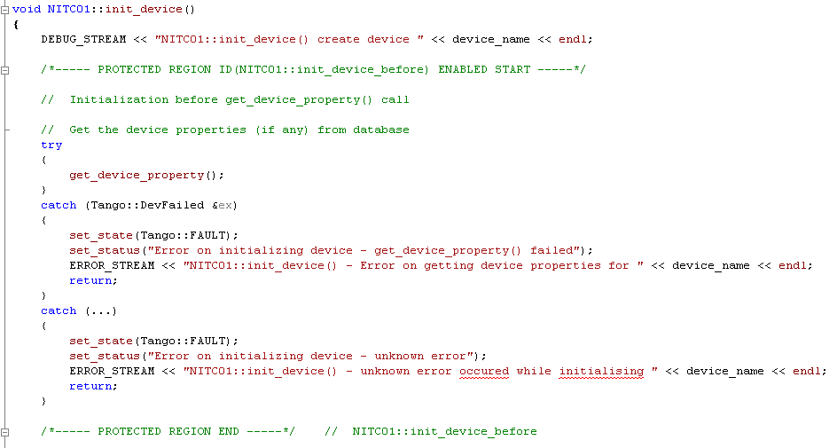

.. _ds_guidelines:

Guidelines
=====================

This chapter describes Guidelines for developing Device Servers.
The purpose of this document is not to rewrite the Tango documentation
but to propose the community an interpretation of Tango device
development.
The Tango Device Server Model is flexible and permits different interpretations
of how to implement Device Servers. 
However there is a right way of using Tango to implement device servers.
This chapter documents the best practices from experienced developers 
(some of them thee original developers of Tango) for device development.

Other ways of using Tango which do not follow these guidelines are possible
and can be useful but they might run into difficulties because Tango
was not designed to be use that way.
All developers should start off by first reading these guidelines and then
deciding if they want to ignore them or not. 
We strongly recommend you stick to them to make your Device Classes 
easier to share and your Tango control system as efficient as possible.

To this aim the document is divided in 3 main chapters:

1. Tango concepts
2. DeviceServers design consideration
3. Implementation good practices

About this document
-------------------

The document has been initiated within the collaborative framework
between SOLEIL and MAX-IV to define common software quality rules for
shared software between these 2 institutes. It has since been adopted by
the Tango community and is maintained for and by the community.

The objectives are therefore to enhance the general software quality of
Device Servers developed by the various sites using Tango. This will
also facilitate the reusability of developments between sites by allowing
finding “reliable off-the-shelves” Tango servers in public repositories.

**Last but not least, this document can be freely distributed (under the
Creative Commons license) to subcontractors, students, etc...**. 
Our hope is (*as all writers*) to have as many readers as possible!!

.. note:: 
    Throughout the rest of the document, the issued recommendations are specified as below:
    
    **The recommendation is to …**

.. note::
    **Important note:** The content of this document is generally
    independent of the programming language used. However, there are some
    “C++ oriented” recommendations. For Java and Python refer to the relevant 
    documentation for language specific issues. In the future we hope to add 
    guidelines for Java and Python too.

The present document refers to the Tango 8 or higher versions features.

**Licence**: This work is licensed under the **Creative Commons
Attribution 4.0 International License**. To view a copy of this license,
see http://creativecommons.org/licenses/by/4.0/.

Tango Concepts  
===============

The following explanations are from the :ref:`Tango Device
Server Model <deviceservermodel>`.

Tango Control system
---------------------

The Tango control system is an abstract concept which represents a set
of “microservices” based on a common technology: Tango. Tango is itself a
control/command oriented specialization of CORBA/ZMQ. CORBA supports the
concept of software bus running over a network interconnected machines.
It provides transparent access to any software object (or microservice)
connected to the bus and abstracts the notions of programming language
(C++, Java, Python…) and operating systems (Linux, Windows…) via a
binary network protocol (based on CORBA and ZMQ).

Tango hides the complexity of the underlying protocols to the
programmer, while adding specific control system features (alarms,
events, logging, data archiving…).

Device concept
---------------

The “device” is the core concept of Tango. This concept can be directly
linked to the notion of microservice: **1 device = 1 microservice**

A device can represent:

* An equipment (eg: a power supply),
* A set of equipments (eg: a set of 4 motors driven by the same controller),
* A set of software functions (eg: image processing),
* A group of devices representing a subsystem

The Tango Device allows making abstraction of the equipment’s nature:
the device hides the implementation specific details from the user who
does not need to care about communication protocols etc. and
provides the user with a model which speaks their languages e.g. physical 
or engineering parameters.

Hierarchy
----------

A Tango control system can be hierarchically organized.

At the lower level, we find elementary devices which are associated
with equipments.

-  e.g.: a vacuum pump, a motor, an I/O card

At higher levels, the devices are « logical ». These devices, based on
the lower-level devices, manage and represent a subset of the control
system. This is usually a synthetic view of a set of equipments with a
high-level steering (functions can perform sequences of actions on
several basic devices).

For example, a high-level device achieves “complex” features. This
device is usually bound to evolve regardless of the hardware. Therefore,
it is necessary to separate and segregate responsibilities related to
the logic functionality and those related to hardware interfaces.

It is possible to access any other device from every device at every level.

The following diagram illustrates the concept of hierarchy of devices:

.. figure:: media/image1.png
   
   The software bus view of devices

.. figure:: media/image2.png
   
   Hierarchical view of devices

Communication paradigms
------------------------

Tango offers three communication paradigm: synchronous, asynchronous
and publish-subscribe calls. 

In the synchronous and asynchronous paradigms
the call is initiated by the client who contacts the server. 
The server handles the client's request and sends
the answer to the client or throws an exception which the client
catches. This paradigm involves two network calls to receive a single answer and
requires the client to be active in initiating the request. The calls
initiated by the client may be done by 2 mechanisms:

.. note::

   1. the **synchronous** mechanism where the client waits (and is blocked) for the server to send the answer or until the timeout is reached

   2. the **asynchronous** mechanism where the clients send the request and immediately returns. 
      It is not blocked. It is free to do whatever it
      has to do like updating a graphical user interface. The client has
      the choice to retrieve the server answer by checking if the reply is
      arrived by calling an API specific call or by requesting that a
      call-back method is executed when the client receives the server
      answer.

If the client needs to know a value every time it changes
or at regular intervals then he is obliged to poll
the server for an update in a value every time. This is not efficient in
terms of network bandwidth nor in terms of client programming.
For this the publish-subscribe events communication is more efficient.

.. note::

   3. the **publish-subscribe** communication paradigm is a more efficient 
      and natural way of programming. In this paradigm the client registers 
      his interest once in an event (value). An event can be a change in value,
      a regular update at a fixed frequency or an archive event.
      After that the server informs  the client every time an event has occurred. 
      This paradigm avoids the client polling, frees it for doing other things, 
      is fast and  makes efficient use of the network.

Class, Device and Device Server
-------------------------------

Reminders
~~~~~~~~~

Sometimes, there are misuses of language regarding the concepts of:
device, device server and Tango class.

*  **DeviceClass** class: a class defining the interface and state machine.
*  **Device** class: a class implementing the device control.
*  **Device**: An instance of a Device class giving access to the services of
   the DeviceClass class.
*  **Device Server**: process in which one or more Tango classes are
   executed.

.. note::
   DeviceClass class is only used in C++ device classes

**These four concepts are closely related, and they express very
important concepts of Tango. 
Take time to clearly understand them!**

The diagrams below illustrate these concepts:

.. figure:: media/image3.png
   
   Tango Deployment

A Device Server can host several Device classes, each class can be
instantiated one or more times within the same device server. There are no
specific rules regarding the maximum number of classes or the maximum
number of instances operating within a single Device Server.

In particular cases, due to limitations imposed by the hardware
or software interface, it is not
always possible to run several instances of a Device class within the
same Device Server:

*  Case of a DLL’s use: some DLLs can’t be used by two threads of the
       same process.

In other cases, it is useful to have multiple devices running in the
same Device Server:

*  Case of motors: a single axis controller for 4 motors.

Device
~~~~~~

.. note::
   This is the basic entity of the control system. In the Tango world,
   everything is a **Device**.

A Tango Device must be “self-consistent”. In case it represents a subset
of the control system, it must enable the access to all the associated
features (unless otherwise specified). The limit of its
“responsibilities”, meaning “separation of concerns”, is clearly
defined: 1 Device = 1 microservice = 1 element of the system. The analogy
with object-oriented programming is straightforward.

A Device is a **microservice** made available to any number of unspecified
clients. Its implementation and/or behaviour must not make 
**assumptions about the nature and the number of its potential
clients**. In all cases, reactivity must be ensured (i.e. the
response time of the device, must be minimized).

A Device has an interface composed of commands and attributes, which
provides the service of the device. It also has “\ *properties*\ ”,
stored in the relational database, which are generally used as
configuration settings. These concepts are explained later in this
document.

Device attributes
~~~~~~~~~~~~~~~~~

Purpose of an attribute
^^^^^^^^^^^^^^^^^^^^^^^

Attributes correspond to physical quantities carried by the device. Any
value that you want available on the Tango bus is an attribute. For
example:

*  A device associated with a motor **has** a *position* attribute
   expressed in mm.
*  A device associated with a thermocouple **has** a *temperature*
   attribute expressed in Celsius (or any another suitable unit).

.. note:: 
   The main purpose of an attribute is to replace getters and
   setters.

*  For example: the position of a motor will be obtained by reading the
   associated attribute (position) and not by running a command like
   *get\_position.*
*  The data associated with the Tango attributes are the only values
   that can be archived. The Tango *archiving system* (HDB/TDB) doesn’t
   have any functions to archive the result of a command. Similarly,
   some mechanisms to store the experimental data (such as those
   implemented by the DataRecorder of SOLEIL) are only based on
   attributes.

Attribute Properties
^^^^^^^^^^^^^^^^^^^^^

A Tango attribute has a group of settings that describe it.

These configuration parameters are called AttributeProperties. They can
be considered as meta-data to enhance the semantic and describe the
data. They can be used by GUI clients for configuring their viewers in
the best manner and displaying extra information.

Those Attribute properties describe the attribute data and define some
of its behaviour such as alarm limits, units etc…

The first set of *Attribute Properties* are static metadata. They
describe the kind of data carried by the Tango Attribute. The static
metadata includes properties such as the name, the type, the dimension,
if the attribute is writable or not. These data are hardcoded, defined
for the whole life of the attribute and cannot be modified.

The second set of *Attribute Properties*, are dynamic. They describe
more precisely the meaning of the data and some behaviour. They are
used by GUI viewers to configure themselves. They can be modified at run
time.

All these metadata are hosted in the class itself and can be set by the
programmer or by a configuration in the Tango database.

Static attribute Properties
^^^^^^^^^^^^^^^^^^^^^^^^^^^^

*  **name**: the attribute name

   *  Type: string e.g : OutCurrent, InCurrent…
*  **data\_type**: the attribute data type

   *  Identifier of the Tango numeric type associated to the attribute:
      *DevBoolean, DevUChar, Dev[U]Short, Dev[U]Long, Dev[U]Long64,
      DevFloat, DevDouble, DevString, DevEncoded*
   *  Note: *Tango::DevEncoded* is the Tango type that encapsulates
      client data.
*  **data\_format**: describes the dimension of the data.

   *  Type: scalar (value), spectrum (1D array), image (2D array)
*  **writable**: defines 4 possible types of access. In practical, we
   can say that only 2 are really useful and answer to practically all
   the cases.

   *  READ, The attribute can only be read (e.g. a temperature)
   *  WRITE, The attribute can only be written ( to be used only in very
      specific cases. the READ\_WRITE is generally more suitable for
      real cases)
   *  READ\_WRITE, The attribute can be written and read (the most
      common case) e.g. The current of a powersupply, The position of an
      axis…
   *  READ\_WITH\_WRITE (deprecated, do not use)
*  **max\_dim\_x** : this property is valid only for data\_format
   spectrum or image. It gives the maximum number of element in the
   dimension X. e.g. the max length of a spectrum or the maximum number
   of rows of an image. This property is used to reserve memory space to
   host the data. Nothing prevent to have a real length much shorter
   that this maximum.
   
   *  e.g. 0 for a scalar, n for a spectrum of max n elements, n for an
      image of max n rows
*  **max\_dim\_y** : this property is valid only for data\_format
   image. It gives the maximum number of element in the dimension Y.
   e.g. the maximum number of columns of an image. This property is used
   to reserve memory space to host the data. Nothing prevent to have a
   real length much shorter that this maximum.

   *  0 for a scalar or a spectrum, n for an image of max n columns
*  **display\_level** : enables to hide the attribute regarding the
   client mode (expert or not)

   *  Tango::OPERATOR or Tango::EXPERT

.. warning::

   *writable\_attr\_name*: **deprecated since version 8, do not use anymore**

Modifiable attribute properties
^^^^^^^^^^^^^^^^^^^^^^^^^^^^^^^^

These properties carries out information regarding the display of a
value (they are editable while the device is running). Those
properties enhance the meaning of the attribute and should as much
as possible be defined by the device server programmer as default
value when known. For instance, in the general case, the programmer
knows the unit of the data and is able to describe it. Feeling the
attribute property at the development stage will allow all generic
clients to display the data in the best manner

*  **description**: describes the attribute

   *  Type: string e.g. “The powersupply output current”

*  **label**: label used on the GUIs

   *  Type: string e.g. “Output Current”, “Input Current”

*  **unit**: attribute unit to be displayed in the client viewer

   *  Type: string (eg “mA”, “mm”...)

*  **standard\_unit**: conversion factor to get attribute value into
   S.I (M.K.S.A)\_unit. Be careful this information is intended to be
   used ONLY by the client (.e.g ATKPanel uses it, but jive->test device
   does not)

   *  Type: string interpreted as a floating point value E.g. If the
      device attribute gives the current in mA, we have to divide by
      1000 to obtain it in Amp. Then we will set this property to 1E-03

*  **display\_unit**: used by the GUIs to display the attribute into a
   unit more appropriate for the user. Be careful this information is
   intended to be used ONLY by the client (e.g ATKPanel uses it, but
   JiveTest device does not).

   *  Type: string interpreted as a floating point value If the device
      attribute gives a current in mA. If we want to display it in
      microA, then we have to multiply by 1000 to obtain it in microAmp.
      Then we will set this property to 1000.0.

*  **format**: specifies how a numeric attribute value should be
   presented

   *  Type: string : e.g. « %6.3f »

   *  Note: we use a “printf” like syntax 

*  **min\_value** and **max\_value**: minimum and maximum allowable
   value. These properties are automatically checked at each execution
   of a write attribute. If the value requested is not between the
   min\_value and the max\_value, an exception will be returned to the
   client.

   *  Type: string interpreted as a floating point value (e.g. 10.1,
      1E01, 0.12.)

   *  Note: these properties are valid only for writable attributes

Attributes properties for ALARM configuration
^^^^^^^^^^^^^^^^^^^^^^^^^^^^^^^^^^^^^^^^^^^^^^^^^^^^

Tango provides an automatic way of defining alarms. An alarm
condition will switch the attribute quality factor to alarm and the
device state will automatically switched to ALARM in certain
conditions.  Four properties are available for alarm purpose.

*  **min\_alarm** and **max\_alarm**: Define the range outside which
   the attribute is considered in alarm. If the value of the attribute
   is > max\_alarm or < min\_alarm, then the attribute quality factor
   will be switched to ALARM.

*  **Delta\_val** and **delta\_t**: (*could also be called maximum
   noise and time constant*) Valid for a writeable attribute. Define a
   maximum difference between the set\_value and the read\_value of an
   attribute after a standard time.

    e.g. the voltage of a powersupply is set via a DAC and read via an
    ADC convertor. Both values are different due to various factors such
    as internal resistor or noise on the ADC. Furthermore when setting a
    voltage, the powersupply may need a certain time to establish its
    output voltage. The *delta\_val* property allows to define the limit
    of the acceptable difference between set and read values (noise
    threshold) and *delta\_t* defines the time the device needs to
    establish the voltage after the writing of the setpoint (time
    constant). When writing a new value of the attribute, if the read
    value is still not close enough from the set value after the time
    constant, the attribute quality factor will be set to ALARM.

    If these properties are not set, nothing is done. As soon as one of
    these properties is set, then the attribute quality factor is
    automatically calculated at each read and is taken into account by
    the default State attribute method. Device\_Impl.dev\_state(); The
    programmer should be aware of possible effect of these mechanisms in
    the response time of the State method. (Refer to chapter 1.14 of the
    present guide).

.. warning::

   The behaviour described above is only
   correct in the case the device’s method
   *Tango::Device\_[X]Impl::dev\_state()* is executed\ *.* In case of
   overwrite of the dev\_state() in the device code, it is recommended to
   finish the method by calling DeviceImpl::dev\_state();

.. warning::

   **min\_warning** *and* **max\_warning** : lower and upper bound
   for WARNING (deprecated since version 8)

Attributes properties related to Events configuration
^^^^^^^^^^^^^^^^^^^^^^^^^^^^^^^^^^^^^^^^^^^^^^^^^^^^^^

These settings are used for tuning the events related to the attribute.

*  *Rel\_change:* relative change in the value in percent

*  *Abs\_change*: absolute change in the value in the standard unit.

*  *Period*: period between two consecutive events

*  *Archive\_rel\_change*: relative change in the value

*  *Archive\_abs\_change*: absolute change in the value

*  *Archive\_period*: period between two consecutives events.

Particular case of a memorized attribute 
^^^^^^^^^^^^^^^^^^^^^^^^^^^^^^^^^^^^^^^^^

.. note::
   Memorised attributes are only possible with an attribute with WRITE or READ\_WRITE mode and
   SCALAR type

A memorized attribute can store its last written value in the database
(i.e. the last setpoint received by the device for this attribute can
optionally persist into the Tango database).

The stored value will be reloaded into the set value associated with
this attribute at device start-up and (optionally) upon each execution
of the “Init” command. The Tango code generator (Pogo) provides the
interface allowing the developer to select the expected behaviour.

.. note::
   **BE CAREFUL:** this mechanism has the following **behaviour**:

*  The writing of the memorized attributes is carried out after the
   function “init\_device”, executed by the Tango layer, and not by the
   Tango DeviceServer code. In case  an error occurs during the
   “init\_device” it cannot be caught by the Tango DeviceServer
   programmer.

*  If in the init\_device method an error occurs that causes a change of
   state in which the writing of an attribute is impossible, this error
   will prohibit the restoration of the memorized value of the
   attribute.

*  The order of reloading is deterministic but complex (*order of
   ClassFactory then device definition in database then attribute
   definition in Pogo*). Therefore relying on this order might have some
   side effects particularly in case attributes are modified through
   Pogo when attributes values are linked (*eg: sampling frequency and
   number of samples*).

.. warning::
 
   Performance issues may happen in case the setpoint is written at high
   frequency, the static Tango database is requested on each write of
   the memorized attribute. Since Tango 9 the database has been optimised
   for memorised attributes and it should be possible to update memorised
   attributes at 10 Hz without taking a performance hit. 

.. tip::

   If this standard Tango behaviour for reloading memorized values doesn’t
   fit your need, we recommend to code the reloading of attribute values
   yourself. This is especially true for fast (> 10 Hz)
   feedback loops which can trigger the writing of attributes at a high frequency.

Device commands
~~~~~~~~~~~~~~~

**A command is associated with an action. *On, Off, Start, Stop* are
commons examples.**

A Tango command has, optionally, ONE input argument and ONE output
argument.

The different types of data compatible for input and output are:

-  void, boolean, short, long, long64, float, double, string, unsigned
   short, unsigned long, unsigned long64

-  *1D array of the followings types :* char, short, long, long64,
   float, double, unsigned short, unsigned long, unsigned long64, string

-  State: enumeration, representing the different states described in
   the section on :ref:`Device State <device_state>`.

-  2 particular types: longstringarray and doublestringarray. These are
   structures including one array of long/double and one array of
   string.

The list of data types is fixed. If you need to add your
own data type then use the DevEncoded type and encode your own
data type. Or you can use the DevPipe communication channel (avaliable
since Tango 9). 

For each command to implement, it is essential to generate exceptions
depending on possible errors. The error handling is described more
in details below.

.. _device_state:

Device State
~~~~~~~~~~~~

State transitions
^^^^^^^^^^^^^^^^^

.. note::
   Every Tango device has a state implemented by *finite state machine*. 
   
The device state is a key element in its integration into the control
system. Therefore, **you should be very careful in the management of
state transitions** in the device implementation.

**The device state must, at any time, reflect the internal state of the
system it represents. The state should represent any change made by a
client’s request.**

This is crucial information. Indeed, the “clients” will primarily, or
only, use this information to determine the internal state of a system.

The available states are limited to:

-  ON, OFF, CLOSE, OPEN, INSERT, EXTRACT, MOVING, STANDBY, FAULT, INIT,
   RUNNING, ALARM, DISABLE, UNKNOWN

The main thing is to ensure a predictable behaviour of the device
regarding the state transitions.

For example:

-  Consider the case of a motor system. The client knows the motor state
   (*STANDBY, MOVING, FAULT,)* with a *polling* mechanism (periodic
   reading of the state attribute of the motor – instead of using the
   Tango event system).

    In such cases, this can easily lead to inconsistent behaviour due to
    inappropriate management of the state.

    A typical example is to launch an axis movement through the writing
    of the position attribute then the client is pending on the MOVING
    state (the motor is supposed to make a transition *STANDBY MOVING*).
    Such a method will only work if the writing of the position
    attribute switches the device state to MOVING *before* the return of
    the writing request of the position attribute. Otherwise, the client
    can read (non-zero probability) the STANDBY state, and interpret it
    as “movement ended” while this one had not even started!

    This behaviour is described in figure 4 below.

.. tip::
   
   The developer has to guarantee the clients the same behaviour regardless
   the type of state monitoring (polling or events). This relates to the
   above rule: **Do not make assumptions about the nature of the clients!**

The state transitions and the “associated guarantees” must be
documented. In the previous example, rereading the STANDBY state after
performing any movement must ensure that the required movement is
completed (and not that it has not yet been started!!).

.. figure:: media/image4.png
   
   Example of State transitions

Properties
~~~~~~~~~~

Concepts
^^^^^^^^

By default Tango is based on a relational database (MySQL) to store
configuration information for devices namely the *properties*.

The properties are used to configure a device without changing the
Tango class code. Taking an axis controller as example, the controller
must be configured for the motor mechanics according to the
characteristics of the actuator and the movements to achieve.

Configuration properties are available on different levels:

1. **The device level:** These are properties to configure the device
   itself and its attributes. The device properties configure the device
   with the necessary set-up information during initialisation.
   Attribute properties are used to configure alarms or specify the way
   the attribute value is displayed to the user (Label, Format,
   Unit...).

2. **The class level:** Device or attribute properties configured at the
   class level are valid for all instances of a class. A property
   defined on the class level will be overwritten by a property of the
   same name on the device level.

3. **Free properties:** These are configuration values which are not
   attached to any device or class and can be freely used by
   programmers.

Class level and device level properties are automatically loaded during
device initialisation when starting-up a device server or calling the
“Init” command. The reading and writing of free properties must be
handled by the programmer.

Configuration properties can have the following data types:

-  boolean, short, long, float, double, unsigned short, unsigned long,
   string

-  array of: short, long, float, double, string

On top of those basic concepts, device and class level properties can be
initialised with default values which are entered, for example, with
:ref:`Pogo <Pogo_manual>` at the interface creation time. 
Default values are stored in the
device server code and are overwritten when another value is found in
the configuration database.

It is necessary to assign a default value for every property. This value
will be used when the property is not defined in the Tango database. If
a default value for a device property does not make sense, the property
should be declared as mandatory. 
A mandatory property has to have a value configured in the Tango
database. If no value is configured, the device initialisation will
stop with an exception on the missing property value.

Device property vs memorized attributes
^^^^^^^^^^^^^^^^^^^^^^^^^^^^^^^^^^^^^^^

In some cases, you could be tempted to use a property for a memorized
attribute and vice-versa. It is important to distinguish the function of
each, and use them wisely.

-  The use of a property must be limited to configuration data which
   value doesn’t change at runtime (the IP address of equipment for
   example).

-  The memorized attributes are reserved for physical quantities subject
   to change at runtime (*attribute read/write*) for which you want to
   retain (store) the value from one execution to the other.

    e.g. speed or acceleration on a motor.

.. tip::
   In the case you want to manually manage the memorization of the
   attribute set points, you should use an attribute property called
   *\_\_value* (as natively done by Tango).

How to configure a new device
^^^^^^^^^^^^^^^^^^^^^^^^^^^^^

To set-up a new device you need to know about all the device properties
and their values which must be configured to make the device work. You
need to have a description on the property which should indicate clearly
its use. Also you need to know about a specified default value.

When creating the device interface with Pogo a description and a default
value can be entered for every device property. This information is used
by the device installation wizard (available with Jive) to guide you
through the configuration.

When creating a new server start the wizard from the Tools menu ->
Server Wizard. It allows you to create a new device and to initialise it
property by property. For every property the description is displayed
and the default value can be viewed. To use the wizard on an already
existing device you can right click on the device and choose Device
Wizard. You will be guided again through all the properties of the
device. At the end the device can be re-started when necessary. Because
the wizard is part of Jive, you can test the device configuration
immediately.

Tango Device Design
===================

Elements of general design
--------------------------

Reusability
~~~~~~~~~~~

In a Tango control system, each device is a software component
potentially reusable.

It is necessary to:

-  Systematically evaluate prior the coding of a device, the
   possibility of reusing a device available in the code
   repositories (Tango community, local repository), in order to
   avoid several implementations of the same equipment.

-  Design the device as reusable/extensible as possible because it may
   interest the others developers in the community.

    As such, the device must be:

-  Configurable: (e.g.: no port number “hard coded”, but use of a
   parameter via a property),

-  Self-supporting: the device must be usable outside the private
   programming environment (eg: all the necessary elements to use the
   device (compile, link) must be provided to the community). The use of
   the GPL should be considered, and the use of proprietary libraries
   should be avoided if possible

-  Portable: the device code must be (as much as possible) independent
   of the target platform unless it depends on platform specific
   drivers,

-  Documentation in English

Generic interface programming
~~~~~~~~~~~~~~~~~~~~~~~~~~~~~

The device must be as generic as possible which means the definition of
its interface should

-  Reflect the service rather its underlying implementation. For
   example, a command named “WriteRead” reflects the communication
   service of a bus (type: message exchange), while a command named
   “NI488\_Send” reflects a specific implementation of the supplier.

-  Show the general characteristics (attributes and commands) of a
   common type of equipment that it represents. For example, a command
   ”On” reflects the action of powering on a PowerSupply , while a
   command named “BruckerPSON” reflects a specific implementation which
   must be avoided.

The device interface must be service oriented, and not implementation
oriented.

Abstract interfaces 
~~~~~~~~~~~~~~~~~~~~

Singleton device
~~~~~~~~~~~~~~~~

Tango allows a device server to host several devices which are
instantiations of the same Tango class.

However, in particular case some technical constraints may forbid it. 
In this case, the Device Server programmer must anticipate
it in the device design phase (add for example a static variable
counting device instances or other) to detect this misconfiguration. For
example, it can authorize the creation of a second instance (within the
meaning of the device creation) but systematically put the state to
FAULT (in the method init\_device) and indicate the problem in the
Status.

In the case where technical constraints prohibit the deployment of
multiple instances of a Tango device within the same device server, the
developer has to ensure that only one instance can be created and
inform the user with a clear message in case more than one
device is configured in the database.

Device states
~~~~~~~~~~~~~

When designing the device, you should clearly define the state machine
that will reflect the different states in which the device can be, and
also the associated transitions.

The state machine must follow these rules:

-  At any time, the device state must reflect the internal state of the
   system it represents.

-  The state should represent any change made by a client’s request.

-  The device behaviour is specified and documented.

Device interface definition
---------------------------

The first step in designing a device is to define the commands and the
attributes via Pogo (use Pogo to define the Tango interface).

Except in (very) particular cases, always use an attribute to expose the
data produced by the device. The command concept exists 
(see :ref:`Device Commands <device_commands>`)
but its use as an attribute substitute is prohibited. Example: a motor
must be moved writing its associated ‘position’ attribute instead of
using a ‘GotoPosition’ command.

The choice will be made following these rules:

-  Attribute: for all values to be presented to the “client”. **It is
   imperative to use the attributes and to not use Tango commands that
   would act like a get/set couple.**

-  Command: for every action, of void-void type in most cases.

Any deviation from these rules must be justified in the description of
the attribute or command particular case.

Service availability
--------------------

From the operator perspective, the “\ **response time**\ ” or
“\ **reactivity**\ ” (i.e. the device is always responsive) is **the** reference
metric to describe the performance of a device. Ideally, the device
implementation must ensure the service availability regardless of the
external client load or the internal load. For the end user, it is
always very unpleasant to suffer a Tango timeout and receive an
exception instead of the expected response.

The response time of the device should be minimised and in any case
lower than the default Tango timeout of 3 seconds.

If the action to be performed takes longer than that, execution should
be done asynchronously in the Tango class: its progress being reported
in the state/status.

Several technical solutions are available to the device developer to
ensure service availability:

-  Use the Tango polling mechanism,

-  Use a threading mechanism, managed by the developer.

Tango polling mechanism
~~~~~~~~~~~~~~~~~~~~~~~

Polling interest
^^^^^^^^^^^^^^^^

The polling mechanism is detailed in the Tango documentation 
:ref:`Device Polling <device_polling>`.

Tango implements a mechanism called *polling* which alleviates the
problem of equipment response time (which is usually the weak point in
terms of performance). The response time of a GPIB link or a RS-232 link
is usually one to two orders of magnitude higher than the performance of
the Tango code executed by a client request.

Polling limitations
^^^^^^^^^^^^^^^^^^^

From the perspective of the device activity, the polling is in direct
competition with client requests. The client load is therefore competing
with the polling activity.

This means that polling activity has to be tuned in order to keep some
free time for the device to answer client requests. Do not try to poll a device
object with a polling period of let say 200 mS if the object access time
is 300 mS (*even if Tango implements some algorithm to minimize the bad
behavior of such badly tuned polling*).

For polled Tango device objects (attribute or command), client reading
does not generate any activity on the device whatever the client number.
The data are returned from the so-called polling buffer instead of
coming from the device itself. Therefore, an obvious rule is to poll the
key device object (state attribute, pressure attribute for a vacuum
valve...)

The recommendation for device polling tuning is to keep the device free
40% of time.

Let's take an example: for a power supply device, you want to poll the
device state and its current attribute which for such a device are the
device key objects.

-  State access needs 100 mS while current attribute reading needs 50
   mS.

-  Because, you want to poll these two objects, time required on the
   device by the polling mechanism will be 150 mS (100 + 50).

-  In order to keep the 40% ratio, tune the polling period for this
   device to 250 mS.

-  The device is then occupied by the polling mechanism during 150 mS
   (60 %) but free for other client activity during 100 mS (40 %).

Device polling is easily tunable at run time using Jive and/or Astor
Tango tools.

Threading mechanism
~~~~~~~~~~~~~~~~~~~

*Threading* is a possible solution for the load problem: a thread
(managed by the device developer) supports communication with the
material (*polling* or other) and the data obtained are put in the
“cache”. You can now produce the “last known value” to the client at any
time and optimize the response time. This approach, however, has a limit
where it is necessary to reread the hardware to assure clients that the
returned value is the system “current state”.

For a C++ device, the implementation of a threading mechanism can be
done via the *DeviceTask* class from the *Yat4Tango library*. This class
owns a thread associated with a FIFO message list. Processing messages
can be synchronous or asynchronous.

See the complete example in the appendix for the implementation
details.

When the design of the Tango class requires threading:

* in case of simple thread usage, in C++ the recommendation is to use a C++11 thread

* In case of acquisition thread with messages exchange in C++ the recommendation is to 
  use Yat4Tango::DeviceTask class.

Tango device implementation
===========================

General rules
-------------

Language
~~~~~~~~

The Tango community is international and the developments could be
shared with the community, so it is recommended to use English for documenting a
device development.

English will be used for:

-  The interfaces definition (attributes and commands),

-  The device documentation (online help for command usage and
   attributes description),

-  The comments inserted in the code by the developer,

-  The error messages,

-  The name of variables and internal methods added by the developer.

The choice of the language used for the user’s documentation of the
device server (“Device Server User’s Guide”) is left free, to focus on
the editorial quality. In the case of a joint development with another
institute, English will be used.

Types
~~~~~

The types used for the device interface definition are Tango types
(Tango::DevDouble, Tango::DevFloat …). These types are presented by Pogo
and are not modifiable.

The types used by the developer in its own code are left free to choose,
as long as they are not platform specific. Standard types of the
language used (Boolean, int, double …), Tango types or types from a
common library (Yat, Yat4Tango for C++) can potentially be used.

Direct conversions from the C++ type long to Tango::DevLong are only
supported on 32-bit platforms and should be avoided.

Generated code
~~~~~~~~~~~~~~

The automatically generated code by Pogo must not be modified by the
developer.

The developer must include its own code in the “PROTECTED REGION”
specified parts.

Device interface 
-----------------

.. _naming_rules:

Naming rules
~~~~~~~~~~~~

Having homogeneous conventions for naming attributes, commands and
properties is a good way to promote DeviceServers reuse inside the Tango
collaboration.

In fact it makes the development done by another institute easier to
understand and integrate in another Control System.

Class name
^^^^^^^^^^

The Tango class name is obtained by concatenating the fields that
compose it – each field beginning with a capital letter:

Eg : MyDeviceClass

Device attributes
^^^^^^^^^^^^^^^^^

The device command and attributes names must be explicit and should
enable to quickly understand the nature of the attribute or the command.

-  Eg: for a power supply, you will have an attribute “outputCurrent”
   (not OC1) or a command “ActivateOutput1” (not ActO1).

The nomenclature recommendations are in the section :ref:`Naming Rules <naming_rules>`.

**The attribute naming recommendations are**:

-  Name composed of at least two characters,

-  Only alphanumeric characters are allowed (no underscore, no dashes),

-  Start with a **lowercase** letter,

-  In case of a composite name, each sub-words must be capitalized
   (except the first letter),

-  Prohibit any use of vague terms (eg: readValue).

.. _device_commands:

Device Commands
^^^^^^^^^^^^^^^

The recommendations are the same as those proposed for an attribute, except for the first letter of the name.

**The command naming recommendations are:**

-  Name composed of at least two characters,

-  Only alphanumeric characters are allowed (no underscore, no dashes),

-  Start with a **uppercase** letter,

-  In case of a composite name, each sub-words must be capitalized,

-  Prohibit any use of vague terms (eg: Control).

Device properties
^^^^^^^^^^^^^^^^^

The recommendations are the same as those proposed for a command.

**The property naming recommendations are:**

-  Name composed of at least two characters,

-  Only alphanumeric characters are allowed (no underscore, no dashes),

-  Start with a **uppercase** letter,

-  In case of a composite name, each sub-words must be capitalized,

-  Prohibit any use of vague terms (eg: Prop1).

Device attributes nomenclature
~~~~~~~~~~~~~~~~~~~~~~~~~~~~~~

It is a good practice that a particular signal type is always named in a
similar way in various DeviceServers.

For example the intensity of a current should always be name
“\ ***intensity***\ ” (and not “\ ***intens***\ ”,
“\ ***intensity***\ ”, “\ ***current***\ ”,”\ ***I***\ ” depending on
the DeviceServers).

This allow the user to quickly make the link between the software
information and the physical sensor and reciprocally.

Data types choice
~~~~~~~~~~~~~~~~~

Always use data types consistent with the underlying information

-  Unsigned integer must be used for the physical quantities that are
   suitable.

   -  Eg: A number of samples numSamples, where negative values have no
      meaning, will be a Tango::DevULong (unsigned integer 32 bits) and
      not a Tango::DevLong (signed integer 32 bits).

   -  Similarly, in such a case, the use of a floating point number is
      to be prohibited, non-integer values having no meaning.

-  This rule is applicable to input/output arguments of commands.

Interface level choice
~~~~~~~~~~~~~~~~~~~~~~

The choice between the *Expert* or the *Operator* level for an interface
must be thoughtful.

Only necessary and sufficient commands for a nominal control of the
equipment must be accessible to the *Operator* level. The commands for
fine control of the equipment (eg: metrology, maintenance, unit test)
must only be accessible to the *Expert* level.

Pogo use
--------

Device generation
~~~~~~~~~~~~~~~~~

The use of Pogo is mandatory for creating or modifying the device
interface.

Tango is constantly evolving, this tool will support all or part of the
porting, associated to the kernel and their consequences on the IDL
interface.

In addition, it simplifies maintenance / development operations.

Every command, attribute, property or device state must be fully
documented; this documentation is done via the Pogo tool.

Specifically, when creating an attribute with Pogo, the entire
configuration of the attribute must be fully filled in by the developer
(maximum possible) to avoid ambiguities.

Similarly, the states and their transitions must be described with
precision and clarity.

In fact:

-  In operation, this documentation will be the reference for
   understanding the device behaviour. Remember that the operator will
   have this information with the generic tools (like “\ *Test
   Device*\ ” from “\ *Jive*\ ”).

-  The html documentations generated by Pogo can also be accessed from a
   local server (peculiar to the institute).

-  Consider also filling in the alarm values.

   -  Eg: set the alarm values according to the specifications of a
      power supply, ie, 0V-24V for the voltage, or 0A-3A for the output
      current.

    Example for a temperature reading:

Attributes generation in C++
~~~~~~~~~~~~~~~~~~~~~~~~~~~~

In C++, Pogo automatically generates **pointers** to the data associated
with the attributes values (ie a pointer is generated for the read
part). The use of these pointers is not mandatory. The developer is free
to use his own data structure in the attribute value affectation.

Internal device implementation
------------------------------

Separation between the Tango interface and the internal system function
~~~~~~~~~~~~~~~~~~~~~~~~~~~~~~~~~~~~~~~~~~~~~~~~~~~~~~~~~~~~~~~~~~~~~~~

Don’t forget that the Tango interface is only a means to insert a microservice
in a control system. Therefore, it is necessary to think the device
internal design like any other application and just add the Tango as an
interface on top of it.

As a rule of thumb if the code implemented within the Pogo markers is
too long, a good practice is to move it to another class. Then Pogo
generated methods will be only a few lines of code long.

In practice, it is necessary to avoid mixing the generated code by Pogo
and the developer’s one.

The Tango sub-class inherited from *Tango::DeviceImpl[\_X]* instantiates
a class derived from the model object implementing the system, and
ensure the replacement between the external requests (clients) and the
implementation class(es).

In the choice of data structures, we are talking about those of the
developer’s object model, we will consider the technical constraints
imposed by Tango and/or the underlying layers (CORBA/ZMQ). The idea here is
to avoid copy and/or reorganization of the data when transferred to the
client. For this, the developer needs to know/master the underlying
memory management mechanism (especially in C++). The Tango documentation
contains a dedicated chapter “\ *Exchanging data between client and server”*.

Details on method for accessing the hardware: always\_executed\_hook versus read\_attr\_hardware
~~~~~~~~~~~~~~~~~~~~~~~~~~~~~~~~~~~~~~~~~~~~~~~~~~~~~~~~~~~~~~~~~~~~~~~~~~~~~~~~~~~~~~~~~~~~~~~~

It is essential to master the concepts implemented by these two methods
(common methods for all Tango devices).

It is also necessary to clearly identify, in the design phase, the
possible consequences of implementing these two methods on the device
behaviour (remember that they are initially just empty shells generated
by Pogo).

-  *Always\_executed\_hook()* method is called before each command
   execution or each reading/writing of an attribute (*but it is called
   only once when reading several attributes: see calling sequence
   below*)

-  *Read\_attr\_hardware()* is called before each reading of
   attribute(s)( *but it is called only once when reading several
   attributes: see calling sequence below)*. This method aims to
   optimize (minimize) the equipment access in case of simultaneous
   reading of multiple attributes in the same request.

Reminder about the calling sequence of these methods:

-  *Command execution*

   -  1 – always\_executed\_hook()

   -  2 – is\_MyCmd\_allowed()

   -  3 – MyCmd()

-  *Attribute reading*

   -  1 – always\_executed\_hook()

   -  2 – read\_attr\_hardware()

   -  3 – is\_MyAttr\_allowed()

   -  4 – read\_MyAttr()

-  *Attribute writing*

   -  1 – always\_executed\_hook()

   -  2 – is\_MyAttr\_allowed()

   -  3 – write\_MyAttr()

-  *Attributes reading*

   -  1 – always\_executed\_hook()

   -  2 – read\_attr\_hardware()

   -  3 – is\_MyAttr\_allowed()

   -  4 – read\_MyAttr()

-  *Attributes writing*

   -  1 – always\_executed\_hook()

   -  2 – is\_MyAttr\_allowed()

   -  3 – write\_MyAttr()

When reading the sequence above, we understand why the mastery of these
concepts is important. Particularly, having “slow code” in the
*MyDevice::always\_executed\_hook* method can have serious consequences
on the device performance.

.. warning::

   There is no obligation to use the *read\_attr\_hardware*
   method; it depends on the equipment to drive and its communication
   channel (Ethernet, GPIB, DLL). You can have a call to the equipment in
   the code of each attribute reading method.

    Example: For an attribute “temperature”, of READ type, we can insert
    the call to the equipment in the generated attribute reading method
    “\ *read\_Temperature*\ ” instead of “\ *read\_attr\_hardware*\ ”.

Static database as persistent data storage
~~~~~~~~~~~~~~~~~~~~~~~~~~~~~~~~~~~~~~~~~~

As noted above the Tango database can (in some cases) be
used to ensure persistence of set values, to store the value as a property 
(of device or attribute).

However, this practice should be reserved for special cases that don’t
require writing at high frequency. An over-solicitation of the Tango
database will penalize the entire control system.

It is therefore recommended to use a property for storage only for
methods that are performed rarely, compared to other functions.

For example: storage of calibration operations results

In the general case, we recommend to:

-  Use a property to store configuration data,

-  Use a memorized attribute to store values changing during the
   execution,

-  Use a memorized attribute to store values that you want to re-inject
   during a new execution of the device.

Device state management
-----------------------

States choice
~~~~~~~~~~~~~

In Tango, as already said, the state is seen as an enumerated type with a
fix number of values. These states have an implicit default meaning and
are not equivalent. Furthermore a color code is associated to each state
and is used in the main GUI tools to have a unified manner of
representing the state of equipment.

+-----------+--------------------+--------------------------------------------------------------------------+
| State     | Colour             | Meaning                                                                  |
+===========+====================+==========================================================================+
| UNKNOWN   | grey               | | The device cannot retrieve its state. It is the case when there is a   |
|           |                    | | communication problem to the hardware (network cut, broken cable etc…).|
|           |                    | | It could also represent an incoherent situation                        |
+-----------+--------------------+--------------------------------------------------------------------------+
| INIT      | beige              | | This state is reserved to the starting phase of the device server.     |
|           |                    | | It means that the software is not fully operational and that the user  |
|           |                    | | must wait                                                              |
+-----------+--------------------+--------------------------------------------------------------------------+
| FAULT     | red                | | The device has a major failure that prevents it to work. For instance, |
|           |                    | | A powersupply has stopped due to over temperature A motor cannot move  |
|           |                    | | because it has fault conditions. Usually we cannot get out from this   |
|           |                    | | state without an intervention on the hardware or a reset command.      |
+-----------+--------------------+--------------------------------------------------------------------------+
| DISABLE   | magenta            | | The device cannot be switched ON for an external reason. e.g. the      |
|           |                    | | powersupply has it’s door open, the safety conditions are not          |
|           |                    | | satisfactory to allow the device to operate                            |
+-----------+--------------------+--------------------------------------------------------------------------+
| OFF       | white              | | The device is in normal condition but is not active. e.g the           |
|           |                    | | powersupply main circuit breaker is open; the RF transmitter has no    |
|           |                    | | power etc…                                                             |
+-----------+--------------------+--------------------------------------------------------------------------+
| STANDBY   | yellow             | | The device is not fully active but is ready to operate. This state does|
|           |                    | | not exist in many devices but may be useful when the device has an     |
|           |                    | | intermediate state between OFF and ON. E.g the main circuit breaker is |
|           |                    | | closed but there is no output current. Usually Standby is used when it |
|           |                    | | can be immediately switched ON. While OFF is used when a certain time  |
|           |                    | | is necessary before switching ON.                                      |
+-----------+--------------------+--------------------------------------------------------------------------+
| MOVING    | light blue         | | The device is in a transitory state. It is the case of a device moving |
|           |                    | | from one state to another.( E.g a motor moving from one position to    |
|           |                    | | another, a big instrument is executing a sequence of operation, a      |
|           |                    | | macro command is being executed.)                                      |
+-----------+--------------------+--------------------------------------------------------------------------+
| ON        | green              | | This state could have been called OK or OPERATIONAL. It means that the |
|           |                    | | device is in its operational state. (E.g. the powersupply is giving its|
|           |                    | | nominal current, the motor is ON and ready to move, the instrument is  |
|           |                    | | operating). This state is modified by the Attribute alarm checking of  |
|           |                    | | the DeviceImpl:dev\_state method. i.e if the state is ON and one       |
|           |                    | | attribute has it’s quality factor to ALARM, then the state is modified |
|           |                    | | to ALARM                                                               |
+-----------+--------------------+--------------------------------------------------------------------------+
| ALARM     | orange             | | The device is operating but one of this attribute is out of range.     |
|           |                    | | It can be linked to alarm conditions set by attribute properties or a  |
|           |                    | | specific case. (E.g. temperature alarm on a stepper motor, end switch  |
|           |                    | | pressed on a steppermotor, up water level in a tank, etc…) In alarm,   |
|           |                    | | usually the device does it’s job but the operator has to perform an    |
|           |                    | | action to avoid a bigger problem that may switch the state to FAULT.   |
+-----------+--------------------+--------------------------------------------------------------------------+
| RUNNING   | dark green         | | This state does not exist in many devices but may be useful when the   |
|           |                    | | device has a specific state above the ON state. (E.g. the detector     |
|           |                    | | system is acquiring data, An automatic job is being executed).         |
|           |                    | | Note that this state is different from the MOVING state. It is not a   |
|           |                    | | transitory situation and may be a normal operating state above the ON  |
|           |                    | | state.                                                                 |
+-----------+--------------------+--------------------------------------------------------------------------+
| OPEN      | green              | | Synonym of ON state. Can be used when ON is not adequate for the device|
|           |                    | | e.g case of a valve, a door, a relay, a switch.                        |
+-----------+--------------------+--------------------------------------------------------------------------+
| CLOSE     | white              | | Synonym of OFF state. Can be used when OFF is not adequate for the     |
|           |                    | | device e.g case of a valve, a door, a relay, a switch.                 |
+-----------+--------------------+--------------------------------------------------------------------------+
| EXTRACT   | green              | | Synonym of ON state. Can be used when ON is not adequate for the device|
|           |                    | | Case of insertable/extractable equipment, absorbers, etc…              |
|           |                    | |                                                                        |
|           |                    | | This state is here for compatibility reason we recommend to use ON or  |
|           |                    | | OPEN when possible.                                                    |
+-----------+--------------------+--------------------------------------------------------------------------+
| INSERT    | white              | | Synonym of OFF state. Can be used when OFF is not adequate for the     |
|           |                    | | device. Case of insertable/extractable equipment, absorbers, etc…      |
|           |                    | |                                                                        |
|           |                    | | This state is here for compatibility reason we recommend to use OFF or |
|           |                    | | CLOSE when possible.                                                   |
+-----------+--------------------+--------------------------------------------------------------------------+

Unless strictly specified, the developer is free to use the Tango
state she considers appropriate to the situation, with all the
subjectivity involved.

The only practice that ensures overall consistency is to use a limited
number of Tango states, especially for a family of equipment.

It is recommended for an equipment of type motor, slit, monochromator
and more generally for any equipment that can change his position, to
use the “MOVING” state when the equipment is in “movement” toward his
set point.

Semantics of non-nominal states 
~~~~~~~~~~~~~~~~~~~~~~~~~~~~~~~~

Although the developer is free to choose the device states, we must
define a common error state for all the devices.

In general, any dysfunction is associated with the state *Tango::FAULT*.

The use of the *Tango::ALARM* state should be reserved for very special
cases where it is necessary to define an intermediate state between
normal operation and fault. Its use must be documented via Pogo in order
to define the semantics.

In the case of a problem occurring at initialization, it is recommended
to set the device state to FAULT.

For the init\_device method, we recommend:

- If the initialization method is long, thread it.
- The device state INIT must be used only in the start-up of the device.

The device states changes when the init execution is over.

Semantics recommended for FAULT and ALARM states is as follows:

* UNKNOWN (grey): communication problem with the equipment or the “sub”-devices which prevents the device to really know his real state
* FAULT (red): A problem which prevents the normal functioning (including during the initialization). Getting out from a FAULT state is possible only by repairing the cause of the problem and/or executing a Reset command.
* ALARM (orange): the device is functional but one element is out of range (bad parameters but not preventing the functioning, limit switch of a motor). An attribute is out of range.

State machine management
~~~~~~~~~~~~~~~~~~~~~~~~

Pogo or developer code 
^^^^^^^^^^^^^^^^^^^^^^^

Tango has a basic management of its state machine. *Is\_allowed* methods
filter the external request depending on the current device state. The
developer must define the device behaviour (regarding its internal
state) via Pogo.

By default, any request (reading, writing, or command execution) is
authorized whatever the current device state is.

The example below illustrates two ways for the state machine management
of a device (here NITC01) in C++:

-  Managing the “On” command via Pogo

-  Managing the reading of the attribute “temperature” directly in the
   code

However, the Pogo implementation is “basic”. If, for example, the
execution of the “On” command on a power supply is prohibited when the
current state is “\ *Tango::ON*\ ”, then the Tango layer, generated by
Pogo, will systematically trigger an exception to the client. From the
operator perspective, this may surprise.

In such a case, it is recommended to authorize the command but to ignore
it

Particular case : FAULT state
^^^^^^^^^^^^^^^^^^^^^^^^^^^^^

**The *Tango::FAULT* state shouldn’t prohibit everything.** The
attributes and/or commands that are valid and/or allows the device to
get out of the *Tango::FAULT* state must remain accessible.

For example, in some cases, when a device used several elementary
devices, its state is a combination of the elementary devices states. If
one of them is in “FAULT”, we must be able to execute commands on others
elementary devices, and, in all cases, have a command to get out of this
state.

The transition to a “FAULT” state needs reflection and a clear
definition of the device management in this state and the output
conditions of this state.

Init and error acknowledgement
^^^^^^^^^^^^^^^^^^^^^^^^^^^^^^

A common mistake is to associate the generic command MyDevice::Init to
an acknowledgement mechanism for the current defect.

**The execution of the *Init* command must be reserved to the device
re-initialization** (hardware reconnection after a reboot or
reconfiguration following a property modification).

Any device that requires an acknowledgement mechanism must have a
dedicated command (like *Reset* or *AcknowledgeError*).

Other implementations
^^^^^^^^^^^^^^^^^^^^^

You can also create a specific state machine, without using Tango types,
in the interface class with the device. Thus, we use this state machine
to determine the Tango state of the device. The aims here is to define
an internal state machine (with a design pattern “state” for example)
then do a mapping with the existing Tango states to determine the device
state.

The developer also has the ability to override the *State* and *Status*
methods in order to centralize, in a unique method, the management of
the internal device state, which simplifies the update of this
fundamental information.

Logging management
------------------

The importance of rigorous logging management
~~~~~~~~~~~~~~~~~~~~~~~~~~~~~~~~~~~~~~~~~~~~~

The introduction of logging in the device code enables easy development,
bug research and the user understanding of the device operations.

The device developer must always use the facilities offered by the
*Tango Logging Service* to produce “Runtime” messages, facilitating the
understanding of the device operations. Implementations classes can
inherit *Tango::LogAdaptater* to redirect the logs to the common
service.

The rules to follow are:

* Logs to the console are prohibited. The developer must use the logging
  stream proposed by Tango (there is a stream for every logging level, the
  levels being inclusive in the order specified below). : 
  *DEBUG\_STREAM, INFO\_STREAM, WARN\_STREAM, ERROR\_STREAM, FATAL\_STREAM*

*  It is important to use the right level of *logging* : on a higher
   level than DEBUG, the device should be a little wordy. Beyond the
   INFO level, it should produce only critical logs.

Recommendations of use:

-  DEBUG\_STREAM : developer information (route trace)

-  INFO\_STREAM : user information (measure, start/stop of a process)

-  WARN\_STREAM : warning (eg deprecated operation)

-  ERROR\_STREAM : general error

-  FATAL\_STREAM : fatal error, shutdown

It is important to use these *streams* early in the development. They
allow an easier debugging.

**You shouldn’t have to modify the code to add traces.**

-  Eg: use a debug\_stream level for the input parameters, the display
   of a conversion result, the return code from a DLL function…

It is also recommended to adopt a unified formalism for logs, for
example:

-  “<class\_name>::<method\_name>() - <text trace with parameter
   (eventually)>”

    Example of using different logs levels in C++:

It is also possible to redirect the stream to a file (via Jive). This
can be useful in the case of “random” bugs, for which a long log is
required.

Implementation
~~~~~~~~~~~~~~

It is not mandatory, but highly recommended to add an attribute named
“log” in the device interface, strings spectrum type, which tracks all
the internal activity of the device (as defined in Tango Logging).

-  In C++, the class *Yat4Tango::InnerAppender* implements this
   functionality based on a dynamic attribute (no need to use Pogo).

-  This system facilitates the recovery of errors and therefore the
   problems diagnosis. Problem solving will be faster and optimized.

-  This feature is in particular very interesting for devices that
   manage automatic processes (like doing scans,..) which involve other
   devices. The operator has then an easy access through this “log”
   attribute to the behaviour and decisions taken by the device.

Example of using C++ (look at the YAT documentation for further
explanations:

    In the header file of the device

-  Declaration of the service to use

In the source code of the device

-  init\_device method: initialization of the “innerAppender”

-  delete\_device method: deletion of the “innerAppender”

.. figure:: media/image14.png

Error handling
--------------

The importance of rigorous error handling
~~~~~~~~~~~~~~~~~~~~~~~~~~~~~~~~~~~~~~~~~

The purpose of this paragraph is based on a statement on the Tango
developers practice. Indeed, the error handling is often overlooked. A
good error handling means easier debugging and maintenance.

**This part is important**, it is essential for the coding quality.
These concepts are detailed in the Tango documentation referenced 
*“Reporting Error”*.

Typical cases to avoid:

-  A device doesn’t behave as expected but there is no indication why.

-  The device is in FAULT state but the *Status* (the attribute) gives
   no indication on the problem nature, or worse, a bad indication (thus
   guiding the users in a wrong trail, with a loss of time and energy).

-  The error messages are written in the jargon of the developer or the
   system expert.

The developer has to ensure:

-  That any exception is caught, completed (Tango allows it) and spread
   (use of the rethrow\_exception method),

-  If an error occur it must be logged using the Tango Logging Service

-  That the return code of a function is always analyzed,

-  That the device *Status* is always coherent with the *State,*

-  That the error messages are understandable for the final user and
   that they are supplemented by *logs* (*ERROR level, use of the
   error\_stream macro*). The *Status* is the indicator that will help
   the user to find the error reason.

-  **Ignore the “ideal situation”:** In operation, the ideal setting is
   often jeopardized.

   -  Eg: use of communication sockets: anticipate all the common
      communication problems: cable not connected, equipment off,
      sub-devices not started or in FAULT.

Implementation
~~~~~~~~~~~~~~

On a more technical view, the Tango exceptions don’t provide numerical
identifier for discriminating exceptions. In the code, it isn’t possible
to distinguish two exceptions without having knowledge of the text (as
string) conveyed by the said exception.

All exceptions are of type *Tango::DevFailed*. A DevFailed exception
consists of these fields:

-  Reason: string, defining the error type

   -  Aim: refer the **operator** to the root cause

-  Description: string, giving a more precise description

   -  Aim: refer the **expert** of this system to the root cause.

-  Origin: string, method where the exception was thrown

   -  Aim : refer the **computer scientist** on the location of the
      failure in its code

-  Severity: enumeration (rarely uses)

-  To easily distinguish exceptions, it is recommended to use a finite
   list of error types for the Reason field, specify in capital letters:

Standardized name for error types
~~~~~~~~~~~~~~~~~~~~~~~~~~~~~~~~~

+---------------------------------------------+
| **Standardized name for the error types**   |
+=============================================+
| OUT\_OF\_MEMORY                             |
+---------------------------------------------+
| HARDWARE\_FAILURE                           |
+---------------------------------------------+
| SOFTWARE\_FAILURE                           |
+---------------------------------------------+
| HDB\_FAILURE                                |
+---------------------------------------------+
| DATA\_OUT\_OF\_RANGE                        |
+---------------------------------------------+
| COMMUNICATION\_BROKEN                       |
+---------------------------------------------+
| OPERATION\_NOT\_ALLOWED                     |
+---------------------------------------------+
| DRIVER\_FAILURE                             |
+---------------------------------------------+
| UNKNOW\_ERROR                               |
+---------------------------------------------+
| CORBA\_TIMEOUT                              |
+---------------------------------------------+
| Tango\_CONNECTION\_FAILED                   |
+---------------------------------------------+
| Tango\_COMMUNICATION\_ERROR                 |
+---------------------------------------------+
| Tango\_WRONG\_NAME\_SYNTAX\_ERROR           |
+---------------------------------------------+
| Tango\_NON\_DB\_DEVICE\_ERROR               |
+---------------------------------------------+
| Tango\_WRONG\_DATA\_ERROR                   |
+---------------------------------------------+
| Tango\_NON\_SUPPORTED\_FEATURE\_ERROR       |
+---------------------------------------------+
| Tango\_ASYNC\_CALL\_ERROR                   |
+---------------------------------------------+
| Tango\_ASYNC\_REPLY\_NOT\_ARRIVED\_ERROR    |
+---------------------------------------------+
| Tango\_EVENT\_ERROR                         |
+---------------------------------------------+
| Tango\_DEVICE\_ERROR                        |
+---------------------------------------------+
| CONFIGURATION\_ERROR                        |
+---------------------------------------------+
| DEPENDENCY\_ERROR                           |
+---------------------------------------------+
| NO\_DEPENDENCY                              |
+---------------------------------------------+

Table 2 : List of standardized error types for an exception

Example of an exception message:

    **Reason**: DATA\_OUT\_OF\_RANGE

    **Description**: AxisMotionAccuracy must be at least of 1 motor
    step!

    **Origin**: GalilAxis::write\_attr\_hardware

The exception hierarchy defined by Tango has been thought only for
internal use (Tango core), the developer can’t inherit and define its
own inherited exceptions classes. This strong constraint is related to
the underlying CORBA IDL.

**Always keep the original exception.** It must be the first visible
item in the device status.

If there is a succession of exceptions, the logic dictates that the
first exception has possibly generated all the others. By resolving the
first exception, the others can disappear.

**Exception handling in init\_device method:**

- no exceptions should be propagated from the method *MyDevice::init\_device*\ **.** Otherwise, **the device quits.** The device should be kept alive regardless of any failure.

- The code for this method must contain a try / catch block, which guarantees that no exception is propagated in this context

- If an exception is thrown, the developer must set the device state to FAULT and update the Status to indicate the error nature. (*The goal is to understand easily why the device failed to initialize properly, while still allowing the operator to adjust this or these problems*)

**Examples of error handling in C++:**

-  If an error occurs, always log it

-  Always update *State* **AND** *Status*

-  Manage the return code for function that have one

-  Manage the exceptions for methods which can throw some

Details for an attribute
~~~~~~~~~~~~~~~~~~~~~~~~

Although Tango supports the notion of quality on an attribute value
(*Tango::VALID*, *Tango::INVALID*, ...), only few clients use this
information to judge the validity of the data returned (which is a
shame). So it is best to not make assumptions on the use that would be
made (client side) to report an invalid value to the client. In other
words, **forcing the attribute quality to *Tango::INVALID* is necessary
but not sufficient.**

For float values, it is possible to set the value to “NaN”, but there is
no equivalent for an integer. To avoid the handling of special cases, it
is recommended to throw an exception to indicate the data invalidity.

It is recommended to throw an exception for all invalid values,
regardless of their type. There is, however, two exceptions to this
rule: State and Status. For these two attributes, always return a value.

This solution has the disadvantage to show a pop-up on the client side,
but this is the most effective method to indicate that the attribute
reading has failed.

Details for the properties
~~~~~~~~~~~~~~~~~~~~~~~~~~

Properties reading during device initialization
^^^^^^^^^^^^^^^^^^^^^^^^^^^^^^^^^^^^^^^^^^^^^^^

As it stands, the code generated by Pogo doesn’t wrap in a try / catch
block the method which ensures the properties reading in the Tango
database (see *MyDevice::init\_device*). However, it may fail and cause
the generation of an exception. As mentioned above, the developer must
ensure that any exception thrown in the *init\_device* method (or a
method called from it) is catch and not spread.

In case of Tango exception on the *properties* reading, the developer
should systematically:

1. detect the error (catch).

2. log it with level ERROR.

3. set the device to the FAULT state.

4. update the Status indicating the problem origin.

Example in C++ :

As a reminder, the default value for a property is defined with Pogo,
the value is stored in the database via the *put\_property()* method.

Properties without default values
^^^^^^^^^^^^^^^^^^^^^^^^^^^^^^^^^

Pogo allows defining a default value for a *property* not present in the
Tango database.

    For mandatory properties that have no default values, the developer
    should systematically:

-  detect the absence of the value in the database.

-  log the problem explicitly with the level ERROR ( indicate the
   missing property).

-  set the device to the FAULT state.

-  update the Status indicating the problem origin.

Appendices
==========

Appendix 1 –Code Quality Checklist
----------------------------------

The following checklist defines the conformity level of a source code
for a Tango device development with the recommendations detailed in this
document.

Appendix 2 – Full code samples
------------------------------

Example C++ « AttributeSequenceWriter » :

Example C++ « NITC01 » :

.. [1] http://www.Tango-controls.org

