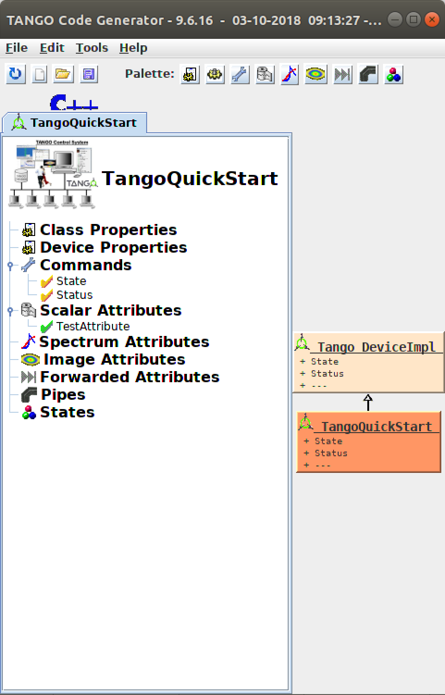
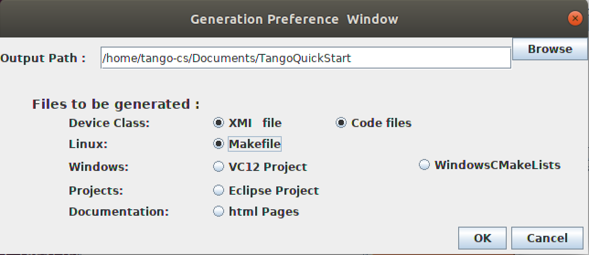
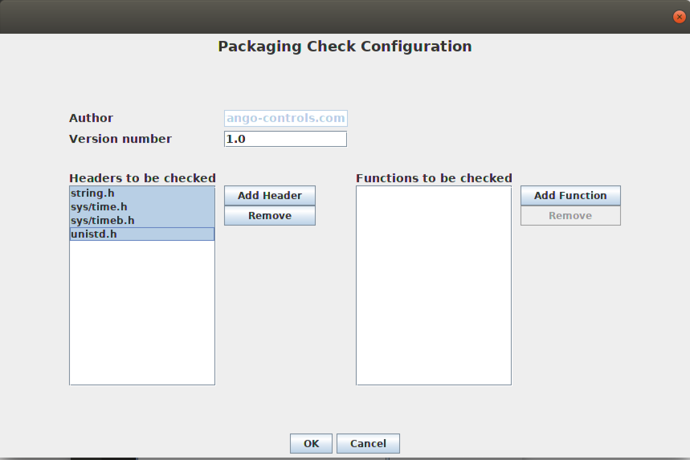
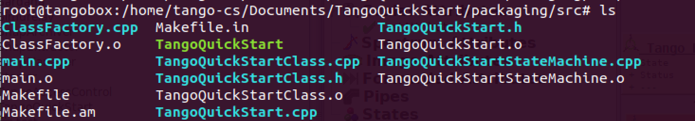
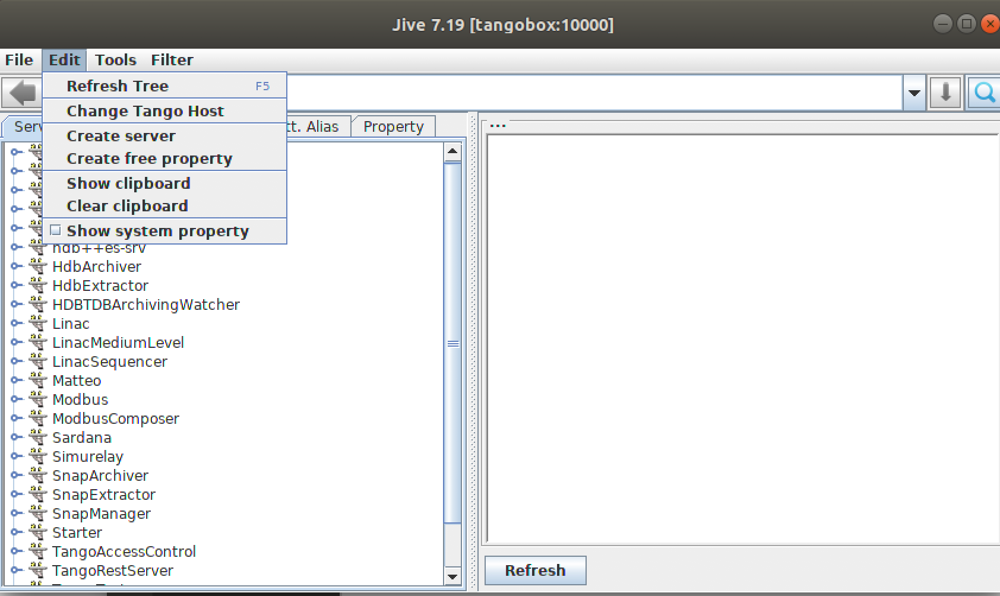
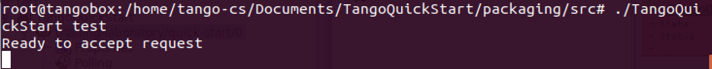
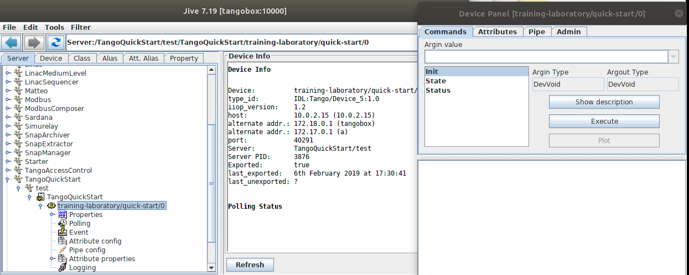

.. _cpp_quick_start:

TANGO C++ Quick start
=====================

:audience:`developers`

This quick tutorial will guide you to some fundamental TANGO concepts and how to do the first steps.

Fundamental TANGO concepts
--------------------------

Before starting to work in TANGO, it is important to know at least some concepts. 

TANGO is a control system framework, composed by a set of devices running somewhere on the network, that communicate each other through on `CORBA` and `ZeroMQ`. Everything which needs to be controlled is modeled as a `Device`.

Every device in the network is identified by the Fully Qualified Domain Name (FQDN), a  unique case insensitive name in the format: 

*tango://hostname.full.domain.name:port/domain/family/member*

Usually the environment variable TANGO_HOST is used by clients/servers to know on which host and port the Database server is running: 

*TANGO_HOST=tango://hostname.full.domain.name:port*

or short form 

*TANGO_HOST=hostname:port*

In this way is possible to refers a device as `domain/family/member`

eg.
DishArray1/Receiver/01
LAB/PowerSupply/01

Each device has a series of `attributes`, `pipes`, `properties` and `commands`.

An :term:`attribute` is identified by a name in a device and represents the data fields a Device wants clients to Read or Write or receive Events. It has a value that can be read or can also be changed (read-write attributes). Each attribute has a well known, fixed data type.

A :term:`pipe` is a kind of attribute and it consists in a data stream or channel for exchanging a stream of any Tango data type. Data types can be sent individually or grouped together in a Blob

A :term:`property` is identified by a name in a device. It consists in a data stored in the database and used to configure Devices at startup.

A :term:`command` is also identified by a name and is the action of a device the clients needs to execute. A command may or not receive a parameter and may or not return a value when it is executed.

Any device has at least a `State` and `Status` attributes and State, Status and `Init` commands. Reading the State or Status attributes has the same effect as executing the State or Status commands.

Devices belong to a `Device Class` and are hosted in a `Device Server`.

The :term:`Device Class` implements a generic Device behaviour. Properties are used to configure the specific Device. Device Classes can be implemented in `Python`, `C++` or `Java`.

TANGO devices live inside a operating system process called `TANGO Device Server`. This server acts as a container of devices. A device server can host multiple devices of multiple TANGO classes. Devices are, therefore, only accessible when the corresponding TANGO Device Server is running.

A special TANGO device server called the `TANGO Database Server` will act as a naming service between TANGO servers and clients. This server has a known address where it can be reached that is the addresses setted in `TANGO_HOST` environment variable. 

Step 1: installation
--------------------

This chapter assumes that you have already installed Tango in your local computer or in your network. If you need to
install TANGO, please reference to :ref:`the documentation<getting_started_installation>`.

Step 2: create a device class
-----------------------------

A useful tool to create a TANGO Class skeleton is :program:`POGO`. POGO is a tool that permits you the generate code and the documentation of a class model in the different programming languages (c++, Java and Python). 

In the example a c++ Tango class, named TangoQuickStart, has been created. To generate the code go to :guilabel:`File` -> :guilabel:`Generate` and press :guilabel:`OK` in the window. 

In order to compile properly the class, you need to add the packaging. Into POGO, go to :guilabel:`File` -> :guilabel:`Export Package` and check all the headers. The tool will create a new folder with the packages. 

Once you created a skeleton and added the header, you can add your code into the class and compile it. 
In :ref:`this section<first_cpp_device_class_implementation>` you can find a guide how to implement a c++ device class. You may find more on device API :ref:`here<device_api>`. 

In :ref:`this link <pogo_manual>` you can find the POGO guide. 

Step 3: compile the device class
--------------------------------

To compile the files, go to the folder that you choose to store your class and execute the following command: 

.. code-block:: console

    cd packaging
    ./autogen.sh 
    ./configure --prefix=$HOME/packaging
    make
    make install

If everything works, you will see the files in the src directory

Step 4: register the device
---------------------------

Open Jive and go to :command:`Edit -> Create Server`

Fill the form as follow: 

.. image:: cpp-quick-start/imageCreateEditServeer.png

Remember that in the server you must add the ServerName, that is the name of the Device Server and che instance. In Class you have to insert che correct ClassName and in Device you can add one or more device, following the convention: 

*domain/family/member*

After, click :guilabel:`Register server`.

Step 5: start the device
------------------------

In order to start the device, using the command line, go to the folder where you compiled your c++ class

.. code-block:: console

    cd packaging/src/

and use the command with the following sintax: 

*<TangoClassName> <instance>*

Where *<TangoClassName>* is the name of the class that you created, and the instance is the name of the instance into the TANGO Database. 

In the example: 

If everything is ok, the following message appears: 

.. code-block:: console

    Ready to accept request

Step 6: explore the device
--------------------------

When finish, you can explore your device using Jive.

