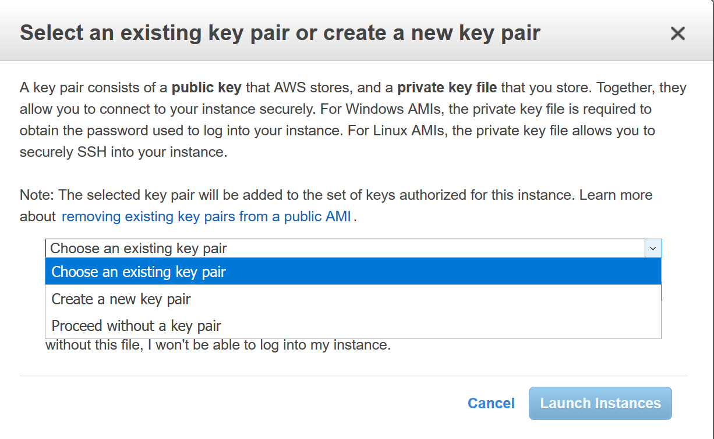
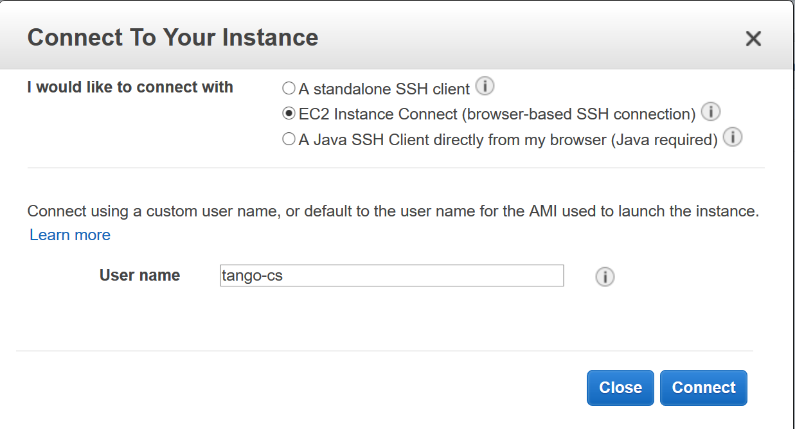
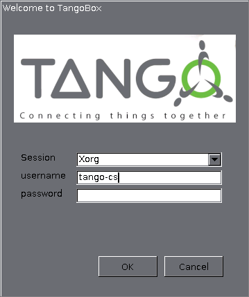
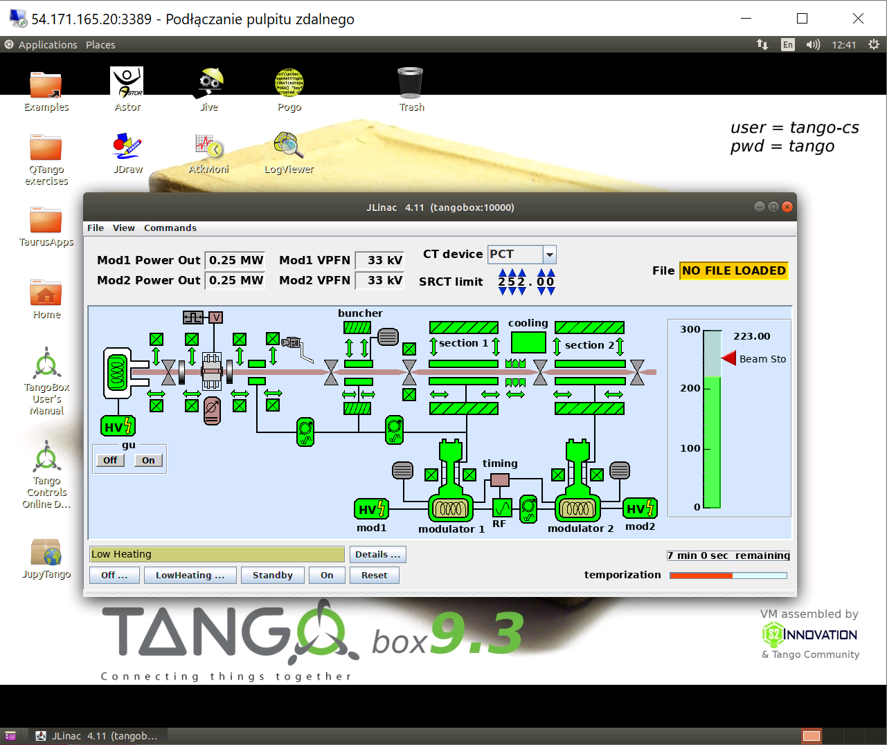

Amazon Cloud
============

:audience:`beginner users, beginner developers, beginner administrators`

TangoBox 9.3 AMI
----------------

The 9.3 release is also available as an AMI image on the AWS. The related AMI-ID is:

.. code-block:: console

   ami-0a2e0cddaa68be39f

The image contains all the features of the original TangoBox. It requires at least 2 vCPUs and 4GB of memory,
which corresponds to `t2.medium` instance type. The running costs apply according to AWS pricing.

An instance may be accessed with both `SSH access`_ or `Remote Desktop`_.

SSH access
~~~~~~~~~~

For security reason, the SSH does not accept password authentication. To SSH login to your instance, you
need a key-pair configured. The AWS web console asks for the key-pair during the launch process.
You may either select exiting or create a new key-par:

Then, you can use the web console :guilabel:`Connect` feature. Please provide the username `tango-cs`:

Remote Desktop
~~~~~~~~~~~~~~

There is also xRDP server installed to enable a desktop connection.
So, you can connect to the instance with, for example a windows `Remote Desktop` client.
For this feature, the instance `Security Group` settings shall allow for connecting to 3389 port.

.. warning::

   Before enabling the 3389 port, it is recommended to change the default tango-cs user password:

   - connect to the instance with the AWS web console :guilabel:`Connect`, as described above.
   - call `passwd` and change the password from the default. When prompted for the current password use `tango`.

After enabling the RDP port and connecting with a remote desktop client,  you are greeted with the following screen:

After providing the username `tango-cs` and the valid password, you connect to the desktop:

Previous version
----------------

The version of TANGO 9.2.5a is also available on the cloud.

An Amazon image running Ubuntu 16.04 with TANGO 9.2.5a is pre-installed and
configured to start up at boot time. The image is public and can be found under this id and region:

.. code-block:: console

    AMI-ID: ami-d503cfba
    region=EU-Frankfurt

You can find out how to do this `here <http://docs.aws.amazon.com/AWSEC2/latest/UserGuide/finding-an-ami.html#finding-an-ami-console>`_.

Launch VM with this image and you will have TANGO 9.2.5 + PyTango 9.2.0 up and
running including the `TANGO REST API <http://tango-rest-api.readthedocs.io/en/latest/>`_ so you can access it from internet.

.. note::  the TANGO_HOST is the private IP address of the VM.

This means the TANGO database and device servers are not accessible from the internet but only
on the VM or set of VMs which share the same VPN. This can be seen as a security feature.
Use the REST api and TANGO security to open up access to the device servers you want to expose.

To experiment with the REST api, start an instance of the AMI image on Amazon cloud.

You can connect to the TangoWebApp as follows:

    1. point your browser to this url:

    .. code-block:: console

        http://ec2-35-157-86-137.eu-central-1.compute.amazonaws.com:8080/TangoWebapp/

    2. click on cancel on the popup login window

    3. set the TANGO_REST_URL to

    .. code-block:: console

        http://ec2-35-157-86-137.eu-central-1.compute.amazonaws.com:8080/tango/rest

    .. note::  NO spaces before or after and no quotes

    5. set the TANGO_HOST to

    .. code-block:: console

        ip-172-31-29-94.eu-central-1.compute.internal:10000

    .. note::  NO spaces or quotes otherwise it won't work!

    6. click on the refresh button to the right of the TANGO_HOST field
    7. login as user=tango-cs and pw=tango when prompted

    .. note::  If you do not get a new prompt for user name and pwd from the host *ec2-35-156-147-163.eu-central-1.compute.amazonaws.com* then the WebApp is down and it won't work.

    8. expand the tree of devices at the top left of the application

See picture below to find out more.
You should be able to play with the TangoTest device *sys/tg_test/1*

.. image:: amazon-cloud/amazonCloudTango.jpg

To see the running DEMO, please, follow `the link <http://ec2-35-156-104-8.eu-central-1.compute.amazonaws.com:8080/TangoWebapp/>`_. Use *tango-cs/tango* to login
