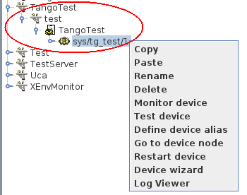

.. How to install Tango on Linux

Linux
=======

:audience:`administrators, developers`

Debian + Ubuntu
---------------
Binary packages are available for Debian based systems in the official repositories.
Use apt-get to install them e.g. to install the Tango database and test device server:

.. code-block:: console

       $> sudo apt-get install mysql-server\
          sudo apt-get install tango-db tango-test

The above packages install the Tango core C++ libraries, database and TangoTest server. 
You will also need the Java based tools like jive, astor etc.
These are available with the :ref:`source code installation<source_code_install>`. 

Another option is to install the latest binary Java debian package for Tango 9.2.5 
(assuming you have installed Tango 9.2.5) from here: 

.. code-block:: console

    https://people.debian.org/~picca/libtango-java_9.2.5a-1_all.deb

To install this binary package do the following:

.. code-block:: console

    curl -O https://people.debian.org/~picca/libtango-java_9.2.5a-1_all.deb
    sudo dpkg -i ./libtango-java_9.2.5a-1_all.deb

You will then have the Tango Java tools installed in /usr/bin e.g. /usr/bin/jive

You might also want PyTango. Python binaries can be installed from the official repositories

.. code-block:: console

       $> apt-get python3-pytango

.. code-block:: console

       $> apt-get python-pytango

Video
-----

The following video (by Mohamed Cherif Areour, in French with English sub-titles) shows you how to install Tango on Ubuntu and LinuxMint.

..  raw:: html

       <iframe width="560" height="315" src="https://www.youtube.com/embed/f903EIbiv6w?rel=0" frameborder="0" allowfullscreen></iframe>

|
|

Testing
-------
**How to test that everything was correctly installed**

You have to have *"tango-test"* been installed and check where is it located (you can use *"locate TangoTest"* command) and start *"test"* command.

For example:

.. code-block:: console

       /usr/lib/tango/TangoTest test

You should see "Ready to accept request".

After you may go to :ref:`Jive<jive_manual>` and choose the following (see the image below):

TangoTest (it is a :term:`server <device server>`)-> test (it is an :term:`instance <device server instance>`) -> TangoTest (it is a :term:`class <device class>`) -> sys/tg-test/1 (it is a :term:`device <device>`)

Right click on the device and choose *"Test device"*.

You should get a new window with *"Attributes"* where you should see the values. That means you have done everything correct.

