.. TangoBox - a Tango Controls demo VM documentation master file, created by
   sphinx-quickstart on Thu Oct  5 11:05:36 2017.
   You can adapt this file completely to your liking, but it should at least
   contain the root `toctree` directive.

TangoBox 9.3
============

:audience:`beginner users, beginner developers, beginner administrators`

TangoBox is a VM image running Tango Controls system and its various tools.
It is intended to be used for demonstration and training.
It also simulates distributed deployment by using Docker.

.. toctree::
   :maxdepth: 2
   :caption: Contents:

Download
--------

The latest version of the TangoBox 9.3 can be downloaded from
`here <https://s2innovation.sharepoint.com/:f:/s/Developers/EovD2IBwhppAp-ZLXtawQ6gB9F6aXPPs2msr2hgPGTO-FQ?e=Ii3tnr>`_.

What is installed
-----------------

Below there is list of provide packages/features. Please note that some of them
are installed as docker container and maybe switched off (stopped) and requires to be switched
on for being explored, see :ref:`Switching containers on and off <container_switch_on_off>`

* Tango 9.3.3
* Tango Access Control
* PyTango 9.3.3
* Taurus 4.5.1
* QTango
* :ref:`Cumbia <cumbia>`
* ITango
* :ref:`Sardana 2.7.0 <sardana>`
* :ref:`PANIC/PyAlarm <panic>`
* :ref:`Bensikin <hdb_tdb_snap>`
* :ref:`Mambo <hdb_tdb_snap>`
* Docker
* :ref:`Linac system simulation <jlinac>` (as docker container tangobox-sim)
* :ref:`HDB/TDB, SNAP DS <hdb_tdb_snap>` (as docker container tangobox-archiving)
* :ref:`HDB++ <hdbpp>` (as docker container tangobox-hdbpp)
* :ref:`JupyTango <jupytango>` (as docker container tangobox-jupytango)
* SerialLine, Modbus and PyPLC device server (as docker container tangobox-com)
* :ref:`mTango + restAPI <rest_api>`, :ref:`Tango WebApp <webapp>` (as docker container tangobox-web)
* :ref:`e-giga` (as docker container tangobox-egiga)
* PyCharm
* :ref:`ModbusPal to simulate Modbus <Modbus>`

First steps
-----------

* First of all you have to download latest release of VirtualBox. It can be downloaded from `www.virtualbox.org <https://www.virtualbox.org/>`_ .
  Simply install it and start the program.
* TangoBox is released as an **.ova** package so it can be easily imported.
* Select *import* and choose downloaded TangoBox file
* If you want, you can change VM's configuration (i.e graphics, RAM). **It is highly recommended to increase default RAM size**

   .. figure:: tangobox/import-2.png

      A virtual machine settings window.

      You may change number of CPUs and increase RAM size. Memory size has major impact on VM performance.

* Wait for VirtualBox to import machine

After importing the VM image to VirtualBox you may start it.

* Username is: `tango-cs`
* Password is: `tango`

`tango-cs` user has sudo privileges, so he may invoke commands as superuser with command :command:`sudo`.

You may explore the Tango Controls feature by clicking related shortcuts on the Desktop.

.. note::

   Plese note that some shortcuts are related to features running on containers. Please start related container first.
   See the following section.

.. _container_switch_on_off:

Switching containers on and off
-------------------------------

Some of the features of Tango are provided inside pre-build docker containers.
These can be switched on and off by starting or stopping related containers.
Containers behave similar to virtual machines with they own network cards and operating system stack,
however, lacking full separations.

To start a container, open terminal and invoke :command:`docker start {container-name}`. For example, to star
a linac simulation use the following statement:

.. code-block:: bash

   docker start tangobox-sim

To stop a container, open terminal and invoke :command:`docker stop {container-name}`. For example, to stop
a linac simulation use the following statement:

.. code-block:: bash

   docker stop tangobox-sim

To see which containers are running please, call :command:`docker ps`

Deployment structure
--------------------

Network
~~~~~~~

Containers are created withing their own subnet: `172.18.0.0/16`. The network is called `tango_nw`
The subnet was created with the following docker command:

.. code-block:: bash

   docker network create --driver=bridge --subnet=172.18.0.0/16 --opt com.docker.network.bridge.enable_icc=true \
   --opt com.docker.network.bridge.host_binding_ipv4="0.0.0.0" --opt com.docker.network.bridge.mtu=1500 \
   --opt com.docker.network.bridge.enable_ip_masquerade=true  tango_nw

Containers are assigned static IPs. List of the IPs assignment maybe seen in :file:`/etc/hosts`. Use command
:command:`cat /etc/hosts` to see its contents.

Containers and images dependency
~~~~~~~~~~~~~~~~~~~~~~~~~~~~~~~~

Each container is based on its image. All images are already build but, if neccessary, *Dockerfiles* are stored in :file:`home/Dockerfiles`
directory. Below is the list of all containers and corresponding images:

================== =============================== ===============================
Container            Image                           Remarks
================== =============================== ===============================
tangobox-com         *registry*/tangobox-com         \-
tangobox-sim         *registry*/tangobox-sim         \-
tangobox-archiving   *registry*/tangobox-archive     \-
tangobox-hdbpp       *registry*/tangobox-hdbpp       \-
tangobox-web         *registry*/tangobox-web         \-
tangobox-egiga       *registry*/tangobox-egiga       \-
tangobox-jupytango   *registry*/tangobox-jupytango   \-
     \-              *registry*/tangobox-base        Base container
     \-              ubuntu                          Ubuntu image to build others
================== =============================== ===============================

Currently images are stored in `registry.gitlab.com/s2innovation/tangobox-docker` registry.

Some device servers may be stopped when launching containers. It is so to get better performance (high cpu and ram usage). To control and
start/stop particular DS according to your needs, use **Tango Manager (Astor)** to it.

Example applications
--------------------

.. _Modbus:

Modbus simulation
~~~~~~~~~~~~~~~~~

To simulate Modbus, we suggest to use *ModbusPal*. To do so, use **ModbusPal (simulation)** desktop shortcut. Once it is started, declare
new *modbus slave* by clicking **ADD**. Choose 1 and name it **10.0.2.15**. Now click "eye" button in modbus slaves section and add at least
10 holding registers. You can change their values according to your needs.

After that, use **RUN** button to start simulation. Values in registers can be changed by clicking *"eye"* button in *Modbus slaves* section.

Keep in mind that in ModbusPal, registers are counted from **1** while on DS from **0**!

To monitor changes, use ATKPanel started from Jive. Both ModbusComposer and PyPLC have two attributes configured:

* ModbusComposer: Temperature uses **4th**; Pressure uses **5th** register in ModbusPal
* PyPLC: Voltage uses **6th**; Flow uses **7th** register in ModbusPal

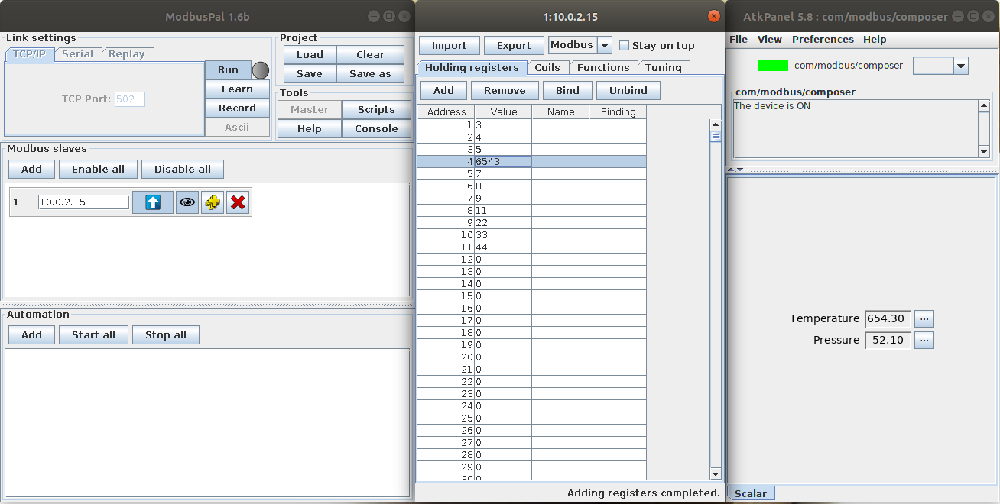

   View on a ModbusComposer device and configured ModbusPal simulator.

.. _jupytango:

JupyTango
~~~~~~~~~

JupyTango is a `Jupyter <http://jupyter.org/>`_ featuring Tango related kernels. With JupyterLab you may interact
and do scripting for Tango through a web browser.

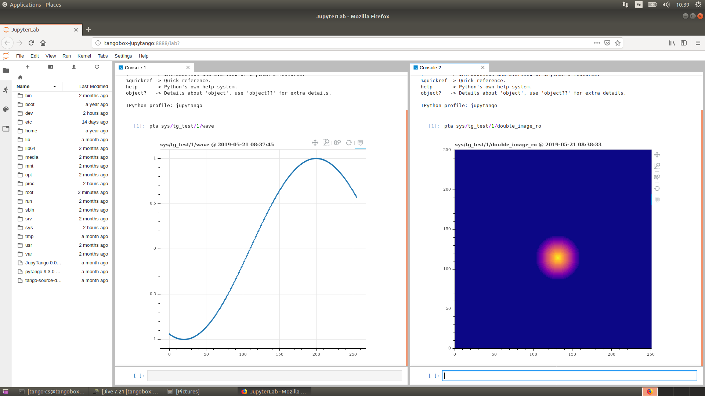

   Browser window with JupyTango in action

**In case you want to try it, here's the procedure:**

1. start jupyterlab (it is started by default): :code:`docker start tangobox-jupytango`
2. open a new browser window and go to http://tangobox-jupytango:8888/lab
3. enjoy!

**Here are the JupyTango additions to itango:**

**Plotting a tango attribute**

Syntax:

.. code-block:: bash

   pta [options] <tab for device selection> + <tab for attribute selection>

Supported options:

* `-w` or `--width`: plot width in pixels
* `-h` or `--height`: plot height in pixels

**Monitoring a tango attribute:**
Syntax:

.. code-block:: bash

   tm [options]  + <tab for device selection> + <tab for attribute selection>

Supported options:

* `-w` or `--width`: plot width in pixels
* `-h` or `--height`: plot height in pixels
* `-p` or `--period`: plot refresh period in [0.1, 5] seconds - defaults to 1s
* `-d` or `--depth`: scalar attribute history depth in [1, 3600] seconds - defaults to 900s

You can try to kill the monitored device will the JupyTango monitor is running to see how errors are handled.

.. _jlinac:

JLinac simulation
~~~~~~~~~~~~~~~~~~~~~~~~~~~~

To start simulation, you need to run **tangobox-sim** container (use :command:`docker start tangobox-sim` to start it
from a terminal). It is also important to make sure that all related device servers are running.
The easiest way to do it is to check it in Astor - a bulb next to `tangobox-sim` should be green.

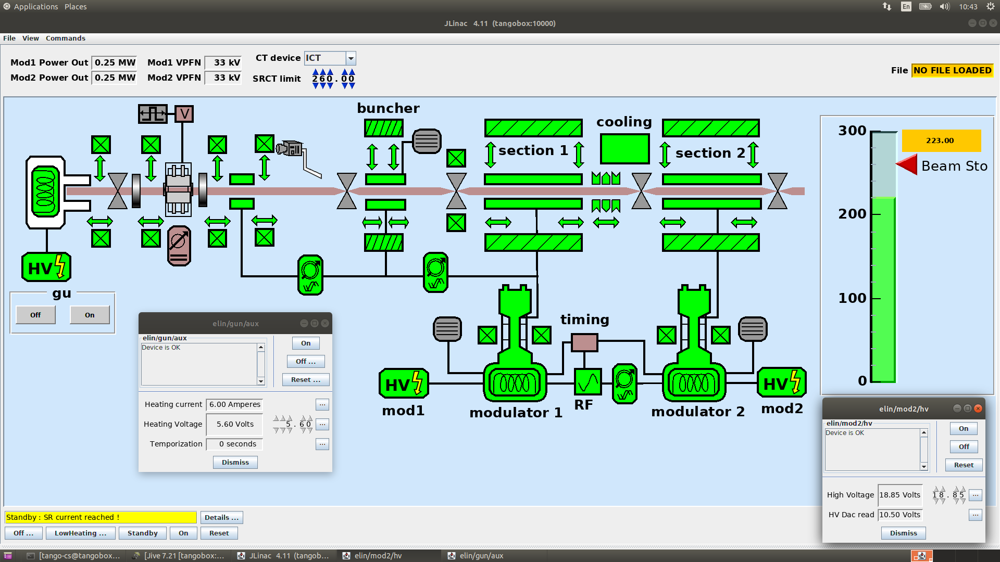

   JLinac simulation running.

.. _hdb_tdb_snap:

HDB/TDB/SNAP Archiving (Mambo, Bensikin)
~~~~~~~~~~~~~~~~~~~~~~~~~~~~~~~~~~~~~~~~

Prior to use `HDB/TDB` (:guilabel:`Mambo`) or `SNAP` (:guilabel:`Bensikin`) you need to make sure that
the  **tangobox-archiving** container and related device servers are running:

* Call :command:`docker start tangobox-archive` on a terminal.
* Start :program:`Astor` and check if the `tangobox-archive` node is green.

Then, you may start :program:`Mambo` or :program:`Bensikin` by clicking icons on the desktop.

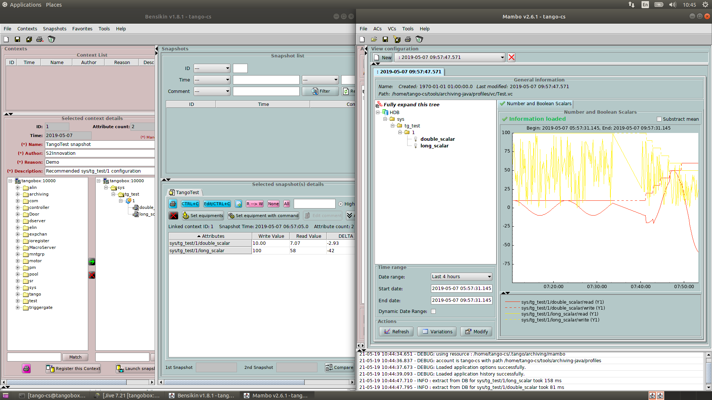

   Screen of running Mambo

   Please take note of a green bulb of the `tangobox-archive` node in the Astor window.

.. _hdbpp:

HDB++ Archiving
~~~~~~~~~~~~~~~

To use `HDB++` and its tools ( :guilabel:`HDB Configurator` and :guilabel:`HDB Viewer`) please make sure that
the  **tangobox-hdbpp** container and related device servers are running:

* Call :command:`docker start tangobox-hdbpp` on a terminal.
* Start :program:`Astor` and check if the `tangobox-hdbpp` node is green.

Then, you may start :program:`HDB Configurator` or :program:`HDB Viewer` by clicking icons on the desktop.

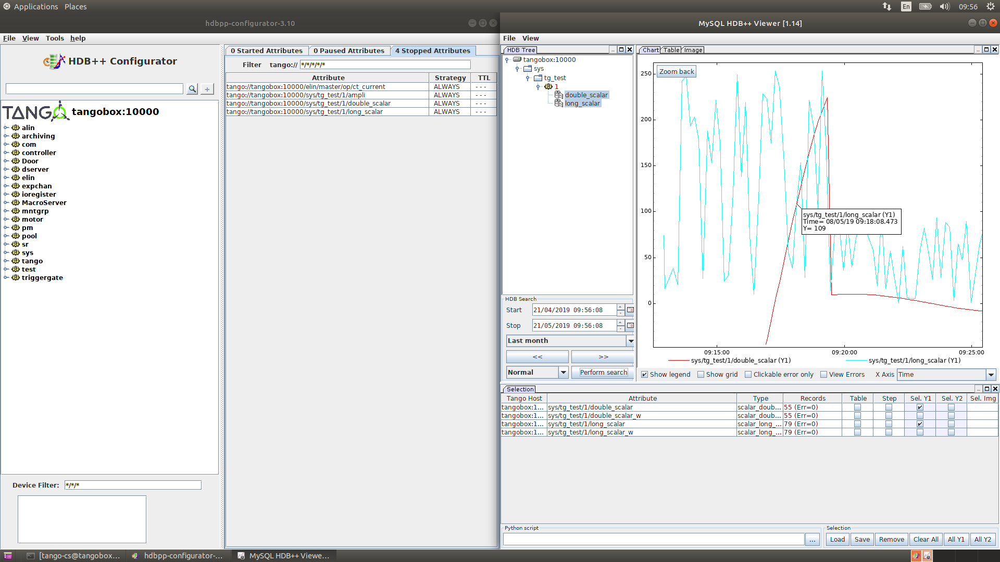

   HDB Configurator and HDB Viewer

.. _e-giga:

E-giga
~~~~~~

:program:`E-giga` is a web application for archiving data visualization (HDB/TDB and HDB++). The TangoBox deployment
uses HDB/TDB.

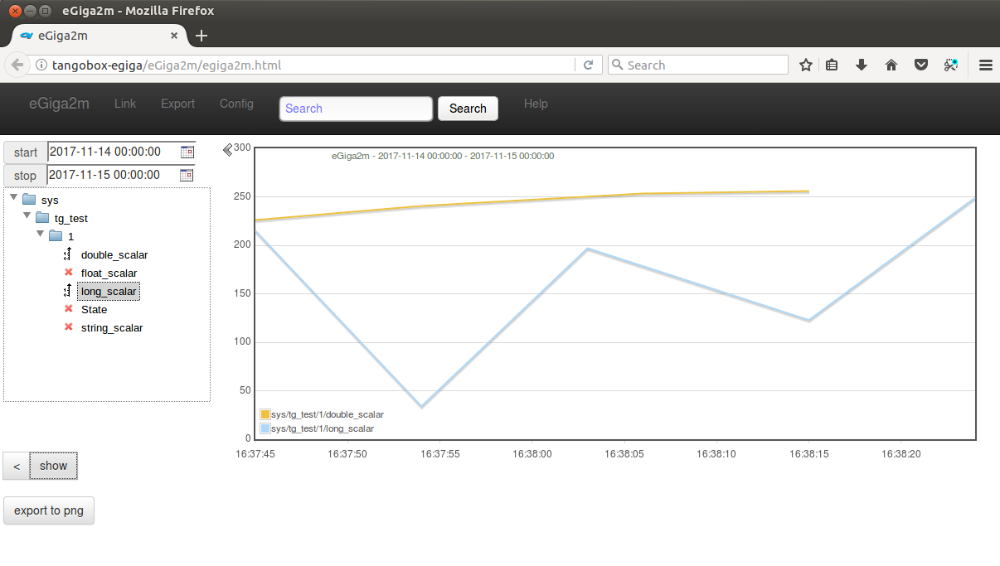

   E-giga in a web browser window

To use e-giga following conditions must be fulfilled:

* `tangobox-archive` and `tangobox-web` containers must be started and archiving device servers must be running
* use i.e. **Mambo** to enable data archiving for HDB database. It is required. If you do not see any attributes in
  `E-giga` it is probably due to archiving being disabled. Check with :program:`Astor` if the tangobox-archive LED
  is green and with :program:`Mambo` if there are any attributes configured to be archivied.

To open browser with :program:`E-giga` click on the relate desktop icon.

.. _webapp:

Tango WebApp
~~~~~~~~~~~~

Tango may be available through a web browser. `Tango WebApp` is a general purpose Tango web application. You may try it
on the TangoBox.

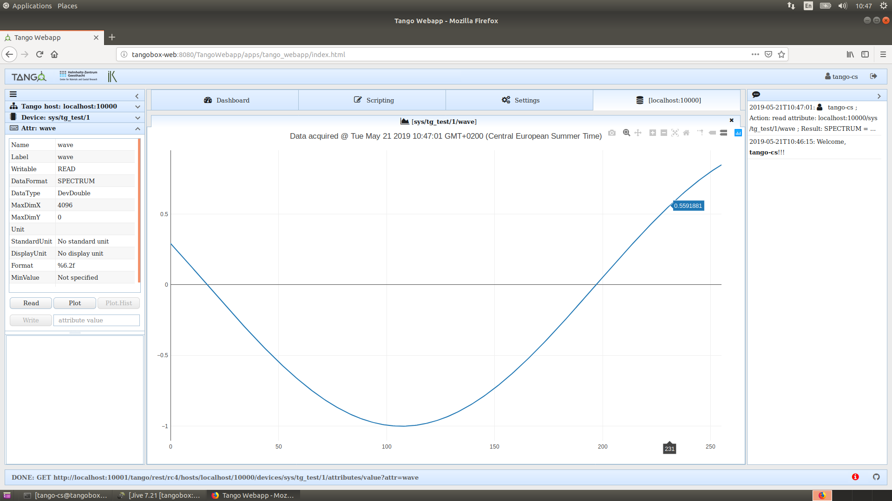

   A screenshot of Tango WebApp in a browser

To play with :program:`Tango WebApp` make sure that the 'tangobox-web` container is running
(use :command:`docker start tangobox-web` to start it from a terminal). Then, you may open a browser with a related
desktop icon. Use username `tango-cs` and  password `tango` to log-in.

.. _rest_api:

REST API
~~~~~~~~

Tango Controls specifies REST API interface and provides its reference implementation. For details see
:ref:`REST API documentation <tango_rest_api>`

The **TangoBox** comes with REST API installed.
Related desktop icon opens a web browser pointing to REST API interface. The REST server requires authentication.
User is `tango-cs` and password is `tango`.

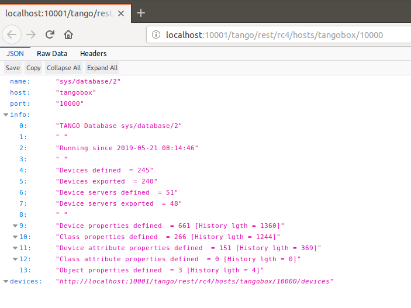

   A web browser window presenting JSON response of the Tango REST server

If you would like to play with it with other tools (Python, curl) it is avaialabe at the following
address: `http://localhost:10001/tango/rest/rc4/hosts/tangobox/10000`.

.. _sardana:

Sardana
~~~~~~~

Sardana is a software suite for Supervision, Control and Data Acquisition in scientific installations. I
t aims to reduce cost and time of design, development and support of the control and data acquisition systems.
For more information about it please refer to `Sardana documentation <http://www.sardana-controls.org>`_.

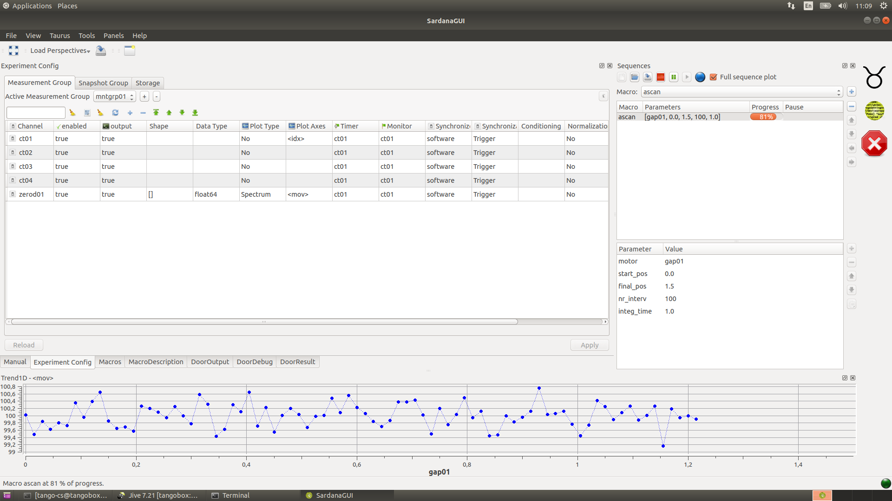

   SardanaGUI in action

To play with Sardana you may double-click the :guilabel:`SardanaGUI` icon on
the desktop or run it from a terminal (type :command:`SardanaGUI`).

.. _cumbia:

Cumbia
~~~~~~

  Cumbia is a new library that offers a carefree approach to multi-threaded application design and implementation. Written from scratch, it can be seen as the evolution of the QTango library, because it offers a more flexible and object oriented multi-threaded programming style.

For more details please check Cumbia `webpage <https://elettra-sincrotronetrieste.github.io/cumbia-libs/>`_
and `source repository <https://github.com/ELETTRA-SincrotroneTrieste/cumbia-libs>`_.

Cumbia is installed in :file:`/usr/local/cumbia-libs`. This directory is added to :code:`ld`'s default search path.

To see an example Cumbia application, please run below command or use desktop shortcut :guilabel:`CumbiaClientDemo`:

.. code-block:: bash

  cumbia client sys/tg_test/1/double_scalar

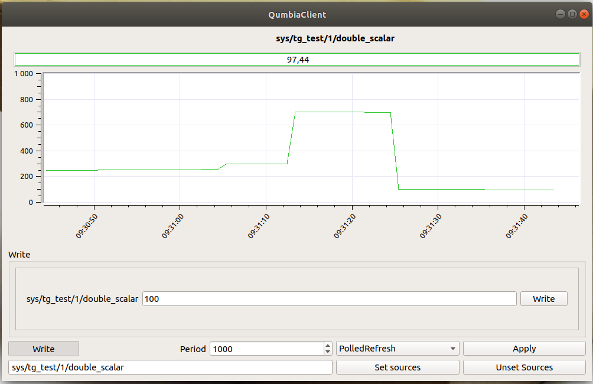

   Cumbia demo application

.. _panic:

PANIC/PyAlarm
~~~~~~~~~~~~~

  PANIC Alarm System is a set of tools (api, Tango device server, user interface) that provides: Periodic evaluation of a set of conditions, Notification (email, sms, pop-up, speakers), Notification (email, sms, pop-up, speakers), Keep a log of what happened. (files, Tango Snapshots), Taking automated actions (Tango commands / attributes), Tools for configuration/visualization.

  The Panic package contains the python AlarmAPI for managing the PyAlarm device servers from a client application or a python shell. The panic module is used by PyAlarm, Panic Toolbar and Panic GUI.

To launch PANIC GUI, use desktop shortcut :guilabel:`PANIC`.

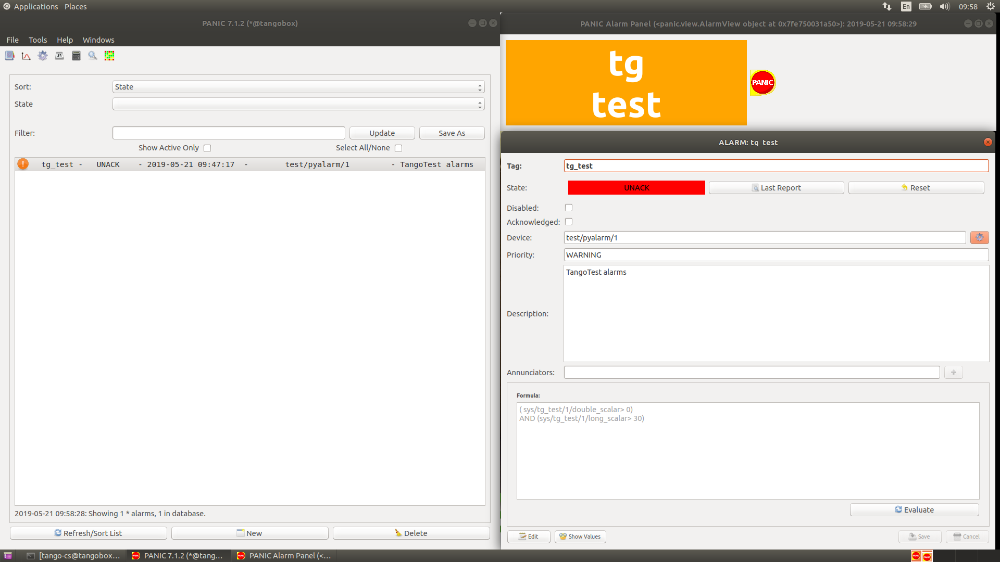

   PANIC GUI application
