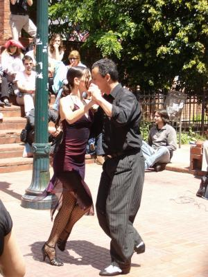
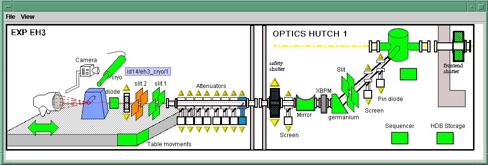
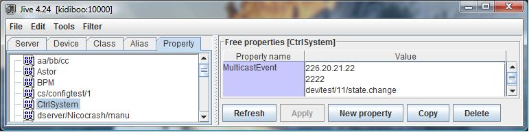

.. |image01| image:: dance/tango-08-27.jpg

.. |image02| image:: dance/Ready.jpg

.. |image04| image:: ds_model/archi.jpg
   :width: 12.00000cm
   :height: 7.00000cm

.. |image05| image:: ds_model/event_schematic.jpg

.. |image06| image:: ds_model/event_schematic_zmq.jpg

.. |image07| image:: dance/Eltaita-reduc.jpg

.. |image08| image:: dance/0066-reduc.jpg

.. |image09| image:: atk/img/core-widget.jpg

.. |image10| image:: atk/img/listpanel.jpg

.. |image11| image:: atk/img/prog_guide_exple1.jpg

.. |image12| image:: atk/img/prog_guide_exple2.jpg

.. |image14| image:: dance/0046-reduc.jpg

.. |image15| image:: ds_writing/nt_server/cons.bmp
   :width: 14.00000cm

.. |image16| image:: ds_writing/nt_server/help.bmp
   :width: 9.00000cm

.. |image17| image:: dance/tango-08-39.jpg

.. |image18| image:: advanced/ThreadsManagement.jpg

.. |image20| image:: advanced/jive_sophis.jpg

.. |image21| image:: advanced/control.jpg

.. |image22| image:: dance/AT97-65-size.jpg

List of pictures
================

-  Cover page: From http://www.juliaetandres.com

-  : By O. Chevre from http://www.forteresses.free.fr

-  : From http://www.photo-evasion.com licence Creative Commons

-  : By R. STEINMANN ©ECK2000

-  : By R. STEINMANN ©ECK2000

-  : By R. STEINMANN ©ECK2000

-  : By O. Chevre from http://www.forteresses.free.fr

-  : By R. STEINMANN ©ECK2000