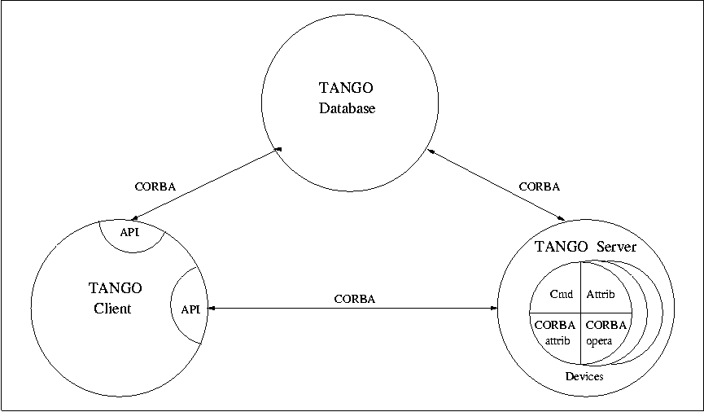
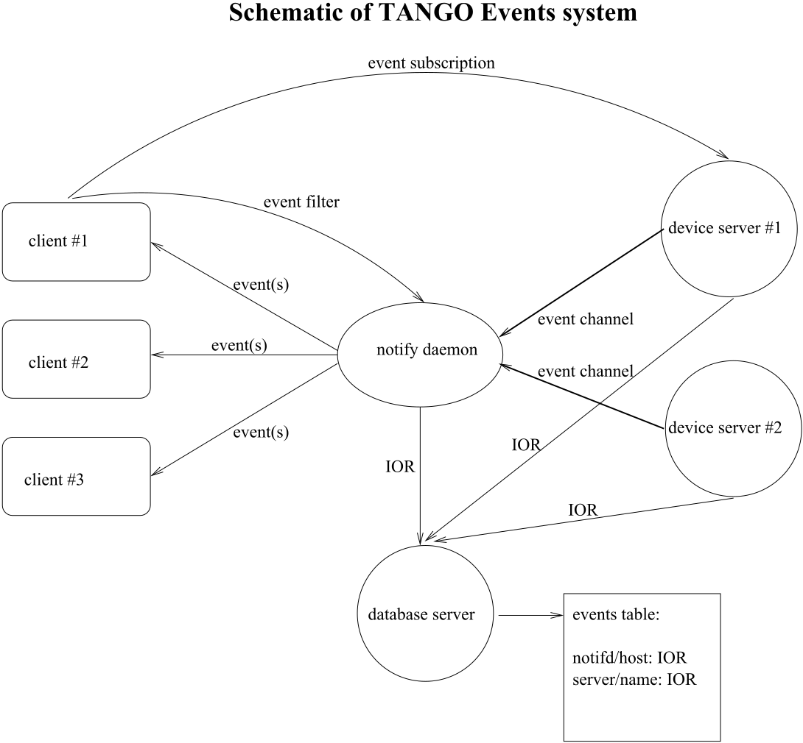
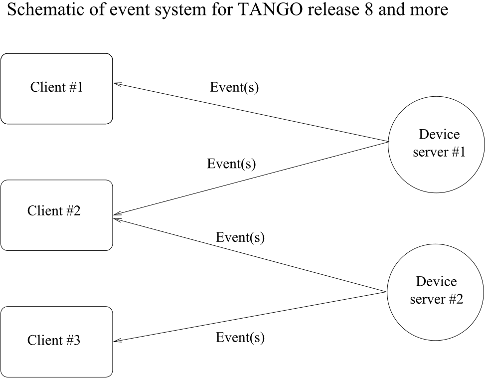
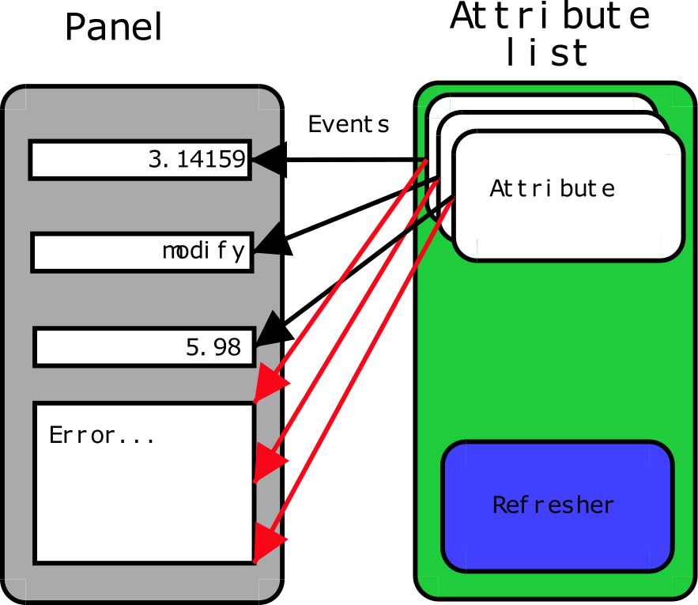
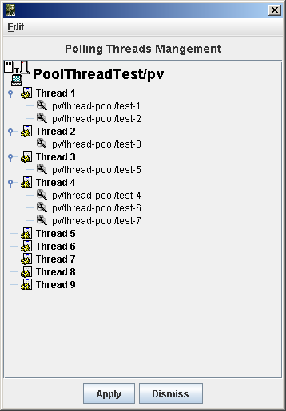
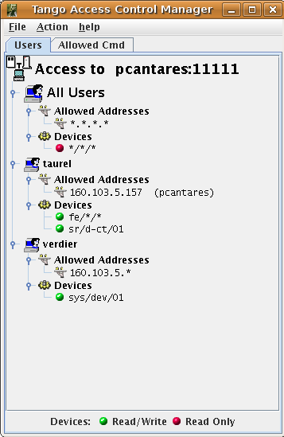

.. |image01| image:: dance/tango-08-27.jpg

.. |image02| image:: dance/Ready.jpg

.. |image03| image:: dance/tg_argentine.jpg

.. |image07| image:: dance/Eltaita-reduc.jpg

.. |image08| image:: dance/0066-reduc.jpg

.. |image09| image:: atk/img/core-widget.png

.. |image11| image:: atk/img/prog_guide_exple1.jpg

.. |image12| image:: atk/img/prog_guide_exple2.jpg

.. |image13| image:: atk/img/prog_guide_exple3.jpg

.. |image14| image:: dance/0046-reduc.jpg

.. |image15| image:: ds_writing/nt_server/cons.bmp
   :width: 14.00000cm

.. |image16| image:: ds_writing/nt_server/help.bmp
   :width: 9.00000cm

.. |image17| image:: dance/tango-08-39.jpg

.. |image19| image:: advanced/jive_simpl.jpg

.. |image20| image:: advanced/jive_sophis.jpg

.. |image22| image:: dance/AT97-65-size.jpg

.. _`OMG home page`: http://www.omg.org

.. _`TANGO home page`: http://www.tango-controls.org

.. _`TANGO web site`: `Tango home page`_

.. _`Tango web`: `Tango home page`_

.. _`ALBA home page`: http://www.cells.es

.. _`Soleil home page`: http://www.synchrotron-soleil.fr

.. _`MySQL home page`: http://www.mysql.com

.. _`Tango classes on-line documentation`: http://www.tango-controls.org/resources/dsc

.. _`omniORB home page`: http://omniorb.sourceforge.net

.. _`CVS WEB page`: http://www.cyclic.com

.. _`POGO home page`: http://www.esrf.eu/computing/cs/tango/tango_doc/tools_doc/pogo_doc/index.html

.. _`JacORB home page`: http://www.jacorb.org

.. _`Tango ATK reference on-line documentation`: http://www.esrf.eu/computing/cs/tango/tango_doc/atk_doc/index.html

.. _`ASTOR home page`: http://www.esrf.eu/computing/cs/tango/tango_doc/tools_doc/astor_doc/index.html

.. _`Elettra home page`: http://www.elettra.trieste.it

.. _`JIVE home page`: http://www.esrf.eu/computing/cs/tango/tango_doc/tools_doc/jive_doc/index.html

.. _`Tango ATK Tutorial`: http://www.esrf.eu/computing/cs/tango/tango_doc/atk_tutorial/Tutorials.pdf

.. _`ATK Tutorial`: `Tango ATK Tutorial`_

.. _`ZMQ home page`: http://www.zeromq.org

.. _`Tango class development reference documentation`:
    http://www.esrf.eu/computing/cs/tango/tango_doc/kernel_doc/cpp_doc/index.html
