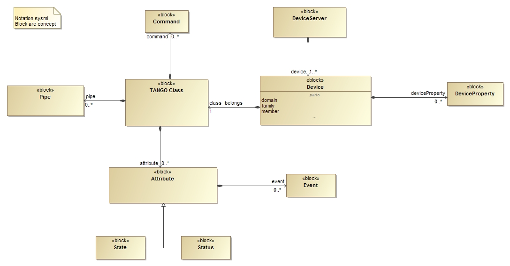

.. highlight:: TangoDataModel

Simplified Tango Device Server Model
====================================

This document is directed to beginner developer.

Primary Presentation
--------------------

|image0|

Elements
--------

+------------------+--------------------------------------------------------------------------------------------------------------------------------------------------------------------------------------------------------------------------------------------------------------------------------------------------------------------------------------------------+
| **Block**        | **Description**                                                                                                                                                                                                                                                                                                                                  |
+==================+==================================================================================================================================================================================================================================================================================================================================================+
| Device           | Abstract concept defined by the TANGO device server object model; it                                                                                                                                                                                                                                                                             |
|                  |                                                                                                                                                                                                                                                                                                                                                  |
|                  | can be a piece of hardware (an interlock bit) a collection of hardware (a screen attached to a stepper motor)                                                                                                                                                                                                                                    |
|                  |                                                                                                                                                                                                                                                                                                                                                  |
|                  | a logical device (a taper) or a combination of all these (an accelerator).                                                                                                                                                                                                                                                                       |
+------------------+--------------------------------------------------------------------------------------------------------------------------------------------------------------------------------------------------------------------------------------------------------------------------------------------------------------------------------------------------+
| TANGO Class      | From Object Oriented Programming concept, this is the main class that the developer has to implement                                                                                                                                                                                                                                             |
+------------------+--------------------------------------------------------------------------------------------------------------------------------------------------------------------------------------------------------------------------------------------------------------------------------------------------------------------------------------------------+
| DeviceServer     | The server (also referred as device server) is a process whose main task is to offer one or more services to one or more clients. To do this, the server has to spend most of its time in a wait loop waiting for clients to connect to it. The devices are hosted in the server process. A server is able to host several classes of devices.   |
|                  |                                                                                                                                                                                                                                                                                                                                                  |
|                  | In short, it is a process that export devices available to accept requests). Please refer also to the :ref:`Glossary <glossary>`, :term:`Device Server instance`.                                                                                                                                                                                |
+------------------+--------------------------------------------------------------------------------------------------------------------------------------------------------------------------------------------------------------------------------------------------------------------------------------------------------------------------------------------------+
| DeviceProperty   | Device specific configuration                                                                                                                                                                                                                                                                                                                    |
+------------------+--------------------------------------------------------------------------------------------------------------------------------------------------------------------------------------------------------------------------------------------------------------------------------------------------------------------------------------------------+
| Attribute        | See :ref:`Glossary <glossary>`, :term:`Attribute`.                                                                                                                                                                                                                                                                                               |
+------------------+--------------------------------------------------------------------------------------------------------------------------------------------------------------------------------------------------------------------------------------------------------------------------------------------------------------------------------------------------+
| Pipe             | See :ref:`Glossary <glossary>`, :term:`Pipe`.                                                                                                                                                                                                                                                                                                    |
+------------------+--------------------------------------------------------------------------------------------------------------------------------------------------------------------------------------------------------------------------------------------------------------------------------------------------------------------------------------------------+
| Event            | Refer to :ref:`Events <events_tangoclient>`.                                                                                                                                                                                                                                                                                                     |
+------------------+--------------------------------------------------------------------------------------------------------------------------------------------------------------------------------------------------------------------------------------------------------------------------------------------------------------------------------------------------+
| Command          | See :ref:`Glossary <commands_deviceservermodel>`.                                                                                                                                                                                                                                                                                                |
+------------------+--------------------------------------------------------------------------------------------------------------------------------------------------------------------------------------------------------------------------------------------------------------------------------------------------------------------------------------------------+
| State            | The device state is a number which reflects the availability of the device.                                                                                                                                                                                                                                                                      |
|                  |                                                                                                                                                                                                                                                                                                                                                  |
|                  | Refer to :ref:`Events <choosingdevicestate_deviceserverwriting>`                                                                                                                                                                                                                                                                                 |
+------------------+--------------------------------------------------------------------------------------------------------------------------------------------------------------------------------------------------------------------------------------------------------------------------------------------------------------------------------------------------+
| Status           | The state of the device as a formatted ascii string                                                                                                                                                                                                                                                                                              |
+------------------+--------------------------------------------------------------------------------------------------------------------------------------------------------------------------------------------------------------------------------------------------------------------------------------------------------------------------------------------------+

Attributes
----------

+-------------+----------------------+-------------------------------+
| **Block**   | **Attribute**        | **Description**               |
+=============+======================+===============================+
| Device      | domain/family/member | To identify the device        |
+-------------+----------------------+-------------------------------+

Relations
---------

+------------------+-------------------+--------------------+--------------------------------------------------------------+
| **Left Block**   | **Right Block**   | **Multiplicity**   | **Description**                                              |
+==================+===================+====================+==============================================================+
| Device           | TANGO Class       | 1                  | Every device belongs to a Tango class                        |
+------------------+-------------------+--------------------+--------------------------------------------------------------+
| Attribute        | Event             | 0..\*              | An attribute can have more than one event associated         |
+------------------+-------------------+--------------------+--------------------------------------------------------------+
| Device           | DeviceProperty    | 0..\*              | A device can have more than one Device Property associated   |
+------------------+-------------------+--------------------+--------------------------------------------------------------+
| DeviceServer     | Device            | 1..\*              | Every Device server has many devices inside itself           |
+------------------+-------------------+--------------------+--------------------------------------------------------------+
| TANGO Class      | Attribute         | 0..\*              | A TANGO Class can have more than one Attribute associated    |
+------------------+-------------------+--------------------+--------------------------------------------------------------+
| TANGO Class      | Command           | 0..\*              | A TANGO Class can have more than one Command associated      |
+------------------+-------------------+--------------------+--------------------------------------------------------------+
| TANGO Class      | Pipe              | 0..\*              | A TANGO Class can have more than one Pipe associated         |
+------------------+-------------------+--------------------+--------------------------------------------------------------+

