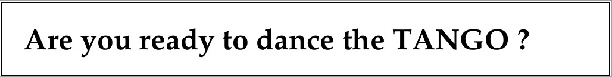

.. raw:: latex

    \clearpage

Introduction
============

Tango Controls is a toolkit for building distributed object based control systems.
Distributed objects are an implementation of the `Actor model <https://en.wikipedia.org/wiki/Actor_model>`_.
Actors are primitives of concurrent computation which were proposed in the 70s
but have gained renewed interest with massively parallel architectures, IoT, cloud computing etc.

The distributed object in Tango Controls is called a :term:`device` and is 
created as an object in a container process called a :term:`device server`.
The device server implements the network communication and links to the
configuration data base and clients. 
Tango device servers and clients can be written in Python, C++ or Java.
Tango comes with a full set of tools for developing, supervising, monitoring and archiving.

The Tango Controls toolkit has been used to build the control systems of large
and small physics experiments like synchrotrons, lasers, wind tunnels and radio telescopes. 
Tango can be used for a single device which requires remote control in a lab
or on the internet.
Tango can be used as a communication protocol for controlling anything remotely.
Tango is ideal for connecting things together and its uses are only limited by your imagination!  

|
|

We are glad you are with us.

Please, look through the following presentations to get a first overview of **the TANGO Control system**.

    * :download:`TANGO introduction <introduction/tango_introduction.pdf>`

    * :download:`Overview of the TANGO Control system <introduction/tangooverview.pdf>`

    * :download:`TANGO basics, technical overview <introduction/tango_basics.pdf>`

