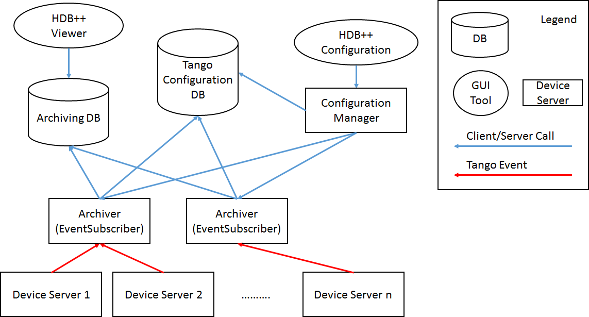
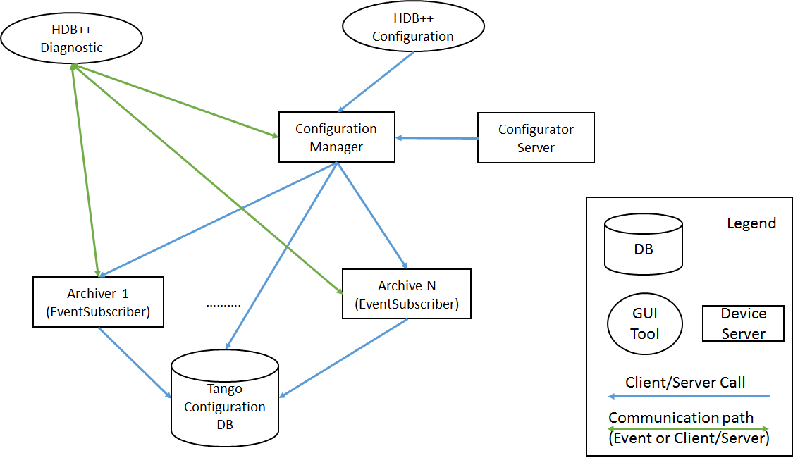
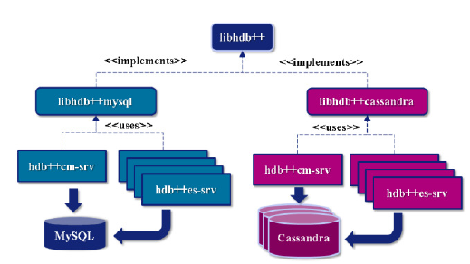

.. _hdbpp_manual:

HDB++
=====

:audience:`developers, administrators`

.. contents::
   :depth: 3

Target
------

This document is directed to beginner developer.

Primary Presentation
--------------------

|image0|

Figure 1: HDB++ Runtime View (part one)

|image1|

Figure 2: HDB++ Runtime View (part two)

Elements
--------

+--------------------------+-------------------------------------------------------------------------------------------------------------------------------------------------------------------------------------------------------------------------------------------------------------------------------------------------------------------------------------------------------------------------------------------------------------------------------------+
| **Block**                | **Description**                                                                                                                                                                                                                                                                                                                                                                                                                     |
+==========================+=====================================================================================================================================================================================================================================================================================================================================================================================================================================+
| HDB++ Viewer             | Standalone JAVA application designed to monitor signals coming from HDB++. It has been written using Swing and needs a JVM higher than 1.7.0. `*More information* <http://www.esrf.eu/computing/cs/tango/tango_doc/hdb_viewer/index.html>`__.                                                                                                                                                                                       |
+--------------------------+-------------------------------------------------------------------------------------------------------------------------------------------------------------------------------------------------------------------------------------------------------------------------------------------------------------------------------------------------------------------------------------------------------------------------------------+
| HDB++ Configuration      | Standalone JAVA application that allows interaction with the configuration manager in order to add, modify, move or delete an attribute from the archiving system                                                                                                                                                                                                                                                                   |
+--------------------------+-------------------------------------------------------------------------------------------------------------------------------------------------------------------------------------------------------------------------------------------------------------------------------------------------------------------------------------------------------------------------------------------------------------------------------------+
| HDB++ Diagnostic         | Standalone JAVA application that visualizes both the status of all the archiver device servers and the overall archiving system                                                                                                                                                                                                                                                                                                     |
+--------------------------+-------------------------------------------------------------------------------------------------------------------------------------------------------------------------------------------------------------------------------------------------------------------------------------------------------------------------------------------------------------------------------------------------------------------------------------+
| Archiving DB             | Specific Database devoted to storing attribute values. It can be either Mysql or Cassandra for the moment.                                                                                                                                                                                                                                                                                                                          |
+--------------------------+-------------------------------------------------------------------------------------------------------------------------------------------------------------------------------------------------------------------------------------------------------------------------------------------------------------------------------------------------------------------------------------------------------------------------------------+
| Tango Configuration DB   | Tango database where every property and configuration of the Tango control framework is stored                                                                                                                                                                                                                                                                                                                                      |
+--------------------------+-------------------------------------------------------------------------------------------------------------------------------------------------------------------------------------------------------------------------------------------------------------------------------------------------------------------------------------------------------------------------------------------------------------------------------------+
| Archiver                 | The EventSubscriber TANGO device server, or Archiver, is the archiving system engine. On typical usage, it will subscribe to archive events on request by the ConfigurationManager device. The EventSubscriber is designed to start archiving all the already configured Attributes, even if the ConfigurationManager is not running. Moreover, being a TANGO device, the EventSubscriber configuration can be managed with Jive.   |
|                          |                                                                                                                                                                                                                                                                                                                                                                                                                                     |
|                          | The list of Attributes to be gathered by each EventSubscriber is stored in the AttributeList Property of the EventSubscriber device.                                                                                                                                                                                                                                                                                                |
+--------------------------+-------------------------------------------------------------------------------------------------------------------------------------------------------------------------------------------------------------------------------------------------------------------------------------------------------------------------------------------------------------------------------------------------------------------------------------+
| Device Server i          | Generic Device server that contains one or more devices that needs to archive one or more attributes                                                                                                                                                                                                                                                                                                                                |
+--------------------------+-------------------------------------------------------------------------------------------------------------------------------------------------------------------------------------------------------------------------------------------------------------------------------------------------------------------------------------------------------------------------------------------------------------------------------------+
| Configurator Server      | Device server that assists in adding, modifying, moving, deleting multiple attributes in the archiving system using the Configuration Manager.                                                                                                                                                                                                                                                                                      |
+--------------------------+-------------------------------------------------------------------------------------------------------------------------------------------------------------------------------------------------------------------------------------------------------------------------------------------------------------------------------------------------------------------------------------------------------------------------------------+
| Configuration Manager    | Device server that assists in adding, modifying, moving, deleting an Attribute to/from the archiving system                                                                                                                                                                                                                                                                                                                         |
+--------------------------+-------------------------------------------------------------------------------------------------------------------------------------------------------------------------------------------------------------------------------------------------------------------------------------------------------------------------------------------------------------------------------------------------------------------------------------+

HDB++ inherits the database structure from the existing Tango Historical Data Base (:ref:`hdb_archiving`) and introduces new storage architecture possibilities, better internal diagnostic capabilities and an optimized API. Its design allows storing data into traditional database management systems such as MySQL or into NoSQL database such as Apache Cassandra.

The HDB++ archiving system must fully comply to the Tango device server model, with two immediate benefits. First, all the required configuration parameters are stored to and retrieved from the Tango database; some of these parameters are, for user convenience, duplicated into a dedicated table of the HDB++ schema by a mechanism that guarantees the consistency of the copy. Second, the HDB++ archiving system inherits the Tango scaling capability: any number of EventSubscriber instances  can be deployed according to the desired architecture and overall performance.

The HDB++ architecture is fully event based; therefore, a part of HDB++ setup consists of conveniently configure Tango device servers to send events as required.

Configuration Manager Device Server
***********************************

It configures the attributes to be archived and defines which Event Subscriber is responsible for a set of Tango attributes to be archived. It provides diagnostics data as well.
Configuration Manager Tango device server will assist in the operations of adding, editing, moving and deleting an Attribute to/from the HDB++ archiving system. A specific library, exposing a suitable API, addresses the historical data extraction from the archive.
The ConfigurationManager device server is able to perform the following operations on the managed EventSubscriber pool:

* handle the request of archiving a new Attribute;
* create an entry in the database if not existing;
* setup the Attribute archive event configuration;
* assign the new Attribute to one of the archivers;
* move an Attribute from one archiver to another;
* show the Attribute/archiver coupling;
* start/stop the archiving of an Attribute;
* remove an attribute from archiving.

The Configuration Manager also exposes some Attributes to keep trace of the global statistics:

* total number of EventSubscribers;
* total number of working/faulty attributes;
* total number of events per second;
* overall minimum and maximum processing and storing time.
These attributes could be themselves archived to enable a follow up versus time.

Event Subscriber Device Server (Archiver)
*****************************************

Also referenced as archiver, is in charge of gathering the values from the Tango devices and storing them into the historical database. To address the requirements coming from large systems the need to distribute the workload over a number of archivers shows up.
The EventSubscriber Tango device server is the core of the HDB++ archiving system. It subscribes to archive events for the specified Attributes list, stored into a Property in the Tango database,
as well as a number of additional parameters, such as the hostname and port number where the back-end is running, the name of the database and the username and password to be used. It subscribes to Tango archive events, which are ZeroMQ events in the latest Tango releases,
and stores the received events in the historical database. It provides diagnostics data as well.

The EventSubscriber device server allows to perform the following operations:

* add/remove an Attribute to/from archiving;
* start/stop the archiving for all Attributes;
* start/stop the archiving for one Attribute;
* read the status of an Attribute;
* read the list of Attributes currently archived (started);
* read the list of Attributes currently not archived (stopped);
* read the number/list of Attributes in charge;
* read the configuration parameters of each Attribute;
* read the number/list of working Attributes;
* read the number/list of faulty Attributes;
* read the number/list of Attributes pending in the FIFO.

Working at the EventSubscriber level implies that the database entry and the archive event parameters have to be already configured. Besides, no action is performed on the archived data when removing an Attribute, which means that the data remain available in the historical database.
The EventSubscriber Tango device server also exposes some additional figures of merit, such as:

* for each instance, total number of records per time;
* for each instance, total number of failures per time;
* for each Attribute, number of records per time;
* for each Attribute, number of failures per time;
* for each Attribute, time stamp of last record.
These numbers can sum up in a counter, which can be reset every hours/days/weeks, to rank each Attribute in term of data rate, error rate etc. This allows preventive maintenance and fine tuning, detecting, for instance, when an Attribute configuration is wrong because the variation threshold is
lower than the noise level. These statistics are a key element for qualifying the health of the system. All these Attributes are archived themselves to enable a follow-up versus time. For each Attribute, the EventSubscriber Tango device server also computes the minimum and maximum processing and storing times, which helps to discover possible bottlenecks.
There may be several EventSubscriber device servers.

HdbConfigurator Server
**********************
The HdbConfigurator device server is a Java device server.
It was developed just to simplify the task of configurating dynamically several new attributes to be added in HDB++.

At the ESRF, it is used to configure/add automatically some dynamic attributes into HDB++. There are some cases where the same device will create some dynamic attributes at
startup depending on its configuration (device properties), if the configuration changes, different attributes might be created.
In this specific case, we have the requirement to ensure these dynamic attributes are archived. So the device server will configure them via the HdbConfigurator device server.
To be more concrete, for the people working in a synchrotron, we have a device, controlling the insertion devices used by a given beamline.
Dynamic attributes are created for each undulator which can be controlled by this beamline.
During a shutdown period, the undulator might have been replaced, so there will be new attributes created for the new undulators and
the attributes related to the undulators which have been removed will no longer exist.

The HdbConfigurator server will handle a queue and coordinate the requests sent to the HdbConfiguration Manager device.
It will help to configure several attributes in parallel. If one would like to do it with only the HdbConfiguration Manager device,
one would need to lock the device, set many attributes, send the addAttribute command and finally release the lock of the device.
The HdbConfigurator Server is doing that for you in the same way as the HDB++ Configuration Manager GUI is doing it.

THe HdbConfigurator Server is indeed using the same classes as the HDB++ Configuration GUI but its source code is actually currently available on tango-ds Sourceforge.
It is listed in the Tango classes catalog:
http://www.tango-controls.org/developers/dsc/ds/274/

HdbViewer
*********
It visualizes the data stored in the historical database.

Two libraries have been developed to the *historical data extraction*: the first, written in C++
is dedicated *Qt/Qtango* based GUIs or to C++ Tango device servers; the second,
written in Java, has been used for the *HdbViewer* GUI and is a native choice for Java device servers.
The HdbViewer Java framework, in addition to the legacy ESRF historical database support,
allows retrieving the data from the new Cassandra back-end as well as managing the Cassandra
partitioning period.

.. note::
    The C++ extraction library currently supports only the MySQL back-end.

The *HdbExtractor++ multithread library* allows fetching the data from the legacy HDB and the new HDB++ MySQL schema in a simple Object Oriented way. An additional module provides a Qt interface to the HdbExtractor++ and a dedicated GUI, exploiting the MathGL framework, aimed
at displaying mono and bidimensional data over time.

Some shared libraries provide the methods for writing to the database back-end.
These libraries, written in C++, are addressed to the EventSubscriber Tango device server and
their main purpose is to provide *an abstraction layer*. Actually, some shared objects are available
implementing the abstraction layer and the specific interface:

|libs|

Figure 3: HDB++ Device Servers design

* **libhdb++**: database abstraction layer, decouples the interface to the database back-end from the implementation.
* **libhdbmysql**: legacy HDB schema support for MySQL back-end
* **libhdb++mysql**: HDB++ schema support for MySQL back-end
* **libhdb++cassandra**: methods from libhdb++ for Cassandra back-end
These libraries allow reusing the EventSubscriber, the ConfigurationManager and the GUIs without changes.

Source code
-----------

The source code is available on GitHub in the following repositories:

.. _hdbpp-cm: https://github.com/tango-controls-hdbpp/hdbpp-cm
.. _hdbpp-es: https://github.com/tango-controls-hdbpp/hdbpp-es
.. _hdbpp-cm-es: https://github.com/tango-controls-hdbpp/hdbpp-cm-es
.. _libhdbpp: https://github.com/tango-controls-hdbpp/libhdbpp
.. _libhdbpp-mysql: https://github.com/tango-controls-hdbpp/libhdbpp-mysql
.. _libhdbpp-mysql-legacy: https://github.com/tango-controls-hdbpp/libhdbpp-mysql-legacy
.. _libhdbpp-cassandra: https://github.com/tango-controls-hdbpp/libhdbpp-cassandra
.. _CassandraMonitor: https://github.com/tango-controls-hdbpp/CassandraMonitor
.. _hdbpp-configurator: https://github.com/tango-controls-hdbpp/hdbpp-configurator
.. _hdbpp-viewer: https://github.com/tango-controls-hdbpp/hdbpp-viewer
.. _libhdbpp-extraction-java: https://github.com/tango-controls-hdbpp/libhdbpp-extraction-java
.. _libhdbpp-extraction-cpp: https://github.com/tango-controls-hdbpp/libhdbpp-extraction-cpp
.. _eGiga2m: https://github.com/luciozambon/eGiga2m

* hdbpp-cm_ : the HDB++ Configuration Manager device server
* hdbpp-es_: the HDB++ Event Subscriber device server
* hdbpp-cm-es_: Device server able to export HDB++ Event Subscriber and Configuration Manager devices in the same device server. It is a multiclass Tango device server capable of both CongigurationManager and EventSubscriber devices. Can be used in place of hdbpp-cm and hdbpp-es devices.
* libhdbpp_: the HDB++ insertion (abstract) library
* libhdbpp-mysql_: the HDB++ insertion library for MySQL backend
* libhdbpp-mysql-legacy_: the HDB++ insertion library for MySQL backend using the old Tango HDB database schema
* libhdbpp-cassandra_: the HDB++ insertion library for Cassandra backend
* CassandraMonitor_: A Java client/server to monitor cassandra nodes using jmx calls.
* hdbpp-configurator_: the HDB++ Configuration GUI (in Java).
* hdbpp-viewer_: the HDB++ Viewer GUI (in Java)
* libhdbpp-extraction-java_: HDB++ Java extraction library
* libhdbpp-extraction-cpp_: HDB++ C++ extraction library
* eGiga2m_: Web graphic data viewer able to show HDB++ data

.. note::
    Please, find README file in each repository. It contains a lot of necessary information.

Documentation for building and installing
-----------------------------------------

The documentation for building and installing many of the components is available on the
different git repositories from https://github.com/tango-controls-hdbpp Github organization.

Please, have a look at the README files from the different git repositories
(For instance: https://github.com/tango-controls-hdbpp/hdbpp-cm-es).
They explain how to install the HDB++ libraries as well as the device servers.

The latest versions of *hdbpp-es* and *hdbpp-cm* are now loading dynamically (using dlopen) the HDB++ library used for MySQL/legacy HDB schema, MySQL HDB++ schema, Cassandra.

.. note::
    -v5 can be used to see the DEBUG messages coming from the Tango library itself too. It also sets the logging level of the device to DEBUG.
    -v4 can be used to see the DEBUG messages coming from the Tango devices themselves.
    By doing this, DEBUG level logs will be printed on your terminal.
    For example, command on terminal: ./hdb++es-srv 01 -v5

.. note::
    In recent versions of *libhdb++cassandra* library, there are some configuration parameters to adjust libhdb++cassandra library log level and the cassandra driver log level.
    These configuration parameters are parameters of LibConfiguration Tango class or device property.
    These parameters are named differently depending on the version of the library used (logging_enabled or logging_level and cassandra_driver_log_level)

Rationale
---------

The HBD++ archiving system is built on top of the Tango Event model
which provides a specific event for archiving, this is the **archive
event**. The archive events are configured with three attributes
properties:

-  **archive\_abs\_change:**
       a Property of up to 2 values, positive and
       negative delta, that specifies the absolute change with respect
       to the previous Attribute value, which triggered the event. If
       only one value is specified it is used for both positive and
       negative change. If no thresholds are specified then the relative
       change is used.

-  **archive\_rel\_change:**
       a Property of up to 2 values, positive and
       negative delta, that specifies the relative change with respect
       to the previous Attribute value, which triggered the event. If
       only one value is specified it is used for both positive and
       negative change. If no thresholds are specified archive events
       are not sent on value change.

-  **archive\_period:**
       the time between which periodic archive events
       are sent, in milliseconds. If no period is specified no periodic
       archive events are sent.

Usually it is composed of several TANGO device servers (Archiver aka
EventSubscriber), but there must be at least one device server. Each
EventSubscriber device is in charge of archiving a number of attributes
from a number of devices. The number of EventSubscriber TANGO devices to
deploy and the number of TANGO devices/Attributes in charge of each
subscriber is not bounded and depends on the desired performance.

The ConfigurationManager device server manages a pool of
EventSubscribers; the list is stored in the ArchiverList property of
each ConfigurationManager device, and is updated via the ArchiverAdd,
ArchiverRemove and AttributeSetArchiver commands. The list is stored in
the ArchiverList device Property of the ConfigurationManager device
using the FQDN syntax. This tells the ConfigurationManager everything
which is needed to connect to the managed EventSubscribers: protocol,
host, port and device name. Figure 5 shows a screenshot of the
ArchiverList Property of a ConfigurationManager device instance; in this
case all the managed EventSubscriber devices belong to the same TANGO
facility (srv-tango-srf.fcs.elettra.trieste.it:20000).

Presentations and papers
--------------------------------------

* :download:`HDB++ Meeting minute 2016-05-10 <HDB-plus-plus/20160510-hdb-meeting.pdf>`
* :download:`HDB++: a new archiving system for TANGO (Proceedings of ICALEPCS2015) <HDB-plus-plus/proceedings_ICALEPCS2015.pdf>`
* :download:`How Cassandra improves performances and availability of HDB++ Tango Archiving System (Proceedings of ICALEPCS2015) <HDB-plus-plus/proceedings_ICALEPCS2015_cassandra.pdf>`
* :download:`HDB++: High availability with Cassandra - presentation from the 29th TANGO collaboration meeting <HDB-plus-plus/hdb_-_high_availability_with_cassandra.pptx>`
* :download:`HDB++ Cassandra presentation at the ICALEPCS 2015 Tango workshop <HDB-plus-plus/hdbcassandra-tango-workshop.pptx>`

More information is available in Administration -> Services section of this documentation under :ref:`hdbpp_service`.

