|image2|

Bensikin Manual
===============

*for Bensikin v1.0*

    **Diffusion :**

    *Diffusion List*

+----------------+----+------------------+-------------------+----------------------+----+-------------------------+----+----------------------+
|     **Date**   |    |     **Writer**   |     **Auditor**   |     **Validation**   |    |     **Modifications**   |    |     **Indication**   |
+----------------+----+------------------+-------------------+----------------------+----+-------------------------+----+----------------------+
|                |    |                  |                   |                      |    |                         |    |                      |
+----------------+----+------------------+-------------------+----------------------+----+-------------------------+----+----------------------+

    2005/11/17 R.Girardot

.. contents:: Index
   :local:

Figure Index
------------

- :ref:`Figure 1: Bensikin Profile Manager <bensikin_fig_1>`

- :ref:`Figure 2: Bensikin Main Panel <bensikin_fig_2>`

- :ref:`Figure 3: Creating a new profile <bensikin_fig_3>`

- :ref:`Figure 4: Profile Selection <bensikin_fig_4>`

- :ref:`Figure 5: Multi sessions disabled <bensikin_fig_5>`

- :ref:`Figure 6: Multi sessions enabled <bensikin_fig_6>`

- :ref:`Figure 7: Context Control Panel <bensikin_fig_7>`

- :ref:`Figure 8: Application first start <bensikin_fig_8>`

- :ref:`Figure 9: Options - Context Tab <bensikin_fig_9>`

- :ref:`Figure 10: Bensikin with Context Table Selection Mode (new Context) <bensikin_fig_10>`

- :ref:`Figure 11: Bensikin with Context Table Selection Mode (modified Context) <bensikin_fig_11>`

- :ref:`Figure 12: Database Context Filter Dialog <bensikin_fig_12>`

- :ref:`Figure 13: Snapshot Control Panel <bensikin_fig_13>`

- :ref:`Figure 14: Modified snapshot <bensikin_fig_14>`

- :ref:`Figure 15: Snapshot Comparison - full table <bensikin_fig_15>`

- :ref:`Figure 16: Snapshot Edit Clipboard Dialog <bensikin_fig_16>`

- :ref:`Figure 17: Logs Options <bensikin_fig_17>`

- :ref:`Figure 18: Save Options <bensikin_fig_18>`

- :ref:`Figure 19: Snapshot Options <bensikin_fig_19>`

- :ref:`Figure 21: The Bensikin toolbar <bensikin_fig_21>`

Introduction
------------

This document is an end-user guide to using the Bensikin application,
and a brief developer-oriented presentation of the application’s
architecture.

Application’s context: Contexts and Snapshots
---------------------------------------------

A snapshot is, as said in the name, a view of the equipments
(attributes) at a precise instant. A snapshot is based on a context,
that is a filter to only view a specific list of attributes. A context
is described by meta-data (author, description, etc…), so that user can
know which context is used what for.

A snapshot can also be used to reset equipments to the values of this
snapshot.

Application’s description and goals
-----------------------------------

Application’s goals
~~~~~~~~~~~~~~~~~~~

    Bensikin allows the user to define contexts and snapshots. Snapshots
    be saved as files and modified.

    Bensikin v1.0 is ready for multi-user functioning, which has for
    consequence the need to define profiles. A profile is a way to map a
    user with a working directory. An important conséquence of this is,
    that **2 different user must** **not use the same working
    directory**, or you may encounter crashes. A profile has a name and
    a path to a working directory.

    Bensikin is thus naturally divided (both in functionalities and
    display) in three parts:

-  The profile part, that is an introduction to the rest of the
       application

-  The context part

-  The snaphot part

A first look to Bensikin
~~~~~~~~~~~~~~~~~~~~~~~~

.. _bensikin_fig_1:

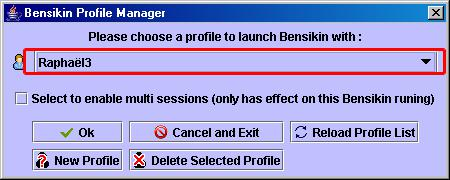

    Figure 1: Bensikin Profile Manager

.. _bensikin_fig_2:

.. figure:: bensikin/image5.png

    Figure 2: Bensikin Main Panel

-  The Bensikin Profile Manager is here to manage profiles which means :

   - Creating a new profile

   - Deleting an existing profile

   - Launching application with a profile chosen in a list

-  The Bensikin Profile Manager also allows you to quickly manage sessions

-  The Context Control Panel is where user can manage contexts, which
   means creating, loading and modifying contexts, and launch
   snapshots based on the defined contexts.

-  The Snapshot Control Panel is where user can manage snapshots, which
   means saving snapshots in files, loading snapshots from database
   and files, temporaly modify snapshots’ attributes values and set
   equipment with defined snapshots (whith or without modifying
   snapshots) or a subpart of them.

-  The Logs panel displays success/failure messages to the user upon
   realization of an action.

-  The Menu and the Tool bar are for actions shortcuts and application’s
   options.

Profile Manager
---------------

The :ref:`Figure 1: Bensikin Profile Manager <bensikin_fig_1>` presents the Profile Manager
Interface, on application start. With this manager, you can create a new
profile, or delete or use an existing one.

To quit the application, simply click on |image4| or |image5| button.

Existing profiles are listed in the Profile Selection Combo Box, which
you can reload by clicking on

|image6| button (if you think that someone could have modified it by
creating a new profile or deleting an existing one, for example).

Creating a new profile
~~~~~~~~~~~~~~~~~~~~~~

To create a new profile, click on the button |image7| (At the bottom
left of the panel). A new diaalog will appear, as following :

.. _bensikin_fig_3:

   Figure 3: Creating a new profile

In this new dialog, you will have to enter the name of your new
profile and the path of the application working

directory for this profile. If you prefer, you can browse for the
path by clicking on the |image9| button. Then, a classic browsing
dialog will be displayed, in which you can choose the directory.
When both fields (“Name”
and “Path”) are fullfilled, click on |image10| button to validate
your new profile and add it in the list of existing
profiles. If you click on |image11| or |image12| button, you go pack
to the first dialog, as presented in
:ref:`Figure 1: Bensikin Profile Manager <bensikin_fig_1>`, and nothing is done.

Deleting an existing profile
~~~~~~~~~~~~~~~~~~~~~~~~~~~~

To delete an existing profile, first select the profile in the
Profile Selection Combo Box, as following :

.. _bensikin_fig_4:

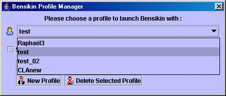

   Figure 4: Profile Selection

When the profile is selected, click on |image14| button to delete
it. If you do so, you won’t be able to use this profile any more
(and no other user either), because the profile is definitely
removed from list.

The profile deletion doesn’t involve the corresponding Bensikin
directories deletion.

Launching application with an existing profile
~~~~~~~~~~~~~~~~~~~~~~~~~~~~~~~~~~~~~~~~~~~~~~

To launch application with an existing profile, first select the
profile in the Profile Selection Combo Box, as presented in
:ref:`Figure4: Profile Selection <bensikin_fig_4>`.

Then, click on |image15| button, and you will reach the application
main panel configured with this profile (the profile name is
displayed in frame title, see :ref:`Figure 2: Bensikin Main Panel <bensikin_fig_2>`)

Sessions
~~~~~~~~

With the Bensikin Profile Manager, you have the possibility to
enable or not multi sessions. To do so, you have to

select or unselect the check box: |image16|. It only affects the
Bensikin you just started to run.

The expected behaviour is the following:

-  If no other Bensikin is launched on the profile you selected,
   checking or unchecking the check box will not have any effect.
   Bensikin will just run with the selected profile and work in its
   directory.

-  If another Bensikin is already running with the selected profile

   - **If the checkbox is unchecked**, then a dialog will appear to warn
     you about the fact that another Bensikin is running. **Closing
     this dialog will send you back to the profile manager**.

     .. _bensikin_fig_5:
     .. figure:: bensikin/image19.jpeg

        Figure 5: Multi sessions disabled

   - **If the checkbox is checked**, then a dialog will appear to warn you
     about the fact that another Bensikin is running. **Closing this
     dialog will continue run Bensikin**. However, Bensikin will run
     in a sub directory of the profile working directory, and **you
     will not be able to retrieve this** **session on Bensikin next
     start**.

     .. _bensikin_fig_6:
     .. figure:: bensikin/image20.jpeg

        Figure 6: Multi sessions enabled

Context Management
------------------

This section describes how to control contexts with Bensikin. A context
is a list of attributes on which you can make a snapshot. A context has
an ID and a creation date, both defined by the database. A context also
has a name, an author, a reason and a description. The reason usually
describes why the context was created (example: because of an incident
or in order to set some equipments), whereas the description is here to
have an idea of what kind of attributes you will find in this context.

Contexts are managed in the context control panel :

**Figure 7: Context Control Panel**

|image19|

**Context List sub panel**

**Context Details sub panel**

    **“Reference”** **Last Update : 8 February 2007** **Page 8/26**

    \ **Synchrotron Soleil** **Bensikin Manuel**

    ***5.1. Creating a new context***

|image20|

    To create a new context, click on the “new” icon in toolbar (
    |image21| ), or choose he option to make a new context from “File”
    menu or “Contexts” menu :

|image22|

    You also are ready to make a new context at application first start
    or by clicking on the “reset” icon (|image23|) :

|image24|

**Figure 8: Application first start**

|image25|

    The difference between the “reset” icon(\ |image26|) and the “new”
    icon( |image27| ) is, that the “reset” icon will clear every panel,
    whereas the “new” icon will only clear the snapshot list and the
    Context Details sub panel.

    **“Reference”** **Last Update : 8 February 2007** **Page 9/26**

    \ **Synchrotron Soleil** **Bensikin Manuel**

    **5.1.1. Classic way (tree)**

    The tree on the left side of the Context Details sub panel allows
    you to check for available attributes. The one on the right side
    represents your context attributes.

|image28|

    To add attributes in your context browse the left tree, select
    attributes (represented by the icon |image29| ), and click on the
    arrow (|image30|) to transfer them to the right tree.

|image31|

    To remove attribues from your context, select them in the right tree
    and click on the cross (|image32|).

    Finally, fill the context meta data (Name, Author, Reason and
    Description) in the corresponding fields (Note

    that filling the fields activates the “register” button\ |image33|).

    Then, you can save your context in database by clicking on the
    “register” button |image34|.

    Doing so will deactivate the “register” button and activate the
    “launch snapshot” button |image35|.

|image36|

    You can save your context in a file using the “save”icon |image37| .

**“Reference”** **Last Update : 8 February 2007** **Page 10/26**

    \ **Synchrotron Soleil** **Bensikin Manuel**

    **5.1.2. Alternate way (table)**

    To select this alternate way, go to “tools” menu and select
    “options”\ |image38|.

    Then select the “context” tab and click on the “table” radio button.

**Figure 9: Options - Context Tab**

|image39|

    Click on the “ok” button. The context panel now has the “table
    selection mode”.

    **“Reference”** **Last Update : 8 February 2007** **Page 11/26**

    \ **Synchrotron Soleil** **Bensikin Manuel**

**Figure 10: Bensikin with Context Table Selection Mode (new Context)**

|image40|

    ***Attributes filtering box***

    ***Line-level selection buttons***

***List of Context attributes***

***(new attributes are light red)***

-  Attribute selection and automatic attributes adding:

o. Choose a Domain. This refreshes the list of possible Device classes
       for this Domain.

o. Choose a Device class. This refreshes the list of possible Attributes
       for this Domain and Device

    class.

o. Choose an Attribute and press OK : o All Attributes

   -  with the selected name

    ***AND***

-  belonging to any Device of the selected Class and Domain are added to
       the current Context’s list of attributes.

    All new attributes are light red until the Context is registered.

-  Line level sub-selection of loaded attributes:

    Each attributes is initially checked, but this check can be removed
    by the user. When the user clicks on “validate”, all unchecked
    attributes will be removed from the current Context.

o. Click “All” to select all lines o Click “None” to select no lines

    o Highlight lines in the list (CTRL and SHIFT are usable), then
    click “Reverse highlighted” to reverse the checked/unchecked status
    of all highlighted lines.

As for the classic way, you will have to fill the meta data fields and
register your context in database by clicking on

the “register” button |image41|.

    **“Reference”** **Last Update : 8 February 2007** **Page 12/26**

    \ **Synchrotron Soleil** **Bensikin Manuel**

    ***5.2. Modifying an existing context***

    As a matter of fact, you can not really “modify” a context. What you
    can do is to create a new context with its informations (attributes
    and meta data) based on another one.

    The very difference is in alternate mode, where former attribute are
    in white and new ones in light red :

**Figure 11: Bensikin with Context Table Selection Mode (modified
Context)**

|image42|

    The “register” button changed a little too : its text is “Register
    this context” instead of “Register this new context”, as you can see
    on the figure above.

    **“Reference”** **Last Update : 8 February 2007** **Page 13/26**

    \ **Synchrotron Soleil** **Bensikin Manuel**

    ***5.3. Loading a context***

    There are 2 ways to load a context :

-  Load it from the database

-  Load it from a file

    In both cases, loading a context will apply a quick filter on the
    snapshot list, so you can see the snapshots about this context that
    have been created this day (the day when you load the context).

    **5.3.1. Loading a context from database**

    In the “Contexts” menu, choose “load” then select “DB”:

|image43|

    A dialog will then appear to allow you to filter the list of
    contexts in database following different criteria :

**Figure 12: Database Context Filter Dialog**

|image44|

    Select no criterion to search for all contexts present in database.
    Click on the |image45| button to apply the filter. The list of
    corresponding contexts will then appear in the Context List sub
    panel, as shown in *Figure 7:* *Context Control Panel*. Double click
    on a context in table to load it and see its details in the Context
    Details sub panel (See *Figure 7: Context Control Panel*).

    If there are too many contexts in the list, you can remove some
    contexts from list (not from database) by selecting them in list and
    clicking on the cross on the top right corner of the list
    (|image46|).

    **5.3.2. Loading a context from file**

    In the “Contexts” menu, choose “load” then select “File”, or in
    “File” menu choose “load” then select “Context”:

|image47|

    A classic file browser will appear. Search for your “.ctx” file and
    select it to load the corresponding context in the Context Details
    sub panel (See *Figure 7: Context Control Panel*).

    **“Reference”** **Last Update : 8 February 2007** **Page 14/26**

    \ **Synchrotron Soleil** **Bensikin Manuel**

    ***5.4. Printing a context***

|image48|

    Once you have context ready, click on the “print” icon (|image49| )
    and select “context”:

|image50|

    The classic print dialog will then appear. Validate your print
    configuration to print an xml representation of your context.

    ***5.5. Saving a context***

|image51|

    Once you have context ready, click on the “save” icon ( |image52| )
    and select “context”:

|image53|

    You also can go to menu “Contexts” and click on “save”, or go to
    menu “File”, select “Save” and click on “Context”.

|image54|

    Then, the behaviour is “Word-like”. This means that if this is the
    first time you save this context, you will see the classic file
    browser to choose where to save your context, whith which file name.
    However, if not, it will automaticly save in the corresponding file.
    If you want to save in another file, you have to go to “File” menu,
    select “Save As” and click on “Context” , or go to “Contexts” menu
    and click on “Save As”

|image55|

**“Reference”** **Last Update : 8 February 2007** **Page 15/26**

    \ **Synchrotron Soleil** **Bensikin Manuel**

**6. Snapshot Management**

This section describes how to control snapshots with Bensikin. A
Snapshot is a view of your equipment at a precise date, view based on a
context. A Snapshot has an ID, a creation date (Time), and a comment to
describe it (which can be left empty).

Snapshots are managed in the snapshot control panel :

**Figure 13: Snapshot Control Panel**

|image56|

**Snaphot List sub panel**

Snapshot Details sub panel

    **“Reference”** **Last Update : 8 February 2007** **Page 16/26**

    \ **Synchrotron Soleil** **Bensikin Manuel**

    ***6.1. Creating a new snapshot***

    To create a new snapshot, first select a valid context in the
    context control panel (see *Figure 7: Context Control*

    *Panel*). Then click on the button |image57|. The corresponding
    snapshot is added in the list of snapshots in the Snaphot List sub
    panel.

    ***6.2. Loading a snapshot***

    There are 2 ways to load a snapshot :

-  Load it from the database

-  Load it from a file

    **6.2.1. Loading a snapshot from database**

    Loading a snapshot from database consists in adding this snapshot in
    the list of snapshots in the Snaphot List sub panel.

    As you can see in *Figure 13: Snapshot Control Panel*, the Snaphot
    List sub panel allows you to filter snapshots from database to find
    the snapshot you want to load. However, have in mind that this
    filter is “context dependant”, which means that the snapshot that
    will appear in the list by clicking on the “filter”

    button (|image58|) are the one that correspond to your filter
    criteria **AND** the selected context in the Context

    Control Panel. If the filter is cleared (which you can obtain by
    clicking on the button |image59|), you will search for all the
    snapshots in database that correspond to the selected context.

    **6.2.2. Loading a snapshot from file**

    In the “Snapshots” menu, choose “load” then select “File”, or in
    “File” menu choose “load” then select “Snapshot”:

|image60|

    A classic file browser will appear. Search for your “.snap” file and
    select it to load the corresponding snapshot in the Snapshot Details
    sub panel (See *Figure 13: Snapshot Control Panel*).

**“Reference”** **Last Update : 8 February 2007** **Page 17/26**

    \ **Synchrotron Soleil** **Bensikin Manuel**

    ***6.3. Editing a snapshot***

    To edit a snapshot, double click on the snapshot you want to edit in
    the snapshot list (in the Snaphot List sub panel). This will open a
    new tab about this snapshot in the Snapshot Details sub panel, tab
    named by this snapshot ID. If you load a snapshot from file, the
    name of the tab is the name of the file. To differenciate snapshots
    loaded

|image61|

    from file and the ones loaded from database, the snapshot loaded
    from file tabs have the icon |image62|.

    **6.3.1. Setting equipments with a snapshot**

    A snapshot allows you to set equipments with its attributes write
    values. You can choose which attributes will set equipments, and
    which not, by selecting or unselecting the corresponding check box
    in the column “Can Set Equipment” (See *Figure 13: Snapshot Control
    Panel*). By default, every attribute is selected. If you unselect
    some attributes, an icon |image63| will appear in tab title to
    notify you that these attributes will not set

|image64|

    equipments. You can quick select/unselect all the attributes by
    clicking on |image65| and |image66| buttons.When you

    are ready to set equipments with the selected write values, click on
    the button |image67|.

    You also can modify the write value before setting equipments by
    editing it in the table. If you do so, the value becomes red and a
    |image68| icon appears to warn you about the fact that you made
    modifications in this snapshot (these modifications will not be
    saved in database, they are just here to set equipments).

|image69|

**Figure 14: Modified snapshot**

|image70|

    **“Reference”** **Last Update : 8 February 2007** **Page 18/26**

    \ **Synchrotron Soleil** **Bensikin Manuel**

    **6.3.2. Snapshot comparison**

    There are 2 ways to compare snapshots:

-  Compare a snapshot with another one:

    To do so, select a tab in Snapshot Details sub panel (See *Figure
    13: Snapshot Control Panel*). Click on

    button |image71|. You will see the tab title of this attribute
    appear in the field “1\ :sup:`st` snapshot”. Select

    another tab and click again on |image72| button to put this
    attribute tab title in the field “2\ :sup:`nd`

    snapshot”. Click then on |image73| button to see the comparison
    between these 2 snapshots.

**Figure 15: Snapshot Comparison - full table**

|image74|

    **Difference Block** **1st Snapshot Block** **2nd Snapshot Block**

    You can print this comparison table by clicking on “Print “ button.

-  Compare a snapshot with current state:

    To compare a snapshot with current state, set this snapshot as
    “1\ :sup:`st` snapshot”, as explained above, and leave the
    “2\ :sup:`nd` snapshot” empty. Note that once the 1\ :sup:`st`
    snapshot is selected, you only can update the 2\ :sup:`nd`

    snapshot or clear the comparison selection. To do so, click on the
    button |image75|. What is hidden behind this is a creation of a
    snapshot, named “BENSIKIN\_AUTOMATIC\_SNAPSHOT”, and you compare
    this snapshot with your snapshot. Have in mind that this automatic
    snapshot is registered in database. So, in the comparison table, the
    current state will appear as the second snapshot with the name
    “Current state” (red block in the comparison table).

    **6.3.3. Snapshot Details copy**

    As you can see in *Figure 13: Snapshot Control Panel*, snapshots are
    detailed in a table. You can copy this

    table to clipboard as a text-CSV formated table by clicking on
    |image76| button. If you want to see this text result

    and maybe filter it (like removing lines), click on |image77|
    button. You wiil see the text appear in a dialog.

**Figure 16: Snapshot Edit Clipboard Dialog**

|image78|

    Modify the text as you want and click on “Validate clipboard
    changes” to copy it to clipboard and close the dialog.

    You can modify the column separator in options.

    **6.3.4. Modifying a snapshot comment**

    Once your snapshot details are loaded, click on |image79| button to
    modify its comment (and save it in database or file).

    **“Reference”** **Last Update : 8 February 2007** **Page 19/26**

    \ **Synchrotron Soleil** **Bensikin Manuel**

    ***6.4. Printing a snapshot***

|image80|

    Once you have context ready, click on the “print” icon (|image81| )
    and select “snapshot”:

|image82|

    The classic print dialog will then appear. Validate your print
    configuration to print an xml representation of your snapshot.

    ***6.5. Saving a snapshot***

|image83|

    Once you have context ready, click on the “save” icon ( |image84| )
    and select “snapshot”:

|image85|

    You also can go to menu “Sontexts” and click on “Save”, or go to
    menu “File”, select “Save” and click on “Snapshot”.

|image86|

    Then, the behaviour is “Word-like”. This means that if this is the
    first time you save this snapshot, you will see the classic file
    browser to choose where to save your snapshot, whith which file
    name. However, if not, it will automaticly save in the corresponding
    file. If you want to save in another file, you have to go to “File”
    menu, select “Save As” and click on “Snapshot”, or go to “Snapshots”
    menu and click on “Save As”

|image87|

**“Reference”** **Last Update : 8 February 2007** **Page 20/26**

    \ **Synchrotron Soleil** **Bensikin Manuel**

**7. Favorites**

Bensikin manages a list of favorites context, so you can quickly switch
to anyone of them. Those favorites are saved on application shutdown and
loaded on startup.

    ***7.1. Adding a context to favorites***

    To add a context to your favorites, have your context ready by
    creating or loading it. Then go to “Favorites” menu and click on
    “Add selected context”.

|image88|

    ***7.2. Switching to a context in favorites***

    To switch to a context in favorites, which means to load it from
    favorites, Go to Favorites” menu, select “contexts”, and click on
    the context you want to load.

|image89|

    **“Reference”** **Last Update : 8 February 2007** **Page 21/26**

    \ **Synchrotron Soleil** **Bensikin Manuel**

**8. Options**

Bensikin manages global options. Those options are saved on application
shutdown, and loaded on startup.

The Options menu is located in the Menu bar : ToolsÆOptions.

|image90|

    ***8.1. Logs Options***

    Choose the application’s log level.

    Verbosity ranges from DEBUG (highest) to CRITIC (lowest), at least
    WARNING is recommended.

    **“Reference”** **Last Update : 8 February 2007** **Page 22/26**

    \ **Synchrotron Soleil** **Bensikin Manuel**

**Figure 17: Logs Options**

|image91|

    ***8.2. Application’s history save/load Options***

    Define whether Bensikin has a history, ie. a persistent state when
    closed/reopened.

    If Yes is checked, a XML History file will be saved in Bensikin’s
    workspace, and on next startup the current Context and Snapshot will
    be loaded.

    **“Reference”** **Last Update : 8 February 2007** **Page 23/26**

    \ **Synchrotron Soleil** **Bensikin Manuel**

**Figure 18: Save Options**

|image92|

    ***8.3. Snapshot Options***

    These are the Bensikin Snapshot Options:

    **“Reference”** **Last Update : 8 February 2007** **Page 24/26**

    \ **Synchrotron Soleil** **Bensikin Manuel**

**Figure 19: Snapshot Options**

|image93|

    **Comment Panel**

    **Comparison Panel**

    **Misc Panel**

-  In the Comment Panel, you can choose to automaticly set or not a
       value to a new snapshot comment. This

    means, when you click on |image94| button, the newly created
    snapshot will or will not have a pre defined comment.

-  In the Comparison Panel, you can choose wich columns you want to
       show/hide for every block in the Snapshot Comparison table. You
       can choose to show/hide the Difference block too (See *Figure
       15:* *Snapshot Comparison - full table*)

-  In the Misc Panel, you can choose the column separator for your
       text-CSV formated tables (See *Figure* *16: Snapshot Edit
       Clipboard Dialog*)

    **“Reference”** **Last Update : 8 February 2007** **Page 25/26**

    \ **Synchrotron Soleil** **Bensikin Manuel**

    ***8.4. Context Options***

    Context options allow you to select which way you want to edit your
    contexts, see *Figure 9: Options - Context* *Tab* and the
    “\ *5.1Creating a new context*\ ” section.

**9. The Bensikin toolbar**

The toolbar is located under the menu bar, and consists mainly of a set
of shortcuts to often used functionalities.

|image95|

***The toolbar***

**Figure 20: The Bensikin toolbar**

|image96|

-  |image97| is a shortcut to creating a new Context

-  |image98| is a shortcut to saving the selected Context/Snapshot into
       a Context/Snapshot file

-  |image99| is a shortcut to doing a saving all opened Contexts *and*
       Snapshots

-  |image100| is a shortcut to printing the xml representation of the
       current Context/Snapshot

-  |image101| is a shortcut to removing all opened Contexts and
       Snapshots from display

|image102|

    **“Reference”** **Last Update : 8 February 2007** **Page 26/26**

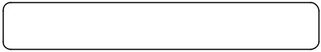
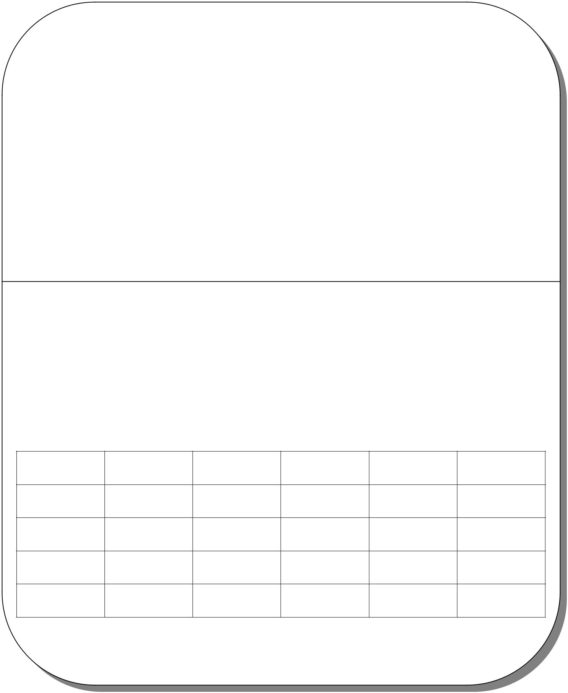

.. |image3| image:: bensikin/image5.png
   :width: 7.36111in
   :height: 5.61111in

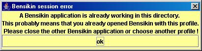
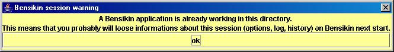
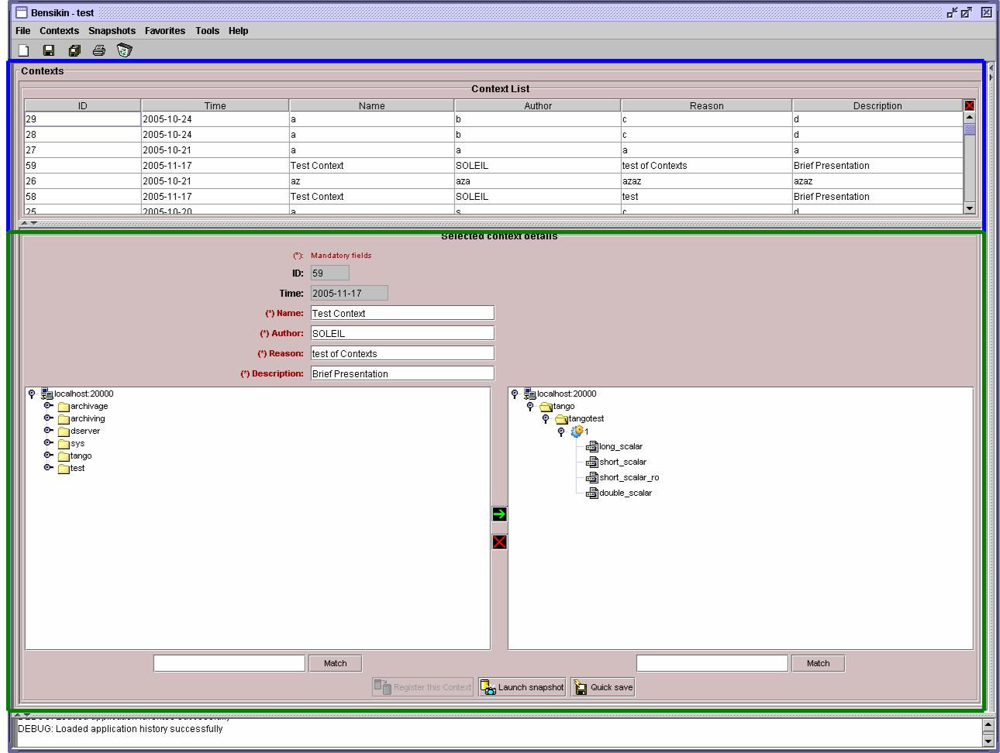
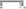

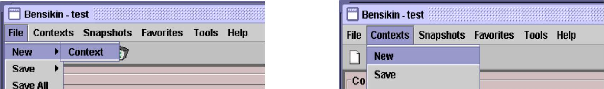

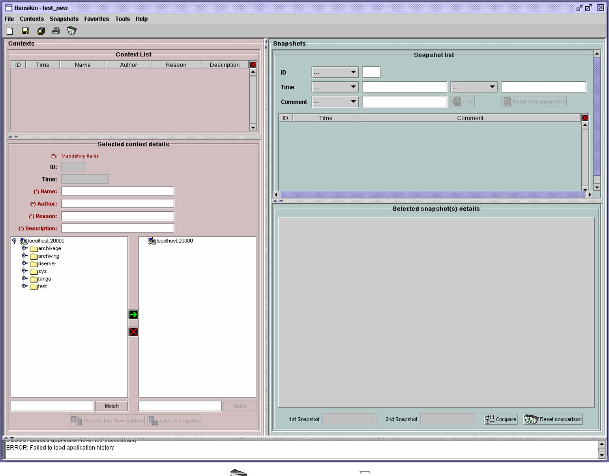

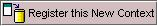

.. |image36| image:: bensikin/image39.jpeg
   :width: 0.12986in

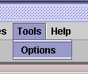
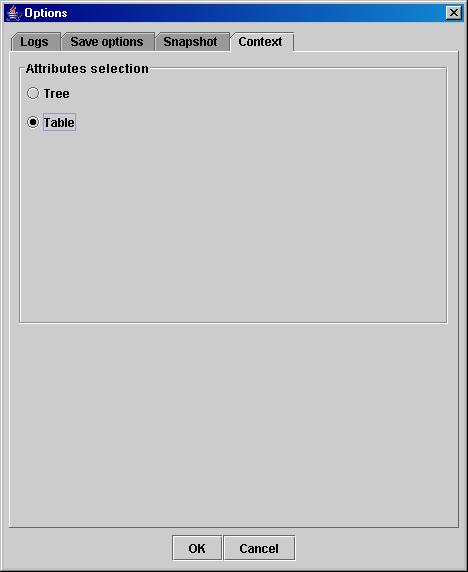
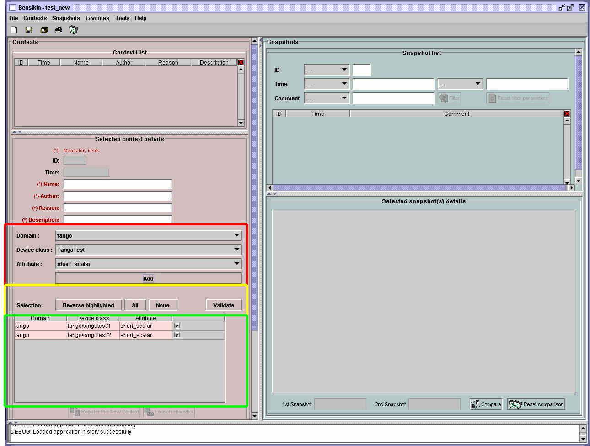

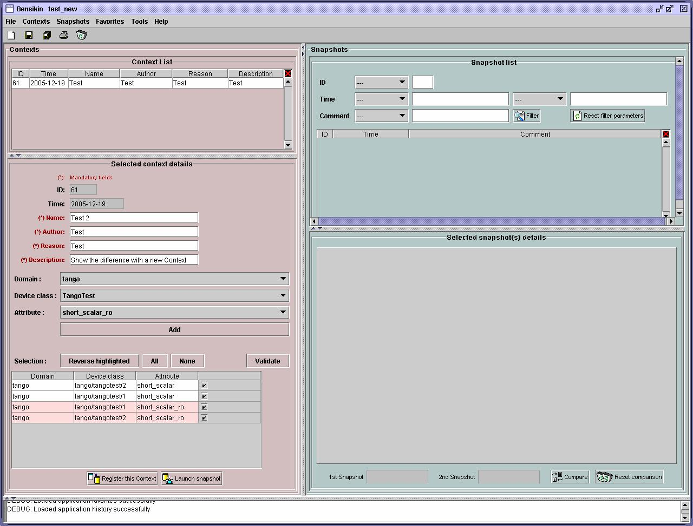
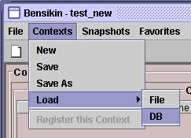
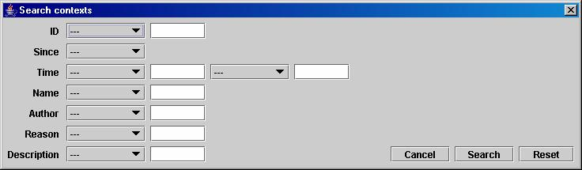
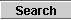

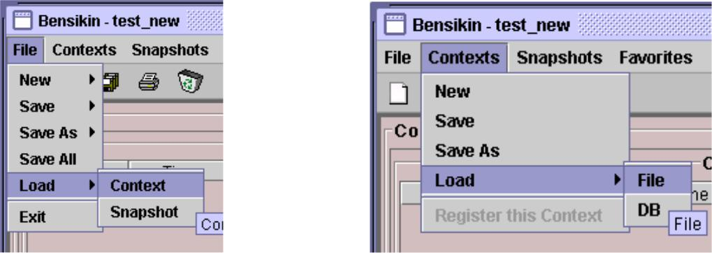

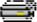

.. |image51| image:: bensikin/image55.jpeg
   :width: 0.12986in

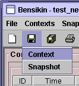
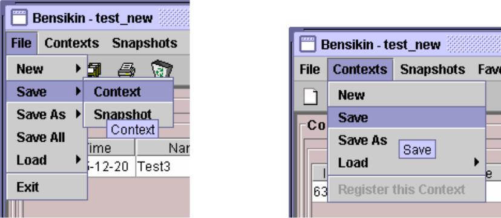
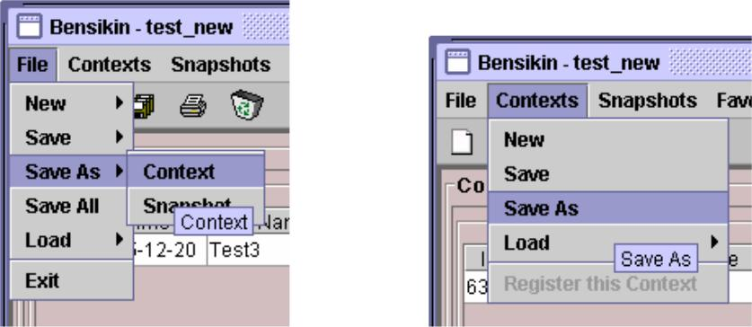
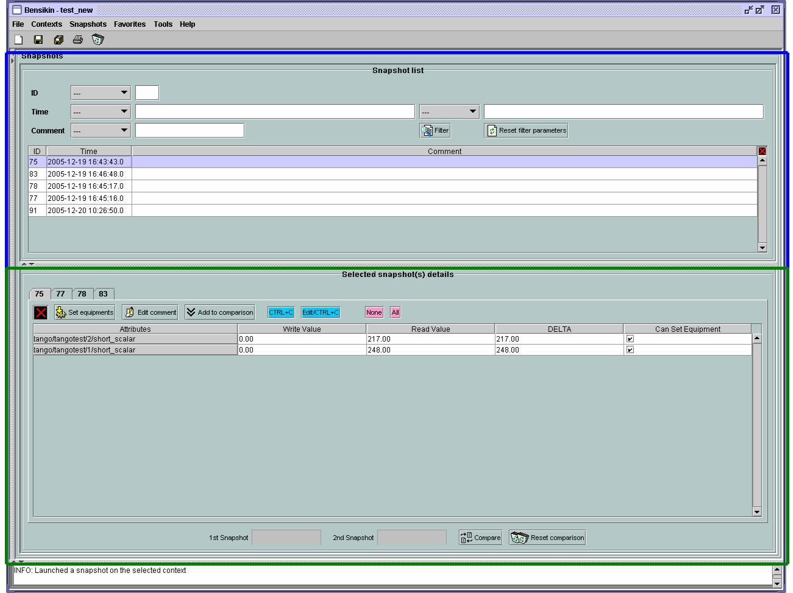

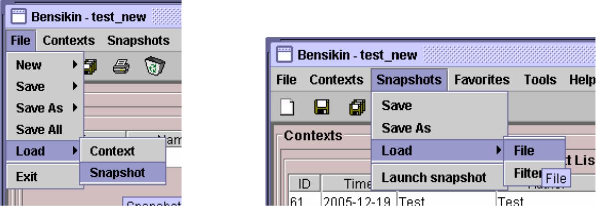

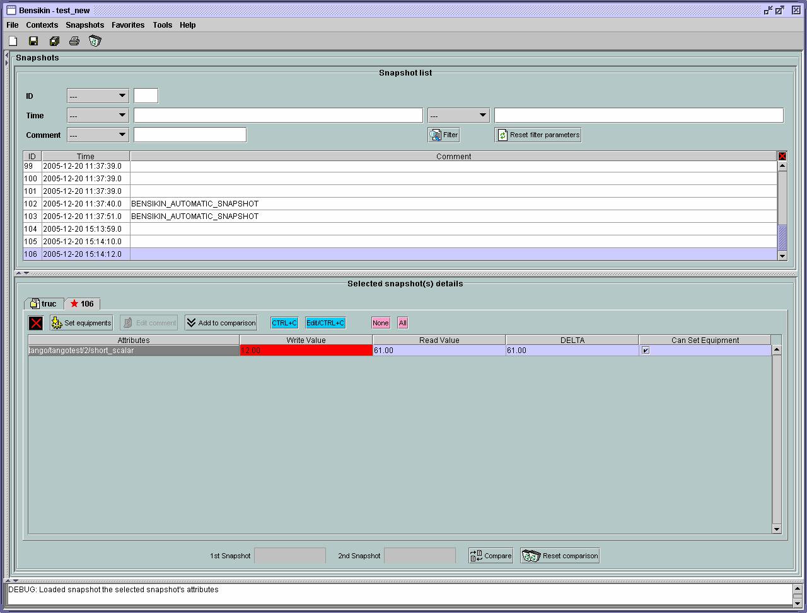
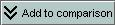
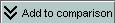
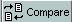
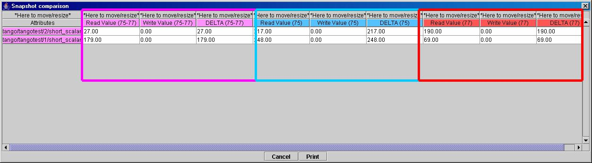
.. |image75| image:: bensikin/image79.jpeg
   :width: 1.29306in
   :height: 0.25347in
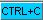

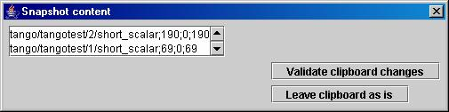
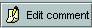

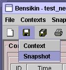
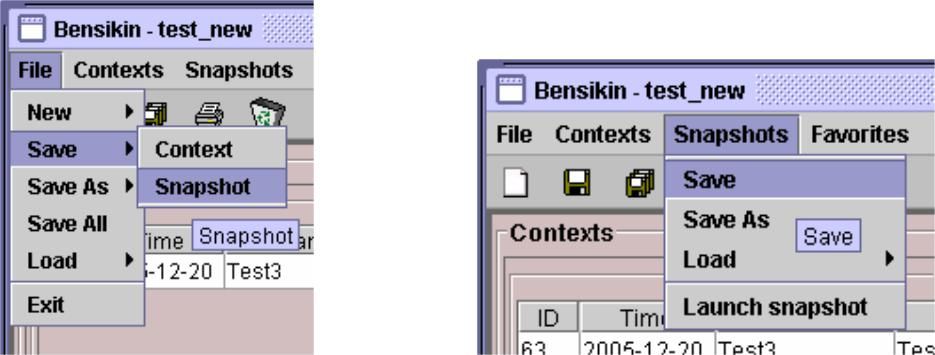
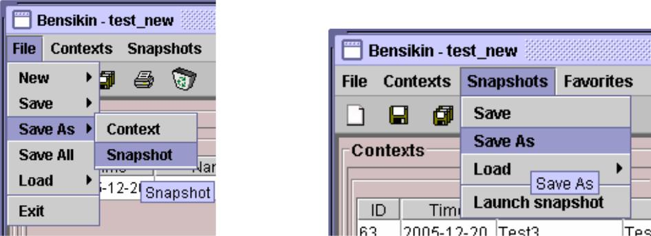
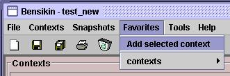
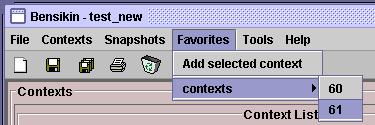

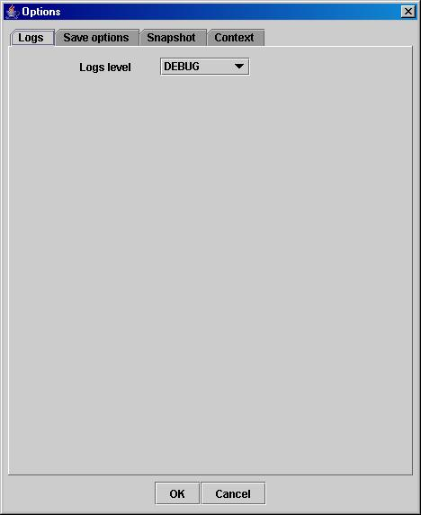
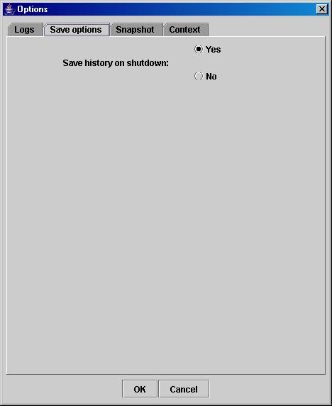
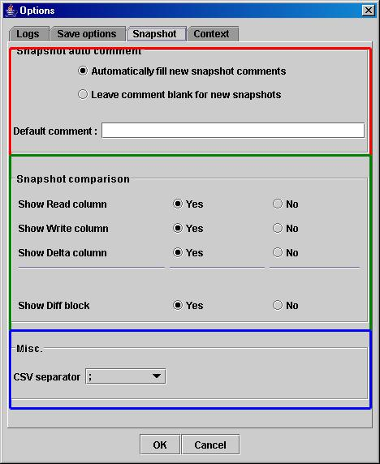

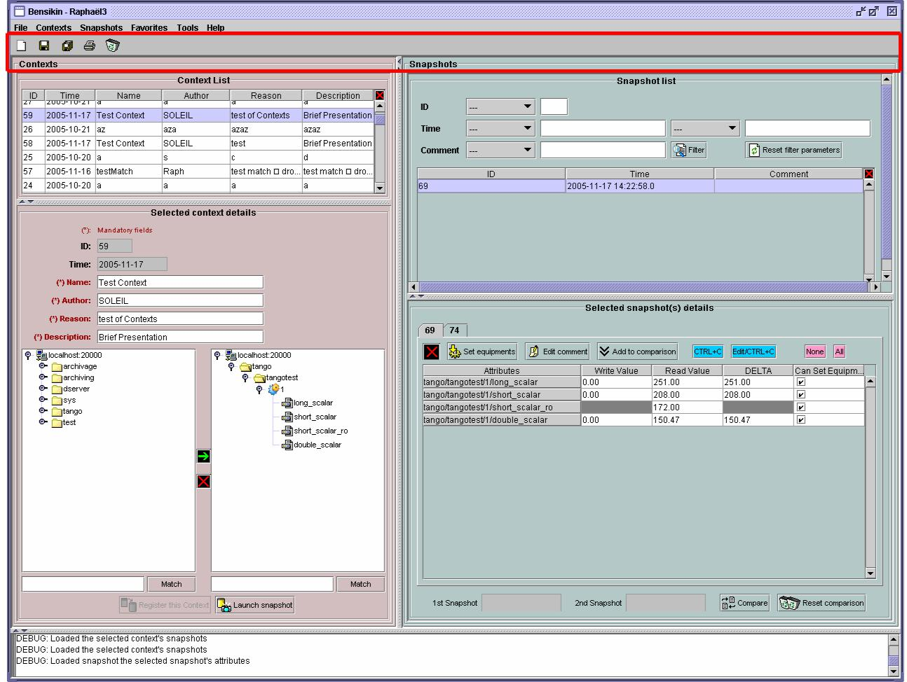

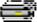

