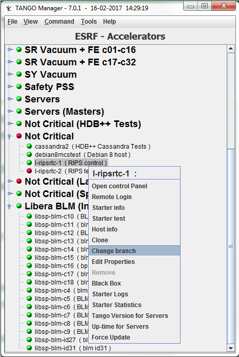
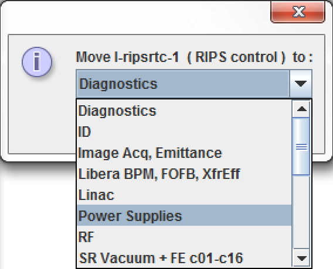

Tree Branch Management
----------------------

:audience:`administrators, developers`

* On the main window, the control system is displayed as a tree.
  Where the root is TANGO, the branch are hosts family and leaf are hosts.

* The host's family is defined by the Starter property called HostCollection.
  But it is easier to use cut and paste option on popup menu on host as follow:

  +----------+----------+
  | |image0| | |image1| |
  +----------+----------+

