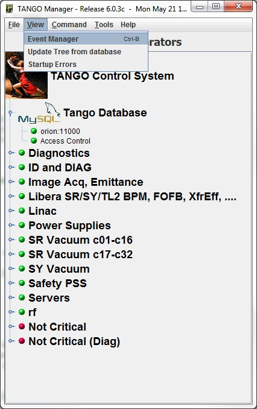
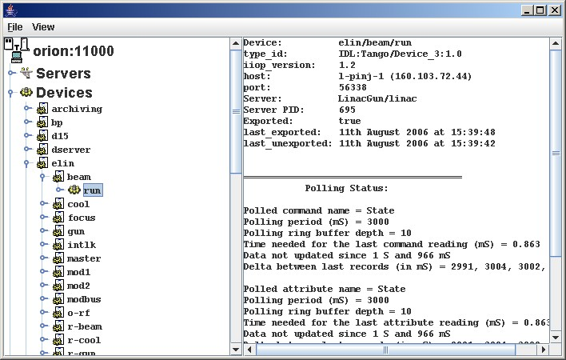
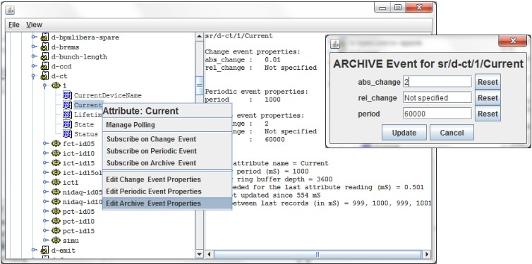
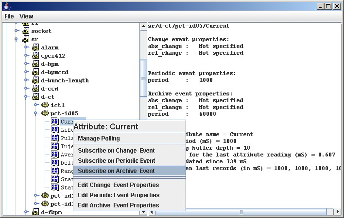
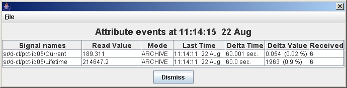

Event Manager
-------------

:audience:`administrators, developers`

Astor proposes to browse by server, by device or by alias.
It could be useful:

-  :ref:`to see information <info>`
-  :ref:`to configure events <config>`
-  :ref:`to manage polling <polling>`
-  :ref:`to check events <events>`

   |image0|

.. _`info`:

Server, Device or Alias information
~~~~~~~~~~~~~~~~~~~~~~~~~~~~~~~~~~~

   |image1|

.. _`config`:

Configure the events for specified attribute
~~~~~~~~~~~~~~~~~~~~~~~~~~~~~~~~~~~~~~~~~~~~

   |image2|

.. _`polling`:

Manage polling for Server, Device or Alias
~~~~~~~~~~~~~~~~~~~~~~~~~~~~~~~~~~~~~~~~~~

By a click on server or device menu, the :doc:`polling window <polling_window>` will be displayed.

.. _`events`:

Configure and Test events
~~~~~~~~~~~~~~~~~~~~~~~~~

By a click on attribute menu, the event tester window will be
displayed with event information.

   |image3|

   |image4|

