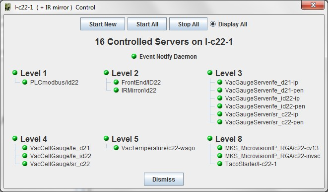
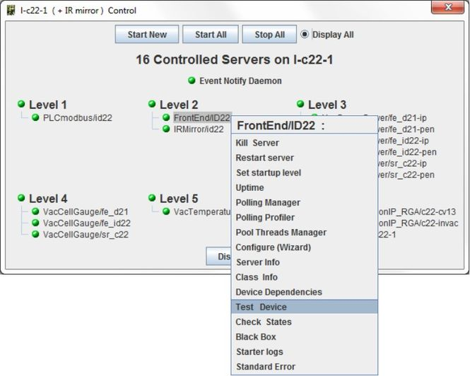

Host Status Window
------------------

:audience:`administrators, developers, users`

-  When a host window has been opened, all servers controlled on this
   host are displayed.
-  The color of the server define its state:

    +--------------------------------------------------------+
    | |image6| Server is running                             |
    +--------------------------------------------------------+
    | |image7| Server is running but not alive (Starting ?)  |
    +--------------------------------------------------------+
    | |image8| Server is not running.                        |
    +--------------------------------------------------------+
-  These servers are ordered by startup level.

|image0|

-  A popup menu will be displayed with a right click on a server to
   Start/stop/test... it.

|image1|

.. note::

    * It is possible to display "Not Controlled" servers if any.
    * These servers are not taken into account to compute host state.

   
   
   
.. Image definitions
   ------------------------

.. |image6| image:: img/greenbal.gif
.. |image7| image:: img/blueball.gif
.. |image8| image:: img/redball.gif
