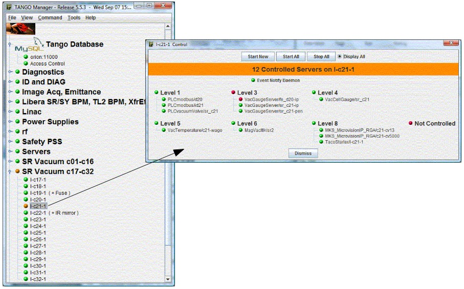

Introduction to Astor
---------------------

:audience:`administrators, developers, users`

Goal
~~~~

-  The first goal is to know at a quick glance, if everything is OK in a
   control system,
   and otherwise to be able to diagnose a problem and solve it.
-  The second goal is to configure the control system and its
   components.
-  The third goal is to have long term analysis on components (logs,
   statistics, usage,....)

Principle
~~~~~~~~~

- On each host to be controlled, a device server (called Starter_)
  takes care of all device servers running (or supposed to) on this computer.
- The controlled server list is read from the TANGO database.
- A graphical client (called Astor) is connected to all Starter servers and is able to:

  - Display the control system status and component status using
    coloured icons.
  - Execute actions on components (start, stop, test, configure,
    display information, ....
  - Execute diagnostics on components.
  - Execute global analysis on a large number of crates or database.

  |image0|

To control a host in remote, the TANGO device server Starter_ must be running on it.

.. warning::
   The starter device must have a specific name to be recognized by
   astor. This name must be **tango/admin/{hostname}** (e.g. *tango/admin/hal*).

|      
      
Running Astor
~~~~~~~~~~~~~

- :program:`Astor` is a **Java** program using **Swing** classes.
  Classes has been compiled and the jar file has been built whith :program:`java-1.7`.
- To start the application, start the script file:
  :command:`$TANGO_HOME/bin/astor`
- **There are 3 modes to start Astor:**
   +---------------+-----------------------------------------------------------------------------+
   |  Parameter    |   Mode                                                                      |
   +===============+=============================================================================+
   | -rw or none   | :program:`Astor` is fully **READ/WRITE**"                                   |
   +---------------+-----------------------------------------------------------------------------+
   | -db_ro        | :program:`Astor` is **READ/WRITE** but :program:`Database` is **READ_ONLY** |
   +---------------+-----------------------------------------------------------------------------+
   | -ro           | :program:`Astor` is fully **READ_ONLY**                                     |
   +---------------+-----------------------------------------------------------------------------+

   
Display
~~~~~~~

-  At startup, Astor display a tree where node could be a family of
   hosts (see Starter properties), and leaf are hosts where a Starter
   device server is registred in database.
-  The icon of the leaf depends on the controlled device servers status
   as the following definition:

   +-------------------------------------------------------------------------+
   | For Hosts                                                               |
   +=========================================================================+
   | |image1| All controlled servers are running.                            |
   +-------------------------------------------------------------------------+
   | |image2| Starter is starting  server(s).                                |
   +-------------------------------------------------------------------------+
   | |image3| At least, one controlled server is stopped and one is running. |
   +-------------------------------------------------------------------------+
   | |image4| All controlled servers are stopped.                            |
   +-------------------------------------------------------------------------+
   | |image5| Starter is not running on host.                                |
   +-------------------------------------------------------------------------+
    
   |

   +--------------------------------------------------------+
   | For Servers                                            |
   +========================================================+
   | |image6| Server is running                             |
   +--------------------------------------------------------+
   | |image7| Server is running but not alive (Starting ?)  |
   +--------------------------------------------------------+
   | |image8| Server is not running.                        |
   +--------------------------------------------------------+

Host Control
~~~~~~~~~~~~

|image9|

Source
~~~~~~~~~

You can download the project `here <https://bintray.com/tango-controls/maven/Astor/_latestVersion>`_

.. definitions
   --------------

.. _Starter:    http://www.esrf.fr/computing/cs/tango/tango_doc/ds_doc/tango-ds/System/starter/index.html
   
   
.. |image0| image:: img/Astor-Starter.gif
.. |image1| image:: img/greenbal.gif
.. |image2| image:: img/blueball.gif

.. |image4| image:: img/whiteball.gif

.. |image6| image:: img/greenbal.gif
.. |image7| image:: img/blueball.gif

