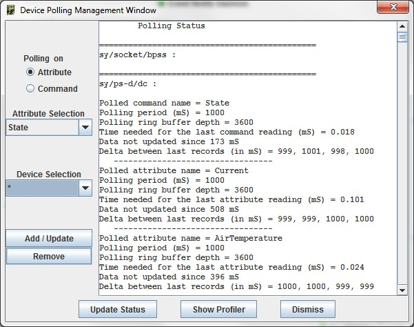
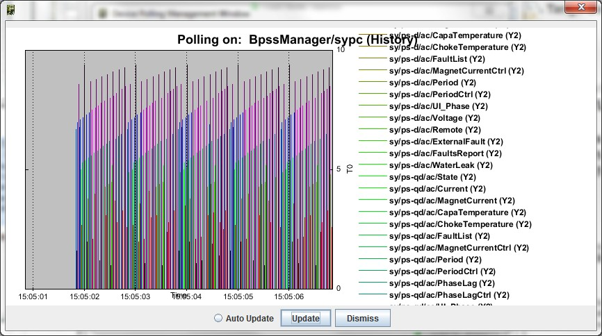
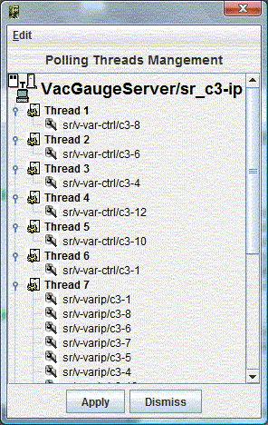

Polling Management
------------------

:audience:`administrators, developers`

A Tango device attribute can be polled periodically. To configure this polling,
a diagnostic tool is available. It displays when each attribute has been polled
the last four times (see following figure) and how much time was required to read
and set it.

It is very useful to tune the device attribute polling when a server has several
devices with many attributes each.

Or in case of a hardware problem with time out in reading.
This window could be popuped from :doc:`host window <host_window>` or from
:doc:`event manager <event_tester>`.

It display polling information for one or all attributes for one (or all) devices.

It allows to remove, add or change polling.

It allows to display polling graphically as a profiler.

  |image0|

  |image1|

Pool of polling threads
~~~~~~~~~~~~~~~~~~~~~~~

  +-----------------+------------------------------------------------------------------+
  | |image3|        | By default, a single thread is started to poll attributes.       |
  |                 |                                                                  |
  |                 | In case of several devices, a pool of threads is available.      |
  |                 |                                                                  |
  |                 | Astor proposes a graphic tool to distribute device(s) by thread. |
  |                 |                                                                  |
  |                 | Use drag and drop to configure the pool.                         |
  +-----------------+------------------------------------------------------------------+

