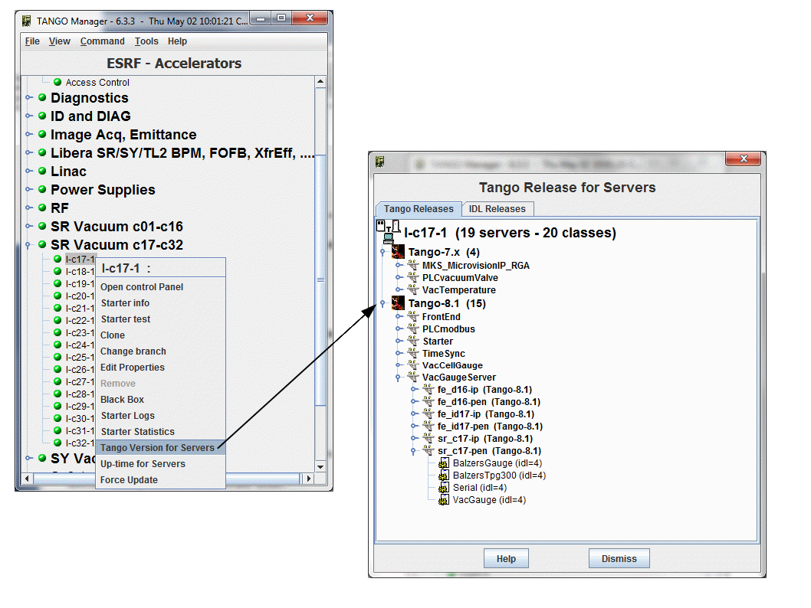

Server TANGO versions
---------------------

:audience:`administrators, developers`

On a host you can have an overview of TANGO version for servers

(See `TANGO releases history <http://www.tango-controls.org/about-us/>`_)

   |image0|

